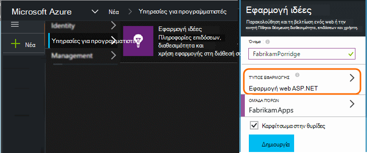
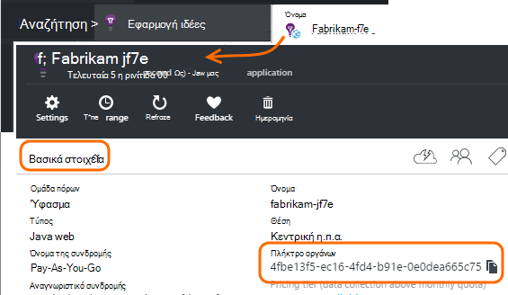

<properties 
    pageTitle="Διαχωρίστε τις ιδέες εφαρμογή πόρους για προγραμματιστές, δοκιμή και παραγωγής" 
    description="Παρακολουθείτε τις επιδόσεις και η χρήση της εφαρμογής σας σε διαφορετικά στάδια της ανάπτυξης" 
    services="application-insights" 
    documentationCenter=""
    authors="alancameronwills" 
    manager="douge"/>

<tags 
    ms.service="application-insights" 
    ms.workload="tbd" 
    ms.tgt_pltfrm="ibiza" 
    ms.devlang="na" 
    ms.topic="article" 
    ms.date="05/04/2016" 
    ms.author="awills"/>

# Διαχωριστικό πόρους ιδέες εφαρμογής

Θα πρέπει να το τηλεμετρίας από διάφορα στοιχεία και τις εκδόσεις της εφαρμογής σας να σταλεί σε διαφορετικούς πόρους εφαρμογής ιδέες ή συνδυάζονται σε μία; Σε αυτό το άρθρο θα εμφανίζεται στην καλύτερη πρακτικές και τις απαραίτητες τεχνικές.

Πρώτα, ας Κατανόηση ερώτηση. Τα δεδομένα που λαμβάνονται από την εφαρμογή σας αποθηκεύονται και υποβάλλονται σε επεξεργασία με εφαρμογή ιδέες σε Microsoft Azure *πόρων*. Κάθε πόρο προσδιορίζεται από ένα *πλήκτρο οργάνων* (iKey). Στην εφαρμογή σας, το πλήκτρο παρέχονται SDK ιδέες για την εφαρμογή, έτσι ώστε να στέλνει τα δεδομένα που συλλέγει το σωστό πόρο. Το κλειδί μπορεί να παρέχεται στο κώδικα ή στο ApplicationInsights.config. Αλλάζοντας το κλειδί στο SDK, μπορείτε να κατευθύνετε δεδομένων σε διαφορετικούς πόρους. 

Σε μια απλή περίπτωση, κατά τη δημιουργία του κώδικα για μια νέα εφαρμογή, δημιουργείτε επίσης ένα νέο πόρο στην εφαρμογή ιδέες. Στο Visual Studio, το παράθυρο διαλόγου *νέο έργο* το κάνει για εσάς.

Εάν πρόκειται για μια τοποθεσία Web μεγάλου όγκου, μπορεί να αναπτυχθεί σε περισσότερες από μία παρουσία διακομιστή.

Σε πιο σύνθετες σενάρια, έχετε ένα σύστημα που αποτελείται από πολλά στοιχεία - για παράδειγμα, μια τοποθεσία web και ένα πρόγραμμα επεξεργασίας παρασκηνίου. 

## Πότε να χρησιμοποιήσετε ξεχωριστό iKeys

Ακολουθούν ορισμένες γενικές οδηγίες:

* Όπου έχετε μια μονάδα ανεξάρτητη ανάπτυξης εφαρμογής που εκτελείται σε ένα σύνολο διακομιστή εμφανίσεις που μπορεί να κλιμακωθεί επάνω/κάτω ανεξάρτητα από τα άλλα στοιχεία, στη συνέχεια, που θα αντιστοίχιση που συνήθως με έναν πόρο - δηλαδή, θα έχει έναν αριθμό-κλειδί μία οργάνων (iKey).
* Αντίθετα, τους λόγους για τη χρήση ξεχωριστή iKeys περιλαμβάνουν:
 - Ανάγνωση εύκολα ξεχωριστή μετρικά από μεμονωμένα στοιχεία.
 - Διατηρείτε κάτω όγκου τηλεμετρίας ξεχωριστά από μεγάλου όγκου, έτσι ώστε να περιορισμού, όρια, και δειγματοληψία σε μία ροή δεν επηρεάζουν το άλλο.
 - Ξεχωριστές ειδοποιήσεις, εξαγωγή και ρυθμίσεις παραμέτρων στοιχείου εργασίας.
 - Ανακοίνωση [όρια](app-insights-pricing.md#limits-summary) , όπως τηλεμετρίας ορίου περιορισμού και web δοκιμή count.
 - Κωδικός στην περιοχή ανάπτυξης και δοκιμής θα πρέπει να στείλετε σε μια ξεχωριστή iKey από τη σήμανση παραγωγής.  

Πολλές ιδέες εφαρμογής πύλης εμπειρίες σχεδιάζονται με αυτές τις οδηγίες υπόψη. Για παράδειγμα, οι διακομιστές προβολή τμήματα στην παρουσία διακομιστή, καθιστώντας υπόθεση που τηλεμετρίας σχετικά με ένα στοιχείο λογική μπορεί να προέρχονται από πολλές παρουσίες διακομιστή.

## Μία iKey

Όταν στέλνετε τηλεμετρίας από πολλά στοιχεία σε ένα μεμονωμένο iKey:

* Προσθέστε μια ιδιότητα σε όλα τα τηλεμετρίας που σας επιτρέπει να τμήματος και να φιλτράρετε την ταυτότητα του στοιχείου. Το Αναγνωριστικό ρόλο προστίθεται αυτόματα τηλεμετρίας από παρουσίες του ρόλου server, αλλά σε άλλες περιπτώσεις μπορείτε να χρησιμοποιήσετε μια [τηλεμετρίας προετοιμασίας](app-insights-api-filtering-sampling.md#add-properties) για να προσθέσετε την ιδιότητα.
* Ενημερώστε την εφαρμογή SDK ιδέες στο τα διάφορα στοιχεία ταυτόχρονα. Θα πρέπει να προέρχονται τηλεμετρίας για μία iKey με την ίδια έκδοση του SDK.

## Ξεχωριστές iKeys

Όπου έχετε πολλές iKeys για διαφορετική εφαρμογή στοιχείων:

* Δημιουργία ενός [πίνακα εργαλείων](app-insights-dashboards.md) για προβολή του κλειδιού τηλεμετρίας από λογική την εφαρμογή σας, ένας συνδυασμός των στοιχείων άλλη εφαρμογή. Πίνακες εργαλείων μπορεί να είναι κοινόχρηστο, ώστε μια προβολή μόνο λογική συστήματος μπορούν να χρησιμοποιηθούν από διαφορετικές ομάδες.
* Οργανώστε [τις ομάδες πόρων](app-insights-resources-roles-access-control.md) σε επίπεδο ομάδας. Τα δικαιώματα πρόσβασης εκχωρούνται από ομάδα πόρων και αυτά περιλαμβάνουν δικαιώματα για να ρυθμίσετε τις ειδοποιήσεις. 
* Χρησιμοποιήστε [πρότυπα για τη διαχείριση πόρων Azure και του Powershell](app-insights-powershell.md) για να διαχειριστείτε αντικείμενα όπως ειδοποίησης κανόνες και δοκιμές στο web.

## Ξεχωριστές iKeys για προγραμματιστές/δοκιμή και παραγωγής

Για να κάνετε πιο εύκολη για να αλλάξετε τον αριθμό-κλειδί αυτόματα όταν κυκλοφορήσει την εφαρμογή σας, ορίστε το iKey στον κώδικα, αντί σε ApplicationInsights.config.

### Πλήκτρο δυναμικής οργάνων

Ορίστε τον αριθμό-κλειδί σε μια μέθοδο προετοιμασίας, όπως global.aspx.cs σε μια υπηρεσία ASP.NET:

*C#*

    protected void Application_Start()
    {
      Microsoft.ApplicationInsights.Extensibility.
        TelemetryConfiguration.Active.InstrumentationKey = 
          // - for example -
          WebConfigurationManager.AppSettings["ikey"];
      ...

Σε αυτό το παράδειγμα, το ikeys για τους πόρους διαφορετικές τοποθετούνται σε διαφορετικές εκδόσεις του αρχείου ρύθμισης παραμέτρων web. Το αρχείο ρύθμισης παραμέτρων web - που μπορείτε να κάνετε ως μέρος της δέσμης ενεργειών κυκλοφορίας - ανταλλαγή θα εναλλαγή τον πόρο προορισμού.

### Ιστοσελίδες

Το iKey χρησιμοποιείται επίσης σε ιστοσελίδες της εφαρμογής σας, στη [δέσμη ενεργειών που λάβατε από την blade γρήγορης εκκίνησης](app-insights-javascript.md). Αντί για κωδικοποίηση το ως έχουν στο τη δέσμη ενεργειών, δημιουργηθεί από την κατάσταση του διακομιστή. Για παράδειγμα, σε μια εφαρμογή ASP.NET:

*JavaScript σε Razor*

    <script type="text/javascript">
    // Standard Application Insights web page script:
    var appInsights = window.appInsights || function(config){ ...
    // Modify this part:
    }({instrumentationKey:  
      // Generate from server property:
      "@Microsoft.ApplicationInsights.Extensibility.
         TelemetryConfiguration.Active.InstrumentationKey"
    }) // ...

## Δημιουργία ενός πόρου πρόσθετες ιδέες εφαρμογής
  
Εάν αποφασίσετε να διαχωρίσετε τηλεμετρίας για στοιχεία διαφορετική εφαρμογή ή για διαφορετικές σημάνσεων (δοκιμής/ανάπτυξης/παραγωγή) του ίδιου στοιχείου, στη συνέχεια, θα πρέπει να δημιουργήσετε έναν νέο πόρο εφαρμογής ιδέες.

Στο [portal.azure.com](https://portal.azure.com), προσθέστε έναν πόρο ιδέες εφαρμογής:

* **Τύπος εφαρμογής** επηρεάζει αυτό που βλέπετε στην την επισκόπηση blade και τις ιδιότητες που είναι διαθέσιμες στην [Εξερεύνηση των μετρικό](app-insights-metrics-explorer.md). Εάν δεν βλέπετε τον τύπο της εφαρμογής, επιλέξτε έναν από τους τύπους web για σελίδες web.
* **Ομάδα πόρων** είναι εξυπηρέτηση για τη Διαχείριση ιδιοτήτων, όπως [τον έλεγχο πρόσβασης](app-insights-resources-roles-access-control.md). Μπορείτε να χρησιμοποιήσετε ομάδες ξεχωριστή πόρων για την ανάπτυξη, δοκιμή και παραγωγής.
* **Η συνδρομή** είναι το λογαριασμό πληρωμής στο Azure.
* **Θέση** είναι όπου θα σας να διατηρείτε τα δεδομένα σας. Προς το παρόν δεν μπορεί να αλλάξει. 
* **Προσθήκη στον πίνακα εργαλείων** συμπληρώνει ένα πλακίδιο γρήγορης πρόσβασης για τον πόρο στην Azure αρχική σελίδα σας. 

Δημιουργία του πόρου έπειτα από μερικά δευτερόλεπτα. Θα δείτε μια ειδοποίηση όταν γίνεται.

(Μπορείτε να συντάξετε μια [δέσμη ενεργειών του PowerShell](app-insights-powershell-script-create-resource.md) για να δημιουργήσετε αυτόματα έναν πόρο.)

## Γρήγορα τον αριθμό-κλειδί οργάνων

Το κλειδί οργάνων προσδιορίζει τον πόρο που δημιουργήσατε. 

Χρειάζεστε τα πλήκτρα οργάνων από όλους τους πόρους στο οποίο την εφαρμογή σας θα αποστολή δεδομένων.

 
