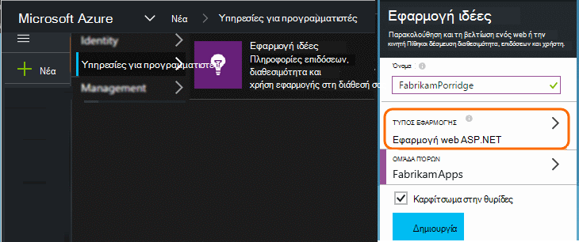
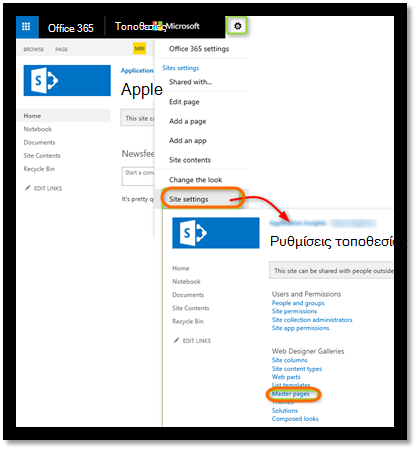
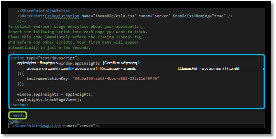
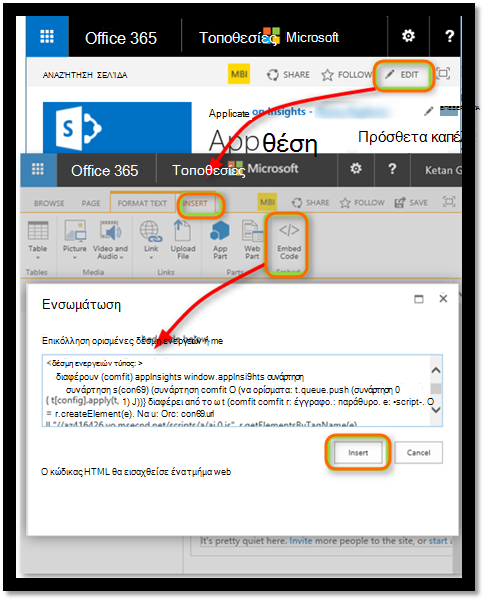
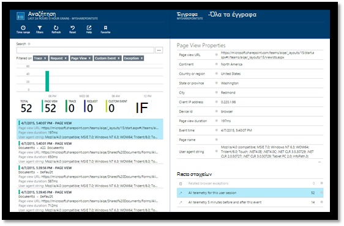
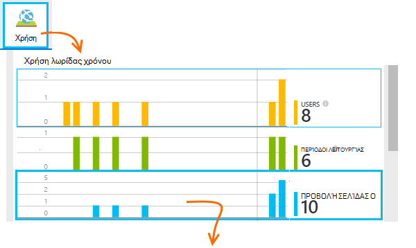
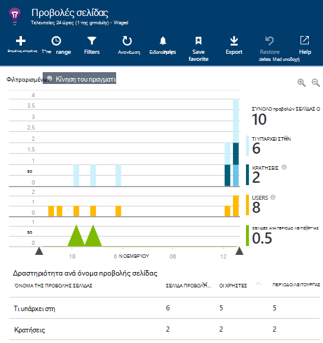
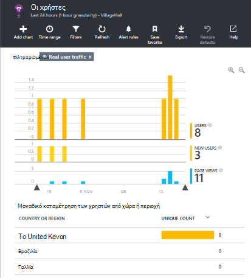
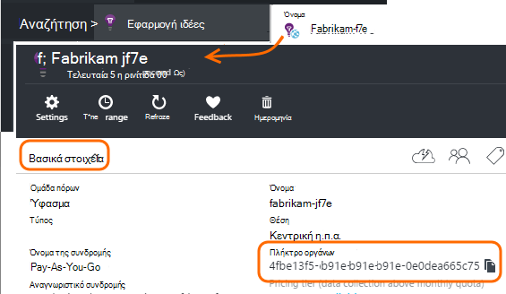

<properties 
    pageTitle="Παρακολούθηση μιας τοποθεσίας του SharePoint με ιδέες εφαρμογής" 
    description="Έναρξη παρακολούθησης μια νέα εφαρμογή με ένα νέο αριθμό-κλειδί οργάνων" 
    services="application-insights" 
    documentationCenter=""
    authors="alancameronwills" 
    manager="douge"/>

<tags 
    ms.service="application-insights" 
    ms.workload="tbd" 
    ms.tgt_pltfrm="ibiza" 
    ms.devlang="na" 
    ms.topic="article" 
    ms.date="03/24/2016" 
    ms.author="awills"/>

# <a name="monitor-a-sharepoint-site-with-application-insights"></a>Παρακολούθηση μιας τοποθεσίας του SharePoint με ιδέες εφαρμογής


Visual Studio εφαρμογή ιδέες παρακολουθεί τη διαθεσιμότητα, επιδόσεων και χρήση από τις εφαρμογές σας. Εδώ θα μάθετε πώς μπορείτε να ρυθμίσετε για χρήση με μια τοποθεσία του SharePoint.


## <a name="create-an-application-insights-resource"></a>Δημιουργία ενός πόρου ιδέες εφαρμογής


Στην [πύλη του Azure](https://portal.azure.com), δημιουργήστε ένα νέο πόρο εφαρμογής ιδέες. Επιλέξτε ASP.NET ως ο τύπος της εφαρμογής.




Το blade που ανοίγει είναι το σημείο όπου θα δείτε δεδομένα απόδοσης και χρήσης σχετικά με την εφαρμογή σας. Για να επιστρέψετε στο την επόμενη φορά που θα συνδεθείτε σε Azure, πρέπει να βρείτε ένα πλακίδιο για την στην οθόνη έναρξης. Εναλλακτικά, κάντε κλικ στο κουμπί Αναζήτηση για να το βρείτε.
    


## <a name="add-our-script-to-your-web-pages"></a>Προσθήκη μας δέσμης ενεργειών σε ιστοσελίδες σας

Στη Γρήγορη εκκίνηση, λάβετε τη δέσμη ενεργειών για σελίδες web:


Εισαγάγετε τη δέσμη ενεργειών πριν από την &lt;/κεντρικών&gt; ετικέτα κάθε σελίδας που θέλετε να παρακολουθήσετε. Εάν η τοποθεσία Web σας έχει μια κύρια σελίδα, μπορείτε να τοποθετήσετε τη δέσμη ενεργειών εκεί. Για παράδειγμα, σε ένα έργο ASP.NET MVC, μπορείτε να τοποθετήσετε σε View\Shared\_Layout.cshtml

Η δέσμη ενεργειών περιέχει το κλειδί οργάνων που κατευθύνει το τηλεμετρίας για τον πόρο εφαρμογής ιδέες.

### <a name="add-the-code-to-your-site-pages"></a>Προσθήκη του κώδικα σελίδες της τοποθεσίας σας

#### <a name="on-the-master-page"></a>Στην κύρια σελίδα

Εάν μπορείτε να επεξεργαστείτε την κύρια σελίδα της τοποθεσίας, που παρέχει παρακολούθηση για κάθε σελίδα της τοποθεσίας.

Ανατρέξτε στο θέμα της κύριας σελίδας και επεξεργαστείτε χρησιμοποιώντας το SharePoint Designer ή οποιοδήποτε άλλο πρόγραμμα επεξεργασίας.




Προσθήκη του κώδικα αμέσως πριν από την </head> ετικέτα. 




#### <a name="or-on-individual-pages"></a>Ή σε μεμονωμένες σελίδες

Για να παρακολουθήσετε ένα περιορισμένο σύνολο των σελίδων, προσθέστε τη δέσμη ενεργειών ξεχωριστά σε κάθε σελίδα. 

Εισαγωγή ενός τμήματος web και να ενσωματώσετε το τμήμα κώδικα σε αυτό.





## <a name="view-data-about-your-app"></a>Προβολή δεδομένων σχετικά με την εφαρμογή σας

Αναπτύξτε ξανά την εφαρμογή σας.

Επιστροφή στο σας blade εφαρμογής στην [πύλη του Azure](https://portal.azure.com).

Η πρώτη συμβάντα θα εμφανίζεται στο πλαίσιο Αναζήτηση. 



Εάν αναμένεται περισσότερα δεδομένα, κάντε κλικ στην επιλογή Ανανέωση μετά από μερικά δευτερόλεπτα.

Η επισκόπηση blade, κάντε κλικ στην επιλογή **αναλυτικών στοιχείων χρήσης** για να δείτε σε γραφήματα χρήστες, περιόδους λειτουργίας και προβολές σελίδας:



Κάντε κλικ σε οποιοδήποτε γράφημα για να δείτε περισσότερες λεπτομέρειες - για παράδειγμα προβολές σελίδας:



Ή τους χρήστες:





## <a name="capturing-user-id"></a>Καταγραφή αναγνωριστικό χρήστη


Το τμήμα κώδικα βασική σελίδα web δεν καταγράψετε το αναγνωριστικό χρήστη από το SharePoint, αλλά μπορείτε να το κάνετε με μια μικρή τροποποίηση.


1. Αντιγράψτε το κλειδί οργάνων της εφαρμογής σας από τα βασικά στοιχεία για την αναπτυσσόμενη λίστα στην εφαρμογή ιδέες. 


    

2. Αντικαταστήστε το κλειδί οργάνων 'XXXX' στο το παρακάτω τμήμα κώδικα. 
3. Ενσωμάτωση τη δέσμη ενεργειών στην εφαρμογή SharePoint αντί για το τμήμα κώδικα που λαμβάνετε από την πύλη.


```


<SharePoint:ScriptLink ID="ScriptLink1" name="SP.js" runat="server" localizable="false" loadafterui="true" /> 
<SharePoint:ScriptLink ID="ScriptLink2" name="SP.UserProfiles.js" runat="server" localizable="false" loadafterui="true" /> 
  
<script type="text/javascript"> 
var personProperties; 
  
// Ensure that the SP.UserProfiles.js file is loaded before the custom code runs. 
SP.SOD.executeOrDelayUntilScriptLoaded(getUserProperties, 'SP.UserProfiles.js'); 
  
function getUserProperties() { 
    // Get the current client context and PeopleManager instance. 
    var clientContext = new SP.ClientContext.get_current(); 
    var peopleManager = new SP.UserProfiles.PeopleManager(clientContext); 
     
    // Get user properties for the target user. 
    // To get the PersonProperties object for the current user, use the 
    // getMyProperties method. 
    
    personProperties = peopleManager.getMyProperties(); 
  
    // Load the PersonProperties object and send the request. 
    clientContext.load(personProperties); 
    clientContext.executeQueryAsync(onRequestSuccess, onRequestFail); 
} 
     
// This function runs if the executeQueryAsync call succeeds. 
function onRequestSuccess() { 
var appInsights=window.appInsights||function(config){
function s(config){t[config]=function(){var i=arguments;t.queue.push(function(){t[config].apply(t,i)})}}var t={config:config},r=document,f=window,e="script",o=r.createElement(e),i,u;for(o.src=config.url||"//az416426.vo.msecnd.net/scripts/a/ai.0.js",r.getElementsByTagName(e)[0].parentNode.appendChild(o),t.cookie=r.cookie,t.queue=[],i=["Event","Exception","Metric","PageView","Trace"];i.length;)s("track"+i.pop());return config.disableExceptionTracking||(i="onerror",s("_"+i),u=f[i],f[i]=function(config,r,f,e,o){var s=u&&u(config,r,f,e,o);return s!==!0&&t["_"+i](config,r,f,e,o),s}),t
    }({
        instrumentationKey:"XXXX"
    });
    window.appInsights=appInsights;
    appInsights.trackPageView(document.title,window.location.href, {User: personProperties.get_displayName()});
} 
  
// This function runs if the executeQueryAsync call fails. 
function onRequestFail(sender, args) { 
} 
</script> 


```


## <a name="next-steps"></a>Επόμενα βήματα

* [Δοκιμές web](app-insights-monitor-web-app-availability.md) για την παρακολούθηση της τη διαθεσιμότητα της τοποθεσίας σας.

* [Εφαρμογή ιδέες](app-insights-overview.md) για τους άλλους τύπους της εφαρμογής.


<!--Link references-->


 