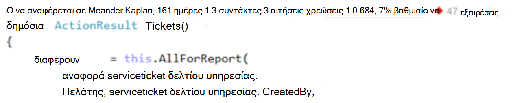
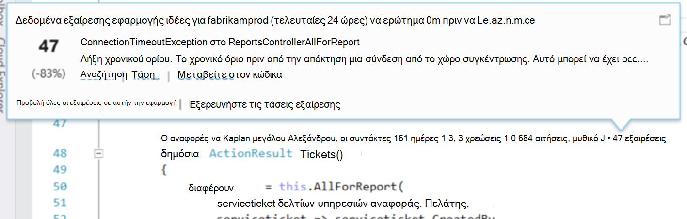
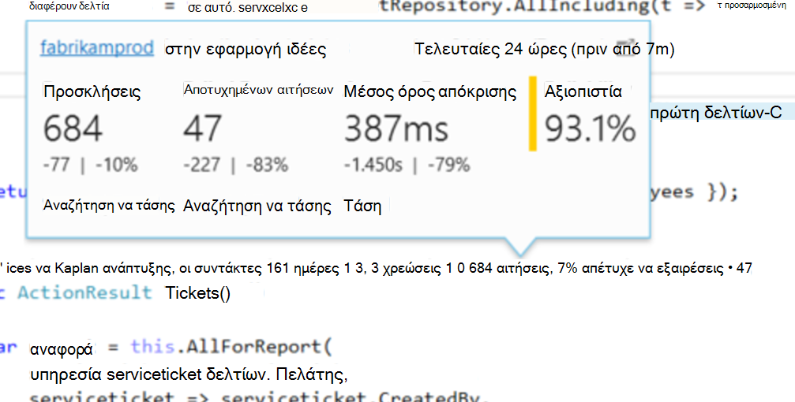
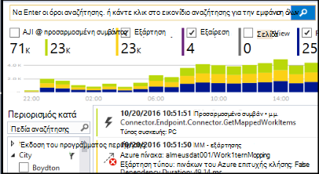

<properties 
    pageTitle="Εφαρμογή ιδέες τηλεμετρίας στο Visual Studio CodeLens | Microsoft Azure" 
    description="Γρήγορη πρόσβαση σε σας τηλεμετρίας αίτησης και εξαίρεση εφαρμογής ιδέες με CodeLens στο Visual Studio." 
    services="application-insights" 
    documentationCenter=".net"
    authors="numberbycolors" 
    manager="douge"/>

<tags 
    ms.service="application-insights" 
    ms.workload="tbd" 
    ms.tgt_pltfrm="ibiza" 
    ms.devlang="na" 
    ms.topic="get-started-article" 
    ms.date="08/30/2016" 
    ms.author="daviste"/>
    
# Εφαρμογή ιδέες τηλεμετρίας στο Visual Studio CodeLens

Μέθοδοι στον κώδικα της εφαρμογής web μπορεί να περιέχει σχόλια με τηλεμετρίας σχετικά με τις εξαιρέσεις χρόνου εκτέλεσης και να ζητήσετε χρόνους απόκρισης. Εάν εγκαταστήσετε το [Visual Studio εφαρμογή ιδέες](app-insights-overview.md) στην εφαρμογή σας, η τηλεμετρίας εμφανίζεται στο Visual Studio [CodeLens](https://msdn.microsoft.com/library/dn269218.aspx) - τις σημειώσεις στο επάνω μέρος κάθε συνάρτηση όπου έχετε συνηθίσει να βλέπω χρήσιμες πληροφορίες, όπως τον αριθμό των τοποθετεί τη συνάρτηση γίνεται αναφορά ή το τελευταίο άτομο που επεξεργασία της.

> [AZURE.NOTE] Εφαρμογή ιδέες στο CodeLens είναι διαθέσιμη στο Visual Studio 2015 ενημέρωση 3 και νεότερες εκδόσεις, ή με την πιο πρόσφατη έκδοση της [επέκτασης εργαλεία ανάλυσης για προγραμματιστές](https://visualstudiogallery.msdn.microsoft.com/82367b81-3f97-4de1-bbf1-eaf52ddc635a). CodeLens είναι διαθέσιμη στις εκδόσεις για μεγάλες επιχειρήσεις και Professional του Visual Studio.

## Πού θα βρείτε ιδέες εφαρμογή δεδομένων

Αναζητήστε την εφαρμογή ιδέες τηλεμετρίας σε τις ενδείξεις CodeLens από τις μεθόδους δημόσια αίτηση της εφαρμογής σας web. Δείκτες CodeLens εμφανίζονται επάνω από τη μέθοδο και άλλες δηλώσεις κώδικα C# και Visual Basic. Εάν είναι διαθέσιμα για μια μέθοδο δεδομένα εφαρμογής ιδέες, θα δείτε δείκτες για αιτήσεις και οι εξαιρέσεις όπως "αιτήσεις 100, 1% απέτυχε" ή "10." Κάντε κλικ σε μια ένδειξη CodeLens για περισσότερες λεπτομέρειες. 

> [AZURE.TIP] Αίτηση για εφαρμογή ιδέες και δείκτες εξαίρεση ενδέχεται να χρειαστούν μερικά δευτερόλεπτα επιπλέον για να φορτώσετε αφού άλλες δείκτες CodeLens εμφανίζονται.

## Εξαιρέσεις σε CodeLens

Ο δείκτης CodeLens εξαίρεση εμφανίζει τον αριθμό των εξαιρέσεις που έχουν προκύψει τις τελευταίες 24 ώρες από το 15 πιο συχνά που μεσολαβούν εξαιρέσεις στην εφαρμογή σας κατά τη διάρκεια αυτής της περιόδου, κατά την επεξεργασία της αίτησης εξυπηρέτησης από τη μέθοδο.

Για να δείτε περισσότερες λεπτομέρειες, κάντε κλικ στην ένδειξη CodeLens εξαιρέσεις:

* Το ποσοστό μεταβολής σε αριθμό εξαιρέσεις από τις πιο πρόσφατες 24 ώρες σε σχέση με την προηγούμενη 24 ώρες
* Επιλέξτε **Μετάβαση σε κώδικα** για να μεταβείτε σε τον πηγαίο κώδικα για τη συνάρτηση αποστελλόμενο την εξαίρεση
* Επιλέξτε **Αναζήτηση** ερώτημα για όλες τις εμφανίσεις της η εξαίρεση αυτή που έχουν προκύψει τις τελευταίες 24 ώρες
* Επιλέξτε **Trend** , για να προβάλετε μια απεικόνιση τάσης για τις εμφανίσεις της η εξαίρεση αυτή τις τελευταίες 24 ώρες
* Επιλέξτε την **Προβολή όλες οι εξαιρέσεις σε αυτήν την εφαρμογή** ερώτημα για όλες τις εξαιρέσεις που έχουν προκύψει τις τελευταίες 24 ώρες
* Επιλέξτε **Εξερεύνηση εξαίρεση τάσεις** για να προβάλετε μια απεικόνιση τάσης για όλες τις εξαιρέσεις που έχουν προκύψει τις τελευταίες 24 ώρες. 

> [AZURE.TIP] Εάν βλέπετε "0 εξαιρέσεις" στο CodeLens αλλά γνωρίζετε ότι θα πρέπει να υπάρχουν εξαιρέσεις, ελέγξτε για να βεβαιωθείτε ότι είναι επιλεγμένο το σωστό πόρο ιδέες εφαρμογή στο CodeLens. Για να επιλέξετε έναν άλλο πόρο, κάντε δεξί κλικ στο έργο σας στην Εξερεύνηση λύσεων και επιλέξτε **ιδέες εφαρμογής > Επιλογή αρχείου προέλευσης Τηλεμετρίας**. CodeLens εμφανίζεται μόνο για το 15 περισσότερες εξαιρέσεις που επαναλαμβάνεται συχνότερα στην εφαρμογή τις τελευταίες 24 ώρες, επομένως, αν η εξαίρεση είναι πιο συχνά τις 16 ή μικρότερη, θα δείτε "0 εξαιρέσεις." Εξαιρέσεις από τις προβολές ASP.NET ενδέχεται να μην εμφανίζονται σχετικά με τις μεθόδους ελεγκτή που δημιούργησε αυτές τις προβολές.

> [AZURE.TIP] Εάν βλέπετε "; Εξαιρέσεις"στο CodeLens, πρέπει να συσχετίσετε Azure το λογαριασμό σας με το Visual Studio ή σας διαπιστευτηρίων λογαριασμός Azure ενδέχεται να έχει λήξει. Σε κάθε περίπτωση, κάντε κλικ στην επιλογή "; Εξαιρέσεις"και επιλέξτε **Προσθήκη λογαριασμού...** για να εισαγάγετε τα διαπιστευτήριά σας.

## Προσκλήσεις σε CodeLens

Η πρόσκληση σε ένδειξη CodeLens εμφανίζει τον αριθμό των αιτήσεων HTTP που έχουν τεχνική υποστήριξη από μια μέθοδο σε τις τελευταίες 24 ώρες, καθώς και το ποσοστό από αυτές τις αιτήσεις που απέτυχε.

Για να δείτε περισσότερες λεπτομέρειες, κάντε κλικ στην επιλογή τις αιτήσεις CodeLens ένδειξη:

* Οι αλλαγές απόλυτη και ποσοστό στον αριθμό των αιτήσεων, αποτυχημένων αιτήσεων και χρόνους Μέσος όρος απόκρισης επάνω από τις τελευταίες 24 ώρες σε σύγκριση με την προηγούμενη 24 ώρες
* Την αξιοπιστία των τη μέθοδο, υπολογίζεται ως το ποσοστό των αιτήσεων που δεν αποτύχει τις τελευταίες 24 ώρες
* Επιλέξτε **Αναζήτηση** για αιτήσεις ή αποτυχίας αιτήσεις ερώτημα για όλες τις αιτήσεις (εσφαλμένους) που έγιναν τις τελευταίες 24 ώρες
* Επιλέξτε **Trend** , για να προβάλετε μια απεικόνιση τάσης για αιτήσεις, αποτυχημένων αιτήσεων ή χρόνους Μέσος όρος απόκρισης τις τελευταίες 24 ώρες.
* Επιλέξτε το όνομα του πόρου ιδέες εφαρμογών στην επάνω αριστερή γωνία της CodeLens Λεπτομέρειες προβολής για να αλλάξετε τον πόρο που είναι η προέλευση δεδομένων CodeLens.

## Επόμενα βήματα

||
|---|---
|**[Εργασία με εφαρμογή ιδέες στο Visual Studio](app-insights-visual-studio.md)** Αναζήτηση τηλεμετρίας, δείτε δεδομένα σε CodeLens και ρύθμιση παραμέτρων εφαρμογής ιδέες. Όλα αυτά μέσα σε Visual Studio. |
|**[Προσθήκη περισσότερων δεδομένων](app-insights-asp-net-more.md)** Παρακολούθηση χρήσης, διαθεσιμότητα, εξαρτήσεις, εξαιρέσεις. Ενοποίηση ανιχνεύσεις από καταγραφή πλαισίων. Γράψτε προσαρμοσμένο τηλεμετρίας. | 
|**[Εργασία με την πύλη ιδέες εφαρμογής](app-insights-dashboards.md)** Πίνακες εργαλείων, ισχυρά εργαλεία διαγνωστικών και ανάλυσης, ειδοποιήσεις, ένα χάρτη ζωντανή εξάρτηση από την εφαρμογή, και την εξαγωγή τηλεμετρίας. |
