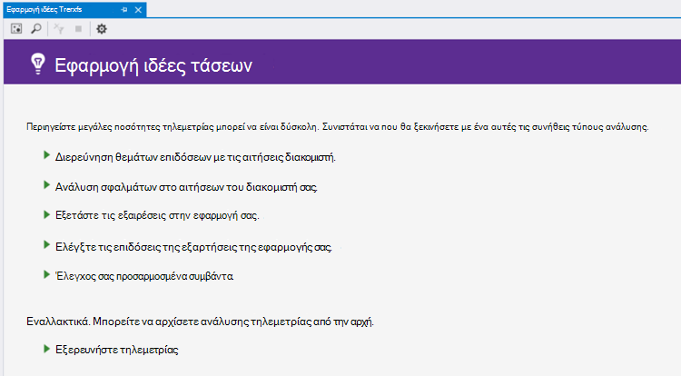
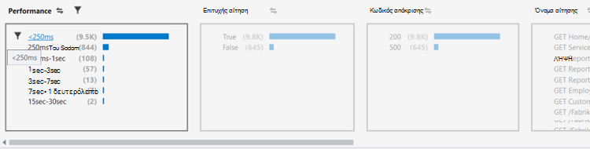
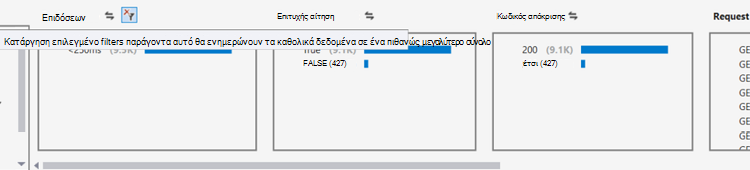
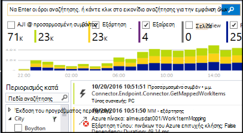
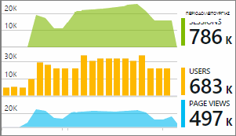

<properties 
    pageTitle="Ανάλυση τάσεων στο Visual Studio | Microsoft Azure" 
    description="Ανάλυση, απεικόνιση και Εξερεύνηση τάσεις σε σας τηλεμετρίας ιδέες εφαρμογή στο Visual Studio." 
    services="application-insights" 
    documentationCenter=".net"
    authors="numberbycolors" 
    manager="douge"/>

<tags 
    ms.service="application-insights" 
    ms.workload="tbd" 
    ms.tgt_pltfrm="ibiza" 
    ms.devlang="na" 
    ms.topic="get-started-article" 
    ms.date="10/25/2016" 
    ms.author="daviste"/>
    
# Ανάλυση τάσεων στο Visual Studio

Το εργαλείο τάσεις ιδέες εφαρμογή απεικονίζει τον τρόπο της εφαρμογής σας σημαντικές τηλεμετρίας αλλάζουν συμβάντα διάρκεια του χρόνου, βοηθώντας σας να εντοπίζουν γρήγορα προβλήματα και ανωμαλίες. Με τη σύνδεση που για πιο λεπτομερείς πληροφορίες διαγνωστικών, τάσεις μπορεί να σας βοηθήσει βελτίωση της απόδοσης της εφαρμογής σας, να εντοπίσετε τις αιτίες εξαιρέσεις και αποκαλύψετε πληροφορίες από τα προσαρμοσμένα συμβάντα σας.

> [AZURE.NOTE] Τάσεις ιδέες εφαρμογής είναι διαθέσιμη στο Visual Studio 2015 ενημέρωση 3 και νεότερες εκδόσεις, ή με την έκδοση [Εργαλεία ανάλυσης για προγραμματιστές επέκταση](https://visualstudiogallery.msdn.microsoft.com/82367b81-3f97-4de1-bbf1-eaf52ddc635a) 5.209 και νεότερες εκδόσεις.

## Άνοιγμα εφαρμογής ιδέες τάσεων

Για να ανοίξετε το παράθυρο τάσεις ιδέες εφαρμογής:

* Από το κουμπί της γραμμής εργαλείων εφαρμογής ιδέες, επιλέξτε **Εξερεύνηση τάσεις Τηλεμετρίας**, ή
* Από το μενού περιβάλλοντος έργου, επιλέξτε το στοιχείο **ιδέες εφαρμογής > Εξερεύνηση τάσεις Τηλεμετρίας**, ή
* Από τη γραμμή μενού του Visual Studio, επιλέξτε το στοιχείο **Προβολή > άλλες Windows > τάσεις ιδέες εφαρμογής**.

Μπορείτε να δείτε ένα μήνυμα για να επιλέξετε έναν πόρο. Κάντε κλικ στην επιλογή **Επιλέξτε έναν πόρο**, συνδεθείτε με μια συνδρομή του Azure και κατόπιν επιλέξτε έναν πόρο ιδέες εφαρμογή από τη λίστα για την οποία θέλετε να αναλύσετε τάσεις τηλεμετρίας.

## Επιλέξτε μια ανάλυση τάσης

Γρήγορα αποτελέσματα, επιλέγοντας μία από τις πέντε συνήθεις αναλύσεις τάσης, κάθε ανάλυση δεδομένων από τις τελευταίες 24 ώρες:

* **Θέματα απόδοσης Investigate με το διακομιστή αιτήσεις** - αιτήσεις σε υπηρεσία, ομαδοποιημένα κατά χρόνους απόκρισης
* **Ανάλυση σφάλματα στις προσκλήσεις διακομιστή σε** - αιτήσεις σε υπηρεσία, ομαδοποιημένα κατά κώδικας απόκρισης HTTP
* **Εξετάστε τις εξαιρέσεις στην εφαρμογή** - εξαιρέσεις από την υπηρεσία, ομαδοποιημένα κατά Τύπος εξαίρεσης
* **Ελέγξτε τις επιδόσεις της εφαρμογής σας εξαρτήσεων** - υπηρεσίες που ονομάζεται από την υπηρεσία, ομαδοποιημένα κατά χρόνους απόκρισης
* **Έλεγχος σας προσαρμοσμένα συμβάντα** - προσαρμοσμένα συμβάντα που έχετε ορίσει για την υπηρεσία, ομαδοποιημένα κατά τύπο συμβάντος.

Προ-δομημένες αναλύσεις αυτές είναι διαθέσιμες αργότερα από το κουμπί **Προβολή συνηθισμένους τύπους τηλεμετρίας ανάλυσης** στο η επάνω αριστερή γωνία του παραθύρου του τάσεις.

## Απεικόνιση τάσεις στην εφαρμογή σας

Εφαρμογή ιδέες τάσεις δημιουργεί σειράς απεικόνισης χρόνου από την εφαρμογή τηλεμετρίας. Κάθε φορά απεικόνιση σειρά εμφανίζει έναν τύπο τηλεμετρίας, ομαδοποιημένα κατά μία ιδιότητα που τηλεμετρίας, πάνω από κάποια περιοχής ώρας. Για παράδειγμα, μπορεί να θέλετε να προβάλετε αιτήσεις διακομιστή, ομαδοποιημένα κατά τη χώρα που τους δημιουργήθηκε, επάνω από τις τελευταίες 24 ώρες. Σε αυτό το παράδειγμα, κάθε φυσαλίδων σε την απεικόνιση θα αντιπροσωπεύει μια καταμέτρηση των αιτήσεων διακομιστή για ορισμένες χώρας/περιοχής κατά μία ώρα.

Χρησιμοποιήστε τα στοιχεία ελέγχου στο επάνω μέρος του παραθύρου για να προσαρμόσετε τι είδους τηλεμετρίας προβάλλετε. Πρώτα, επιλέξτε τους τύπους τηλεμετρίας στην οποία που σας ενδιαφέρουν:

* **Τύπος τηλεμετρίας** - αιτήσεις διακομιστή, εξαιρέσεις, depdendencies ή προσαρμοσμένα συμβάντα
* **Εύρος χρόνου** - σε οποιοδήποτε από τα τελευταία 30 λεπτά για να τις τελευταίες 3 ημέρες
* **Ομαδοποίηση κατά** - εξαίρεση τύπου, Αναγνωριστικό πρόβλημα, χώρας/περιοχής και άλλα.

Στη συνέχεια, κάντε κλικ στην επιλογή **Ανάλυση Τηλεμετρίας** για να εκτελέσετε το ερώτημα.

Για να μετακινηθείτε μεταξύ Φυσαλίδες στην απεικόνιση:

* Κάντε κλικ στην επιλογή για να επιλέξετε μια φυσαλίδα, το οποίο ενημερώνει τα φίλτρα στο κάτω μέρος του παραθύρου, σύνοψη μόνο τα συμβάντα που προέκυψαν κατά τη διάρκεια μιας συγκεκριμένης χρονικής περιόδου
* Κάντε διπλό κλικ σε μια φυσαλίδα για να μεταβείτε στο εργαλείο αναζήτησης και να δείτε όλα τα συμβάντα μεμονωμένα τηλεμετρίας που έγιναν κατά τη συγκεκριμένη χρονική περίοδο
* CTRL-κλικ μια φυσαλίδα για να καταργήστε την επιλογή της απεικόνισης.

> [AZURE.TIP] Το τάσεις και αναζήτησης εργαλεία εργασίας για να σας βοηθήσει να εντοπίσετε τις αιτίες των θεμάτων που αφορούν την υπηρεσία μεταξύ των χιλιάδων τηλεμετρίας συμβάντων. Για παράδειγμα, εάν ένα απόγευμα πελάτες, παρατηρήστε την εφαρμογή σας τη μικρότερη αποκρίνεται, ξεκινήστε με τάσεις. Ανάλυση αιτήματα στην υπηρεσία σας επάνω από το προηγούμενο αρκετές ώρες, ομαδοποιημένα κατά το χρόνο απόκρισης. Δείτε εάν υπάρχει ένα σύμπλεγμα ασυνήθιστα μεγάλο αργή αιτήσεων. Στη συνέχεια, κάντε διπλό κλικ που φυσαλίδα για να μεταβείτε στο εργαλείο αναζήτησης, φιλτραρισμένο για τα συμβάντα αίτηση. Από την αναζήτηση, μπορείτε να εξερευνήσετε τα περιεχόμενα από αυτές τις αιτήσεις και να μεταβείτε στον κώδικα που εμπλέκονται για να επιλύσετε το ζήτημα.

## Φίλτρο

Ανακαλύψτε πιο συγκεκριμένες τάσεων με τα στοιχεία ελέγχου φίλτρου στο κάτω μέρος του παραθύρου. Για να εφαρμόσετε ένα φίλτρο, κάντε κλικ στο όνομά του. Να κάνετε γρήγορη εναλλαγή μεταξύ διαφορετικά φίλτρα για να ανακαλύψετε τάσεις που μπορεί να αποκρύπτουν σε μια συγκεκριμένη διάσταση του τηλεμετρίας σας. Εάν εφαρμόσετε ένα φίλτρο σε μία διάσταση, όπως Τύπος εξαίρεσης, τα φίλτρα σε άλλες διαστάσεις παραμένουν με δυνατότητα επιλογής Παρόλο που εμφανίζονται γκριζαρισμένη. Για να καταργήσετε-να εφαρμόσετε ένα φίλτρο, κάντε ξανά κλικ. CTRL-κλικ για να επιλέξετε πολλά φίλτρα στην ίδια διάσταση.

Τι γίνεται εάν θέλετε να εφαρμόσετε πολλά φίλτρα; 

1. Εφαρμόστε το πρώτο φίλτρο. 
2. Κάντε κλικ στο κουμπί **εφαρμογή επιλεγμένο φίλτρα και πάλι ερωτήματος** από το όνομα της διάστασης από το πρώτο φίλτρο. Αυτό θα ερωτήματος εκ νέου το τηλεμετρίας για μόνο τα συμβάντα που ταιριάζουν με το πρώτο φίλτρο. 
3. Εφαρμόστε ένα δεύτερο φίλτρο. 
4. Επαναλάβετε τη διαδικασία για να βρείτε τις τάσεις σε συγκεκριμένα υποσύνολα τηλεμετρίας σας. Για παράδειγμα, αιτήσεις διακομιστή με το όνομα "ΛΉΨΗ κεντρική ευρετήριο" _και_ που προέρχεται από Γερμανίας _και_ που λάβατε έναν κωδικό 500 απόκρισης. 

Για να καταργήσετε-να εφαρμόσετε ένα από αυτά τα φίλτρα, κάντε κλικ στο κουμπί **Κατάργηση επιλεγμένου φίλτρα και πάλι ερωτήματος** για τη διάσταση.

## Εύρεση ανωμαλίες

Το εργαλείο τάσεις να επισημάνετε Φυσαλίδες συμβάντα που είναι ύπαρξη σε σύγκριση με άλλες Φυσαλίδες στην ίδια σειρά ώρας. Στην αναπτυσσόμενη λίστα Τύπος προβολής, επιλέξτε **Καταμέτρηση στο χρόνο χρωματισμού (επισήμανση ανωμαλίες)** ή **ποσοστών στο ώρας χρωματισμού (επισήμανση ανωμαλίες)**. Κόκκινο Φυσαλίδες είναι ύπαρξη. Ανωμαλίες ορίζονται ως Φυσαλίδες με καταμετρά/ποσοστά υπερβαίνει 2.1 φορές την τυπική απόκλιση υπολογίζεται/ποσοστά που στο παρελθόν δύο χρονικές περιόδους (48 ώρες εάν προβάλλετε τα τελευταία 24 ώρες, κ.λπ.).

> [AZURE.TIP] Επισήμανση ανωμαλίες είναι ιδιαίτερα χρήσιμη για την εύρεση ακραίες τιμές στη χρονολογική σειρά μικρές φυσαλίδων που ενδέχεται να είναι διαφορετικά ομοίως μεγέθους.  

## Επόμενα βήματα

||
|---|---
|**[Εργασία με εφαρμογή ιδέες στο Visual Studio](app-insights-visual-studio.md)** Αναζήτηση τηλεμετρίας, ανατρέξτε στο θέμα δεδομένων σε CodeLens και ρύθμιση παραμέτρων εφαρμογής ιδέες. Όλα αυτά μέσα σε Visual Studio. |
|**[Προσθήκη περισσότερων δεδομένων](app-insights-asp-net-more.md)** Παρακολούθηση χρήσης, διαθεσιμότητα, εξαρτήσεις, εξαιρέσεις. Ενοποίηση ανιχνεύσεις από καταγραφή πλαισίων. Γράψτε προσαρμοσμένο τηλεμετρίας. | 
|**[Εργασία με την πύλη ιδέες εφαρμογής](app-insights-dashboards.md)** Πίνακες εργαλείων, ισχυρά εργαλεία διαγνωστικών και ανάλυσης, ειδοποιήσεις, ένα χάρτη ζωντανή εξάρτηση από την εφαρμογή, και την εξαγωγή τηλεμετρίας. |
