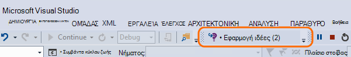
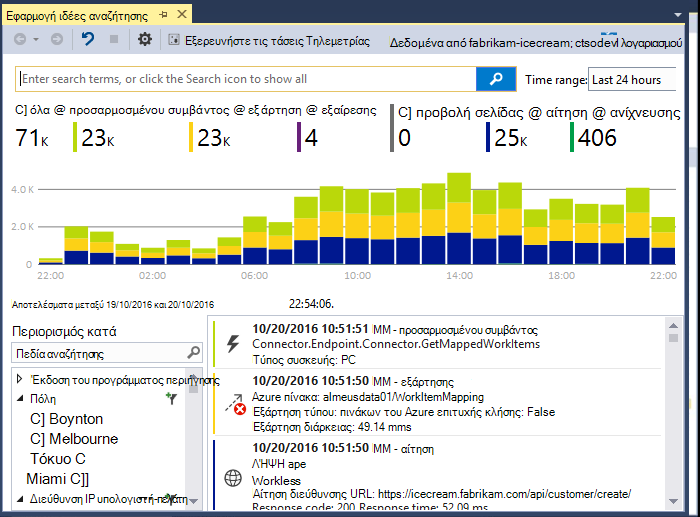
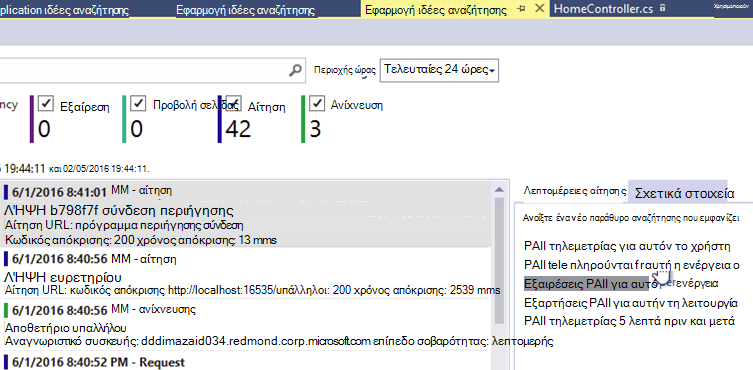
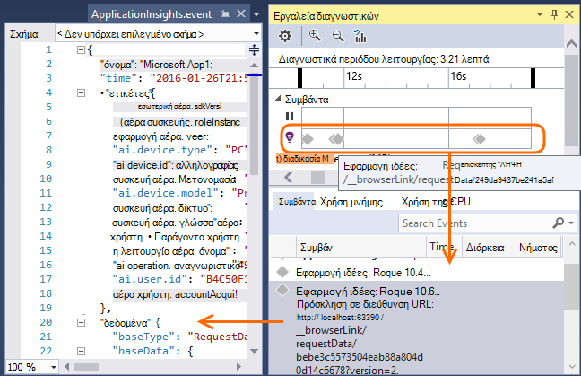
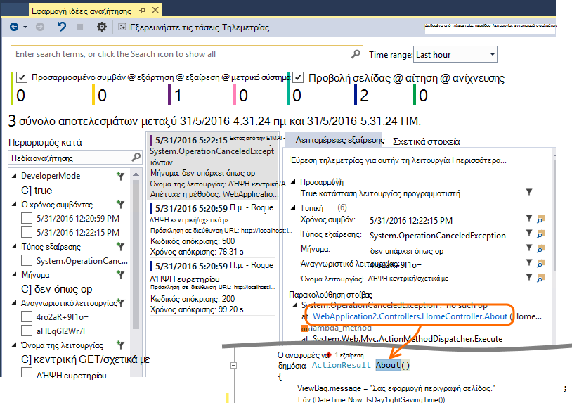
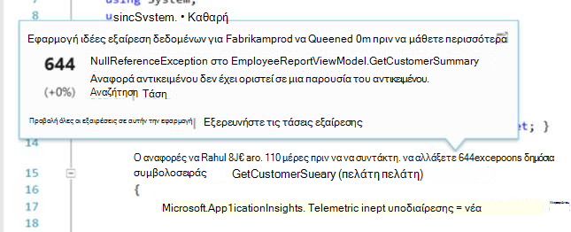
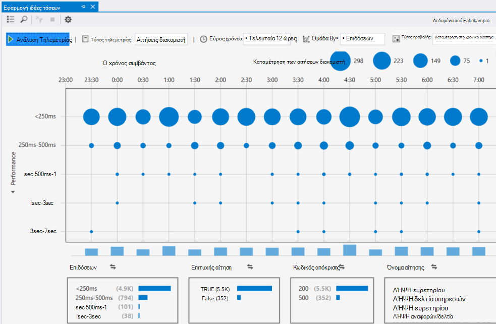

<properties 
    pageTitle="Εργασία με εφαρμογή ιδέες στο Visual Studio" 
    description="Ανάλυση απόδοσης και τα Διαγνωστικά κατά τον εντοπισμό σφαλμάτων και παραγωγή." 
    services="application-insights" 
    documentationCenter=".net"
    authors="alancameronwills" 
    manager="douge"/>

<tags 
    ms.service="application-insights" 
    ms.workload="tbd" 
    ms.tgt_pltfrm="ibiza" 
    ms.devlang="na" 
    ms.topic="get-started-article" 
    ms.date="06/21/2016" 
    ms.author="awills"/>

# Εργασία με εφαρμογή ιδέες στο Visual Studio

Στο Visual Studio (2015 και νεότερες εκδόσεις), μπορείτε να ανάλυση της απόδοσης και διάγνωση θεμάτων εντοπισμού και παραγωγής, χρησιμοποιώντας τηλεμετρίας από το [Visual Studio εφαρμογή ιδέες](app-insights-overview.md).

Εάν δεν το έχετε κάνει ακόμα [Εγκατεστημένες ιδέες εφαρμογής στην εφαρμογή σας](app-insights-asp-net.md), κάντε αυτό τώρα.

## Εντοπισμός σφαλμάτων το έργο σας

Εκτελέστε την εφαρμογή σας με F5 και να το δοκιμάσετε: άνοιγμα διαφορετικές σελίδες για να δημιουργήσετε ορισμένες τηλεμετρίας.

Στο Visual Studio, θα δείτε μια καταμέτρηση του τα συμβάντα που έχουν καταγραφεί.

Κάντε κλικ σε αυτό το κουμπί για να ανοίξετε διαγνωστικών αναζήτησης. 

## Διαγνωστικών αναζήτησης

Το παράθυρο αναζήτησης εμφανίζει τα συμβάντα που έχουν καταγραφεί. (Εάν έχετε εισέλθει στο Azure κατά τη ρύθμιση του εφαρμογή ιδέες, θα έχετε τη δυνατότητα να κάνετε αναζήτηση στα ίδια γεγονότα στην πύλη του.)

Η αναζήτηση ελεύθερου κειμένου λειτουργεί σε οποιαδήποτε πεδία στα συμβάντα. Για παράδειγμα, αναζητήστε ένα τμήμα της διεύθυνσης URL μιας σελίδας; ή την τιμή της ιδιότητας όπως Πόλη προγράμματος-πελάτη; ή συγκεκριμένες λέξεις σε ένα αρχείο καταγραφής ανίχνευσης.

Κάντε κλικ σε οποιοδήποτε συμβάν για να δείτε τη λεπτομερή ιδιότητες.

Μπορείτε επίσης να ανοίξετε την καρτέλα σχετικά στοιχεία για να βοηθά στη διάγνωση αποτυχημένων αιτήσεων ή εξαιρέσεις.

## Ενότητα διαγνωστικών

Ενότητα διαγνωστικών (στο Visual Studio 2015 ή νεότερη έκδοση) εμφανίζει το τηλεμετρίας διακομιστή εφαρμογής ιδέες καθώς δημιουργείται. Αυτό λειτουργεί ακόμα και αν έχετε επιλέξει μόνο για να εγκαταστήσετε το SDK, χωρίς να συνδεθείτε στην πύλη του Azure πόρου.

## Εξαιρέσεις

Εάν έχετε [Ρύθμιση εξαίρεση παρακολούθησης](app-insights-asp-net-exceptions.md), αναφορές εξαίρεση θα εμφανιστεί στο παράθυρο "Αναζήτηση". 

Κάντε κλικ στην επιλογή εξαίρεση για να λάβετε μια ανίχνευση στοίβας. Εάν ο κωδικός της εφαρμογής είναι ανοιχτό στο Visual Studio, μπορείτε να κάνετε κλικ στις από το ίχνος στοίβας τη σχετική γραμμή του κώδικα.

Επιπλέον, στη γραμμή κώδικα φακός επάνω από κάθε μέθοδο, θα δείτε μια καταμέτρηση του τις εξαιρέσεις που καταγράφονται από την εφαρμογή ιδέες στο το τελευταίες 24 ώρες.

## Τοπική παρακολούθησης

(Από το Visual Studio 2015 ενημερωμένη έκδοση 2) Εάν δεν έχετε ρυθμίσει τις παραμέτρους του SDK για να στείλετε τηλεμετρίας στην πύλη του ιδέες εφαρμογής (ώστε να υπάρχει κλειδί οργάνων στο ApplicationInsights.config), στη συνέχεια, το παράθυρο Διαγνωστικά θα εμφανίσει τηλεμετρίας από την τελευταία έκδοση εντοπισμού σφαλμάτων περίοδο λειτουργίας. 

Αυτό είναι επιθυμητό εάν έχετε ήδη δημοσιεύσει μια προηγούμενη έκδοση της εφαρμογής. Δεν θέλετε το τηλεμετρίας από το εντοπισμού σφαλμάτων περιόδους λειτουργίας για να μεικτή με το τηλεμετρίας στην πύλη ιδέες εφαρμογή από την εφαρμογή δημοσιευμένη.

Είναι επίσης χρήσιμο αν έχετε κάποια [προσαρμοσμένη τηλεμετρίας](app-insights-api-custom-events-metrics.md) που θέλετε να εντοπίσετε σφάλματα πριν από την αποστολή τηλεμετρίας στην πύλη του.

* *Αρχικά, να πλήρως έχει ρυθμιστεί εφαρμογή ιδέες για την αποστολή τηλεμετρίας στην πύλη του. Αλλά τώρα θέλω να δείτε το τηλεμετρίας μόνο στο Visual Studio.*

 * Στις ρυθμίσεις του παραθύρου αναζήτησης, υπάρχει μια επιλογή για να πραγματοποιήσετε αναζήτηση τοπικό Διαγνωστικά, ακόμα και εάν η εφαρμογή σας στέλνει τηλεμετρίας στην πύλη του.
 * Για να διακόψετε τηλεμετρίας που στέλνεται στην πύλη, σχολιάσετε γραμμής `<instrumentationkey>...` από ApplicationInsights.config. Όταν είστε έτοιμοι να στείλετε ξανά τηλεμετρίας στην πύλη, καταργήστε τα σχόλια από αυτό.

## Τάσεις

Τάσεις είναι ένα εργαλείο για την οπτικοποίηση τον τρόπο συμπεριφοράς της εφαρμογής σας μέσα στο χρόνο. 

Επιλέξτε **Εξερεύνηση τάσεις Τηλεμετρίας** από το κουμπί γραμμής εργαλείων ιδέες εφαρμογής ή το παράθυρο αναζήτησης ιδέες εφαρμογής. Επιλέξτε μία από τις πέντε κοινά ερωτήματα για να ξεκινήσετε. Μπορείτε να αναλύσετε διαφορετικά σύνολα δεδομένων που βασίζονται σε τύπους τηλεμετρίας, ώρα περιοχές και άλλες ιδιότητες. 

Για να βρείτε ανωμαλίες στα δεδομένα σας, επιλέξτε μία από τις επιλογές ανωμαλία κάτω από την αναπτυσσόμενη λίστα "Τύπος προβολής". Οι επιλογές φιλτραρίσματος στο κάτω μέρος του παραθύρου διευκολύνουν την τελειοποιήστε στο συγκεκριμένο υποσύνολα τηλεμετρίας σας.

[Περισσότερες πληροφορίες σχετικά με τις τάσεις](app-insights-visual-studio-trends.md).

## Τι ακολουθεί;

||
|---|---
|**[Προσθήκη περισσότερων δεδομένων](app-insights-asp-net-more.md)** Παρακολούθηση χρήσης, διαθεσιμότητα, εξαρτήσεις, εξαιρέσεις. Ενοποίηση ανιχνεύσεις από καταγραφή πλαισίων. Γράψτε προσαρμοσμένο τηλεμετρίας. | 
|**[Εργασία με την πύλη ιδέες εφαρμογής](app-insights-dashboards.md)** Πίνακες εργαλείων, ισχυρά εργαλεία διαγνωστικών και ανάλυσης, ειδοποιήσεις, ένα χάρτη ζωντανή εξάρτηση από την εφαρμογή, και την εξαγωγή τηλεμετρίας. |

 
