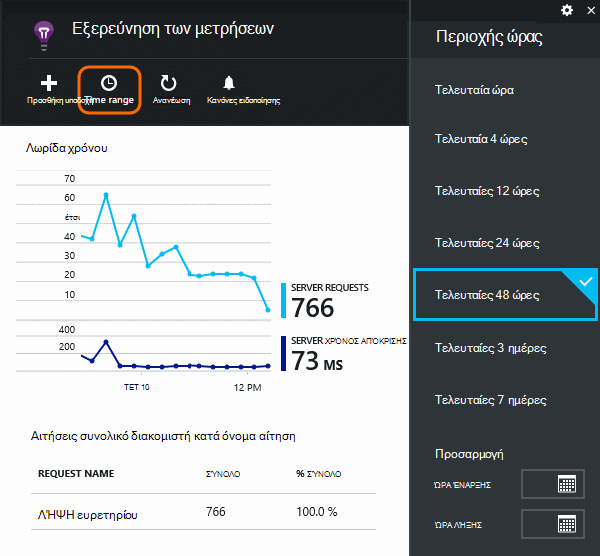
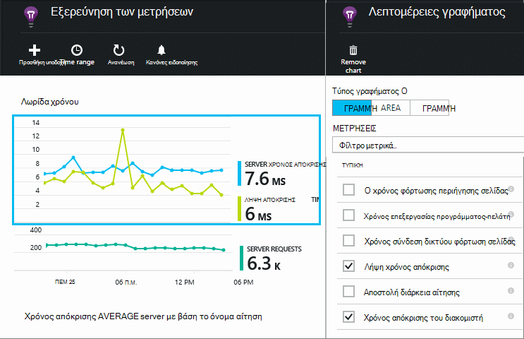
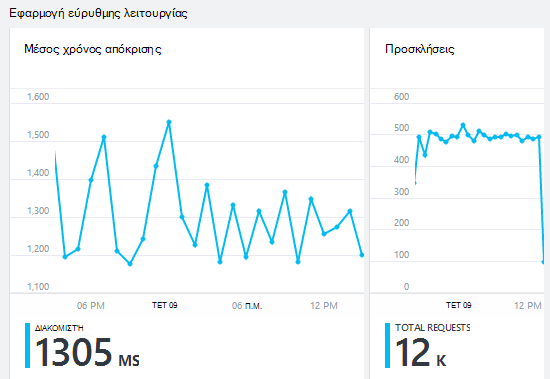
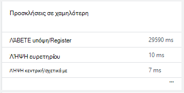
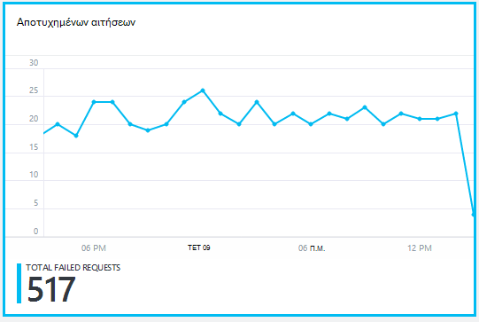
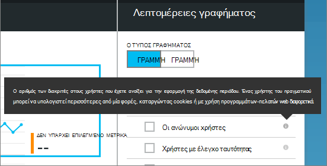
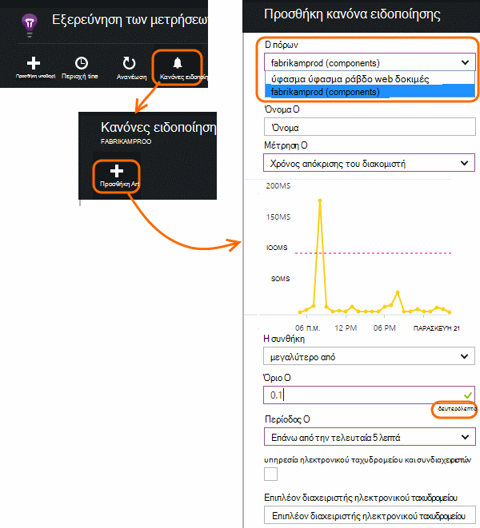

<properties 
    pageTitle="Παρακολούθηση της εύρυθμης λειτουργίας της εφαρμογής σας και η χρήση με ιδέες εφαρμογής" 
    description="Γρήγορα αποτελέσματα με την εφαρμογή ιδέες. Ανάλυση χρήσης, διαθεσιμότητα και την απόδοση της εσωτερικής εγκατάστασης ή εφαρμογές του Microsoft Azure." 
    services="application-insights" 
    documentationCenter=""
    authors="alancameronwills" 
    manager="douge"/>

<tags 
    ms.service="application-insights" 
    ms.workload="tbd" 
    ms.tgt_pltfrm="ibiza" 
    ms.devlang="na" 
    ms.topic="article" 
    ms.date="11/25/2015" 
    ms.author="awills"/>
 
# Παρακολούθηση απόδοσης στις εφαρμογές web

*Εφαρμογή ιδέες είναι σε προεπισκόπηση.*

Βεβαιωθείτε ότι επίσης και εκτελεί την εφαρμογή και μάθετε γρήγορα σχετικά με τυχόν αποτυχίες. [Εφαρμογή ιδέες] [ start] θα σας ενημερώσει για τυχόν προβλήματα επιδόσεων και εξαιρέσεις και να σας βοηθήσει διάγνωση τις αρχικές αιτίες.

Εφαρμογή ιδέες μπορεί να παρακολουθεί Java και ASP.NET εφαρμογών web και υπηρεσίες, υπηρεσίες WCF. Μπορούν να είναι φιλοξενούνται εσωτερική εγκατάσταση, σε εικονικές μηχανές ή ως Microsoft Azure τοποθεσίες Web που διαθέτετε. 

Από την πλευρά του προγράμματος-πελάτη, ιδέες εφαρμογή μπορεί να διαρκέσει τηλεμετρίας από ιστοσελίδες και μια μεγάλη ποικιλία συσκευές, συμπεριλαμβανομένων των iOS, Android και Windows Store εφαρμογών.

## Ρύθμιση του Εποπτεία επιδόσεων

Εάν έχετε προσθέσει ακόμη ιδέες εφαρμογή στο έργο σας (δηλαδή, εάν δεν έχει ApplicationInsights.config), επιλέξτε έναν από τους εξής τρόπους για να ξεκινήσετε:

* [Εφαρμογές web ASP.NET](app-insights-asp-net.md)
 * [Προσθήκη εξαίρεσης παρακολούθησης](app-insights-asp-net-exceptions.md)
 * [Προσθήκη παρακολούθησης εξάρτησης](app-insights-monitor-performance-live-website-now.md)
* [Εφαρμογές web της J2EE](app-insights-java-get-started.md)
 * [Προσθήκη παρακολούθησης εξάρτησης](app-insights-java-agent.md)

## Εξερεύνηση μετρικών απόδοσης

Στην [πύλη του Azure](https://portal.azure.com), αναζητήστε τον πόρο ιδέες εφαρμογής που ορίζετε για την εφαρμογή σας. Η επισκόπηση blade εμφανίζει δεδομένα βασικού επιδόσεων:

Κάντε κλικ σε οποιοδήποτε γράφημα για να δείτε περισσότερες λεπτομέρειες και για να δείτε τα αποτελέσματα για μεγαλύτερο χρονικό διάστημα. Για παράδειγμα, κάντε κλικ στο πλακίδιο αιτήσεις και, στη συνέχεια, επιλέξτε ένα χρονικό εύρος:

Κάντε κλικ σε ένα γράφημα για να επιλέξετε ποια μετρικά εμφανίζει, ή να προσθέσετε ένα νέο γράφημα και επιλέξτε τις μετρήσεις:

> [AZURE.NOTE] **Καταργήστε την επιλογή όλων των μετρικών** για να δείτε την πλήρη επιλογή που είναι διαθέσιμη. Τα μετρικά εμπίπτουν σε ομάδες. Όταν είναι επιλεγμένη η οποιοδήποτε μέλος της ομάδας, εμφανίζονται μόνο τα άλλα μέλη αυτής της ομάδας.

## Τι σημαίνει αυτό όλα; Τα πλακίδια επιδόσεων και αναφορές

Υπάρχει μια ποικιλία μετρικών απόδοσης που μπορείτε να λάβετε. Ας ξεκινήσουμε με αυτά που εμφανίζονται από προεπιλογή στην blade την εφαρμογή.

### Προσκλήσεις

Ο αριθμός των αιτήσεων HTTP που έχουν ληφθεί σε μια συγκεκριμένη χρονική περίοδο. Συγκρίνετε αυτή με τα αποτελέσματα σε άλλες αναφορές για να δείτε τον τρόπο συμπεριφοράς της εφαρμογής σας ως η φόρτωση ποικίλλει.

Οι αιτήσεις HTTP περιλαμβάνουν όλες τις αιτήσεις για σελίδες, δεδομένα και οι εικόνες που ΛΑΜΒΆΝΟΥΝ ή ΔΗΜΟΣΊΕΥΣΗ.

Κάντε κλικ στο πλακίδιο για να λάβετε μετρήσεις για συγκεκριμένες διευθύνσεις URL.

### Μέσος χρόνος απόκρισης

Μέτρα το χρονικό διάστημα μεταξύ μιας αίτησης web πληκτρολογώντας την εφαρμογή σας και την απάντηση που επιστρέφονται.

Τα σημεία εμφανίζουν μια μετακίνηση μέσος όρος. Εάν υπάρχουν πολλά αιτήσεις, ενδέχεται να υπάρξουν ορισμένες που αποκλίνει από τον μέσο όρο χωρίς μια εμφανή κορύφωσης ή είναι μικρότεροι στο γράφημα.

Αναζητήστε ασυνήθιστο κορυφών. Σε γενικές γραμμές, περιμένετε χρόνος απόκρισης να αυξάνονται με αύξηση των αιτήσεων. Εάν η ανύψωση είναι δυσανάλογη, την εφαρμογή σας ενδέχεται να επιτύχετε όριο πόρων όπως CPU ή η δυναμικότητα των μια υπηρεσία που χρησιμοποιεί.

Κάντε κλικ στο πλακίδιο για να λάβετε ώρες για συγκεκριμένες διευθύνσεις URL.

### Προσκλήσεις σε χαμηλότερη

Εμφανίζει την οποία οι αιτήσεις ίσως χρειαστεί της ρύθμισης επιδόσεων.

### Αποτυχημένων αιτήσεων

Μια μέτρηση των αιτήσεων που δημιούργησε μη καταγεγραμμένο εξαιρέσεις.

Κάντε κλικ στο πλακίδιο για να δείτε τις λεπτομέρειες της συγκεκριμένες αποτυχίες και επιλέξτε μια επιμέρους αίτηση για να δείτε τις λεπτομέρειες. 

Μόνο αντιπρόσωπος δείγμα αποτυχιών διατηρείται για μεμονωμένες επιθεώρηση.

### Άλλα μετρικά

Για να δείτε τι Ορίστε άλλες μετρικά μπορείτε να εμφανίσετε, κάντε κλικ σε ένα γράφημα, και, στη συνέχεια, καταργήστε την επιλογή όλων των μετρικών για να δείτε την πλήρη διαθέσιμη. Για να δείτε ορισμό κάθε μετρικό σύστημα, κάντε κλικ στην επιλογή (i).

Αν επιλέξετε οποιοδήποτε μετρικό θα απενεργοποιηθούν τα άλλα άτομα που δεν είναι δυνατό να εμφανίζονται στο ίδιο γράφημα.

## Ορισμός ειδοποιήσεων

Να λαμβάνετε ειδοποιήσεις μέσω ηλεκτρονικού ταχυδρομείου ασυνήθιστο τιμών οποιαδήποτε μέτρησης, προσθέστε μια ειδοποίηση. Μπορείτε να επιλέξετε είτε για να στείλετε το μήνυμα ηλεκτρονικού ταχυδρομείου για τους διαχειριστές του λογαριασμού ή για διευθύνσεις ηλεκτρονικού ταχυδρομείου συγκεκριμένα.

Ορισμός του πόρου πριν από τις άλλες ιδιότητες. Μην επιλέξετε τους πόρους webtest εάν θέλετε να ορίσετε ειδοποιήσεις επιδόσεων "ή" Χρήση μετρικά.

Μην ξεχάσετε να σημειώσετε τις μονάδες στην οποία θα σας ζητηθεί να εισαγάγετε το οριακή τιμή.

*Δεν βλέπω το κουμπί Προσθήκη ειδοποίησης.* -Πρόκειται για μια ομάδα λογαριασμού στις οποίες έχετε πρόσβαση μόνο για ανάγνωση; Επικοινωνήστε με το λογαριασμό διαχειριστή.

## Διάγνωση θεμάτων

Ακολουθούν μερικές συμβουλές για την εύρεση και τη διάγνωση θεμάτων επιδόσεων:

* Ρύθμιση του [web δοκιμές] [ availability] για να λαμβάνετε ειδοποιήσεις εάν την τοποθεσία σας web μεταβαίνει προς τα κάτω ή ανταποκρίνεται εσφαλμένα ή αργά. 
* Συγκρίνετε το πλήθος αίτηση με άλλες μετρήσεις για να δείτε εάν αργή απόκριση ή αποτυχίες σχετίζονται με τη φόρτωση.
* [Εισαγωγή και αναζήτηση ανίχνευση δηλώσεις] [ diagnostic] στον κώδικά σας για να εντοπίσετε προβλήματα.

## Επόμενα βήματα

[Δοκιμές στο Web] [ availability] -έχουν σταλεί στην εφαρμογή σας σε τακτά χρονικά διαστήματα από όλο τον κόσμο αιτήσεις web.

[Καταγραφή και αναζήτηση διαγνωστικών ανιχνεύσεις] [ diagnostic] - εισαγωγή κλήσεις ανίχνευση και μεταβαίνετε τα αποτελέσματα για να επισημάνετε θέματα.

[Χρήση παρακολούθησης] [ usage] -μάθετε πώς άτομα χρησιμοποιήσετε την εφαρμογή σας.

[Αντιμετώπιση προβλημάτων] [ qna] - και ερωτήσεις και απαντήσεις

## Βίντεο

[AZURE.VIDEO performance-monitoring-application-insights]

<!--Link references-->

[availability]: app-insights-monitor-web-app-availability.md
[diagnostic]: app-insights-diagnostic-search.md
[greenbrown]: app-insights-asp-net.md
[qna]: app-insights-troubleshoot-faq.md
[redfield]: app-insights-monitor-performance-live-website-now.md
[start]: app-insights-overview.md
[usage]: app-insights-web-track-usage.md

 
