<properties 
    pageTitle="Ανάλυση χρήσης για τις εφαρμογές web με ιδέες εφαρμογής" 
    description="Επισκόπηση των αναλυτικών στοιχείων χρήσης για τις εφαρμογές web με ιδέες εφαρμογής" 
    services="application-insights" 
    documentationCenter=""
    authors="alancameronwills" 
    manager="douge"/>

<tags 
    ms.service="application-insights" 
    ms.workload="tbd" 
    ms.tgt_pltfrm="ibiza" 
    ms.devlang="na" 
    ms.topic="article" 
    ms.date="06/12/2016" 
    ms.author="awills"/>
 
# <a name="usage-analysis-for-web-applications-with-application-insights"></a>Ανάλυση χρήσης για τις εφαρμογές web με ιδέες εφαρμογής

Γνωρίζετε πώς άτομα χρησιμοποιήσετε την εφαρμογή σας σάς επιτρέπει να εστιάσετε την εργασία σας ανάπτυξης τα σενάρια που είναι πιο σημαντικές για τους, και να αποκτήσει ιδέες σε τους στόχους που ότι τη βρίσκουν ευκολότερο ή δυσκολότερο να επιτύχετε. 

Visual Studio εφαρμογή ιδέες παρέχει δύο επίπεδα παρακολούθησης της χρήσης:

* **Σελίδα χρήστη, την περίοδο λειτουργίας και προβολή δεδομένων** - που παρέχεται από το πλαίσιο.  
* **Προσαρμοσμένη τηλεμετρίας** - [σύνταξη κώδικα] [ api] για την ανίχνευση τους χρήστες σας μέσω της εφαρμογής σας εμπειρία χρήστη. 

## <a name="setting-up"></a>Ρύθμιση

Ανοίξτε μια εφαρμογή ιδέες πόρο στην [Πύλη του Azure](https://portal.azure.com), κάντε κλικ στο κενό γράφημα φορτία σελίδα προγράμματος περιήγησης, και ακολουθήστε τις οδηγίες εγκατάστασης.

[Μάθε περισσότερα](app-insights-javascript.md) 


## <a name="how-popular-is-my-web-application"></a>Πώς δημοφιλείς είναι η εφαρμογή μου web;

Είσοδος στην [πύλη του Azure][portal], αναζητήστε τον πόρο εφαρμογή και κάντε κλικ στην επιλογή Χρήση:

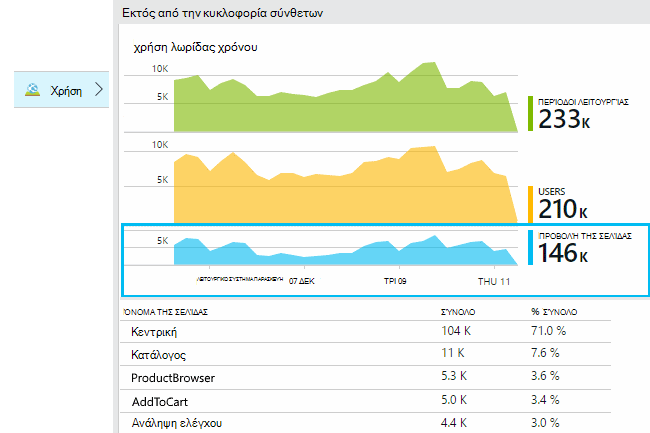

* **Χρήστες:** Το πλήθος των διακριτές ενεργοί χρήστες μέσω της περιοχής ώρας του γραφήματος. 
* **Περίοδοι λειτουργίας:** Το πλήθος των ενεργών περιόδων λειτουργίας
* **Προβολές σελίδας** Καταμετρά τον αριθμό των κλήσεων σε trackPageView(), συνήθως ονομάζεται μία φορά σε κάθε ιστοσελίδα.

Κάντε κλικ σε οποιοδήποτε από τα γραφήματα για να δείτε περισσότερες λεπτομέρειες. Παρατηρήστε ότι μπορείτε να αλλάξετε την περιοχή ώρας από τα γραφήματα.

### <a name="where-do-my-users-live"></a>Όπου live τους χρήστες μου;

Από τη χρήση blade, κάντε κλικ στο γράφημα τους χρήστες για να δείτε περισσότερες λεπτομέρειες:

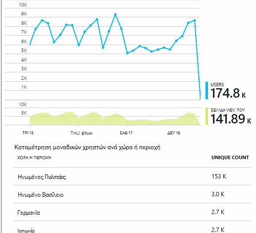
 
### <a name="what-browsers-or-operating-systems-do-they-use"></a>Ποια προγράμματα περιήγησης ή λειτουργικά συστήματα χρησιμοποιούν;

Ομάδα (τμήμα) δεδομένων από μια ιδιότητα όπως το πρόγραμμα περιήγησης, το λειτουργικό σύστημα ή πόλη:

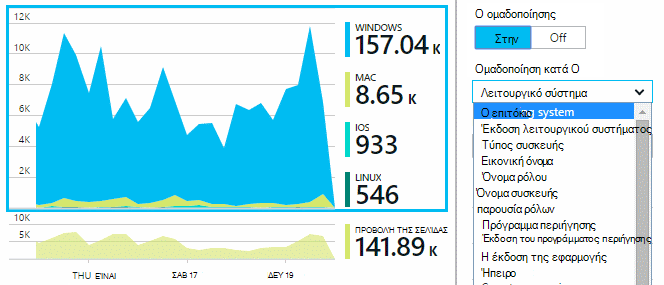


## <a name="sessions"></a>Περίοδοι λειτουργίας

Περίοδος λειτουργίας είναι μια θεμελιώδεις έννοια στην εφαρμογή ιδέες, το οποίο βασικό μέλημα είναι να συσχετίσετε κάθε συμβάν τηλεμετρίας - όπως αιτήσεις, προβολές σελίδας, εξαιρέσεις, ή προσαρμοσμένα συμβάντα που κώδικα που τον εαυτό σας - με μια περίοδο λειτουργίας του συγκεκριμένου χρήστη. 

Εμπλουτισμένο περιβάλλον πληροφορίες που συλλέγονται σχετικά με κάθε περίοδο λειτουργίας, όπως χαρακτηριστικά της συσκευής, παν θέση, το λειτουργικό σύστημα και ούτω καθεξής.

Εάν μέσου του προγράμματος-πελάτη και του διακομιστή ([ASP.NET] [ greenbrown] ή [J2EE][java]), το SDK θα μεταδοθούν το αναγνωριστικό περιόδου λειτουργίας μεταξύ του υπολογιστή-πελάτη και διακομιστή, ώστε να μπορούν να συσχετιστούν συμβάντα και στις δύο πλευρές.

Όταν [διάγνωση προβλημάτων][diagnostic], μπορείτε να βρείτε όλα τα τηλεμετρίας που σχετίζονται με την περίοδο λειτουργίας στην οποία Παρουσιάστηκε πρόβλημα, συμπεριλαμβανομένων όλων των αιτήσεων και τυχόν συμβάντων, εξαιρέσεις ή ανιχνεύσεις που έχουν καταγραφεί.

Περίοδοι λειτουργίας παρέχουν καλή μέτρηση της η δημοτικότητα του περιβάλλοντα όπως συσκευή, το λειτουργικό σύστημα ή θέση. Εμφανίζοντας το πλήθος των περιόδων λειτουργίας ομαδοποιημένα κατά τη συσκευή, για παράδειγμα, λαμβάνετε μια πιο ακριβή καταμέτρηση του πόσο συχνά τη συσκευή που χρησιμοποιείται με την εφαρμογή σας, από μετρώντας προβολών σελίδας. Αυτό είναι ένα χρήσιμο εισόδου σε διαλογής από οποιοδήποτε θέμα ειδικά για τη συσκευή.


#### <a name="whats-a-session"></a>Τι είναι η περίοδος λειτουργίας;

Μια περίοδο λειτουργίας αντιπροσωπεύει ένα μεμονωμένο συναντούν μεταξύ του χρήστη και την εφαρμογή. Στην πιο απλή μορφή, η περίοδος λειτουργίας ξεκινά με ένα χρήστη, εάν πραγματοποιηθεί εκκίνηση της εφαρμογής και ολοκληρώνεται όταν χρήστης αποχωρεί από την εφαρμογή. Εφαρμογές web, από προεπιλογή, η περίοδος λειτουργίας τερματίζεται μετά από 30 λεπτά αδράνειας ή μετά από 24 ώρες δραστηριότητας. 

Μπορείτε να αλλάξετε αυτές τις προεπιλογές, Επεξεργασία τμήματος κώδικα:

    <script type="text/javascript">
        var appInsights= ... { ... }({
            instrumentationKey: "...",
            sessionRenewalMs: 3600000,
            sessionExpirationMs: 172800000
        });

* `sessionRenewalMs`: Ο χρόνος, σε χιλιοστά του δευτερολέπτου, να λήξει η περίοδος λειτουργίας λόγω αδράνειας του χρήστη. Προεπιλογή: 30 λεπτά.
* `sessionExpirationMs`: Το μήκος μέγιστη περίοδο λειτουργίας, σε χιλιοστά του δευτερολέπτου. Εάν ο χρήστης παραμένει ενεργό μετά από αυτήν τη στιγμή, συνυπολογίζεται άλλη περίοδο λειτουργίας. Προεπιλογή: 24 ώρες.

**Διάρκεια περιόδου λειτουργίας** είναι ένα [μετρικό σύστημα] [ metrics] που καταγράφει το χρονικό διάστημα μεταξύ των στοιχείων πρώτο και το τελευταίο τηλεμετρίας από την περίοδο λειτουργίας. (Δεν περιλαμβάνει το χρονικό όριο).

**Καταμέτρηση περιόδου λειτουργίας** σε ένα συγκεκριμένο χρονικό ορίζεται ως ο αριθμός των μοναδικών περιόδους λειτουργίας με κάποια δραστηριότητα στη διάρκεια αυτού του διαστήματος. Όταν εξετάζετε μια περιοχή μεγάλο χρονικό διάστημα, όπως η καταμέτρηση ημερήσια περίοδο λειτουργίας για την προηγούμενη εβδομάδα, αυτό είναι συνήθως ισοδύναμο με τον συνολικό αριθμό των περιόδων λειτουργίας. 

Ωστόσο, όταν εξερευνήσετε μικρότερη χρονικά διαστήματα, όπως ως ωριαία, θα καταμετρηθούν μια μεγάλη περίοδο λειτουργίας που εκτείνονται σε πολλές ώρες για κάθε ώρα στο οποίο ήταν ενεργό την περίοδο λειτουργίας. 

## <a name="users-and-user-counts"></a>Οι χρήστες και το πλήθος χρήστη


Κάθε περίοδο λειτουργίας χρήστη είναι συσχετισμένη με ένα μοναδικό αναγνωριστικό χρήστη. 

Από προεπιλογή, ο χρήστης προσδιορίζεται τοποθετώντας ένα cookie. Ένας χρήστης που χρησιμοποιεί πολλά προγράμματα περιήγησης ή συσκευές θα καταμετρηθούν περισσότερες από μία φορές. (Αλλά δείτε [εξουσιοδοτημένους χρήστες](#authenticated-users))


Τη μέτρηση **πλήθους χρήστη** σε ένα συγκεκριμένο χρονικό ορίζεται ως ο αριθμός των μοναδικών χρηστών με καταγεγραμμένο δραστηριότητα στη διάρκεια αυτού του διαστήματος. Ως αποτέλεσμα, οι χρήστες με μεγάλο περίοδοι λειτουργίας ενδέχεται να συνυπολογίζονται πολλές φορές, όταν ορίζετε ένα χρονικό εύρος, έτσι ώστε το ως είναι λιγότερο από μία ώρα ή, ώστε να.

**Νέοι χρήστες** καταμετρά τους χρήστες των οποίων πρώτη περιόδους λειτουργίας με την εφαρμογή παρουσιάστηκε κατά τη διάρκεια αυτό το χρονικό διάστημα. Εάν χρησιμοποιείται η προεπιλεγμένη μέθοδος απογραφής από τους χρήστες από cookies, στη συνέχεια, αυτό θα επίσης να περιλαμβάνουν τους χρήστες που έχουν καταργηθεί τα cookies, ή χρησιμοποιούν μια νέα συσκευή ή το πρόγραμμα περιήγησης για να αποκτήσετε πρόσβαση της εφαρμογής σας για πρώτη φορά.
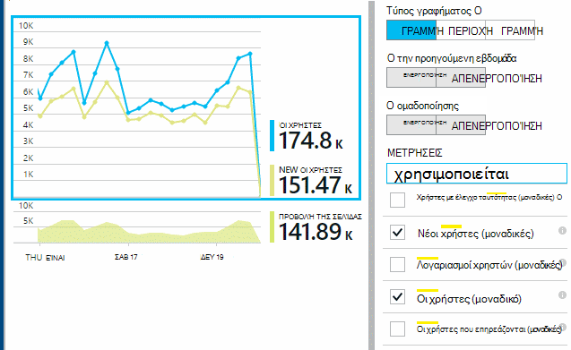

### <a name="authenticated-users"></a>Χρήστες με έλεγχο ταυτότητας

Εάν η εφαρμογή web της επιτρέπει στους χρήστες να εισέλθετε, μπορείτε να λάβετε μια πιο ακριβή καταμέτρηση, παρέχοντας ιδέες εφαρμογή με ένα αναγνωριστικό χρήστη μοναδικών τιμών. Δεν είναι απαραίτητο να είναι το όνομα του ατόμου ή το ίδιο αναγνωριστικό που χρησιμοποιείτε στην εφαρμογή σας. Με την εφαρμογή σας έχει εντοπίσει το χρήστη, χρησιμοποιήστε αυτόν τον κωδικό:


*JavaScript στο πρόγραμμα-πελάτη*

      appInsights.setAuthenticatedUserContext(userId);

Εάν η εφαρμογή σας ομαδοποιεί τους χρήστες σε λογαριασμούς, μπορείτε επίσης να περάσετε ένα αναγνωριστικό για το λογαριασμό. 

      appInsights.setAuthenticatedUserContext(userId, accountId);

Τα αναγνωριστικά χρήστη και λογαριασμού δεν πρέπει να περιέχει κενά διαστήματα ή τους χαρακτήρες`,;=|`


Στην [Εξερεύνηση των μετρήσεων](app-insights-metrics-explorer.md), μπορείτε να δημιουργήσετε ένα γράφημα με **Χρήστες με έλεγχο ταυτότητας** και των **λογαριασμών**. 

## <a name="synthetic-traffic"></a>Σύνθετων κίνηση

Κίνηση σύνθετων περιλαμβάνει αιτήσεις από φόρτου και διαθεσιμότητα δοκιμές, προγράμματα ανίχνευσης των μηχανισμών αναζήτησης και άλλων παραγόντων. 

Εφαρμογή προσπαθεί ιδέες βασικό μέλημα είναι η αυτόματη Προσδιορίστε και ταξινόμηση σύνθετων κίνηση και να το επισημάνετε σωστά. Στις περισσότερες περιπτώσεις, σύνθετων κίνηση κλήση δεν στο SDK JavaScript, έτσι ώστε να αυτήν τη δραστηριότητα εξαιρείται από το χρήστη και μετρώντας περιόδου λειτουργίας. 

Ωστόσο, για τις ιδέες εφαρμογής [web δοκιμές][availability], το αναγνωριστικό χρήστη είναι αυτόματα η ρύθμιση με βάση θέση POP και αναγνωριστικό περιόδου λειτουργίας έχει οριστεί με βάση αναγνωριστικό δοκιμής. Προεπιλεγμένες αναφορές, σύνθετων κίνηση φιλτράρονται από προεπιλογή, ώστε να αποκλείσετε αυτούς τους χρήστες και περιόδους λειτουργίας. Ωστόσο, όταν περιλαμβάνεται σύνθετων κίνηση, αυτό μπορεί να προκαλέσει μια μικρή αύξηση στο συνολικό χρήστες και το πλήθος περιόδου λειτουργίας.
 
## <a name="page-usage"></a>Χρήση της σελίδας

Κάντε κλικ στην επιλογή έως το γράφημα προβολές σελίδας για να λάβετε μια πιο μεγεθυνθεί έκδοση μαζί με μια ανάλυση των σελίδων σας πιο δημοφιλή:


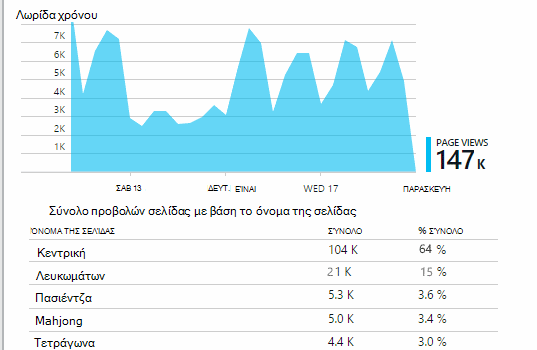
 
Το παραπάνω παράδειγμα είναι από μια τοποθεσία Web αγώνων. Από αυτό θα σας στη στιγμή να δείτε:

* Χρήση δεν έχει βελτιωθεί την προηγούμενη εβδομάδα. Μήπως θα σας θα πρέπει να σκεφτείτε βελτιστοποίηση μηχανισμού αναζήτησης;
* Πολλά άτομα λιγότερες δείτε τις σελίδες αγώνων από την αρχική σελίδα. Γιατί δεν μας αρχική σελίδα προσελκύσετε άτομα για την αναπαραγωγή αγώνων;
* 'Λευκωμάτων' είναι τα πιο δημοφιλή παιχνίδι. Θα σας θα πρέπει να δίνουν προτεραιότητα με νέες ιδέες και βελτιώσεις εκεί.

## <a name="custom-tracking"></a>Προσαρμοσμένη παρακολούθησης

Ας υποθέσουμε ότι αντί για εφαρμογή κάθε παιχνίδι σε ξεχωριστή σελίδα web, για να refactor όλες στην ίδια εφαρμογή μίας σελίδας, με το μεγαλύτερο μέρος της λειτουργικότητας κώδικα ως Javascript σε μια ιστοσελίδα. Αυτό σας επιτρέπει στο χρήστη να μεταβαίνετε γρήγορα ένα παιχνίδι και ένα άλλο ή ακόμα και έχετε πολλές αγώνων σε μία σελίδα. 

Αλλά εξακολουθείτε να θέλετε ιδέες της εφαρμογής για να συνδεθείτε του αριθμού των φορών κάθε παιχνίδι ανοίξει, στο ακριβώς τον ίδιο τρόπο όπως όταν βρίσκονταν σε ξεχωριστές σελίδες web. Που είναι εύκολο: εισαγωγή απλώς μια κλήση στη λειτουργική μονάδα τηλεμετρίας σε σας JavaScript όπου θέλετε να εγγραφή που έχει ανοίξει ένα νέο "σελίδα":

    appInsights.trackPageView(game.Name);

## <a name="custom-events"></a>Προσαρμοσμένα συμβάντα

Γράψτε προσαρμοσμένο τηλεμετρίας για να συνδεθείτε συγκεκριμένα συμβάντα. Ιδιαίτερα σε μια εφαρμογή για μία σελίδα, θα θελήσετε να μάθετε πόσο συχνά εκτελεί συγκεκριμένες ενέργειες χρήστη ή επιτυγχάνει ορισμένες στόχους: 

    appInsights.trackEvent("GameEnd");

Για παράδειγμα, για να συνδεθείτε κάνοντας κλικ στη σύνδεση:

    <a href="target.htm" onclick="appInsights.trackEvent('linkClick');return true;">my link</a>


## <a name="view-counts-of-custom-events"></a>Προβολή πλήθος προσαρμοσμένα συμβάντα

Ανοίξτε την Εξερεύνηση μετρικά και προσθέστε ένα γράφημα για να εμφανίσετε τα συμβάντα. Τμήμα κατά όνομα:

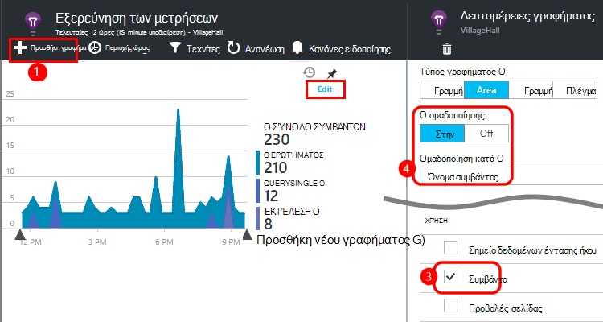


## <a name="drill-into-specific-events"></a>Διερεύνηση σε συγκεκριμένα συμβάντα

Για να λάβετε μια καλύτερη κατανόηση των πώς μεταφερθείτε τυπικές περιόδου λειτουργίας, ενδέχεται να θέλετε στην εστίαση σε μια περίοδο λειτουργίας συγκεκριμένο χρήστη που περιέχει έναν συγκεκριμένο τύπο συμβάντος. 

Σε αυτό το παράδειγμα, θα σας κωδικοποιημένο ένα προσαρμοσμένο συμβάν "NoGame" που ονομάζεται εάν ο χρήστης που πραγματοποιεί χωρίς στην πραγματικότητα Έναρξη ένα παιχνίδι. Γιατί μπορεί ένας χρήστης κάτι τέτοιο; Μήπως εάν θα σας εμβάθυνση σε κάποιες συγκεκριμένες εμφανίσεις, θα σας θα εμφανιστεί μια ιδέα. 

Τα προσαρμοσμένα συμβάντα που λάβατε από την εφαρμογή παρατίθενται κατά όνομα στην το blade επισκόπηση:


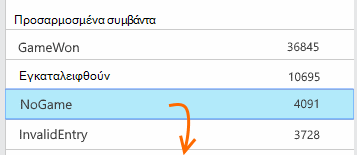
 
Κάντε κλικ στην επιλογή έως το συμβάν που σας ενδιαφέρουν και επιλέξτε μια πρόσφατη συγκεκριμένη εμφάνιση:


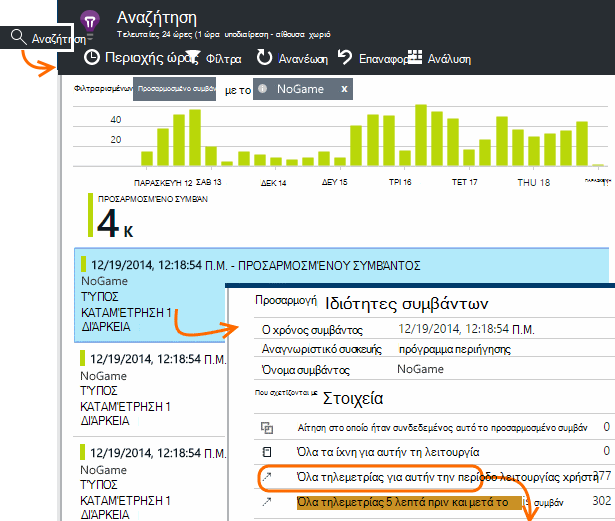
 
Ας δούμε όλα τα τηλεμετρίας για την περίοδο λειτουργίας στην οποία προέκυψε αυτό το συγκεκριμένο συμβάν NoGame. 


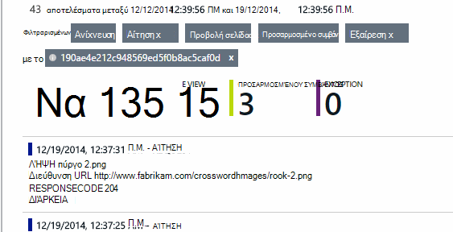
 
Δεν υπήρχαν χωρίς εξαιρέσεις, ώστε ο χρήστης δεν μπορούν να γίνεται αναπαραγωγή από ορισμένες αποτυχία.
 
Θα σας να φιλτράρετε όλους τους τύπους τηλεμετρίας εκτός από τις προβολές σελίδας για αυτήν την περίοδο λειτουργίας:


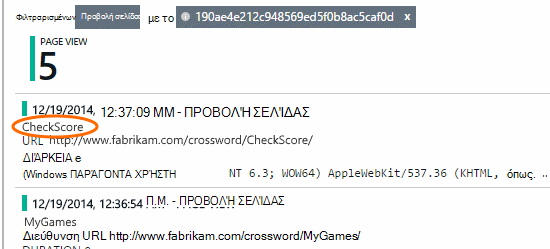
 
Και τώρα μπορούμε να δούμε ότι αυτός ο χρήστης συνδεθεί απλώς για να ελέγξετε τις πιο πρόσφατες βαθμολογίες. Μήπως θα σας πρέπει να λάβετε υπόψη ανάπτυξη ενός κειμένου χρήστη που σας διευκολύνει να το κάνετε. (Και θα σας θα πρέπει να υλοποιήσετε ένα προσαρμοσμένο συμβάν αναφορά όταν εμφανίζεται αυτό το άρθρο.)

## <a name="filter-search-and-segment-your-data-with-properties"></a>Φιλτράρισμα, αναζήτηση και τα δεδομένα σας με τις ιδιότητες του τμήματος
Μπορείτε να επισυνάψετε αυθαίρετο ετικετών και αριθμητικές τιμές σε συμβάντα.
 

*JavaScript στο πρόγραμμα-πελάτη*

```JavaScript

    appInsights.trackEvent("WinGame",
        // String properties:
        {Game: currentGame.name, Difficulty: currentGame.difficulty},
        // Numeric measurements:
        {Score: currentGame.score, Opponents: currentGame.opponentCount}
    );
```

*C# στο διακομιστή*

```C#

    // Set up some properties:
    var properties = new Dictionary <string, string> 
        {{"game", currentGame.Name}, {"difficulty", currentGame.Difficulty}};
    var measurements = new Dictionary <string, double>
        {{"Score", currentGame.Score}, {"Opponents", currentGame.OpponentCount}};

    // Send the event:
    telemetry.TrackEvent("WinGame", properties, measurements);
```

*VB στο διακομιστή*

```VB

    ' Set up some properties:
    Dim properties = New Dictionary (Of String, String)
    properties.Add("game", currentGame.Name)
    properties.Add("difficulty", currentGame.Difficulty)

    Dim measurements = New Dictionary (Of String, Double)
    measurements.Add("Score", currentGame.Score)
    measurements.Add("Opponents", currentGame.OpponentCount)

    ' Send the event:
    telemetry.TrackEvent("WinGame", properties, measurements)
```

Επισύναψη ιδιοτήτων προβολές σελίδας με τον ίδιο τρόπο:

*JavaScript στο πρόγραμμα-πελάτη*

```JS

    appInsights.trackPageView("Win", 
        url,
        {Game: currentGame.Name}, 
        {Score: currentGame.Score});
```

Στο πλαίσιο Αναζήτηση διαγνωστικών, προβάλετε τις ιδιότητες, κάνοντας κλικ σε ένα μεμονωμένο εμφάνιση ενός συμβάντος.


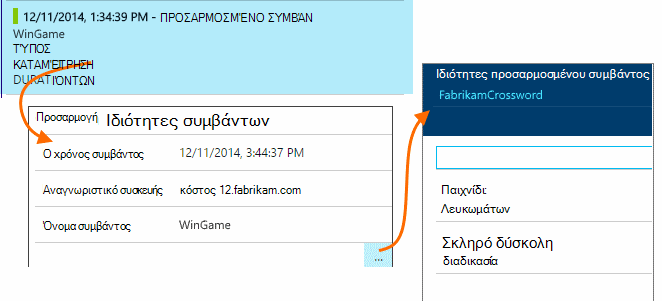
 
Χρησιμοποιήστε το πεδίο αναζήτησης για να δείτε συμβάν εμφανίσεις με μια συγκεκριμένη ιδιότητα τιμή.


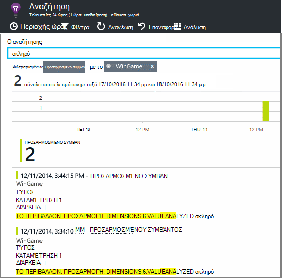


## <a name="a--b-testing"></a>A | Δοκιμές B

Εάν δεν γνωρίζετε ποια μεταβλητή μιας δυνατότητας θα είναι πιο επιτυχημένη, αφήστε και τα δύο από αυτά, καθιστώντας κάθε προσβάσιμα σε διαφορετικούς χρήστες. Μετρήστε την επιτυχία κάθε και, στη συνέχεια, μετακινήστε μια ενοποιημένη έκδοση.

Για αυτήν την τεχνική, μπορείτε να επισυνάψετε διακριτές ετικέτες σε όλα τα τηλεμετρίας που αποστέλλεται από κάθε έκδοση της εφαρμογής. Μπορείτε να το κάνετε ορίζοντας ιδιότητες στα το ενεργό TelemetryContext. Αυτές οι προεπιλεγμένες ιδιότητες προστίθεται σε κάθε τηλεμετρίας μήνυμα που στέλνει την εφαρμογή - όχι μόνο προσαρμοσμένες τα μηνύματά σας, αλλά καθώς και την τυπική τηλεμετρίας. 

Στην πύλη του εφαρμογή ιδέες, στη συνέχεια, θα μπορείτε να φιλτράρισμα και ομαδοποίηση (τμήμα) τα δεδομένα σας σε τις ετικέτες, έτσι ώστε να συγκρίνετε τις διαφορετικές εκδόσεις.

*C# στο διακομιστή*

```C#

    using Microsoft.ApplicationInsights.DataContracts;

    var context = new TelemetryContext();
    context.Properties["Game"] = currentGame.Name;
    var telemetry = new TelemetryClient(context);
    // Now all telemetry will automatically be sent with the context property:
    telemetry.TrackEvent("WinGame");
```

*VB στο διακομιστή*

```VB

    Dim context = New TelemetryContext
    context.Properties("Game") = currentGame.Name
    Dim telemetry = New TelemetryClient(context)
    ' Now all telemetry will automatically be sent with the context property:
    telemetry.TrackEvent("WinGame")
```

Μεμονωμένα τηλεμετρίας να παρακάμψετε τις προεπιλεγμένες τιμές.

Μπορείτε να ρυθμίσετε μια καθολική προετοιμασία, έτσι ώστε όλα τα νέα TelemetryClients χρησιμοποιεί αυτόματα το περιβάλλον σας.

```C#


    // Telemetry initializer class
    public class MyTelemetryInitializer : ITelemetryInitializer
    {
        public void Initialize (ITelemetry telemetry)
        {
            telemetry.Properties["AppVersion"] = "v2.1";
        }
    }
```

Στο την προετοιμασία εφαρμογής όπως Global.asax.cs:

```C#

    protected void Application_Start()
    {
        // ...
        TelemetryConfiguration.Active.TelemetryInitializers
        .Add(new MyTelemetryInitializer());
    }
```


## <a name="build---measure---learn"></a>Δόμηση - μέτρηση - μάθετε

Όταν χρησιμοποιείτε ανάλυση, γίνεται μια ενσωματωμένη τμήμα του κύκλου ανάπτυξης - απλώς δεν κάτι πιστεύετε ότι πρόκειται να βοηθήσετε στην επίλυση προβλημάτων. Ακολουθούν ορισμένες συμβουλές:

* Προσδιορίστε το πλήκτρο μετρικό της εφαρμογής σας. Θέλετε οι χρήστες όσο το δυνατόν περισσότερες όσο το δυνατόν ή προτιμούσατε ένα μικρό σύνολο πολύ Χαρούμενο χρήστες; Θέλετε να μεγιστοποιήσετε επισκέψεις ή πωλήσεων;
* Σχεδιασμός για τη μέτρηση κάθε αλυσίδα. Όταν σκιτσάρισμα ενός νέου κειμένου χρήστη ή τη δυνατότητα ή σχέδιο για να ενημερώσετε ένα υπάρχον, πάντα σκεφτείτε πώς θα μπορείτε να μετρήσετε την επιτυχία της αλλαγής. Πριν από την κωδικοποίηση ξεκινά, ρωτήστε "το αποτέλεσμα που θα έχει αυτή για μετρικά μας, εάν λειτουργεί; Πρέπει να σας παρακολουθεί οποιαδήποτε νέα συμβάντα;"
Και φυσικά, όταν η δυνατότητα είναι live, βεβαιωθείτε ότι έχετε εξετάστε την ανάλυση και ενεργούν τα αποτελέσματα. 
* Συσχέτιση άλλα μετρικά με τη μέτρηση κλειδιού. Για παράδειγμα, εάν προσθέσετε μια δυνατότητα "Αγαπημένα", που θα θέλατε να γνωρίζετε πόσο συχνά οι χρήστες προσθέτουν "Αγαπημένα". Αλλά ίσως είναι περισσότερα ενδιαφέρον για να μάθετε πόσο συχνά προκύπτουν ξανά τους "Αγαπημένα". Και, σημαντικότερο οι πελάτες που χρησιμοποιούν Αγαπημένα τελικά αγοράζουν περισσότερα του προϊόντος σας;
* Καναρίους δοκιμές. Ρύθμιση του διακόπτη δυνατότητα που σας επιτρέπει να κάνετε μια νέα δυνατότητα ορατό μόνο σε ορισμένα χρήστες. Χρησιμοποιήστε ιδέες εφαρμογής για να δείτε αν η νέα δυνατότητα που χρησιμοποιείται με τον τρόπο που προτεινόμενα. Κάντε προσαρμογές και, στη συνέχεια, αφήστε το ευρύ κοινό.
* Μιλήστε στους χρήστες σας! Ανάλυση δεν είναι αρκετά σε τα δικά της, αλλά συμπληρωματικής για τη διατήρηση σχέσης καλή πελάτη.


## <a name="references"></a>Αναφορές

* [Χρήση του API - Επισκόπηση][api]
* [Αναφορά API της JavaScript](https://github.com/Microsoft/ApplicationInsights-JS/blob/master/API-reference.md)

## <a name="video"></a>Βίντεο

> [AZURE.VIDEO usage-monitoring-application-insights]


<!--Link references-->

[api]: app-insights-api-custom-events-metrics.md
[availability]: app-insights-monitor-web-app-availability.md
[client]: app-insights-javascript.md
[diagnostic]: app-insights-diagnostic-search.md
[greenbrown]: app-insights-asp-net.md
[java]: app-insights-java-get-started.md
[metrics]: app-insights-metrics-explorer.md
[portal]: http://portal.azure.com/
[windows]: app-insights-windows-get-started.md

 
