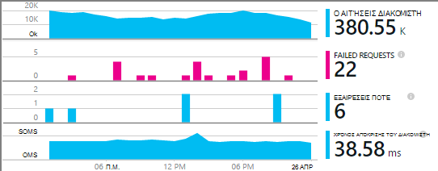
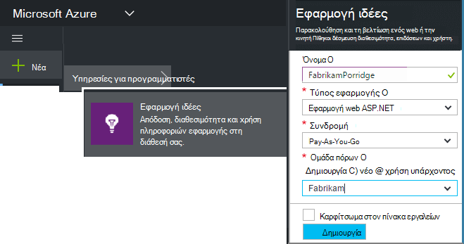
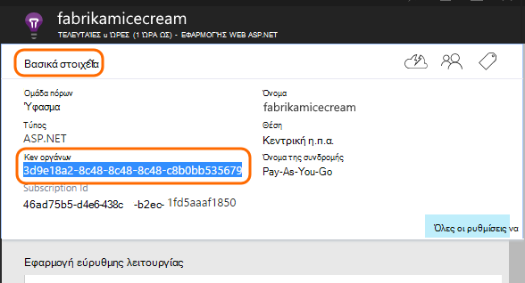
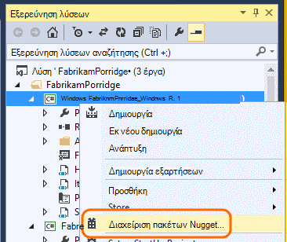
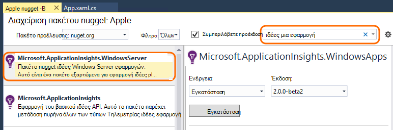
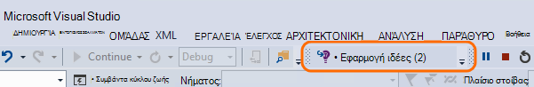
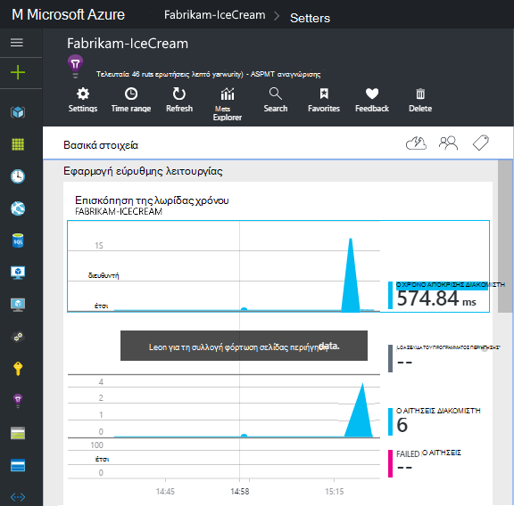
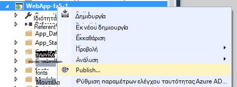

<properties
    pageTitle="Υπηρεσίες εφαρμογών ιδέες για Windows και τους ρόλους εργαζόμενου | Microsoft Azure"
    description="Μη αυτόματη προσθήκη SDK ιδέες για την εφαρμογή στην εφαρμογή σας ASP.NET για την ανάλυση χρήσης, διαθεσιμότητα και την απόδοση."
    services="application-insights"
    documentationCenter=".net"
    authors="alancameronwills"
    manager="douge"/>

<tags
    ms.service="application-insights"
    ms.workload="tbd"
    ms.tgt_pltfrm="ibiza"
    ms.devlang="na"
    ms.topic="get-started-article"
    ms.date="08/30/2016"
    ms.author="awills"/>

# Μη αυτόματη ρύθμιση παραμέτρων εφαρμογής ιδέες για εφαρμογές ASP.NET 4

*Εφαρμογή ιδέες είναι σε προεπισκόπηση.*

[AZURE.INCLUDE [app-insights-selector-get-started](../../includes/app-insights-selector-get-started.md)]

Μπορείτε να ρυθμίσετε με μη αυτόματο τρόπο [Visual Studio εφαρμογή ιδέες](app-insights-overview.md) για την παρακολούθηση των υπηρεσιών Windows, εργαζόμενου ρόλους και άλλες εφαρμογές ASP.NET. Για τις εφαρμογές web, μη αυτόματη ρύθμιση παραμέτρων είναι μια εναλλακτική λύση [αυτόματης εγκατάστασης](app-insights-asp-net.md) που παρέχεται από Visual Studio.

Εφαρμογή ιδέες σας βοηθά να διάγνωση προβλημάτων και παρακολούθηση απόδοσης και η χρήση της εφαρμογής σας live.

#### Πριν ξεκινήσετε

Χρειάζεσαι:

* Μια συνδρομή στο [Microsoft Azure](http://azure.com). Εάν η ομάδα ή την εταιρεία σας έχει μια συνδρομή του Azure, ο κάτοχος να προσθέσετε που, χρησιμοποιώντας το [λογαριασμό Microsoft που διαθέτετε](http://live.com).
* Visual Studio 2013 ή νεότερη έκδοση.

## 1. Δημιουργήστε έναν πόρο ιδέες εφαρμογής

Είσοδος στην [πύλη του Azure](https://portal.azure.com/)και δημιουργήστε ένα νέο πόρο εφαρμογής ιδέες. Επιλέξτε ASP.NET ως ο τύπος της εφαρμογής.

Ένας [πόρος](app-insights-resources-roles-access-control.md) στο Azure είναι μια παρουσία μιας υπηρεσίας. Αυτός ο πόρος είναι όπου θα αναλυθεί και καλείστε να λάβετε τηλεμετρίας από την εφαρμογή.

Η επιλογή του τύπου εφαρμογή ορίζει το προεπιλεγμένο περιεχόμενο από τις λεπίδες πόρου και τις ιδιότητες ορατό στην [Εξερεύνηση των μετρήσεων](app-insights-metrics-explorer.md).

#### Αντιγράψτε τον αριθμό-κλειδί οργάνων

Το κλειδί προσδιορίζει τον πόρο και θα εγκαταστήσετε το συντομότερο στο SDK για να κατευθύνετε τα δεδομένα στον πόρο.

Τα βήματα που μπορείτε απλώς να το κάνει για να δημιουργήσετε ένα νέο πόρο είναι ένας καλός τρόπος για να ξεκινήσετε την παρακολούθηση οποιαδήποτε εφαρμογή του. Τώρα μπορείτε να στείλετε δεδομένα σε αυτό.

## 2. Εγκαταστήστε το SDK στην εφαρμογή σας

Εγκατάσταση και ρύθμιση παραμέτρων του SDK ιδέες εφαρμογής ποικίλλει ανάλογα με την πλατφόρμα εργάζεστε σε. Για τις εφαρμογές ASP.NET, είναι εύκολη.

1. Στο Visual Studio, επεξεργαστείτε τα πακέτα NuGet του έργου σας web app.

    

2. Εγκατάσταση εφαρμογής ιδέες SDK για τις εφαρμογές Web.

    

    *Μπορώ να χρησιμοποιήσω άλλα πακέτα;*

    Ναι. Επιλέξτε το μέγεθος των κύριων API (Microsoft.ApplicationInsights), εάν θέλετε να χρησιμοποιήσετε το API για να στείλετε τη δική σας τηλεμετρίας μόνο. Το πακέτο του Windows Server περιλαμβάνει αυτόματα το μέγεθος των κύριων API συν έναν αριθμό άλλα πακέτα όπως η συλλογή μετρητή επιδόσεων και παρακολούθηση εξάρτηση. 

#### Για να αναβαθμίσετε σε μελλοντικές εκδόσεις SDK

Κυκλοφορήσει μια νέα έκδοση του SDK κατά καιρούς.

Για να κάνετε αναβάθμιση σε μια [νέα έκδοση του SDK](https://github.com/Microsoft/ApplicationInsights-dotnet-server/releases/), ανοίξτε ξανά τη Διαχείριση πακέτου NuGet και να φιλτράρετε εγκατεστημένων πακέτων. Επιλέξτε **Microsoft.ApplicationInsights.Web** και επιλέξτε **αναβάθμιση**.

Εάν έχετε κάνει τυχόν προσαρμογές ApplicationInsights.config, αποθηκεύστε ένα αντίγραφό του πριν από την αναβάθμιση και, στη συνέχεια να συγχωνεύσετε τις αλλαγές με τη νέα έκδοση.

## 3. αποστολή τηλεμετρίας

**Εάν έχετε εγκαταστήσει μόνο το βασικό API πακέτο:**

* Ορισμός του κλειδιού οργάνων στον κώδικα, για παράδειγμα στο `main()`: 

    `TelemetryConfiguration.Active.InstrumentationKey = "`*τον αριθμό-κλειδί*`";` 

* [Γράψτε το δικό σας με χρήση του API τηλεμετρίας](app-insights-api-custom-events-metrics.md#ikey).

**Εάν έχετε εγκαταστήσει το άλλα πακέτα ιδέες εφαρμογή,** μπορείτε να κάνετε, εάν προτιμάτε, χρησιμοποιήστε το αρχείο .config για να ορίσετε τον αριθμό-κλειδί οργάνων:

* Επεξεργασία ApplicationInsights.config (που προστέθηκε κατά την εγκατάσταση NuGet). Εισαγάγετε αυτό ακριβώς πριν από την ετικέτα κλεισίματος:

    `<InstrumentationKey>`*το κλειδί οργάνων που αντιγράψατε*`</InstrumentationKey>`

* Βεβαιωθείτε ότι οι ιδιότητες του ApplicationInsights.config στην Εξερεύνηση λύσεων έχουν οριστεί **Δόμηση ενέργειας = περιεχόμενο, αντιγραφή κατάλογο εξόδου = αντίγραφο**.

## Εκτελέστε το έργο σας

Χρησιμοποιήστε το **F5** για να εκτελέσετε την εφαρμογή σας και να το δοκιμάσετε: άνοιγμα διαφορετικές σελίδες για να δημιουργήσετε ορισμένες τηλεμετρίας.

Στο Visual Studio, θα δείτε μια καταμέτρηση του τα συμβάντα που έχουν σταλεί.

## Προβολή του τηλεμετρίας

Επιστροφή στην [πύλη του Azure](https://portal.azure.com/) και αναζητήστε τον πόρο εφαρμογής ιδέες.

Αναζητήστε τα δεδομένα στα γραφήματα Επισκόπηση. Αρχικά, θα δείτε μόνο μία ή δύο σημεία. Για παράδειγμα:

Κάντε κλικ σε οποιοδήποτε γράφημα για να δείτε πιο λεπτομερείς μετρήσεις. [Μάθετε περισσότερα σχετικά με τις μετρήσεις.](app-insights-web-monitor-performance.md)

#### Δεν υπάρχουν δεδομένα;

* Χρησιμοποιήστε την εφαρμογή, Άνοιγμα διαφορετικές σελίδες, έτσι ώστε να δημιουργεί ορισμένες τηλεμετρίας.
* Ανοίξτε το πλακίδιο [αναζήτησης](app-insights-diagnostic-search.md) , για να δείτε επιμέρους συμβάντα. Ορισμένες φορές χρειάζεται συμβάντα λίγο ενώ περισσότερο χρόνο για να λάβετε μέσω της διοχέτευσης μετρήσεις.
* Περιμένετε μερικά δευτερόλεπτα και κάντε κλικ στην επιλογή **Ανανέωση**. Γραφήματα ανανέωση τον εαυτό τους περιοδικά, αλλά μπορείτε να ανανεώσετε με μη αυτόματο τρόπο εάν περιμένετε για ορισμένα δεδομένα για να εμφανίζονται.
* Ανατρέξτε στο θέμα [Αντιμετώπιση προβλημάτων](app-insights-troubleshoot-faq.md).

## Δημοσίευση της εφαρμογής σας

Τώρα, αναπτύσσετε την εφαρμογή σας με το διακομιστή σας ή για να Azure και παρακολουθήστε τα δεδομένα συγκεντρώσουν.

Κατά την εκτέλεση σε κατάσταση εντοπισμού σφαλμάτων, τηλεμετρίας πραγματοποιείται τη διαδικασία, έτσι ώστε να πρέπει να βλέπετε δεδομένα που εμφανίζεται μέσα σε δευτερόλεπτα. Όταν αναπτύσσετε την εφαρμογή σας στη ρύθμιση παραμέτρων έκδοσης, δεδομένα συγκεντρώνει πιο αργά.

#### Δεν υπάρχουν δεδομένα μετά τη δημοσίευση σε διακομιστή;

Ανοίξτε αυτές τις θύρες για την εξερχόμενη κυκλοφορία του τείχους προστασίας του διακομιστή σας:

+ `dc.services.visualstudio.com:443`
+ `f5.services.visualstudio.com:443`

#### Αντιμετωπίζετε πρόβλημα στο διακομιστή δημιουργία;

Ανατρέξτε στο θέμα [Αντιμετώπιση προβλημάτων αυτού του στοιχείου](app-insights-asp-net-troubleshoot-no-data.md#NuGetBuild).

> [AZURE.NOTE]Εάν η εφαρμογή σας δημιουργεί πολλές τηλεμετρίας (και χρησιμοποιείτε το 2.0.0-beta3 έκδοσης ASP.NET SDK ή νεότερη έκδοση), τη λειτουργική μονάδα προσαρμόσιμη δειγματοληψία μειώνει αυτόματα την ένταση ήχου που αποστέλλονται με την πύλη με την αποστολή μόνο σε αντιπρόσωπος κλάσμα συμβάντων. Ωστόσο, τα συμβάντα που σχετίζονται με την ίδια πρόσκληση σε θα επιλεγμένο ή μη επιλεγμένο ως ομάδα, ώστε να μπορείτε να μετακινηθείτε μεταξύ των σχετικών συμβάντα. 
> [Μάθετε σχετικά με τη δειγματοληψία](app-insights-sampling.md).

## Επόμενα βήματα

* [Προσθήκη περισσότερων τηλεμετρίας](app-insights-asp-net-more.md) για να λάβετε την προβολή πλήρους 360 μοιρών της εφαρμογής σας.

