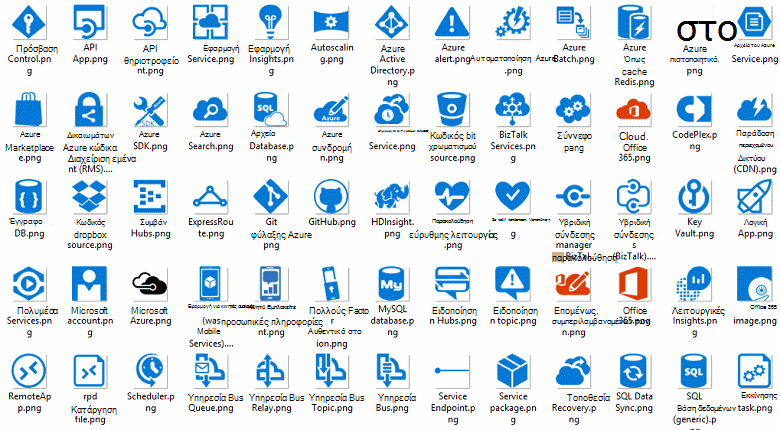

<properties 
    pageTitle="Αρχιτεκτονική της εφαρμογής στο Microsoft Azure | Microsoft Azure" 
    description="Επισκόπηση αρχιτεκτονικής που καλύπτει κοινά μοτίβα σχεδίασης" 
    services="" 
    documentationCenter="" 
    authors="Rboucher" 
    manager="jwhit" 
    editor="mattshel"/>

<tags 
    ms.service="multiple" 
    ms.workload="na" 
    ms.tgt_pltfrm="na" 
    ms.devlang="na" 
    ms.topic="article" 
    ms.date="09/13/2016" 
    ms.author="robb"/>

#Αρχιτεκτονική της εφαρμογής στο Microsoft Azure
Πόροι για τη δημιουργία εφαρμογών που χρησιμοποιούν το Windows Azure. Αυτό περιλαμβάνει εργαλεία για να σας βοηθήσει να σχεδιάσετε διαγράμματα για να περιγράψετε οπτικά συστήματα λογισμικού. 

##Σχεδίαση μοτίβα αφίσας

Microsoft μοτίβα & πρακτικές έχει δημοσιεύσει το βιβλίο [Μοτίβα σχεδίαση Cloud](http://msdn.microsoft.com/library/dn568099.aspx) , η οποία είναι διαθέσιμη τόσο στο MSDN και στο θέμα λήψη PDF. Υπάρχει επίσης μια μεγάλη μορφή διαθέσιμη αφίσα που παραθέτει όλα τα μοτίβα. 

##Microsoft αρχιτεκτονική πιστοποίησης κύκλου

Η Microsoft δημιούργησε ενός σεμιναρίου αρχιτεκτονική υποστήριξης Microsoft πιστοποίησης εξέτασης 70-534. Είναι [διαθέσιμο δωρεάν σε EDX.ORG](https://www.edx.org/course/architecting-microsoft-azure-solutions-microsoft-dev205x).  Χρησιμοποιεί το [Πρότυπο του Visio 3D σχέδιο](#3d-blueprint-visio-template). 

##Λύσεις από τη Microsoft

Microsoft δημοσιεύει ένα σύνολο υψηλού επιπέδου [αρχιτεκτονικές λύσης](http://aka.ms/azblueprints) που δείχνει πώς να δημιουργείτε συγκεκριμένους τύπους συστήματα που χρησιμοποιούν τα προϊόντα της Microsoft. 

Στο παρελθόν, Microsoft δημοσιεύσει ένα σύνολο σχέδια που εμφανίζει το παράδειγμα αρχιτεκτονικές. Αυτές έχουν αντικατασταθεί από τη λύση αρχιτεκτονικές προαναφέρθηκε και τη σύνδεση σχέδιο έχει ανακατευθυνθεί ώστε να οδηγούν σε αυτά. Εάν χρειάζεστε πρόσβαση με το προηγούμενο υλικό σχέδια για κάποιο λόγο, στείλτε μήνυμα ηλεκτρονικού ταχυδρομείου [CnESymbols@microsoft.com](mailto:CnESymbols@microsoft.com) με την αίτησή σας.   

Τα σχέδια και διαγράμματα αρχιτεκτονικές λύση Χρησιμοποιήστε τμήματα του [Cloud και ορίστε σύμβολο για μεγάλες επιχειρήσεις](#Drawing-symbol-and-icon-sets).   

##3Δ πρότυπο του Visio σχέδιο

Οι 3D εκδόσεις των το τώρα ανενεργά [Σχέδια αρχιτεκτονική Microsoft](http://aka.ms/azblueprints) δημιουργήθηκαν αρχικά σε ένα εργαλείο δεν ανήκουν στη Microsoft. 2013 (και νεότερες εκδόσεις) πρότυπο του Visio που αποστέλλονται σε 5 Αυγ 2015 ως μέρος ενός [κύκλου πιστοποίηση Microsoft αρχιτεκτονική κατανεμημένο σε EDX.ORG](#microsoft-architecture-certification-course).

Το πρότυπο είναι επίσης διαθέσιμη έξω από τον κύκλο μαθημάτων. 

- [Προβολή της οθόνης εκπαίδευση](http://aka.ms/3dBlueprintTemplateVideo) πρώτης, ώστε να γνωρίζετε τι μπορεί να κάνει   
- Κάντε λήψη του [Microsoft 3d πρότυπο του Visio σχέδιο](http://aka.ms/3DBlueprintTemplate)
- Κάντε λήψη του [Cloud και σύμβολα για μεγάλες επιχειρήσεις](#drawing-symbol-and-icon-sets) για να χρησιμοποιήσετε με το πρότυπο 3D. 

Ηλεκτρονικό ταχυδρομείο μαζί μας στη [CnESymbols@microsoft.com](mailto:CnESymbols@microsoft.com) για συγκεκριμένες ερωτήσεις δεν απαντήθηκε από το εκπαιδευτικό υλικό ή για να δώσετε σχόλια. Το πρότυπο δεν είναι πλέον στην περιοχή ενεργό ανάπτυξη, αλλά είναι χρήσιμο και σχετικές εξακολουθεί να επειδή μπορεί να χρησιμοποιήσει οποιοδήποτε PNG ή το [Cloud και σύμβολα για μεγάλες επιχειρήσεις](#drawing-symbol-and-icon-sets), που είναι ενημερωθεί.  

##Σύμβολο και εικονίδιο σύνολα σχεδίασης 

[Προβολή του Visio και σύμβολα εκπαιδευτικά βίντεο](http://aka.ms/CnESymbolsVideo) και στη συνέχεια, [κάντε λήψη του στο Cloud και ορίστε σύμβολο για μεγάλες επιχειρήσεις](http://aka.ms/CnESymbols) για να σας βοηθήσει να δημιουργήσετε τεχνική υλικά που περιγράφουν Azure, Windows Server, SQL Server και πολλά άλλα. Εάν το βιβλίο απομνημονεύει άτομα για να χρησιμοποιήσετε τα προϊόντα της Microsoft, μπορείτε να χρησιμοποιήσετε τα σύμβολα σε διαγράμματα αρχιτεκτονικής, εκπαιδευτικό υλικό, παρουσιάσεις, φύλλα δεδομένων, infographics, λευκές βίβλοι και ακόμα 3η βιβλία κατασκευαστή. Ωστόσο, δεν προορίζονται για χρήση σε περιβάλλοντα εργασίας χρήστη.

Τα σύμβολα CnE παρέχονται σε μορφή Visio, SVG και PNG. Πρόσθετες οδηγίες σχετικά με τη χρήση εύκολα Χρησιμοποιήστε τα σύμβολα στο PowerPoint περιλαμβάνονται στο σύνολο. 

Το σύνολο συμβόλων διατίθεται τριμηνιαία και ενημερώνεται καθώς διατίθενται νέες υπηρεσίες. 

Πρόσθετα σύμβολα για το Microsoft Office και τις σχετικές τεχνολογίες είναι διαθέσιμες στο [Microsoft Office Visio στάμπο](http://www.microsoft.com/en-us/download/details.aspx?id=35772), αν και δεν είναι βελτιστοποιημένα για αρχιτεκτονικά διαγράμματα, όπως είναι το σύνολο CnE.   

**Σχολίων:** Εάν έχετε χρησιμοποιήσει τα σύμβολα CnE, συμπληρώστε την σύντομο 5 ερώτηση [έρευνας](http://aka.ms/azuresymbolssurveyv2) ή ηλεκτρονικού ταχυδρομείου μαζί μας στη [CnESymbols@microsoft.com](mailto:CnESymbols@microsoft.com) για συγκεκριμένες ερωτήσεις και θέματα. Προτείνεται να γνωρίζετε τι πιστεύετε ότι, συμπεριλαμβανομένων των θετικό σχολίων, ώστε να γνωρίζουμε θα εξακολουθήσει να επενδύει φορά σε αυτά. 

##Αρχιτεκτονική Infographics

Microsoft δημοσιεύει διάφορες αρχιτεκτονική που σχετίζονται με αφίσες/infographics. Περιλαμβάνουν [Δόμηση ρεαλιστικό Cloud εφαρμογών](https://azure.microsoft.com/documentation/infographics/building-real-world-cloud-apps/) και [κλίμακας με τις υπηρεσίες Cloud](https://azure.microsoft.com/documentation/infographics/cloud-services/) . 

