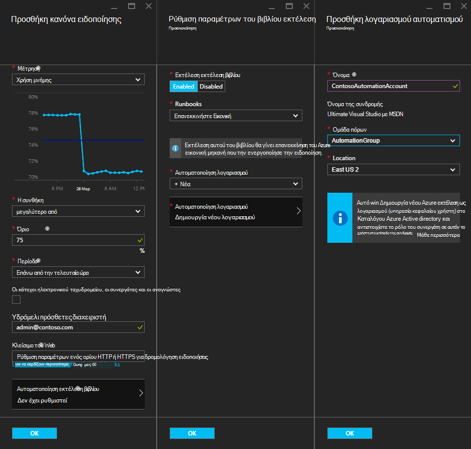
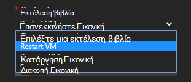
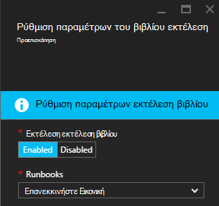
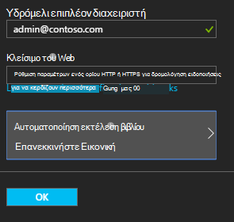

<properties
    pageTitle=" Διόρθωση Azure Εικονική ειδοποιήσεις με αυτοματισμού Runbooks | Microsoft Azure"
    description="Σε αυτό το άρθρο παρουσιάζει πώς μπορείτε να ενοποιήσετε ειδοποιήσεις Azure εικονική μηχανή με runbooks αυτοματισμού Azure και Αυτόματη Διόρθωση προβλημάτων"
    services="automation"
    documentationCenter=""
    authors="mgoedtel"
    manager="jwhit"
    editor="tysonn" />    
<tags
    ms.service="automation"
    ms.devlang="na"
    ms.topic="article"
    ms.tgt_pltfrm="na"
    ms.workload="infrastructure-services"
    ms.date="06/14/2016"
    ms.author="csand;magoedte" />

# <a name="azure-automation-scenario---remediate-azure-vm-alerts"></a>Σενάριο αυτοματισμού Azure - διόρθωση ειδοποιήσεις Εικονική Azure

Azure αυτοματισμού και εικονικές μηχανές Windows Azure έχουν κυκλοφορήσει μια νέα δυνατότητα, επιτρέποντάς σας να ρυθμίσετε τις παραμέτρους ειδοποιήσεις εικονική μηχανή (Εικονική) για να εκτελέσετε runbooks αυτοματισμού. Αυτή η νέα δυνατότητα σάς επιτρέπει να αυτόματη εκτέλεση αποκατάσταση εύρυθμης λειτουργίας τυπική απόκριση σε ειδοποιήσεις Εικονική, όπως επανεκκίνηση ή τον τερματισμό του Εικονική.

Προηγουμένως, κατά τη δημιουργία ειδοποίησης κανόνα Εικονική μπορέσατε να [καθορίσετε μια webhook αυτοματισμού](https://azure.microsoft.com/blog/using-azure-automation-to-take-actions-on-azure-alerts/) με μια runbook για να εκτελέσετε runbook κάθε φορά που ενεργοποίησε την ειδοποίηση. Ωστόσο, αυτό απαιτείται για την εργασία με τη δημιουργία runbook, τη δημιουργία του webhook για runbook, και, στη συνέχεια, αντιγραφή και επικόλληση το webhook κατά τη δημιουργία ειδοποίησης κανόνα. Με αυτήν την νέα έκδοση, η διαδικασία είναι πολύ πιο εύκολο επειδή μπορείτε να επιλέξετε απευθείας μια runbook από μια λίστα κατά τη δημιουργία ειδοποίησης κανόνα και μπορείτε να επιλέξετε ένα λογαριασμό αυτοματισμού, το οποίο θα εκτελέσετε runbook ή να δημιουργήσετε εύκολα ένα λογαριασμό.

Σε αυτό το άρθρο, θα σας δείξουμε πόσο εύκολο είναι να ρυθμίσετε μια ειδοποίηση Εικονική Azure και ρύθμιση παραμέτρων ενός αυτοματισμού runbook για να εκτελέσετε κάθε φορά που ενεργοποιεί την ειδοποίηση. Παραδείγματα σεναρίων περιλαμβάνουν επανεκκίνηση μια Εικονική κατά τη χρήση μνήμης υπερβαίνει ορισμένα όριο οφείλεται σε μια εφαρμογή για την εικονική Μηχανή με απώλεια μνήμης ή διακοπή μια Εικονική κατά το χρόνο χρήστη της CPU έχει γίνει κάτω από το 1% για προηγούμενες ώρα και δεν είναι σε χρήση. Επίσης, θα σας θα εξηγούν τον τρόπο της αυτόματης δημιουργίας μιας υπηρεσίας κεφαλαίου στο λογαριασμό σας αυτοματισμού απλοποιεί τη χρήση των runbooks στο Azure ειδοποίησης αποκατάσταση εύρυθμης λειτουργίας.

## <a name="create-an-alert-on-a-vm"></a>Δημιουργία ειδοποίησης σε μια εικονική Μηχανή

Ακολουθήστε τα παρακάτω βήματα για να ρυθμίσετε μια ειδοποίηση για να ξεκινήσετε μια runbook όταν ικανοποιείται το όριο του.

>[AZURE.NOTE] Με αυτήν την έκδοση, υποστηρίζεται μόνο η V2 εικονικές μηχανές και υποστήριξης για κλασική ΣΠΣ θα προστεθούν σύντομα.  

1. Συνδεθείτε στην πύλη του Azure και κάντε κλικ στην επιλογή **εικονικές μηχανές**.  
2. Επιλέξτε μία από τις εικονικές μηχανές.  Θα εμφανιστεί η εικονική μηχανή blade πίνακα εργαλείων και τα blade **Ρυθμίσεις** στα δεξιά.  
3. Από το blade **Ρυθμίσεις** , στην ενότητα παρακολούθηση, επιλέξτε **κανόνες ειδοποίησης**.
4. Στην το blade **ειδοποίησης κανόνες** , επιλέξτε **Προσθήκη ειδοποίησης**.

Έτσι ανοίγει το blade **Προσθήκη κανόνα ειδοποίησης** , όπου μπορείτε να ρυθμίσετε τις συνθήκες της ειδοποίησης και να επιλέξετε ανάμεσα σε μία ή όλες αυτές τις επιλογές: Αποστολή μηνύματος ηλεκτρονικού ταχυδρομείου σε κάποιον, χρησιμοποιήστε μια webhook για να προωθήσετε την ειδοποίηση προς άλλο σύστημα ή/και εκτέλεση ενός runbook αυτοματισμού στο απόκριση προσπάθειας για διόρθωση του ζητήματος.

## <a name="configure-a-runbook"></a>Ρύθμιση παραμέτρων ενός runbook

Για να ρυθμίσετε τις παραμέτρους μιας runbook ώστε να εκτελείται κατά το όριο προειδοποίησης Εικονική ικανοποιείται, επιλέξτε **Runbook αυτοματισμού**. Στο το blade **runbook ρύθμιση παραμέτρων** , μπορείτε να επιλέξετε runbook για να εκτελέσετε και το λογαριασμό αυτοματισμού για να εκτελέσετε runbook σε.



>[AZURE.NOTE] Για αυτήν την έκδοση μπορείτε να επιλέξετε από τρεις runbooks που παρέχει την υπηρεσία – επανεκκινήστε Εικονική, Εικονική διακοπή ή κατάργηση Εικονική (διαγράψετε).  Η δυνατότητα να επιλέξετε άλλες runbooks ή σε μία από τις δικές σας runbooks θα είναι διαθέσιμο σε μια μελλοντική έκδοση.



Αφού επιλέξετε ένα από τα τρία διαθέσιμα runbooks, εμφανίζεται η αναπτυσσόμενη λίστα **αυτοματισμού λογαριασμού** και μπορείτε να επιλέξετε ένα λογαριασμό αυτοματισμού runbook θα εκτελείται ως. Runbooks πρέπει να εκτελείτε στο περιβάλλον ενός [λογαριασμού αυτοματισμού](automation-security-overview.md) που βρίσκεται στην Azure τη συνδρομή σας. Μπορείτε να επιλέξετε ένα λογαριασμό αυτοματισμού που έχετε ήδη δημιουργήσει ή μπορείτε να έχετε ένα νέο λογαριασμό αυτοματισμού δημιουργείται για εσάς.

Το runbooks που παρέχονται τον έλεγχο ταυτότητας Azure χρησιμοποιώντας αρχής υπηρεσίας. Εάν επιλέξετε να εκτελέσετε runbook με έναν από τους λογαριασμούς σας υπάρχοντα αυτοματισμού, θα σας θα δημιουργήσει αυτόματα την υπηρεσία κεφαλαίου για εσάς. Εάν επιλέξετε να δημιουργήσετε ένα νέο λογαριασμό αυτοματισμού, στη συνέχεια, θα σας δημιουργεί αυτόματα το λογαριασμό και το κεφάλαιο υπηρεσίας. Και στις δύο περιπτώσεις, δύο στοιχεία θα δημιουργηθούν επίσης στο λογαριασμό αυτοματισμού – ενός περιουσιακού στοιχείου πιστοποιητικό με το όνομα **AzureRunAsCertificate** και ενός περιουσιακού στοιχείου σύνδεσης με το όνομα **AzureRunAsConnection**. Το runbooks θα χρησιμοποιήσει **AzureRunAsConnection** για τον έλεγχο ταυτότητας με Azure για να εκτελέσετε την ενέργεια διαχείρισης σε σχέση με την εικονική Μηχανή.

>[AZURE.NOTE] Το κεφάλαιο υπηρεσίας δημιουργείται στην εμβέλεια συνδρομής και έχει αντιστοιχιστεί το ρόλο του συνεργάτη. Αυτός ο ρόλος απαιτείται για το λογαριασμό για να έχετε δικαιώματα για να εκτελέσετε αυτοματισμού runbooks για τη Διαχείριση ΣΠΣ Azure.  Η δημιουργία ενός λογαριασμού Automaton ή/και υπηρεσία κεφαλαίου είναι μοναδικού συμβάντος. Όταν δημιουργούνται, μπορείτε να χρησιμοποιήσετε αυτόν το λογαριασμό για να εκτελέσετε runbooks για άλλες ειδοποιήσεις Εικονική Azure.

Όταν κάνετε κλικ στο **κουμπί OK** ειδοποίηση έχει ρυθμιστεί και εάν έχετε επιλέξει την επιλογή για να δημιουργήσετε ένα νέο λογαριασμό αυτοματισμού, δημιουργείται μαζί με την υπηρεσία κεφαλαίου.  Αυτό μπορεί να χρειαστούν μερικά δευτερόλεπτα για να ολοκληρωθεί.  



Μετά την ολοκλήρωση της ρύθμισης παραμέτρων θα δείτε το όνομα του runbook εμφανίζεται στο το blade **Προσθήκη κανόνα ειδοποίησης** .



Κάντε κλικ στο κουμπί **OK** στο την **Προσθήκη κανόνα ειδοποίησης** blade και ο κανόνας ειδοποίησης θα δημιουργηθεί και ενεργοποιήστε, εάν η εικονική μηχανή είναι σε κατάσταση λειτουργίας.

### <a name="enable-or-disable-a-runbook"></a>Ενεργοποίηση ή απενεργοποίηση ενός runbook

Εάν έχετε ένα runbook έχει ρυθμιστεί για μια ειδοποίηση, μπορείτε να το απενεργοποιήσετε χωρίς κατάργηση της ρύθμισης παραμέτρων runbook. Αυτό σας επιτρέπει να διατηρήσετε την ειδοποίηση εκτελείται και ίσως να ελέγξετε ορισμένων από τους κανόνες ειδοποίησης και αργότερα να ενεργοποιήσετε ξανά runbook.

## <a name="create-a-runbook-that-works-with-an-azure-alert"></a>Δημιουργία μιας runbook που λειτουργεί με το Azure ειδοποίησης

Όταν επιλέγετε ένα runbook ως τμήμα ενός κανόνα Azure ειδοποίησης, runbook πρέπει να έχει λογικής σε αυτό για να διαχειριστείτε τα δεδομένα ειδοποιήσεων που μεταβιβάζεται σε αυτήν.  Όταν ένα runbook έχει ρυθμιστεί σε έναν κανόνα ειδοποίησης, μια webhook δημιουργείται για runbook; webhook που χρησιμοποιείται για να ξεκινήσετε runbook κάθε φορά που ενεργοποιεί την ειδοποίηση.  Η πραγματική κλήση για να ξεκινήσετε runbook είναι μια αίτηση HTTP POST στη διεύθυνση URL webhook. Στο σώμα της πρόσκλησης σε ΔΗΜΟΣΊΕΥΣΗ περιέχει ένα JSON διαμορφωμένη αντικείμενο το οποίο περιέχει χρήσιμες ιδιότητες που σχετίζονται με την ειδοποίηση.  Όπως μπορείτε να δείτε παρακάτω, τα δεδομένα ειδοποιήσεων περιέχει πληροφορίες όπως subscriptionID resourceGroupName, resourceName και τύπου πόρου.

### <a name="example-of-alert-data"></a>Παράδειγμα ειδοποίησης δεδομένων
```
{
    "WebhookName": "AzureAlertTest",
    "RequestBody": "{
    \"status\":\"Activated\",
    \"context\": {
        \"id\":\"/subscriptions/<subscriptionId>/resourceGroups/MyResourceGroup/providers/microsoft.insights/alertrules/AlertTest\",
        \"name\":\"AlertTest\",
        \"description\":\"\",
        \"condition\": {
            \"metricName\":\"CPU percentage guest OS\",
            \"metricUnit\":\"Percent\",
            \"metricValue\":\"4.26337916666667\",
            \"threshold\":\"1\",
            \"windowSize\":\"60\",
            \"timeAggregation\":\"Average\",
            \"operator\":\"GreaterThan\"},
        \"subscriptionId\":\<subscriptionID> \",
        \"resourceGroupName\":\"TestResourceGroup\",
        \"timestamp\":\"2016-04-24T23:19:50.1440170Z\",
        \"resourceName\":\"TestVM\",
        \"resourceType\":\"microsoft.compute/virtualmachines\",
        \"resourceRegion\":\"westus\",
        \"resourceId\":\"/subscriptions/<subscriptionId>/resourceGroups/TestResourceGroup/providers/Microsoft.Compute/virtualMachines/TestVM\",
        \"portalLink\":\"https://portal.azure.com/#resource/subscriptions/<subscriptionId>/resourceGroups/TestResourceGroup/providers/Microsoft.Compute/virtualMachines/TestVM\"
        },
    \"properties\":{}
    }",
    "RequestHeader": {
        "Connection": "Keep-Alive",
        "Host": "<webhookURL>"
    }
}
```

Όταν η υπηρεσία webhook αυτοματισμού λαμβάνει την ΚΑΤΑΧΏΡΗΣΗ HTTP, εξάγει τα δεδομένα ειδοποιήσεων και μεταβιβάζει runbook στην παράμετρο εισόδου runbook WebhookData.  Ακολουθεί ένα δείγμα runbook που δείχνει πώς μπορείτε να χρησιμοποιήσετε την παράμετρο WebhookData και να εξαγάγετε τα δεδομένα ειδοποιήσεων και να το χρησιμοποιήσετε για να διαχειριστείτε τον πόρο Azure που την ενεργοποίησε την ειδοποίηση.

### <a name="example-runbook"></a>Παράδειγμα runbook

```
#  This runbook will restart an ARM (V2) VM in response to an Azure VM alert.

[OutputType("PSAzureOperationResponse")]

param ( [object] $WebhookData )

if ($WebhookData)
{
    # Get the data object from WebhookData
    $WebhookBody = (ConvertFrom-Json -InputObject $WebhookData.RequestBody)

    # Assure that the alert status is 'Activated' (alert condition went from false to true)
    # and not 'Resolved' (alert condition went from true to false)
    if ($WebhookBody.status -eq "Activated")
    {
        # Get the info needed to identify the VM
        $AlertContext = [object] $WebhookBody.context
        $ResourceName = $AlertContext.resourceName
        $ResourceType = $AlertContext.resourceType
        $ResourceGroupName = $AlertContext.resourceGroupName
        $SubId = $AlertContext.subscriptionId

        # Assure that this is the expected resource type
        Write-Verbose "ResourceType: $ResourceType"
        if ($ResourceType -eq "microsoft.compute/virtualmachines")
        {
            # This is an ARM (V2) VM

            # Authenticate to Azure with service principal and certificate
            $ConnectionAssetName = "AzureRunAsConnection"
            $Conn = Get-AutomationConnection -Name $ConnectionAssetName
            if ($Conn -eq $null) {
                throw "Could not retrieve connection asset: $ConnectionAssetName. Check that this asset exists in the Automation account."
            }
            Add-AzureRMAccount -ServicePrincipal -Tenant $Conn.TenantID -ApplicationId $Conn.ApplicationID -CertificateThumbprint $Conn.CertificateThumbprint | Write-Verbose
            Set-AzureRmContext -SubscriptionId $SubId -ErrorAction Stop | Write-Verbose

            # Restart the VM
            Restart-AzureRmVM -Name $ResourceName -ResourceGroupName $ResourceGroupName
        } else {
            Write-Error "$ResourceType is not a supported resource type for this runbook."
        }
    } else {
        # The alert status was not 'Activated' so no action taken
        Write-Verbose ("No action taken. Alert status: " + $WebhookBody.status)
    }
} else {
    Write-Error "This runbook is meant to be started from an Azure alert only."
}
```

## <a name="summary"></a>Σύνοψη

Όταν ρυθμίζετε μια ειδοποίηση σε μια Εικονική Azure, τώρα έχετε τη δυνατότητα να ρυθμίσετε εύκολα τις μια αυτοματισμού runbook για την αυτόματη εκτέλεση ενεργειών αποκατάσταση εύρυθμης λειτουργίας, όταν ενεργοποιεί την ειδοποίηση. Για αυτήν την έκδοση, μπορείτε να επιλέξετε από runbooks για να επανεκκινήσετε, να διακόψετε ή να διαγράψετε μια Εικονική ανάλογα με το σενάριό σας ειδοποίησης. Αυτή είναι μόνο η αρχή της ενεργοποίησης σενάρια όπου μπορείτε να ελέγχετε τις ενέργειες (ανακοίνωση, αντιμετώπιση προβλημάτων, αποκατάσταση εύρυθμης λειτουργίας) που θα ληφθούν αυτόματα όταν ενεργοποιεί μια ειδοποίηση.

## <a name="next-steps"></a>Επόμενα βήματα

- Για να ξεκινήσετε με runbooks γραφικών, ανατρέξτε στο θέμα [μου πρώτη runbook γραφικών](automation-first-runbook-graphical.md)
- Για να ξεκινήσετε με το PowerShell runbooks ροής εργασίας, ανατρέξτε στο θέμα [μου πρώτη runbook PowerShell ροής εργασίας](automation-first-runbook-textual.md)
- Για να μάθετε περισσότερα σχετικά με τους τύπους runbook, τους πλεονεκτήματα και τους περιορισμούς, ανατρέξτε στο θέμα [τύποι runbook αυτοματισμού Azure](automation-runbook-types.md)
