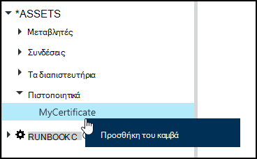
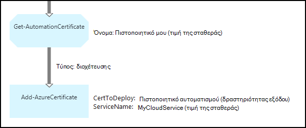

<properties 
   pageTitle="Πιστοποιητικό περιουσιακών στοιχείων αυτοματισμού Azure | Microsoft Azure"
   description="Πιστοποιητικά μπορούν να αποθηκευτούν με ασφάλεια σε Azure αυτοματισμού, ώστε να είναι δυνατή από runbooks ή DSC ρυθμίσεις παραμέτρων για τον έλεγχο ταυτότητας έναντι Azure και πόρους άλλου κατασκευαστή.  Σε αυτό το άρθρο εξηγεί τις λεπτομέρειες της πιστοποιητικά και πώς μπορείτε να εργαστείτε με αυτά που περιέχουν κείμενο και γραφικά σύνταξης."
   services="automation"
   documentationCenter=""
   authors="mgoedtel"
   manager="stevenka"
   editor="tysonn" />
<tags 
   ms.service="automation"
   ms.devlang="na"
   ms.topic="article"
   ms.tgt_pltfrm="na"
   ms.workload="infrastructure-services"
   ms.date="02/23/2016"
   ms.author="magoedte;bwren" />

# Πιστοποιητικό περιουσιακών στοιχείων αυτοματισμού Azure

Πιστοποιητικά μπορούν να αποθηκευτούν με ασφάλεια στο Azure αυτοματισμού, ώστε να είναι δυνατή από runbooks ή DSC παράμετροι που χρησιμοποιούν τη δραστηριότητα **Get-AutomationCertificate** . Αυτό σας επιτρέπει να δημιουργήσετε runbooks και ρυθμίσεις παραμέτρων DSC που χρησιμοποιούν πιστοποιητικά για έλεγχο ταυτότητας ή προσθέτει τους πόρους Azure ή άλλου κατασκευαστή.

>[AZURE.NOTE] Ασφαλής περιουσιακών στοιχείων αυτοματισμού Azure περιλαμβάνουν διαπιστευτηρίων, τα πιστοποιητικά, συνδέσεις και κρυπτογραφημένο μεταβλητές. Αυτά τα στοιχεία κρυπτογραφούνται και αποθηκεύονται στο την αυτοματοποίηση Azure χρησιμοποιώντας ένα μοναδικό κλειδί που δημιουργείται για κάθε λογαριασμό αυτοματισμού. Αυτό το κλειδί κρυπτογραφούνται από το πρωτότυπο πιστοποιητικό και αποθηκεύονται στο Azure αυτοματισμού. Πριν από την αποθήκευση ενός ασφαλούς περιουσιακού στοιχείου, το κλειδί για το λογαριασμό αυτοματισμού είναι κρυπτογραφημένα χρησιμοποιώντας το πρωτότυπο πιστοποιητικό και, στη συνέχεια, χρησιμοποιείται για την κρυπτογράφηση του περιουσιακού στοιχείου.

## Cmdlet του Windows PowerShell

Για να δημιουργήσετε και να διαχειριστείτε πόρους πιστοποιητικό αυτοματισμού με το Windows PowerShell χρησιμοποιούνται τα cmdlet στον παρακάτω πίνακα. Στείλει ως μέρος της [λειτουργικής μονάδας Azure PowerShell](../powershell-install-configure.md) , που είναι διαθέσιμη για χρήση σε runbooks αυτοματισμού και ρυθμίσεις παραμέτρων DSC.

|Cmdlet για|Περιγραφή|
|:---|:---|
|[Get-AzureAutomationCertificate](http://msdn.microsoft.com/library/dn913765.aspx)|Ανακτά πληροφορίες σχετικά με ένα πιστοποιητικό. Μπορείτε να ανακτήσετε μόνο το πιστοποιητικό μόνο από τη δραστηριότητα Get-AutomationCertificate.|
|[Νέα AzureAutomationCertificate](http://msdn.microsoft.com/library/dn913764.aspx)|Εισάγει ένα νέο πιστοποιητικό στον Azure αυτοματισμού.|
|[Κατάργηση - AzureAutomationCertificate](http://msdn.microsoft.com/library/dn913773.aspx)|Καταργεί ένα πιστοποιητικό από Azure αυτοματισμού.|
|[Ορισμός - AzureAutomationCertificate](http://msdn.microsoft.com/library/dn913763.aspx)|Ορίζει τις ιδιότητες για ένα υπάρχον πιστοποιητικό όπως αποστολή του αρχείου πιστοποιητικό και τη ρύθμιση του κωδικού πρόσβασης για ένα .pfx.|

## Δραστηριότητες για να αποκτήσετε πρόσβαση πιστοποιητικών

Οι δραστηριότητες στον παρακάτω πίνακα χρησιμοποιούνται για την πρόσβαση στα πιστοποιητικά σε runbook ή ρύθμισης παραμέτρων DSC.

|Δραστηριότητες|Περιγραφή|
|:---|:---|
|Get-AutomationCertificate|Λαμβάνει ένα πιστοποιητικό για να χρησιμοποιήσετε σε ένα runbook ή ρύθμισης παραμέτρων DSC.|

>[AZURE.NOTE] Πρέπει να αποφύγετε τη χρήση μεταβλητών στην – όνομα παράμετρο της Get-AutomationCertificate επειδή αυτό μπορεί να περιπλέξει ανακαλύψετε εξαρτήσεις μεταξύ runbooks ή ρυθμίσεις παραμέτρων DSC και πιστοποιητικού περιουσιακών στοιχείων κατά το χρόνο σχεδίασης.

## Δημιουργία νέου πιστοποιητικού

Όταν δημιουργείτε ένα νέο πιστοποιητικό, μπορείτε να αποστείλετε ένα αρχείο .cer ή .pfx Azure αυτοματισμού. Εάν μπορείτε να επισημάνετε το πιστοποιητικό με δυνατότητα εξαγωγής, στη συνέχεια, μπορείτε να μεταφέρετε το από το χώρο αποθήκευσης πιστοποιητικών Azure αυτοματισμού. Εάν δεν είναι δυνατή η εξαγωγή, στη συνέχεια, αυτό μπορεί να χρησιμοποιηθεί μόνο για την υπογραφή της runbook ή της ρύθμισης παραμέτρων DSC.

### Για να δημιουργήσετε ένα νέο πιστοποιητικό με την πύλη κλασική του Azure

1. Από το λογαριασμό σας αυτοματισμού, κάντε κλικ στην επιλογή **στοιχεία** στο επάνω μέρος του παραθύρου.
1. Στο κάτω μέρος του παραθύρου, κάντε κλικ στην επιλογή **Προσθήκη τη ρύθμιση**.
1. Κάντε κλικ στην επιλογή **Προσθήκη διαπιστευτηρίων**.
2. Στην αναπτυσσόμενη λίστα **Διαπιστευτήρια τύπου** , επιλέξτε **πιστοποιητικό**.
3. Πληκτρολογήστε ένα όνομα για το πιστοποιητικό στο πλαίσιο **όνομα** και κάντε κλικ στο δεξιό βέλος.
4. Αναζήτηση για ένα αρχείο .cer ή .pfx.  Εάν επιλέξετε ένα αρχείο .pfx, καθορίστε έναν κωδικό πρόσβασης και εάν θα πρέπει να επιτρέπεται να εξαχθούν.
1. Κάντε κλικ στο σημάδι ελέγχου για να αποστείλετε το αρχείο πιστοποιητικού και να αποθηκεύσετε το νέο πάγιο πιστοποιητικού.

### Για να δημιουργήσετε ένα νέο πιστοποιητικό με την πύλη του Azure

1. Από το λογαριασμό σας αυτοματισμού, κάντε κλικ στο τμήμα **περιουσιακών στοιχείων** για να ανοίξετε το blade **περιουσιακών στοιχείων** .
1. Κάντε κλικ στο τμήμα **πιστοποιητικά** για να ανοίξετε το blade **πιστοποιητικά** .
1. Κάντε κλικ στην επιλογή **Προσθήκη ενός πιστοποιητικού** στο επάνω μέρος του blade.
2. Στο πλαίσιο **όνομα** , πληκτρολογήστε ένα όνομα για το πιστοποιητικό.
2. Κάντε κλικ στην επιλογή **Επιλογή αρχείου** στην περιοχή **Αποστολή αρχείου πιστοποιητικό** για να αναζητήσετε ένα αρχείο .cer ή .pfx.  Εάν επιλέξετε ένα αρχείο .pfx, καθορίστε έναν κωδικό πρόσβασης και εάν θα πρέπει να επιτρέπεται να εξαχθούν.
1. Κάντε κλικ στην επιλογή **Δημιουργία** για να αποθηκεύσετε το νέο πάγιο πιστοποιητικού.

### Για να δημιουργήσετε ένα νέο πιστοποιητικό με το Windows PowerShell

Τα ακόλουθα δείγματα εντολών δείχνουν πώς μπορείτε να δημιουργήσετε ένα νέο πιστοποιητικό αυτοματισμού και επισημαίνει δυνατότητα εξαγωγής. Αυτή η κίνηση εισάγει ένα υπάρχον αρχείο .pfx.

    $certName = 'MyCertificate'
    $certPath = '.\MyCert.pfx'
    $certPwd = ConvertTo-SecureString -String 'P@$$w0rd' -AsPlainText -Force
    
    New-AzureAutomationCertificate -AutomationAccountName "MyAutomationAccount" -Name $certName -Path $certPath –Password $certPwd -Exportable

## Χρήση ενός πιστοποιητικού

Πρέπει να χρησιμοποιήσετε τη δραστηριότητα **Get-AutomationCertificate** για να χρησιμοποιήσετε ένα πιστοποιητικό. Δεν μπορείτε να χρησιμοποιήσετε το cmdlet [Get-AzureAutomationCertificate](http://msdn.microsoft.com/library/dn913765.aspx) , επειδή η συνάρτηση επιστρέφει πληροφορίες σχετικά με το πιστοποιητικό περιουσιακών στοιχείων, αλλά όχι το πιστοποιητικό ίδια.

### Δείγμα κειμένου runbook

Το παρακάτω δείγμα κώδικα δείχνει πώς μπορείτε να προσθέσετε ένα πιστοποιητικό σε μια υπηρεσία cloud σε μια runbook. Σε αυτό το δείγμα, ο κωδικός πρόσβασης ανακτώνται από μια μεταβλητή κρυπτογραφημένο αυτοματισμού.

    $serviceName = 'MyCloudService'
    $cert = Get-AutomationCertificate -Name 'MyCertificate'
    $certPwd = Get-AutomationVariable –Name 'MyCertPassword'
    Add-AzureCertificate -ServiceName $serviceName -CertToDeploy $cert

### Δείγμα γραφικού runbook

Μπορείτε να προσθέσετε μια **Get-AutomationCertificate** σε ένα γραφικό runbook κάνοντας δεξί κλικ στο πιστοποιητικό στο παράθυρο "βιβλιοθήκη" του προγράμματος επεξεργασίας γραφικών και να επιλέξετε **Προσθήκη στη καμβά**.

Η παρακάτω εικόνα παρουσιάζει ένα παράδειγμα της χρήσης ενός πιστοποιητικού σε μια runbook γραφικών.  Αυτό είναι το ίδιο παράδειγμα που φαίνεται παραπάνω για την προσθήκη ενός πιστοποιητικού σε μια υπηρεσία cloud από ένα runbook που περιέχουν κείμενο.  

Αυτό το παράδειγμα χρησιμοποιεί την παράμετρο **UseConnectionObject** για τη δραστηριότητα **Αποστολής TwilioSMS** που χρησιμοποιεί ένα αντικείμενο σύνδεσης για τον έλεγχο ταυτότητας για την υπηρεσία.  [Σύνδεση διοχέτευσης](automation-graphical-authoring-intro.md#links-and-workflow) πρέπει να χρησιμοποιείται εδώ επειδή ακολουθία σύνδεσης θα επιστρέψει μια συλλογή που περιέχει ένα αντικείμενο που δεν είναι αναμενόμενα η παράμετρος σύνδεσης.

## Δείτε επίσης

- [Συνδέσεις γραφικών σύνταξης](automation-graphical-authoring-intro.md#links-and-workflow) 
