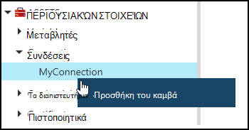
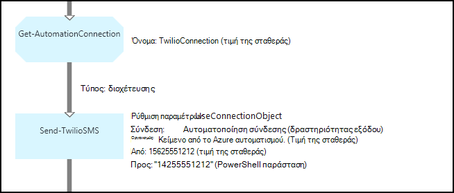
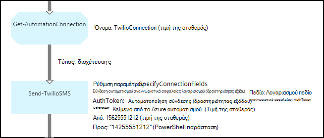

<properties 
   pageTitle="Σύνδεση περιουσιακών στοιχείων αυτοματισμού Azure | Microsoft Azure"
   description="Σύνδεση περιουσιακών στοιχείων αυτοματισμού Azure περιέχει τις πληροφορίες που απαιτούνται για να συνδεθείτε με μια εξωτερική υπηρεσία ή την εφαρμογή από runbook ή ρύθμισης παραμέτρων DSC. Σε αυτό το άρθρο εξηγεί τις λεπτομέρειες των συνδέσεων και πώς μπορείτε να εργαστείτε με αυτά που περιέχουν κείμενο και γραφικά σύνταξης."
   services="automation"
   documentationCenter=""
   authors="bwren"
   manager="stevenka"
   editor="tysonn" />
<tags 
   ms.service="automation"
   ms.devlang="na"
   ms.topic="article"
   ms.tgt_pltfrm="na"
   ms.workload="infrastructure-services"
   ms.date="01/27/2016"
   ms.author="bwren" />

# Σύνδεση περιουσιακών στοιχείων αυτοματισμού Azure

Ενός περιουσιακού στοιχείου σύνδεσης αυτοματισμού περιέχει τις πληροφορίες που απαιτούνται για να συνδεθείτε με μια εξωτερική υπηρεσία ή την εφαρμογή από runbook ή ρύθμισης παραμέτρων DSC. Αυτό μπορεί να περιλαμβάνει πληροφορίες που απαιτούνται για τον έλεγχο ταυτότητας, όπως ένα όνομα χρήστη και τον κωδικό πρόσβασης, εκτός από τις πληροφορίες σύνδεσης, όπως μια διεύθυνση URL ή μια θύρα. Η τιμή της σύνδεσης είναι διατηρώντας όλες τις ιδιότητες για τη σύνδεση με μια συγκεκριμένη εφαρμογή σε μία περιουσιακών στοιχείων αντί της δημιουργίας πολλές μεταβλητές. Ο χρήστης μπορεί να επεξεργαστείτε τις τιμές για μια σύνδεση σε ένα σημείο και να δίνετε το όνομα μιας σύνδεσης σε runbook ή ρύθμισης παραμέτρων DSC σε μία παράμετρο. Οι ιδιότητες για μια σύνδεση είναι δυνατή η πρόσβαση στο runbook ή ρύθμισης παραμέτρων DSC με τη δραστηριότητα **Get-AutomationConnection** .

Όταν δημιουργείτε μια σύνδεση, πρέπει να καθορίσετε έναν *τύπο σύνδεσης*. Ο τύπος σύνδεσης είναι ένα πρότυπο που ορίζει ένα σύνολο ιδιοτήτων. Η σύνδεση ορίζει τιμές για κάθε ιδιότητα ορίζεται στο τον τύπο σύνδεσης. Τύποι συνδέσεων προστίθενται αυτοματισμού Azure σε λειτουργικές μονάδες ενοποίησης ή που δημιουργήθηκαν με το [API αυτοματισμού Azure](http://msdn.microsoft.com/library/azure/mt163818.aspx). Οι τύποι μοναδική σύνδεση που είναι διαθέσιμες όταν δημιουργείτε μια σύνδεση είναι αυτά που είναι εγκατεστημένα στο λογαριασμό σας αυτοματισμού.

>[AZURE.NOTE] Ασφαλής περιουσιακών στοιχείων αυτοματισμού Azure περιλαμβάνουν διαπιστευτηρίων, τα πιστοποιητικά, συνδέσεις και κρυπτογραφημένο μεταβλητές. Αυτά τα στοιχεία κρυπτογραφούνται και αποθηκεύονται στο την αυτοματοποίηση Azure χρησιμοποιώντας ένα μοναδικό κλειδί που δημιουργείται για κάθε λογαριασμό αυτοματισμού. Αυτό το κλειδί κρυπτογραφούνται από το πρωτότυπο πιστοποιητικό και αποθηκεύονται στο Azure αυτοματισμού. Πριν από την αποθήκευση ενός ασφαλούς περιουσιακού στοιχείου, το κλειδί για το λογαριασμό αυτοματισμού είναι κρυπτογραφημένα χρησιμοποιώντας το πρωτότυπο πιστοποιητικό και, στη συνέχεια, χρησιμοποιείται για την κρυπτογράφηση του περιουσιακού στοιχείου.

## Cmdlet του Windows PowerShell

Τα cmdlet στον παρακάτω πίνακα χρησιμοποιούνται για τη δημιουργία και διαχείριση συνδέσεων αυτοματισμού με το Windows PowerShell. Στείλει ως μέρος της [λειτουργικής μονάδας Azure PowerShell](../powershell-install-configure.md) , που είναι διαθέσιμη για χρήση σε runbooks αυτοματισμού και ρυθμίσεις παραμέτρων DSC.

|Cmdlet|Περιγραφή|
|:---|:---|
|[Get-AzureAutomationConnection](http://msdn.microsoft.com/library/dn921828.aspx)|Ανακτά μια σύνδεση. Περιλαμβάνει κατακερματισμός πίνακα με τις τιμές των πεδίων τη σύνδεση.|
|[Νέα AzureAutomationConnection](http://msdn.microsoft.com/library/dn921825.aspx)|Δημιουργεί μια νέα σύνδεση.|
|[Κατάργηση AzureAutomationConnection](http://msdn.microsoft.com/library/dn921827.aspx)|Κατάργηση μιας υπάρχουσας σύνδεσης.|
|[Ορισμός AzureAutomationConnectionFieldValue](http://msdn.microsoft.com/library/dn921826.aspx)|Ορίζει την τιμή ενός συγκεκριμένου πεδίου για μια υπάρχουσα σύνδεση.|

## Δραστηριότητες

Οι δραστηριότητες στον παρακάτω πίνακα που χρησιμοποιούνται για να αποκτήσετε πρόσβαση σε συνδέσεις σε runbook ή ρύθμισης παραμέτρων DSC.

|Δραστηριότητες|Περιγραφή|
|---|---|
|Get-AutomationConnection|Λαμβάνει μια σύνδεση για να χρησιμοποιήσετε. Επιστρέφει έναν πίνακα κατακερματισμός με τις ιδιότητες της σύνδεσης.|

>[AZURE.NOTE] Πρέπει να αποφύγετε τη χρήση μεταβλητών στην – όνομα παράμετρο της **Get-AutomationConnection** επειδή αυτό μπορεί να περιπλέξει ανακαλύψετε εξαρτήσεων μεταξύ runbooks ή ρυθμίσεις παραμέτρων DSC και στοιχεία σύνδεσης, κατά τη σχεδίαση.

## Δημιουργία νέας σύνδεσης

### Για να δημιουργήσετε μια νέα σύνδεση με την πύλη κλασική του Azure

1. Από το λογαριασμό σας αυτοματισμού, κάντε κλικ στην επιλογή **στοιχεία** στο επάνω μέρος του παραθύρου.
1. Στο κάτω μέρος του παραθύρου, κάντε κλικ στην επιλογή **Προσθήκη τη ρύθμιση**.
1. Κάντε κλικ στην επιλογή **Προσθήκη σύνδεσης**.
2. Στην αναπτυσσόμενη λίστα **Τύπος σύνδεσης** , επιλέξτε τον τύπο της σύνδεσης που θέλετε να δημιουργήσετε.  Ο οδηγός θα εμφανίσει τις ιδιότητες για αυτόν τον συγκεκριμένο τύπο.
1. Ολοκλήρωση του οδηγού και κάντε κλικ στο πλαίσιο ελέγχου για να αποθηκεύσετε τη νέα σύνδεση.

### Για να δημιουργήσετε μια νέα σύνδεση με την πύλη του Azure

1. Από το λογαριασμό σας αυτοματισμού, κάντε κλικ στο τμήμα **περιουσιακών στοιχείων** για να ανοίξετε το blade **περιουσιακών στοιχείων** .
1. Κάντε κλικ στο τμήμα **συνδέσεις** για να ανοίξετε το blade **συνδέσεις** .
1. Κάντε κλικ στην επιλογή **Προσθήκη σύνδεσης** στο επάνω μέρος του blade.
2. Στην αναπτυσσόμενη λίστα **Type** , επιλέξτε τον τύπο της σύνδεσης που θέλετε να δημιουργήσετε. Στη φόρμα θα εμφανίσει τις ιδιότητες για αυτόν τον συγκεκριμένο τύπο.
1. Συμπληρώστε τη φόρμα και κάντε κλικ στην επιλογή **Δημιουργία** για να αποθηκεύσετε τη νέα σύνδεση.

### Για να δημιουργήσετε μια νέα σύνδεση με το Windows PowerShell

Δημιουργήστε μια νέα σύνδεση με το Windows PowerShell χρησιμοποιώντας το cmdlet [New-AzureAutomationConnection](http://msdn.microsoft.com/library/dn921825.aspx) . Αυτό το cmdlet περιλαμβάνει μια παράμετρο που ονομάζεται **ConnectionFieldValues** που αναμένεται από έναν [πίνακα κατακερματισμός](http://technet.microsoft.com/library/hh847780.aspx) τον ορισμό τιμών για κάθε μία από τις ιδιότητες που ορίζονται από τον τύπο σύνδεσης.

Τα ακόλουθα δείγματα εντολών δημιουργήσετε μια νέα σύνδεση για [Twilio](http://www.twilio.com) , η οποία είναι μια υπηρεσία τηλεφωνίας που σας επιτρέπει να στέλνετε και να λαμβάνετε μηνύματα κειμένου.  Μια λειτουργική μονάδα ενοποίηση του δείγματος που περιλαμβάνει μια Twilio τύπο σύνδεσης είναι διαθέσιμη στο [Κέντρο δεσμών ενεργειών](http://gallery.technet.microsoft.com/scriptcenter/Twilio-PowerShell-Module-8a8bfef8).  Αυτός ο τύπος σύνδεσης Ορίζει ιδιότητες για το αναγνωριστικό λογαριασμού ΑΣΦΑΛΕΊΑΣ και διακριτικού εξουσιοδότησης, οι οποίες απαιτείται να επικυρώσετε το λογαριασμό σας κατά τη σύνδεση με Twilio.  Πρέπει να [κάνετε λήψη αυτήν τη λειτουργική μονάδα](http://gallery.technet.microsoft.com/scriptcenter/Twilio-PowerShell-Module-8a8bfef8) και εγκαταστήσετε στο λογαριασμό σας αυτοματισμού για αυτόν τον κωδικό δείγμα για να εργαστείτε.

    $AccountSid = "DAf5fed830c6f8fac3235c5b9d58ed7ac5"
    $AuthToken  = "17d4dadfce74153d5853725143c52fd1"
    $FieldValues = @{"AccountSid" = $AccountSid;"AuthToken"=$AuthToken}

    New-AzureAutomationConnection -AutomationAccountName "MyAutomationAccount" -Name "TwilioConnection" -ConnectionTypeName "Twilio" -ConnectionFieldValues $FieldValues

## Χρήση μιας σύνδεσης σε μια runbook ή DSC ρύθμισης παραμέτρων

Μπορείτε να ανακτήσετε μια σύνδεση σε μια runbook ή ρύθμισης παραμέτρων DSC με το cmdlet **Get-AutomationConnection** .  Αυτήν τη δραστηριότητα ανακτά τις τιμές των πεδίων διαφορετικό στη σύνδεση και επιστρέφει τους ως [κατακερματισμός πίνακα](http://go.microsoft.com/fwlink/?LinkID=324844) που μπορούν να χρησιμοποιηθούν με τις κατάλληλες εντολές στο runbook ή ρύθμισης παραμέτρων DSC.

### Δείγμα κειμένου runbook
Τα ακόλουθα δείγματα εντολών δείχνουν πώς μπορείτε να χρησιμοποιείτε τη σύνδεση Twilio στο προηγούμενο παράδειγμα, για να στείλετε ένα μήνυμα κειμένου από μια runbook.  Τη δραστηριότητα αποστολή TwilioSMS χρησιμοποιείται εδώ έχει δύο σύνολα παραμέτρων κάθε Χρησιμοποιήστε μια διαφορετική μέθοδο για τον έλεγχο ταυτότητας για την υπηρεσία Twilio.  Μία χρησιμοποιεί αντικείμενο σύνδεσης και μια άλλη χρησιμοποιεί μεμονωμένα παραμέτρους για το αναγνωριστικό λογαριασμού ΑΣΦΑΛΕΊΑΣ και διακριτικού εξουσιοδότησης.  Σε αυτό το δείγμα εμφανίζονται δύο μεθόδους.

    $Con = Get-AutomationConnection -Name "TwilioConnection"
    $NumTo = "14255551212"
    $NumFrom = "15625551212"
    $Body = "Text from Azure Automation."

    #Send text with connection object.
    Send-TwilioSMS -Connection $Con -From $NumFrom -To $NumTo -Body $Body

    #Send text with connection properties.
    Send-TwilioSMS -AccountSid $Con.AccountSid -AuthToken $Con.AuthToken -From $NumFrom -To $NumTo -Body $Body

### Δείγματα runbook γραφικών

Μπορείτε να προσθέσετε μια δραστηριότητα **Get-AutomationConnection** σε ένα γραφικό runbook κάνοντας δεξί κλικ στη σύνδεση στο παράθυρο βιβλιοθήκη από το πρόγραμμα επεξεργασίας γραφικών και να επιλέξετε **Προσθήκη στη καμβά**.

Η παρακάτω εικόνα παρουσιάζει ένα παράδειγμα χρήσης μιας σύνδεσης σε ένα γραφικό runbook.  Αυτό είναι το ίδιο παράδειγμα που φαίνεται παραπάνω για την αποστολή ενός μηνύματος κειμένου με Twilio από ένα runbook που περιέχουν κείμενο.  Αυτό το παράδειγμα χρησιμοποιεί την παράμετρο **UseConnectionObject** για τη δραστηριότητα **Αποστολής TwilioSMS** που χρησιμοποιεί ένα αντικείμενο σύνδεσης για τον έλεγχο ταυτότητας για την υπηρεσία.  [Σύνδεση διοχέτευσης](automation-graphical-authoring-intro.md#links-and-workflow) χρησιμοποιείται εδώ, επειδή η παράμετρος σύνδεσης αναμένει σε ένα αντικείμενο.

Το λόγο για τον οποίο μια παράσταση που χρησιμοποιείται για την τιμή στην παράμετρο **να** αντί για μια τιμή σταθεράς PowerShell είναι ότι αυτή η παράμετρος αναμένει έναν τύπο τιμή συμβολοσειράς πίνακα ώστε να μπορείτε να στείλετε σε πολλούς αριθμούς.  Μια παράσταση PowerShell σάς επιτρέπει να παρέχουν μια μοναδική τιμή ή έναν πίνακα.

Η παρακάτω εικόνα δείχνει την ίδια παραπάνω παράδειγμα ως αλλά χρησιμοποιεί την παράμετρο **SpecifyConnectionFields** Ορισμός που αναμένει τις παραμέτρους AccountSid και AuthToken να έχει καθοριστεί μεμονωμένα σε σύγκριση με τη χρήση ενός αντικειμένου σύνδεσης για έλεγχο ταυτότητας.  Σε αυτήν την περίπτωση, τα πεδία της σύνδεσης καθορίζονται αντί για το ίδιο το αντικείμενο.  

## Σχετικά άρθρα

- [Συνδέσεις γραφικών σύνταξης](automation-graphical-authoring-intro.md#links-and-workflow)
 
