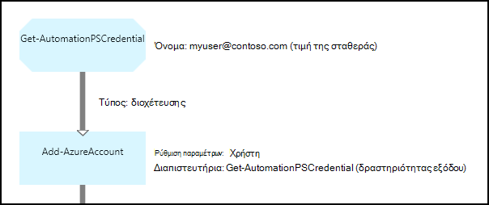

<properties 
   pageTitle="Διαπιστευτηρίων περιουσιακών στοιχείων αυτοματισμού Azure | Microsoft Azure"
   description="Διαπιστευτήρια περιουσιακών στοιχείων αυτοματισμού Azure περιέχουν διαπιστευτηρίων ασφαλείας που μπορούν να χρησιμοποιηθούν για τον έλεγχο ταυτότητας με πόρους προσβάσιμη από το runbook ή ρύθμισης παραμέτρων DSC. Σε αυτό το άρθρο περιγράφει τον τρόπο για να δημιουργήσετε στοιχεία διαπιστευτηρίων και να τις χρησιμοποιήσετε σε runbook ή ρύθμισης παραμέτρων DSC."
   services="automation"
   documentationCenter=""
   authors="mgoedtel"
   manager="jwhit"
   editor="tysonn" />
<tags 
   ms.service="automation"
   ms.devlang="na"
   ms.topic="article"
   ms.tgt_pltfrm="na"
   ms.workload="infrastructure-services"
   ms.date="06/09/2016"
   ms.author="bwren" />

# Διαπιστευτήρια περιουσιακών στοιχείων αυτοματισμού Azure

Ενός περιουσιακού στοιχείου διαπιστευτηρίων αυτοματισμού περιέχει ένα αντικείμενο [PSCredential](http://msdn.microsoft.com/library/system.management.automation.pscredential) το οποίο περιέχει διαπιστευτηρίων ασφαλείας, όπως ένα όνομα χρήστη και τον κωδικό πρόσβασης. Ρυθμίσεις παραμέτρων Runbooks και DSC μπορεί να χρησιμοποιεί cmdlet που αποδεχτείτε ένα αντικείμενο PSCredential για τον έλεγχο ταυτότητας ή τους μπορεί να εξαγάγετε το όνομα χρήστη και τον κωδικό πρόσβασης του αντικειμένου PSCredential για να παρέχουν ορισμένες εφαρμογή ή υπηρεσία που απαιτεί έλεγχο ταυτότητας. Τις ιδιότητες για μια διαπιστευτήρια που αποθηκεύονται με ασφάλεια στο αυτοματισμού Azure και είναι δυνατή η πρόσβαση στο runbook ή ρύθμισης παραμέτρων DSC με τη δραστηριότητα [Get-AutomationPSCredential](http://msdn.microsoft.com/library/system.management.automation.pscredential.aspx) .

>[AZURE.NOTE] Ασφαλής περιουσιακών στοιχείων αυτοματισμού Azure περιλαμβάνουν διαπιστευτηρίων, τα πιστοποιητικά, συνδέσεις και κρυπτογραφημένο μεταβλητές. Αυτά τα στοιχεία κρυπτογραφούνται και αποθηκεύονται στο την αυτοματοποίηση Azure χρησιμοποιώντας ένα μοναδικό κλειδί που δημιουργείται για κάθε λογαριασμό αυτοματισμού. Αυτό το κλειδί κρυπτογραφούνται από το πρωτότυπο πιστοποιητικό και αποθηκεύονται στο Azure αυτοματισμού. Πριν από την αποθήκευση ενός ασφαλούς περιουσιακού στοιχείου, το κλειδί για το λογαριασμό αυτοματισμού είναι κρυπτογραφημένα χρησιμοποιώντας το πρωτότυπο πιστοποιητικό και, στη συνέχεια, χρησιμοποιείται για την κρυπτογράφηση του περιουσιακού στοιχείου. 

## Cmdlet του Windows PowerShell

Για να δημιουργήσετε και να διαχειριστείτε πόρους διαπιστευτηρίων αυτοματισμού με το Windows PowerShell χρησιμοποιούνται τα cmdlet στον παρακάτω πίνακα.  Στείλει ως μέρος της [λειτουργικής μονάδας Azure PowerShell](../powershell-install-configure.md) , που είναι διαθέσιμη για χρήση σε runbooks αυτοματισμού και ρυθμίσεις παραμέτρων DSC.

|Cmdlet για|Περιγραφή|
|:---|:---|
|[Get-AzureAutomationCredential](http://msdn.microsoft.com/library/dn913781.aspx)|Ανακτά πληροφορίες σχετικά με ένα πάγιο διαπιστευτηρίων. Μπορείτε να ανακτήσετε μόνο τα διαπιστευτήρια ίδια από τη δραστηριότητα **Get-AutomationPSCredential** .|
|[Νέα AzureAutomationCredential](http://msdn.microsoft.com/library/azure/jj554330.aspx)|Δημιουργεί μια νέα πιστοποίηση αυτοματισμού.|
|[Κατάργηση - AzureAutomationCredential](http://msdn.microsoft.com/library/azure/jj554330.aspx)|Καταργεί μια διαπιστευτηρίων αυτοματισμού.|
|[Ορισμός - AzureAutomationCredential](http://msdn.microsoft.com/library/azure/jj554330.aspx)|Ορίζει τις ιδιότητες για μια υπάρχουσα διαπιστευτήρια αυτοματισμού.|

## Δραστηριότητες Runbook

Οι δραστηριότητες στον παρακάτω πίνακα χρησιμοποιούνται για την πρόσβαση στα διαπιστευτήρια σε μια runbook και ρυθμίσεις DSC.

|Δραστηριότητες|Περιγραφή|
|:---|:---|
|Get-AutomationPSCredential|Λαμβάνει μια πιστοποίηση για χρήση σε runbook ή ρύθμισης παραμέτρων DSC. Επιστρέφει ένα αντικείμενο [System.Management.Automation.PSCredential](http://msdn.microsoft.com/library/system.management.automation.pscredential) .|

>[AZURE.NOTE] Πρέπει να αποφύγετε τη χρήση μεταβλητών στην – όνομα παράμετρο της Get-AutomationPSCredential επειδή αυτό μπορεί να περιπλέξει ανακαλύψετε εξαρτήσεις μεταξύ runbooks ή ρυθμίσεις παραμέτρων DSC και διαπιστευτηρίων περιουσιακών στοιχείων κατά το χρόνο σχεδίασης.

## Δημιουργία ενός νέου περιουσιακών στοιχείων διαπιστευτηρίων

### Για να δημιουργήσετε ένα νέο πάγιο διαπιστευτηρίων με την πύλη κλασική του Azure

1. Από το λογαριασμό σας αυτοματισμού, κάντε κλικ στην επιλογή **στοιχεία** στο επάνω μέρος του παραθύρου.
1. Στο κάτω μέρος του παραθύρου, κάντε κλικ στην επιλογή **Προσθήκη ρύθμιση**.
1. Κάντε κλικ στην επιλογή **Προσθήκη διαπιστευτηρίων**.
2. Στην αναπτυσσόμενη λίστα **Διαπιστευτήρια τύπου** , επιλέξτε **Διαπιστευτήρια PowerShell**.
1. Ολοκλήρωση του οδηγού και κάντε κλικ στο πλαίσιο ελέγχου για να αποθηκεύσετε τη νέα πιστοποίηση.

### Για να δημιουργήσετε ένα νέο πάγιο διαπιστευτηρίων με την πύλη του Azure

1. Από το λογαριασμό σας αυτοματισμού, κάντε κλικ στο τμήμα **περιουσιακών στοιχείων** για να ανοίξετε το blade **περιουσιακών στοιχείων** .
1. Κάντε κλικ στο τμήμα **διαπιστευτήρια** για να ανοίξετε το blade **διαπιστευτήρια** .
1. Κάντε κλικ στην επιλογή **Προσθήκη μια πιστοποίηση** στο επάνω μέρος του blade.
1. Συμπληρώστε τη φόρμα και κάντε κλικ στην επιλογή **Δημιουργία** για να αποθηκεύσετε τη νέα πιστοποίηση.

### Για να δημιουργήσετε ένα νέο πάγιο διαπιστευτήρια με το Windows PowerShell

Τα ακόλουθα δείγματα εντολών δείχνουν τον τρόπο για να δημιουργήσετε μια νέα πιστοποίηση αυτοματισμού. Ένα αντικείμενο PSCredential είναι για πρώτη φορά με το όνομα και τον κωδικό πρόσβασης και, στη συνέχεια, χρησιμοποιούνται για τη δημιουργία περιουσιακού στοιχείου διαπιστευτηρίων. Εναλλακτικά, μπορείτε να χρησιμοποιήσετε το cmdlet **Get-διαπιστευτηρίων** για να σας ζητηθεί να πληκτρολογήσετε σε ένα όνομα και τον κωδικό πρόσβασης.

    $user = "MyDomain\MyUser"
    $pw = ConvertTo-SecureString "PassWord!" -AsPlainText -Force
    $cred = New-Object –TypeName System.Management.Automation.PSCredential –ArgumentList $user, $pw
    New-AzureAutomationCredential -AutomationAccountName "MyAutomationAccount" -Name "MyCredential" -Value $cred

## Χρησιμοποιώντας μια πιστοποίηση PowerShell

Μπορείτε να ανακτήσετε μια διαπιστευτηρίων περιουσιακών στοιχείων σε μια runbook ή ρύθμισης παραμέτρων DSC με τη δραστηριότητα **Get-AutomationPSCredential** . Αυτή η διαδικασία επιστρέφει ένα [αντικείμενο PSCredential](http://msdn.microsoft.com/library/system.management.automation.pscredential.aspx) που μπορείτε να χρησιμοποιήσετε με μια δραστηριότητα ή cmdlet που απαιτεί μια παράμετρο PSCredential. Μπορείτε επίσης να ανακτήσετε τις ιδιότητες του αντικειμένου διαπιστευτηρίων για να χρησιμοποιήσετε ξεχωριστά. Το αντικείμενο έχει μια ιδιότητα για το όνομα χρήστη και τον κωδικό πρόσβασης ασφαλούς ή μπορείτε να χρησιμοποιήσετε τη μέθοδο **GetNetworkCredential** για να λάβετε ένα αντικείμενο [NetworkCredential](http://msdn.microsoft.com/library/system.net.networkcredential.aspx) που θα παρέχουν μια μη ασφαλή έκδοση του κωδικού πρόσβασης.

### Δείγμα κειμένου runbook

Τα ακόλουθα δείγματα εντολών δείχνουν πώς μπορείτε να χρησιμοποιήσετε μια πιστοποίηση PowerShell σε μια runbook. Σε αυτό το παράδειγμα, γίνεται ανάκτηση των διαπιστευτηρίων και το όνομα χρήστη και τον κωδικό πρόσβασης που έχουν εκχωρηθεί σε μεταβλητές.

    $myCredential = Get-AutomationPSCredential -Name 'MyCredential'
    $userName = $myCredential.UserName
    $securePassword = $myCredential.Password
    $password = $myCredential.GetNetworkCredential().Password

### Δείγμα γραφικού runbook

Μπορείτε να προσθέσετε μια δραστηριότητα **Get-AutomationPSCredential** σε ένα γραφικό runbook κάνοντας δεξί κλικ σε τα διαπιστευτήρια στο παράθυρο "βιβλιοθήκη" του προγράμματος επεξεργασίας γραφικών και να επιλέξετε **Προσθήκη στη καμβά**.

Η παρακάτω εικόνα παρουσιάζει ένα παράδειγμα χρήσης μιας διαπιστευτηρίων σε ένα γραφικό runbook.  Σε αυτήν την περίπτωση, χρησιμοποιείται για την παροχή ελέγχου ταυτότητας για μια runbook Azure πόρους, όπως περιγράφεται στο [Runbooks τον έλεγχο ταυτότητας με λογαριασμό χρήστη Azure AD](automation-sec-configure-aduser-account.md).  Η πρώτη δραστηριότητα ανακτά τα διαπιστευτήρια που έχει πρόσβαση για τη συνδρομή Azure.  Στη συνέχεια, τη δραστηριότητα **Προσθήκη AzureAccount** χρησιμοποιεί αυτά τα διαπιστευτήρια για την παροχή ελέγχου ταυτότητας για τις δραστηριότητες που παρέχονται μετά από αυτό.  [Σύνδεση διοχέτευσης](automation-graphical-authoring-intro.md#links-and-workflow) είναι εδώ επειδή το **Get-AutomationPSCredential** αναμένει σε ένα αντικείμενο.  

## Χρήση μιας διαπιστευτηρίων PowerShell σε DSC
Ενώ ρυθμίσεις παραμέτρων DSC στο Azure αυτοματισμού να αναφέρετε διαπιστευτηρίων περιουσιακών στοιχείων με χρήση **Get-AutomationPSCredential**, παγίων διαπιστευτηρίων μπορούν επίσης να περάσουν στο μέσω παραμέτρους, εάν θέλετε. Για περισσότερες πληροφορίες, ανατρέξτε στο θέμα [ρυθμίσεις παραμέτρων Compiling στο Azure αυτοματισμού DSC](automation-dsc-compile.md#credential-assets).

## Επόμενα βήματα

- Για να μάθετε περισσότερα σχετικά με συνδέσεις σε γραφικά σύνταξη από κοινού, ανατρέξτε στο θέμα [συνδέσεις γραφικών σύνταξης](automation-graphical-authoring-intro.md#links-and-workflow)
- Για να κατανοήσετε το διαφορετικές μεθόδους ελέγχου ταυτότητας με αυτοματισμού, ανατρέξτε στην ενότητα [Ασφάλεια αυτοματισμού Azure](automation-security-overview.md)
- Για να ξεκινήσετε με runbooks γραφικών, ανατρέξτε στο θέμα [μου πρώτη runbook γραφικών](automation-first-runbook-graphical.md)
- Για να ξεκινήσετε με το PowerShell runbooks ροής εργασίας, ανατρέξτε στο θέμα [μου πρώτη runbook PowerShell ροής εργασίας](automation-first-runbook-textual.md) 

 
