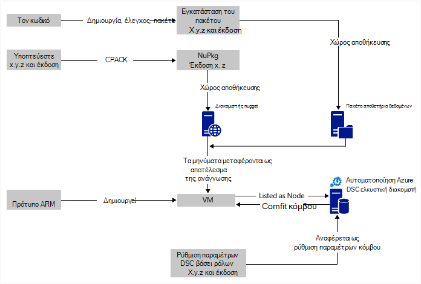
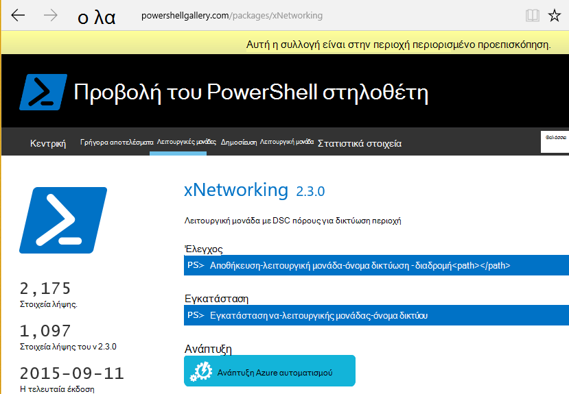

<properties
   pageTitle="Συνεχής ανάπτυξη Azure αυτοματισμού DSC με Chocolatey | Microsoft Azure"
   description="Συνεχής ανάπτυξη DevOps χρησιμοποιώντας DSC αυτοματισμού Azure και διαχείριση Chocolatey πακέτου.  Παράδειγμα με πλήρη πρότυπο JSON ARM και PowerShell προέλευσης."
   services="automation"
   documentationCenter=""
   authors="sebastus"
   manager="stevenka"
   editor=""/>

<tags
   ms.service="automation"
   ms.devlang="na"
   ms.topic="article"
   ms.tgt_pltfrm="vm-windows"
   ms.workload="na"
   ms.date="08/08/2016"
   ms.author="golive"/>

# Παράδειγμα χρήσης: Συνεχής ανάπτυξη σε εικονικές μηχανές χρησιμοποιώντας DSC αυτοματισμού και Chocolatey

Σε έναν κόσμο DevOps υπάρχουν πολλά εργαλεία για να σας βοηθήσει με διάφορα σημεία στη διοχέτευση συνεχής ενοποίησης.  Ρύθμιση παραμέτρων Azure αυτοματισμού επιθυμητή κατάσταση (DSC) είναι Καλώς ορίσατε νέα εκτός από τις επιλογές που μπορούν να χρησιμοποιούν τις ομάδες DevOps.  Σε αυτό το άρθρο παρουσιάζει τη ρύθμιση του συνεχούς ανάπτυξης (CD) για έναν υπολογιστή Windows.  Μπορείτε εύκολα να επεκτείνετε την τεχνική για να συμπεριλάβετε όσες υπολογιστές με Windows ως απαραίτητες στο ρόλο (μια τοποθεσία web, για παράδειγμα), και από εκεί, καθώς και πρόσθετες ρόλους.

## Σε υψηλό επίπεδο

Είναι απολύτως bit, μεταβαίνοντας στην εδώ, αλλά Ευτυχώς μπορεί να χωριστεί σε δύο κύριο διαδικασίες: 

  - Σύνταξη κώδικα και έλεγχος του, στη συνέχεια, τη δημιουργία και τη δημοσίευση πακέτων εγκατάστασης για τις κύριες και δευτερεύουσες εκδόσεις του συστήματος. 
  - Δημιουργία και διαχείριση ΣΠΣ που θα εγκαταστήσετε και να εκτελέσετε τον κώδικα στα πακέτα.  

Όταν και οι δύο αυτές τις διεργασίες πυρήνα είναι στη θέση, αυτό είναι ένα σύντομο βήμα για την αυτόματη ενημέρωση του πακέτου εκτελούνται σε οποιαδήποτε συγκεκριμένη Εικονική όπως νέες εκδόσεις δημιουργούνται και αναπτυχθεί.

## Επισκόπηση στοιχείων

Οι διαχειριστές πακέτου όπως [κατάλληλη λήψη](https://en.wikipedia.org/wiki/Advanced_Packaging_Tool) είναι αρκετά γνωστά στον κόσμο Linux, αλλά δεν τέτοιον στον κόσμο των Windows.  [Chocolatey](https://chocolatey.org/) είναι όπως κάποιο πράγμα και του Scott Hanselman [ιστολογίου](http://www.hanselman.com/blog/IsTheWindowsUserReadyForAptget.aspx) σχετικά με το θέμα είναι μια εξαιρετική εισαγωγή.  Με λίγα λόγια, Chocolatey σάς επιτρέπει να εγκαταστήσετε τα πακέτα από ένα κεντρικό αποθετήριο των πακέτων σε ένα σύστημα των Windows, χρησιμοποιώντας τη γραμμή εντολών.  Μπορείτε να δημιουργήσετε και να διαχειριστείτε τις δικές σας αποθετήριο και Chocolatey να εγκαταστήσετε τα πακέτα από οποιονδήποτε αριθμό αποθετήρια που θα καθορίσετε.

Επιθυμητή κατάσταση ρύθμισης παραμέτρων (DSC) ([Επισκόπηση](https://technet.microsoft.com/library/dn249912.aspx)) είναι ένα εργαλείο PowerShell που σας επιτρέπει να δηλώσετε τις ρυθμίσεις παραμέτρων που θέλετε για έναν υπολογιστή.  Για παράδειγμα, μπορείτε να πείτε, "θέλω Chocolatey εγκατασταθεί, θέλω εγκαταστήσει τις υπηρεσίες IIS, θέλω ανοίξει τη θύρα 80, θέλω 1.0.0 από την τοποθεσία Web μου εγκατεστημένη έκδοση."  Το DSC τοπική ρύθμιση παραμέτρων Manager (συνάρτηση LCM) υλοποιεί ότι η ρύθμιση παραμέτρων. Διακομιστής ελκυστική DSC περιέχει ένα αποθετήριο ρυθμίσεις παραμέτρων για υπολογιστές σας. Η συνάρτηση LCM σε κάθε υπολογιστή ελέγχει τακτά χρονικά διαστήματα για να δείτε αν της ρύθμισης παραμέτρων ταιριάζει με τις αποθηκευμένες παραμέτρους. Μπορεί να αναφορά κατάστασης ή να προσπαθήσει να επαναφέρω τον υπολογιστή στο στοίχιση με τις αποθηκευμένες παραμέτρους. Μπορείτε να επεξεργαστείτε τις αποθηκευμένες ρυθμίσεις του διακομιστή ελκυστική για να προκαλέσει έναν υπολογιστή ή ένα σύνολο μηχανές για να τεθούν σε ευθυγράμμιση με το τροποποιημένο ρύθμισης παραμέτρων.

Azure Αυτοματισμός είναι μια διαχειριζόμενη υπηρεσία στο Microsoft Azure που σας επιτρέπει να αυτοματοποιήσετε διάφορες εργασίες χρησιμοποιώντας runbooks, κόμβους, διαπιστευτήρια, τους πόρους και πόρους όπως χρονοδιαγράμματα και τις καθολικές μεταβλητές. Azure DSC αυτοματισμού επεκτείνει αυτή η δυνατότητα αυτοματισμού περιλαμβάνει εργαλεία PowerShell DSC.  Εδώ είναι μια εξαιρετική [Επισκόπηση](automation-dsc-overview.md).

Ένας πόρος DSC είναι μια λειτουργική μονάδα κώδικα που έχει συγκεκριμένες δυνατότητες, όπως διαχείριση δικτύου, υπηρεσία καταλόγου Active Directory ή SQL Server.  Ο πόρος Chocolatey DSC γνωρίζει πώς μπορείτε να αποκτήσετε πρόσβαση σε διακομιστή NuGet (μεταξύ άλλων), λήψη πακέτων, εγκατάσταση πακέτων και ούτω καθεξής.  Υπάρχουν πολλοί άλλοι πόροι DSC στη [Συλλογή PowerShell](http://www.powershellgallery.com/packages?q=dsc+resources&prerelease=&sortOrder=package-title).  Αυτές οι λειτουργικές μονάδες που έχουν εγκατασταθεί σε Azure αυτοματισμού DSC ελκυστική διακομιστή (από εσάς), ώστε να μπορούν να χρησιμοποιηθούν με τις ρυθμίσεις παραμέτρων.

Πρότυπα ARM παρέχει δηλωτικό τρόπο παράγει υποδομής σας - πράγματα όπως τα δίκτυα, δευτερεύοντα δίκτυα, ασφάλειας του δικτύου και δρομολόγηση, φόρτωση balancers, NIC, ΣΠΣ και ούτω καθεξής.  Ακολουθεί ένα [άρθρο](../resource-manager-deployment-model.md) που συγκρίνει το μοντέλο ανάπτυξης ARM (δηλωτικό) με τη Διαχείριση υπηρεσιών Azure (ASM ή κλασική) μοντέλο ανάπτυξης (επιταγή).  Και ένα άλλο [άρθρο](../virtual-machines/virtual-machines-windows-compare-deployment-models.md) σχετικά με την υπηρεσίες παροχής πόρων πυρήνα, υπολογισμού, χώρος αποθήκευσης και δικτύου.

Μία βασικών δυνατοτήτων ενός προτύπου ARM είναι η δυνατότητα για να εγκαταστήσετε μια επέκταση Εικονική σε την εικονική Μηχανή με την παροχή της υπηρεσίας.  Επέκταση Εικονική έχει συγκεκριμένες δυνατότητες όπως εκτελείται μια προσαρμοσμένη δέσμη ενεργειών, την εγκατάσταση του λογισμικού προστασίας από ιούς ή εκτελεί μια δέσμη ενεργειών ρύθμισης παραμέτρων DSC.  Υπάρχουν πολλοί άλλοι τύποι Εικονική επεκτάσεις.

## Γρήγορη ταξιδιού γύρω από το διάγραμμα

Ξεκινώντας από την αρχή, συντάσσετε σας κώδικα, δημιουργία και δοκιμή, στη συνέχεια, δημιουργία πακέτου εγκατάστασης.  Chocolatey μπορούν να χειριστούν τους διάφορους τύπους πακέτα εγκατάστασης, όπως το MSI, MSU, ZIP.  Και έχετε όλες τις δυνατότητες του PowerShell για να κάνετε την πραγματική εγκατάσταση εάν του Chocolatey εγγενής δυνατότητες δεν είναι απολύτως έως και.  Τοποθετήστε το πακέτο σε κάπου προσβάσιμος – ένα αποθετήριο πακέτο.  Αυτό το παράδειγμα χρήσης χρησιμοποιεί έναν δημόσιο φάκελο σε ένα λογαριασμό του χώρου αποθήκευσης αντικειμένων blob του Azure, αλλά μπορεί να είναι σε οποιοδήποτε σημείο.  Chocolatey εγγενώς λειτουργεί με διακομιστές NuGet και μερικά άλλα άτομα για τη διαχείριση μετα-δεδομένων πακέτου.  [Σε αυτό το άρθρο](https://github.com/chocolatey/choco/wiki/How-To-Host-Feed) περιγράφει τις επιλογές.  Σε αυτό το παράδειγμα χρήσης χρησιμοποιεί NuGet.  Ένα Nuspec είναι μετα-δεδομένα σχετικά με τα πακέτα σας.  Το Nuspec είναι "μεταγλωττιστεί" σε του NuPkg και να είναι αποθηκευμένα σε ένα διακομιστή NuGet.  Όταν ρύθμιση των παραμέτρων σας ζητά ένα πακέτο με βάση το όνομα και αναφέρεται σε ένα διακομιστή NuGet, ο πόρος Chocolatey DSC (τώρα σε η Εικονική) Αποτυπώνει το πακέτο και άλλες διαθέσιμες εγκαταστάσεις για εσάς.  Μπορείτε επίσης να ζητήσετε μια συγκεκριμένη έκδοση ενός πακέτου.

Στο κάτω αριστερό τμήμα της εικόνας, υπάρχει ένα πρότυπο διαχείρισης πόρων Azure (ARM).  Σε αυτό το παράδειγμα χρήση, την επέκταση Εικονική καταχωρεί την εικονική Μηχανή με το Azure αυτοματισμού DSC ελκυστική διακομιστή (δηλαδή, σε διακομιστή ελκυστική) ως έναν κόμβο.  Η ρύθμιση παραμέτρων είναι αποθηκευμένη στο διακομιστή ελκυστική.  Στην πραγματικότητα, αποθηκεύεται δύο φορές: μία φορά ως απλό κείμενο και αφού μεταγλωττιστεί ως αρχείο MOF (για εκείνα που γνωρίζετε σχετικά με τα πράγματα.)  Στην πύλη, το αρχείο MOF είναι μια "Ρύθμιση παραμέτρων κόμβου" (σε αντίθεση με απλώς "Ρύθμιση παραμέτρων").  Είναι το αντικείμενο που σχετίζεται με έναν κόμβο, ώστε ο κόμβος θα γνωρίζουν της ρύθμισης παραμέτρων.  Λεπτομέρειες παρακάτω δείχνουν πώς μπορείτε να αντιστοιχίσετε τη ρύθμιση παραμέτρων κόμβου στον κόμβο.

Πιθανώς ήδη κάνετε το bit στο επάνω ή το μεγαλύτερο μέρος.  Τη δημιουργία του nuspec, τη μεταγλώττιση και αποθηκεύοντάς τα σε ένα διακομιστή NuGet είναι μικρές τίποτα.  Και να διαχειρίζεστε ήδη ΣΠΣ.  Συνεχής ανάπτυξης του διαρκεί το επόμενο βήμα απαιτεί τη ρύθμιση του διακομιστή ελκυστική (μία φορά), την καταχώρηση σας κόμβους με αυτήν (μία φορά), και τη δημιουργία και την αποθήκευση στη ρύθμιση παραμέτρων εκεί (αρχικά).  Στη συνέχεια, όπως πακέτα έχουν αναβαθμιστεί και αναπτυχθεί στο αποθετήριο δεδομένων, ανανεώστε τη ρύθμιση παραμέτρων και ρύθμιση παραμέτρων κόμβου στο διακομιστή ελκυστική (επανάληψης σύμφωνα με τις ανάγκες).

Αν δεν ξεκινάτε με ένα πρότυπο ARM, που είναι επίσης OK.  Υπάρχουν cmdlet του PowerShell που έχει σχεδιαστεί για να σας βοηθήσει να καταχωρήσετε ΣΠΣ σας με το διακομιστή ελκυστική και όλα τα υπόλοιπα. Για περισσότερες λεπτομέρειες, ανατρέξτε στο άρθρο: [μηχανές προσθήκης λογαριασμών για διαχείριση με DSC αυτοματισμού Azure](automation-dsc-onboarding.md)

## Βήμα 1: Ρύθμιση του λογαριασμού διακομιστή και αυτοματοποίησης Ελκυστική

Σε έναν έλεγχο ταυτότητας γραμμή εντολών του PowerShell (Προσθήκη-AzureRmAccount): (μπορεί να χρειαστούν μερικά λεπτά ενώ έχει ρυθμιστεί στο διακομιστή ελκυστική)

    New-AzureRmResourceGroup –Name MY-AUTOMATION-RG –Location MY-RG-LOCATION-IN-QUOTES
    New-AzureRmAutomationAccount –ResourceGroupName MY-AUTOMATION-RG –Location MY-RG-LOCATION-IN-QUOTES –Name MY-AUTOMATION-ACCOUNT 

Μπορείτε να τοποθετήσετε το λογαριασμό σας αυτοματισμού σε οποιαδήποτε από τις παρακάτω περιοχές (γνωστά και ως θέση): Ανατολικής η.π.α. 2, Νότια κεντρικής ΜΑΣ, Βιρτζίνια Gov ΜΑΣ, Δυτική Ευρώπη, νοτιοανατολικής Ασίας, Ιαπωνία Ανατολή, κεντρική Ινδίας και νοτιοανατολικής Αυστραλίας.

## Βήμα 2: Εικονική επέκταση αλλαγές στο πρότυπο ARM

Λεπτομέρειες για καταχώρηση Εικονική (χρησιμοποιώντας την επέκταση Εικονική DSC PowerShell) που παρέχεται σε αυτό το [Πρότυπο γρήγορη έναρξη Azure](https://github.com/Azure/azure-quickstart-templates/tree/master/dsc-extension-azure-automation-pullserver).  Αυτό το βήμα καταχωρεί το νέο Εικονική με το διακομιστή ελκυστική στη λίστα των κόμβους DSC.  Τμήμα του αυτή η καταχώρηση είναι που καθορίζει τη ρύθμιση παραμέτρων κόμβου για να εφαρμοστεί στον κόμβο.  Αυτή η ρύθμιση παραμέτρων κόμβου δεν πρέπει να υπάρχουν ακόμη στο διακομιστή ελκυστική, ώστε να είναι OK που βήμα 4 είναι όπου αυτό γίνεται για πρώτη φορά.  Αλλά εδώ στο βήμα 2 πρέπει να έχουν αποφασίσει το όνομα του κόμβου και το όνομα της ρύθμισης παραμέτρων.  Σε αυτό το παράδειγμα χρήσης, ο κόμβος είναι 'isvbox' και η ρύθμιση είναι 'ISVBoxConfig'.  Επομένως, το όνομα της ρύθμισης παραμέτρων κόμβου (να έχει καθοριστεί σε DeploymentTemplate.json) είναι 'ISVBoxConfig.isvbox'.  

## Βήμα 3: Προσθήκη απαιτείται DSC πόρων διακομιστή Ελκυστική

Η συλλογή PowerShell διαθέτει όργανα για να εγκαταστήσετε το DSC πόρους στο λογαριασμό σας στο Azure αυτοματισμού.  Μεταβείτε στον πόρο που θέλετε και κάντε κλικ στο κουμπί "Ανάπτυξη να Azure αυτοματισμού".

Μια άλλη τεχνική που προστέθηκαν πρόσφατα στην πύλη του Azure σάς επιτρέπει να έλκει νέες λειτουργικές μονάδες ή ενημέρωση υπάρχουσας λειτουργικές μονάδες. Κάντε κλικ στις ο πόρος λογαριασμού αυτοματισμού, το πλακίδιο στοιχεία και τέλος στο πλακίδιο λειτουργικές μονάδες.  Το εικονίδιο αναζήτηση συλλογή σάς επιτρέπει να δείτε τη λίστα των ενοτήτων στη συλλογή, Διερεύνηση σε λεπτομέρειες και ο τελικός εισαγάγετε στο λογαριασμό σας αυτοματισμού. Αυτό είναι ένας εξαιρετικός τρόπος για να διατηρείτε ενημερωμένο το λειτουργικές μονάδες κατά καιρούς. Και τη δυνατότητα εισαγωγής ελέγχει εξαρτήσεις με άλλες λειτουργικές μονάδες για να βεβαιωθείτε ότι τίποτα λαμβάνει εκτός συγχρονισμού.

Εναλλακτικά, υπάρχει η μη αυτόματη προσέγγιση.  Η δομή του φακέλου της λειτουργικής μονάδας ενοποίηση του PowerShell για έναν υπολογιστή Windows είναι λίγο διαφορετική από τη δομή του φακέλου αναμένεται από την αυτοματοποίηση Azure.  Αυτό απαιτεί λίγο Προσαρμογή εκ μέρους σας.  Αλλά δεν είναι δύσκολο και γίνεται μόνο μία φορά ανά πόρο (εκτός αν θέλετε να κάνετε αναβάθμιση στο μέλλον.)  Για περισσότερες πληροφορίες σχετικά με σύνταξη από κοινού λειτουργικές μονάδες ενοποίησης του PowerShell, ανατρέξτε στο άρθρο: [Σύνταξη από κοινού λειτουργικές μονάδες ενοποίησης για την αυτοματοποίηση Azure](https://azure.microsoft.com/blog/authoring-integration-modules-for-azure-automation/)

-   Εγκαταστήστε τη λειτουργική μονάδα που είναι απαραίτητη για το σταθμούς εργασίας, ως εξής:
    -   Εγκατάσταση του [Windows Management Framework, v5](http://aka.ms/wmf5latest) (δεν χρειάζεται για Windows 10)
    -   `Install-Module –Name MODULE-NAME`< — Αποτυπώνει της λειτουργικής μονάδας από τη συλλογή του PowerShell 
-   Αντιγράψτε το φάκελο λειτουργικής μονάδας από `c:\Program Files\WindowsPowerShell\Modules\MODULE-NAME` σε ένα φάκελο temp 
-   Διαγραφή δείγματα και την τεκμηρίωση από το κύριο φάκελο 
-   Στο κύριο φάκελο, ονομασία ακριβώς το ίδιο με το φάκελο αρχείο ZIP zip 
-   Τοποθετήστε το αρχείο ZIP σε μια προσβάσιμος HTTP θέση, όπως σε ένα λογαριασμό του χώρου αποθήκευσης Azure χώρο αποθήκευσης αντικειμένων blob.
-   Εκτέλεση αυτού του PowerShell:

        New-AzureRmAutomationModule `
            -ResourceGroupName MY-AUTOMATION-RG -AutomationAccountName MY-AUTOMATION-ACCOUNT `
            -Name MODULE-NAME –ContentLink "https://STORAGE-URI/CONTAINERNAME/MODULE-NAME.zip"
        

Το παράδειγμα περιλαμβάνονται εκτελεί αυτά τα βήματα για cChoco και xNetworking. Ανατρέξτε στις [σημειώσεις](#notes) για το χειρισμό ειδικά για cChoco.

## Βήμα 4: Προσθήκη τη ρύθμιση παραμέτρων κόμβου ελκυστική διακομιστή

Δεν υπάρχει τίποτα ειδική σχετικά με την πρώτη φορά που εισάγετε ρύθμιση των παραμέτρων σας στο διακομιστή ελκυστική και μεταγλώττιση.  Όλες οι επόμενες εισαγωγής/μεταγλωττίζει τις ίδιες ρυθμίσεις παραμέτρων ακριβώς έχουν την ίδια εμφάνιση.  Κάθε φορά που ενημερώνετε το πακέτο και πρέπει να πατήσετε για να παραγωγής το κάνετε αυτό το βήμα μετά τη διασφάλιση ότι το αρχείο ρύθμισης παραμέτρων είναι σωστή-συμπεριλαμβανομένης της νέας έκδοσης του πακέτου σας.  Ακολουθεί το αρχείο ρύθμισης παραμέτρων και PowerShell:

ISVBoxConfig.ps1:

    Configuration ISVBoxConfig 
    { 
        Import-DscResource -ModuleName cChoco 
        Import-DscResource -ModuleName xNetworking
    
        Node "isvbox" {   
    
            cChocoInstaller installChoco 
            { 
                InstallDir = "C:\choco" 
            }
    
            WindowsFeature installIIS 
            { 
                Ensure="Present" 
                Name="Web-Server" 
            }
    
            xFirewall WebFirewallRule 
            { 
                Direction = "Inbound" 
                Name = "Web-Server-TCP-In" 
                DisplayName = "Web Server (TCP-In)" 
                Description = "IIS allow incoming web site traffic." 
                DisplayGroup = "IIS Incoming Traffic" 
                State = "Enabled" 
                Access = "Allow" 
                Protocol = "TCP" 
                LocalPort = "80" 
                Ensure = "Present" 
            }
    
            cChocoPackageInstaller trivialWeb 
            {            
                Name = "trivialweb" 
                Version = "1.0.0" 
                Source = “MY-NUGET-V2-SERVER-ADDRESS” 
                DependsOn = "[cChocoInstaller]installChoco", 
                "[WindowsFeature]installIIS" 
            } 
        }    
    }

Δημιουργία-ConfigurationScript.ps1:

    Import-AzureRmAutomationDscConfiguration ` 
        -ResourceGroupName MY-AUTOMATION-RG –AutomationAccountName MY-AUTOMATION-ACCOUNT ` 
        -SourcePath C:\temp\AzureAutomationDsc\ISVBoxConfig.ps1 ` 
        -Published –Force
    
    $jobData = Start-AzureRmAutomationDscCompilationJob ` 
        -ResourceGroupName MY-AUTOMATION-RG –AutomationAccountName MY-AUTOMATION-ACCOUNT ` 
        -ConfigurationName ISVBoxConfig 
    
    $compilationJobId = $jobData.Id
    
    Get-AzureRmAutomationDscCompilationJob ` 
        -ResourceGroupName MY-AUTOMATION-RG –AutomationAccountName MY-AUTOMATION-ACCOUNT ` 
        -Id $compilationJobId

Αυτά τα βήματα αποτέλεσμα σε μια νέα ρύθμιση παραμέτρων κόμβο με το όνομα "ISVBoxConfig.isvbox" που τοποθετείται στο διακομιστή ελκυστική.  Το όνομα παραμέτρων κόμβου είναι ενσωματωμένη ως "configurationName.nodeName".

## Βήμα 5: Δημιουργία και τη διατήρηση πακέτου μετα-δεδομένων

Για κάθε πακέτο που μπορείτε να τοποθετήσετε σε του αποθετηρίου πακέτου, χρειάζεστε ένα nuspec που περιγράφει αυτό.  Nuspec που πρέπει να μεταγλωττιστεί και να είναι αποθηκευμένα στο διακομιστή σας NuGet. Αυτή η διαδικασία περιγράφεται [εδώ](http://docs.nuget.org/create/creating-and-publishing-a-package).  Μπορείτε να χρησιμοποιήσετε MyGet.org ως διακομιστής NuGet.  Πώληση αυτήν την υπηρεσία, αλλά έχετε μια starter SKU που είναι δωρεάν.  Στο NuGet.org θα βρείτε οδηγίες σχετικά με την εγκατάσταση το δικό σας διακομιστή NuGet για τα πακέτα ιδιωτικό σας.

## Βήμα 6: Δεσμευμένες πωλήσεις το όλες μαζί

Κάθε φορά μια έκδοση μεταβιβάζει Ερωτήσεις και έγκριση για την ανάπτυξη, το πακέτο έχει δημιουργηθεί nuspec και nupkg ενημερωθεί και αναπτυχθεί στο διακομιστή NuGet.  Επιπλέον, η ρύθμιση παραμέτρων (παραπάνω βήμα 4) πρέπει να ενημερωθούν ώστε να συμφωνούν με τον νέο αριθμό έκδοσης.  Πρέπει να αποσταλεί στο διακομιστή ελκυστική και να μεταγλωττιστεί.  Από εκείνη τη στιγμή, είναι προς τα επάνω για να το ΣΠΣ που εξαρτώνται από ότι η ρύθμιση παραμέτρων για να αποσπάσετε την ενημέρωση και να το εγκαταστήσετε.  Κάθε μία από τις ακόλουθες ενημερώσεις είναι απλή - απλώς μια γραμμή ή δύο του PowerShell.  Στην περίπτωση υπηρεσίες ομάδας του Visual Studio, ορισμένες από αυτές περιέχονται στη Δόμηση εργασίες που μπορούν να τοποθετηθούν μαζί σε μια έκδοση.  Σε αυτό το [άρθρο](https://www.visualstudio.com/en-us/docs/alm-devops-feature-index#continuous-delivery) παρέχει περισσότερες λεπτομέρειες.  Αυτό [GitHub repo](https://github.com/Microsoft/vso-agent-tasks) λεπτομέρειες για τις διάφορες εργασίες διαθέσιμη Δόμηση.

## Σημειώσεις

Αυτό το παράδειγμα χρήσης ξεκινά με μια Εικονική από μια γενική εικόνα των Windows Server 2012 R2 από τη συλλογή Azure.  Μπορείτε να ξεκινήσετε από οποιαδήποτε αποθηκευμένη εικόνα και, στη συνέχεια, τροποποιήστε από εκεί με τη ρύθμιση παραμέτρων DSC.  Ωστόσο, η αλλαγή ρύθμισης παραμέτρων που είναι ψήνονται σε μια εικόνα είναι πολύ δυσκολότερη από δυναμική ενημέρωση των ρυθμίσεων παραμέτρων χρησιμοποιώντας DSC.

Δεν χρειάζεται να χρησιμοποιήσετε ένα πρότυπο ARM και την επέκταση Εικονική για να χρησιμοποιήσετε αυτήν την τεχνική με ΣΠΣ σας.  Και το ΣΠΣ δεν πρέπει να είναι σε Azure να είναι στην περιοχή Διαχείριση CD.  Που απαιτείται είναι ότι Chocolatey έχει εγκατασταθεί και ρυθμιστεί η συνάρτηση LCM σε η Εικονική, ώστε να μάθει πού βρίσκεται ο διακομιστής ελκυστική.  

Φυσικά, κατά την ενημέρωση ενός πακέτου σε μια Εικονική που βρίσκεται στην παραγωγής, πρέπει να λάβετε αυτό Εικονική εκτός περιστροφής κατά την εγκατάσταση της ενημέρωσης.  Πώς να κάνετε αυτό ποικίλλει.  Για παράδειγμα, με μια Εικονική πίσω από μια μονάδα εξισορρόπησης φόρτου Azure, μπορείτε να προσθέσετε μια προσαρμοσμένη Διερεύνηση.  Κατά την ενημέρωση του Εικονική, έχετε το τελικό σημείο δοκιμή του επιστροφής 400.  Το tweak είναι απαραίτητο να προκαλέσει αυτή η αλλαγή μπορεί να είναι εντός της ρύθμισης παραμέτρων του, να το tweak για να επιστρέψετε το επιστρέφει μια 200 μόλις ολοκληρωθεί η ενημέρωση.

Πλήρης προέλευσης για αυτό το παράδειγμα χρήσης βρίσκεται σε [αυτό το έργο Visual Studio](https://github.com/sebastus/ARM/tree/master/CDIaaSVM) σε GitHub.

##Σχετικά άρθρα##

- [Επισκόπηση DSC azure αυτοματισμού] (αυτοματισμού-dsc-overview.md)
- [Cmdlet του azure DSC αυτοματισμού] (https://msdn.microsoft.com/library/mt244122.aspx)
- [Μηχανές προσθήκης λογαριασμών για διαχείριση με DSC αυτοματισμού Azure] (αυτοματισμού-dsc-onboarding.md)
