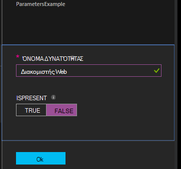

<properties 
   pageTitle="Μεταγλώττιση ρυθμίσεις παραμέτρων σε DSC αυτοματισμού Azure | Microsoft Azure" 
   description="Επισκόπηση των δύο τρόποι για να μεταγλωττίσετε ρυθμίσεις παραμέτρων ρύθμισης παραμέτρων επιθυμητοί κατάσταση (DSC): στην πύλη του Azure και με το Windows PowerShell. " 
   services="automation" 
   documentationCenter="na" 
   authors="coreyp-at-msft" 
   manager="stevenka" 
   editor="tysonn"/>

<tags
   ms.service="automation"
   ms.devlang="na"
   ms.topic="article"
   ms.tgt_pltfrm="powershell"
   ms.workload="na" 
   ms.date="01/25/2016"
   ms.author="coreyp"/>
   
#Μεταγλώττιση ρυθμίσεις παραμέτρων σε DSC αυτοματισμού Azure#

Μπορείτε να δημιουργήσετε ρυθμίσεις παραμέτρων ρύθμισης παραμέτρων επιθυμητοί κατάσταση (DSC) με δύο τρόπους με αυτοματοποίηση Azure: στην πύλη του Azure και με το Windows PowerShell. Ο παρακάτω πίνακας θα σας βοηθήσουν να καθορίσετε πότε να χρησιμοποιήσετε τη μέθοδο με βάση τα χαρακτηριστικά κάθε: 

###Πύλη Azure preview###
- Απλούστερος μέθοδο με το περιβάλλον εργασίας χρήστη αλληλεπίδρασης
- Φόρμα για την παροχή τιμές παραμέτρων απλό
- Παρακολουθείτε εύκολα την κατάσταση εργασίας
- Πρόσβαση με έλεγχο ταυτότητας με Azure σύνδεσης

###Windows PowerShell###
- Κλήση από γραμμή εντολών με το cmdlet του Windows PowerShell
- Μπορεί να συμπεριληφθεί σε αυτοματοποιημένη λύση με πολλά βήματα
- Δώστε τιμές παραμέτρων απλές και σύνθετες
- Παρακολούθηση κατάστασης εργασίας
- Πρόγραμμα-πελάτη που απαιτείται για την υποστήριξη των cmdlet του PowerShell
- Η φάση ConfigurationData
- Μεταγλώττιση ρυθμίσεις παραμέτρων που χρησιμοποιούν τα διαπιστευτήρια

Αφού έχετε αποφασίσει μέθοδο μεταγλώττισης, μπορείτε να ακολουθήσετε τις παρακάτω για να ξεκινήσετε τη μεταγλώττιση αντίστοιχα διαδικασίες.

##Μεταγλώττιση μια ρύθμιση παραμέτρων DSC με την πύλη του Azure##

1.  Από το λογαριασμό σας αυτοματισμού, κάντε κλικ στην επιλογή **ρυθμίσεις παραμέτρων**.
2.  Κάντε κλικ σε μια ρύθμιση παραμέτρων για να ανοίξετε το blade.
3.  Κάντε κλικ στην επιλογή **μεταγλώττιση**.
4.  Εάν η ρύθμιση παραμέτρων δεν έχει παραμέτρους, θα σας ζητηθεί να επιβεβαιώσετε αν θέλετε να μεταγλωττίσετε. Εάν η ρύθμιση παραμέτρων έχει παραμέτρους, θα ανοίξει το blade **Μεταγλώττιση ρύθμισης παραμέτρων** , ώστε να μπορείτε να παράσχετε τιμές παραμέτρων. Ανατρέξτε στην ενότητα <a href="#basic-parameters">**Βασικές παραμέτρους**</a> παρακάτω για περισσότερες λεπτομέρειες για τις παραμέτρους.
5.  Η **Εργασία μεταγλώττισης** blade έχει ανοίξει έτσι ώστε να μπορείτε να παρακολουθείτε την κατάσταση του έργου μεταγλώττισης και τις παραμέτρων κόμβου (έγγραφα ρύθμισης παραμέτρων MOF) Αυτό οφείλεται να τοποθετηθεί στο ελκυστική διακομιστή DSC Azure αυτοματισμού.

##Μεταγλώττιση μια ρύθμιση παραμέτρων DSC με το Windows PowerShell##

Μπορείτε να χρησιμοποιήσετε [`Start-AzureRmAutomationDscCompilationJob`](https://msdn.microsoft.com/library/mt244118.aspx) για να ξεκινήσετε τη μεταγλώττιση με το Windows PowerShell. Το παρακάτω δείγμα κώδικα ξεκινά μεταγλώττιση μιας διαμόρφωσης DSC που ονομάζεται **SampleConfig**.

    Start-AzureRmAutomationDscCompilationJob -ResourceGroupName "MyResourceGroup" -AutomationAccountName "MyAutomationAccount" -ConfigurationName "SampleConfig" 
 
`Start-AzureRmAutomationDscCompilationJob`Επιστρέφει ένα αντικείμενο εργασίας μεταγλώττισης που μπορείτε να χρησιμοποιήσετε για να παρακολουθείτε την κατάσταση. Μπορείτε να χρησιμοποιήσετε αυτό το αντικείμενο εργασία μεταγλώττισης με [`Get-AzureRmAutomationDscCompilationJob`](https://msdn.microsoft.com/library/mt244120.aspx) για να προσδιορίσετε την κατάσταση της εργασίας μεταγλώττισης, και [`Get-AzureRmAutomationDscCompilationJobOutput`](https://msdn.microsoft.com/library/mt244103.aspx) για να προβάλετε τις ροές (Έξοδος). Το παρακάτω δείγμα κώδικα ξεκινά μεταγλώττισης της ρύθμισης παραμέτρων **SampleConfig** , χρειάζεται να περιμένει μέχρι να ολοκληρωθεί, και, στη συνέχεια, εμφανίζει τις ροές.
    
    $CompilationJob = Start-AzureRmAutomationDscCompilationJob -ResourceGroupName "MyResourceGroup" -AutomationAccountName "MyAutomationAccount" -ConfigurationName "SampleConfig"
    
    while($CompilationJob.EndTime –eq $null -and $CompilationJob.Exception –eq $null)           
    {
        $CompilationJob = $CompilationJob | Get-AzureRmAutomationDscCompilationJob
        Start-Sleep -Seconds 3
    }
    
    $CompilationJob | Get-AzureRmAutomationDscCompilationJobOutput –Stream Any 

##Βασικές παραμέτρους##

Δήλωση παραμέτρων στις ρυθμίσεις παραμέτρων DSC, συμπεριλαμβανομένων των τύπων παραμέτρων και ιδιότητες, λειτουργεί με τον ίδιο τρόπο όπως runbooks Azure αυτοματισμού. Ανατρέξτε στο θέμα [ξεκινώντας μια runbook στο Azure αυτοματισμού](automation-starting-a-runbook.md) για να μάθετε περισσότερα σχετικά με τις παραμέτρους του runbook.

Το παρακάτω παράδειγμα χρησιμοποιεί δύο παραμέτρους που ονομάζεται **όνομα δυνατότητας** και **IsPresent**, για να καθορίσετε τις τιμές των ιδιοτήτων σε τη ρύθμιση παραμέτρων κόμβου **ParametersExample.sample** , που δημιουργείται κατά τη μεταγλώττιση.

    Configuration ParametersExample
    {
        param(
            [Parameter(Mandatory=$true)]
    
            [string] $FeatureName,
    
            [Parameter(Mandatory=$true)]
            [boolean] $IsPresent
        )
    
        $EnsureString = "Present"
        if($IsPresent -eq $false)
        {
            $EnsureString = "Absent"
        }
    
        Node "sample"
        {
            WindowsFeature ($FeatureName + "Feature")
            {
                Ensure = $EnsureString
                Name = $FeatureName
            }
        }
    }

Μπορείτε να δημιουργήσετε DSC ρυθμίσεις παραμέτρων που χρησιμοποιούν βασικές παραμέτρους στην πύλη του Azure αυτοματισμού DSC ή με το Azure PowerShell:

###Πύλη###

Στην πύλη, μπορείτε να εισαγάγετε τιμές παραμέτρων αφού κάνετε κλικ σε **μεταγλώττιση**.

###PowerShell###

PowerShell απαιτεί παραμέτρους σε ένα [hashtable](http://technet.microsoft.com/library/hh847780.aspx) όπου το πλήκτρο συμφωνεί με το όνομα της παραμέτρου και την τιμή ισούται με την τιμή της παραμέτρου.

    $Parameters = @{
            "FeatureName" = "Web-Server"
            "IsPresent" = $False
    }
    
    
    Start-AzureRmAutomationDscCompilationJob -ResourceGroupName "MyResourceGroup" -AutomationAccountName "MyAutomationAccount" -ConfigurationName "ParametersExample" -Parameters $Parameters 
    

Για πληροφορίες σχετικά με τη μεταβίβαση PSCredentials ως παραμέτρους, ανατρέξτε στο θέμα <a href="#credential-assets">**Στοιχεία διαπιστευτηρίων**</a> παρακάτω.

##ConfigurationData##

**ConfigurationData** σάς επιτρέπει να διαχωρίσετε δομικά ρύθμισης παραμέτρων από οποιαδήποτε συγκεκριμένη ρύθμιση παραμέτρων περιβάλλον κατά τη χρήση του PowerShell DSC. Ανατρέξτε στην ενότητα ["Τι" διαχωρισμό από "Όπου" στο PowerShell DSC](http://blogs.msdn.com/b/powershell/archive/2014/01/09/continuous-deployment-using-dsc-with-minimal-change.aspx) για να μάθετε περισσότερα σχετικά με το **ConfigurationData**.

>[AZURE.NOTE] Μπορείτε να χρησιμοποιήσετε **ConfigurationData** κατά τη μεταγλώττιση στο DSC αυτοματισμού Azure χρησιμοποιώντας το Azure PowerShell, αλλά όχι στην πύλη του Azure.

Το παρακάτω παράδειγμα ρύθμισης παραμέτρων DSC χρησιμοποιεί **ConfigurationData** μέσω τις λέξεις-κλειδιά **$ConfigurationData** και **$AllNodes** . Θα χρειαστεί επίσης τη [λειτουργική μονάδα **xWebAdministration** ](https://www.powershellgallery.com/packages/xWebAdministration/) για αυτό το παράδειγμα:

     Configuration ConfigurationDataSample
     {
        Import-DscResource -ModuleName xWebAdministration -Name MSFT_xWebsite
    
        Write-Verbose $ConfigurationData.NonNodeData.SomeMessage 
    
        Node $AllNodes.Where{$_.Role -eq "WebServer"}.NodeName
        {
            xWebsite Site
            {
                Name = $Node.SiteName
                PhysicalPath = $Node.SiteContents
                Ensure   = "Present"
            }
        }
    }

Μπορείτε να δημιουργήσετε τη ρύθμιση παραμέτρων DSC παραπάνω με το PowerShell. Το παρακάτω PowerShell προσθέτει δύο ρυθμίσεις παραμέτρων κόμβου ελκυστική διακομιστή DSC Azure αυτοματοποίησης: **ConfigurationDataSample.MyVM1** και **ConfigurationDataSample.MyVM3**:

    $ConfigData = @{
        AllNodes = @(
            @{
                NodeName = "MyVM1"
                Role = "WebServer"
            },
            @{
                NodeName = "MyVM2"
                Role = "SQLServer"
            },
            @{
                NodeName = "MyVM3"
                Role = "WebServer"
    
            }
    
        )
    
        NonNodeData = @{
            SomeMessage = "I love Azure Automation DSC!"
    
        }
    
    } 
    
    Start-AzureRmAutomationDscCompilationJob -ResourceGroupName "MyResourceGroup" -AutomationAccountName "MyAutomationAccount" -ConfigurationName "ConfigurationDataSample" -ConfigurationData $ConfigData

##Περιουσιακών στοιχείων##

Αναφορές περιουσιακού στοιχείου είναι ίδιες ρυθμίσεις παραμέτρων DSC αυτοματισμού Azure και runbooks. Δείτε την παρακάτω για περισσότερες πληροφορίες:

- [Πιστοποιητικά](automation-certificates.md)
- [Συνδέσεις](automation-connections.md)
- [Τα διαπιστευτήρια](automation-credentials.md)
- [Μεταβλητές](automation-variables.md)

###Διαπιστευτήρια περιουσιακών στοιχείων###
Ενώ ρυθμίσεις παραμέτρων DSC στο Azure αυτοματισμού να αναφέρετε διαπιστευτηρίων περιουσιακών στοιχείων με χρήση **Get-AzureRmAutomationCredential**, παγίων διαπιστευτηρίων μπορούν επίσης να περάσουν στο μέσω παραμέτρους, εάν θέλετε. Εάν μια ρύθμιση παραμέτρων λάβει μια παράμετρο του τύπου **PSCredential** , στη συνέχεια, πρέπει να περάσει το όνομα συμβολοσειράς ενός περιουσιακού στοιχείου διαπιστευτηρίων αυτοματισμού Azure ως η τιμή της παραμέτρου, αντί για ένα αντικείμενο PSCredential. Τι συμβαίνει στο παρασκήνιο, παγίου διαπιστευτηρίων Azure αυτοματισμού με αυτό το όνομα θα ανακτηθούν και διαβιβάζεται στη ρύθμιση παραμέτρων.

Διατήρηση διαπιστευτήρια ασφαλούς στις ρυθμίσεις παραμέτρων κόμβου (έγγραφα ρύθμισης παραμέτρων MOF) απαιτεί την κρυπτογράφηση τα διαπιστευτήρια στο αρχείο παραμέτρων MOF κόμβο. Azure αυτοματισμού λαμβάνει αυτό το βήμα μία περαιτέρω και κρυπτογραφεί ολόκληρο το αρχείο MOF. Ωστόσο, αυτήν τη στιγμή που πρέπει να ενημερώσετε PowerShell DSC δεν πειράζει για τα διαπιστευτήρια που πρέπει να παραχθεί σε μορφή απλού κειμένου κατά τη διάρκεια δημιουργίας MOF ρύθμισης παραμέτρων κόμβου, επειδή PowerShell DSC δεν γνωρίζει ότι Azure αυτοματισμού θα η κρυπτογράφηση ολόκληρο το αρχείο MOF μετά τη δημιουργία μέσω μιας εργασίας μεταγλώττισης.

Μπορείτε να καταλάβετε PowerShell DSC ότι δεν πειράζει για τα διαπιστευτήρια που πρέπει να παραχθεί σε απλό κείμενο στη ρύθμιση παραμέτρων που δημιουργήθηκε κόμβο MOF χρησιμοποιώντας <a href="#configurationdata">**ConfigurationData**</a>. Θα πρέπει να περάσετε `PSDscAllowPlainTextPassword = $true` μέσω **ConfigurationData** για το όνομα του μπλοκ κάθε κόμβου που εμφανίζεται στη ρύθμιση παραμέτρων DSC και χρησιμοποιεί τα διαπιστευτήρια.

Το παρακάτω παράδειγμα εμφανίζει μια ρύθμιση παραμέτρων DSC που χρησιμοποιεί ενός περιουσιακού στοιχείου διαπιστευτηρίων αυτοματισμού.

    Configuration CredentialSample
    {
       $Cred = Get-AzureRmAutomationCredential -Name "SomeCredentialAsset"
    
        Node $AllNodes.NodeName
        { 
            File ExampleFile
            { 
                SourcePath = "\\Server\share\path\file.ext" 
                DestinationPath = "C:\destinationPath" 
                Credential = $Cred 
            }
        }
    }

Μπορείτε να δημιουργήσετε τη ρύθμιση παραμέτρων DSC παραπάνω με το PowerShell. Το παρακάτω PowerShell προσθέτει δύο ρυθμίσεις παραμέτρων κόμβου ελκυστική διακομιστή DSC Azure αυτοματοποίησης: **CredentialSample.MyVM1** και **CredentialSample.MyVM2**.

    $ConfigData = @{
        AllNodes = @(
            @{
                NodeName = "*"
                PSDscAllowPlainTextPassword = $True
            },
            @{
                NodeName = "MyVM1"
            },
            @{
                NodeName = "MyVM2"
            }
        )
    }
    
    Start-AzureRmAutomationDscCompilationJob -ResourceGroupName "MyResourceGroup" -AutomationAccountName "MyAutomationAccount" -ConfigurationName "CredentialSample" -ConfigurationData $ConfigData
