<properties
   pageTitle="Γρήγορα αποτελέσματα με το Azure αυτοματισμού DSC"
   description="Επεξήγηση και παραδείγματα για τις πιο συνηθισμένες εργασίες στο Azure αυτοματισμού επιθυμητοί κατάσταση ρύθμισης παραμέτρων (DSC)"
   services="automation" 
   documentationCenter="na" 
   authors="eslesar" 
   manager="dongill" 
   editor="tysonn"/>

<tags
   ms.service="automation"
   ms.devlang="na"
   ms.topic="article"
   ms.tgt_pltfrm="powershell"
   ms.workload="na" 
   ms.date="06/06/2016"
   ms.author="magoedte;eslesar"/>
   

# <a name="getting-started-with-azure-automation-dsc"></a>Γρήγορα αποτελέσματα με το Azure αυτοματισμού DSC

Αυτό το θέμα εξηγεί πώς μπορείτε να κάνετε τις πιο συνηθισμένες εργασίες με Azure αυτοματισμού επιθυμητοί κατάσταση ρύθμισης παραμέτρων (DSC), όπως τη δημιουργία, εισαγωγή, και μεταγλώττιση διαμορφώσεις, μηχανές προσθήκης λογαριασμών για να διαχειριστείτε, και προβολή αναφορών. Για μια επισκόπηση των στοιχείων που υπάρχουν Azure DSC αυτοματισμού, ανατρέξτε στο θέμα [Επισκόπηση DSC αυτοματισμού Azure](automation-dsc-overview.md). Για την τεκμηρίωση DSC, ανατρέξτε στο θέμα [Windows PowerShell επιθυμητοί κατάσταση Επισκόπηση της ρύθμισης παραμέτρων](https://msdn.microsoft.com/PowerShell/dsc/overview).

Αυτό το θέμα παρέχει αναλυτικές οδηγίες με τη χρήση του Azure αυτοματισμού DSC. Εάν θέλετε ένα περιβάλλον δείγμα που έχει ήδη ρυθμιστεί χωρίς να ακολουθήσετε τα βήματα που περιγράφονται σε αυτό το θέμα, μπορείτε να χρησιμοποιήσετε [το ακόλουθο πρότυπο ARM](https://github.com/azureautomation/automation-packs/tree/master/102-sample-automation-setup). Αυτό το πρότυπο ρυθμίζει ολοκληρωμένη DSC αυτοματισμού Azure περιβάλλον, όπως μια Εικονική Azure που είναι διαχειριζόμενο από το Azure αυτοματισμού DSC.
 
## <a name="prerequisites"></a>Προαπαιτούμενα στοιχεία

Για να ολοκληρώσετε τα παραδείγματα σε αυτό το θέμα, απαιτούνται τα εξής:

- Ένας λογαριασμός Azure αυτοματισμού. Για οδηγίες σχετικά με τη δημιουργία λογαριασμού Azure αυτοματισμού εκτέλεση ως, ανατρέξτε στο θέμα [Εκτέλεση Azure ως το λογαριασμό](automation-sec-configure-azure-runas-account.md).
- Εικονική μηχανή Azure διαχείριση πόρων (όχι κλασική) με Windows Server 2008 R2 ή νεότερη έκδοση. Για οδηγίες σχετικά με τη δημιουργία μια Εικονική, ανατρέξτε στο θέμα [Δημιουργία του πρώτου Windows εικονική μηχανή στην πύλη του Azure](../virtual-machines/virtual-machines-windows-hero-tutorial.md)

## <a name="creating-a-dsc-configuration"></a>Δημιουργία DSC ρύθμισης παραμέτρων

Θα δημιουργήσουμε μια απλή [DSC ρύθμισης παραμέτρων](https://msdn.microsoft.com/powershell/dsc/configurations) που εξασφαλίζει ότι είτε την παρουσία ή την απουσία από το **Διακομιστή Web** Windows δυνατότητα (IIS), ανάλογα με το πώς μπορείτε να αντιστοιχίσετε κόμβους.

1. Ξεκινήστε το Windows PowerShell ISE (ή οποιοδήποτε πρόγραμμα επεξεργασίας κειμένου).

2. Πληκτρολογήστε το ακόλουθο κείμενο:

    ```powershell
    configuration TestConfig
    {
        Node WebServer
        {
            WindowsFeature IIS
            {
                Ensure               = 'Present'
                Name                 = 'Web-Server'
                IncludeAllSubFeature = $true

            }
        }

        Node NotWebServer
        {
            WindowsFeature IIS
            {
                Ensure               = 'Absent'
                Name                 = 'Web-Server'

            }
        }
        }
    ```
3. Αποθηκεύστε το αρχείο ως `TestConfig.ps1`.

Αυτή η ρύθμιση παραμέτρων κλήσεων έναν πόρο σε κάθε μπλοκ κόμβο, τον [πόρο WindowsFeature](https://msdn.microsoft.com/powershell/dsc/windowsfeatureresource), που εξασφαλίζει ότι είτε την παρουσία ή την απουσία της δυνατότητας **Διακομιστή Web** .

## <a name="importing-a-configuration-into-azure-automation"></a>Εισαγωγή μιας ρύθμισης παραμέτρων σε αυτοματισμού Azure

Στη συνέχεια, θα σας θα εισαγάγετε τη ρύθμιση παραμέτρων στο λογαριασμό αυτοματισμού.

1. Είσοδος στην [πύλη του Azure](https://portal.azure.com).

2. Στο μενού διανομέας, κάντε κλικ στην επιλογή **όλους τους πόρους** και, στη συνέχεια, το όνομα του λογαριασμού σας αυτοματισμού.

3. Στην το blade **αυτοματισμού λογαριασμού** , επιλέξτε **Ρυθμίσεις παραμέτρων DSC**.

4. Στην το blade **DSC ρυθμίσεις παραμέτρων** , κάντε κλικ στην επιλογή **Προσθήκη μια ρύθμιση παραμέτρων**.

5. Στη blade τη **Ρύθμιση παραμέτρων εισαγωγής** , μεταβείτε το `TestConfig.ps1` αρχείο στον υπολογιστή σας.
    
    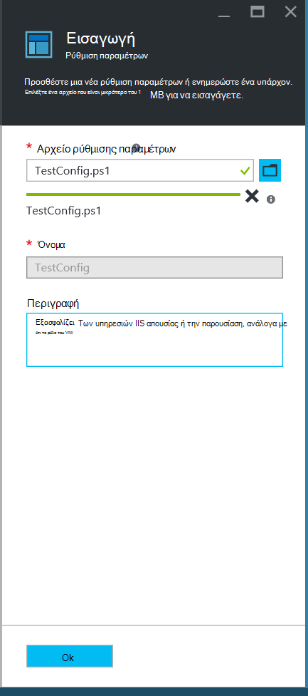
    

6. Κάντε κλικ στο **κουμπί OK**.

## <a name="viewing-a-configuration-in-azure-automation"></a>Προβολή μιας ρύθμισης παραμέτρων σε αυτοματισμού Azure

Αφού έχετε εισαγάγει μια ρύθμιση παραμέτρων, μπορείτε να την προβάλετε στην πύλη του Azure.

1. Είσοδος στην [πύλη του Azure](https://portal.azure.com).

2. Στο μενού διανομέα, κάντε κλικ στην επιλογή **όλους τους πόρους** και, στη συνέχεια, το όνομα του λογαριασμού σας αυτοματισμού.

3. Στην blade το **λογαριασμό αυτοματισμού** , κάντε κλικ στην επιλογή **Ρυθμίσεις παραμέτρων DSC**

4. Στην το blade **DSC ρυθμίσεις παραμέτρων** , κάντε κλικ στην επιλογή **TestConfig** (αυτό είναι το όνομα της ρύθμισης παραμέτρων έχετε εισαγάγει στην προηγούμενη διαδικασία).

5. Στην το blade **Ρύθμισης παραμέτρων TestConfig** , επιλέξτε **Προβολή ρύθμισης παραμέτρων προέλευσης**.

    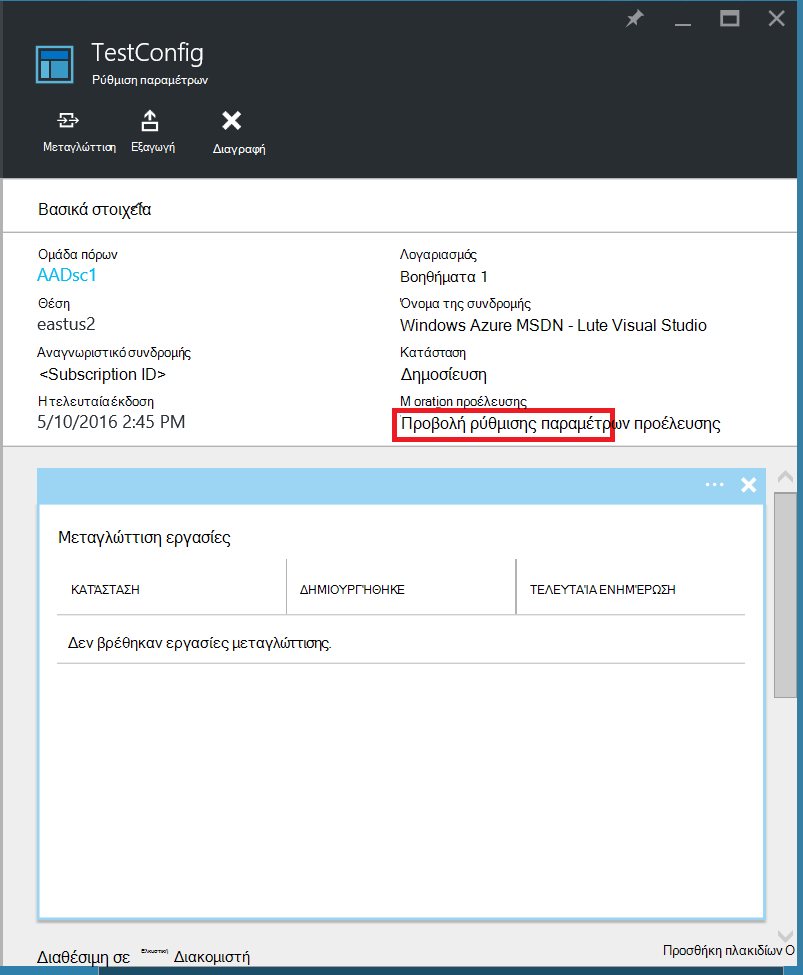
    
    Ανοίγει μια **Προέλευση παραμέτρων TestConfig** blade, εμφανίζοντας τον κώδικα του PowerShell για τη ρύθμιση παραμέτρων.
    
## <a name="compiling-a-configuration-in-azure-automation"></a>Μεταγλώττιση μιας ρύθμισης παραμέτρων σε αυτοματισμού Azure

Πριν από την μπορείτε να εφαρμόσετε μια επιθυμητή κατάσταση σε έναν κόμβο, μια ρύθμιση παραμέτρων DSC τον ορισμό αυτό το μέλος πρέπει να μεταγλωττιστεί σε μία ή περισσότερες ρυθμίσεις παραμέτρων κόμβου (MOF έγγραφο), και τοποθετείται στο διακομιστή ελκυστική αυτοματισμού DSC. Για μια πιο λεπτομερή περιγραφή των μεταγλώττιση ρυθμίσεις παραμέτρων σε DSC αυτοματισμού Azure, ανατρέξτε στο θέμα [μεταγλώττιση ρυθμίσεις παραμέτρων σε DSC αυτοματισμού Azure](automation-dsc-compile.md). Για περισσότερες πληροφορίες σχετικά με τη μεταγλώττιση ρυθμίσεις παραμέτρων, ανατρέξτε στο θέμα [Ρυθμίσεις παραμέτρων DSC](https://msdn.microsoft.com/PowerShell/DSC/configurations).

1. Είσοδος στην [πύλη του Azure](https://portal.azure.com).

2. Στο μενού διανομέα, κάντε κλικ στην επιλογή **όλους τους πόρους** και, στη συνέχεια, το όνομα του λογαριασμού σας αυτοματισμού.

3. Στην blade το **λογαριασμό αυτοματισμού** , κάντε κλικ στην επιλογή **Ρυθμίσεις παραμέτρων DSC**

4. Στην το blade **DSC ρυθμίσεις παραμέτρων** , κάντε κλικ στην επιλογή **TestConfig** (το όνομα της ρύθμισης παραμέτρων που έχουν εισαχθεί προηγουμένως).

5. Στην το blade **TestConfig ρύθμισης παραμέτρων** , κάντε κλικ στην επιλογή **μεταγλώττιση**και, στη συνέχεια, κάντε κλικ στο κουμπί **Ναι**. Ξεκινά μια εργασία μεταγλώττισης.
    
    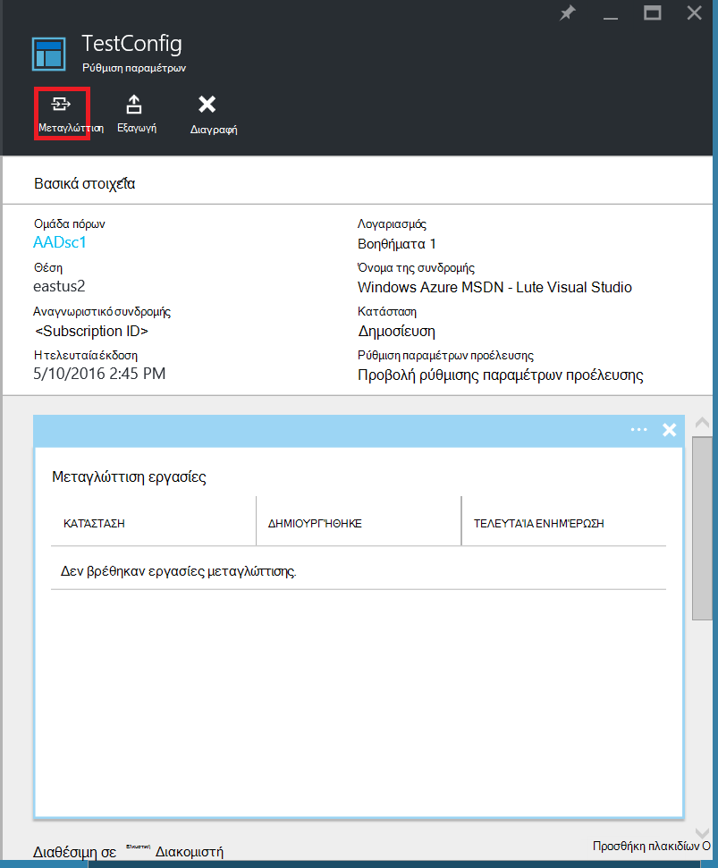
    
> [AZURE.NOTE] Όταν μεταγλώττιση μια ρύθμιση παραμέτρων στο Azure αυτοματισμού, αναπτύσσει αυτόματα οποιαδήποτε ρύθμιση παραμέτρων που έχουν δημιουργηθεί κόμβου MOF στο διακομιστή ελκυστική.

## <a name="viewing-a-compilation-job"></a>Προβολή ενός έργου μεταγλώττισης

Αφού ξεκινήσετε μια συλλογή, μπορείτε να την προβάλετε στο πλακίδιο **μεταγλώττισης εργασίες** σε το blade **ρύθμισης παραμέτρων** . Το πλακίδιο **εργασίες μεταγλώττισης** εμφανίζει εκτελούνται τη συγκεκριμένη στιγμή, ολοκληρωθεί και απέτυχε εργασίες. Όταν ανοίγετε ένα blade εργασία μεταγλώττισης, που εμφανίζει πληροφορίες σχετικά με την εργασία, συμπεριλαμβανομένων τυχόν σφάλματα ή προειδοποιήσεις συναντήσατε, παραμέτρους εισόδου που χρησιμοποιούνται στη ρύθμιση των παραμέτρων και μεταγλώττιση αρχείων καταγραφής.

1. Είσοδος στην [πύλη του Azure](https://portal.azure.com).

2. Στο μενού διανομέα, κάντε κλικ στην επιλογή **όλους τους πόρους** και, στη συνέχεια, το όνομα του λογαριασμού σας αυτοματισμού.

3. Στην το blade **αυτοματισμού λογαριασμού** , επιλέξτε **Ρυθμίσεις παραμέτρων DSC**.

4. Στην το blade **DSC ρυθμίσεις παραμέτρων** , κάντε κλικ στην επιλογή **TestConfig** (το όνομα της ρύθμισης παραμέτρων που έχουν εισαχθεί προηγουμένως).

5. Στο πλακίδιο **μεταγλώττισης εργασίες** από τη **Ρύθμιση παραμέτρων TestConfig** blade, κάντε κλικ σε οποιαδήποτε από τις εργασίες που παρατίθενται. Ανοίγει μια **Εργασία μεταγλώττισης** blade, με την ετικέτα με την ημερομηνία που ξεκίνησε τη μεταγλώττιση εργασία.

    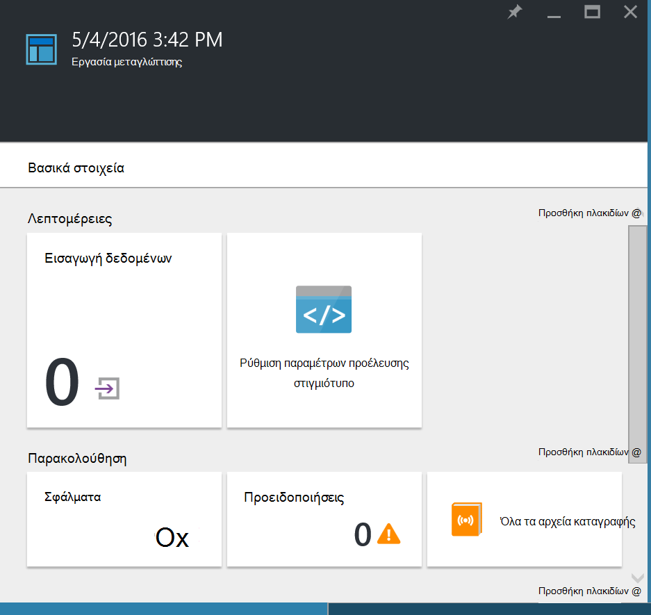
  
6. Κάντε κλικ σε οποιοδήποτε πλακίδιο στο η **Εργασία μεταγλώττισης** blade για να εμφανίσετε περισσότερες λεπτομέρειες σχετικά με την εργασία.

## <a name="viewing-node-configurations"></a>Προβολή ρυθμίσεις παραμέτρων κόμβου

Επιτυχή ολοκλήρωση μιας εργασίας μεταγλώττισης δημιουργεί μία ή περισσότερες νέες διαμορφώσεις κόμβο. Ρύθμιση παραμέτρων ενός κόμβου είναι ένα έγγραφο MOF που έχει αναπτυχθεί στο διακομιστή ελκυστική και είστε έτοιμοι να τα μηνύματα μεταφέρονται και να εφαρμοστούν με έναν ή περισσότερους κόμβους. Μπορείτε να προβάλετε τις ρυθμίσεις παραμέτρων κόμβου στο λογαριασμό σας αυτοματισμού στο το blade **Ρυθμίσεις παραμέτρων κόμβου DSC** . Ρύθμιση παραμέτρων ενός κόμβου έχει ένα όνομα με τη φόρμα *ConfigurationName*. *NodeName*.

1. Είσοδος στην [πύλη του Azure](https://portal.azure.com).

2. Στο μενού διανομέα, κάντε κλικ στην επιλογή **όλους τους πόρους** και, στη συνέχεια, το όνομα του λογαριασμού σας αυτοματισμού.

3. Στην το blade **αυτοματισμού λογαριασμού** , επιλέξτε **Ρυθμίσεις παραμέτρων κόμβου DSC**.

    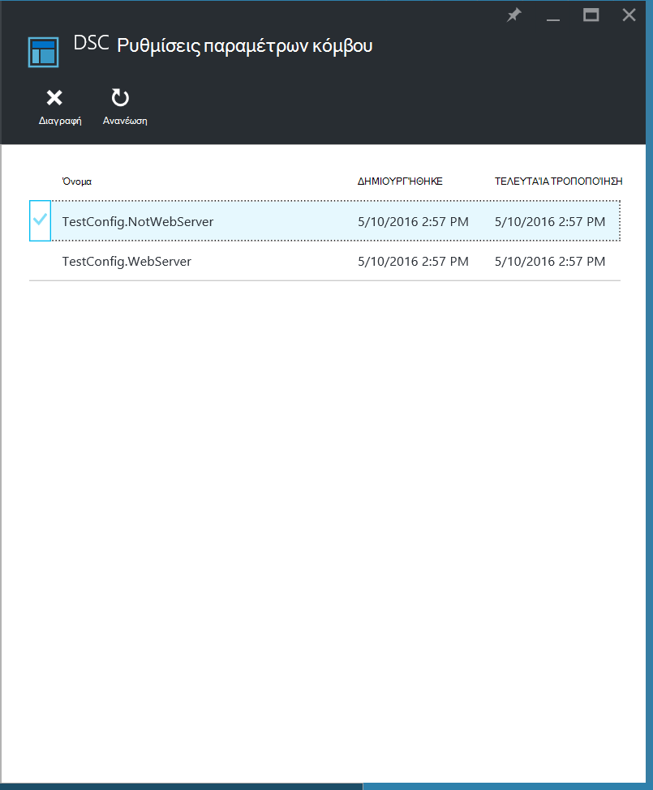
    
## <a name="onboarding-an-azure-vm-for-management-with-azure-automation-dsc"></a>Προσθήκης λογαριασμών Εικονική μηχανή Azure για διαχείριση με DSC αυτοματισμού Azure

Μπορείτε να χρησιμοποιήσετε DSC αυτοματισμού Azure για διαχείριση ΣΠΣ Azure (κλασική και διαχείριση πόρων), ΣΠΣ εσωτερικής εγκατάστασης, μηχανές Linux, AWS ΣΠΣ και φυσική μηχανές εσωτερικής εγκατάστασης. Σε αυτό το θέμα, ασχοληθούμε με τον τρόπο ενσωματωμένη ΣΠΣ μόνο από διαχειριστή πόρων Azure. Για πληροφορίες σχετικά με την προσθήκης λογαριασμών άλλους τύπους μηχανές, ανατρέξτε στο θέμα [μηχανές προσθήκης λογαριασμών για διαχείριση με DSC αυτοματισμού Azure](automation-dsc-onboarding.md).

### <a name="to-onboard-an-azure-resource-manager-vm-for-management-by-azure-automation-dsc"></a>Ενσωματωμένη σε μια Εικονική διαχείριση πόρων Azure για διαχείριση με DSC αυτοματισμού Azure

1. Είσοδος στην [πύλη του Azure](https://portal.azure.com).

2. Στο μενού διανομέα, κάντε κλικ στην επιλογή **όλους τους πόρους** και, στη συνέχεια, το όνομα του λογαριασμού σας αυτοματισμού.

3. Στην blade το **λογαριασμό αυτοματισμού** , επιλέξτε **Κόμβους DSC**.

4. Στο το blade **Κόμβους DSC** , κάντε κλικ στην επιλογή **Προσθήκη Εικονική Azure**.

    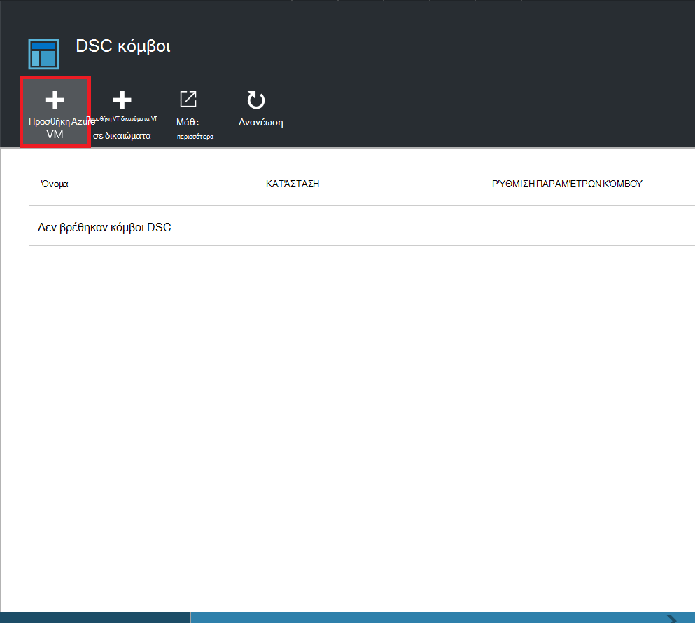

5. Στο το blade **Προσθήκη ΣΠΣ Azure** , κάντε κλικ στην **επιλογή εικονικές μηχανές σε ενσωματωμένη**.

6. Στο το blade **Επιλέξτε ΣΠΣ** , επιλέξτε την εικονική Μηχανή που θέλετε να ενσωματωμένη και κάντε κλικ στο κουμπί **OK**.

    >[AZURE.IMPORTANT] Πρέπει να είναι μια Εικονική διαχείριση πόρων Azure που εκτελεί Windows Server 2008 R2 ή νεότερη έκδοση.
    
7. Στο το blade **Προσθήκη ΣΠΣ Azure** , κάντε κλικ **Ρύθμιση παραμέτρων καταχώρηση δεδομένων**.

8. Στο blade την **καταχώρηση** , πληκτρολογήστε το όνομα της ρύθμισης παραμέτρων του κόμβου που θέλετε να εφαρμόσετε την εικονική Μηχανή στο πλαίσιο **Όνομα ρύθμισης παραμέτρων κόμβο** . Αυτό πρέπει να αντιστοιχεί ακριβώς στο όνομα της μια ρύθμιση παραμέτρων κόμβου στο λογαριασμό αυτοματισμού. Παροχή ονόματος στο σημείο αυτό είναι προαιρετικό. Μπορείτε να αλλάξετε τη ρύθμιση παραμέτρων που του έχουν ανατεθεί κόμβου μετά προσθήκης λογαριασμών στον κόμβο.
Επιλέξτε **Κόμβο επανεκκίνηση, εάν είναι απαραίτητο**και, στη συνέχεια, κάντε κλικ στο κουμπί **OK**.
    
    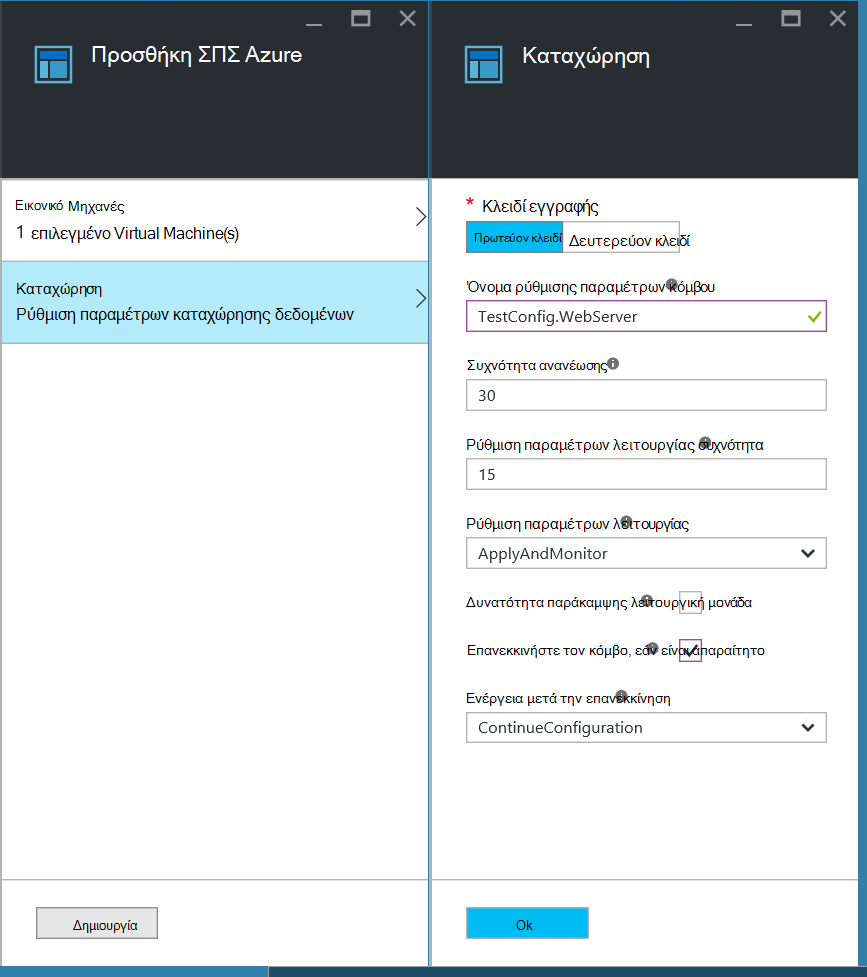
    
    Η ρύθμιση παραμέτρων κόμβου που καθορίσατε θα εφαρμοστεί η Εικονική σε χρονικά διαστήματα που καθορίζονται από τη **Συχνότητα λειτουργίας ρύθμισης παραμέτρων**και την εικονική Μηχανή θα έλεγχος για ενημερωμένες εκδόσεις στη ρύθμιση παραμέτρων κόμβου σε χρονικά διαστήματα που καθορίζονται από τη **Συχνότητα ανανέωσης**. Για περισσότερες πληροφορίες σχετικά με τον τρόπο χρήσης αυτών των τιμών, ανατρέξτε στο θέμα [ρύθμιση των παραμέτρων της διαχείρισης παραμέτρων τοπικών](https://msdn.microsoft.com/PowerShell/DSC/metaConfig).
    
9. Στο το blade **Προσθήκη ΣΠΣ Azure** , κάντε κλικ στην επιλογή **Δημιουργία**.

Azure θα ξεκινήσει η διαδικασία προσθήκης λογαριασμών η Εικονική. Όταν ολοκληρωθεί, την εικονική Μηχανή θα εμφανίζονται στην το blade **DSC κόμβους** στο λογαριασμό αυτοματισμού.

## <a name="viewing-the-list-of-dsc-nodes"></a>Προβολή της λίστας κόμβους DSC

Μπορείτε να προβάλετε τη λίστα των όλους τους υπολογιστές που έχουν onboarded για διαχείριση στο λογαριασμό σας αυτοματισμού με το blade **Κόμβους DSC** .

1. Είσοδος στην [πύλη του Azure](https://portal.azure.com).

2. Στο μενού διανομέας, κάντε κλικ στην επιλογή **όλους τους πόρους** και, στη συνέχεια, το όνομα του λογαριασμού σας αυτοματισμού.

3. Στην blade το **λογαριασμό αυτοματισμού** , επιλέξτε **Κόμβους DSC**.

## <a name="viewing-reports-for-dsc-nodes"></a>Προβολή αναφορών για τους κόμβους DSC

Κάθε φορά DSC αυτοματισμού Azure εκτελεί έλεγχος συνέπειας σε έναν διαχειριζόμενο κόμβο, ο κόμβος στέλνει μια έκθεση προόδου στο διακομιστή ελκυστική. Μπορείτε να προβάλετε αυτές τις αναφορές στη το blade για αυτόν τον κόμβο.

1. Είσοδος στην [πύλη του Azure](https://portal.azure.com).

2. Στο μενού διανομέας, κάντε κλικ στην επιλογή **όλους τους πόρους** και, στη συνέχεια, το όνομα του λογαριασμού σας αυτοματισμού.

3. Στην blade το **λογαριασμό αυτοματισμού** , επιλέξτε **Κόμβους DSC**.

4. Στο πλακίδιο **αναφορές** , κάντε κλικ σε οποιαδήποτε από τις αναφορές στη λίστα.

    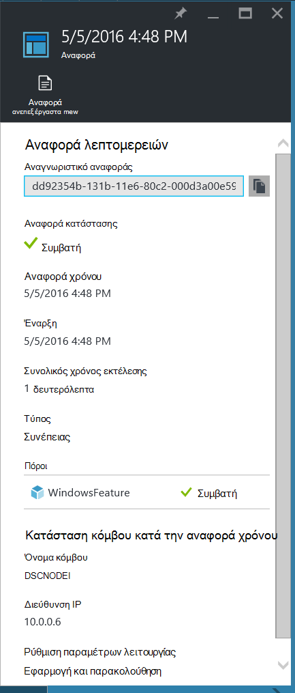

Στη το blade για μια αναφορά μεμονωμένα, μπορείτε να δείτε τις ακόλουθες πληροφορίες κατάστασης για την αντίστοιχη έλεγχος συνέπειας:

- Η αναφορά κατάστασης — αν ο κόμβος είναι "Compliant", "Απέτυχε", η ρύθμιση των παραμέτρων ή ο κόμβος είναι "Μη συμβατές" (όταν ο κόμβος είναι σε λειτουργία **applyandmonitor** και υπολογιστή δεν είναι στην επιθυμητή κατάσταση).
- Την ώρα έναρξης για τον έλεγχο συνέπειας.
- Το συνολικό χρόνο εκτέλεσης για ο έλεγχος συνέπειας.
- Ο τύπος του έλεγχος συνέπειας.
- Τυχόν σφάλματα, όπως τον κωδικό σφάλματος και το μήνυμα σφάλματος. 
- DSC πόροι χρησιμοποιούνται στο τη ρύθμιση παραμέτρων και την κατάσταση του κάθε πόρο (Εάν ο κόμβος είναι στην επιθυμητή κατάσταση για το συγκεκριμένο πόρο) — μπορείτε να κάνετε κλικ σε κάθε πόρο για πιο λεπτομερείς πληροφορίες για το συγκεκριμένο πόρο.
- Το όνομα, τη διεύθυνση IP και ρύθμιση παραμέτρων λειτουργίας του κόμβου.

Μπορείτε επίσης να επιλέξετε **ανεπεξέργαστα προβολή έκθεσης** για να δείτε τα πραγματικά δεδομένα που ο κόμβος αποστέλλει στο διακομιστή. Για περισσότερες πληροφορίες σχετικά με τη χρήση αυτών των δεδομένων, ανατρέξτε στο θέμα [Χρήση διακομιστή αναφοράς DSC](https://msdn.microsoft.com/powershell/dsc/reportserver).

Ενδέχεται να χρειαστεί κάποιος χρόνος μετά την έναν κόμβο onboarded πριν από την πρώτη αναφορά είναι διαθέσιμη. Ίσως χρειαστεί να περιμένετε μέχρι έως και 30 λεπτά για την πρώτη έκθεση αφού δούμε έναν κόμβο.

## <a name="reassigning-a-node-to-a-different-node-configuration"></a>Εκ νέου εκχώρηση έναν κόμβο σε διαφορετικό κόμβο ρύθμιση παραμέτρων

Μπορείτε να αντιστοιχίσετε έναν κόμβο για να χρησιμοποιήσετε ένα διαφορετικό κόμβο παραμέτρων από αυτήν που αρχικά στους οποίους έχουν ανατεθεί.

1. Είσοδος στην [πύλη του Azure](https://portal.azure.com).

2. Στο μενού διανομέας, κάντε κλικ στην επιλογή **όλους τους πόρους** και, στη συνέχεια, το όνομα του λογαριασμού σας αυτοματισμού.

3. Στην blade το **λογαριασμό αυτοματισμού** , επιλέξτε **Κόμβους DSC**.

4. Στην το blade **Κόμβους DSC** , κάντε κλικ στο όνομα του κόμβου που θέλετε να αντιστοιχίσετε εκ νέου.

5. Στην το blade για αυτόν τον κόμβο, κάντε κλικ στην επιλογή **Εκχώρηση κόμβο**.

    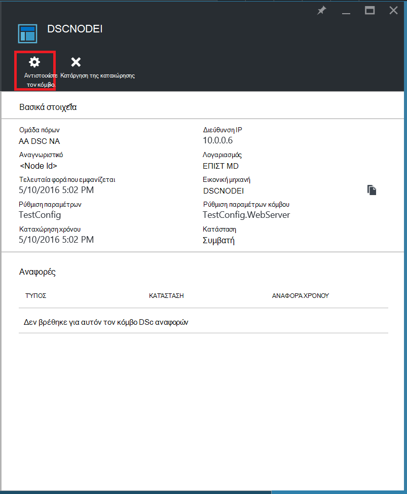

6. Στην την **Αντιστοίχιση ρύθμιση παραμέτρων κόμβου** blade, επιλέξτε τη ρύθμιση παραμέτρων κόμβου στο οποίο θέλετε να αντιστοιχίσετε τον κόμβο και, στη συνέχεια, κάντε κλικ στο κουμπί **OK**.

    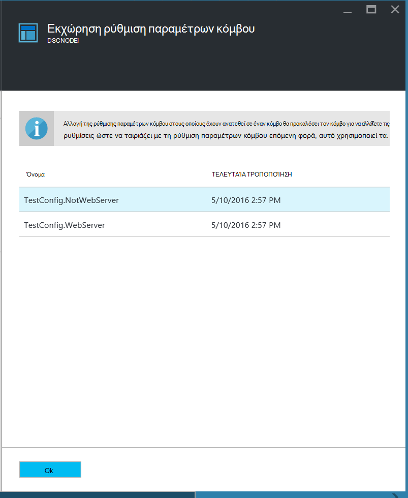
    
## <a name="unregistering-a-node"></a>Κατάργηση καταχώρησης ενός κόμβου

Εάν δεν θέλετε πλέον έναν κόμβο να διαχειρίζεται Azure DSC αυτοματισμού, μπορείτε να την καταργήσετε.

1. Είσοδος στην [πύλη του Azure](https://portal.azure.com).

2. Στο μενού διανομέας, κάντε κλικ στην επιλογή **όλους τους πόρους** και, στη συνέχεια, το όνομα του λογαριασμού σας αυτοματισμού.

3. Στην blade το **λογαριασμό αυτοματισμού** , επιλέξτε **Κόμβους DSC**.

4. Στην το blade **Κόμβους DSC** , κάντε κλικ στο όνομα του κόμβου που θέλετε να καταργήσετε την καταχώρηση.

5. Στην το blade για αυτόν τον κόμβο, κάντε κλικ στην επιλογή **Unregister**.

    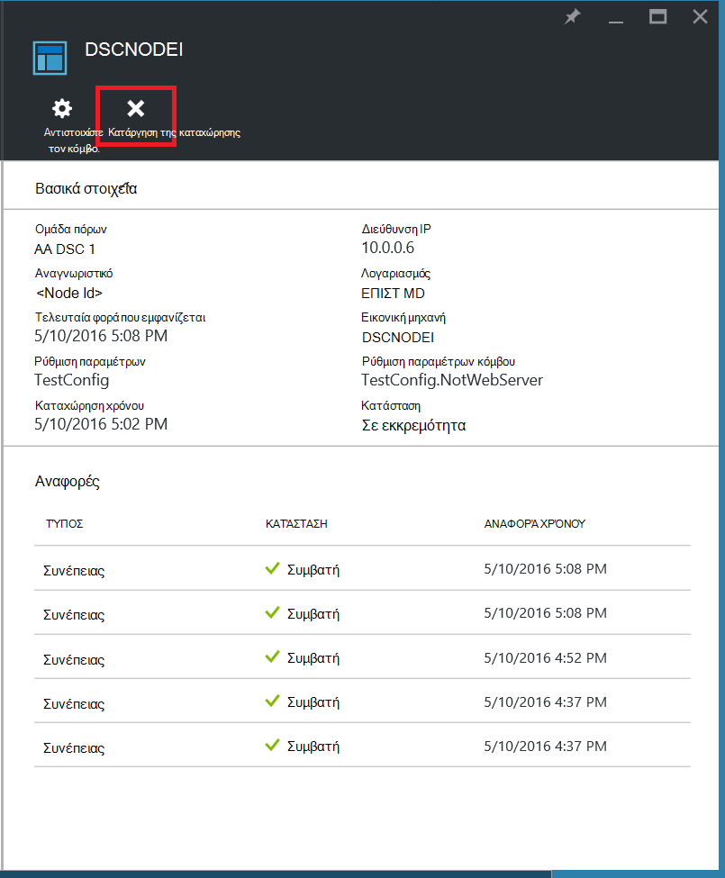

## <a name="related-articles"></a>Σχετικά άρθρα
* [Επισκόπηση Azure DSC αυτοματισμού](automation-dsc-overview.md)
* [Μηχανές προσθήκης λογαριασμών για διαχείριση με DSC αυτοματισμού Azure](automation-dsc-onboarding.md)
* [Επισκόπηση της κατάστασης ρύθμισης παραμέτρων επιθυμητοί του Windows PowerShell](https://msdn.microsoft.com/powershell/dsc/overview)
* [Cmdlet του Azure DSC αυτοματισμού](https://msdn.microsoft.com/library/mt244122.aspx)
* [Azure τιμολόγησης DSC αυτοματισμού](https://azure.microsoft.com/pricing/details/automation/)

