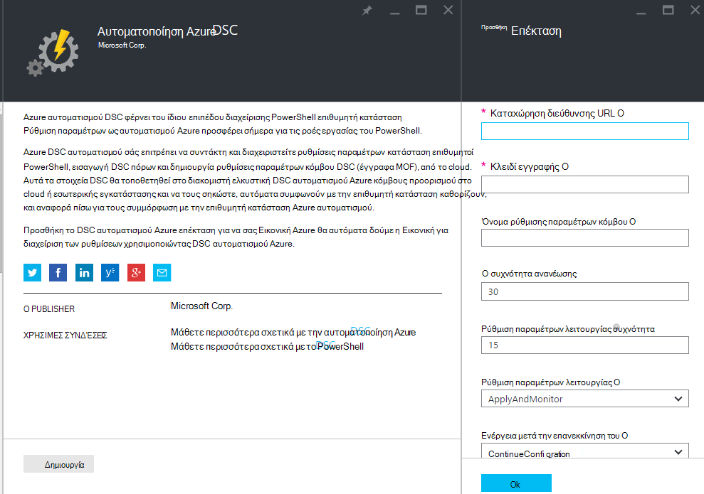
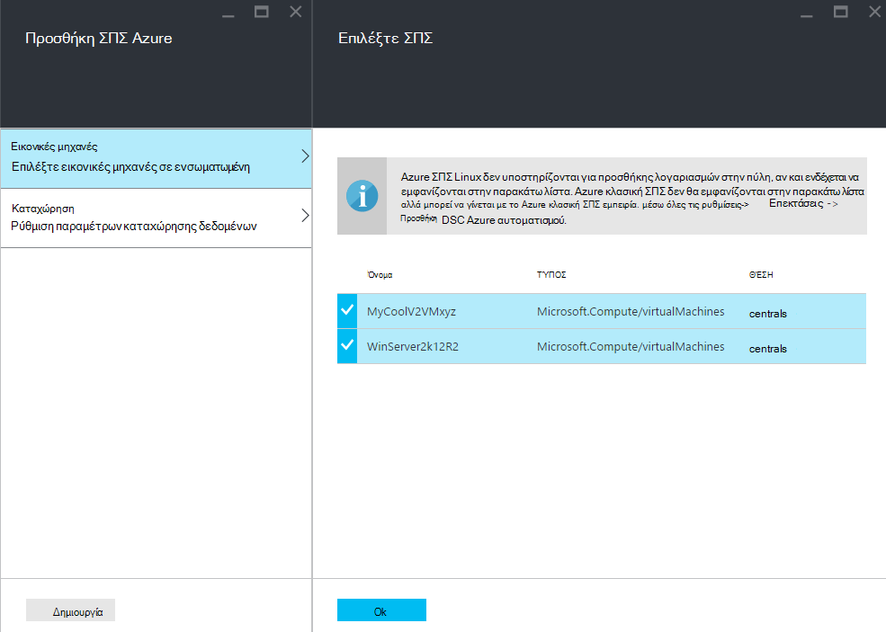
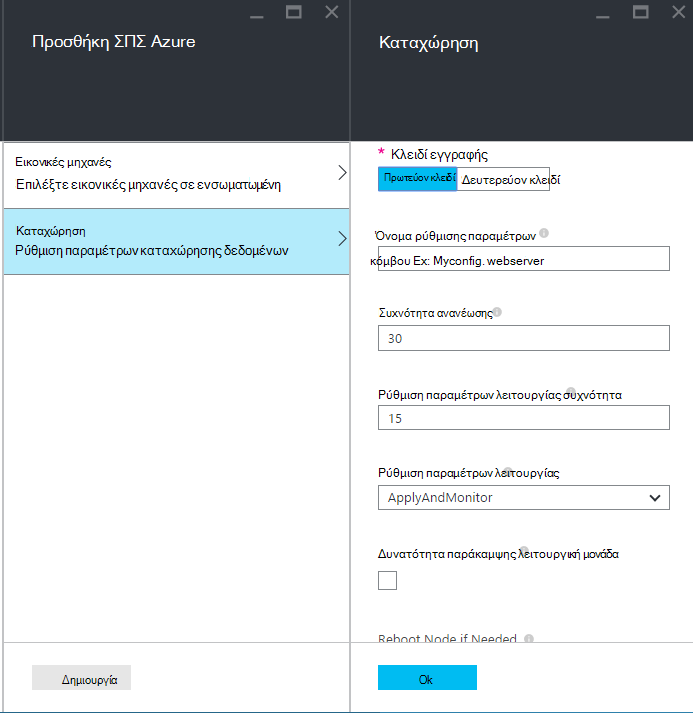
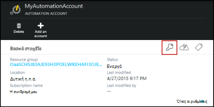
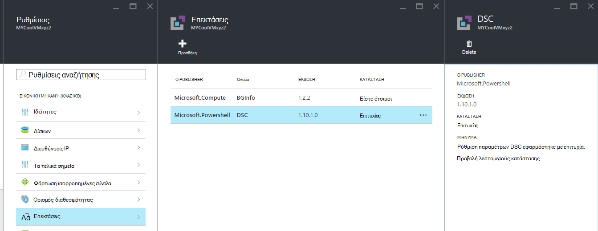

<properties 
   pageTitle="Προσθήκης λογαριασμών φυσικής και εικονικές μηχανές για διαχείριση με DSC αυτοματισμού Azure | Microsoft Azure" 
   description="Τρόπος εγκατάστασης μηχανές για διαχείριση με DSC αυτοματισμού Azure" 
   services="automation" 
   documentationCenter="dev-center-name" 
   authors="coreyp-at-msft" 
   manager="stevenka" 
   editor="tysonn"/>

<tags
   ms.service="automation"
   ms.devlang="NA"
   ms.topic="article"
   ms.tgt_pltfrm="powershell"
   ms.workload="TBD" 
   ms.date="04/22/2016"
   ms.author="coreyp"/>

# Μηχανές προσθήκης λογαριασμών για διαχείριση με DSC αυτοματισμού Azure

## Γιατί Διαχείριση μηχανές με DSC αυτοματισμού Azure;

Όπως [Ρύθμισης παραμέτρων κατάσταση επιθυμητοί PowerShell](https://technet.microsoft.com/library/dn249912.aspx), επιθυμητοί ρύθμιση παραμέτρων κατάσταση του Azure αυτοματισμού είναι ένα απλό αλλά πανίσχυρο, ρύθμιση παραμέτρων υπηρεσίας διαχείρισης για τους κόμβους DSC (φυσικά και εικονικές μηχανές) σε οποιαδήποτε κέντρα δεδομένων cloud ή εσωτερικής εγκατάστασης. Επιτρέπει κλιμάκωση σε χιλιάδες μηχανές γρήγορα και εύκολα από μια κεντρική, ασφαλή θέση. Μπορείτε να κάνετε εύκολα ενσωματωμένη μηχανές, αντιστοιχίστε τις ρυθμίσεις παραμέτρων δηλωτικό και προβολή εκθέσεων που εμφανίζει κάθε υπολογιστή της συμμόρφωσης στην επιθυμητή κατάσταση που καθορίσατε. Το επίπεδο διαχείρισης DSC αυτοματισμού Azure είναι να DSC τι είναι το επίπεδο διαχείρισης αυτοματισμού Azure, σε δέσμες ενεργειών του PowerShell. Με άλλα λόγια, με τον ίδιο τρόπο που αυτοματισμού Azure σάς βοηθά να διαχειριστείτε δεσμών ενεργειών του PowerShell, την επίσης σάς βοηθά να διαχειριστείτε ρυθμίσεις παραμέτρων DSC. Για να μάθετε περισσότερα σχετικά με τα οφέλη της χρήσης Azure DSC αυτοματισμού, ανατρέξτε στο θέμα [Επισκόπηση DSC αυτοματισμού Azure](automation-dsc-overview.md). 

Azure αυτοματισμού DSC μπορεί να χρησιμοποιηθεί για τη διαχείριση μια ποικιλία μηχανές:

*    Azure εικονικές μηχανές (κλασικό)
*    Azure εικονικές μηχανές
*    Υπηρεσίες Web Amazon (AWS) εικονικές μηχανές
*    Φυσικά/εικονικού Windows μηχανές εσωτερικής εγκατάστασης, ή σε ένα σύννεφο εκτός από το Azure/AWS
*    Linux φυσικά/εικονικές μηχανές εσωτερικής εγκατάστασης, στο Azure ή σε ένα σύννεφο εκτός από το Azure

Επιπλέον, εάν δεν είστε έτοιμοι για να διαχειριστείτε τις παραμέτρους του υπολογιστή από το cloud, Azure αυτοματισμού DSC μπορεί επίσης να χρησιμοποιηθεί ως ένα τελικό σημείο μόνο για αναφορά. Αυτό σας επιτρέπει να ορίσετε επιθυμητή ρύθμιση παραμέτρων (push) έως DSC εσωτερικής εγκατάστασης και να προβάλετε εμπλουτισμένου λεπτομέρειες αναφοράς στον κόμβο συμμόρφωση με την επιθυμητή κατάσταση στο Azure αυτοματισμού.

Οι παρακάτω ενότητες περιγράφουν πώς μπορείτε να δούμε κάθε τύπο υπολογιστή για να DSC αυτοματισμού Azure.

## Azure εικονικές μηχανές (κλασικό)

Με DSC αυτοματισμού Azure, μπορείτε να κάνετε εύκολα ενσωματωμένη Azure εικονικές μηχανές (κλασικό) για τη Διαχείριση παραμέτρων χρησιμοποιώντας είτε την πύλη του Azure ή PowerShell. Εμφάνιση σύνθετων ρυθμίσεων και χωρίς να χρειάζεται να απομακρυσμένο σε Εικονική το διαχειριστή, την επέκταση επιθυμητή ρύθμιση παραμέτρων κατάσταση του Azure Εικονική καταγράφει την εικονική Μηχανή DSC αυτοματισμού Azure. Επειδή η επέκταση επιθυμητοί ρύθμισης παραμέτρων κατάσταση του Azure Εικονική ασύγχρονα, εκτελείται βήματα για να παρακολουθήσετε την πρόοδο του έργου ή την αντιμετώπιση προβλημάτων παρατίθενται στην ενότητα [**Αντιμετώπιση προβλημάτων Azure προσθήκης λογαριασμών εικονική μηχανή**](#troubleshooting-azure-virtual-machine-onboarding) παρακάτω.

### Πύλη του Azure

Στην [πύλη του Azure](http://portal.azure.com/), κάντε κλικ στην επιλογή **Αναζήτηση** -> **εικονικές μηχανές (κλασική)**. Επιλέξτε την εικονική Μηχανή των Windows που θέλετε να ενσωματωμένη. Στον πίνακα εργαλείων blade η εικονική μηχανή, κάντε κλικ στην επιλογή **όλες οι ρυθμίσεις** -> **επεκτάσεις** -> **Προσθήκη** -> **DSC αυτοματισμού Azure** -> **Δημιουργία**. Πληκτρολογήστε τις [τιμές του PowerShell DSC τοπική Configuration Manager](https://msdn.microsoft.com/powershell/dsc/metaconfig4) απαιτούνται για το περίπτωσης χρήσης, κλειδί εγγραφής του λογαριασμού σας αυτοματισμού και καταχώρηση διεύθυνση URL και, προαιρετικά μια ρύθμιση παραμέτρων κόμβου για να αντιστοιχίσει την εικονική Μηχανή.

Για να βρείτε την καταχώρηση διεύθυνσης URL και αριθμού-κλειδιού για την αυτοματοποίηση λογαριασμού για να δούμε υπολογιστή για να, ανατρέξτε στην παρακάτω ενότητα [**ασφαλούς εγγραφής**](#secure-registration) .

### PowerShell

    # log in to both Azure Service Management and Azure Resource Manager
    Add-AzureAccount
    Add-AzureRmAccount
    
    # fill in correct values for your VM/Automation account here
    $VMName = ""
    $ServiceName = ""
    $AutomationAccountName = ""
    $AutomationAccountResourceGroup = ""

    # fill in the name of a Node Configuration in Azure Automation DSC, for this VM to conform to
    $NodeConfigName = ""

    # get Azure Automation DSC registration info
    $Account = Get-AzureRmAutomationAccount -ResourceGroupName $AutomationAccountResourceGroup -Name $AutomationAccountName
    $RegistrationInfo = $Account | Get-AzureRmAutomationRegistrationInfo

    # use the DSC extension to onboard the VM for management with Azure Automation DSC
    $VM = Get-AzureVM -Name $VMName -ServiceName $ServiceName
    
    $PublicConfiguration = ConvertTo-Json -Depth 8 @{
      SasToken = ""
      ModulesUrl = "https://eus2oaasibizamarketprod1.blob.core.windows.net/automationdscpreview/RegistrationMetaConfigV2.zip"
      ConfigurationFunction = "RegistrationMetaConfigV2.ps1\RegistrationMetaConfigV2"

    # update these PowerShell DSC Local Configuration Manager defaults if they do not match your use case.
    # See https://technet.microsoft.com/library/dn249922.aspx?f=255&MSPPError=-2147217396 for more details
     Properties = @{
        RegistrationKey = @{
          UserName = 'notused'
          Password = 'PrivateSettingsRef:RegistrationKey'
        }
        RegistrationUrl = $RegistrationInfo.Endpoint
        NodeConfigurationName = $NodeConfigName
        ConfigurationMode = "ApplyAndMonitor"
        ConfigurationModeFrequencyMins = 15
        RefreshFrequencyMins = 30
        RebootNodeIfNeeded = $False
        ActionAfterReboot = "ContinueConfiguration"
        AllowModuleOverwrite = $False
      }
    }

    $PrivateConfiguration = ConvertTo-Json -Depth 8 @{
      Items = @{
         RegistrationKey = $RegistrationInfo.PrimaryKey
      }
    }
    
    $VM = Set-AzureVMExtension `
     -VM $vm `
     -Publisher Microsoft.Powershell `
     -ExtensionName DSC `
     -Version 2.19 `
     -PublicConfiguration $PublicConfiguration `
     -PrivateConfiguration $PrivateConfiguration `
     -ForceUpdate

    $VM | Update-AzureVM

## Azure εικονικές μηχανές

Azure DSC αυτοματισμού σάς επιτρέπει να εύκολα ενσωματωμένη Azure εικονικές μηχανές για τη διαχείριση της ρύθμισης παραμέτρων, χρησιμοποιώντας είτε το Azure πύλη, διαχείριση πόρων Azure τα πρότυπα ή PowerShell. Εμφάνιση σύνθετων ρυθμίσεων και χωρίς να χρειάζεται να απομακρυσμένο σε Εικονική το διαχειριστή, την επέκταση επιθυμητοί ρύθμισης παραμέτρων κατάσταση του Azure Εικονική καταγράφει την εικονική Μηχανή DSC αυτοματισμού Azure. Επειδή η επέκταση Azure Εικονική επιθυμητοί νομό ρύθμιση των παραμέτρων εκτελείται ασύγχρονα, τα βήματα για να παρακολουθείτε την πρόοδο του έργου ή την αντιμετώπιση προβλημάτων παρατίθενται στην ενότητα [**Αντιμετώπιση προβλημάτων Azure προσθήκης λογαριασμών εικονική μηχανή**](#troubleshooting-azure-virtual-machine-onboarding) παρακάτω.

### Πύλη του Azure

Στην [πύλη του Azure](https://portal.azure.com/), μεταβείτε στο λογαριασμό αυτοματισμού Azure όπου θέλετε να ενσωματωμένη εικονικές μηχανές. Στον πίνακα εργαλείων λογαριασμό αυτοματισμού, κάντε κλικ στο κουμπί **Κόμβοι DSC** -> **Προσθήκη Εικονική Azure**.

Στην περιοχή **Επιλέξτε εικονικές μηχανές σε ενσωματωμένη**, επιλέξτε μία ή περισσότερες Azure εικονικές μηχανές σε ενσωματωμένη.

Στην περιοχή **Ρύθμιση παραμέτρων καταχώρηση δεδομένων**, πληκτρολογήστε τις [τιμές του PowerShell DSC τοπική Configuration Manager](https://msdn.microsoft.com/powershell/dsc/metaconfig4) απαιτούνται για το περίπτωσης χρήσης και, προαιρετικά, μια ρύθμιση παραμέτρων κόμβου για να αντιστοιχίσει την εικονική Μηχανή.

 
### Azure πρότυπα διαχείρισης πόρων

Azure εικονικές μηχανές μπορούν να αναπτυχθούν και onboarded να DSC αυτοματισμού Azure μέσω πρότυπα διαχείρισης πόρων Azure. Ανατρέξτε στο θέμα [Ρύθμιση παραμέτρων μια Εικονική μέσω DSC επέκταση και DSC αυτοματισμού Azure](https://azure.microsoft.com/documentation/templates/dsc-extension-azure-automation-pullserver/) για ένα πρότυπο το παράδειγμα αυτό onboards μια υπάρχουσα Εικονική να DSC αυτοματισμού Azure. Για να βρείτε το κλειδί εγγραφής και τη διεύθυνση URL δήλωσης λαμβάνεται ως είσοδο σε αυτό το πρότυπο, ανατρέξτε στην ενότητα [**ασφαλούς δήλωσης**](#secure-registration) παρακάτω.

### PowerShell

Το cmdlet [Register-AzureRmAutomationDscNode](https://msdn.microsoft.com/library/mt603833.aspx) μπορεί να χρησιμοποιηθεί για ενσωματωμένη εικονικές μηχανές στην πύλη του Azure μέσω του PowerShell.

## Υπηρεσίες Web Amazon (AWS) εικονικές μηχανές

Μπορείτε να κάνετε εύκολα ενσωματωμένη υπηρεσίες Web του Amazon εικονικές μηχανές για διαχείριση παραμέτρων με DSC αυτοματισμού Azure χρήση του Κιτ εργαλείων DSC AWS. Μπορείτε να μάθετε περισσότερα σχετικά με το Κιτ εργαλείων [εδώ](https://blogs.msdn.microsoft.com/powershell/2016/04/20/aws-dsc-toolkit/).

## Φυσικά/εικονικού Windows μηχανές εσωτερικής εγκατάστασης, ή σε ένα σύννεφο εκτός από το Azure/AWS

Μηχανές Windows εσωτερικής εγκατάστασης και μηχανές Windows σε μη Azure σύννεφων (όπως υπηρεσίες Web του Amazon) μπορεί να είναι onboarded να Azure DSC αυτοματισμού, με την προϋπόθεση ότι έχουν εξερχομένων πρόσβαση στο Internet, μέσω μερικά απλά βήματα:

1. Βεβαιωθείτε ότι η πιο πρόσφατη έκδοση του [WMF 5](http://aka.ms/wmf5latest) είναι εγκατεστημένο στους υπολογιστές που θέλετε να ενσωματωμένη σε DSC αυτοματισμού Azure.
2. Ακολουθήστε τις οδηγίες στην ενότητα [**Δημιουργία DSC metaconfigurations**](#generating-dsc-metaconfigurations) παρακάτω για να δημιουργήσετε ένα φάκελο που περιέχει το απαραίτητο metaconfigurations DSC.
3. Απομακρυσμένη εφαρμογή το PowerShell DSC metaconfiguration οι υπολογιστές που θέλετε να ενσωματωμένη. **Αυτή η εντολή εκτελείται από υπολογιστή πρέπει να έχετε την πιο πρόσφατη έκδοση του [WMF 5](http://aka.ms/wmf5latest) εγκατεστημένο**:

    `Set-DscLocalConfigurationManager -Path C:\Users\joe\Desktop\DscMetaConfigs -ComputerName MyServer1, MyServer2`

4. Εάν δεν μπορείτε να εφαρμόσετε το PowerShell DSC metaconfigurations απομακρυσμένα, αντιγράψτε το φάκελο metaconfigurations από το βήμα 2 σε κάθε υπολογιστή ενσωματωμένη. Στη συνέχεια, καλέστε **Σύνολο DscLocalConfigurationManager** τοπικά σε κάθε υπολογιστή με ενσωματωμένη.
5. Χρησιμοποιώντας την πύλη του Azure ή τα cmdlet, ελέγξτε ότι οι υπολογιστές σε ενσωματωμένη τώρα εμφανίζεται ως κόμβοι DSC που έχουν καταχωρηθεί στο λογαριασμό σας στο Azure αυτοματισμού.

## Linux φυσικά/εικονικές μηχανές εσωτερικής εγκατάστασης, στο Azure ή σε ένα σύννεφο εκτός από το Azure

Μηχανές Linux εσωτερικής εγκατάστασης, μηχανές Linux στο Azure και μηχανές Linux σε μη Azure σύννεφων μπορεί να είναι onboarded να Azure DSC αυτοματισμού, με την προϋπόθεση ότι έχουν εξερχομένων πρόσβαση στο Internet, μέσω μερικά απλά βήματα:

1. Βεβαιωθείτε ότι την πιο πρόσφατη έκδοση του [παράγοντα DSC Linux](http://www.microsoft.com/download/details.aspx?id=49150) είναι εγκατεστημένο στους υπολογιστές που θέλετε να ενσωματωμένη σε DSC αυτοματισμού Azure.

2. Εάν τις [προεπιλογές PowerShell DSC τοπική Configuration Manager](https://msdn.microsoft.com/powershell/dsc/metaconfig4) ταιριάζουν με την περίπτωση χρήσης και θέλετε να ενσωματωμένη μηχανήματα όπως ότι **τόσο** να χρησιμοποιούν και αναφοράς σε DSC αυτοματισμού Azure:

    *    Σε κάθε υπολογιστή Linux σε ενσωματωμένη σε DSC αυτοματισμού Azure, χρησιμοποιήστε Register.py για να ενσωματωμένη χρησιμοποιώντας τις προεπιλογές Διαχείριση ομάδας παραμέτρων τοπικών DSC PowerShell:

        `/opt/microsoft/dsc/Scripts/Register.py <Automation account registration key> <Automation account registration URL>`

    *    Για να βρείτε το κλειδί εγγραφής και τη διεύθυνση URL καταχώρηση για το λογαριασμό σας αυτοματισμού, ανατρέξτε στην ενότητα [**ασφαλούς δήλωσης**](#secure-registration) παρακάτω.

    Εάν το PowerShell DSC τοπική Configuration Manager προεπιλογές **κάντε** **δεν** match σας περίπτωσης χρήσης, ή όταν θέλετε να ενσωματωμένη μηχανές έτσι ώστε μόνο στους οποίους υπάγονται Azure DSC αυτοματισμού, αλλά χωρίς δεν ελκυστική ρύθμισης παραμέτρων ή λειτουργικές μονάδες PowerShell από αυτό, ακολουθήστε τα βήματα 3-6. Διαφορετικά, προχωρήστε απευθείας στο βήμα 6.

3.  Ακολουθήστε τις οδηγίες στην ενότητα [**Δημιουργία DSC metaconfigurations**](#generating-dsc-metaconfigurations) παρακάτω για να δημιουργήσετε ένα φάκελο που περιέχει το απαραίτητο metaconfigurations DSC.
4.  Απομακρυσμένη ισχύουν το PowerShell DSC metaconfiguration για τα μηχανήματα που θέλετε να ενσωματωμένη:
        
        $SecurePass = ConvertTo-SecureString -String "<root password>" -AsPlainText -Force
        $Cred = New-Object System.Management.Automation.PSCredential "root", $SecurePass
        $Opt = New-CimSessionOption -UseSsl -SkipCACheck -SkipCNCheck -SkipRevocationCheck

        # need a CimSession for each Linux machine to onboard
        
        $Session = New-CimSession -Credential $Cred -ComputerName <your Linux machine> -Port 5986 -Authentication basic -SessionOption $Opt
        
        Set-DscLocalConfigurationManager -CimSession $Session –Path C:\Users\joe\Desktop\DscMetaConfigs
    
Αυτή η εντολή εκτελείται από υπολογιστή πρέπει να έχετε την πιο πρόσφατη έκδοση του [WMF 5](http://aka.ms/wmf5latest) εγκατεστημένο.

5.  Εάν δεν μπορείτε να εφαρμόσετε το PowerShell DSC metaconfigurations απομακρυσμένα, για κάθε υπολογιστή Linux σε ενσωματωμένη, αντιγράψτε το metaconfiguration που αντιστοιχεί σε αυτόν τον υπολογιστή από το φάκελο στο βήμα 5 στο μηχάνημα Linux. Στη συνέχεια, καλέστε `SetDscLocalConfigurationManager.py` τοπικά σε κάθε υπολογιστή Linux που θέλετε να ενσωματωμένη σε DSC αυτοματισμού Azure:

    `/opt/microsoft/dsc/Scripts/SetDscLocalConfigurationManager.py –configurationmof <path to metaconfiguration file>`

6.  Χρησιμοποιώντας την πύλη του Azure ή τα cmdlet, ελέγξτε ότι οι υπολογιστές σε ενσωματωμένη τώρα εμφανίζεται ως κόμβοι DSC που έχουν καταχωρηθεί στο λογαριασμό σας στο Azure αυτοματισμού.

##Δημιουργία DSC metaconfigurations
Για να γενικά ενσωματωμένη οποιονδήποτε υπολογιστή για να Azure DSC αυτοματισμού, μια metaconfiguration DSC μπορεί να είναι που δημιουργούνται που, όταν εφαρμόζονται, σας ενημερώνει για τον παράγοντα DSC στον υπολογιστή να αποσπάσετε από ή/και αναφοράς σε DSC αυτοματισμού Azure. DSC metaconfigurations για Azure αυτοματισμού DSC μπορεί να δημιουργηθεί με τη χρήση μιας ρύθμισης παραμέτρων PowerShell DSC ή τα cmdlet του PowerShell αυτοματισμού Azure.

**Σημείωση:** DSC metaconfigurations περιέχουν το απόρρητο χρειάζεται να ενσωματωμένη ένα μηχάνημα αυτοματισμού ένα λογαριασμό για τη διαχείριση. Βεβαιωθείτε ότι για να προστατεύσετε σωστά τυχόν metaconfigurations DSC μπορείτε να δημιουργήσετε ή να διαγράψετε τους μετά τη χρήση.

###Χρησιμοποιώντας μια ρύθμιση παραμέτρων DSC
1.  Ανοίξτε το PowerShell ISE ως διαχειριστής σε έναν υπολογιστή στο περιβάλλον σας τοπικά. Ο υπολογιστής πρέπει να έχετε την πιο πρόσφατη έκδοση του [WMF 5](http://aka.ms/wmf5latest) εγκατεστημένο.

2.  Αντιγράψτε την ακόλουθη δέσμη ενεργειών τοπικά. Αυτή η δέσμη ενεργειών περιέχει μια ρύθμιση παραμέτρων PowerShell DSC για τη δημιουργία metaconfigurations, καθώς και μια εντολή για να ξεκινήσετε τη δημιουργία metaconfiguration.
    
        # The DSC configuration that will generate metaconfigurations
        [DscLocalConfigurationManager()]
        Configuration DscMetaConfigs 
        { 
            param 
            ( 
                [Parameter(Mandatory=$True)] 
                [String]$RegistrationUrl,
         
                [Parameter(Mandatory=$True)] 
                [String]$RegistrationKey,

                [Parameter(Mandatory=$True)] 
                [String[]]$ComputerName,

                [Int]$RefreshFrequencyMins = 30, 
            
                [Int]$ConfigurationModeFrequencyMins = 15, 
            
                [String]$ConfigurationMode = "ApplyAndMonitor", 
            
                [String]$NodeConfigurationName,

                [Boolean]$RebootNodeIfNeeded= $False,

                [String]$ActionAfterReboot = "ContinueConfiguration",

                [Boolean]$AllowModuleOverwrite = $False,

                [Boolean]$ReportOnly
            )

    
            if(!$NodeConfigurationName -or $NodeConfigurationName -eq "") 
            { 
                $ConfigurationNames = $null 
            } 
            else 
            { 
                $ConfigurationNames = @($NodeConfigurationName) 
            }

            if($ReportOnly)
            {
               $RefreshMode = "PUSH"
            }
            else
            {
               $RefreshMode = "PULL"
            }

            Node $ComputerName
            {

                Settings 
                { 
                    RefreshFrequencyMins = $RefreshFrequencyMins 
                    RefreshMode = $RefreshMode 
                    ConfigurationMode = $ConfigurationMode 
                    AllowModuleOverwrite = $AllowModuleOverwrite 
                    RebootNodeIfNeeded = $RebootNodeIfNeeded 
                    ActionAfterReboot = $ActionAfterReboot 
                    ConfigurationModeFrequencyMins = $ConfigurationModeFrequencyMins 
                }

                if(!$ReportOnly)
                {
                   ConfigurationRepositoryWeb AzureAutomationDSC 
                    { 
                        ServerUrl = $RegistrationUrl 
                        RegistrationKey = $RegistrationKey 
                        ConfigurationNames = $ConfigurationNames 
                    }

                    ResourceRepositoryWeb AzureAutomationDSC 
                    { 
                       ServerUrl = $RegistrationUrl 
                       RegistrationKey = $RegistrationKey 
                    }
                }

                ReportServerWeb AzureAutomationDSC 
                { 
                    ServerUrl = $RegistrationUrl 
                    RegistrationKey = $RegistrationKey 
                }
            } 
        }
        
        # Create the metaconfigurations
        # TODO: edit the below as needed for your use case
        $Params = @{
             RegistrationUrl = '<fill me in>';
             RegistrationKey = '<fill me in>';
             ComputerName = @('<some VM to onboard>', '<some other VM to onboard>');
             NodeConfigurationName = 'SimpleConfig.webserver';
             RefreshFrequencyMins = 30;
             ConfigurationModeFrequencyMins = 15;
             RebootNodeIfNeeded = $False;
             AllowModuleOverwrite = $False;
             ConfigurationMode = 'ApplyAndMonitor';
             ActionAfterReboot = 'ContinueConfiguration';
             ReportOnly = $False;  # Set to $True to have machines only report to AA DSC but not pull from it
        }
        
        # Use PowerShell splatting to pass parameters to the DSC configuration being invoked
        # For more info about splatting, run: Get-Help -Name about_Splatting
        DscMetaConfigs @Params

3.  Συμπληρώστε το κλειδί εγγραφής και τη διεύθυνση URL για το λογαριασμό σας αυτοματισμού, καθώς και τα ονόματα των μηχανήματα για ενσωματωμένη. Όλες οι υπόλοιπες παράμετροι είναι προαιρετικό. Για να βρείτε το κλειδί εγγραφής και τη διεύθυνση URL καταχώρηση για το λογαριασμό σας αυτοματισμού, ανατρέξτε στην ενότητα [**ασφαλούς δήλωσης**](#secure-registration) παρακάτω.

4.  Εάν θέλετε οι υπολογιστές για να αναφέρετε DSC πληροφορίες κατάστασης για να DSC αυτοματισμού Azure, αλλά δεν ελκυστική ρύθμισης παραμέτρων ή λειτουργικές μονάδες PowerShell, ορίστε την παράμετρο **ReportOnly** στην τιμή true.

5.  Εκτελέστε τη δέσμη ενεργειών. Πρέπει τώρα να έχετε ένα φάκελο που ονομάζεται **DscMetaConfigs** στον κατάλογο εργασίας, που περιέχει το metaconfigurations PowerShell DSC για μηχανήματα για ενσωματωμένη.

###Χρησιμοποιώντας τα cmdlet αυτοματισμού Azure
Εάν τις προεπιλογές PowerShell DSC τοπική Configuration Manager ταιριάζουν με την περίπτωση χρήσης και θέλετε να ενσωματωμένη μηχανές ώστε τόσο να χρησιμοποιούν και αναφοράς σε DSC αυτοματισμού Azure, τα cmdlet αυτοματισμού Azure παρέχουν μια απλοποιημένη μέθοδο δημιουργό του metaconfigurations DSC χρειάζεται:

1.  Ανοίξτε το PowerShell κονσόλας ή PowerShell ISE ως διαχειριστής σε έναν υπολογιστή στο περιβάλλον σας τοπικά.

2.  Σύνδεση σε Azure διαχείριση πόρων με **Προσθήκη AzureRmAccount**

3.  Κάντε λήψη του PowerShell DSC metaconfigurations για τα μηχανήματα που θέλετε να ενσωματωμένη από το λογαριασμό αυτοματισμού, στο οποίο θέλετε να ενσωματωμένη κόμβους:

        # Define the parameters for Get-AzureRmAutomationDscOnboardingMetaconfig using PowerShell Splatting
        $Params = @{
            ResourceGroupName = 'ContosoResources'; # The name of the ARM Resource Group that contains your Azure Automation Account
            AutomationAccountName = 'ContosoAutomation'; # The name of the Azure Automation Account where you want a node on-boarded to
            ComputerName = @('web01', 'web02', 'sql01'); # The names of the computers that the meta configuration will be generated for
            OutputFolder = "$env:UserProfile\Desktop\";
        }
        
        # Use PowerShell splatting to pass parameters to the Azure Automation cmdlet being invoked
        # For more info about splatting, run: Get-Help -Name about_Splatting
        Get-AzureRmAutomationDscOnboardingMetaconfig @Params

Τώρα θα πρέπει να έχετε ένα φάκελο που ονομάζεται ***DscMetaConfigs***, που περιέχει το metaconfigurations PowerShell DSC για μηχανήματα για ενσωματωμένη.

##Ασφαλής εγγραφής

Μηχανές με ασφάλεια δούμε να με ένα λογαριασμό αυτοματισμού Azure μέσω του πρωτοκόλλου δήλωσης WMF 5 DSC, που επιτρέπει σε έναν κόμβο DSC για τον έλεγχο ταυτότητας σε ένα διακομιστή ελκυστική V2 DSC PowerShell ή αναφοράς (συμπεριλαμβανομένων των Azure αυτοματισμού DSC). Ο κόμβος καταχωρεί στο διακομιστή σε μια **Διεύθυνση URL εγγραφής**, τον έλεγχο ταυτότητας χρησιμοποιώντας ένα **κλειδί εγγραφής**. Κατά την εγγραφή, ο κόμβος DSC και ο διακομιστής DSC ελκυστική/αναφοράς διαπραγμάτευσης ένα μοναδικό πιστοποιητικό για αυτόν τον κόμβο για να χρησιμοποιήσετε για τον έλεγχο ταυτότητας για την καταχώρηση μετά τη διακομιστή. Αυτή η διαδικασία αποτρέπει onboarded κόμβους από μία άλλη, όπως εάν ένας κόμβος έχει παραβιαστεί απομίμηση και συμπεριφέρεται με κακόβουλη. Μετά την καταχώρηση, το κλειδί εγγραφής δεν χρησιμοποιείται για τον έλεγχο ταυτότητας ξανά και διαγράφεται και από τον κόμβο.

Μπορείτε να λάβετε τις πληροφορίες που απαιτούνται για το πρωτόκολλο DSC καταχώρηση από τη **Διαχείριση κλειδιών** blade στην πύλη του Azure preview. Ανοίξτε αυτό blade κάνοντας κλικ στο εικονίδιο κλειδιού στον πίνακα **βασικά στοιχεία** για το λογαριασμό αυτοματισμού.

*    Διεύθυνση URL δήλωσης είναι στο πεδίο διεύθυνση URL του blade διαχείριση κλειδιών.
*    Κλειδί εγγραφής είναι το πρωτεύον κλειδί πρόσβασης ή δευτερεύον κλειδί πρόσβασης σε blade τη διαχείριση κλειδιών. Μπορεί να χρησιμοποιηθεί πατημένο το πλήκτρο.

Για πρόσθετη ασφάλεια, μπορεί να αναπαραχθεί των πλήκτρων πρόσβασης κύριας και δευτερεύουσας ενός λογαριασμού αυτοματισμού ανά πάσα στιγμή (για τη **Διαχείριση κλειδιών** blade) για να αποτρέψετε την μελλοντική κόμβο καταχωρήσεων χρησιμοποιώντας προηγούμενα κλειδιά.

##Αντιμετώπιση προβλημάτων προσθήκης λογαριασμών Azure εικονική μηχανή

Azure DSC αυτοματισμού σάς επιτρέπει να εύκολα ενσωματωμένη ΣΠΣ Windows Azure για τη διαχείριση της ρύθμισης παραμέτρων. Εμφάνιση σύνθετων ρυθμίσεων, την επέκταση επιθυμητοί ρύθμισης παραμέτρων κατάσταση του Azure Εικονική χρησιμοποιείται για να καταχωρήσετε την εικονική Μηχανή με DSC αυτοματισμού Azure. Επειδή η επέκταση επιθυμητοί ρύθμισης παραμέτρων κατάσταση του Azure Εικονική εκτελείται ασύγχρονα, παρακολουθεί την πρόοδο του έργου και την αντιμετώπιση προβλημάτων του εκτέλεσης μπορεί να είναι σημαντική. 

>[AZURE.NOTE] Οποιαδήποτε μέθοδος προσθήκης λογαριασμών Εικονική μηχανή Windows Azure για DSC αυτοματισμού Azure που χρησιμοποιεί την επέκταση επιθυμητοί ρύθμισης παραμέτρων κατάσταση του Azure Εικονική μπορεί να χρειαστεί έως και μία ώρα για τον κόμβο για να εμφανίσετε μέχρι όπως έχει καταγραφεί στο Azure αυτοματισμού. Αυτό οφείλεται την εγκατάσταση του Windows Management Framework 5.0 στον την εικονική Μηχανή από την επέκταση DSC Εικονική Azure, η οποία απαιτείται για την ενσωματωμένη την εικονική Μηχανή να DSC αυτοματισμού Azure.

Για να αντιμετωπίσετε ή προβολή της κατάστασης της επέκτασης Azure Εικονική επιθυμητοί κατάσταση ρύθμιση των παραμέτρων, στο το Azure πύλη μεταβείτε η Εικονική που onboarded, στη συνέχεια, κάντε κλικ στις επιλογές -> **όλες οι ρυθμίσεις** -> **επεκτάσεις** -> **DSC**. Για περισσότερες λεπτομέρειες, μπορείτε να κάνετε κλικ **Προβολή λεπτομερούς κατάστασης**.

## Λήξη πιστοποιητικό και εκ νέου καταχώρηση

Μετά την καταχώρηση ένα μηχάνημα ως έναν κόμβο DSC στο Azure DSC αυτοματισμού, υπάρχουν έναν αριθμό λόγοι για τους οποίους ίσως χρειαστεί να καταχωρήσετε αυτόν τον κόμβο στο μέλλον:

* Μετά την εγγραφή, κάθε κόμβο διαπραγματεύεται αυτόματα ένα μοναδικό πιστοποιητικό για τον έλεγχο ταυτότητας που λήγει μετά από ένα έτος. Προς το παρόν, το πρωτόκολλο δήλωσης PowerShell DSC δεν είναι δυνατό να ανανεωθεί αυτόματα πιστοποιητικά όταν αυτά προσεγγίζουν λήξης, ώστε να πρέπει να επαναλάβετε την καταχώρηση τους κόμβους μετά από ένα έτος χρονικό διάστημα. Πριν να επανακαταχώρηση, βεβαιωθείτε ότι κάθε κόμβο εκτελεί Windows Management Framework 5.0 RTM. Εάν το πιστοποιητικό ελέγχου ταυτότητας έναν κόμβο λήξει και ο κόμβος δεν είναι δηλωθεί ξανά, ο κόμβος θα είναι δυνατή η επικοινωνία με την αυτοματοποίηση Azure και θα επισημανθούν 'Unresponsive'. Η εκ νέου καταχώρηση έχει πραγματοποιηθεί 90 ημέρες ή μικρότερη από την ώρα λήξης πιστοποιητικού ή σε οποιοδήποτε σημείο μετά την ώρα λήξης πιστοποιητικού, θα έχει ως αποτέλεσμα ένα νέο πιστοποιητικό που δημιουργείται και χρησιμοποιούνται.

* Για να αλλάξετε τις [τιμές PowerShell DSC τοπική Configuration Manager](https://msdn.microsoft.com/powershell/dsc/metaconfig4) που έχουν οριστεί κατά την αρχική εγγραφή του κόμβου, όπως το στοιχείο ConfigurationMode. Προς το παρόν, οι τιμές αυτές παράγοντας DSC μπορεί να αλλάξει μόνο μέσω εκ νέου καταχώρηση. Η μοναδική εξαίρεση είναι η ρύθμιση παραμέτρων κόμβου που έχουν εκχωρηθεί στον κόμβο--αυτή μπορεί να αλλάξει στο Azure αυτοματισμού DSC απευθείας.

Η εκ νέου καταχώρηση μπορεί να εκτελεστεί με τον ίδιο τρόπο που έχουν καταχωρηθεί στον κόμβο αρχικά, χρησιμοποιώντας οποιαδήποτε από τις μεθόδους προσθήκης λογαριασμών που περιγράφονται σε αυτό το έγγραφο. Δεν χρειάζεται να unregister έναν κόμβο από το Azure αυτοματισμού DSC πριν από την επανακαταχώρηση.

## Σχετικά άρθρα
* [Επισκόπηση Azure DSC αυτοματισμού](automation-dsc-overview.md)
* [Cmdlet του Azure DSC αυτοματισμού](https://msdn.microsoft.com/library/mt244122.aspx)
* [Azure τιμολόγησης DSC αυτοματισμού](https://azure.microsoft.com/pricing/details/automation/)

