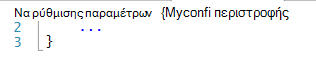
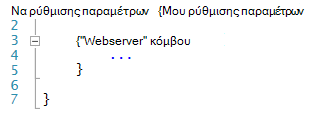
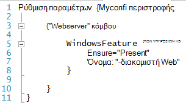
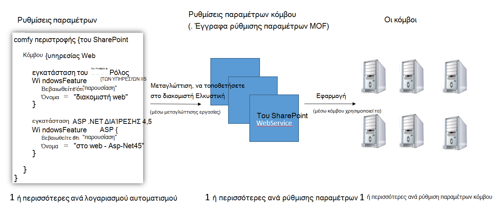
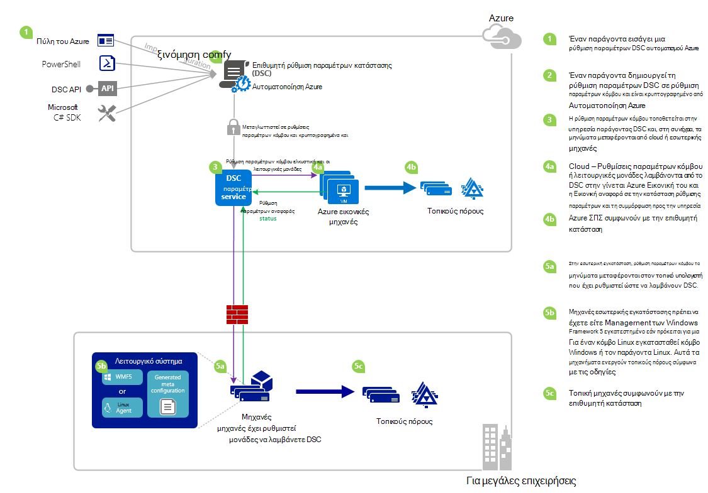

<properties 
   pageTitle="Επισκόπηση DSC Azure αυτοματισμού | Microsoft Azure" 
   description="Μια επισκόπηση του Azure αυτοματισμού επιθυμητοί κατάσταση ρύθμισης παραμέτρων (DSC), το όρους και γνωστά θέματα" 
   services="automation" 
   documentationCenter="dev-center-name" 
   authors="coreyp-at-msft" 
   manager="stevenka" 
   editor="tysonn"
   keywords="PowerShell dsc, ρύθμιση παραμέτρων επιθυμητή κατάσταση, powershell dsc azure"/>

<tags
   ms.service="automation"
   ms.devlang="NA"
   ms.topic="article"
   ms.tgt_pltfrm="powershell"
   ms.workload="TBD" 
   ms.date="05/10/2016"
   ms.author="magoedte;coreyp"/>

# Επισκόπηση DSC Azure αυτοματισμού #

##Τι είναι το Azure αυτοματισμού DSC;##
Για την ανάπτυξη και τη διατήρηση την επιθυμητή κατάσταση των διακομιστών και πόρους εφαρμογής μπορεί να είναι χρονοβόρα και σφάλματα. Με το Azure αυτοματισμού επιθυμητή κατάσταση ρύθμισης παραμέτρων (DSC), μπορείτε να αναπτύξετε με συνέπεια, να αξιόπιστα παρακολουθείτε και να ενημερώνει αυτόματα την επιθυμητή κατάσταση όλων των πόρων του IT σας σε κλίμακα από το cloud. Ενσωματωμένη σε PowerShell DSC, DSC αυτοματισμού να στοιχίσετε παραμέτρων υπολογιστή με συγκεκριμένο νομό σε φυσική και εικονικές μηχανές (ΣΠΣ), με τη χρήση των Windows ή Linux, και στο cloud ή εσωτερικής εγκατάστασης. Μπορείτε να ενεργοποιήσετε συνεχής παράδοσης υπηρεσιών IT με συνεπή στοιχείο ελέγχου και διαχείριση γρήγορη αλλαγή σε σας ετερογενή υβριδικό περιβάλλον ΤΕΧΝΟΛΟΓΙΏΝ πληροφορικής με ευκολία.

Azure DSC αυτοματισμού δημιουργεί επάνω από τα βασικά στοιχεία που έχουν εισαχθεί στην DSC PowerShell για την παροχή μια ακόμα πιο εύκολη η εμπειρία διαχείρισης ρύθμισης παραμέτρων. Azure DSC αυτοματισμού εμφανίζει το ίδιο επίπεδο διαχείρισης [επιθυμητή](https://msdn.microsoft.com/powershell/dsc/overview) ρύθμιση παραμέτρων κατάσταση PowerShell καθώς προσφέρει αυτοματισμού Azure για το PowerShell δέσμες ενεργειών σήμερα.

Azure DSC αυτοματισμού σάς επιτρέπει να [συντάκτη και να διαχειριστείτε ρυθμίσεις παραμέτρων κατάσταση επιθυμητοί PowerShell](https://technet.microsoft.com/library/dn249918.aspx), εισαγωγή [DSC πόρων](https://technet.microsoft.com/library/dn282125.aspx)και δημιουργία ρυθμίσεις παραμέτρων κόμβου DSC (έγγραφα MOF), από το cloud. Αυτά τα στοιχεία DSC θα τοποθετηθεί στην αυτοματοποίηση Azure [DSC ελκυστική διακομιστή](https://technet.microsoft.com/library/dn249913.aspx) κόμβους προορισμού (όπως φυσικά και εικονικές μηχανές) στο cloud ή εσωτερικής εγκατάστασης και να τους σηκώστε, αυτόματα συμφωνούν με την επιθυμητή κατάσταση καθορίζουν, και αναφορά πίσω για τους συμμόρφωση με την επιθυμητή κατάσταση Azure αυτοματισμού.

Προτιμάτε να παρακολουθούν να ανάγνωσης; Έχετε μια ματιά το κάτω από το βίντεο από Μάιος 2015, όταν ανακοινώθηκε πρώτα το Azure αυτοματισμού DSC. **Σημείωση:** Ενώ τις έννοιες και κύκλου ζωής που αναφέρονται σε αυτό το βίντεο είναι σωστές, DSC αυτοματισμού Azure έχει προχωρήσει πολύ εφόσον εγγράφηκε σε αυτό το βίντεο. Τώρα είναι γενικά διαθέσιμο, έχει μια πολύ πιο εκτεταμένη περιβάλλοντος εργασίας Χρήστη στην πύλη του Azure και υποστηρίζει πολλές πρόσθετες δυνατότητες.

> [AZURE.VIDEO microsoft-ignite-2015-heterogeneous-configuration-management-using-microsoft-azure-automation]

## Azure αυτοματισμού DSC όρους ##
### Ρύθμιση παραμέτρων ###
PowerShell DSC εισάγονται μιας νέας έννοιας που ονομάζεται ρυθμίσεις παραμέτρων. Ρυθμίσεις παραμέτρων σάς επιτρέπουν να καθορίσετε, μέσω του PowerShell σύνταξη, η επιθυμητή κατάσταση του περιβάλλοντός σας. Για να χρησιμοποιήσετε DSC για να ρυθμίσετε τις παραμέτρους περιβάλλοντος του, πρώτα ορίζουν ένα μπλοκ δέσμης ενεργειών του Windows PowerShell, χρησιμοποιώντας τη λέξη-κλειδί ρύθμισης παραμέτρων και κατόπιν ακολουθήστε το με ένα αναγνωριστικό, στη συνέχεια, με άγκιστρα ({}) για να διαχωρίζουν το μπλοκ.

Εντός του μπλοκ ρύθμισης παραμέτρων, μπορείτε να ορίσετε μπλοκ ρύθμισης παραμέτρων κόμβου που καθορίζουν την επιθυμητή ρύθμιση παραμέτρων για ένα σύνολο κόμβους (υπολογιστές) στο περιβάλλον σας που θα πρέπει να ρυθμίσει τις παραμέτρους ακριβώς το ίδιο. Με αυτόν τον τρόπο, μια ρύθμιση παραμέτρων κόμβου αντιπροσωπεύει ένα "ρόλο" για έναν ή περισσότερους κόμβους να προσαρμοστούν. Ένα μπλοκ παραμέτρων κόμβου ξεκινά με τη λέξη-κλειδί κόμβο. Ακολουθήστε αυτήν τη λέξη-κλειδί με το όνομα του ρόλου, που μπορεί να είναι μια μεταβλητή ή μια παράσταση. Μετά το όνομα του ρόλου, χρησιμοποιήστε άγκιστρα {} για να διαχωρίζουν το μπλοκ ρύθμισης παραμέτρων κόμβο.

 
Εντός του μπλοκ ρύθμισης παραμέτρων κόμβου, μπορείτε να ορίσετε μπλοκ πόρων για να ρυθμίσετε τις παραμέτρους συγκεκριμένων DSC πόρων. Ένα μπλοκ πόρων ξεκινά με το όνομα του πόρου, ακολουθούμενο από το αναγνωριστικό που θέλετε να καθορίσετε για συγκεκριμένο μπλοκ και κατόπιν άγκιστρα {} για να διαχωρίζουν το μπλοκ.

Για πιο λεπτομερείς πληροφορίες σχετικά με τη λέξη-κλειδί ρύθμισης παραμέτρων, ανατρέξτε στο θέμα: [Κατανόηση των λέξεων-κλειδιών ρύθμισης παραμέτρων στην επιθυμητή ρύθμιση παραμέτρων κατάσταση](http://blogs.msdn.com/b/powershell/archive/2013/11/05/understanding-configuration-keyword-in-desired-state-configuration.aspx "Κατανόηση των λέξεων-κλειδιών ρύθμισης παραμέτρων στην επιθυμητή ρύθμιση παραμέτρων κατάσταση")

Εκτέλεση (μεταγλώττιση) μια ρύθμιση παραμέτρων DSC θα δημιουργήσουν έναν ή περισσότερους DSC κόμβο ρυθμίσεις παραμέτρων (έγγραφα MOF), που είναι τις κόμβους DSC ισχύουν για συμμόρφωση με επιθυμητή κατάσταση.

Azure DSC αυτοματισμού σας επιτρέπει να εισαγάγετε, ο συντάκτης, και ρυθμίσεις παραμέτρων DSC μεταγλώττισης στην αυτοματοποίηση Azure, παρόμοιο με το πώς μπορούν να εισαχθούν runbooks, δημιουργήθηκε και αποτελέσματα στο Azure αυτοματισμού.

>[AZURE.IMPORTANT] Μια ρύθμιση παραμέτρων πρέπει να περιέχει μόνο ένα μπλοκ ρύθμισης παραμέτρων, με το ίδιο όνομα με τη ρύθμιση παραμέτρων, στο Azure αυτοματισμού DSC. 

###Ρύθμιση παραμέτρων κόμβου###

Όταν μια ρύθμιση παραμέτρων DSC μεταγλώττιση, μία ή περισσότερες ρυθμίσεις παραμέτρων κόμβου παράγονται ανάλογα με τα μπλοκ κόμβου στη ρύθμιση παραμέτρων. Ρύθμιση παραμέτρων ενός κόμβου είναι η ίδια ως "MOF" ή "Ρύθμιση παραμέτρων εγγράφου" (Εάν είστε εξοικειωμένοι με αυτούς τους όρους PS DSC) και αντιπροσωπεύει ένα "ρόλο", όπως webserver ή εργασίας, το οποίο επιθυμείτε κατάσταση έναν ή περισσότερους κόμβους πρέπει να θεωρείται ότι ή ελέγχου για τη συμμόρφωση με σε σχέση με. Ονόματα ρυθμίσεις παραμέτρων κόμβου στο Azure αυτοματισμού DSC λαμβάνει τη μορφή "Ρύθμιση παραμέτρων Name.NodeConfigurationBlockName".

PS Κόμβους DSC γίνονται γνωρίζουν ρυθμίσεις παραμέτρων κόμβου αυτές θα πρέπει να ενεργοποιηθεί μέσω DSC push ή ελκυστική μεθόδους. Azure DSC αυτοματισμού εξαρτάται από τη μέθοδο ελκυστική DSC, όπου θα πρέπει να ισχύουν από το Azure DSC αυτοματισμού ρυθμίσεις παραμέτρων κόμβου αίτηση κόμβους ελκυστική διακομιστή. Επειδή οι κόμβοι κάνετε την αίτηση Azure DSC αυτοματισμού, μπορεί να είναι κόμβοι πίσω από τείχη προστασίας, έχετε όλα εισερχομένων θύρες κλειστές, κ.λπ. Χρειάζονται μόνο εξερχομένων πρόσβαση στο Internet (είτε άμεσα είτε μέσω ενός διακομιστή μεσολάβησης).

###Κόμβου###

Ένας κόμβος DSC είναι οποιονδήποτε υπολογιστή που διαθέτει τη ρύθμιση των παραμέτρων διαχειρίζεται DSC. Αυτό μπορεί να Windows ή Linux Azure Εικονική Εικονική εσωτερικής / φυσική κεντρικού υπολογιστή ή υπολογιστή στο cloud άλλη δημόσια. Κόμβοι ενεργοποιηθεί κόμβο ρυθμίσεις παραμέτρων για να γίνετε και διατήρηση της συμμόρφωσης με την επιθυμητή κατάσταση ορίζουν και επίσης να έκθεση πίσω σε ένα διακομιστή αναφοράς σχετικά με την κατάσταση ρύθμισης παραμέτρων και τη συμμόρφωση έναντι την επιθυμητή κατάσταση.

Azure DSC αυτοματισμού διευκολύνει την προσθήκης λογαριασμών του κόμβους για διαχείριση με DSC αυτοματισμού Azure και επιτρέπει την αλλαγή της ρύθμισης παραμέτρων του κόμβου που έχουν εκχωρηθεί σε κάθε κόμβο διακομιστή, ώστε να επόμενη φορά έναν κόμβο ελέγχει το διακομιστή για οδηγίες θα θεωρείται ότι ένα διαφορετικό ρόλο και αλλάξτε τη ρύθμιση και την κατάσταση complaince αυτό πρέπει να αναφέρετε έναντι ώστε να ταιριάζει με.

###Πόρων###
DSC πόροι είναι μπλοκ δόμησης που μπορείτε να χρησιμοποιήσετε για να ορίσετε μια ρύθμιση παραμέτρων επιθυμητοί κατάσταση (DSC) του Windows PowerShell. DSC συνοδεύεται από ένα σύνολο ενσωματωμένων πόρων, όπως αυτές για αρχεία και φάκελοι, δυνατότητες διακομιστή και ρόλοι, ρυθμίσεις μητρώου, μεταβλητές περιβάλλοντος, και τις υπηρεσίες και διεργασίες. Για να μάθετε περισσότερα σχετικά με την πλήρη λίστα των ενσωματωμένων DSC πόρους και πώς να τους χρησιμοποιήσετε, ανατρέξτε στο θέμα [Ενσωματωμένη Windows PowerShell επιθυμητοί κατάσταση ρύθμισης παραμέτρων πόρους](https://technet.microsoft.com/library/dn249921.aspx).

DSC πόροι μπορούν να εισαχθούν ως μέρος του PowerShell λειτουργικές μονάδες για να επεκτείνετε το σύνολο των ενσωματωμένων DSC πόρων. Μη προεπιλεγμένου πόρους θα είναι τα μηνύματα μεταφέρονται προς τα κάτω από κόμβους DSC από το διακομιστή ελκυστική DSC, εάν μια ρύθμιση παραμέτρων κόμβου τον κόμβο προορίζεται για να ενεργοποιηθεί αυτή περιέχει αναφορές σε αυτούς τους πόρους. Για να μάθετε πώς μπορείτε να δημιουργήσετε προσαρμοσμένες πόρους, ανατρέξτε στο θέμα [Δημιουργία προσαρμοσμένης Windows PowerShell επιθυμητοί κατάσταση ρύθμισης παραμέτρων πόρους](https://technet.microsoft.com/library/dn249927.aspx).

Azure DSC αυτοματισμού διατίθεται με όλες τις ίδιες ενσωματωμένη DSC πόρους, όπως PS DSC. Πρόσθετοι πόροι μπορούν να προστεθούν σε DSC αυτοματισμού Azure με την εισαγωγή PowerShell λειτουργικές μονάδες που περιέχει τους πόρους στο Azure αυτοματισμού.

###Εργασία μεταγλώττισης###
Μια εργασία μεταγλώττισης στο Azure αυτοματισμού DSC είναι μια παρουσία του κατάρτιση των μια ρύθμιση παραμέτρων, για να δημιουργήσετε μία ή περισσότερες ρυθμίσεις παραμέτρων κόμβο. Είναι παρόμοιο με το Azure αυτοματισμού runbook εργασίες, με τη διαφορά ότι δεν εκτελεί στην πραγματικότητα οποιαδήποτε εργασία εκτός από για να δημιουργήσετε ρυθμίσεις παραμέτρων κόμβο. Τυχόν ρυθμίσεις παραμέτρων κόμβου που δημιουργούνται από μια εργασία μεταγλώττισης τοποθετούνται αυτόματα στο διακομιστή ελκυστική DSC αυτοματισμού Azure και αντικαθιστούν τις προηγούμενες εκδόσεις της ρύθμισης των παραμέτρων κόμβου, εάν αυτά εμφανίστηκε για αυτήν τη ρύθμιση παραμέτρων. Το όνομα του μια ρύθμιση παραμέτρων κόμβου παράγονται από μια εργασία μεταγλώττισης έχει τη μορφή "ConfigurationName.NodeConfigurationBlockName". Για παράδειγμα, τη μεταγλώττιση του κάτω από τη ρύθμιση των παραμέτρων θα δημιουργήσουν ένα μεμονωμένο κόμβο παραμέτρων που ονομάζεται "MyConfiguration.webserver"

>[AZURE.NOTE] Όπως ακριβώς runbooks, είναι δυνατό να δημοσιευτεί ρυθμίσεις παραμέτρων. Αυτό δεν σχετίζεται με την τοποθέτηση ειδών DSC στο διακομιστή ελκυστική DSC αυτοματισμού Azure. Εργασίες μεταγλώττισης προκαλούν DSC στοιχεία να τοποθετηθεί στο διακομιστή ελκυστική DSC αυτοματισμού Azure. Για περισσότερες πληροφορίες σχετικά με "Δημοσίευση" στο Azure αυτοματισμού, ανατρέξτε στο θέμα [δημοσίευση ενός Runbook](https://msdn.microsoft.com/library/dn903765.aspx).

##Κύκλος ζωής DSC Azure αυτοματισμού##
Ξεκινήστε από ένα λογαριασμό κενή αυτοματισμού σε ένα σύνολο διαχειριζόμενων σωστά ρυθμισμένο κόμβους περιλαμβάνει ένα σύνολο των διεργασιών για τον ορισμό διαμορφώσεις, ενεργοποιώντας αυτές τις ρυθμίσεις παραμέτρων σε ρυθμίσεις παραμέτρων κόμβου και κόμβους προσθήκης λογαριασμών για DSC αυτοματισμού Azure και για αυτές τις ρυθμίσεις παραμέτρων κόμβο. Το παρακάτω διάγραμμα παρουσιάζει τον κύκλο ζωής Azure DSC αυτοματοποίησης:

Η παρακάτω εικόνα παρουσιάζει Λεπτομερής διαδικασία βήμα προς βήμα στον κύκλο ζωής των DSC. Περιλαμβάνει διάφορους τρόπους μια ρύθμιση παραμέτρων εισάγονται και εφαρμόζεται στους κόμβους στην αυτοματοποίηση Azure, στοιχεία που απαιτούνται για έναν υπολογιστή εσωτερικής εγκατάστασης για την υποστήριξη DSC και τις αλληλεπιδράσεις μεταξύ διαφορετικά στοιχεία. 

     

##Υποδείξεις / γνωστά θέματα:##

- Κατά την αναβάθμιση στο WMF 5 RTM, εάν ο υπολογιστής έχει ήδη καταχωρηθεί ως έναν κόμβο στο Azure DSC αυτοματισμού, κατάργηση της καταχώρησης από το Azure αυτοματισμού DSC και καταχωρήστε εκ νέου μετά την αναβάθμιση του RTM 5 WMF.

- Azure DSC αυτοματισμού δεν υποστηρίζει μερική ή σύνθετες ρυθμίσεις παραμέτρων DSC αυτήν τη στιγμή. Ωστόσο, πόροι σύνθετη DSC δυνατό να εισαχθεί και να χρησιμοποιούνται σε ρυθμίσεις παραμέτρων DSC αυτοματισμού Azure ακριβώς όπως στο τοπικό PowerShell, την ενεργοποίηση της ρύθμισης παραμέτρων εκ νέου χρήση.

- Για τον παράγοντα PowerShell DSC για Windows για να έχετε τη δυνατότητα να επικοινωνήσετε με τον αυτοματισμό Azure, πρέπει να έχει εγκατασταθεί την πιο πρόσφατη έκδοση του WMF 5. Για Linux να μπορούν να επικοινωνούν με Azure αυτοματισμού, πρέπει να έχει εγκατασταθεί την πιο πρόσφατη έκδοση του παράγοντα PowerShell DSC για Linux.

- Παραδοσιακή διακομιστή ελκυστική PowerShell DSC αναμένει λειτουργική μονάδα μήνυμα μεταφέρεται να τοποθετηθεί στο διακομιστή ελκυστική στη μορφή **ModuleName_Version.zip "**. Azure αυτοματισμού αναμένει λειτουργικές μονάδες του PowerShell για να εισαχθεί με ονόματα με τη μορφή **ModuleName.zip**. Δείτε [αυτήν τη δημοσίευση ιστολογίου](https://azure.microsoft.com/blog/2014/12/15/authoring-integration-modules-for-azure-automation/) για περισσότερες πληροφορίες σχετικά με τη μορφή ενοποίησης λειτουργική μονάδα απαιτείται για την εισαγωγή της λειτουργικής μονάδας στο Azure αυτοματισμού. 

- Λειτουργικές μονάδες PowerShell που εισάγονται στο Azure αυτοματισμού δεν μπορεί να περιέχει αρχεία .doc ή .docx. Ορισμένες λειτουργικές μονάδες PowerShell που περιέχει τους πόρους DSC περιέχουν αυτά τα αρχεία, για σκοπούς Βοήθειας. Αυτά τα αρχεία θα πρέπει να καταργηθούν από λειτουργικές μονάδες, πριν από την εισαγωγή στο Azure αυτοματισμού.

- Κατά την πρώτη καταχώρηση έναν κόμβο με ένα λογαριασμό αυτοματισμού Azure ή στον κόμβο έχει αλλάξει να αντιστοιχιστεί σε ένα διαφορετικό κόμβο ρύθμισης παραμέτρων διακομιστή, την κατάστασή θα 'Compliant', ακόμα και εάν ο κόμβος κατάστασης δεν είναι στην πραγματικότητα συμβατό με τη ρύθμιση παραμέτρων κόμβου είναι τώρα αντιστοιχισμένο σε. Αφού ο κόμβος εκτελεί την πρώτη ελκυστική και στέλνει την πρώτη έκθεση, μετά την καταχώρηση ή αλλαγή αντιστοίχισης ρύθμισης παραμέτρων κόμβου, την κατάσταση κόμβου μπορεί να είναι αξιόπιστο.

- Όταν προσθήκης λογαριασμών Εικονική μηχανή Windows Azure για διαχείριση με DSC αυτοματισμού Azure χρησιμοποιώντας οποιαδήποτε από μας μεθόδους απευθείας προσθήκης λογαριασμών, μπορεί να χρειαστούν προς τα επάνω σε μια ώρα για την εικονική Μηχανή ώστε να εμφανίζεται ως έναν κόμβο DSC στο Azure αυτοματισμού. Αυτό οφείλεται την εγκατάσταση του Windows Management Framework 5.0 στον την εικονική Μηχανή από την επέκταση DSC Εικονική Azure, η οποία απαιτείται για την ενσωματωμένη την εικονική Μηχανή να DSC αυτοματισμού Azure.

- Μετά την εγγραφή, κάθε κόμβο διαπραγματεύεται αυτόματα ένα μοναδικό πιστοποιητικό για τον έλεγχο ταυτότητας που λήγει μετά από ένα έτος. Προς το παρόν, το πρωτόκολλο δήλωσης PowerShell DSC δεν είναι δυνατό να ανανεωθεί αυτόματα πιστοποιητικά όταν αυτά προσεγγίζουν λήξης, ώστε να πρέπει να επαναλάβετε την καταχώρηση τους κόμβους μετά από ένα έτος χρονικό διάστημα. Πριν να επανακαταχώρηση, βεβαιωθείτε ότι κάθε κόμβο εκτελεί Windows Management Framework 5.0 RTM. Εάν το πιστοποιητικό ελέγχου ταυτότητας έναν κόμβο λήξει και ο κόμβος δεν είναι δηλωθεί ξανά, ο κόμβος θα είναι δυνατή η επικοινωνία με την αυτοματοποίηση Azure και θα επισημανθούν 'Unresponsive'. Η εκ νέου καταχώρηση πραγματοποιείται με τον ίδιο τρόπο που έχετε καταχωρήσει τον κόμβο αρχικά. Η εκ νέου καταχώρηση έχει πραγματοποιηθεί 90 ημέρες ή μικρότερη από την ώρα λήξης πιστοποιητικού ή σε οποιοδήποτε σημείο μετά την ώρα λήξης πιστοποιητικού, θα έχει ως αποτέλεσμα ένα νέο πιστοποιητικό που δημιουργείται και χρησιμοποιούνται.

- Κατά την αναβάθμιση στο WMF 5 RTM, εάν ο υπολογιστής έχει ήδη καταχωρηθεί ως έναν κόμβο στο Azure DSC αυτοματισμού, κατάργηση της καταχώρησης από το Azure αυτοματισμού DSC και καταχωρήστε εκ νέου μετά την αναβάθμιση του RTM 5 WMF. Πριν από την επανακαταχώρηση, διαγράψτε το αρχείο $env:windir\system32\configuration\DSCEngineCache.mof.

- Cmdlet του PowerShell DSC ενδέχεται να μην λειτουργούν εάν WMF 5 RTM έχει εγκατασταθεί επάνω σε προεπισκόπηση παραγωγής WMF 5. Για να διορθώσετε αυτό το πρόβλημα, εκτελέστε την ακόλουθη εντολή σε ένα αναβαθμισμένο περίοδο λειτουργίας PowerShell (Εκτέλεση ως διαχειριστής):`mofcomp $env:windir\system32\wbem\DscCoreConfProv.mof`
 

##Σχετικά άρθρα##

- [Μηχανές προσθήκης λογαριασμών για διαχείριση με DSC αυτοματισμού Azure] (.. /Automation/Automation-DSC-onboarding.MD)
- [Μεταγλώττιση ρυθμίσεις παραμέτρων σε DSC αυτοματισμού Azure] (.. /Automation/Automation-DSC-Compile.MD)
- [Cmdlet του azure DSC αυτοματισμού] (https://msdn.microsoft.com/library/mt244122.aspx)
- [Τις πληροφορίες τιμολόγησης azure DSC αυτοματισμού] (https://azure.microsoft.com/pricing/details/automation/)
- [Συνεχούς ανάπτυξης για χρήση Azure αυτοματοποίησης DSC ΣΠΣ IaaS και Chocolatey] (αυτοματισμού-dsc-cd-chocolatey.md)
