<properties
    pageTitle="Μου πρώτη γραφικών runbook στο Azure Automation | Microsoft Azure"
    description="Πρόγραμμα εκμάθησης που σας καθοδηγεί σε τη δημιουργία, δοκιμές και της δημοσίευσης από ένα απλό runbook γραφικών."
    services="automation"
    documentationCenter=""
    authors="mgoedtel"
    manager="jwhit"
    editor=""
    keywords="runbook, runbook πρότυπο, runbook αυτοματισμού, azure runbook"/>
<tags
    ms.service="automation"
    ms.workload="tbd"
    ms.tgt_pltfrm="na"
    ms.devlang="na"
    ms.topic="get-started-article"
    ms.date="07/06/2016"
    ms.author="magoedte;bwren"/>

# <a name="my-first-graphical-runbook"></a>Το πρώτο runbook γραφικών

> [AZURE.SELECTOR] - [Γραφική](automation-first-runbook-graphical.md) - [PowerShell](automation-first-runbook-textual-PowerShell.md) - [PowerShell ροής εργασίας](automation-first-runbook-textual.md)

Αυτό το πρόγραμμα εκμάθησης σάς καθοδηγεί μέσω της δημιουργίας ενός [γραφικού runbook](automation-runbook-types.md#graphical-runbooks) στο Azure αυτοματισμού.  Ας ξεκινήσουμε με μια απλή runbook που θα ελέγξετε και δημοσίευση ενώ θα σας εξηγούν τον τρόπο για να παρακολουθείτε την κατάσταση της εργασίας runbook.  Στη συνέχεια, θα σας θα τροποποιήσετε runbook για τη Διαχείριση στην πραγματικότητα Azure πόρων, σε αυτήν την περίπτωση ξεκινώντας μια εικονική μηχανή Azure.  Θα, στη συνέχεια, κάνουμε runbook πιο ισχυρό, προσθέτοντας παραμέτρους runbook και συνδέσεις υπό όρους.

## <a name="prerequisites"></a>Προαπαιτούμενα στοιχεία

Για να ολοκληρώσετε αυτό το πρόγραμμα εκμάθησης, θα χρειαστείτε τα εξής.

-   Azure συνδρομή.  Εάν δεν έχετε ακόμη, μπορείτε να [ενεργοποιήσετε των πλεονεκτημάτων της συνδρομής σας MSDN](https://azure.microsoft.com/pricing/member-offers/msdn-benefits-details/) ή <a href="/pricing/free-account/" target="_blank"> [εγγραφείτε για έναν δωρεάν λογαριασμό](https://azure.microsoft.com/free/).
-   [Εκτέλεση ως λογαριασμό azure](automation-sec-configure-azure-runas-account.md) για τη διατήρηση runbook και τον έλεγχο ταυτότητας με Azure πόρους.  Αυτός ο λογαριασμός πρέπει να έχετε δικαιώματα για να ξεκινήσετε και να διακόψετε την εικονική μηχανή.
-   Azure εικονική μηχανή.  Θα σταματήσει και ξεκινήστε αυτόν τον υπολογιστή, ώστε να μην παραγωγής.


## <a name="step-1---create-new-runbook"></a>Βήμα 1 - Δημιουργία νέας runbook

Ας ξεκινήσουμε με τη δημιουργία μιας απλής runbook που εξάγει το κείμενο *Γεια*.

1.  Στην πύλη του Azure, ανοίξτε το λογαριασμό σας αυτοματισμού.  
    Η σελίδα του λογαριασμού αυτοματισμού παρέχει μια γρήγορη προβολή των πόρων σε αυτόν το λογαριασμό.  Θα πρέπει να έχετε ήδη ορισμένα στοιχεία.  Οι περισσότερες από αυτές είναι οι λειτουργικές μονάδες που συμπεριλαμβάνονται αυτόματα στο νέο λογαριασμό του αυτοματισμού.  Μπορείτε, επίσης, θα πρέπει να έχετε παγίου διαπιστευτηρίων που αναφέρεται στην τις [προϋποθέσεις](#prerequisites).
2.  Κάντε κλικ στο πλακίδιο **Runbooks** για να ανοίξετε τη λίστα των runbooks.<br> 
3.  Δημιουργήστε μια νέα runbook, κάνοντας κλικ στο κουμπί **Προσθήκη ενός runbook** και, στη συνέχεια, **Δημιουργία μιας νέας runbook**.
4.  Δώστε runbook το όνομα *MyFirstRunbook γραφικών*.
5.  Σε αυτήν την περίπτωση, θα κάνουμε για να δημιουργήσετε ένα [γραφικό runbook](automation-graphical-authoring-intro.md) επομένως επιλέξτε **Graphical** για **τον τύπο Runbook**.<br> 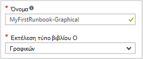<br>
6.  Κάντε κλικ στην επιλογή **Δημιουργία** για να δημιουργήσετε runbook και ανοίξτε το πρόγραμμα επεξεργασίας γραφικών.

## <a name="step-2---add-activities-to-the-runbook"></a>Βήμα 2 - Προσθήκη δραστηριοτήτων σε runbook

Το στοιχείο ελέγχου βιβλιοθήκη στην αριστερή πλευρά του προγράμματος επεξεργασίας σάς επιτρέπει να επιλέξετε δραστηριότητες για να προσθέσετε το runbook.  Θα κάνουμε για να προσθέσετε μια **Εγγραφή εξόδου** cmdlet για να εξαγάγετε κείμενο από runbook.

1.  Στο στοιχείο ελέγχου βιβλιοθήκη, κάντε κλικ στο πλαίσιο κειμένου αναζήτησης και πληκτρολογήστε **Εγγραφής εξόδου**.  Τα αποτελέσματα αναζήτησης θα εμφανίζονται κάτω από το στοιχείο. <br> 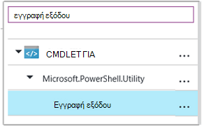
2.  Κάντε κύλιση προς τα κάτω, στο κάτω μέρος της λίστας.  Που μπορεί να είτε δεξί κλικ **Εξόδου εγγραφής** και επιλέξτε **Προσθήκη σε καμβά** ή κάντε κλικ στο έλλειψης δίπλα το cmdlet και, στη συνέχεια, επιλέξτε **Προσθήκη σε καμβά**.
3.  Κάντε κλικ στη δραστηριότητα **Εξόδου εγγραφής** στον καμβά.  Έτσι ανοίγει το blade ελέγχου ρύθμισης παραμέτρων που σας επιτρέπει να ρυθμίσετε τις παραμέτρους της δραστηριότητας.
4.  Η **ετικέτα** ως προεπιλογή το όνομα του το cmdlet, αλλά θα σας να το αλλάξετε σε κάτι πιο φιλικό. Αλλάξτε το για να *Γράψετε Γεια για να εξαγάγετε*.
5.  Κάντε κλικ στην επιλογή **παράμετροι** να παράσχετε τιμές για το cmdlet παραμέτρους.  
    Ορισμένες cmdlet του έχετε πολλά σύνολα παραμέτρων και πρέπει να επιλέξετε που θα χρησιμοποιήσετε. Σε αυτήν την περίπτωση, **Εγγραφής εξόδου** έχει μόνο μία ρύθμιση παραμέτρων, οπότε δεν χρειάζεται να επιλέξετε ένα. <br> 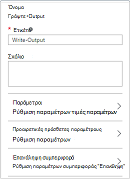
6.  Επιλέξτε την παράμετρο **InputObject** .  Αυτή είναι η παράμετρος όπου θα σας θα ορίσετε το κείμενο για να στείλετε τη ροή εξόδου.
7.  Στο αναπτυσσόμενο μενού του **αρχείου προέλευσης δεδομένων** , επιλέξτε **παράσταση PowerShell**.  Στην αναπτυσσόμενη λίστα **προέλευση δεδομένων** παρέχει διάφορες προελεύσεις που χρησιμοποιείτε για να συμπληρώσετε μια τιμή παραμέτρου.  
    Μπορείτε να χρησιμοποιήσετε το αποτέλεσμα από πηγές όπως μια άλλη δραστηριότητα, ενός περιουσιακού στοιχείου αυτοματισμού ή μια παράσταση PowerShell.  Σε αυτήν την περίπτωση, απλά θέλουμε να εξόδου στο κείμενο *Γεια*. Να χρησιμοποιήσετε μια παράσταση PowerShell και να καθορίσετε μια συμβολοσειρά.
8.  Στο πλαίσιο **έκφραση** , πληκτρολογήστε *"Γεια"* και, στη συνέχεια, κάντε κλικ στο κουμπί **OK** δύο φορές για να επιστρέψετε στον καμβά.<br> 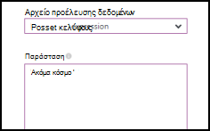
9.  Αποθήκευση runbook κάνοντας κλικ στην επιλογή **Αποθήκευση**.<br> 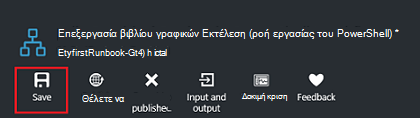

## <a name="step-3---test-the-runbook"></a>Βήμα 3 - έλεγχος runbook

Θα σας να δημοσιεύσετε runbook να την κάνετε διαθέσιμη σε παραγωγής, θέλουμε να ελέγξετε για να βεβαιωθείτε ότι λειτουργεί σωστά.  Κατά τη δοκιμή μια runbook, μπορείτε να εκτελέσετε την **πρόχειρη** έκδοση και να προβάλετε τα αποτελέσματά αλληλεπιδραστικά.

1.  Κάντε κλικ στην επιλογή **παράθυρο Δοκιμή** για να ανοίξετε το blade δοκιμής.<br> 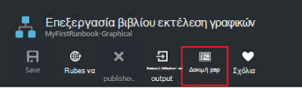
2.  Κάντε κλικ στην επιλογή **Έναρξη** για να ξεκινήσετε τον έλεγχο.  Αυτή είναι η μόνη επιλογή ενεργοποιημένες.
3.  Δημιουργείται μια [εργασία runbook](automation-runbook-execution.md) και η κατάστασή της εμφανίζεται στο παράθυρο.  
    Την κατάσταση της εργασίας θα ξεκινήσει ως *σε ουρά* που υποδεικνύει ότι περιμένει ο εργαζόμενος runbook στο cloud για να γίνουν διαθέσιμες.  Έτσι, θα μετακινείται για *Έναρξη* όταν ο εργαζόμενος ισχυρίζεται το έργο και, στη συνέχεια, *εκτελούνται* όταν runbook στην πραγματικότητα αρχίζει να λειτουργεί.  
4.  Όταν ολοκληρωθεί η εργασία runbook, εμφανίζεται το αποτέλεσμα. Σε περίπτωση μας, θα πρέπει να βλέπουμε *Γεια*.<br> 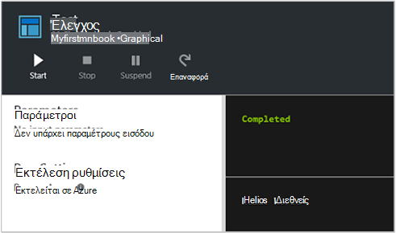
5.  Κλείστε το blade δοκιμή για να επιστρέψετε στον καμβά.

## <a name="step-4---publish-and-start-the-runbook"></a>Βήμα 4 - δημοσίευση και ξεκινήστε runbook

Runbook που δημιουργήσαμε απλώς βρίσκεται ακόμη σε λειτουργία Πρόχειρο. Πρέπει να το δημοσιεύσετε πριν θα σας μπορεί να το εκτελέσει παραγωγή.  Όταν δημοσιεύετε ένα runbook, μπορείτε να αντικαταστήσετε την υπάρχουσα έκδοση Published με την πρόχειρη έκδοση.  Σε περίπτωση μας, δεν έχουμε μια έκδοση Published ακόμη επειδή που δημιουργήσαμε απλώς runbook.

1.  Κάντε κλικ στην επιλογή **Δημοσίευση** για να δημοσιεύσετε runbook και, στη συνέχεια, **Ναι** όταν σας ζητηθεί.<br> 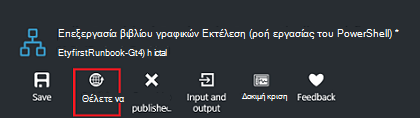
2.  Εάν κάνετε κύλιση προς τα αριστερά για να προβάλετε το blade **Runbooks** runbook, αυτό θα εμφανιστεί μια **Κατάσταση σύνταξης** **δημοσιεύτηκε**.
3.  Κάντε κύλιση προς τα δεξιά για να προβάλετε το blade για **MyFirstRunbook**.  
    Οι επιλογές στο επάνω μέρος επιτρέπουν να ξεκινήσετε runbook, προγραμματίστε την για να ξεκινήσετε κάποια στιγμή στο μέλλον ή δημιουργήστε ένα [webhook](automation-webhooks.md) , ώστε να μπορεί να ξεκινήσει μέσω μιας κλήσης HTTP.
4.  Για να ξεκινήσετε runbook επομένως, κάντε κλικ στο κουμπί **Έναρξη** και, στη συνέχεια, **Ναι** όταν σας ζητηθεί.<br> 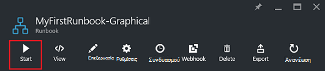
5.  Μια εργασία blade έχει ανοίξει για την εργασία runbook που θα σας μόλις δημιουργήσατε.  Θα σας να κλείσετε αυτήν blade, αλλά σε αυτήν την περίπτωση θα σας θα αφήστε το ανοιχτό, ώστε να σας να παρακολουθήσετε την πρόοδο του έργου.
6.  Την κατάσταση της εργασίας εμφανίζεται στη **Σύνοψη εργασίας** και ταιριάζει με τις καταστάσεις που θα σας είδατε όταν κάναμε δοκιμές runbook.<br> 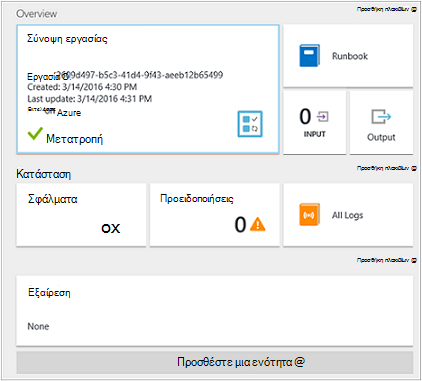
7.  Όταν η κατάσταση runbook εμφανίζει *ολοκληρώθηκε*, κάντε κλικ στην επιλογή **Έξοδος**. Ανοίγει το blade **εξόδου** και μπορούμε να δούμε μας *Γεια* στο παράθυρο.<br> 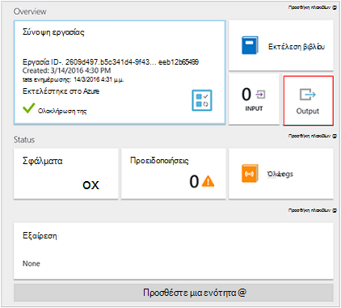  
8.  Κλείστε το blade εξόδου.
9.  Κάντε κλικ στην επιλογή **Όλα τα αρχεία καταγραφής** για να ανοίξετε το blade ροές για το έργο runbook.  Θα πρέπει να βλέπουμε μόνο *Γεια* στη ροή εξόδου, αλλά αυτό μπορεί να εμφανίσει άλλων ροών για ένα έργο runbook όπως λεπτομερές και σφάλμα εάν runbook γράφει σε αυτά.<br> 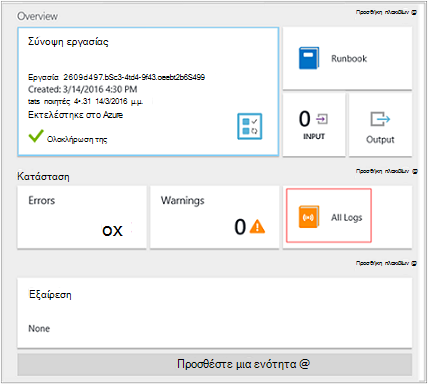
10. Κλείστε το blade όλα τα αρχεία καταγραφής και το blade εργασία για να επιστρέψετε το blade MyFirstRunbook.
11. Κάντε κλικ στην επιλογή **εργασίες** για να ανοίξει το blade εργασίες για αυτό runbook.  Παραθέτει όλες τις εργασίες που δημιουργήθηκαν από αυτό runbook. Θα πρέπει να δούμε μόνο μία εργασία που αναφέρονται εφόσον μας εκτελέσατε μόνο αυτό το έργο μόνο μία φορά.<br> 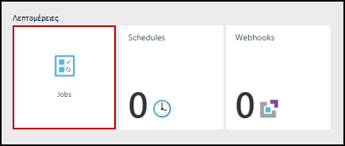
12. Μπορείτε να κάνετε κλικ σε αυτό το έργο για να ανοίξετε το ίδιο παράθυρο εργασίας που θα σας προβληθεί όταν θα σας αποτελέσματα runbook.  Αυτό σας επιτρέπει να επιστρέψετε στο χρόνο και να προβάλετε τις λεπτομέρειες του οποιαδήποτε εργασία που δημιουργήθηκε για μια συγκεκριμένη runbook.

## <a name="step-5---create-variable-assets"></a>Βήμα 5 - Δημιουργία μεταβλητής περιουσιακών στοιχείων

Χρησιμοποιούμε έχετε δοκιμή και να δημοσιευτεί μας runbook, αλλά μέχρι στιγμής αυτό δεν κάνετε τίποτα χρήσιμες. Θέλουμε να διαχειρίζεστε Azure πόρους.  Θα σας ρυθμίσετε τις παραμέτρους του runbook για τον έλεγχο ταυτότητας, δημιουργούμε μια μεταβλητή να διατηρεί το Αναγνωριστικό συνδρομής και να αναφέρετε αφού μας εγκατάστασης της δραστηριότητας για τον έλεγχο ταυτότητας στο βήμα 6 παρακάτω.  Περιλαμβάνει την αναφορά στο περιβάλλον τη συνδρομή σας επιτρέπει να εύκολη συνεργασία μεταξύ πολλών συνδρομών.  Πριν να συνεχίσετε, αντιγράψτε το Αναγνωριστικό συνδρομή από την επιλογή "συνδρομές" από το παράθυρο περιήγησης.  

1. Στο το blade αυτοματισμού λογαριασμοί, κάντε κλικ στο πλακίδιο **περιουσιακών στοιχείων** και ανοίγει το blade **περιουσιακών στοιχείων** .
2. Στο το blade περιουσιακών στοιχείων, κάντε κλικ στο πλακίδιο **μεταβλητές** .
3. Στην το blade μεταβλητές, κάντε κλικ στην επιλογή **Προσθήκη μια μεταβλητή**.<br>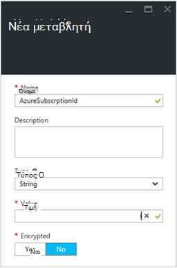
4. Στο νέο μεταβλητής blade, στο πλαίσιο **όνομα** , πληκτρολογήστε **AzureSubscriptionId** και στο πλαίσιο **τιμή** , πληκτρολογήστε το αναγνωριστικό συνδρομής.  Διατήρηση *συμβολοσειρά* για τον **τύπο** και την προεπιλεγμένη τιμή για την **κρυπτογράφηση**.  
5. Κάντε κλικ στην επιλογή **Δημιουργία** για να δημιουργήσετε τη μεταβλητή.  


## <a name="step-6---add-authentication-to-manage-azure-resources"></a>Βήμα 6 - Προσθήκη ελέγχου ταυτότητας για τη Διαχείριση Azure πόρων

Τώρα που έχουμε μια μεταβλητή που περιέχει το Αναγνωριστικό συνδρομής, θα σας να ρυθμίσετε τις παραμέτρους του runbook για τον έλεγχο ταυτότητας με τα διαπιστευτήρια εκτέλεση ως που αναφέρονται στο τις [προϋποθέσεις](#prerequisites).  Κάνουμε που προσθέτοντας το Azure εκτέλεση ως σύνδεση **περιουσιακών στοιχείων** και **Προσθήκη AzureRMAccount** cmdlet στον καμβά.  

1.  Ανοίξτε το πρόγραμμα επεξεργασίας γραφικών κάνοντας κλικ στο κουμπί **Επεξεργασία** του blade MyFirstRunbook.<br> 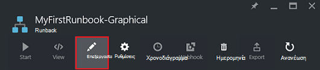
2.  Θα σας δεν χρειάζεστε πλέον **Γράψετε Γεια για να εξαγάγετε** , επομένως δεξί κλικ σε αυτήν και επιλέξτε **Διαγραφή**.
3.  Στο στοιχείο ελέγχου βιβλιοθήκη, αναπτύξτε **συνδέσεις** και προσθέστε **AzureRunAsConnection** τον καμβά επιλέγοντας **Προσθήκη για να καμβά**.
4.  Στον καμβά, επιλέξτε **AzureRunAsConnection** και στο παράθυρο Ρύθμιση παραμέτρων ελέγχου, πληκτρολογήστε **Να εκτελέσετε ως σύνδεσης** στο πλαίσιο κειμένου **ετικέτας** .  Αυτή είναι η σύνδεση 
5.  Στο στοιχείο ελέγχου βιβλιοθήκη, πληκτρολογήστε **Πρόσθετο AzureRmAccount** στο πλαίσιο κειμένου αναζήτησης.
6.  Προσθήκη **Προσθήκη AzureRmAccount** στον καμβά.<br> 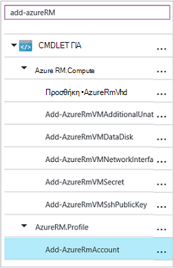
7.  Καταδείξτε **Γρήγορα εκτέλεση ως σύνδεση** μέχρι να εμφανιστεί ένας κύκλος στο κάτω μέρος του σχήματος. Κάντε κλικ στον κύκλο και σύρετε το βέλος για **Προσθήκη AzureRmAccount**.  Το βέλος που μόλις δημιουργήσατε είναι μια *σύνδεση*.  Runbook θα ξεκινήσει με **Γρήγορα εκτέλεση ως σύνδεση** και, στη συνέχεια, εκτελέστε **Προσθήκη AzureRmAccount**.<br> 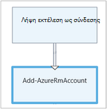
8.  Στον καμβά, επιλέξτε **Προσθήκη AzureRmAccount** και στη ρύθμιση παραμέτρων ελέγχου παράθυρο τύπος **σύνδεσης για να Azure** στο πλαίσιο κειμένου **ετικέτας** .
9.  Κάντε κλικ στην επιλογή **παράμετροι** και η ρύθμιση παραμέτρων δραστηριότητας blade εμφανίζεται. 
10.  **Προσθήκη AzureRmAccount** έχει πολλά σύνολα παράμετρο, ώστε να πρέπει να επιλέξετε ένα πριν να παρέχουμε τιμές παραμέτρων.  Κάντε κλικ στην επιλογή **Ρύθμιση παραμέτρων** και, στη συνέχεια, επιλέξτε το σύνολο παραμέτρων **ServicePrincipalCertificate** . 
11.  Αφού επιλέξετε τη ρύθμιση παραμέτρων, οι παράμετροι που εμφανίζονται στην blade τη ρύθμιση παραμέτρων παραμέτρου δραστηριότητας.  Κάντε κλικ στην επιλογή **αναγνωριστικά ΕΦΑΡΜΟΓΉΣ**.<br> 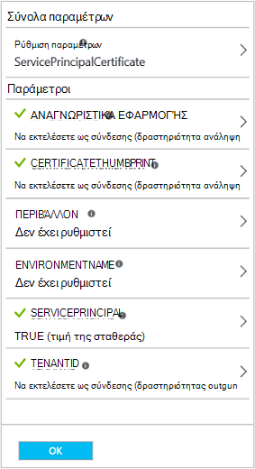
12.  Στο blade την τιμή της παραμέτρου, επιλέξτε " **Έξοδος" δραστηριότητας** για την **προέλευση δεδομένων** και επιλέξτε **Να εκτελέσετε ως σύνδεση** από τη λίστα, στο πλαίσιο κειμένου πληκτρολογήστε **διαδρομή πεδίο** **αναγνωριστικά εφαρμογής**, και, στη συνέχεια, κάντε κλικ στο κουμπί **OK**.  Θα σας που καθορίζει το όνομα της ιδιότητας για τη διαδρομή του πεδίου, επειδή η δραστηριότητα εξόδους ενός αντικειμένου με πολλές ιδιότητες.
13.  Κάντε κλικ στην επιλογή **CERTIFICATETHUMBPRINT**και στο blade την τιμή της παραμέτρου, επιλέξτε " **Έξοδος" δραστηριότητας** για την **προέλευση δεδομένων**.  Επιλέξτε **Λήψη εκτέλεση ως σύνδεση** από τη λίστα, στο πλαίσιο κειμένου πληκτρολογήστε **διαδρομή πεδίο** **CertificateThumbprint**, και, στη συνέχεια, κάντε κλικ στο κουμπί **OK**. 
14.  Κάντε κλικ στην επιλογή **SERVICEPRINCIPAL**, και στην την τιμή της παραμέτρου blade, επιλέξτε **ConstantValue** για την **προέλευση δεδομένων**, κάντε κλικ στην επιλογή **True**και, στη συνέχεια, κάντε κλικ στο κουμπί **OK**.
15.  Κάντε κλικ στην επιλογή **TENANTID**και στο blade την τιμή της παραμέτρου, επιλέξτε " **Έξοδος" δραστηριότητας** για την **προέλευση δεδομένων**.  Επιλέξτε **Λήψη εκτέλεση ως σύνδεση** από τη λίστα, στο πλαίσιο κειμένου πληκτρολογήστε **διαδρομή πεδίο** **TenantId**, και, στη συνέχεια, κάντε κλικ στο κουμπί **OK** δύο φορές.  
16.  Στο στοιχείο ελέγχου βιβλιοθήκη, πληκτρολογήστε **Set-AzureRmContext** στο πλαίσιο κειμένου αναζήτησης.
17.  Προσθήκη **Συνόλου AzureRmContext** στον καμβά.
18.  Στον καμβά, επιλέξτε **Ορισμός AzureRmContext** και στη ρύθμιση παραμέτρων έλεγχο παράθυρο τύπο **Καθορίστε αναγνωριστικό συνδρομής** στο πλαίσιο κειμένου **ετικέτας** .
19.  Κάντε κλικ στην επιλογή **παράμετροι** και η ρύθμιση παραμέτρων δραστηριότητας blade εμφανίζεται. 
20. **Ορισμός AzureRmContext** έχει πολλά σύνολα παραμέτρων, ώστε να πρέπει να επιλέξετε ένα πριν να παρέχουμε τιμές παραμέτρων.  Κάντε κλικ στην επιλογή **Ρύθμιση παραμέτρων** και, στη συνέχεια, επιλέξτε το σύνολο παραμέτρων **SubscriptionId** .  
21.  Αφού επιλέξετε τη ρύθμιση παραμέτρων, οι παράμετροι που εμφανίζονται στην blade τη ρύθμιση παραμέτρων παραμέτρου δραστηριότητας.  Κάντε κλικ στην επιλογή **SubscriptionID**
22.  Στο blade την τιμή της παραμέτρου, επιλέξτε **Μεταβλητής περιουσιακού στοιχείου** για την **προέλευση δεδομένων** και επιλέξτε **AzureSubscriptionId** από τη λίστα και, στη συνέχεια, κάντε κλικ στο κουμπί **OK** δύο φορές.   
23.  Καταδείξτε **Login to Azure** μέχρι να εμφανιστεί ένας κύκλος στο κάτω μέρος του σχήματος. Κάντε κλικ στον κύκλο και σύρετε το βέλος για να **Καθορίσετε αναγνωριστικό συνδρομής**.


Runbook σας θα πρέπει να είναι σε αυτό το σημείο όπως το εξής: <br>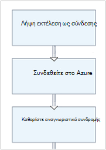

## <a name="step-7---add-activity-to-start-a-virtual-machine"></a>Βήμα 7 - Προσθήκη δραστηριότητας για να ξεκινήσετε μια εικονική μηχανή

Τώρα θα προσθέσουμε μια δραστηριότητα **AzureRmVM έναρξης** για να ξεκινήσετε μια εικονική μηχανή.  Μπορείτε να επιλέξετε οποιοδήποτε εικονική μηχανή στο Azure τη συνδρομή σας και τώρα θα είμαστε hardcoding αυτό το όνομα σε το cmdlet.

1. Στο στοιχείο ελέγχου βιβλιοθήκη, πληκτρολογήστε **AzureRm έναρξης** στο πλαίσιο κειμένου αναζήτησης.
2. Προσθήκη **Έναρξη-AzureRmVM** στον καμβά και, στη συνέχεια, κάντε κλικ στην επιλογή και σύρετέ την κάτω από το **Καθορίσετε αναγνωριστικό συνδρομής**.
3. Καταδείξτε **Καθορίστε αναγνωριστικό συνδρομής** μέχρι να εμφανιστεί ένας κύκλος στο κάτω μέρος του σχήματος.  Κάντε κλικ στον κύκλο και σύρετε το βέλος για να **AzureRmVM Έναρξη**. 
4.  Επιλέξτε **Έναρξη-AzureRmVM**.  Κάντε κλικ στην επιλογή **παράμετροι** και, στη συνέχεια, **Ρύθμιση παραμέτρων** για να προβάλετε τα σύνολα για **Έναρξη-AzureRmVM**.  Επιλέξτε το σύνολο παραμέτρων **ResourceGroupNameParameterSetName** . Σημείωση ότι **ResourceGroupName** και **όνομα** έχουν θαυμαστικό δίπλα τους.  Αυτό υποδεικνύει ότι είναι απαραίτητες παραμέτρους.  Επίσης, σημειώστε και τα δύο αναμένετε τιμές συμβολοσειρών.
5.  Επιλέξτε το **όνομα**.  Επιλέξτε **παράσταση του PowerShell** για την **προέλευση δεδομένων** και τύπος στο όνομα του υπολογιστή εικονικές περικλείονται σε διπλά εισαγωγικά που θα σας θα ξεκινήσει με αυτό runbook.  Κάντε κλικ στο **κουμπί OK**.<br>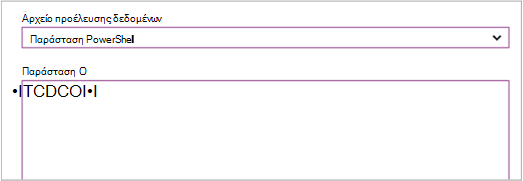
6.  Επιλέξτε **ResourceGroupName**. Χρήση του **PowerShell παράσταση** για το **αρχείο προέλευσης δεδομένων** και πληκτρολογήστε το όνομα της ομάδας πόρων περικλείονται σε διπλά εισαγωγικά.  Κάντε κλικ στο **κουμπί OK**.<br> 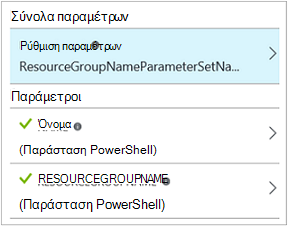
8.  Κάντε κλικ στην επιλογή παράθυρο δοκιμής έτσι ώστε να μπορούμε να ελέγξουμε runbook.
9.  Κάντε κλικ στην επιλογή **Έναρξη** για να ξεκινήσετε τον έλεγχο.  Μόλις ολοκληρωθεί, ελέγξτε ότι η εικονική μηχανή ξεκίνησε.

Runbook σας θα πρέπει να είναι σε αυτό το σημείο όπως το εξής: <br>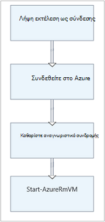

## <a name="step-8---add-additional-input-parameters-to-the-runbook"></a>Βήμα 8 - Προσθήκη επιπλέον παραμέτρους εισόδου runbook

Μας runbook ξεκινά αυτήν τη στιγμή η εικονική μηχανή στην ομάδα πόρων που θα σας καθορίσει στο το cmdlet **Έναρξη-AzureRmVM** , αλλά θα είναι πιο χρήσιμο εάν θα σας θα μπορούσε να το καθορίσετε και τα δύο κατά την εκκίνηση του runbook μας runbook.  Τώρα θα προσθέσουμε παραμέτρους εισόδου σε runbook για την παροχή αυτήν τη λειτουργικότητα.

1. Ανοίξτε το πρόγραμμα επεξεργασίας γραφικών κάνοντας κλικ στην επιλογή **Επεξεργασία** στο παράθυρο **MyFirstRunbook** .
2. Κάντε κλικ στο κουμπί **εισόδου και εξόδου** και, στη συνέχεια, **προσθέστε εισαγωγής** για να ανοίξετε το παράθυρο Runbook παράμετρο εισόδου.<br> 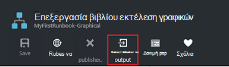
3. Καθορίστε *VMName* για το **όνομα**.  Διατήρηση *συμβολοσειρά* για τον **τύπο**, αλλά αλλάξετε **υποχρεωτικό** σε *Ναι*.  Κάντε κλικ στο **κουμπί OK**.
4. Δημιουργήστε μια δεύτερη παράμετρο εισόδου υποχρεωτικό που ονομάζεται *ResourceGroupName* και, στη συνέχεια, κάντε κλικ στο **κουμπί OK** για να κλείσετε το παράθυρο **εισόδου και εξόδου** .<br> 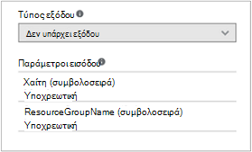
5. Επιλέξτε τη δραστηριότητα **AzureRmVM Έναρξη** και, στη συνέχεια, κάντε κλικ στην επιλογή **παράμετροι**.
6. Αλλαγή της **προέλευσης δεδομένων** για **το όνομα** σε **Runbook εισαγωγής** και, στη συνέχεια, επιλέξτε **VMName**.<br>
7. Επαναφέρετε την **προέλευση δεδομένων** για **ResourceGroupName** **Runbook εισαγωγής** και, στη συνέχεια, επιλέξτε **ResourceGroupName**.<br> 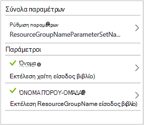
8. Αποθήκευση runbook και ανοίξτε το παράθυρο έλεγχος.  Σημειώστε ότι τώρα μπορείτε να παράσχετε τιμές για τις δύο μεταβλητές εισαγωγής που θα χρησιμοποιηθεί κατά τη δοκιμή.
9. Κλείσιμο του παραθύρου δοκιμής.
10. Κάντε κλικ στην επιλογή **Δημοσίευση** για να δημοσιεύσετε τη νέα έκδοση του runbook.
11. Διακόψτε την εικονική μηχανή που ξεκινήσατε στο προηγούμενο βήμα.
12. Κάντε κλικ στην επιλογή **Έναρξη** για να ξεκινήσετε runbook.  Πληκτρολογήστε στο **VMName** και **ResourceGroupName** για την εικονική μηχανή που πρόκειται να ξεκινήσετε.<br> 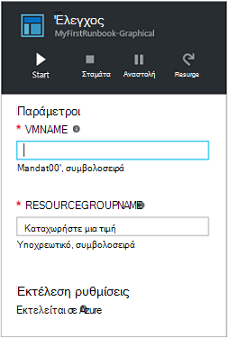
13. Όταν ολοκληρωθεί η runbook, ελέγξτε ότι η εικονική μηχανή ξεκίνησε.

## <a name="step-9---create-a-conditional-link"></a>Βήμα 9 - δημιουργία σύνδεσης υπό όρους

Τώρα θα σας θα τροποποιήσετε runbook, έτσι ώστε μόνο θα επιχειρήσει να ξεκινήσετε την εικονική μηχανή, εάν δεν έχει ήδη ξεκινήσει.  Θα κάνουμε αυτό, προσθέτοντας ένα cmdlet **Get-AzureRmVM** runbook που θα σας βοηθήσουν της κατάστασης παρουσίας επιπέδου η εικονική μηχανή. Στη συνέχεια, θα προσθέσουμε μια λειτουργική μονάδα κώδικα PowerShell ροής εργασίας που ονομάζεται **Λήψη κατάστασης** με ένα τμήμα κώδικα του PowerShell για να καθορίσετε εάν η κατάσταση εικονική μηχανή είναι εκτελείται ή έχει διακοπεί.  Υπό όρους σύνδεσης από τη λειτουργική μονάδα **Λήψη κατάστασης** θα εκτελεστεί **Έναρξη AzureRmVM** μόνο εάν έχει διακοπεί η τρέχουσα κατάσταση λειτουργίας.  Τέλος, θα σας θα εξόδου ένα μήνυμα για να σας ενημερώσει εάν η Εικονική ξεκίνησε με επιτυχία ή δεν χρησιμοποιούν το cmdlet του PowerShell εγγραφής-εξόδου.

1. Άνοιγμα **MyFirstRunbook** στο πρόγραμμα επεξεργασίας γραφικών.
2. Καταργήστε τη σύνδεση μεταξύ **Καθορίστε αναγνωριστικό συνδρομής** και **Έναρξη-AzureRmVM** , κάνοντας κλικ σε αυτό και, στη συνέχεια, πατώντας το πλήκτρο *Delete* .
3. Στο στοιχείο ελέγχου βιβλιοθήκη, πληκτρολογήστε **Get-AzureRm** στο πλαίσιο κειμένου αναζήτησης.
4. Προσθήκη **Get-AzureRmVM** στον καμβά.
5. Επιλέξτε **Get-AzureRmVM** και, στη συνέχεια, **Ρύθμιση παραμέτρων** για να προβάλετε τα σύνολα για **Λήψη AzureRmVM**.  Επιλέξτε το σύνολο παραμέτρων **GetVirtualMachineInResourceGroupNameParamSet** .  Σημείωση ότι **ResourceGroupName** και **όνομα** έχουν θαυμαστικό δίπλα τους.  Αυτό υποδεικνύει ότι είναι απαραίτητες παραμέτρους.  Επίσης, σημειώστε και τα δύο αναμένετε τιμές συμβολοσειρών.
6. Στην περιοχή **προέλευσης δεδομένων** για **το όνομα**, επιλέξτε **Runbook εισαγωγής** και, στη συνέχεια, επιλέξτε **VMName**.  Κάντε κλικ στο **κουμπί OK**.
7. Στην περιοχή **προέλευσης δεδομένων** για **ResourceGroupName**, επιλέξτε **Runbook εισαγωγής** και, στη συνέχεια, επιλέξτε **ResourceGroupName**.  Κάντε κλικ στο **κουμπί OK**.
8. Στην περιοχή **προέλευσης δεδομένων** για την **κατάσταση**, επιλέξτε **τιμή της σταθεράς** και, στη συνέχεια, κάντε κλικ στην **τιμή True**.  Κάντε κλικ στο **κουμπί OK**.  
9. Δημιουργήσετε μια σύνδεση από το **Καθορίσετε αναγνωριστικό συνδρομής** **Get-AzureRmVM**.
10. Στο στοιχείο ελέγχου βιβλιοθήκη, αναπτύξτε το στοιχείο **Ελέγχου Runbook** και προσθήκη **κώδικα** στον καμβά.  
11. Δημιουργήστε μια σύνδεση από **Get-AzureRmVM** στον **κώδικα**.  
12. Κάντε κλικ στην επιλογή **κώδικα** και στο παράθυρο Ρύθμιση παραμέτρων, αλλάξτε ετικέτα για να **Λάβετε την κατάσταση**.
13. Η παράμετρος επιλογής **κώδικα** και το **Πρόγραμμα επεξεργασίας κώδικα** blade εμφανίζεται.  
14. Στο πρόγραμμα επεξεργασίας κώδικα, επικολλήστε το παρακάτω τμήμα κώδικα του κώδικα:

     ```
     $StatusesJson = $ActivityOutput['Get-AzureRmVM'].StatusesText 
     $Statuses = ConvertFrom-Json $StatusesJson 
     $StatusOut ="" 
     foreach ($Status in $Statuses){ 
     if($Status.Code -eq "Powerstate/running"){$StatusOut = "running"} 
     elseif ($Status.Code -eq "Powerstate/deallocated") {$StatusOut = "stopped"} 
     } 
     $StatusOut 
     ```

15. Δημιουργήστε μια σύνδεση από **Λήψη κατάστασης** για **Έναρξη-AzureRmVM**.<br> 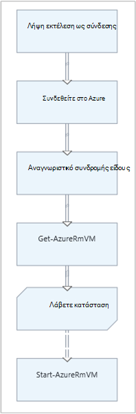  
16. Επιλέξτε τη σύνδεση και στο παράθυρο Ρύθμιση παραμέτρων, αλλάξτε **εφαρμογή συνθήκης** σε **Ναι**.   Σημείωση ενεργοποιεί τη σύνδεση με μια διακεκομμένη γραμμή που υποδεικνύει ότι η δραστηριότητα προορισμού θα εφαρμοστούν μόνο εάν η συνθήκη είναι true.  
17. Η **παράσταση συνθήκης**, πληκτρολογήστε *$ActivityOutput [' κατάσταση λήψη '] - eq "Διακοπή"*.  **Έναρξη AzureRmVM** τώρα θα εκτελεστεί μόνο εάν έχει διακοπεί η εικονική μηχανή.
18. Στο στοιχείο ελέγχου βιβλιοθήκη, ανάπτυξη **cmdlet** και, στη συνέχεια, **Microsoft.PowerShell.Utility**.
19. Προσθήκη **Εγγραφής εξόδου** στον καμβά δύο φορές.<br> 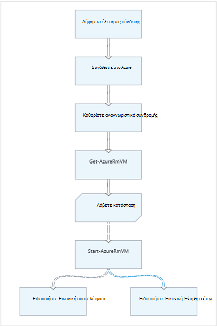
20. Το πρώτο στοιχείο ελέγχου **Εγγραφής εξόδου** , κάντε κλικ στην επιλογή **παράμετροι** και αλλάξτε την τιμή **ετικέτας** για να *Ειδοποιήσετε Εικονική αποτελέσματα*.
21. Για **InputObject**, αλλαγή **προέλευσης δεδομένων** σε **παράσταση PowerShell** και πληκτρολογήστε την παράσταση *"αποτελέσματα με επιτυχία $VMName."*.
22. Το δεύτερο στοιχείο ελέγχου **Εγγραφής εξόδου** , κάντε κλικ στην επιλογή **παράμετροι** και αλλάξτε την τιμή **ετικέτας** για να *Ειδοποιήσετε Εικονική Έναρξη απέτυχε*
23. Για **InputObject**, αλλαγή **προέλευσης δεδομένων** σε **παράσταση PowerShell** και πληκτρολογήστε την παράσταση *"δεν ήταν δυνατό να ξεκινούν $VMName."*.
24. Δημιουργήστε μια σύνδεση από **Έναρξη-AzureRmVM** για να **Ειδοποιήσετε Εικονική αποτελέσματα** και να **Ειδοποιήσετε Εικονική Έναρξη απέτυχε**.
25. Επιλέξτε τη σύνδεση για να **Ειδοποιήσετε αποτελέσματα Εικονική** και αλλάξτε **συνθήκη εφαρμογή** στην **τιμή True**.
26. Η **παράσταση συνθήκης**, πληκτρολογήστε *$ActivityOutput ['Έναρξη-AzureRmVM']. IsSuccessStatusCode - eq $true*.  Αυτό το στοιχείο ελέγχου εξόδου εγγραφή τώρα θα εκτελεστεί μόνο αν η εικονική μηχανή έχει ξεκινήσει με επιτυχία.
27. Επιλέξτε τη σύνδεση για να **Ειδοποιήσετε Εικονική Έναρξη απέτυχε** και αλλάξτε **συνθήκη εφαρμογή** στην **τιμή True**.
28. Η **παράσταση συνθήκης**, πληκτρολογήστε *$ActivityOutput ['Έναρξη-AzureRmVM']. IsSuccessStatusCode - $true*.  Αυτό το στοιχείο ελέγχου εξόδου εγγραφή τώρα θα εκτελεστεί μόνο αν η εικονική μηχανή δεν έχει ξεκινήσει με επιτυχία.
29. Αποθήκευση runbook και ανοίξτε το παράθυρο έλεγχος.
30. Ξεκινήστε το runbook με την εικονική μηχανή διακοπεί και θα πρέπει να ξεκινά.

## <a name="next-steps"></a>Επόμενα βήματα

-   Για να μάθετε περισσότερα σχετικά με τη σύνταξη γραφικών, ανατρέξτε στο θέμα [Graphical σύνταξη από κοινού με αυτοματισμού Azure](automation-graphical-authoring-intro.md)
-   Για να ξεκινήσετε με PowerShell runbooks, ανατρέξτε στο θέμα [μου πρώτη runbook PowerShell](automation-first-runbook-textual-powershell.md)
-   Για να ξεκινήσετε με το PowerShell runbooks ροής εργασίας, ανατρέξτε στο θέμα [μου πρώτη runbook PowerShell ροής εργασίας](automation-first-runbook-textual.md)
