<properties
    pageTitle="Μου πρώτη runbook PowerShell στο Azure Automation | Microsoft Azure"
    description="Πρόγραμμα εκμάθησης που σας καθοδηγεί σε τη δημιουργία, δοκιμές και της δημοσίευσης από ένα απλό runbook PowerShell."
    services="automation"
    documentationCenter=""
    authors="mgoedtel"
    manager="jwhit"
    editor=""
    keywords="Azure powershell, πρόγραμμα εκμάθησης δέσμης ενεργειών του powershell, powershell αυτοματισμού"/>
<tags
    ms.service="automation"
    ms.workload="tbd"
    ms.tgt_pltfrm="na"
    ms.devlang="na"
    ms.topic="get-started-article"
    ms.date="07/19/2016"
    ms.author="magoedte;sngun"/>

# <a name="my-first-powershell-runbook"></a>Το πρώτο runbook PowerShell

> [AZURE.SELECTOR] - [Γραφική](automation-first-runbook-graphical.md) - [PowerShell](automation-first-runbook-textual-PowerShell.md) - [PowerShell ροής εργασίας](automation-first-runbook-textual.md)  

Αυτό το πρόγραμμα εκμάθησης σάς καθοδηγεί μέσω της δημιουργίας ενός [PowerShell runbook](automation-runbook-types.md#powershell-runbooks) στο Azure αυτοματισμού. Ας ξεκινήσουμε με μια απλή runbook που θα ελέγξετε και δημοσίευση ενώ θα σας εξηγούν τον τρόπο για να παρακολουθείτε την κατάσταση της εργασίας runbook. Στη συνέχεια, θα σας θα τροποποιήσετε runbook για τη Διαχείριση στην πραγματικότητα Azure πόρων, σε αυτήν την περίπτωση ξεκινώντας μια εικονική μηχανή Azure. Θα, στη συνέχεια, κάνουμε runbook πιο ισχυρό, προσθέτοντας runbook παράμετροι.

## <a name="prerequisites"></a>Προαπαιτούμενα στοιχεία

Για να ολοκληρώσετε αυτό το πρόγραμμα εκμάθησης, θα χρειαστείτε τα εξής.

-   Azure συνδρομή. Εάν δεν έχετε ακόμη, μπορείτε να [ενεργοποιήσετε των πλεονεκτημάτων της συνδρομής σας MSDN](https://azure.microsoft.com/pricing/member-offers/msdn-benefits-details/) ή <a href="/pricing/free-account/" target="_blank"> [εγγραφείτε για έναν δωρεάν λογαριασμό](https://azure.microsoft.com/free/).
-   [Αυτοματοποίηση λογαριασμού](automation-security-overview.md) για τη διατήρηση runbook και τον έλεγχο ταυτότητας με Azure πόρους.  Αυτός ο λογαριασμός πρέπει να έχετε δικαιώματα για να ξεκινήσετε και να διακόψετε την εικονική μηχανή.
-   Azure εικονική μηχανή. Θα σταματήσει και ξεκινήστε αυτόν τον υπολογιστή, ώστε να μην παραγωγής.

## <a name="step-1---create-new-runbook"></a>Βήμα 1 - Δημιουργία νέας runbook

Ας ξεκινήσουμε με τη δημιουργία μιας απλής runbook που εξάγει το κείμενο *Γεια*.

1.  Στην πύλη του Azure, ανοίξτε το λογαριασμό σας αυτοματισμού.  
    Η σελίδα του λογαριασμού αυτοματισμού παρέχει μια γρήγορη προβολή των πόρων σε αυτόν το λογαριασμό. Θα πρέπει να έχετε ήδη ορισμένα στοιχεία. Οι περισσότερες από αυτές είναι οι λειτουργικές μονάδες που συμπεριλαμβάνονται αυτόματα στο νέο λογαριασμό του αυτοματισμού. Μπορείτε, επίσης, θα πρέπει να έχετε παγίου διαπιστευτηρίων που αναφέρεται στην τις [προϋποθέσεις](#prerequisites).
2.  Κάντε κλικ στο πλακίδιο **Runbooks** για να ανοίξετε τη λίστα των runbooks.  
      
3.  Δημιουργήστε μια νέα runbook, κάνοντας κλικ στο κουμπί **Προσθήκη ενός runbook** και, στη συνέχεια, **Δημιουργία μιας νέας runbook**.
4.  Δώστε runbook το όνομα *MyFirstRunbook PowerShell*.
5.  Σε αυτήν την περίπτωση, θα κάνουμε για να δημιουργήσετε ένα [PowerShell runbook](automation-runbook-types.md#powershell-runbooks) επομένως επιλέξτε **Powershell** για **τον τύπο Runbook**.  
    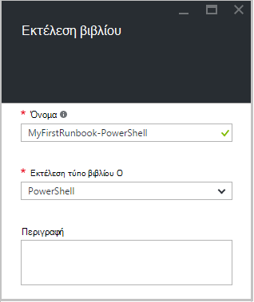  
6.  Κάντε κλικ στην επιλογή **Δημιουργία** για να δημιουργήσετε runbook και ανοίξτε το πρόγραμμα επεξεργασίας κειμένου.

## <a name="step-2---add-code-to-the-runbook"></a>Βήμα 2 - Προσθήκη κώδικα runbook

Μπορείτε να κάνετε είτε κωδικός τύπου απευθείας σε μια runbook ή μπορείτε να επιλέξετε cmdlet, runbooks και περιουσιακών στοιχείων από το στοιχείο ελέγχου βιβλιοθήκη και να προστεθούν runbook με τις σχετικές παραμέτρους. Για αυτόν τον οδηγό, θα σας θα πληκτρολογήσετε απευθείας στο runbook.

1.  Μας runbook είναι κενή, τύπος *εγγραφής εξόδου "Χαίρετε."*.  
    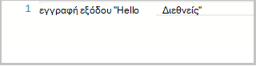  
2.  Αποθήκευση runbook κάνοντας κλικ στην επιλογή **Αποθήκευση**.  
    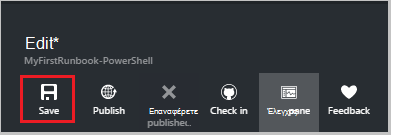  

## <a name="step-3---test-the-runbook"></a>Βήμα 3 - έλεγχος runbook

Θα σας να δημοσιεύσετε runbook να την κάνετε διαθέσιμη σε παραγωγής, θέλουμε να ελέγξετε για να βεβαιωθείτε ότι λειτουργεί σωστά. Κατά τη δοκιμή μια runbook, μπορείτε να εκτελέσετε την **πρόχειρη** έκδοση και να προβάλετε τα αποτελέσματά αλληλεπιδραστικά.

1.  Κάντε κλικ στην επιλογή **παράθυρο έλεγχος** για να ανοίξετε το παράθυρο έλεγχος.  
    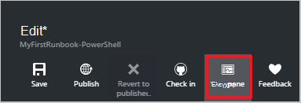  
2.  Κάντε κλικ στην επιλογή **Έναρξη** για να ξεκινήσετε τον έλεγχο. Αυτή είναι η μόνη επιλογή ενεργοποιημένες.
3.  Δημιουργείται μια [εργασία runbook](automation-runbook-execution.md) και εμφανίζεται η κατάστασή της.  
    Την κατάσταση της εργασίας θα ξεκινήσει ως *σε ουρά* που υποδεικνύει ότι περιμένει ο εργαζόμενος runbook στο cloud αναμένεται διαθέσιμη. Έτσι, θα μετακινείται για *Έναρξη* όταν ο εργαζόμενος ισχυρίζεται το έργο και, στη συνέχεια, *εκτελούνται* όταν runbook στην πραγματικότητα αρχίζει να λειτουργεί.  
4.  Όταν ολοκληρωθεί η εργασία runbook, εμφανίζεται το αποτέλεσμα. Σε περίπτωση μας, θα πρέπει να βλέπουμε *Γεια*  
    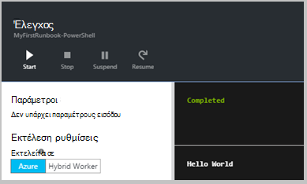  
5.  Κλείσιμο του παραθύρου δοκιμή για να επιστρέψετε στον καμβά.

## <a name="step-4---publish-and-start-the-runbook"></a>Βήμα 4 - δημοσίευση και ξεκινήστε runbook

Runbook που δημιουργήσαμε απλώς βρίσκεται ακόμη σε λειτουργία Πρόχειρο. Πρέπει να το δημοσιεύσετε πριν θα σας μπορεί να το εκτελέσει παραγωγή. Όταν δημοσιεύετε ένα runbook, μπορείτε να αντικαταστήσετε την υπάρχουσα έκδοση Published με την πρόχειρη έκδοση. Σε περίπτωση μας, δεν έχουμε μια έκδοση Published ακόμη επειδή που δημιουργήσαμε απλώς runbook.

1.  Κάντε κλικ στην επιλογή **Δημοσίευση** για να δημοσιεύσετε runbook και, στη συνέχεια, **Ναι** όταν σας ζητηθεί.  
    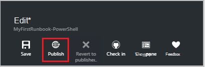  
2.  Εάν κάνετε κύλιση προς τα αριστερά για να προβάλετε runbook στο παράθυρο **Runbooks** τώρα, θα εμφανίζεται μια **Κατάσταση σύνταξης** **δημοσιεύτηκε**.
3.  Κάντε κύλιση προς τα δεξιά για να δείτε το παράθυρο για **MyFirstRunbook PowerShell**.  
    Οι επιλογές στο επάνω μέρος μπορούμε να ξεκινούν runbook, προβολή runbook, προγραμματίστε την για να ξεκινήσετε κάποια στιγμή στο μέλλον, ή δημιουργήστε ένα [webhook](automation-webhooks.md) , ώστε να μπορεί να ξεκινήσει μέσω κλήσης HTTP.
4.  Για να ξεκινήσετε runbook επομένως, κάντε κλικ στο κουμπί **Έναρξη** και, στη συνέχεια, κάντε κλικ στο κουμπί **Ok** όταν ανοίξει το blade Runbook Έναρξη.  
    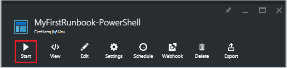  
5.  Ανοίγει ένα παράθυρο εργασίας για την εργασία runbook που δημιουργήσαμε μόνο. Θα σας να κλείσετε το παράθυρο, αλλά σε αυτήν την περίπτωση θα σας θα αφήστε το ανοιχτό, ώστε να σας να παρακολουθήσετε την πρόοδο του έργου.
6.  Την κατάσταση της εργασίας εμφανίζεται στη **Σύνοψη εργασίας** και ταιριάζει με τις καταστάσεις που θα σας είδατε όταν κάναμε δοκιμές runbook.  
    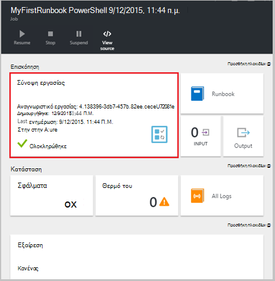  
7.  Όταν η κατάσταση runbook εμφανίζει *ολοκληρώθηκε*, κάντε κλικ στην επιλογή **Έξοδος**. Ανοίγει το παράθυρο εξόδου και μπορούμε να δούμε μας *Γεια*.  
    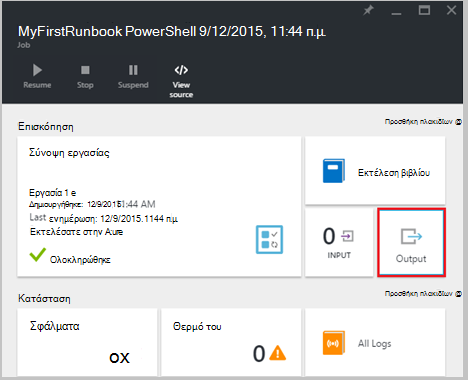
8.  Κλείστε το παράθυρο εξόδου.
9.  Κάντε κλικ στην επιλογή **Όλα τα αρχεία καταγραφής** για να ανοίξετε το παράθυρο ροές για το έργο runbook. Θα πρέπει να βλέπουμε μόνο *Γεια* στη ροή εξόδου, αλλά αυτό μπορεί να εμφανίσει άλλων ροών για ένα έργο runbook όπως λεπτομερές και σφάλμα εάν runbook γράφει σε αυτά.  
    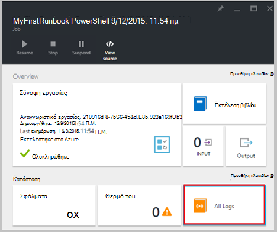  
10. Κλείστε το παράθυρο ροών και παράθυρο εργασίας για να επιστρέψετε στο παράθυρο MyFirstRunbook PowerShell.
11. Κάντε κλικ στην επιλογή **εργασίες** για να ανοίξει το παράθυρο εργασιών για αυτό runbook. Παραθέτει όλες τις εργασίες που δημιουργήθηκαν από αυτό runbook. Θα πρέπει να δούμε μόνο μία εργασία που αναφέρονται εφόσον μας εκτελέσατε μόνο αυτό το έργο μόνο μία φορά.  
    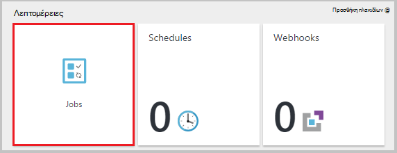  
12. Μπορείτε να κάνετε κλικ σε αυτό το έργο για να ανοίξετε το ίδιο παράθυρο εργασίας που θα σας προβληθεί όταν θα σας αποτελέσματα runbook. Αυτό σας επιτρέπει να επιστρέψετε στο χρόνο και να προβάλετε τις λεπτομέρειες του οποιαδήποτε εργασία που δημιουργήθηκε για μια συγκεκριμένη runbook.

## <a name="step-5---add-authentication-to-manage-azure-resources"></a>Βήμα 5 - Προσθήκη ελέγχου ταυτότητας για τη Διαχείριση Azure πόρων

Χρησιμοποιούμε έχετε δοκιμή και να δημοσιευτεί μας runbook, αλλά μέχρι στιγμής αυτό δεν κάνετε τίποτα χρήσιμες. Θέλουμε να διαχειρίζεστε Azure πόρους. Αυτό δεν θα μπορείτε να το κάνετε αν, εκτός αν έχουμε έλεγχο ταυτότητας χρησιμοποιώντας τα διαπιστευτήρια που αναφέρονται στο τις [προϋποθέσεις](#prerequisites). Κάνουμε με το cmdlet **Προσθήκη AzureRmAccount** .

1.  Ανοίξτε το πρόγραμμα επεξεργασίας κειμένου, κάνοντας κλικ στην επιλογή **Επεξεργασία** στο παράθυρο MyFirstRunbook PowerShell.  
    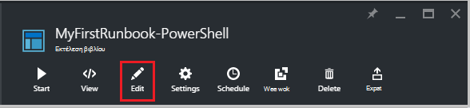  
2.  Θα σας δεν χρειάζεστε πλέον στη γραμμή **Εγγραφής παραγωγής** , ώστε να προχωρήσετε και διαγράψτε το.
3.  Πληκτρολογήστε ή αντιγράψτε και επικολλήστε τον ακόλουθο κώδικα που θα χειρίζεται τον έλεγχο ταυτότητας με το λογαριασμό σας αυτοματισμού εκτέλεση ως:

    ```
     $Conn = Get-AutomationConnection -Name AzureRunAsConnection 
     Add-AzureRMAccount -ServicePrincipal -Tenant $Conn.TenantID `
     -ApplicationId $Conn.ApplicationID -CertificateThumbprint $Conn.CertificateThumbprint
    ``` 
<br>
4.  Κάντε κλικ στην επιλογή **Δοκιμή τμήμα του παραθύρου** , ώστε να μπορούμε να ελέγξουμε runbook.
5.  Κάντε κλικ στην επιλογή **Έναρξη** για να ξεκινήσετε τον έλεγχο. Μόλις ολοκληρωθεί, θα πρέπει να λάβετε έξοδο παρόμοια με την εξής, όπου εμφανίζονται βασικές πληροφορίες από το λογαριασμό σας. Αυτό επιβεβαιώνει ότι τα διαπιστευτήρια είναι έγκυρα. <br> 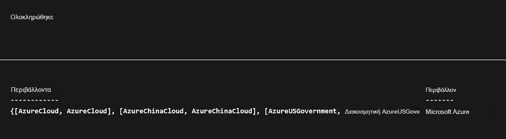

## <a name="step-6---add-code-to-start-a-virtual-machine"></a>Βήμα 6 - Προσθήκη κώδικα για να ξεκινήσετε μια εικονική μηχανή

Τώρα που μας runbook έλεγχο ταυτότητας για να μας Azure συνδρομή, θα σας για να διαχειριστείτε τους πόρους. Θα προσθέσουμε μια εντολή για να ξεκινήσετε μια εικονική μηχανή. Μπορείτε να επιλέξετε οποιοδήποτε εικονική μηχανή στο Azure τη συνδρομή σας και τώρα θα είμαστε hardcoding αυτό το όνομα σε το cmdlet.

1.  Μετά την *Προσθήκη AzureRmAccount*, πληκτρολογήστε *Έναρξη-AzureRmVM-όνομα 'VMName' - ResourceGroupName 'NameofResourceGroup'* παρέχοντας το όνομα και το όνομα της ομάδας πόρων από την εικονική μηχανή για να ξεκινήσετε.  
    
    ```
     $Conn = Get-AutomationConnection -Name AzureRunAsConnection 
     Add-AzureRMAccount -ServicePrincipal -Tenant $Conn.TenantID `
     -ApplicationID $Conn.ApplicationID -CertificateThumbprint $Conn.CertificateThumbprint 
     Start-AzureRmVM -Name 'VMName' -ResourceGroupName 'ResourceGroupName'
     ```
<br>
2.  Αποθήκευση runbook και, στη συνέχεια, κάντε κλικ στην επιλογή **Δοκιμή παράθυρο** έτσι ώστε να μπορούμε να ελέγξουμε αυτό.
3.  Κάντε κλικ στην επιλογή **Έναρξη** για να ξεκινήσετε τον έλεγχο. Μόλις ολοκληρωθεί, ελέγξτε ότι η εικονική μηχανή ξεκίνησε.

## <a name="step-7---add-an-input-parameter-to-the-runbook"></a>Βήμα 7 - Προσθήκη μια παράμετρο εισόδου runbook

Ξεκινά τη συγκεκριμένη στιγμή μας runbook το εικονικό υπολογιστή που θα σας οποίος καθορίζεται σε runbook, αλλά θα ήταν πιο χρήσιμο εάν θα σας θα μπορούσε να καθορίσετε την εικονική μηχανή κατά την εκκίνηση του runbook. Τώρα θα προσθέσουμε παραμέτρους εισόδου σε runbook για την παροχή αυτήν τη λειτουργικότητα.

1.  Προσθέστε παραμέτρους για *VMName* και *ResourceGroupName* σε runbook και να χρησιμοποιήσετε αυτές τις μεταβλητές με το cmdlet **Έναρξη AzureRmVM** όπως στο παρακάτω παράδειγμα.  
    
    ```
    Param(
       [string]$VMName,
       [string]$ResourceGroupName
    )
     $Conn = Get-AutomationConnection -Name AzureRunAsConnection 
     Add-AzureRMAccount -ServicePrincipal -Tenant $Conn.TenantID `
     -ApplicationID $Conn.ApplicationID -CertificateThumbprint $Conn.CertificateThumbprint 
     Start-AzureRmVM -Name $VMName -ResourceGroupName $ResourceGroupName
     ```
<br> 
2.  Αποθήκευση runbook και ανοίξτε το παράθυρο έλεγχος. Σημειώστε ότι τώρα μπορείτε να παράσχετε τιμές για τις δύο μεταβλητές εισαγωγής που θα χρησιμοποιηθεί κατά τη δοκιμή.
3.  Κλείσιμο του παραθύρου δοκιμής.
4.  Κάντε κλικ στην επιλογή **Δημοσίευση** για να δημοσιεύσετε τη νέα έκδοση του runbook.
5.  Διακόψτε την εικονική μηχανή που ξεκινήσατε στο προηγούμενο βήμα.
6.  Κάντε κλικ στην επιλογή **Έναρξη** για να ξεκινήσετε runbook. Πληκτρολογήστε στο **VMName** και **ResourceGroupName** για την εικονική μηχανή που πρόκειται να ξεκινήσετε.  
    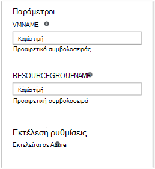  
7.  Όταν ολοκληρωθεί η runbook, ελέγξτε ότι η εικονική μηχανή ξεκίνησε.

## <a name="differences-from-powershell-workflow"></a>Διαφορές από τη ροή εργασίας του PowerShell

PowerShell runbooks έχουν την ίδια κύκλου ζωής, δυνατότητες και διαχείριση ως runbooks PowerShell ροής εργασίας, αλλά υπάρχουν ορισμένες διαφορές και περιορισμούς:

1.  PowerShell runbooks εκτελέσετε γρήγορα σε σύγκριση με το runbooks PowerShell ροής εργασίας που δεν έχουν μεταγλώττισης βήμα.
2.  Ροή εργασίας του PowerShell runbooks υποστήριξη σημεία ελέγχου, χρησιμοποιώντας τα σημεία ελέγχου, runbooks PowerShell ροής εργασίας μπορούν να βιογραφικού σημειώματος από οποιοδήποτε σημείο στο runbook ότι μόνο να συνεχίσετε το PowerShell runbooks από την αρχή.
3.  Runbooks ροής εργασίας του PowerShell υποστηρίζει παράλληλες και σειριακή εκτέλεση ότι PowerShell runbooks μπορούν να εκτελεστούν μόνο εντολές σειριακά.
4.  Σε μια ροή εργασίας του PowerShell runbook, δραστηριότητες, μια εντολή ή ένα μπλοκ δέσμης ενεργειών μπορεί να έχει το δικό της runspace ότι, σε μια runbook PowerShell, όλα τα στοιχεία σε μια δέσμη ενεργειών εκτελείται σε ένα μεμονωμένο runspace. Υπάρχουν επίσης ορισμένες [συντακτικό διαφορές](https://technet.microsoft.com/magazine/dn151046.aspx) μεταξύ μιας εγγενούς runbook PowerShell και μια runbook PowerShell ροής εργασίας.

## <a name="next-steps"></a>Επόμενα βήματα

-   Για να ξεκινήσετε με runbooks γραφικών, ανατρέξτε στο θέμα [μου πρώτη runbook γραφικών](automation-first-runbook-graphical.md)
-   Για να ξεκινήσετε με το PowerShell runbooks ροής εργασίας, ανατρέξτε στο θέμα [μου πρώτη runbook PowerShell ροής εργασίας](automation-first-runbook-textual.md)
-   Για να μάθετε περισσότερα σχετικά με τους τύπους runbook, τους πλεονεκτήματα και τους περιορισμούς, ανατρέξτε στο θέμα [τύποι runbook αυτοματισμού Azure](automation-runbook-types.md)
-   Για περισσότερες πληροφορίες σχετικά με δέσμη ενεργειών του PowerShell υποστηρίζει τη δυνατότητα, ανατρέξτε στο θέμα [δέσμη ενεργειών του PowerShell εγγενή υποστήριξη στα αυτοματισμού Azure](https://azure.microsoft.com/blog/announcing-powershell-script-support-azure-automation-2/)
