<properties 
    pageTitle="Γραφική σύνταξη από κοινού με Azure αυτοματισμού | Microsoft Azure"
    description="Γραφικά σύνταξης σάς επιτρέπει να δημιουργήσετε runbooks για την αυτοματοποίηση Azure χωρίς να εργάζεστε με κώδικα. Σε αυτό το άρθρο παρέχει μια εισαγωγή σχετικά με γραφικά σύνταξης και όλες τις λεπτομέρειες που χρειάζεται, για να ξεκινήσετε τη δημιουργία ενός γραφικού runbook."
    services="automation"   
    documentationCenter=""
    authors="mgoedtel"
    manager="jwhit"
    editor="tysonn" />
<tags 
    ms.service="automation"
    ms.devlang="na"
    ms.topic="article"
    ms.tgt_pltfrm="na"
    ms.workload="infrastructure-services"
    ms.date="06/03/2016"
    ms.author="magoedte;bwren" />

# Γραφική σύνταξη από κοινού με αυτοματισμού Azure

## Εισαγωγή

Γραφικών κοινού σάς επιτρέπει να δημιουργήσετε runbooks για την αυτοματοποίηση Azure χωρίς την τις πολυπλοκότητες από τον υποκείμενο κώδικα του Windows PowerShell ή PowerShell ροής εργασίας. Προσθήκη δραστηριοτήτων στον καμβά από μια βιβλιοθήκη του cmdlet και runbooks, τα συνδέσετε μεταξύ τους και ρύθμιση παραμέτρων για να σχηματίσουν μια ροή εργασίας.  Εάν έχετε χρησιμοποιήσει ποτέ το σύστημα κέντρο Orchestrator ή υπηρεσία διαχείρισης αυτοματισμού (SMA), στη συνέχεια, αυτό θα πρέπει να είναι οικεία για εσάς.   

Σε αυτό το άρθρο παρέχει μια εισαγωγή σχετικά με γραφικά σύνταξης και τις έννοιες που χρειάζεστε για να ξεκινήσετε τη δημιουργία ενός γραφικού runbook.

## Runbooks γραφικών

Όλα runbooks στο Azure αυτοματισμού είναι οι ροές εργασιών των Windows PowerShell.  Γραφικά και τη ροή εργασίας γραφικών PowerShell runbooks δημιουργία κώδικα του PowerShell που εκτελείται, οι εργαζόμενοι αυτοματισμού, αλλά δεν θα μπορείτε να προβάλετε ή να τροποποιήσετε απευθείας.  Μια γραφικών runbook μπορεί να μετατραπεί σε runbook γραφικών PowerShell ροής εργασίας και το αντίστροφο, αλλά δεν είναι δυνατό να μετατραπούν σε ένα runbook που περιέχουν κείμενο. Ένα υπάρχον runbook που περιέχουν κείμενο μπορεί να εισαχθεί στο πρόγραμμα επεξεργασίας γραφικών.  

## Επισκόπηση των γραφικών επεξεργασίας

Μπορείτε να ανοίξετε το πρόγραμμα επεξεργασίας γραφικών στην πύλη του Azure με τη δημιουργία ή επεξεργασία μιας runbook γραφικών.

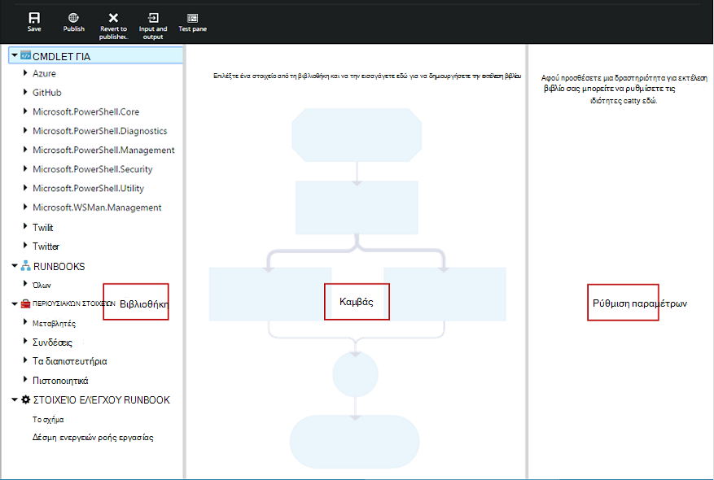

Οι παρακάτω ενότητες περιγράφουν τα στοιχεία ελέγχου στο πρόγραμμα επεξεργασίας γραφικών.

### Καμβάς
Ο καμβάς είναι όπου μπορείτε να σχεδιάσετε το runbook.  Μπορείτε να προσθέσετε δραστηριότητες από τους κόμβους στο στοιχείο ελέγχου βιβλιοθήκη σε runbook και να τα συνδέσετε με συνδέσεις για να ορίσετε τη λογική του runbook.

Μπορείτε να χρησιμοποιήσετε τα στοιχεία ελέγχου στο κάτω μέρος του καμβά για να κάνετε μεγέθυνση και σμίκρυνση.

### Στοιχείο ελέγχου βιβλιοθήκης

Το στοιχείο ελέγχου βιβλιοθήκη είναι όπου μπορείτε να επιλέξετε [δραστηριότητες](#activities) για να προσθέσετε το runbook.  Μπορείτε να τα προσθέσετε στον καμβά όπου μπορείτε να τα συνδέσετε με άλλες δραστηριότητες.  Περιλαμβάνει τέσσερις ενότητες που περιγράφεται στον παρακάτω πίνακα.

| Ενότητα | Περιγραφή |
|:---|:---|
| Cmdlet για | Περιλαμβάνει όλα τα cmdlet που μπορούν να χρησιμοποιηθούν σε runbook σας.  Cmdlet του είναι οργανωμένες ανά λειτουργική μονάδα.  Όλες οι λειτουργικές μονάδες που έχετε εγκαταστήσει στο λογαριασμό σας αυτοματισμού θα είναι διαθέσιμο.  |
| Runbooks |  Περιλαμβάνει το runbooks στο λογαριασμό σας αυτοματισμού. Αυτές οι runbooks μπορούν να προστεθούν στον καμβά ώστε να χρησιμοποιηθεί ως θυγατρικό runbooks. Εμφανίζονται μόνο runbooks του ίδιου τύπου πυρήνα ως runbook που υφίσταται επεξεργασία; για Graphical εμφανίζονται runbooks μόνο βάσει PowerShell runbooks, ενώ για runbooks γραφικών PowerShell ροής εργασίας εμφανίζονται μόνο PowerShell ροής εργασίας-βάσει runbooks.
| Περιουσιακών στοιχείων | Περιλαμβάνει τα [στοιχεία αυτοματισμού](http://msdn.microsoft.com/library/dn939988.aspx) στο λογαριασμό σας αυτοματισμού που μπορούν να χρησιμοποιηθούν στο runbook σας.  Κατά την προσθήκη ενός περιουσιακού στοιχείου για μια runbook, θα προσθέσει μια δραστηριότητα ροής εργασίας που λαμβάνει το επιλεγμένο πάγιο.  Στην περίπτωση μεταβλητής περιουσιακά στοιχεία, μπορείτε να επιλέξετε εάν θέλετε να προσθέσετε μια δραστηριότητα για να λάβετε τη μεταβλητή ή να ορίσετε τη μεταβλητή.
| Στοιχείο ελέγχου Runbook | Περιλαμβάνει δραστηριοτήτων στοιχείων ελέγχου runbook που μπορούν να χρησιμοποιηθούν σε την τρέχουσα runbook. Ένα *σχήμα* λαμβάνει πολλών εισροές και χρειάζεται να περιμένει μέχρι να ολοκληρωθεί όλων πριν να συνεχίσετε τη ροή εργασίας. Δραστηριότητα *κώδικα* εκτελείται μία ή περισσότερες γραμμές του PowerShell ή ροή εργασίας του PowerShell κώδικα ανάλογα με τον τύπο γραφικού runbook.  Μπορείτε να χρησιμοποιήσετε αυτήν τη δραστηριότητα για προσαρμοσμένου κώδικα ή για λειτουργίες που είναι δύσκολο να επιτύχετε με άλλες δραστηριότητες.|

### Ρύθμιση παραμέτρων ελέγχου

Το στοιχείο ελέγχου ρύθμισης παραμέτρων είναι όπου μπορείτε να παρέχετε λεπτομέρειες για ένα επιλεγμένο στον καμβά αντικείμενο. Οι ιδιότητες που είναι διαθέσιμες σε αυτό το στοιχείο ελέγχου θα εξαρτώνται από τον τύπο του επιλεγμένου αντικειμένου.  Όταν επιλέγετε μια επιλογή στο στοιχείο ελέγχου ρύθμισης παραμέτρων, θα ανοίξει επιπλέον λεπίδες προκειμένου να παρέχουν πρόσθετες πληροφορίες.

### Στοιχείο ελέγχου δοκιμής

Το στοιχείο ελέγχου δοκιμή δεν εμφανίζεται όταν εκκινείται το πρόγραμμα επεξεργασίας γραφικών. Ανοίγει όταν μπορείτε αλληλεπιδραστικά [Δοκιμή μια runbook γραφικά](#graphical-runbook-procedures).  

## Γραφική runbook διαδικασίες 

### Εξαγωγή και εισαγωγή μιας runbook γραφικών

Μπορείτε να εξαγάγετε μόνο τη δημοσιευμένη έκδοση ενός γραφικού runbook.  Εάν δεν έχει ακόμη δημοσιευθεί runbook, στη συνέχεια, στο κουμπί **Εξαγωγή δημοσιευμένη** θα απενεργοποιηθεί.  Όταν κάνετε κλικ στο κουμπί **Εξαγωγή δημοσιευθεί** , γίνεται λήψη των runbook στον τοπικό σας υπολογιστή.  Το όνομα του αρχείου συμφωνεί με το όνομα του runbook με επέκταση *graphrunbook* .

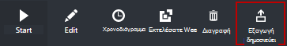

Μπορείτε να εισαγάγετε ένα αρχείο runbook Graphical ή γραφικών PowerShell ροής εργασίας με την επιλογή **Εισαγωγή** κατά την προσθήκη ενός runbook.   Όταν επιλέξετε το αρχείο προς εισαγωγή, μπορείτε να διατηρήσετε το ίδιο **όνομα** ή να δώσετε ένα νέο.  Το πεδίο Τύπος Runbook θα εμφανίσει τον τύπο του runbook μετά την εκτιμάται το επιλεγμένο αρχείο και εάν προσπαθήσετε να επιλέξετε διαφορετικό τύπο ο οποίος δεν είναι σωστή, ένα μήνυμα θα εμφανιστεί να αναφερθούν υπάρχουν πιθανές διενέξεις και κατά τη μετατροπή, ενδέχεται να υπάρχουν σφάλματα σύνταξης.  

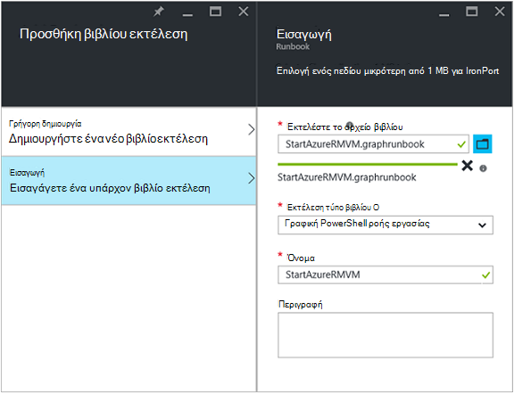

### Έλεγχος ενός runbook γραφικών

Μπορείτε να ελέγξετε την runbook μια πρόχειρη έκδοση στην πύλη του Azure ενώ κλείσετε τη δημοσιευμένη έκδοση του runbook που δεν έχουν αλλάξει ή μπορείτε να δοκιμάσετε μια νέα runbook πριν δημοσιευτεί. Αυτό σας επιτρέπει να επαληθεύσετε ότι runbook λειτουργεί σωστά πριν από την αντικατάσταση η δημοσιευμένη έκδοση. Κατά τη δοκιμή μια runbook, runbook πρόχειρη εκτελείται και τυχόν ενέργειες που εκτελεί έχουν ολοκληρωθεί. Δημιουργείται χωρίς ιστορικού εργασίας, αλλά η έξοδος εμφανίζεται στο παράθυρο εξόδου δοκιμής. 

Ανοίξτε το στοιχείο ελέγχου δοκιμή για μια runbook ανοίγοντας runbook για επεξεργασία και, στη συνέχεια, κάντε κλικ στο κουμπί **Έλεγχος τμήμα του παραθύρου** .

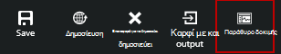

Το στοιχείο ελέγχου δοκιμής θα γίνεται ερώτηση για οποιεσδήποτε παραμέτρους εισόδου και μπορείτε να ξεκινήσετε runbook κάνοντας κλικ στο κουμπί **Έναρξη** .

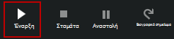

### Δημοσίευση μιας runbook γραφικών

Κάθε runbook στο Azure αυτοματισμού έχει ένα Πρόχειρο και μια δημοσιευμένη έκδοση. Μόνο η δημοσιευμένη έκδοση είναι διαθέσιμη για να εκτελείται και είναι δυνατή η επεξεργασία μόνο την πρόχειρη έκδοση. Η δημοσιευμένη έκδοση δεν επηρεάζεται από τις αλλαγές στην έκδοση του Πρόχειρου. Όταν είστε έτοιμοι να είναι διαθέσιμη η πρόχειρη έκδοση, στη συνέχεια, δημοσιεύετε το οποίο αντικαθιστά την έκδοση Published με την πρόχειρη έκδοση.

Μπορείτε να δημοσιεύσετε μια runbook γραφικών με το άνοιγμα του runbook για επεξεργασία και, στη συνέχεια, κάνοντας κλικ στο κουμπί **Δημοσίευση** .

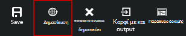

Όταν μια runbook δεν έχουν δημοσιευτεί ακόμα, που έχει μια κατάσταση του **New**.  Όταν δημοσιευτεί, που έχει μια κατάσταση **δημοσιεύτηκε**.  Εάν επεξεργαστείτε runbook αφού δημοσιευτεί και τις εκδόσεις προχείρων και δημοσιευμένων είναι διαφορετικά, runbook βρίσκεται σε κατάσταση **στην επεξεργασία**.

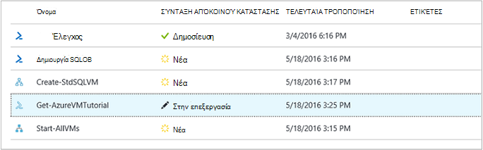 

Έχετε επίσης την επιλογή για να επιστρέψετε στην έκδοση δημοσιεύτηκε από μια runbook.  Δεν βρίσκομαι στον υπολογιστή παρουσιάζει τυχόν αλλαγές που έγιναν μετά runbook έγινε η τελευταία έκδοση και αντικαθιστά την πρόχειρη έκδοση του runbook με τη δημοσιευμένη έκδοση.

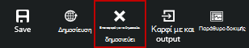

## Δραστηριότητες

Οι δραστηριότητες είναι τα δομικά στοιχεία μιας runbook.  Μια δραστηριότητα μπορεί να είναι ένα cmdlet του PowerShell, ένα θυγατρικό runbook ή μιας δραστηριότητας ροής εργασίας.  Μπορείτε να προσθέσετε μια δραστηριότητα σε runbook κάνοντας δεξί κλικ στο στοιχείο ελέγχου βιβλιοθήκη και επιλέγοντας **Προσθήκη για να καμβά**.  Για να, στη συνέχεια, κάντε κλικ και σύρετε τη δραστηριότητα για να το τοποθετήσετε σε οποιοδήποτε σημείο στον καμβά που σας αρέσει.  Η θέση της η της δραστηριότητας στον καμβά δεν επηρεάζει τη λειτουργία του runbook με οποιονδήποτε τρόπο.  Μπορείτε να διάταξης του runbook Ωστόσο, μπορείτε να το βρείτε πιο κατάλληλη για την απεικόνιση τη λειτουργία. 

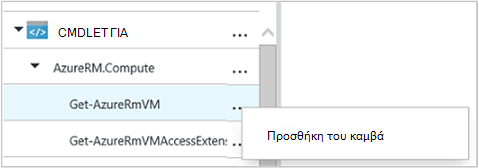

Επιλέξτε τη δραστηριότητα στον καμβά για να ρυθμίσετε τις ιδιότητες και τις παραμέτρους στο το blade ρύθμισης παραμέτρων.  Μπορείτε να αλλάξετε την **ετικέτα** της δραστηριότητας για κάτι που είναι περιγραφικό για εσάς.  Το αρχικό cmdlet εξακολουθεί να εκτελείται, απλώς αλλάζετε το εμφανιζόμενο όνομα που θα χρησιμοποιηθεί στο πρόγραμμα επεξεργασίας γραφικών.  Η ετικέτα πρέπει να είναι μοναδικό μέσα σε runbook. 

### Σύνολα παραμέτρων

Ένα σύνολο παραμέτρων καθορίζει τις παραμέτρους υποχρεωτικές και προαιρετικές που αποδέχεται τιμές για ένα συγκεκριμένο cmdlet.  Όλων των cmdlet έχει τουλάχιστον μία παράμετρο ρύθμιση και ορισμένα έχετε πολλές.  Εάν ένα cmdlet έχει πολλά σύνολα παραμέτρων, στη συνέχεια, πρέπει να επιλέξετε αυτήν που θα χρησιμοποιήσετε πριν που μπορείτε να ρυθμίσετε τις παραμέτρους.  Οι παράμετροι που μπορείτε να ρυθμίσετε εξαρτώνται από το σύνολο των παραμέτρων που επιλέγετε.  Μπορείτε να αλλάξετε το σύνολο παραμέτρων που χρησιμοποιούνται με μια δραστηριότητα επιλέγοντας **Ρύθμιση παραμέτρων** και ένα άλλο σύνολο.  Σε αυτήν την περίπτωση, τις τιμές παραμέτρων που ρυθμίσατε θα χαθούν.

Στο παρακάτω παράδειγμα, το cmdlet Get-AzureRmVM περιλαμβάνει τρία σύνολα παραμέτρων.  Δεν μπορείτε να ρυθμίσετε τιμές παραμέτρων μέχρι να επιλέξετε ένα από τα σύνολα παραμέτρων.  Η ρύθμιση παραμέτρων ListVirtualMachineInResourceGroupParamSet είναι για επιστροφή όλες οι εικονικές μηχανές σε μια ομάδα πόρων και έχει ένα μεμονωμένο προαιρετική παράμετρος.  Είναι το GetVirtualMachineInResourceGroupParamSet για να καθορίσετε την εικονική μηχανή που θέλετε να επιστρέψετε και να έχει δύο υποχρεωτικό και μια προαιρετική παράμετρος.

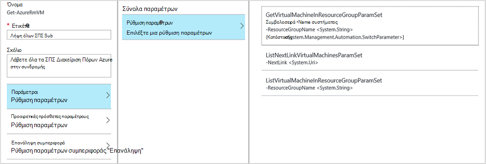

#### Τιμές παραμέτρων

Όταν καθορίζετε μια τιμή για μια παράμετρο, μπορείτε να επιλέξετε ένα αρχείο προέλευσης δεδομένων για να καθορίσετε πώς θα προσδιοριστεί η τιμή.  Οι έγκυρες τιμές για αυτήν την παράμετρο εξαρτώνται από τις προελεύσεις δεδομένων που είναι διαθέσιμες για μια συγκεκριμένη παράμετρο.  Για παράδειγμα, Null δεν θα είναι διαθέσιμη επιλογή για μια παράμετρο που δεν επιτρέπει τιμές null.

| Αρχείο προέλευσης δεδομένων | Περιγραφή |
|:---|:---|
|Τιμή της σταθεράς|Πληκτρολογήστε μια τιμή για την παράμετρο.  Αυτή είναι διαθέσιμη μόνο για τους ακόλουθους τύπους δεδομένων: Int32, Int64, συμβολοσειρά, Boolean, ημερομηνίας/ώρας, μετάβαση. |
|Αποτέλεσμα δραστηριότητας|Έξοδος από μια δραστηριότητα που προηγείται της τρέχουσας δραστηριότητας εντός της ροής εργασίας.  Όλες οι δραστηριότητες έγκυρη θα εμφανίζονται.  Επιλέξτε μόνο τη δραστηριότητα για να χρησιμοποιήσετε τα αποτελέσματά για την τιμή της παραμέτρου.  Εάν η δραστηριότητα εξόδους ενός αντικειμένου με πολλές ιδιότητες, στη συνέχεια, μπορείτε να πληκτρολογήσετε στο όνομα της ιδιότητας αφού επιλέξετε τη δραστηριότητα.|
|Εισαγωγή δεδομένων Runbook |Επιλέξτε μια παράμετρο εισόδου runbook ως είσοδο στην παράμετρο δραστηριότητας.|  
|Μεταβλητό περιουσιακών στοιχείων|Επιλέξτε μια μεταβλητή αυτοματισμού ως είσοδο.|  
|Διαπιστευτήρια περιουσιακών στοιχείων|Επιλέξτε μια διαπιστευτηρίων αυτοματισμού ως είσοδο.|  
|Πιστοποιητικό περιουσιακών στοιχείων|Επιλέξτε ένα πιστοποιητικό αυτοματισμού ως είσοδο.|  
|Σύνδεση περιουσιακών στοιχείων|Επιλέξτε μια σύνδεση αυτοματισμού ως είσοδο.| 
|Παράσταση PowerShell|Καθορίστε απλή [παράσταση PowerShell](#powershell-expressions).  Πριν από τη δραστηριότητα και το αποτέλεσμα που χρησιμοποιείται για την τιμή της παραμέτρου θα αξιολογηθεί η παράσταση.  Μπορείτε να χρησιμοποιήσετε μεταβλητές να αναφέρεται το αποτέλεσμα μιας δραστηριότητας ή μια παράμετρο εισόδου runbook.|
|Δεν έχει ρυθμιστεί|Καταργεί οποιαδήποτε τιμή που έχει ήδη ρυθμιστεί.|

#### Προαιρετικές πρόσθετες παραμέτρους

Όλων των cmdlet θα έχετε τη δυνατότητα να παρέχουν πρόσθετες παραμέτρους.  Αυτά είναι κοινά παράμετροι PowerShell ή άλλες προσαρμοσμένες παραμέτρους.  Εμφανίζεται με ένα πλαίσιο κειμένου όπου μπορείτε να παρέχετε τις παραμέτρους χρησιμοποιώντας τη σύνταξη του PowerShell.  Για παράδειγμα, για να χρησιμοποιήσετε την παράμετρο κοινές **λεπτομερές** , θα πρέπει να καθορίσετε **"-Λεπτομερής: $True"**.

### Επανάληψη δραστηριότητας

**Η συμπεριφορά επανάληψης** επιτρέπει δραστηριότητας για να εκτελεστεί πολλές φορές, μέχρι να ικανοποιείται μια συγκεκριμένη συνθήκη, όπως περίπου ένα βρόχο.  Μπορείτε να χρησιμοποιήσετε αυτήν τη δυνατότητα για δραστηριότητες που θα πρέπει να εκτελέσετε πολλές φορές, είναι σφάλματα και ενδέχεται να χρειάζεστε περισσότερες από μία η προσπάθεια για την επιτυχία ή να ελέγξετε τις πληροφορίες εξόδου της δραστηριότητας για έγκυρα δεδομένα.    

Όταν ενεργοποιείτε "Επανάληψη" για μια δραστηριότητα, μπορείτε να ορίσετε μια καθυστέρηση και μια συνθήκη.  Την καθυστέρηση είναι ο χρόνος (υπολογίζεται σε δευτερόλεπτα ή λεπτά) που θα περιμένετε runbook πριν από την εκτέλεση της δραστηριότητας.  Εάν έχει καθοριστεί χωρίς καθυστέρηση, στη συνέχεια, τη δραστηριότητα θα εκτελεστεί ξανά αμέσως μετά την ολοκλήρωση. 

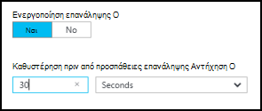

Η συνθήκη "Επανάληψη" είναι μια παράσταση PowerShell που αξιολογείται μετά από κάθε φορά που εκτελείται τη δραστηριότητα.  Εάν η παράσταση που αναλύεται στην τιμή True, στη συνέχεια, τη δραστηριότητα εκτελείται ξανά.  Εάν η παράσταση που αναλύεται σε False, στη συνέχεια, τη δραστηριότητα δεν εκτελείται ξανά και runbook πραγματοποιεί μετακίνηση επόμενη τη δραστηριότητα. 

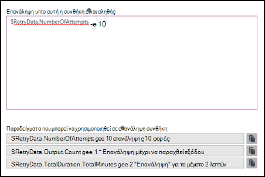

Η συνθήκη "Επανάληψη" να χρησιμοποιήσετε μια μεταβλητή που ονομάζεται $RetryData που παρέχει πρόσβαση σε πληροφορίες σχετικά με τη δραστηριότητα επαναλήψεις.  Αυτή η μεταβλητή περιλαμβάνει τις ιδιότητες στον παρακάτω πίνακα.

| Ιδιότητα | Περιγραφή |
|:--|:--|
| NumberOfAttempts | Αριθμός των φορών που έχει εκτελεστεί τη δραστηριότητα.              |
| Εξόδου           | Έξοδος από την τελευταία εκτέλεση της δραστηριότητας.                    |
| TotalDuration    | Το χρονικό όριο που έχουν παρέλθει από τη δραστηριότητα Έναρξη την πρώτη φορά. |
| StartedAt        | Ώρα σε μορφή UTC ξεκίνησε πρώτα τη δραστηριότητα.           |

Ακολουθούν παραδείγματα δραστηριότητας συνθήκες προσπαθήστε ξανά.

    # Run the activity exactly 10 times.
    $RetryData.NumberOfAttempts -ge 10 

    # Run the activity repeatedly until it produces any output.
    $RetryData.Output.Count -ge 1 

    # Run the activity repeatedly until 2 minutes has elapsed. 
    $RetryData.TotalDuration.TotalMinutes -ge 2

Αφού ρυθμίσετε μια συνθήκη "Επανάληψη" για μια δραστηριότητα, τη δραστηριότητα περιλαμβάνει δύο οπτικές υποδείξεις για να σας υπενθυμίσει.  Μία παρουσιάζεται στη δραστηριότητα και το άλλο είναι όταν θέλετε να εξετάσετε τη ρύθμιση παραμέτρων της δραστηριότητας.

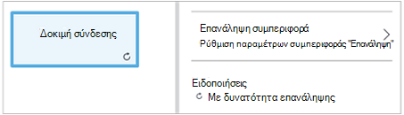

### Στοιχείο ελέγχου δέσμης ενεργειών ροής εργασίας

Ένα στοιχείο ελέγχου κώδικα είναι μια ειδική δραστηριότητα που δέχεται δέσμη ενεργειών PowerShell ή PowerShell ροής εργασίας ανάλογα με τον τύπο του γραφικού runbook που δημιουργήθηκε για να σας παρέχει λειτουργικότητα που ίσως διαφορετικά δεν είναι διαθέσιμη.  Αυτό δεν είναι δυνατό να αποδεχτείτε τις παραμέτρους, αλλά μπορεί να χρησιμοποιήσει μεταβλητές για δραστηριότητα εξόδου και runbook παραμέτρους εισόδου.  Κανένα αποτέλεσμα της δραστηριότητας προστίθεται το databus εκτός εάν έχει χωρίς εξερχόμενη σύνδεση σε αυτή την περίπτωση θα προστεθεί στο αποτέλεσμα του runbook.

Για παράδειγμα τον παρακάτω κώδικα εκτελεί υπολογισμούς ημερομηνίας χρησιμοποιώντας μια μεταβλητή εισόδου runbook που ονομάζεται $NumberOfDays.  Στη συνέχεια, στέλνει υπολογισμού ημερομηνίας ώρας ως αποτέλεσμα θα χρησιμοποιηθεί από οι επόμενες δραστηριότητες σε runbook.

    $DateTimeNow = (Get-Date).ToUniversalTime()
    $DateTimeStart = ($DateTimeNow).AddDays(-$NumberOfDays)}
    $DateTimeStart

## Συνδέσεις και ροή εργασίας

Μια **σύνδεση** σε ένα γραφικό runbook συνδέει δύο δραστηριότητες.  Εμφανίζεται στον καμβά ως ένα βέλος με κατεύθυνση από την προέλευση της δραστηριότητας στη δραστηριότητα προορισμού.  Εκτελέστε τις δραστηριότητες προς την κατεύθυνση του βέλους με τη δραστηριότητα προορισμού εκκίνηση μετά την ολοκλήρωση της δραστηριότητας προέλευσης.  

### Δημιουργία σύνδεσης

Δημιουργήστε μια σύνδεση ανάμεσα σε δύο δραστηριότητες επιλέγοντας τη δραστηριότητα προέλευσης και κάνοντας κλικ στον κύκλο στο κάτω μέρος του σχήματος.  Σύρετε το βέλος στη δραστηριότητα προορισμού και την έκδοση.

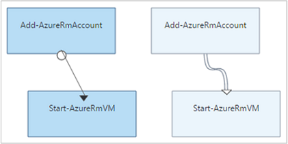

Επιλέξτε τη σύνδεση για να ρυθμίσετε τις ιδιότητές του στο το blade ρύθμισης παραμέτρων.  Αυτό θα περιλαμβάνει τον τύπο σύνδεσης, η οποία περιγράφεται στον παρακάτω πίνακα.

| Τύπος σύνδεσης | Περιγραφή |
|:---|:---|
| Διοχέτευση | Τη δραστηριότητα προορισμού εκτελείται μία φορά για κάθε αντικείμενο έξοδο από τη δραστηριότητα προέλευσης.  Η δραστηριότητα προορισμού δεν εκτελείται, εάν η δραστηριότητα προέλευσης επιφέρει χωρίς αποτέλεσμα.  Έξοδος από τη δραστηριότητα προέλευσης είναι διαθέσιμη ως ένα αντικείμενο.  |
| Ακολουθία | Η δραστηριότητα προορισμού εκτελείται μόνο μία φορά.  Λαμβάνει ένα πίνακα αντικειμένων από τη δραστηριότητα προέλευσης.  Έξοδος από τη δραστηριότητα προέλευσης είναι διαθέσιμη ως πίνακας αντικειμένων. |

### Έναρξη δραστηριοτήτων

Μια γραφικών runbook θα ξεκινήσει με τις δραστηριότητες που δεν έχουν μια εισερχόμενη σύνδεση.  Αυτό είναι συχνά μόνο μία δραστηριότητα που θα ενεργήσει ως την αρχική δραστηριότητα για runbook.  Εάν πολλές δραστηριότητες δεν διαθέτει μια εισερχόμενη σύνδεση, θα ξεκινήσει runbook εκτελώντας τα παράλληλα.  Στη συνέχεια, ακολουθήστε τις συνδέσεις για να εκτελέσετε άλλες δραστηριότητες, όπως κάθε ολοκληρωθεί.

### Συνθήκες

Όταν καθορίζετε μια συνθήκη σε μια σύνδεση, τη δραστηριότητα προορισμού θα εκτελεστεί μόνο εάν η συνθήκη είναι true.  Θα χρησιμοποιείτε συνήθως μια μεταβλητή $ActivityOutput σε μια συνθήκη για να ανακτήσετε την έξοδο από τη δραστηριότητα προέλευσης.  

Για μια σύνδεση διοχέτευσης, μπορείτε να καθορίσετε μια συνθήκη για ένα αντικείμενο και τη συνθήκη αξιολογείται για κάθε αντικείμενο έξοδο από τη δραστηριότητα προέλευσης.  Στη συνέχεια, εκτελείται τη δραστηριότητα προορισμού για κάθε αντικείμενο που ικανοποιεί τη συνθήκη.  Για παράδειγμα, με μια δραστηριότητα προέλευσης του Get-AzureRmVm, την ακόλουθη σύνταξη μπορεί να χρησιμοποιηθεί για μια σύνδεση διοχέτευσης υπό όρους για να ανακτήσετε μόνο εικονικές μηχανές στην ομάδα πόρων με το όνομα *Ομάδα1*.  

    $ActivityOutput['Get Azure VMs'].Name -match "Group1"

Για μια σύνδεση ακολουθία, τη συνθήκη μόνο αξιολογείται μία φορά επειδή επιστρέφεται μόνο έναν πίνακα που περιέχει όλα τα αντικείμενα έξοδο από τη δραστηριότητα προέλευσης.  Αυτόν το λόγο, μια σύνδεση ακολουθίας δεν μπορούν να χρησιμοποιηθούν για το φιλτράρισμα όπως μια σύνδεση διοχέτευσης αλλά απλώς θα καθορίσει ή όχι την εκτέλεση της επόμενης δραστηριότητας. Λήψη για παράδειγμα το ακόλουθο σύνολο δραστηριοτήτων σε μας runbook Έναρξη Εικονική.  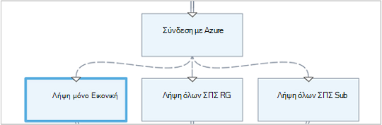 
Υπάρχουν τρεις συνδέσεις διαφορετική ακολουθία που επαληθεύετε τιμές έχουν που παρέχονται σε δύο runbook παραμέτρους εισόδου που αντιπροσωπεύει Εικονική όνομα και όνομα ομάδας πόρων για να προσδιορίσετε που είναι το κατάλληλο ενέργεια - Ξεκινήστε ένα μεμονωμένο Εικονική, ξεκινήστε όλα ΣΠΣ στην ομάδα τον πόρο ή όλα ΣΠΣ σε μια συνδρομή.  Για τη σύνδεση ακολουθίας μεταξύ σύνδεση με το Azure και μία Εικονική λήψη, ακολουθεί η λογική συνθήκη:

    <# 
    Both VMName and ResourceGroupName runbook input parameters have values 
    #>
    (
    (($VMName -ne $null) -and ($VMName.Length -gt 0))
    ) -and (
    (($ResourceGroupName -ne $null) -and ($ResourceGroupName.Length -gt 0))
    )

Όταν χρησιμοποιείτε μια σύνδεση υπό όρους, τα δεδομένα που είναι διαθέσιμες από τη δραστηριότητα προέλευσης σε άλλες δραστηριότητες του σε αυτόν τον κλάδο θα φιλτράρονται από τη συνθήκη.  Εάν μια δραστηριότητα είναι η προέλευση για πολλές συνδέσεις, στη συνέχεια, τα δεδομένα που είναι διαθέσιμες σε δραστηριότητες σε κάθε κλάδο θα εξαρτώνται από τη συνθήκη στο πλαίσιο σύνδεση τη σύνδεση σε αυτόν τον κλάδο.

Για παράδειγμα, τη δραστηριότητα **Έναρξη-AzureRmVm** στο παρακάτω runbook ξεκινά όλες οι εικονικές μηχανές.  Έχει δύο συνδέσεις υπό όρους.  Η πρώτη σύνδεση υπό όρους χρησιμοποιεί την έκφραση *$ActivityOutput ['Έναρξη-AzureRmVM']. IsSuccessStatusCode - eq $true* για να φιλτράρετε εάν τη δραστηριότητα Έναρξη AzureRmVm ολοκληρώθηκε με επιτυχία.  Το δεύτερο χρησιμοποιεί την έκφραση *$ActivityOutput ['Έναρξη-AzureRmVM']. IsSuccessStatusCode - $true* για να φιλτράρετε εάν τη δραστηριότητα Έναρξη AzureRmVm απέτυχε να ξεκινήσει η εικονική μηχανή.  

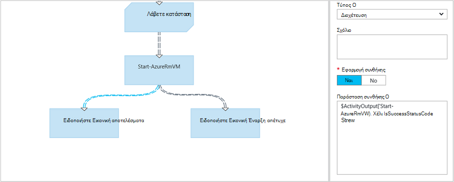

Οποιαδήποτε δραστηριότητα που ακολουθεί την πρώτη σύνδεση και χρησιμοποιεί το αποτέλεσμα δραστηριότητας από το Get-AzureVM θα εμφανιστεί μόνο τις εικονικές μηχανές που ξεκίνησαν την ώρα που εκτελέστηκε Get-AzureVM.  Οποιαδήποτε δραστηριότητα που ακολουθεί τη δεύτερη σύνδεση μόνο θα λάβουν το τις εικονικές μηχανές που διακόψατε την ώρα που εκτελέστηκε Get-AzureVM.  Οποιαδήποτε δραστηριότητα ακολουθώντας το τρίτο σύνδεση θα λάβουν όλες οι εικονικές μηχανές ανεξάρτητα από την κατάσταση λειτουργίας τους.

### Διασταυρώσεις

Ένα σχήμα είναι μια ειδική δραστηριότητα που θα περιμένετε έως ότου ολοκληρωθεί όλες οι εισερχόμενες κλάδοι.  Αυτό σας επιτρέπει να εκτελούν πολλές δραστηριότητες παράλληλα και βεβαιωθείτε ότι έχετε ολοκληρώσει όλες πριν περάσετε στην.

Ενώ μιας σύνδεσης μπορεί να έχετε απεριόριστες εισερχόμενες συνδέσεις, δεν περισσότερες από μία από αυτές τις συνδέσεις μπορεί να είναι μια διαδικασία.  Ο αριθμός των εισερχόμενες συνδέσεις ακολουθίας δεν περιορίζεται.  Που θα επιτρέπεται η δημιουργία στην Ένωση με πολλές εισερχόμενες συνδέσεις διοχέτευσης και αποθήκευση runbook, αλλά θα αποτύχει όταν εκτελείται.

Το παρακάτω παράδειγμα αποτελεί τμήμα ενός runbook που ξεκινά ένα σύνολο εικονικές μηχανές ενώ ταυτόχρονα τη λήψη ενημερωμένες εκδόσεις κώδικα για να εφαρμοστεί σε αυτούς τους υπολογιστές.  Για να βεβαιωθείτε ότι έχουν ολοκληρωθεί και των δύο διεργασιών πριν συνεχίζει runbook χρησιμοποιείται μιας σύνδεσης.

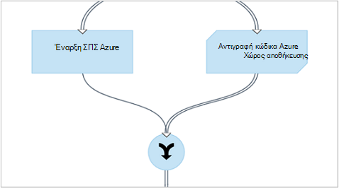

### Κύκλους

Ένας κύκλος είναι όταν μια συνδέσεις δραστηριότητας προορισμού ξανά για να τη δραστηριότητά προέλευσης ή άλλη δραστηριότητα οποία τελικά συνδέεται με το αρχείο προέλευσης.  Κύκλοι αυτήν τη στιγμή δεν επιτρέπονται γραφικών σύνταξης.  Εάν το runbook έχει έναν κύκλο, θα αποθηκευτεί σωστά αλλά θα λάβουν ένα μήνυμα σφάλματος όταν εκτελείται.

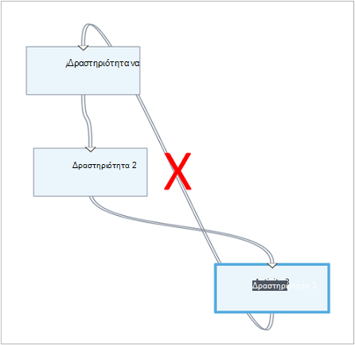

### Κοινή χρήση δεδομένων μεταξύ δραστηριοτήτων

Όλα τα δεδομένα που είναι εξόδου με μια δραστηριότητα με εξερχόμενη σύνδεση καταγράφεται η *databus* για runbook.  Καμία δραστηριότητα στο runbook να χρησιμοποιήσετε δεδομένα σε το databus για να συμπληρώσετε τιμές παραμέτρων ή για να συμπεριλάβετε σε κώδικα δέσμης ενεργειών.  Δραστηριότητα πρόσβαση το αποτέλεσμα της οποιαδήποτε προηγούμενη δραστηριότητα στη ροή εργασίας.     

Πώς τα δεδομένα είναι γραμμένο για να το databus εξαρτάται από τον τύπο της σύνδεσης σχετικά με τη δραστηριότητα.  Για μια **διαδικασία**, τα δεδομένα είναι εξόδου ως αντικείμενα πολλαπλά γραφήματα.  Για μια σύνδεση **ακολουθία** , τα δεδομένα είναι αποτέλεσμα ως πίνακα.  Εάν υπάρχει μόνο μία τιμή, θα είναι αποτέλεσμα ως πίνακα με ένα μεμονωμένο στοιχείο.

Μπορείτε να αποκτήσετε πρόσβαση σε δεδομένα του databus χρησιμοποιώντας μία από τις δύο μεθόδους.  Πρώτα χρησιμοποιεί μια προέλευση δεδομένων **Εξόδου δραστηριότητας** για να συμπληρώσετε μια παράμετρος από μια άλλη δραστηριότητα.  Εάν το αποτέλεσμα είναι ένα αντικείμενο, μπορείτε να καθορίσετε μία μόνο ιδιότητα.

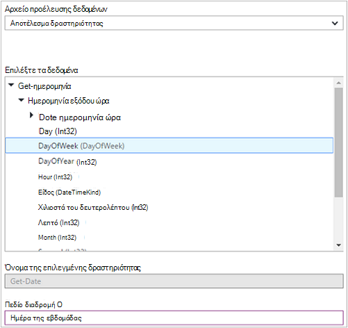

Μπορείτε επίσης να ανακτήσετε το αποτέλεσμα μιας δραστηριότητας σε ένα αρχείο προέλευσης δεδομένων **PowerShell παράσταση** ή από μια δραστηριότητα **Δέσμης ενεργειών ροής εργασίας** με έναν μεταβλητή ActivityOutput.  Εάν το αποτέλεσμα είναι ένα αντικείμενο, μπορείτε να καθορίσετε μία μόνο ιδιότητα.  Μεταβλητές ActivityOutput χρησιμοποιήστε την ακόλουθη σύνταξη.

    $ActivityOutput['Activity Label']
    $ActivityOutput['Activity Label'].PropertyName 

### Σημεία ελέγχου

Μπορείτε να ορίσετε [τα σημεία ελέγχου](automation-powershell-workflow.md#checkpoints) σε μια ροή εργασίας γραφικών PowerShell runbook, επιλέγοντας *runbook σημείο ελέγχου* σε οποιαδήποτε δραστηριότητα.  Αυτό έχει ως αποτέλεσμα ένα σημείο ελέγχου θα οριστεί αφού εκτελεστεί τη δραστηριότητα.

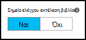

Σημεία ελέγχου μόνο είναι ενεργοποιημένες στο runbooks γραφικών ροής εργασίας του PowerShell, δεν είναι διαθέσιμη στο runbooks γραφικών.  Εάν η runbook χρησιμοποιεί cmdlet του Azure, θα πρέπει να ακολουθήσετε οποιαδήποτε checkpointed δραστηριότητα με ένα πρόσθετο-AzureRMAccount σε περίπτωση runbook τίθεται σε αναστολή και επανεκκίνηση του από αυτό το σημείο ελέγχου σε μια διαφορετική εργασίας. 

## Έλεγχος ταυτότητας με πόρους Azure

Runbooks στο Azure Automation που διαχειρίζεστε Azure πόρους θα απαιτείται έλεγχος ταυτότητας για Azure.  Η νέα δυνατότητα [εκτελείται ως λογαριασμός](automation-sec-configure-azure-runas-account.md) (γνωστή και ως υπηρεσία κεφαλαίου) είναι η προεπιλεγμένη μέθοδος για να αποκτήσετε πρόσβαση από διαχειριστή πόρων Azure πόρων σε runbooks αυτοματισμού τη συνδρομή σας.  Μπορείτε να προσθέσετε αυτή η λειτουργία σε ένα γραφικό runbook με την προσθήκη **AzureRunAsConnection** σύνδεσης περιουσιακού στοιχείου, που χρησιμοποιεί το cmdlet του PowerShell [Get-AutomationConnection](https://technet.microsoft.com/library/dn919922%28v=sc.16%29.aspx) και [Προσθήκη AzureRmAccount](https://msdn.microsoft.com/library/mt619267.aspx) cmdlet για να τον καμβά. Αυτό φαίνεται στο παρακάτω παράδειγμα. 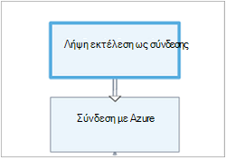 
Η δραστηριότητα γρήγορα εκτέλεση ως σύνδεσης (δηλαδή Get-AutomationConnection), έχει ρυθμιστεί με τιμή της σταθεράς προέλευσης δεδομένων με το όνομα AzureRunAsConnection. 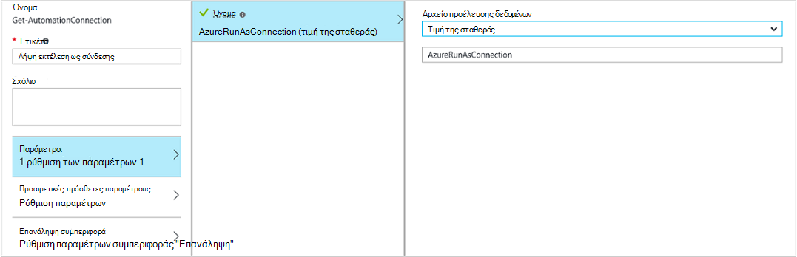 
Την επόμενη δραστηριότητα, προσθήκη-AzureRmAccount, προσθέτει το με έλεγχο ταυτότητας εκτελείται ως λογαριασμός για χρήση σε runbook. 
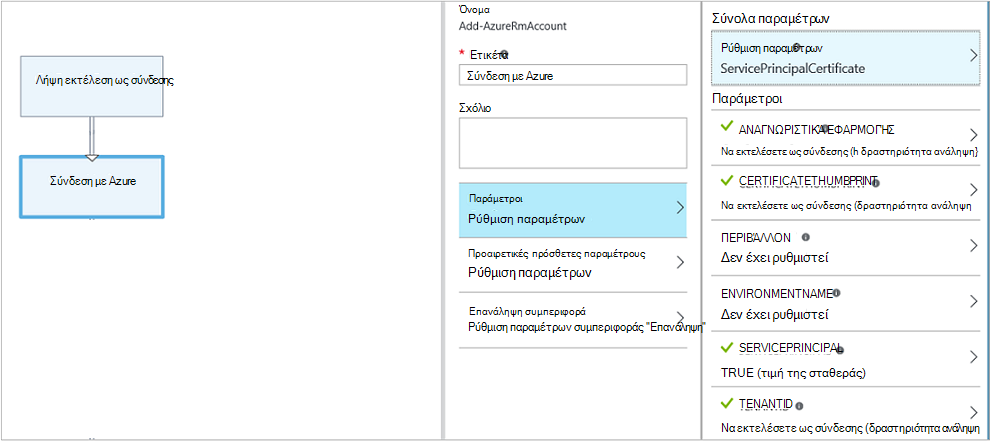 
Για τις παραμέτρους **αναγνωριστικά ΕΦΑΡΜΟΓΉΣ**, **CERTIFICATETHUMBPRINT**και **TENANTID** θα πρέπει να καθορίσετε το όνομα της ιδιότητας για τη διαδρομή του πεδίου, επειδή η δραστηριότητα εξόδους ενός αντικειμένου με πολλές ιδιότητες.  Διαφορετικά όταν εκτελείτε runbook, θα αποτύχει για τον έλεγχο ταυτότητας.  Αυτό είναι τι χρειάζεστε τουλάχιστον για τον έλεγχο ταυτότητας του runbook με το λογαριασμό εκτέλεση ως.

Για να διατηρήσετε προς τα πίσω συμβατότητας για τους συνδρομητές που έχετε δημιουργήσει ένα λογαριασμό αυτοματισμού χρησιμοποιώντας ένα [λογαριασμό χρήστη Azure AD](automation-sec-configure-aduser-account.md) για τη Διαχείριση Azure υπηρεσίας διαχείρισης (ASM) ή διαχείριση πόρων Azure πόρων, η μέθοδος για τον έλεγχο ταυτότητας είναι το cmdlet Προσθήκη AzureAccount με ένα [περιουσιακών στοιχείων διαπιστευτηρίων](http://msdn.microsoft.com/library/dn940015.aspx) που αντιπροσωπεύει έναν χρήστη υπηρεσίας καταλόγου Active Directory με την πρόσβαση στο λογαριασμό Azure.

Μπορείτε να προσθέσετε αυτή η λειτουργία σε ένα γραφικό runbook με την προσθήκη ενός περιουσιακού στοιχείου διαπιστευτηρίων στον καμβά ακολουθούμενο από μια προσθήκη AzureAccount δραστηριότητα.  Προσθήκη AzureAccount χρησιμοποιεί τη δραστηριότητα διαπιστευτηρίων για την εισαγωγή δεδομένων.  Αυτό φαίνεται στο παρακάτω παράδειγμα.

Πρέπει να ελέγχουν την ταυτότητα κατά την έναρξη του runbook και μετά από κάθε σημείο ελέγχου.  Αυτό σημαίνει ότι η προσθήκη μιας δραστηριότητας πρόσθεση Προσθήκη AzureAccount μετά από οποιοδήποτε σημείο ελέγχου-δραστηριότητα ροής εργασίας. Δεν χρειάζεται μια δραστηριότητα διαπιστευτηρίων πρόσθεση δεδομένου ότι μπορείτε να χρησιμοποιήσετε το ίδιο 

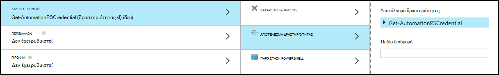

## Runbook εισόδου και εξόδου

### Εισαγωγή δεδομένων Runbook

Μια runbook μπορεί να απαιτεί εισαγωγή δεδομένων από ένα χρήστη κατά την εκκίνηση του runbook μέσω της πύλης Azure ή από άλλη runbook εάν το τρέχον αρχείο χρησιμοποιείται ως θυγατρικό στοιχείο.
Για παράδειγμα, εάν έχετε ένα runbook που δημιουργεί μια εικονική μηχανή, ίσως χρειαστεί να δώσετε πληροφορίες όπως το όνομα του υπολογιστή εικονικές και άλλων ιδιοτήτων κάθε φορά που ξεκινάτε runbook.  

Αποδοχή εισαγωγής για ένα runbook καθορίζοντας μία ή περισσότερες παράμετροι εισόδου.  Δώστε τιμές για αυτές τις παραμέτρους κάθε φορά που γίνεται εκκίνηση του runbook.  Όταν ξεκινάτε ένα runbook με την πύλη του Azure, αυτό θα σας ζητήσει να παράσχετε τιμές για το καθένα από παραμέτρους εισόδου του runbook.

Μπορείτε να αποκτήσετε πρόσβαση σε παραμέτρους εισόδου για μια runbook κάνοντας κλικ στο κουμπί **εισόδου και εξόδου** στη γραμμή εργαλείων runbook.  

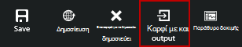 

Έτσι ανοίγει το στοιχείο **εισόδου και εξόδου** ελέγχου όπου μπορείτε να επεξεργαστείτε μια υπάρχουσα παράμετρο εισόδου ή να δημιουργήσετε ένα νέο, κάνοντας κλικ στην επιλογή **Προσθήκη εισαγωγής**. 

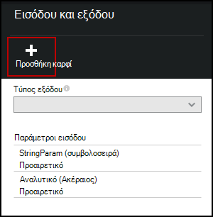

Κάθε παράμετρο εισόδου ορίζεται από τις ιδιότητες στον παρακάτω πίνακα.

|Ιδιότητα|Περιγραφή|
|:---|:---|
| Όνομα | Το μοναδικό όνομα της παραμέτρου.  Αυτό μπορεί να περιέχει μόνο άλφα αριθμητικούς χαρακτήρες και δεν μπορεί να περιέχει κενό διάστημα. |
| Περιγραφή | Μια προαιρετική περιγραφή για την παράμετρο εισόδου.  |
| Τύπος | Τύπος δεδομένων που αναμένεται για την τιμή της παραμέτρου.  Πύλη του Azure παρέχει ένα κατάλληλο στοιχείο ελέγχου για τον τύπο δεδομένων για κάθε παράμετρο κατά την προτροπή για εισαγωγή δεδομένων. |
| Υποχρεωτική | Καθορίζει εάν πρέπει να δοθεί μια τιμή για την παράμετρο.  Δεν είναι δυνατή η εκκίνηση του runbook, εάν δεν παρέχεται μια τιμή για κάθε παράμετρο υποχρεωτικό που δεν έχει καθοριστεί προεπιλεγμένη τιμή. |
| Προεπιλεγμένη τιμή | Καθορίζει την τιμή που χρησιμοποιείται για την παράμετρο, εάν δεν παρέχεται.  Αυτό μπορεί να είναι Null ή μια συγκεκριμένη τιμή. |

### Runbook εξόδου

Δεδομένων που δημιουργούνται από οποιαδήποτε δραστηριότητα που δεν διαθέτει μια εξερχόμενη σύνδεση θα προστεθεί στο [αποτέλεσμα του runbook](http://msdn.microsoft.com/library/azure/dn879148.aspx).  Το αποτέλεσμα είναι αποθηκευμένο με την εργασία runbook και είναι διαθέσιμες σε ένα γονικό στοιχείο runbook όταν runbook χρησιμοποιείται ως θυγατρικό στοιχείο.  

## Παραστάσεις PowerShell

Ένα από τα πλεονεκτήματα των γραφικών σύνταξης παρέχει τη δυνατότητα να δημιουργήσετε ένα runbook με ελάχιστους γνώση του PowerShell.  Προς το παρόν, πρέπει να γνωρίζετε λίγο του PowerShell, αν και για ορισμένες [τιμές παραμέτρων](#activities) συμπληρώνετε και για τη ρύθμιση [σύνδεσης συνθήκες](#links-and-workflow).  Αυτή η ενότητα παρέχει μια γρήγορη εισαγωγή σε παραστάσεις PowerShell για αυτούς τους χρήστες που ενδέχεται να μην είναι εξοικειωμένοι με αυτό.  Πλήρεις λεπτομέρειες του PowerShell είναι διαθέσιμες στη [Δημιουργία δέσμης ενεργειών με το Windows PowerShell](http://technet.microsoft.com/library/bb978526.aspx). 

### Προέλευση δεδομένων παράσταση PowerShell

Μπορείτε να χρησιμοποιήσετε μια παράσταση PowerShell ως προέλευση δεδομένων για τη συμπλήρωση της τιμής της μια [παράμετρο δραστηριότητας](#activities) με τα αποτελέσματα της ορισμένες κώδικα PowerShell.  Αυτό θα μπορούσε να είναι μία γραμμή του κώδικα που εκτελεί κάποια λειτουργία απλό ή πολλές γραμμές που εκτελούν ορισμένες περίπλοκη λογική.  Οποιαδήποτε Έξοδος από μια εντολή που δεν έχει εκχωρηθεί σε μια μεταβλητή είναι εξόδου για την τιμή της παραμέτρου. 

Για παράδειγμα, την παρακάτω εντολή θα εξόδου την τρέχουσα ημερομηνία. 

    Get-Date

Τις παρακάτω εντολές Δόμηση συμβολοσειράς από την τρέχουσα ημερομηνία και να την εκχωρήσετε σε μια μεταβλητή.  Τα περιεχόμενα της μεταβλητής αποστέλλονται, στη συνέχεια, το αποτέλεσμα 

    $string = "The current date is " + (Get-Date)
    $string

Τις παρακάτω εντολές αξιολογεί την τρέχουσα ημερομηνία και επιστρέφει μια συμβολοσειρά που υποδεικνύει εάν η τρέχουσα ημέρα είναι σαββατοκύριακο ή ημέρα της εβδομάδας. 

    $date = Get-Date
    if (($date.DayOfWeek = "Saturday") -or ($date.DayOfWeek = "Sunday")) { "Weekend" }
    else { "Weekday" }
    
 
### Αποτέλεσμα δραστηριότητας

Για να χρησιμοποιήσετε το αποτέλεσμα από μια προηγούμενη δραστηριότητα runbook, χρησιμοποιήστε τη μεταβλητή $ActivityOutput με την ακόλουθη σύνταξη.

    $ActivityOutput['Activity Label'].PropertyName

Για παράδειγμα, μπορεί να έχετε μια δραστηριότητα με μια ιδιότητα που απαιτεί το όνομα του μια εικονική μηχανή σε αυτήν την περίπτωση, μπορείτε να χρησιμοποιήσετε την ακόλουθη παράσταση.

    $ActivityOutput['Get-AzureVm'].Name

Εάν η ιδιότητα που απαιτείται η εικονική μηχανή αντικείμενο αντί απλώς μια ιδιότητα, θα επιστρέψει το σύνολο του αντικειμένου χρησιμοποιώντας την ακόλουθη σύνταξη.

    $ActivityOutput['Get-AzureVm']

Μπορείτε επίσης να χρησιμοποιήσετε το αποτέλεσμα μιας δραστηριότητας σε μια πιο σύνθετη παράσταση όπως τα ακόλουθα που συνδέει κειμένου στο όνομα εικονική μηχανή.

    "The computer name is " + $ActivityOutput['Get-AzureVm'].Name

### Συνθήκες

Τελεστές [σύγκρισης](https://technet.microsoft.com/library/hh847759.aspx) για να συγκρίνετε τις τιμές ή να καθορίσετε εάν μια τιμή που ταιριάζει με ένα συγκεκριμένο μοτίβο.  Σύγκριση επιστρέφει μια τιμή $true ή $false.

Για παράδειγμα, η ακόλουθη προϋπόθεση για Καθορίζει εάν η εικονική μηχανή από δραστηριότητα που ονομάζεται *Get-AzureVM* είναι προς το παρόν *διακοπεί*. 

    $ActivityOutput["Get-AzureVM"].PowerState –eq "Stopped"

Η ακόλουθη προϋπόθεση για ελέγχει εάν η ίδια εικονική μηχανή είναι σε οποιαδήποτε κατάσταση εκτός από *διακοπεί*.

    $ActivityOutput["Get-AzureVM"].PowerState –ne "Stopped"

Μπορείτε να συμμετάσχετε σε πολλές συνθήκες χρησιμοποιώντας έναν [λογικό τελεστή](https://technet.microsoft.com/library/hh847789.aspx) όπως **- και** ή **- ή**.  Για παράδειγμα, η ακόλουθη προϋπόθεση για ελέγχει εάν η ίδια εικονική μηχανή στο προηγούμενο παράδειγμα είναι σε κατάσταση *διακοπεί* ή *Διακοπή*.

    ($ActivityOutput["Get-AzureVM"].PowerState –eq "Stopped") -or ($ActivityOutput["Get-AzureVM"].PowerState –eq "Stopping") 

### Hashtables

[Hashtables](http://technet.microsoft.com/library/hh847780.aspx) είναι ζεύγη ονόματος/τιμής που είναι χρήσιμη για την επιστροφή ένα σύνολο τιμών.  Ιδιότητες για ορισμένες δραστηριότητες μπορεί να αναμένετε μια hashtable αντί για μια απλή τιμή.  Μπορείτε επίσης να δείτε ως hashtable αναφέρεται ως ένα λεξικό. 

Μπορείτε να δημιουργήσετε μια hashtable με την ακόλουθη σύνταξη.  Μια hashtable μπορούν να περιέχουν οποιονδήποτε αριθμό καταχωρήσεων, αλλά κάθε ορίζεται από ένα όνομα και μια τιμή.

    @{ <name> = <value>; [<name> = <value> ] ...}

Για παράδειγμα, η ακόλουθη παράσταση δημιουργεί μια hashtable που θα χρησιμοποιηθεί στην προέλευση δεδομένων για μια παράμετρο δραστηριότητας που αναμένεται μια hashtable με τις τιμές για μια αναζήτηση στο internet.

    $query = "Azure Automation"
    $count = 10
    $h = @{'q'=$query; 'lr'='lang_ja';  'count'=$Count}
    $h

Το παρακάτω παράδειγμα χρησιμοποιεί εξόδου από δραστηριότητα που ονομάζεται *Λήψη σύνδεσης του Twitter* για να συμπληρώσετε μια hashtable.

    @{'ApiKey'=$ActivityOutput['Get Twitter Connection'].ConsumerAPIKey;
      'ApiSecret'=$ActivityOutput['Get Twitter Connection'].ConsumerAPISecret;
      'AccessToken'=$ActivityOutput['Get Twitter Connection'].AccessToken;
      'AccessTokenSecret'=$ActivityOutput['Get Twitter Connection'].AccessTokenSecret}

## Επόμενα βήματα

- Για να ξεκινήσετε με το PowerShell runbooks ροής εργασίας, ανατρέξτε στο θέμα [μου πρώτη runbook PowerShell ροής εργασίας](automation-first-runbook-textual.md) 
- Για να ξεκινήσετε με runbooks γραφικών, ανατρέξτε στο θέμα [μου πρώτη runbook γραφικών](automation-first-runbook-graphical.md)
- Για να μάθετε περισσότερα σχετικά με τους τύπους runbook, τους πλεονεκτήματα και τους περιορισμούς, ανατρέξτε στο θέμα [τύποι runbook αυτοματισμού Azure](automation-runbook-types.md)
- Για να κατανοήσετε τον τρόπο ελέγχου ταυτότητας χρησιμοποιώντας το λογαριασμό αυτοματισμού εκτέλεση ως, ανατρέξτε στο θέμα [Ρύθμιση παραμέτρων Azure εκτελείται ως λογαριασμός](automation-sec-configure-azure-runas-account.md)
 
