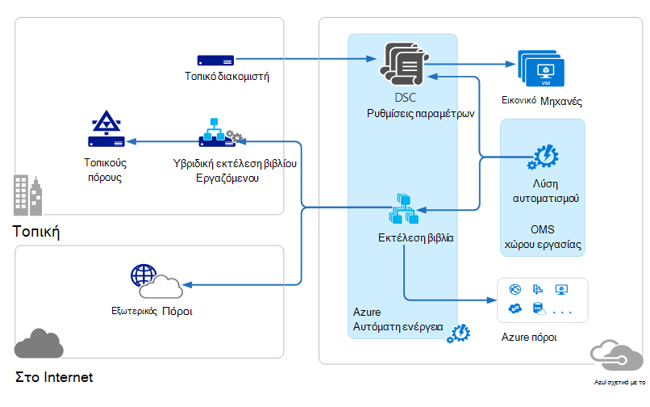
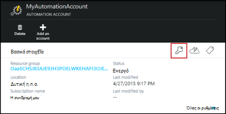
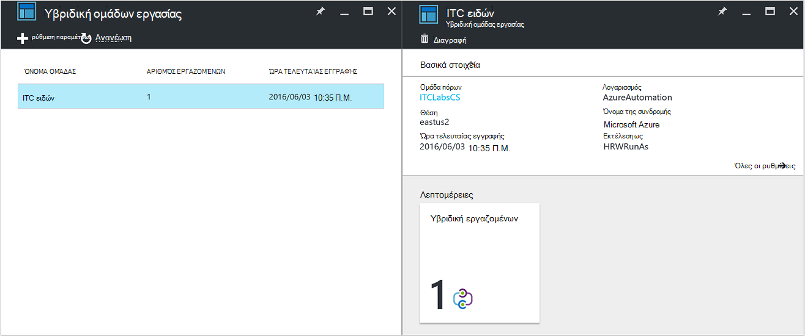
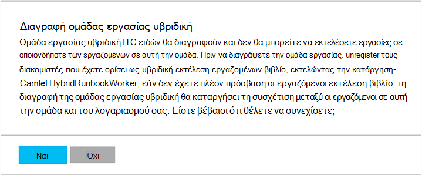

<properties
   pageTitle="Azure αυτοματισμού υβριδική Runbook εργαζομένων | Microsoft Azure"
   description="Σε αυτό το άρθρο παρέχει πληροφορίες σχετικά με την εγκατάσταση και χρήση υβριδική Runbook εργασίας που είναι μια δυνατότητα της αυτοματοποίησης Azure που σας επιτρέπει να εκτελέσετε runbooks σε υπολογιστές στο κέντρο τοπικών δεδομένων."
   services="automation"
   documentationCenter=""
   authors="mgoedtel"
   manager="jwhit"
   editor="tysonn" />
<tags
   ms.service="automation"
   ms.devlang="na"
   ms.topic="article"
   ms.tgt_pltfrm="na"
   ms.workload="infrastructure-services"
   ms.date="10/14/2016"
   ms.author="bwren" />

# Azure αυτοματισμού υβριδική Runbook εργαζομένων

Runbooks στο Azure Automation δεν έχουν πρόσβαση πόρους στο κέντρο τοπικών δεδομένων καθώς εκτελούνται στο Azure cloud.  Τη δυνατότητα υβριδικής Runbook εργαζόμενου του Azure αυτοματισμού σάς επιτρέπει να εκτελέσετε runbooks σε υπολογιστές που βρίσκεται στο κέντρο δεδομένων σας για να διαχειριστείτε τοπικούς πόρους. Το runbooks αποθηκεύονται και διαχείρισης από το Azure αυτοματισμού και, στη συνέχεια, να παραδοθεί σε έναν ή περισσότερους υπολογιστές εσωτερικής εγκατάστασης.  

Αυτή η λειτουργία απεικονίζεται στην παρακάτω εικόνα.   

Μπορείτε να ορίσετε έναν ή περισσότερους υπολογιστές στο κέντρο δεδομένων για εκτέλεση ενεργειών ως εργαζόμενος Runbook υβριδική και την εκτέλεση runbooks από το Azure αυτοματισμού.  Κάθε εργασίας απαιτεί το Microsoft Agent διαχείρισης με μια σύνδεση για την οικογένεια προγραμμάτων του Microsoft λειτουργίες διαχείρισης και το περιβάλλον runbook Azure αυτοματισμού.  Λειτουργίες διαχείρισης οικογένεια χρησιμοποιείται μόνο για να εγκαταστήσετε και να διατηρήσετε τον παράγοντα διαχείρισης και να παρακολουθείτε τη λειτουργικότητα ο εργαζόμενος.  Η παράδοση runbooks και την οδηγία για να εκτελέσετε τις εκτελούνται από Azure αυτοματισμού.

Υπάρχουν απαιτήσεις εισερχομένων του τείχους προστασίας για την υποστήριξη υβριδική Runbook εργαζομένων. Ο παράγοντας στον τοπικό υπολογιστή προετοιμάζει όλες οι επικοινωνίες με αυτοματοποίηση Azure στο cloud. Όταν ξεκινήσει μια runbook, αυτοματισμού Azure δημιουργεί μια εντολή που έχει ανακτηθεί από τον παράγοντα. Ο παράγοντας, στη συνέχεια, χρησιμοποιεί τα προς τα κάτω runbook και οποιεσδήποτε παραμέτρους πριν από την εκτέλεση του.  Θα ανακτήσει επίσης οποιαδήποτε [πόρους](http://msdn.microsoft.com/library/dn939988.aspx) που χρησιμοποιούνται από runbook από το Azure αυτοματισμού.

>[AZURE.NOTE] Υβριδική Runbook εργαζομένων δεν υποστηρίζουν αυτήν τη στιγμή [DSC ρυθμίσεις παραμέτρων](automation-dsc-overview.md).

## Υβριδική εργαζόμενου Runbook ομάδες

Κάθε εργαζόμενου Runbook υβριδική είναι μέλος μιας ομάδας εργασίας Runbook υβριδική που καθορίζετε όταν εγκαθιστάτε τον παράγοντα.  Μια ομάδα μπορεί να περιλαμβάνει ένα μεμονωμένο παράγοντα, αλλά μπορείτε να το εγκαταστήσετε Πολλαπλοί παράγοντες σε μια ομάδα για υψηλή διαθεσιμότητα.

Όταν ξεκινάτε ένα runbook σε υβριδική εργαζόμενος Runbook, μπορείτε να καθορίσετε την ομάδα που θα εκτελείται σε.  Τα μέλη της ομάδας θα καθορίσει ποιες εργαζόμενου θα εξυπηρέτηση της αίτησης.  Δεν μπορείτε να καθορίσετε έναν συγκεκριμένο υπάλληλο.

## Υβριδική εργαζόμενου Runbook απαιτήσεις

Πρέπει να προσδιορίσετε τουλάχιστον έναν υπολογιστή εσωτερικής εγκατάστασης για να εκτελέσετε εργασίες runbook υβριδική.  Αυτός ο υπολογιστής πρέπει να έχει τα εξής:

- Windows Server 2012 ή νεότερη έκδοση
- 4.0 ή νεότερη έκδοση του Windows PowerShell
- Τουλάχιστον δύο πυρήνων και 4 GB RAM

Λάβετε υπόψη τις παρακάτω συστάσεις για την υβριδική εργαζομένων: 

- Καθορίστε πολλές υβριδική εργαζομένων σε κάθε ομάδα για υψηλή διαθεσιμότητα.  
- Υβριδική εργαζομένων μπορούν να συνυπάρχουν με υπηρεσία διαχείρισης αυτοματισμού ή σύστημα κέντρο Orchestrator διακομιστές runbook.
- Μπορείτε να χρησιμοποιήσετε έναν υπολογιστή που βρίσκεται φυσικά στο ή κοντά την περιοχή του λογαριασμού σας αυτοματισμού, επειδή τα δεδομένα του έργου αποστέλλεται στη Azure αυτοματισμού, όταν ολοκληρωθεί μια εργασία.

>[AZURE.NOTE] Υβριδική Runbook εργαζόμενου έκδοση 7.2.11136.0 υποστηρίζουν αυτήν τη στιγμή επικοινωνία μέσω ενός διακομιστή μεσολάβησης μόνο με δεσμών ενεργειών του PowerShell.  Υποστήριξη για τις δέσμες ενεργειών PowerShell ροής εργασίας θα είναι διαθέσιμη σε μελλοντική έκδοση.  

### Ρύθμιση παραμέτρων διακομιστή μεσολάβησης και το τείχος προστασίας

Για τον εργαζόμενο Runbook υβριδική εσωτερική εγκατάσταση για να συνδεθείτε και να εγγραφείτε στην υπηρεσία Microsoft λειτουργίες διαχείρισης οικογένεια προγραμμάτων (OMS), πρέπει να έχει πρόσβαση σε τον αριθμό θύρας και τις διευθύνσεις URL που περιγράφεται παρακάτω.  Αυτό είναι εκτός από τις [θύρες και διευθύνσεων URL που απαιτούνται για το Microsoft Agent παρακολούθησης](../log-analytics/log-analytics-proxy-firewall.md#configure-proxy-and-firewall-settings-with-the-microsoft-monitoring-agent) για να συνδεθείτε με OMS. Εάν χρησιμοποιείτε διακομιστή μεσολάβησης για την επικοινωνία μεταξύ τον παράγοντα και η υπηρεσία OMS, θα πρέπει να βεβαιωθείτε ότι οι κατάλληλες πόροι είναι προσβάσιμα. Εάν χρησιμοποιείτε ένα τείχος προστασίας για να περιορίσετε την πρόσβαση στο Internet, πρέπει να ρυθμίσετε τις παραμέτρους του τείχους προστασίας για να επιτρέψετε την πρόσβαση. 

Οι πληροφορίες κάτω από τη λίστα τη θύρα και διευθύνσεις URL που απαιτούνται για τον εργαζόμενο Runbook υβριδική για να επικοινωνήσετε με τον αυτοματισμό.

- Θύρα: Μόνο TCP 443 είναι απαραίτητη για το εξερχόμενο πρόσβαση στο Internet
- Καθολική διεύθυνση URL: *.azure-automation.net

Εάν έχετε ένα λογαριασμό αυτοματισμού που ορίζονται για μια συγκεκριμένη περιοχή και θέλετε να περιορίσετε επικοινωνία με συγκεκριμένο τοπικό Κέντρο δεδομένων, ο παρακάτω πίνακας παρέχει την εγγραφή DNS για κάθε περιοχή.

|**Περιοχή**|**Εγγραφή DNS**|
|--------------|--------------|
|Νότια κεντρικής η.π.α.|scus-jobruntimedata-ειδών-su1.azure-automation.net|
|2 Ανατολικής η.π.α.|eus2-jobruntimedata-ειδών-su1.azure-automation.net|
|Δυτική Ευρώπη|θα σας-jobruntimedata-ειδών-su1.azure-automation.net|
|Βόρεια Ευρώπη|Επόμενο-jobruntimedata-ειδών-su1.azure-automation.net|
|Κεντρική ώρα Καναδά|"Κοιν."-jobruntimedata-ειδών-su1.azure-automation.net|
|Νότια Ανατολικής Ασίας|θαλάσσια-jobruntimedata-ειδών-su1.azure-automation.net|
|Κεντρική Ινδίας|CID-jobruntimedata-ειδών-su1.azure-automation.net|
|Ιαπωνία Ανατολή|jpe-jobruntimedata-ειδών-su1.azure-automation.net|
|Νότος Ανατολική Αυστραλία|ASE-jobruntimedata-ειδών-su1.azure-automation.net|

## Κατά την εγκατάσταση της υβριδικής Runbook εργαζόμενου

Η παρακάτω διαδικασία περιγράφει τον τρόπο εγκατάστασης και ρύθμισης παραμέτρων υβριδικής Runbook εργασίας.  Εκτελέστε τα πρώτα δύο βήματα μία φορά για το περιβάλλον αυτοματισμού και, στη συνέχεια, επαναλάβετε τα υπόλοιπα βήματα για κάθε υπολογιστή εργασίας.

### 1. Δημιουργία λειτουργίες διαχείρισης οικογένεια χώρου εργασίας

Εάν δεν έχετε ήδη ένα χώρο εργασίας λειτουργίες διαχείρισης οικογένεια, στη συνέχεια, δημιουργήστε μία χρησιμοποιώντας οδηγίες κατά τη [Ρύθμιση του χώρου εργασίας σας](https://technet.microsoft.com/library/mt484119.aspx). Μπορείτε να χρησιμοποιήσετε έναν υπάρχοντα χώρο εργασίας, εάν έχετε ήδη ένα.

### 2. Προσθήκη λύσης αυτοματισμού λειτουργίες διαχείρισης οικογένεια χώρο εργασίας

Λύσεις προσθέσετε λειτουργικότητα στην οικογένεια προγραμμάτων διαχείρισης λειτουργίες.  Η λύση αυτοματισμού προσθέτει λειτουργικότητα για Azure αυτοματισμού, συμπεριλαμβανομένης της υποστήριξης για υβριδική Runbook εργασίας.  Κατά την προσθήκη της λύσης στο χώρο εργασίας σας, αυτό θα push αυτόματα προς τα κάτω στοιχεία εργασίας στον υπολογιστή παράγοντα που θα εγκαταστήσετε στο επόμενο βήμα.

Ακολουθήστε τις οδηγίες στην ενότητα [για να προσθέσετε μια λύση, χρησιμοποιώντας τη συλλογή λύσεων](../log-analytics/log-analytics-add-solutions.md) για να προσθέσετε τη λύση **αυτοματισμού** στο χώρο εργασίας σας λειτουργίες διαχείρισης οικογένεια.

### 3. εγκατάσταση του Microsoft Agent παρακολούθησης

Το Microsoft Agent παρακολούθηση συνδέει υπολογιστές στην οικογένεια προγραμμάτων διαχείρισης λειτουργίες.  Όταν έχετε εγκαταστήσει τον παράγοντα στον υπολογιστή σας στην εσωτερική εγκατάσταση και σύνδεσή του στο χώρο εργασίας σας, αυτόματη λήψη τα στοιχεία που απαιτούνται για το υβριδικό Runbook εργασίας.

Ακολουθήστε τις οδηγίες στο [υπολογιστές σύνδεση Windows την ανάλυση καταγραφής](../log-analytics/log-analytics-windows-agents.md) για να εγκαταστήσετε τον παράγοντα στον υπολογιστή εσωτερικής εγκατάστασης.  Μπορείτε να επαναλάβετε αυτήν τη διαδικασία για πολλούς υπολογιστές για να προσθέσετε πολλές εργαζομένων για το περιβάλλον σας.

Όταν ο παράγοντας έχει συνδεθεί με επιτυχία στην οικογένεια προγραμμάτων διαχείρισης λειτουργίες, θα εμφανίζονται στην καρτέλα **Συνδεδεμένοι προελεύσεις** του παράθυρο λειτουργίες διαχείρισης οικογένεια **Ρυθμίσεις** .  Μπορείτε να επαληθεύσετε ότι ο παράγοντας σωστά λάβει τη λύση αυτοματισμού όταν έχει ένα φάκελο που ονομάζεται **AzureAutomationFiles** στο Agent\Agent παρακολούθηση C:\Program Files\Microsoft.  Για να επιβεβαιώσετε την έκδοση του ο εργαζόμενος Runbook υβριδική, μπορείτε να περιηγηθείτε σε Agent\Agent\AzureAutomation\ παρακολούθηση C:\Program Files\Microsoft και σημειώστε την \\υποφάκελος *έκδοση* .   

### 4. στο περιβάλλον runbook εγκαταστήσετε και να συνδεθείτε με αυτοματισμού Azure

Όταν προσθέτετε έναν παράγοντα στην οικογένεια προγραμμάτων λειτουργίες διαχείρισης, η λύση αυτοματισμού προωθεί προς τα κάτω τη λειτουργική μονάδα PowerShell **HybridRegistration** που περιέχει το cmdlet **Προσθήκη HybridRunbookWorker** .  Μπορείτε να χρησιμοποιήσετε αυτό το cmdlet για να εγκαταστήσετε το περιβάλλον runbook στον υπολογιστή και να καταχωρήσετε με αυτοματοποίηση Azure.

Ανοίξτε μια περίοδο λειτουργίας PowerShell σε κατάσταση λειτουργίας διαχειριστή και εκτελέστε τις ακόλουθες εντολές για να εισαγάγετε τη λειτουργική μονάδα.

    cd "C:\Program Files\Microsoft Monitoring Agent\Agent\AzureAutomation\<version>\HybridRegistration"
    Import-Module HybridRegistration.psd1

Στη συνέχεια, εκτελέστε το cmdlet **Προσθήκη HybridRunbookWorker** χρησιμοποιώντας την ακόλουθη σύνταξη:

    Add-HybridRunbookWorker –Name <String> -EndPoint <Url> -Token <String>

Μπορείτε να λάβετε τις πληροφορίες που απαιτούνται για αυτό το cmdlet από τη **Διαχείριση κλειδιών** blade στην πύλη του Azure.  Ανοίξτε αυτό blade κάνοντας κλικ στο εικονίδιο κλειδιού στον πίνακα στοιχεία για το λογαριασμό αυτοματισμού.

- **Όνομα** είναι το όνομα της ομάδας εργασίας Runbook υβριδική. Εάν αυτή η ομάδα υπάρχει ήδη στο λογαριασμό αυτοματισμού, στη συνέχεια, τον τρέχοντα υπολογιστή προστίθεται σε αυτό.  Εάν δεν υπάρχει ήδη, στη συνέχεια, θα προστεθεί.
- **Τελικό σημείο** είναι στο πεδίο **διεύθυνση URL** του blade **Διαχείριση κλειδιών** .
- **Διακριτικού** είναι το **Πρωτεύον κλειδί πρόσβασης** το blade **Διαχείριση κλειδιών** .  

Χρησιμοποιήστε το **-λεπτομερής** εναλλαγή με **Προσθήκη HybridRunbookWorker** για να λάβετε λεπτομερείς πληροφορίες σχετικά με την εγκατάσταση.

### 5. εγκατάσταση του PowerShell λειτουργικές μονάδες

Runbooks να χρησιμοποιήσετε οποιαδήποτε από τις δραστηριότητες και τα cmdlet του που ορίζονται από το στις λειτουργικές μονάδες εγκατεστημένο στο περιβάλλον του Azure αυτοματισμού.  Αυτές οι λειτουργικές μονάδες δεν αυτόματα αναπτύσσονται σε υπολογιστές εσωτερικής όμως, ώστε να πρέπει να τα εγκαταστήσετε με μη αυτόματο τρόπο.  Η εξαίρεση είναι τη λειτουργική μονάδα Azure που είναι εγκατεστημένο από προεπιλογή, παρέχοντας πρόσβαση στα cmdlet του για όλες τις υπηρεσίες του Azure και δραστηριότητες για την αυτοματοποίηση Azure.

Δεδομένου ότι ο βασικός σκοπός της δυνατότητας υβριδική Runbook εργασίας για να διαχειριστείτε τοπικούς πόρους, πιθανότατα θα πρέπει να εγκαταστήσετε τις λειτουργικές μονάδες που υποστηρίζουν αυτούς τους πόρους.  Μπορείτε να ανατρέξετε για [Την εγκατάσταση του λειτουργικές μονάδες](http://msdn.microsoft.com/library/dd878350.aspx) για πληροφορίες σχετικά με την εγκατάσταση του Windows PowerShell λειτουργικές μονάδες.

## Κατάργηση του υβριδικού Runbook εργαζόμενου

Μπορείτε να καταργήσετε μία ή περισσότερες εργαζομένων Runbook υβριδική από μια ομάδα ή μπορείτε να καταργήσετε την ομάδα, ανάλογα με τις απαιτήσεις σας.  Για να καταργήσετε εργαζόμενο Runbook υβριδική από έναν υπολογιστή εσωτερικής εγκατάστασης, ανοίξτε μια περίοδο λειτουργίας PowerShell σε κατάσταση λειτουργίας διαχειριστή και εκτελέστε την ακόλουθη εντολή - **Κατάργηση HybridRunbookWorker** cmdlet.  Χρησιμοποιήστε το **-λεπτομερής** εναλλαγή για ένα λεπτομερές αρχείο καταγραφής της διαδικασίας κατάργησης. 

Αυτό δεν καταργεί τον αντιπρόσωπο της Microsoft παρακολούθηση από τον υπολογιστή, μόνο τη λειτουργικότητα και ρύθμισης παραμέτρων του ρόλου υβριδική Runbook εργασίας.  

Για να καταργήσετε μια ομάδα, πρέπει πρώτα να καταργήσετε ο εργαζόμενος Runbook υβριδική από κάθε υπολογιστής που είναι μέλος της ομάδας με την εντολή φαίνεται παραπάνω και, στη συνέχεια, μπορείτε να εκτελέσετε τα παρακάτω βήματα για να καταργήσετε την ομάδα.  

1. Ανοίξτε το λογαριασμό αυτοματισμού στην πύλη του Azure.
2. Επιλέξτε το πλακίδιο **Υβριδική ομάδες εργασίας** και στο το blade **Υβριδική ομάδων εργασίας** , επιλέξτε την ομάδα που θέλετε να διαγράψετε.  Αφού επιλέξετε τη συγκεκριμένη ομάδα, εμφανίζεται το blade ιδιότητες **υβριδική ομάδας εργασίας** .     
3. Στην το blade ιδιότητες για την επιλεγμένη ομάδα, κάντε κλικ στην επιλογή **Διαγραφή**.  Ένα μήνυμα θα εμφανιστεί που σας ζητά να επιβεβαιώσετε αυτήν την ενέργεια, και επιλέξτε **Ναι** , εάν είστε βέβαιοι ότι θέλετε να συνεχίσετε.    Αυτή η διαδικασία μπορεί να διαρκέσει αρκετά δευτερόλεπτα για να ολοκληρωθεί και μπορείτε να παρακολουθείτε την πρόοδο του έργου στην περιοχή **ειδοποιήσεων** από το μενού.  

## Εκκίνηση runbooks σε υβριδική Runbook εργαζόμενου

[Ξεκινώντας μια Runbook στο Azure Automation](automation-starting-a-runbook.md) περιγράφει τις διαφορετικές μεθόδους για την εκκίνηση ενός runbook.  Υβριδική Runbook εργαζόμενου προσθέτει μια επιλογή **RunOn** όπου μπορείτε να καθορίσετε το όνομα της ομάδας εργασίας Runbook υβριδική.  Εάν έχει οριστεί σε ομάδα, στη συνέχεια, runbook ανακτώνται και εκτελέστε, των εργαζομένων σε αυτήν την ομάδα.  Εάν αυτή η επιλογή δεν έχει καθοριστεί, στη συνέχεια, που εκτελείται στο Azure Automation κανονικά.

Όταν ξεκινάτε μια runbook στην πύλη του Azure, θα εμφανιστεί με μια επιλογή **εκτελείται σε** όπου μπορείτε να επιλέξετε **Azure** ή **Υβριδικό εργασίας**.  Εάν επιλέξετε **Υβριδική εργαζόμενου**, στη συνέχεια, μπορείτε να επιλέξετε την ομάδα από μια αναπτυσσόμενη λίστα.

Χρησιμοποιήστε την παράμετρο **RunOn** που μπορείτε να χρησιμοποιήσετε την παρακάτω εντολή για να ξεκινήσετε μια runbook που ονομάζεται έλεγχος-Runbook σε μια ομάδα εργασίας Runbook υβριδική με το όνομα MyHybridGroup χρησιμοποιώντας το Windows PowerShell.

    Start-AzureRmAutomationRunbook –AutomationAccountName "MyAutomationAccount" –Name "Test-Runbook" -RunOn "MyHybridGroup"

>[AZURE.NOTE] Η παράμετρος **RunOn** προστέθηκε το cmdlet **Έναρξη AzureAutomationRunbook** στην έκδοση 0.9.1 του Microsoft Azure PowerShell.  Θα πρέπει να [κάνετε λήψη της πιο πρόσφατης έκδοσης](https://azure.microsoft.com/downloads/) εάν έχετε μια προηγούμενη εγκατεστημένη μία.  Μόνο πρέπει να εγκαταστήσετε αυτήν την έκδοση σε μια σταθμούς εργασίας όπου που θα ξεκινήσετε runbook από το Windows PowerShell.  Δεν χρειάζεται να το εγκαταστήσετε στον υπολογιστή εργασίας εκτός και εάν σκοπεύετε να ξεκινήσετε runbooks από αυτόν τον υπολογιστή.  Προς το παρόν, μπορείτε να ξεκινήσετε μια runbook στην υβριδική εργαζόμενος Runbook από μια άλλη runbook επειδή αυτό απαιτείται η πιο πρόσφατη έκδοση του Azure Powershell να έχουν εγκατασταθεί στο λογαριασμό σας αυτοματισμού.  Την πιο πρόσφατη έκδοση θα ενημερώνονται αυτόματα στο Azure Automation και αυτόματα προωθηθεί προς τα κάτω για να οι εργαζόμενοι σύντομα.

## Δικαιώματα Runbook

Runbooks εκτελείται σε υβριδική Runbook ο εργαζόμενος δεν μπορείτε να χρησιμοποιήσετε την ίδια [μέθοδο που χρησιμοποιείται συνήθως για runbooks τον έλεγχο ταυτότητας με Azure πόρους](automation-configuring.md#configuring-authentication-to-azure-resources) εφόσον αυτά θα έχουν πρόσβαση σε πόρους εκτός του Azure.  Runbook είτε μπορούν να παρέχουν τη δική του ελέγχου ταυτότητας τοπικούς πόρους ή μπορείτε να καθορίσετε ένα λογαριασμό RunAs για την παροχή περιβάλλον εργασίας χρήστη runbooks όλων.

### Έλεγχος ταυτότητας Runbook

Από προεπιλογή, runbooks θα εκτελεστεί στο περιβάλλον του λογαριασμού του τοπικού συστήματος στον υπολογιστή εσωτερικής εγκατάστασης, ώστε να επιτρέπουν τις δικές τους πόρους που θα μπορούν να έχουν πρόσβαση του ελέγχου ταυτότητας.  

Μπορείτε να χρησιμοποιήσετε [διαπιστευτηρίων](http://msdn.microsoft.com/library/dn940015.aspx) και [πιστοποιητικό](http://msdn.microsoft.com/library/dn940013.aspx) περιουσιακών στοιχείων στο σας runbook με το cmdlet που σας επιτρέπουν να καθορίσετε τα διαπιστευτήρια, ώστε να μπορείτε να τον έλεγχο ταυτότητας με διαφορετικό πόρους.  Το παρακάτω παράδειγμα εμφανίζει ένα τμήμα του ένα runbook που επανεκκίνηση του υπολογιστή.  Ανακτά τα διαπιστευτήρια από ένα πάγιο διαπιστευτηρίων και το όνομα του υπολογιστή από έναν μεταβλητή περιουσιακών στοιχείων και, στη συνέχεια, χρησιμοποιεί αυτές τις τιμές με το cmdlet επανεκκίνηση υπολογιστή.

    $Cred = Get-AzureRmAutomationCredential -ResourceGroupName "ResourceGroup01" -Name "MyCredential"
    $Computer = Get-AzureRmAutomationVariable -ResourceGroupName "ResourceGroup01" -Name  "ComputerName"

    Restart-Computer -ComputerName $Computer -Credential $Cred

Μπορείτε επίσης να αξιοποιήσετε [InlineScript](automation-powershell-workflow.md#inline-script) που σας επιτρέπουν να εκτελέσετε τμήματα κώδικα σε άλλον υπολογιστή με τα διαπιστευτήρια που καθορίζεται από την [παράμετρο κοινών PSCredential](http://technet.microsoft.com/library/jj129719.aspx).

### Λογαριασμός RunAs

Αντί να χρειάζεται runbooks παρέχουν τις δικές τους τοπικούς πόρους του ελέγχου ταυτότητας, μπορείτε να καθορίσετε ένα λογαριασμό **RunAs** για μια υβριδική ομάδας εργασίας.  Καθορίστε ένα [περιουσιακών στοιχείων διαπιστευτήρια](automation-credentials.md) που έχει πρόσβαση σε τοπικούς πόρους και όλες runbooks θα εκτελείται με αυτά τα διαπιστευτήρια όταν εκτελείται σε υβριδική Runbook εργαζόμενο στην ομάδα.  

Το όνομα χρήστη για τα διαπιστευτήρια πρέπει να είναι σε μία από τις παρακάτω μορφές:

- Τομέας\Όνομα χρήστη 
- username@domain
- όνομα χρήστη (για λογαριασμούς του τοπικού υπολογιστή εσωτερικής εγκατάστασης)

Χρησιμοποιήστε την ακόλουθη διαδικασία για να καθορίσετε ένα λογαριασμό RunAs για μια υβριδική ομάδας εργασίας:

1. Δημιουργήστε ένα [διαπιστευτηρίων περιουσιακών στοιχείων](automation-credentials.md) με πρόσβαση σε τοπικούς πόρους.
2. Ανοίξτε το λογαριασμό αυτοματισμού στην πύλη του Azure.
2. Επιλέξτε το πλακίδιο **Υβριδική ομάδες εργασίας** και, στη συνέχεια, επιλέξτε την ομάδα.
3. Επιλέξτε **όλες τις ρυθμίσεις** και, στη συνέχεια, **ρυθμίσεις ομάδας εργασίας υβριδική**.
4. Αλλαγή **Εκτέλεση ως** από **προεπιλογή** σε **προσαρμοσμένη**.
5. Επιλέξτε τα διαπιστευτήρια και κάντε κλικ στην επιλογή **Αποθήκευση**.

## Δημιουργία runbooks για υβριδική Runbook εργαζόμενου

Δεν υπάρχει διαφορά στη δομή runbooks που εκτελούνται στο αυτοματισμού Azure και σε εκείνα που εκτελούνται σε υβριδική εργαζόμενος Runbook. Runbooks που χρησιμοποιείτε με κάθε πιθανώς διαφέρουν σημαντικά μέσω εφόσον runbooks για υβριδική Runbook εργαζόμενου συνήθως θα διαχειριστείτε τοπικούς πόρους στο κέντρο δεδομένων σας ενώ runbooks στο Azure Automation συνήθως διαχείριση πόρων στο Azure cloud. 

Μπορείτε να επεξεργαστείτε ένα runbook για υβριδική Runbook εργαζόμενου σε Azure αυτοματισμού, αλλά ενδέχεται να έχετε δυσκολίες Εάν προσπαθείτε να δοκιμάσετε runbook στο πρόγραμμα επεξεργασίας.  Οι λειτουργικές μονάδες PowerShell που πρόσβαση δεν μπορεί να είναι εγκατεστημένο το τοπικούς πόρους στο περιβάλλον του Azure αυτοματισμού σε αυτήν την περίπτωση, η δοκιμή θα αποτύχει.  Εάν εγκαταστήσετε τις απαιτούμενες λειτουργικές μονάδες, στη συνέχεια, θα εκτελεστεί runbook, αλλά αυτό δεν θα μπορούν να έχουν πρόσβαση σε τοπικούς πόρους για έναν πλήρη έλεγχο.

## Αντιμετώπιση προβλημάτων runbooks στην υβριδική Runbook εργαζόμενου

[Runbook εξόδου και τα μηνύματα](automation-runbook-output-and-messages.md) αποστέλλονται αυτοματισμού Azure από υβριδική εργαζομένων όπως runbook εργασίες που εκτελούνται στο cloud.  Μπορείτε επίσης να ενεργοποιήσετε τις ροές λεπτομερές και την πρόοδό τον ίδιο τρόπο όπως θα κάνατε με άλλες runbooks.  

Αρχεία καταγραφής είναι αποθηκευμένα τοπικά σε κάθε εργαζόμενου υβριδική στο C:\ProgramData\Microsoft\System Center\Orchestrator\7.2\SMA\Sandboxes.

Εάν το runbooks δεν είναι επιτυχής completeing και η εργασία σύνοψης εμφανίζει μια κατάσταση του **σε αναστολή**, διαβάστε το άρθρο αντιμετώπισης προβλημάτων [υβριδική Runbook εργαζόμενου: μια εργασία runbook καταγγελία με κατάσταση σε αναστολή](automation-troubleshooting-hrw-runbook-terminates-suspended.md).   

## Σχέση με υπηρεσία διαχείρισης αυτοματισμού

[Υπηρεσία διαχείρισης αυτοματισμού (SMA)](https://technet.microsoft.com/library/dn469260.aspx) σάς επιτρέπει να εκτελέσετε το ίδιο runbooks που υποστηρίζονται από το Azure αυτοματισμού στο κέντρο τοπικών δεδομένων. SMA γενικά έχει αναπτυχθεί μαζί με το Windows Azure Pack, όπως το Windows Azure Pack περιέχει ένα γραφικό περιβάλλον για τη Διαχείριση SMA. Σε αντίθεση με αυτοματοποίηση Azure, SMA απαιτεί μιας τοπικής εγκατάστασης που περιλαμβάνει τους διακομιστές web για τη φιλοξενία του API, μια βάση δεδομένων θα περιέχει runbooks και τη ρύθμιση παραμέτρων SMA και εργαζομένων Runbook την εκτέλεση εργασιών runbook. Azure αυτοματισμού παρέχει αυτές τις υπηρεσίες στο cloud και απαιτεί μόνο για να διατηρήσετε την υβριδική εργαζομένων Runbook στο περιβάλλον του τοπικού.

Εάν είστε έναν υπάρχοντα χρήστη SMA, μπορείτε να μετακινήσετε το runbooks αυτοματισμού Azure που θα χρησιμοποιείται με υβριδικό Runbook εργασίας χωρίς αλλαγές, με την προϋπόθεση ότι μπορούν να εκτελούν τις δικές τους έλεγχο ταυτότητας με πόρους ως περιγράφεται στη [Δημιουργία runbooks για υβριδική Runbook εργασίας](#creating-runbooks-for-hybrid-runbook-worker).  Runbooks στο SMA εκτελούνται στο περιβάλλον του λογαριασμού της υπηρεσίας στο διακομιστή εργασίας που μπορεί να σας παρέχει ότι ο έλεγχος ταυτότητας για το runbooks.

Μπορείτε να χρησιμοποιήσετε τα ακόλουθα κριτήρια για να προσδιορίσετε εάν Azure αυτοματισμού με υβριδικό Runbook εργαζόμενος ή υπηρεσία διαχείρισης αυτοματισμού είναι πιο κατάλληλη για τις απαιτήσεις σας.

- SMA απαιτεί μιας τοπικής εγκατάστασης από τα υποκείμενα στοιχεία που είναι συνδεδεμένοι στο Windows Azure πακέτο εάν απαιτείται ένα περιβάλλον εργασίας διαχείρισης γραφικών. Θα χρειαστούν περισσότερες τοπικούς πόρους με υψηλότερη κόστος συντήρησης από αυτοματοποίηση Azure, τα οποία το μόνο που χρειάζεται έναν παράγοντα εγκατεστημένη στον τοπικό runbook εργαζομένων. Τους παράγοντες πραγματοποιείται από λειτουργίες διαχείρισης οικογένειας προγραμμάτων, μειώνοντας περαιτέρω το κόστος συντήρησης.
- Azure αυτοματισμού αποθηκεύει τις runbooks στο cloud και τους παρέχει στους εργαζόμενους Runbook υβριδική εσωτερικής εγκατάστασης. Εάν η πολιτική ασφαλείας σας δεν επιτρέπει αυτήν τη συμπεριφορά, πρέπει να χρησιμοποιήσετε SMA.
- SMA περιλαμβάνεται με το κέντρο του συστήματος; και γι ' αυτό, απαιτεί μια άδεια χρήσης του συστήματος κέντρο 2012 R2. Azure αυτοματισμού βασίζεται σε ένα μοντέλο ομότιμου συνδρομής.
- Azure αυτοματισμού περιλαμβάνει προηγμένες δυνατότητες όπως γραφικών runbooks που δεν είναι διαθέσιμες στο SMA.

## Επόμενα βήματα

- Για να μάθετε περισσότερα σχετικά με τις διάφορες μεθόδους που μπορούν να χρησιμοποιηθούν για να ξεκινήσετε μια runbook, ανατρέξτε στο θέμα [ξεκινώντας μια Runbook στο Azure Automation](automation-starting-a-runbook.md)
- Για να κατανοήσετε τις διαφορετικές διαδικασίες για την εργασία με το PowerShell και τη ροή εργασίας του PowerShell runbooks στο Automation Azure χρησιμοποιώντας το πρόγραμμα επεξεργασίας κειμένου, ανατρέξτε στο θέμα [Επεξεργασία ενός Runbook στο Azure Automation](automation-edit-textual-runbook.md)

 
