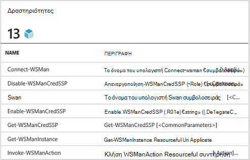
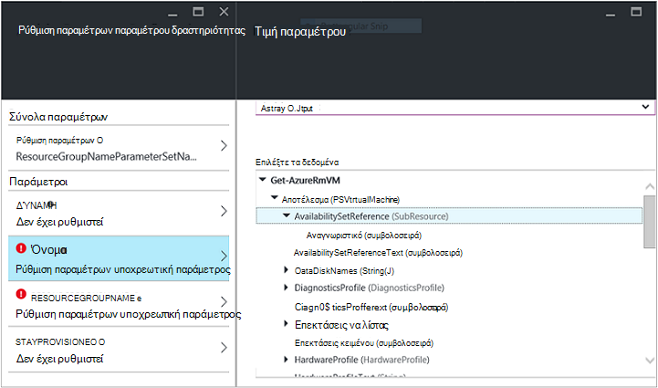
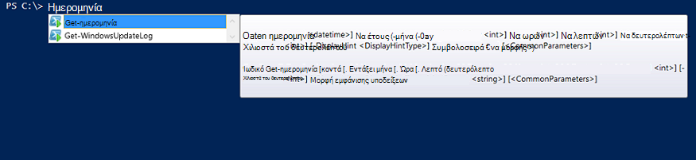

<properties
   pageTitle="Δημιουργήστε μια λειτουργική μονάδα Azure αυτοματισμού ενοποίησης | Microsoft Azure"
   description="Προγραμμάτων εκμάθησης που καθοδηγεί τη χρήση δημιουργίας, δοκιμή και παράδειγμα ενοποίησης λειτουργικές μονάδες στο Azure αυτοματισμού."
   services="automation"
   documentationCenter=""
   authors="mgoedtel"
   manager="jwhit"
   editor="" />

<tags
   ms.service="automation"
   ms.workload="tbd"
   ms.tgt_pltfrm="na"
   ms.devlang="na"
   ms.topic="get-started-article"
   ms.date="09/12/2016"
   ms.author="magoedte" />

# <a name="azure-automation-integration-modules"></a>Λειτουργικές μονάδες ενοποίησης Azure αυτοματισμού

PowerShell αποτελεί τη βασική τεχνολογία πίσω από το Azure αυτοματισμού. Επειδή το Azure Αυτοματισμός είναι ενσωματωμένη σε PowerShell, PowerShell λειτουργικές μονάδες είναι βασικά στοιχεία για την επεκτασιμότητα του Azure αυτοματισμού. Σε αυτό το άρθρο θα σας θα σας καθοδηγήσει τις λεπτομέρειες του Azure αυτοματισμού χρήσης του PowerShell λειτουργικές μονάδες, γνωστή ως "Ενοποίηση λειτουργικές μονάδες" και βέλτιστες πρακτικές για να δημιουργήσετε το δικό σας λειτουργικές μονάδες του PowerShell για να βεβαιωθείτε ότι λειτουργούν ως μονάδες ενοποίησης εντός Azure αυτοματισμού. 

## <a name="what-is-a-powershell-module"></a>Τι είναι μια λειτουργική μονάδα PowerShell;

Μια λειτουργική μονάδα PowerShell είναι μια ομάδα cmdlet του PowerShell όπως **Get-ημερομηνία** ή **Αντιγραφή στοιχείου**, που μπορούν να χρησιμοποιηθούν από την κονσόλα του PowerShell, δεσμών ενεργειών, ροές εργασίας, runbooks, και PowerShell DSC πόρους, όπως WindowsFeature ή ένα αρχείο, που μπορούν να χρησιμοποιηθούν από τις παραμέτρους του PowerShell DSC. Όλες τις λειτουργίες του PowerShell εκτίθεται μέσω cmdlet και πόροι DSC και κάθε πόρο cmdlet/DSC υποστηρίζεται από μια λειτουργική μονάδα PowerShell, πολλές του που συνοδεύουν το PowerShell ίδια. Για παράδειγμα, το cmdlet **Get-ημερομηνίας** είναι μέρος της λειτουργικής μονάδας Microsoft.PowerShell.Utility PowerShell, και **Αντιγραφή στοιχείου** cmdlet είναι μέρος της λειτουργικής μονάδας Microsoft.PowerShell.Management PowerShell και ο πόρος DSC πακέτου είναι μέρος της λειτουργικής μονάδας PSDesiredStateConfiguration PowerShell. Και τα δύο από τα παρακάτω λειτουργικές μονάδες αποστολή με το PowerShell. Αλλά πολλές λειτουργικές μονάδες PowerShell παραδίδετε ως μέρος του PowerShell και διανέμονται Αντίθετα με πρώτο ή τρίτων κατασκευαστών προϊόντα όπως System Center 2012 Configuration Manager ή από την Κοινότητα τεράστιες PowerShell σε θέσεις, όπως το PowerShell συλλογή.  Οι λειτουργικές μονάδες είναι χρήσιμη επειδή πιο σύνθετες εργασίες απλούστερο μέσω συμπυκνωμένα λειτουργικότητα.  Μπορείτε να μάθετε περισσότερα σχετικά με το [PowerShell λειτουργικές μονάδες στο MSDN](https://msdn.microsoft.com/library/dd878324%28v=vs.85%29.aspx). 

## <a name="what-is-an-azure-automation-integration-module"></a>Τι είναι μια λειτουργική μονάδα Azure αυτοματισμού ενοποίησης;

Μια λειτουργική μονάδα ενοποίηση δεν είναι πολύ διαφορετικό από μια λειτουργική μονάδα PowerShell. Τα απλώς μια λειτουργική μονάδα PowerShell που προαιρετικά περιέχει μία επιπλέον αρχείο - ένα αρχείο μετα-δεδομένων που καθορίζει έναν τύπο σύνδεσης αυτοματισμού Azure ώστε να χρησιμοποιείται με τη λειτουργική μονάδα cmdlet στο runbooks. Προαιρετικό αρχείων ή όχι, αυτές οι λειτουργικές μονάδες μπορούν να εισαχθούν στο Azure αυτοματισμού για τη διάθεση τα cmdlet του για χρήση σε runbooks και τους πόρους DSC διαθέσιμη για χρήση σε ρυθμίσεις παραμέτρων DSC PowerShell. Τι συμβαίνει στο παρασκήνιο, αυτοματισμού Azure αποθηκεύει αυτές οι λειτουργικές μονάδες και στην εργασία runbook και χρόνος εκτέλεσης εργασίας compiliation DSC φορτώνει σε το Azure αυτοματισμού άμμου όπου εκτελούνται runbooks και ρυθμίσεις παραμέτρων DSC μεταγλωττίζεται.  DSC πόρων σε λειτουργικές μονάδες τοποθετούνται αυτόματα στο διακομιστή ελκυστική DSC αυτοματισμού, έτσι ώστε να μηνύματα μεταφέρονται από μηχανές προσπαθήσετε να εφαρμόσετε τις ρυθμίσεις παραμέτρων DSC.  Αποστολή ενός αριθμού του Azure PowerShell λειτουργικές μονάδες από το πλαίσιο στην αυτοματοποίηση Azure για να χρησιμοποιήσετε, ώστε να μπορείτε να ξεκινήσετε αμέσως αυτοματοποίηση Azure διαχείρισης, αλλά μπορείτε να εισαγάγετε εύκολα λειτουργικές μονάδες του PowerShell για οποιονδήποτε συστήματος, υπηρεσίας ή το εργαλείο που θέλετε να ενσωματώσετε με. 

>[AZURE.NOTE] Ορισμένες λειτουργικές μονάδες που αποστέλλονται ως "Καθολικός λειτουργικές μονάδες" στην υπηρεσία αυτοματισμού. Αυτές οι καθολικοί λειτουργικές μονάδες είναι διαθέσιμες σε εσάς από το πλαίσιο όταν δημιουργείτε ένα λογαριασμό αυτοματισμού, και τους ενημερώσουμε μερικές φορές, το οποίο αυτόματα προωθεί τις στο λογαριασμό σας αυτοματισμού. Εάν δεν θέλετε να ενημερώνονται αυτόματα, μπορείτε να πάντα εισαγάγετε την ίδια λειτουργική μονάδα στον εαυτό σας και που θα έχουν προτεραιότητα έναντι της έκδοσης καθολικής λειτουργική μονάδα του αυτήν τη λειτουργική μονάδα που αποστολή στην υπηρεσία. 

Η μορφή με την οποία μπορείτε να εισαγάγετε ένα πακέτο ενοποίησης λειτουργική μονάδα είναι ένα συμπιεσμένο αρχείο με το ίδιο όνομα με τη λειτουργική μονάδα και επέκταση .zip. Περιέχει τη λειτουργική μονάδα Windows PowerShell και όλα τα αρχεία υποστήριξης, όπως ένα αρχείο δηλώσεων (.psd1) Εάν η λειτουργική μονάδα έχει μία.

Εάν η λειτουργική μονάδα θα πρέπει να περιέχουν έναν τύπο σύνδεσης αυτοματισμού Azure, πρέπει επίσης να περιέχει ένα αρχείο με το όνομα *<ModuleName>*-Automation.json που καθορίζει τις ιδιότητες τύπος σύνδεσης. Αυτό είναι ένα αρχείο json τοποθετείται μέσα στο φάκελο λειτουργική μονάδα του αρχείου σας συμπιεσμένο .zip και περιέχει τα πεδία "σύνδεσης" που είναι απαραίτητη για να συνδεθείτε με το σύστημα ή την υπηρεσία που αντιπροσωπεύει τη λειτουργική μονάδα. Αυτό θα καταλήξετε τη δημιουργία ενός τύπου σύνδεσης στο Azure αυτοματισμού. Χρήση αυτού του αρχείου που μπορείτε να ορίσετε τα ονόματα των πεδίων, τύπων, και εάν τα πεδία πρέπει να είναι κρυπτογραφημένα ή / και προαιρετικά, για τον τύπο σύνδεσης της λειτουργικής μονάδας. Ακολουθεί ένα πρότυπο σε μορφή αρχείου json:

```
{ 
   "ConnectionFields": [
   {
      "IsEncrypted":  false,
      "IsOptional":  false,
      "Name":  "ComputerName",
      "TypeName":  "System.String"
   },
   {
      "IsEncrypted":  false,
      "IsOptional":  true,
      "Name":  "Username",
      "TypeName":  "System.String"
   },
   {
      "IsEncrypted":  true,
      "IsOptional":  false,
      "Name":  "Password",
   "TypeName":  "System.String"
   }],
   "ConnectionTypeName":  "DataProtectionManager",
   "IntegrationModuleName":  "DataProtectionManager"
}
```

Εάν έχετε αναπτύξει αυτοματοποίηση υπηρεσίας διαχείρισης και δημιουργήσει πακέτα λειτουργικές μονάδες ενοποίησης για την αυτοματοποίηση runbooks, αυτό θα πρέπει να είναι πολύ οικείο για εσάς. 


## <a name="authoring-best-practices"></a>Σύνταξη από κοινού βέλτιστες πρακτικές

Απλώς και μόνο επειδή λειτουργικές μονάδες ενοποίησης είναι ουσιαστικά PowerShell λειτουργικές μονάδες, αυτό δεν σημαίνει δεν έχουμε ένα σύνολο πρακτικές γύρω από κοινού τους. Εξακολουθεί να υπάρχει ένας αριθμός πράγματα συνιστάται να εξετάσετε κατά τη σύνταξη από κοινού μια λειτουργική μονάδα PowerShell, ώστε να είναι πιο εύχρηστα στο Azure αυτοματισμού. Ορισμένες από αυτές είναι συγκεκριμένες αυτοματισμού Azure και ορισμένες από αυτές είναι χρήσιμη απλώς να κάνετε τις λειτουργικές μονάδες λειτουργούν σωστά σε ροή εργασίας του PowerShell, ανεξάρτητα από το αν χρησιμοποιείτε αυτοματισμού. 

1. Περιλαμβάνουν σύνοψη, περιγραφή, και να σας βοηθήσει URI για κάθε cmdlet στη λειτουργική μονάδα. Στο PowerShell, μπορείτε να ορίσετε ορισμένες πληροφορίες Βοήθειας για το cmdlet για να επιτρέπετε στο χρήστη για να λάβετε βοήθεια σχετικά με τη χρήση τους με το cmdlet **Get-Βοήθεια** . Για παράδειγμα, ακολουθεί πώς μπορείτε να ορίσετε μια σύνοψη και να σας βοηθήσει URI για μια λειτουργική μονάδα PowerShell γραμμένο σε ένα αρχείο .psm1.<br>  

    ```
    <#
        .SYNOPSIS
         Gets all outgoing phone numbers for this Twilio account 
    #>
    function Get-TwilioPhoneNumbers {
    [CmdletBinding(DefaultParameterSetName='SpecifyConnectionFields', `
    HelpUri='http://www.twilio.com/docs/api/rest/outgoing-caller-ids')]
    param(
       [Parameter(ParameterSetName='SpecifyConnectionFields', Mandatory=$true)]
       [ValidateNotNullOrEmpty()]
       [string]
       $AccountSid,

       [Parameter(ParameterSetName='SpecifyConnectionFields', Mandatory=$true)]
       [ValidateNotNullOrEmpty()]
       [string]
       $AuthToken,

       [Parameter(ParameterSetName='UseConnectionObject', Mandatory=$true)]
       [ValidateNotNullOrEmpty()]
       [Hashtable]
       $Connection
    )

    $cred = CreateTwilioCredential -Connection $Connection -AccountSid $AccountSid -AuthToken $AuthToken

    $uri = "$TWILIO_BASE_URL/Accounts/" + $cred.UserName + "/IncomingPhoneNumbers"
    
    $response = Invoke-RestMethod -Method Get -Uri $uri -Credential $cred

    $response.TwilioResponse.IncomingPhoneNumbers.IncomingPhoneNumber
    }
    ```
<br> 
Παροχή αυτό πληροφορίες δεν θα εμφανίσει μόνο αυτήν τη βοήθεια χρησιμοποιώντας το cmdlet **Get-Βοήθεια** στην κονσόλα PowerShell, αυτό θα εκθέσει επίσης αυτή η λειτουργία Βοήθειας εντός Azure αυτοματισμού, για παράδειγμα, κατά την εισαγωγή δραστηριότητες κατά τη σύνταξη runbook. Κάνοντας κλικ στην επιλογή "Προβολή αναλυτική Βοήθεια" θα ανοίξει τη Βοήθεια URI σε μια άλλη καρτέλα του προγράμματος περιήγησης web που χρησιμοποιείτε για να αποκτήσετε πρόσβαση Azure αυτοματισμού.<br>
2. Εάν η λειτουργική μονάδα που εκτελείται σε ένα απομακρυσμένο σύστημα, ένα. Θα πρέπει να περιέχει ένα αρχείο μετα-δεδομένων ενοποίησης λειτουργική μονάδα που καθορίζει τις πληροφορίες που απαιτούνται για να συνδεθείτε με αυτό το απομακρυσμένο σύστημα, γεγονός που σημαίνει ότι ο τύπος σύνδεσης. β. Κάθε cmdlet στη λειτουργική μονάδα πρέπει να είναι σε θέση να λάβει σε ένα αντικείμενο σύνδεσης (μια παρουσία αυτού του τύπου σύνδεσης) με την παράμετρο.  
    Cmdlet για στη λειτουργική μονάδα γίνονται ευκολότερο να χρησιμοποιήσετε σε αυτοματισμού Azure εάν επιτρέπετε τη μεταβίβαση ενός αντικειμένου με τα πεδία από τον τύπο σύνδεσης ως παράμετρο στο cmdlet. Αυτό τρόπο με τον οποίο οι χρήστες δεν χρειάζεται να αντιστοιχίσετε τις παραμέτρους του περιουσιακού στοιχείου σύνδεσης στο αντίστοιχο παράμετροι το cmdlet κάθε φορά που καλούν ένα cmdlet. Με βάση το παραπάνω παράδειγμα runbook, χρησιμοποιεί μια περιουσιακών στοιχείων σύνδεσης Twilio που ονομάζεται CorpTwilio για πρόσβαση σε Twilio και να επιστρέψετε όλους τους αριθμούς τηλεφώνου στο λογαριασμό.  Παρατηρήστε πώς το αντιστοιχίζει τα πεδία της σύνδεσης για να τις παραμέτρους το cmdlet;<br>

    ```
    workflow Get-CorpTwilioPhones
    {
      $CorpTwilio = Get-AutomationConnection -Name 'CorpTwilio'
    
      Get-TwilioPhoneNumbers 
        -AccountSid $CorpTwilio.AccountSid  
        -AuthToken $CorptTwilio.AuthToken
    }
    ```
<br>
Μια πιο εύκολη και καλύτερο τρόπο για να προσεγγίσετε αυτό απευθείας που περνά μέσα στο αντικείμενο σύνδεσης για να το cmdlet-

    ```
    workflow Get-CorpTwilioPhones
    {
      $CorpTwilio = Get-AutomationConnection -Name 'CorpTwilio'

      Get-TwilioPhoneNumbers -Connection $CorpTwilio
    }
    ```
<br>
Μπορείτε να ενεργοποιήσετε τη συμπεριφορά όπως αυτό για το cmdlet για, επιτρέποντάς τους να αποδεχτείτε ένα αντικείμενο σύνδεσης απευθείας με την παράμετρο, αντί για σύνδεση πεδία μόνο για τις παραμέτρους του. Συνήθως θα θέλετε μια παράμετρος οριστεί για κάθε, έτσι ώστε να ένα χρήστη που δεν χρησιμοποιεί αυτοματισμού Azure μπορούν να καλέσουν το cmdlet για χωρίς η κατασκευή ενός hashtable ως το αντικείμενο σύνδεσης. Ρύθμιση παραμέτρων **SpecifyConnectionFields** παρακάτω χρησιμοποιείται για τη μεταβίβαση της σύνδεσης ιδιότητες πεδίου ένα προς ένα. **UseConnectionObject** σας επιτρέπει να μεταβιβάσετε ευθεία μέσω της σύνδεσης. Όπως μπορείτε να δείτε το cmdlet αποστολή TwilioSMS στην τη [λειτουργική μονάδα Twilio PowerShell](https://gallery.technet.microsoft.com/scriptcenter/Twilio-PowerShell-Module-8a8bfef8) επιτρέπει που περνά μέσα σε κάθε περίπτωση: 

    ```
    function Send-TwilioSMS {
      [CmdletBinding(DefaultParameterSetName='SpecifyConnectionFields', `
      HelpUri='http://www.twilio.com/docs/api/rest/sending-sms')]
      param(
         [Parameter(ParameterSetName='SpecifyConnectionFields', Mandatory=$true)]
         [ValidateNotNullOrEmpty()]
         [string]
         $AccountSid,

         [Parameter(ParameterSetName='SpecifyConnectionFields', Mandatory=$true)]
         [ValidateNotNullOrEmpty()]
         [string]
         $AuthToken,

         [Parameter(ParameterSetName='UseConnectionObject', Mandatory=$true)]
         [ValidateNotNullOrEmpty()]
         [Hashtable]
         $Connection

       )
    }
    ```
<br>
3. Ορισμός τύπου εξόδου για όλων των cmdlet στη λειτουργική μονάδα. Καθορίζει έναν τύπο εξόδου για ένα cmdlet επιτρέπει χρόνου σχεδίασης IntelliSense για να καθορίσετε τις ιδιότητες εξόδου το cmdlet, για χρήση κατά τη σύνταξη από κοινού. Είναι ιδιαίτερα χρήσιμο κατά τη διάρκεια αυτοματισμού runbook γραφικών σύνταξης, όπου γνώσεων χρόνου σχεδίασης είναι το κλειδί για μια εμπειρία χρήστη εύκολα με λειτουργικής μονάδας.<br> <br> Αυτό είναι παρόμοιο με τη λειτουργικότητα "πληκτρολογήστε προς τα εμπρός" δεδομένων εξόδου ένα cmdlet του PowerShell ISE χωρίς να χρειάζεται να το εκτελέσετε.<br> <br>
4. Cmdlet για στη λειτουργική μονάδα δεν πρέπει να διαρκέσει τύποι σύνθετων αντικειμένων για τις παραμέτρους του. Ροή εργασίας του PowerShell είναι διαφορετική από PowerShell σε που αποθηκεύει σύνθετοι τύποι στο Αποσειριοποιημένο φόρμας. Θα παραμείνει στοιχειώδεις τύπους ως στοιχειώδεις τύπους, αλλά σύνθετοι τύποι μετατρέπονται σε τους Αποσειριοποιημένο εκδόσεις, οι οποίες είναι ουσιαστικά ομάδες ιδιοτήτων. Για παράδειγμα, εάν χρησιμοποιήσατε το cmdlet **Get-διαδικασία** σε μια runbook (ή μια ροή εργασίας του PowerShell για το θέμα), θα επιστρέψει ένα αντικείμενο του τύπου [Deserialized.System.Diagnostic.Process], δεν τον αναμενόμενο τύπο [System.Diagnostic.Process]. Αυτός ο τύπος έχει όλες τις ίδιες ιδιότητες, όπως ο τύπος μη αποσειριοποιηθούν, αλλά καμία από τις μεθόδους. Και εάν προσπαθείτε να μεταβιβάσετε αυτήν την τιμή ως παράμετρο, ένα cmdlet, όπου το cmdlet αναμένει τιμή [System.Diagnostic.Process] για αυτήν την παράμετρο, θα λάβετε το ακόλουθο σφάλμα: *δεν μπορεί να επεξεργαστεί το όρισμα μετασχηματισμό στην παράμετρο 'διεργασία'. Σφάλμα: "δεν είναι δυνατή η μετατροπή της τιμής"System.Diagnostics.Process (CcmExec)"Τύπος"Deserialized.System.Diagnostics.Process"για να πληκτρολογήσετε"System.Diagnostics.Process".*   Αυτό συμβαίνει επειδή υπάρχει ασυμφωνία τύπου μεταξύ τον αναμενόμενο τύπο [System.Diagnostic.Process] και τον συγκεκριμένο τύπο [Deserialized.System.Diagnostic.Process]. Ο τρόπος γύρω από αυτό το ζήτημα είναι να βεβαιωθείτε ότι τα cmdlet της λειτουργικής μονάδας δεν θα σύνθετοι τύποι για τις παραμέτρους του. Εδώ είναι λάθος τρόπο για να το κάνετε.

    ```
    function Get-ProcessDescription {
      param (
            [System.Diagnostic.Process] $process
      )
      $process.Description
    }
    ``` 
<br>
Και εδώ είναι τον σωστό τρόπο, λήψης σε μια στοιχειώδης που μπορούν να χρησιμοποιηθούν εσωτερικά από το cmdlet για να αποκτήσετε το αντικείμενο σύνθετη και να το χρησιμοποιήσετε. Επειδή το cmdlet για εκτέλεση στο περιβάλλον του PowerShell, δεν PowerShell ροή εργασίας, εντός το cmdlet $process γίνεται ο σωστός τύπος [System.Diagnostic.Process].  

    ```
    function Get-ProcessDescription {
      param (
            [String] $processName
      )
      $process = Get-Process -Name $processName

      $process.Description
    }
    ```
<br>
Περιουσιακά στοιχεία σύνδεσης στο runbooks είναι hashtables, το οποίο είναι ένα σύνθετο τύπο, και ακόμη αυτές τις hashtables φαίνεται να έχουν τη δυνατότητα να περάσουν στο cmdlet για τους – παράμετρος σύνδεσης τέλεια, με εξαίρεση χωρίς cast. Τεχνικά, ορισμένοι τύποι PowerShell μπορούν να μετατραπεί σωστά από τους αλληλουχίας φόρμα σε φόρμα Αποσειριοποιημένο τους και, επομένως μπορούν να περάσουν σε cmdlet του για αποδοχή του τύπου Αποσειριοποιημένο μη - παραμέτρους. Hashtable είναι ένα από τα εξής. Των καθορισμένων τύπων του συντάκτη μια λειτουργική μονάδα που θα εφαρμοστούν με τον τρόπο που αυτές μπορούν να σωστά αποσειριοποίηση καθώς και, αλλά υπάρχουν ορισμένα μειονεκτήματα για να κάνετε. Ο τύπος πρέπει να διαθέτει μια προεπιλεγμένη κατασκευή, έχετε όλες τις ιδιότητές δημόσια και έχουν μια PSTypeConverter. Ωστόσο, για ήδη που ορίζονται από τους τύπους που δεν ανήκουν σε ο συντάκτης λειτουργικής μονάδας, δεν υπάρχει τρόπος να "επιδιόρθωση", επομένως τις προτάσεις για να αποφύγετε σύνθετοι τύποι για παραμέτρους όλα μαζί. Σύνταξη από κοινού Runbook συμβουλή: Εάν για ορισμένα λόγο το cmdlet για πρέπει να την μεταφέρω παραμέτρου σύνθετο τύπο ή χρησιμοποιείτε κάποιου άλλου λειτουργική μονάδα που απαιτεί μια παράμετρο σύνθετο τύπο, η λύση σε ροή εργασίας του PowerShell runbooks και PowerShel ροές εργασίας σε τοπική PowerShell, είναι να αναδιπλώσετε το cmdlet που δημιουργεί το σύνθετο τύπο και τα cmdlet που χρησιμοποιεί το σύνθετο τύπο στην ίδια δραστηριότητα InlineScript. Εφόσον InlineScript εκτέλεση τα περιεχόμενά ως PowerShell αντί για ροή εργασίας του PowerShell, το cmdlet δημιουργία σύνθετου τύπου θα δημιουργήσουν αυτόν τον σωστό τύπο, μην Αποσειριοποιημένο σύνθετου τύπου.
5. Κάνετε όλων των cmdlet στη λειτουργική μονάδα χωρίς κατάσταση. PowerShell ροή εργασίας εκτελείται κάθε cmdlet που ονομάζεται στη ροή εργασίας σε μια διαφορετική περίοδο λειτουργίας. Αυτό σημαίνει ότι οποιαδήποτε cmdlet που εξαρτώνται από κατάσταση περιόδου λειτουργίας δημιουργήθηκε / τροποποιήθηκε από άλλα cmdlet στο ίδια λειτουργική μονάδα δεν θα λειτουργούν σε runbooks PowerShell ροής εργασίας.  Ακολουθεί ένα παράδειγμα του τι δεν πρέπει να κάνετε.

    ```
    $globalNum = 0
    function Set-GlobalNum {
       param(
           [int] $num
       )
      
       $globalNum = $num
    }
    function Get-GlobalNumTimesTwo {
       $output = $globalNum * 2
     
       $output
    }
    ```
<br>
6. Η λειτουργική μονάδα πρέπει να περιλαμβάνονται πλήρως στην πακέτου Xcopy δυνατότητα. Επειδή το Azure αυτοματισμού λειτουργικές μονάδες διανέμονται για την αυτοματοποίηση άμμου όταν runbooks πρέπει να εκτελεί, θα πρέπει να λειτουργούν ανεξάρτητα από τον κεντρικό υπολογιστή που εκτελούνται σε. Αυτό σημαίνει ότι θα πρέπει να μπορούν να Zip του πακέτου λειτουργικής μονάδας, μετακινήσετε σε οποιοδήποτε άλλο κεντρικό υπολογιστή με την ίδια ή νεότερη έκδοση του PowerShell και να λειτουργεί ως κανονική κατά την εισαγωγή στο περιβάλλον του PowerShell που φιλοξενούν. Με τη σειρά για αυτό να συμβεί, τη λειτουργική μονάδα δεν θα πρέπει να εξαρτώνται από σε οποιαδήποτε αρχεία έξω από το φάκελο λειτουργική μονάδα (στο φάκελο που λαμβάνει μορφή zip προς τα επάνω κατά την εισαγωγή σε αυτοματισμού Azure) ή σε οποιεσδήποτε ρυθμίσεις μητρώου μοναδικών τιμών σε ένα κεντρικό υπολογιστή, όπως αυτές που ορίζονται από την εγκατάσταση ενός προϊόντος. Εάν δεν ακολουθείται αυτήν τη βέλτιστη πρακτική, τη λειτουργική μονάδα δεν θα μπορούν να χρησιμοποιηθούν σε Azure αυτοματισμού.  

## <a name="next-steps"></a>Επόμενα βήματα

- Για να ξεκινήσετε με το PowerShell runbooks ροής εργασίας, ανατρέξτε στο θέμα [μου πρώτη runbook PowerShell ροής εργασίας](automation-first-runbook-textual.md)
- Για να μάθετε περισσότερα σχετικά με τη δημιουργία λειτουργικές μονάδες PowerShell, ανατρέξτε στο θέμα [γράφετε μια λειτουργική μονάδα Windows PowerShell](https://msdn.microsoft.com/library/dd878310%28v=vs.85%29.aspx)