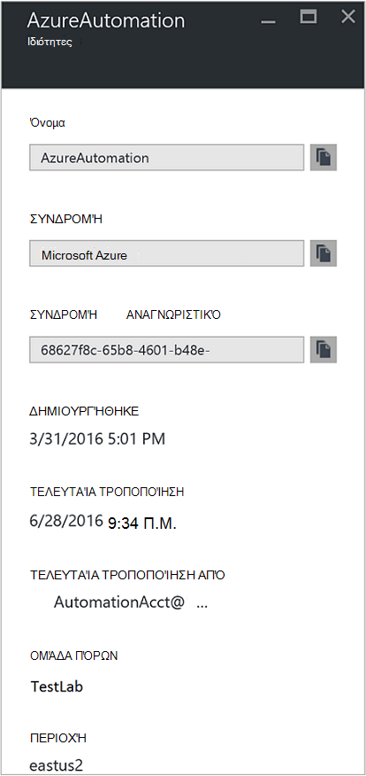
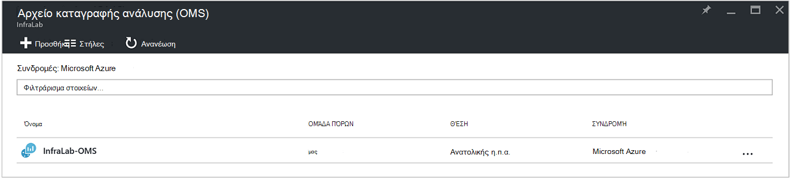
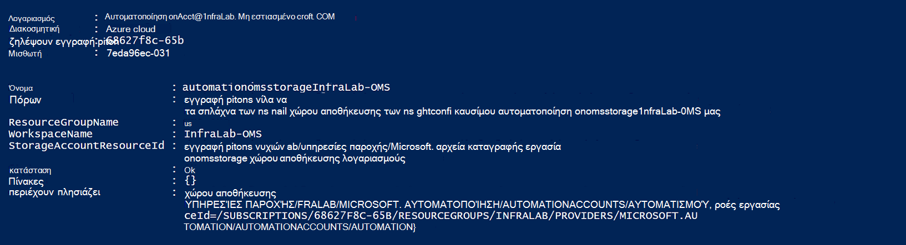
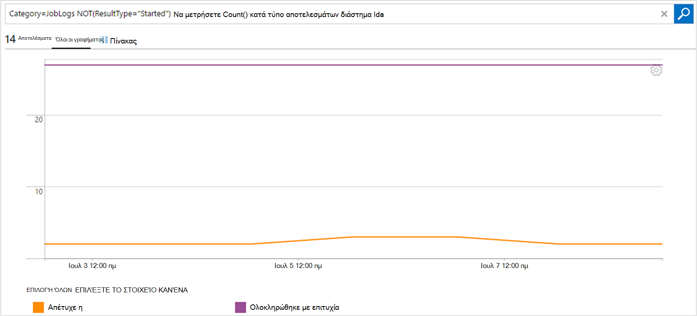

<properties
    pageTitle="Προώθηση κατάστασης εργασίας και ροών εργασίας από αυτοματισμού καταγραφής ανάλυσης (OMS) | Microsoft Azure"
    description="Σε αυτό το άρθρο παρουσιάζει τον τρόπο για την αποστολή κατάστασης εργασίας και runbook ροών εργασίας για διαχείριση και ανάλυση καταγραφής οικογένεια προγραμμάτων του Microsoft λειτουργίες διαχείρισης για να παρέχουν πρόσθετες πληροφορίες για."
    services="automation"
    documentationCenter=""
    authors="MGoedtel"
    manager="jwhit"
    editor="tysonn" />
<tags
    ms.service="automation"
    ms.devlang="na"
    ms.topic="article"
    ms.tgt_pltfrm="na"
    ms.workload="infrastructure-services"
    ms.date="09/22/2016"
    ms.author="magoedte" />

# Προώθηση κατάστασης εργασίας και ροών εργασίας από αυτοματισμού καταγραφής ανάλυσης (OMS)

Αυτοματοποίηση να στείλετε runbook ροών εργασίας κατάσταση και την εργασία στο χώρο εργασίας σας ανάλυση καταγραφής οικογένεια προγραμμάτων διαχείρισης λειτουργίες Microsoft (OMS).  Ενώ μπορείτε να προβάλετε αυτές τις πληροφορίες στην πύλη του Azure ή με το PowerShell κατά κατάσταση εργασίας μεμονωμένα ή όλες τις εργασίες για ένα συγκεκριμένο λογαριασμό αυτοματισμού, όλα τα στοιχεία για προχωρημένους για την υποστήριξη λειτουργικές απαιτήσεις σας όσον αφορά απαιτείται για τη δημιουργία προσαρμοσμένων δεσμών ενεργειών του PowerShell.  Τώρα με το αρχείο καταγραφής Anaytics μπορείτε να:

- Ενημερωθείτε για την αυτοματοποίηση εργασίες 
- Έναυσμα ένα μήνυμα ηλεκτρονικού ταχυδρομείου ή ειδοποίηση με βάση την κατάσταση εργασίας runbook (π.χ. απέτυχε ή σε αναστολή) 
- Εγγραφή σύνθετων ερωτημάτων κατά μήκος του ροών εργασίας 
- Συσχετισμός εργασίες σε λογαριασμούς αυτοματισμού 
- Απεικόνιση του ιστορικού εργασίας μέσα στο χρόνο     

## Προαπαιτούμενα και θέματα ανάπτυξης

Για να ξεκινήσετε την αποστολή αρχείων καταγραφής σας αυτοματισμού για ανάλυση καταγραφής, πρέπει να έχετε τα εξής:

1. Μια συνδρομή OMS. Για περισσότερες πληροφορίες, ανατρέξτε στο θέμα [Γρήγορα αποτελέσματα με το αρχείο καταγραφής ανάλυσης](../log-analytics/log-analytics-get-started.md).  

    >[AZURE.NOTE]Ο χώρος εργασίας OMS και ο λογαριασμός αυτοματισμού πρέπει να είναι στην ίδια συνδρομή του Azure για αυτήν τη ρύθμιση παραμέτρων για να λειτουργήσει σωστά. 
  
2. Ένας [λογαριασμός Azure χώρου αποθήκευσης](../storage/storage-create-storage-account.md).  
   
    >[AZURE.NOTE]Το λογαριασμό χώρου αποθήκευσης, *πρέπει να* είναι στην ίδια περιοχή με το λογαριασμό αυτοματισμού. 
 
3. Azure PowerShell με την έκδοση 1.0.8 ή νεότερη έκδοση της τα cmdlet λειτουργικές ιδέες. Για πληροφορίες σχετικά με αυτήν την έκδοση και πώς μπορείτε να το εγκαταστήσετε, ανατρέξτε στο θέμα [Πώς να εγκαταστήσετε και να ρυθμίσετε τις παραμέτρους του PowerShell Azure](../powershell-install-configure.md).
4. Azure Diagnostic και καταγραφής ανάλυσης PowerShell.  Για περισσότερες πληροφορίες σχετικά με αυτήν την έκδοση και πώς μπορείτε να το εγκαταστήσετε, ανατρέξτε στο θέμα [διαγνωστικών Azure και τις αναλύσεις καταγραφής](https://www.powershellgallery.com/packages/AzureDiagnosticsAndLogAnalytics/0.1).  
5. Λήψη της δέσμης ενεργειών του PowerShell **Ενεργοποίηση AzureDiagnostics.ps1** από τη [Συλλογή του PowerShell](https://www.powershellgallery.com/packages/Enable-AzureDiagnostics/1.0/DisplayScript). Αυτή η δέσμη ενεργειών θα ρυθμίσετε τις παραμέτρους τα εξής:
 - Ένας λογαριασμός χώρου αποθήκευσης για τη διατήρηση των runbook εργασία κατάστασης και ροή δεδομένων για ένα λογαριασμό αυτοματισμού που καθορίζετε.
 - Ενεργοποίηση της συλλογής αυτών των δεδομένων από το λογαριασμό σας αυτοματισμού για να αποθηκεύσετε σε ένα λογαριασμό του χώρου αποθήκευσης αντικειμένων Blob του Azure σε μορφή JSON.
 - Ρύθμιση παραμέτρων τη συλλογή δεδομένων από το λογαριασμό σας χώρο αποθήκευσης αντικειμένων Blob OMS καταγραφής ανάλυσης.
 - Ενεργοποίηση της λύσης αυτοματισμού καταγραφής ανάλυσης του χώρου εργασίας σας OMS.   

Η δέσμη ενεργειών **Ενεργοποίηση AzureDiagnostics.ps1** απαιτεί τις ακόλουθες παραμέτρους κατά την εκτέλεση του:

- *AutomationAccountName* - στο όνομα του λογαριασμού σας αυτοματισμού
- *LogAnalyticsWorkspaceName* - στο όνομα του χώρου εργασίας σας OMS

Για να βρείτε τις τιμές για *AutomationAccountName*, στην πύλη του Azure επιλέξτε το λογαριασμό σας αυτοματισμού από το **λογαριασμό αυτοματισμού** blade και επιλέξτε **όλες τις ρυθμίσεις**.  Από το blade **όλες τις ρυθμίσεις** , στην περιοχή **Ρυθμίσεις λογαριασμού** , επιλέξτε **Ιδιότητες**.  Στο το blade **Ιδιότητες** , μπορείτε να σημειώσετε αυτές τις τιμές.  .

## Ρύθμιση ενοποίηση με το αρχείο καταγραφής ανάλυσης

1. Στον υπολογιστή σας, ξεκινήστε το **Windows PowerShell** από την οθόνη **έναρξης** .  
2. Από το κέλυφος γραμμής εντολών του PowerShell, μεταβείτε στο φάκελο που περιέχει τη δέσμη ενεργειών που έχουν ληφθεί και εκτελεί την αλλαγή των τιμών για παραμέτρους *- AutomationAccountName* και *- LogAnalyticsWorkspaceName*.

    >[AZURE.NOTE] Θα σας ζητηθεί για τον έλεγχο ταυτότητας με Azure μετά την εκτέλεση της δέσμης ενεργειών.  **Πρέπει να** συνδεθείτε με ένα λογαριασμό που είναι μέλος του ρόλου διαχειριστές συνδρομής και από το διαχειριστή της συνδρομής.   
    
        .\Enable-AzureDiagnostics -AutomationAccountName <NameofAutomationAccount> `
        -LogAnalyticsWorkspaceName <NameofOMSWorkspace> `

3. Μετά την εκτέλεση αυτής της δέσμης ενεργειών θα πρέπει να βλέπετε τις εγγραφές στο αρχείο καταγραφής ανάλυσης 30 λεπτά μετά νέων διαγνωστικών δεδομένων είναι γραμμένο με το χώρο αποθήκευσης.  Εάν οι εγγραφές δεν είναι διαθέσιμες αφού αυτήν τη στιγμή που αναφέρονται στην ενότητα Αντιμετώπιση προβλημάτων σε [αρχεία JSON στο χώρο αποθήκευσης αντικειμένων blob](../log-analytics/log-analytics-azure-storage-json.md#troubleshooting-configuration-for-azure-diagnostics-written-to-blob-in-json).

### Επαλήθευση ρύθμισης παραμέτρων

Για να επιβεβαιώσετε τη δέσμη ενεργειών ρυθμιστεί το λογαριασμό αυτοματισμού και OMS wokspace με επιτυχία, μπορείτε να εκτελέσετε τα παρακάτω βήματα σε PowerShell.  Πριν το κάνετε αυτό, για να βρείτε τις τιμές για το όνομα χώρου εργασίας OMS και το όνομα της ομάδας πόρων, από την πύλη Azure, μεταβείτε στο αρχείο καταγραφής ανάλυσης (OMS) και το blade ανάλυσης καταγραφής (OMS), σημειώστε την τιμή για το **όνομα** και **Ομάδα πόρων**.   , θα χρησιμοποιήσουμε αυτές τις δύο τιμές, όταν θα σας Επαληθεύστε τις ρυθμίσεις παραμέτρων του χώρου εργασίας OMS σας χρησιμοποιώντας το PowerShell cmdlet [Get-AzureRmOperationalInsightsStorageInsight](https://msdn.microsoft.com/library/mt603567.aspx).

1.  Από την πύλη Azure, μεταβείτε σε λογαριασμούς χώρου αποθήκευσης και αναζητήστε το παρακάτω λογαριασμό χώρου αποθήκευσης, ο οποίος χρησιμοποιεί τους κανόνες ονοματοθεσίας - *AutomationAccountNameomsstorage*.  Μετά από ένα runbook ολοκληρωθεί η εργασία, λίγο αργότερα, θα πρέπει να βλέπετε δύο Blob κοντέινερ δημιουργήθηκε - **ιδέες-αρχεία καταγραφής-joblogs** και **ιδέες-αρχεία καταγραφής-jobstreams**.  

2.  Από το PowerShell, εκτελέστε τον παρακάτω κώδικα PowerShell, αλλάζοντας τις τιμές για τις παραμέτρους **ResourceGroupName** και **WorkspaceName** που αντιγράψατε ή σημειώσατε προηγουμένως.  

    Λήψη σύνδεσης AzureRmAccount-AzureRmSubscription - SubscriptionName 'SubscriptionName' | Ορισμός AzureRmContext Get-AzureRmOperationalInsightsStorageInsight - ResourceGroupName "OMSResourceGroupName" '-χώρου εργασίας "OMSWorkspaceName" 

    Αυτό θα επιστρέψει το πληροφορίες για χώρο αποθήκευσης για το συγκεκριμένο χώρο εργασίας OMS.  Θέλουμε να επιβεβαιώσετε υπάρχει το πληροφορίες για χώρο αποθήκευσης για το λογαριασμό αυτοματισμού θα σας καθορίζεται νωρίτερα και το αντικείμενο **κατάστασης** εμφανίζει μια τιμή από το **κουμπί OK**.  .

## Ανάλυση εγγραφών του αρχείου καταγραφής

Αυτοματοποίηση δημιουργεί δύο τύποι εγγραφών στο αποθετήριο OMS.

### Αρχεία καταγραφής από την εργασία

Ιδιότητα | Περιγραφή|
----------|----------|
Ώρα | Ημερομηνία και ώρα κατά την εργασία runbook εκτελείται.|
resourceId | Καθορίζει τον τύπο πόρου στο Azure.  Για την αυτοματοποίηση, η τιμή είναι ο λογαριασμός αυτοματισμού που σχετίζονται με runbook.|
operationName | Καθορίζει τον τύπο της λειτουργίας που εκτελούνται στο Azure.  Για την αυτοματοποίηση, η τιμή θα εργασία.|
resultType | Η κατάσταση της εργασίας runbook.  Πιθανές τιμές είναι: -Αποτελέσματα -Stopped -Σε αναστολή -Απέτυχε -Ολοκληρώθηκε με επιτυχία|
resultDescription | Περιγράφει την κατάσταση runbook εργασία αποτέλεσμα.  Πιθανές τιμές είναι: -Έναρξη εργασίας -Απέτυχε η εργασία -Η εργασία ολοκληρώθηκε|
CorrelationId | GUID που είναι το αναγνωριστικό συσχέτισης του runbook έργου.|
Κατηγορία | Ταξινόμηση τον τύπο των δεδομένων.  Για την αυτοματοποίηση, η τιμή είναι JobLogs.|
RunbookName | Το όνομα του runbook.|
JobId | GUID που είναι το αναγνωριστικό του runbook έργου.|
Καλούντος |  Ποιος ξεκίνησε τη λειτουργία.  Πιθανές τιμές είναι μια διεύθυνση ηλεκτρονικού ταχυδρομείου ή το σύστημα για προγραμματισμένες εργασίες.|

### Ροές εργασίας
Ιδιότητα | Περιγραφή|
----------|----------|
Ώρα | Ημερομηνία και ώρα κατά την εργασία runbook εκτελείται.|
resourceId | Καθορίζει τον τύπο πόρου στο Azure.  Για την αυτοματοποίηση, η τιμή είναι ο λογαριασμός αυτοματισμού που σχετίζονται με runbook.|
operationName | Καθορίζει τον τύπο της λειτουργίας που εκτελούνται στο Azure.  Για την αυτοματοποίηση, η τιμή θα εργασία.|
resultType | Η κατάσταση της εργασίας runbook.  Πιθανές τιμές είναι: -Σε εξέλιξη|
resultDescription | Περιλαμβάνει στη ροή εξόδου από runbook.|
CorrelationId | GUID που είναι το αναγνωριστικό συσχέτισης του runbook έργου.|
Κατηγορία | Ταξινόμηση τον τύπο των δεδομένων.  Για την αυτοματοποίηση, η τιμή είναι JobStreams.|
RunbookName | Το όνομα του runbook.|
JobId | GUID που είναι το αναγνωριστικό του runbook έργου.|
Καλούντος | Ποιος ξεκίνησε τη λειτουργία.  Πιθανές τιμές είναι μια διεύθυνση ηλεκτρονικού ταχυδρομείου ή το σύστημα για προγραμματισμένες εργασίες.| 
StreamType | Ο τύπος της ροής εργασίας. Πιθανές τιμές είναι: -Προόδου -Αποτέλεσμα -Προειδοποίηση -Σφάλμα -Ο εντοπισμός σφαλμάτων -Λεπτομερής|

## Προβολή αυτοματισμού συνδέεται στο αρχείο καταγραφής ανάλυσης 

Τώρα που έχετε ξεκινήσει αποστολή αρχείων καταγραφής εργασίας σας αυτοματισμού σε ανάλυση καταγραφής, ας ανατρέξτε στο θέμα τι μπορείτε να κάνετε με αυτά τα αρχεία καταγραφής μέσα OMS.   

### Αποστολή μηνύματος ηλεκτρονικού ταχυδρομείου, όταν μια εργασία runbook αποτυγχάνει ή αναστέλλει 

Ένα από το επάνω πελατών σας ρωτά για τη δυνατότητα να στείλετε ένα μήνυμα ηλεκτρονικού ταχυδρομείου ή ένα κείμενο όταν κάτι πάει καλά με μια εργασία runbook.   

Για να δημιουργήσετε έναν κανόνα ειδοποίησης, ξεκινάτε με τη δημιουργία μιας αναζήτησης καταγραφής για τις εγγραφές έργου runbook που θα πρέπει να ενεργοποιήσει την ειδοποίηση.  Το κουμπί " **ειδοποίηση** ", στη συνέχεια, θα είναι διαθέσιμη, ώστε να μπορείτε να δημιουργήσετε και να ρυθμίσετε τις παραμέτρους του ειδοποίησης κανόνα.

1.  Από τη σελίδα Επισκόπηση OMS, κάντε κλικ στο **Αρχείο καταγραφής αναζήτησης**.
2.  Δημιουργήστε ένα ερώτημα αναζήτησης αρχείου καταγραφής για την ειδοποίηση, πληκτρολογώντας τα εξής στο πεδίο ερωτήματος: `Category=JobLogs (ResultType=Failed || ResultType=Suspended)`.  Μπορείτε επίσης να ομαδοποιήσετε από το RunbookName με τη χρήση: `Category=JobLogs (ResultType=Failed || ResultType=Suspended) | measure Count() by RunbookName_s`.   
  
    Εάν έχετε ορίσει αρχεία καταγραφής από περισσότερες από μία αυτοματισμού λογαριασμό ή μια συνδρομή στο χώρο εργασίας σας, μπορεί επίσης να σας ενδιαφέρουν ομαδοποίηση των ειδοποιήσεων από τη συνδρομή ή λογαριασμό αυτοματισμού.  Το όνομα του λογαριασμού αυτοματισμού μπορεί να προέρχεται από το πεδίο του πόρου στο πλαίσιο Αναζήτηση του JobLogs.  

3.  Κάντε κλικ στην επιλογή **ειδοποίησης** στο επάνω μέρος της σελίδας για να ανοίξετε την οθόνη **Προσθήκη ειδοποίησης κανόνα** .  Για περισσότερες λεπτομέρειες σχετικά με τις επιλογές για να ρυθμίσετε την ειδοποίηση, ανατρέξτε στο θέμα [ειδοποιήσεις στο αρχείο καταγραφής ανάλυσης](../log-analytics/log-analytics-alerts.md#creating-an-alert-rule).

### Εύρεση όλων των εργασιών που έχουν ολοκληρωθεί με σφάλματα 

Εκτός από την προειδοποίηση βάσει καταργήσω αποτυχίες, που πιθανότατα θα θέλατε να γνωρίζετε πότε μια εργασία runbook είχε ένα σφάλμα μη τον τερματισμό (PowerShell παράγει ένα σφάλμα κατά την ροής, αλλά μη Τερματισμός σφάλματα δεν προκαλούν την αναστολή ή την αποτυχία της εργασίας).    

1. Στην πύλη του OMS, κάντε κλικ στο **Αρχείο καταγραφής αναζήτησης**.
2. Στο πεδίο ερωτήματος, πληκτρολογήστε `Category=JobStreams StreamType_s=Error | measure count() by JobId_g` και, στη συνέχεια, κάντε κλικ στο κουμπί **Αναζήτηση**.

### Προβολή ροών εργασίας για ένα έργο  

Όταν τον εντοπισμό σφαλμάτων σε μια εργασία, μπορείτε επίσης να ερευνήσει των ροών εργασίας.  Το παρακάτω ερώτημα εμφανίζει όλες τις ροές για μία μόνο εργασία με GUID 2ebd22ea-e05e-4eb9 - 9d 76-d73cbd4356e0:   

`Category=JobStreams JobId_g="2ebd22ea-e05e-4eb9-9d76-d73cbd4356e0" | sort TimeGenerated | select ResultDescription` 

### Προβολή ιστορικού εργασίας κατάστασης 

Τέλος, ίσως θέλετε για την απεικόνιση του ιστορικού εργασίας μέσα στο χρόνο.  Μπορείτε να χρησιμοποιήσετε αυτό το ερώτημα για να αναζητήσετε της κατάστασης των εργασιών σας μέσα στο χρόνο. 

`Category=JobLogs NOT(ResultType="started") | measure Count() by ResultType interval 1day`  
   

## Σύνοψη

Με την αποστολή αυτοματισμού εργασία κατάστασης και ροή τα δεδομένα σας στο αρχείο καταγραφής ανάλυσης, μπορείτε να λάβετε περισσότερες πληροφορίες για της κατάστασης των εργασιών σας αυτοματισμού με τη ρύθμιση ειδοποιήσεων για να σας ειδοποιεί όταν υπάρχει κάποιο πρόβλημα και προσαρμοσμένες πινάκων εργαλείων με χρήση σύνθετων ερωτημάτων για την απεικόνιση των αποτελεσμάτων runbook, κατάσταση εργασίας runbook, και άλλες σχετικές βασικών δεικτών ή μετρικά.  Αυτό θα σας βοηθήσει παρέχουν καλύτερη ορατότητα λειτουργικές και διεύθυνση συμβάντων γρηγορότερα τις.  

## Επόμενα βήματα

- Για να μάθετε περισσότερα σχετικά με το πώς μπορείτε να δημιουργήσετε ερωτήματα αναζήτησης διαφορετικές και εξετάστε τα αρχεία καταγραφής εργασία αυτοματισμού με ανάλυση καταγραφής, ανατρέξτε στο θέμα [αρχείο καταγραφής αναζητήσεις στο αρχείο καταγραφής ανάλυσης](../log-analytics/log-analytics-log-searches.md)
- Για να κατανοήσετε τον τρόπο για να δημιουργήσετε και να ανακτήσετε μηνύματα έξοδο και σφάλμα από runbooks, ανατρέξτε στο θέμα [Runbook εξόδου και μηνύματα](automation-runbook-output-and-messages.md) 
- Για να μάθετε περισσότερα σχετικά με την εκτέλεση runbook, τρόπος για την παρακολούθηση της runbook έργα και άλλες τεχνικές λεπτομέρειες, ανατρέξτε στο θέμα [Παρακολούθηση μιας εργασίας runbook](automation-runbook-execution.md)
- Για να μάθετε περισσότερα σχετικά με την ανάλυση καταγραφής OMS και προελεύσεις συλλογής δεδομένων, ανατρέξτε στο θέμα [τη συλλογή Azure χώρου αποθήκευσης δεδομένων στην Επισκόπηση ανάλυσης αρχείου καταγραφής](../log-analytics/log-analytics-azure-storage.md)