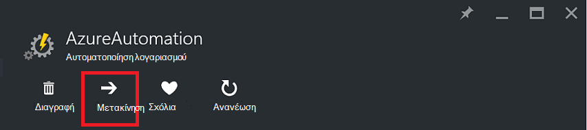
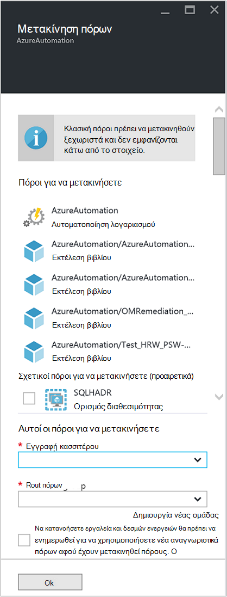

<properties
   pageTitle="Μετεγκατάσταση αυτοματισμού λογαριασμού και πόροι | Microsoft Azure"
   description="Σε αυτό το άρθρο περιγράφει τον τρόπο μετακίνησης λογαριασμού αυτοματισμού στο αυτοματισμού Azure και τους συναφείς πόρους από μια συνδρομή σε μια άλλη."
   services="automation"
   documentationCenter=""
   authors="MGoedtel"
   manager="jwhit"
   editor="tysonn" />
<tags
   ms.service="automation"
   ms.devlang="na"
   ms.topic="article"
   ms.tgt_pltfrm="na"
   ms.workload="infrastructure-services"
   ms.date="07/07/2016"
   ms.author="magoedte" />

# <a name="migrate-automation-account-and-resources"></a>Μετεγκατάσταση αυτοματισμού λογαριασμό και πόρους

Για λογαριασμούς αυτοματισμού και τις σχετικές πόρους (δηλαδή περιουσιακών στοιχείων, runbooks, λειτουργικές μονάδες, κ.λπ.) που δημιουργήσατε στην πύλη του Azure και θέλετε να μετεγκατασταθούν από μια ομάδα πόρων σε ένα άλλο ή από μια συνδρομή σε μια άλλη, μπορείτε να πραγματοποιήσετε αυτή εύκολα με τη [Μετακίνηση πόρους](../resource-group-move-resources.md) δυνατότητα είναι διαθέσιμη στην πύλη του Azure. Ωστόσο, πριν να συνεχίσετε με αυτήν την ενέργεια, πρέπει πρώτα να εξετάσετε τα παρακάτω [λίστα ελέγχου πριν περάσετε πόρους](../resource-group-move-resources.md#Checklist-before-moving-resources) και επιπλέον, τη λίστα κάτω από το συγκεκριμένο αυτοματισμού.   

1.  Η ομάδα συνδρομή/πόρων προορισμού πρέπει να είναι στην ίδια περιοχή ως προέλευση.  Δηλαδή, δεν μπορεί να μετακινηθεί αυτοματισμού λογαριασμούς σε περιοχές.
2.  Όταν μετακινείτε πόρους (π.χ., runbooks, εργασίες, κ.λπ.), στην ομάδα προέλευσης και η ομάδα προορισμού είναι κλειδωμένες στη διάρκεια της λειτουργίας. Εγγραφή και διαγραφή λειτουργίες αποκλείονται στις ομάδες μέχρι να ολοκληρωθεί η μετακίνηση.  
3.  Οποιαδήποτε runbooks ή τις μεταβλητές που αναφέρονται σε ένα Αναγνωριστικό πόρου ή τη συνδρομή από την υπάρχουσα συνδρομή θα πρέπει να ενημερωθούν μετά την ολοκλήρωση της μετεγκατάστασης.   


>[AZURE.NOTE] Αυτή η δυνατότητα δεν υποστηρίζει κυλιόμενο κλασική αυτοματισμού πόρους.

## <a name="to-move-the-automation-account-using-the-portal"></a>Για να μετακινήσετε το λογαριασμό αυτοματισμού με την πύλη

1. Από το λογαριασμό σας αυτοματισμού, κάντε κλικ στην επιλογή **Μετακίνηση** στο επάνω μέρος του blade.<br> <br> 
2. Στην blade **Μετακίνηση πόρων** , σημειώστε ότι παρουσιάζει πόρους που σχετίζονται με το λογαριασμό σας αυτοματισμού και τις ομάδες στις οποίες πόρων.  Επιλέξτε τη **συνδρομή** και **ομάδα πόρων** από τις αναπτυσσόμενες λίστες, ή επιλέξτε την επιλογή **Δημιουργία νέας ομάδας πόρων** και εισαγάγετε ένα νέο όνομα ομάδας πόρων στο πεδίο που παρέχεται.  
3. Αναθεώρηση και επιλέξτε το πλαίσιο ελέγχου για να επιβεβαιώσετε που *Κατανόηση εργαλεία και δεσμών ενεργειών θα πρέπει να ενημερωθούν ώστε να χρησιμοποιήσετε νέο πόρο αναγνωριστικά αφού έχουν μετακινηθεί πόρους* και, στη συνέχεια, κάντε κλικ στο **κουμπί OK**.<br> <br>   

Αυτή η ενέργεια θα διαρκέσει αρκετά λεπτά για να ολοκληρωθεί.  Στις **ειδοποιήσεις**, θα εμφανιστεί με κατάσταση κάθε ενέργεια που τίθεται σε ισχύ - επικύρωσης, μετεγκατάσταση, και, στη συνέχεια, τέλος όταν έχει ολοκληρωθεί.     

## <a name="to-move-the-automation-account-using-powershell"></a>Για να μετακινήσετε το λογαριασμό αυτοματισμού με τη χρήση του PowerShell

Για να μετακινήσετε υπαρχόντων αυτοματισμού πόρων σε άλλη ομάδα πόρων ή τη συνδρομή, χρησιμοποιήστε το cmdlet **Get-AzureRmResource** για να λάβετε το συγκεκριμένο λογαριασμό αυτοματισμού και, στη συνέχεια, **Μετακίνηση AzureRmResource** cmdlet για να εκτελέσετε τη μετακίνηση.

Το πρώτο παράδειγμα δείχνει πώς μπορείτε να μετακινήσετε ένα λογαριασμό αυτοματισμού σε μια νέα ομάδα πόρων.

   ```
    $resource = Get-AzureRmResource -ResourceName "TestAutomationAccount" -ResourceGroupName "ResourceGroup01"
    Move-AzureRmResource -ResourceId $resource.ResourceId -DestinationResourceGroupName "NewResourceGroup"
   ``` 

Αφού εκτελέσετε το παραπάνω παράδειγμα κώδικα, θα σας ζητηθεί να επιβεβαιώσετε που θέλετε να εκτελέσετε αυτήν την ενέργεια.  Αφού κάνετε κλικ στο κουμπί **Ναι** και επιτρέπουν τη δέσμη ενεργειών για να συνεχίσετε, δεν θα λαμβάνετε ειδοποιήσεις οποιαδήποτε κατά την εκτέλεση της μετεγκατάστασης.  

Για να μετακινήσετε μια νέα συνδρομή, συμπεριλάβετε μια τιμή για την παράμετρο *DestinationSubscriptionId* .

   ```
    $resource = Get-AzureRmResource -ResourceName "TestAutomationAccount" -ResourceGroupName "ResourceGroup01"
    Move-AzureRmResource -ResourceId $resource.ResourceId -DestinationResourceGroupName "NewResourceGroup" -DestinationSubscriptionId "SubscriptionId"
   ``` 

Όπως και με το προηγούμενο παράδειγμα, θα σας ζητηθεί να επιβεβαιώσετε τη μετακίνηση.  

## <a name="next-steps"></a>Επόμενα βήματα

- Για περισσότερες πληροφορίες σχετικά με τη μετακίνηση πόρους νέας ομάδας πόρων ή συνδρομή, ανατρέξτε στο θέμα [Μετακίνηση πόρους νέας ομάδας πόρων ή συνδρομή](../resource-group-move-resources.md)
- Για περισσότερες πληροφορίες σχετικά με έλεγχο πρόσβασης βάσει ρόλων στο Azure αυτοματισμού, ανατρέξτε στο [Έλεγχος πρόσβασης βάσει ρόλων στο Azure αυτοματισμού](../automation/automation-role-based-access-control.md).
- Για να μάθετε σχετικά με τα cmdlet του PowerShell για τη Διαχείριση τη συνδρομή σας, ανατρέξτε στο θέμα [Χρήση του PowerShell Azure με τη διαχείριση πόρων](../powershell-azure-resource-manager.md)
- Για να μάθετε σχετικά με τις δυνατότητες πύλης για τη Διαχείριση τη συνδρομή σας, ανατρέξτε στο θέμα [με την πύλη Azure για τη διαχείριση πόρων](../azure-portal/resource-group-portal.md). 
