<properties 
   pageTitle="Έλεγχος πρόσβασης βάσει ρόλων στο Azure Automation | Microsoft Azure"
   description="Έλεγχος πρόσβασης βάσει ρόλων (RBAC) επιτρέπει πρόσβαση διαχείρισης για το Azure πόρους. Σε αυτό το άρθρο περιγράφει πώς μπορείτε να ρυθμίσετε RBAC στο Azure αυτοματισμού."
   services="automation"
   documentationCenter=""
   authors="mgoedtel"
   manager="jwhit"
   editor="tysonn"
   keywords="rbac αυτοματισμού, έλεγχος πρόσβασης, azure rbac βάσει ρόλων" />
<tags 
   ms.service="automation"
   ms.devlang="na"
   ms.topic="get-started-article"
   ms.tgt_pltfrm="na"
   ms.workload="infrastructure-services"
   ms.date="09/12/2016"
   ms.author="magoedte;sngun"/>

# Έλεγχος πρόσβασης βάσει ρόλων στο Azure Automation

## Έλεγχος πρόσβασης βάσει ρόλων

Έλεγχος πρόσβασης βάσει ρόλων (RBAC) επιτρέπει πρόσβαση διαχείρισης για το Azure πόρους. Χρήση [RBAC](../active-directory/role-based-access-control-configure.md), μπορείτε να segregate καθηκόντων με την ομάδα σας και να εκχωρήσετε μόνο το ποσό της access σε χρήστες, ομάδες και τις εφαρμογές που χρειάζονται για την εκτέλεση των εργασιών τους. Μπορούν να λάβουν πρόσβασης βάσει ρόλων σε χρήστες χρησιμοποιώντας το Azure πύλη, το Azure εργαλεία γραμμής εντολών ή το API διαχείρισης Azure.

## RBAC στους λογαριασμούς αυτοματισμού

Στη λειτουργία αυτοματισμού Azure, αναθέτοντας τον κατάλληλο ρόλο RBAC χρηστών, ομάδων και εφαρμογές στο εύρος λογαριασμό αυτοματισμού παραχωρηθεί πρόσβαση. Ακολουθούν οι ενσωματωμένες ρόλοι υποστηρίζονται από ένα λογαριασμό αυτοματισμού:  

|**Ρόλος** | **Περιγραφή** |
|:--- |:---|
| Κάτοχος | Ο ρόλος κατόχου επιτρέπει την πρόσβαση σε όλους τους πόρους και ενεργειών μέσα σε ένα λογαριασμό αυτοματισμού όπως με την παροχή πρόσβασης σε άλλους χρήστες, ομάδες και εφαρμογές για να διαχειριστείτε το λογαριασμό αυτοματισμού. |
| Συμβολής | Ο ρόλος του συνεργάτη σας επιτρέπει να διαχειριστείτε τα πάντα εκτός από την τροποποίηση του άλλου χρήστη δικαιώματα πρόσβασης σε λογαριασμό αυτοματισμού. |
| Πρόγραμμα ανάγνωσης | Ρόλο αναγνώστη σάς επιτρέπει να δείτε όλους τους πόρους στο λογαριασμό αυτοματισμού αλλά δεν είναι δυνατό να κάνετε αλλαγές.|
| Τελεστής αυτοματισμού | Το ρόλο τελεστή αυτοματισμού σάς επιτρέπει να εκτελέσετε λειτουργικές εργασίες όπως η έναρξη, διακοπή, αναστολή, βιογραφικό σημείωμα και προγραμματισμός εργασιών. Ο ρόλος αυτός είναι χρήσιμο εάν θέλετε να προστατεύσετε σας πόρους αυτοματισμού λογαριασμού, όπως στοιχεία διαπιστευτήρια και runbooks από προβολή ή τροποποίηση, αλλά εξακολουθείτε να επιτρέψετε στα μέλη της εταιρείας σας για την εκτέλεση αυτών των runbooks. |
| Διαχειριστής πρόσβασης χρήστη | Το ρόλο διαχειριστή πρόσβασης χρήστη σάς επιτρέπει να διαχειριστείτε την πρόσβαση χρηστών σε λογαριασμούς Azure αυτοματισμού. |

>[AZURE.NOTE] Δεν μπορείτε να εκχωρήσετε δικαιώματα πρόσβασης σε μια συγκεκριμένη runbook ή runbooks, μόνο για τους πόρους και τις ενέργειες στο λογαριασμό αυτοματισμού.  

Σε αυτό το άρθρο θα σας θα σας καθοδηγήσει πώς μπορείτε να ρυθμίσετε RBAC στο Azure αυτοματισμού. Αλλά πρώτα, ας ρίξουμε μια ματιά στην τα μεμονωμένα δικαιώματα που έχουν εκχωρηθεί στο συμβολής, πρόγραμμα ανάγνωσης, αυτοματισμού τελεστή και διαχειριστή πρόσβασης χρήστη ώστε να μας αποκτήσετε μια καλή Κατανόηση πριν από οποιονδήποτε παραχώρηση δικαιωμάτων στο λογαριασμό αυτοματισμού.  Διαφορετικά αυτό θα μπορούσε να έχει ως αποτέλεσμα ακούσια ή ανεπιθύμητες συνέπειες.     

## Δικαιώματα συνεργάτη ρόλων

Ο παρακάτω πίνακας παρουσιάζει τις συγκεκριμένες ενέργειες που μπορούν να εκτελεστούν από το ρόλο του συνεργάτη στο αυτοματισμού.

| **Τύπος πόρου** | **Ανάγνωση** | **Εγγραφή** | **Διαγραφή** | **Άλλες ενέργειες** |
|:--- |:---|:--- |:---|:--- |
| Λογαριασμός Azure αυτοματισμού |  |  |  | | 
| Αυτοματοποίηση περιουσιακών στοιχείων πιστοποιητικού |  |  |  | |
| Αυτοματοποίηση περιουσιακών στοιχείων σύνδεσης |  |  |  | | 
| Περιουσιακών στοιχείων τύπος σύνδεσης αυτοματισμού |  |  |  | | 
| Αυτοματοποίηση περιουσιακών στοιχείων διαπιστευτηρίων |  |  |  | |
| Αυτοματοποίηση περιουσιακών στοιχείων χρονοδιάγραμμα |  |  |  | |
| Αυτοματοποίηση μεταβλητής περιουσιακών στοιχείων |  |  |  | |
| Αυτοματοποίηση επιθυμητοί κατάσταση ρύθμισης παραμέτρων | | | |  |
| Τύπος πόρου υβριδική Runbook εργαζόμενου |  | |  | | 
| Εργασία Azure αυτοματισμού |  |  | |  | 
| Αυτοματοποίηση ροής εργασίας |  | | | | 
| Αυτοματοποίηση χρονοδιαγράμματος έργου |  |  |  | |
| Λειτουργική μονάδα αυτοματισμού |  |  |  | |
| Runbook Azure αυτοματισμού |  |  |  |  |
| Πρόχειρη Runbook αυτοματισμού |  | | |  |
| Αυτοματοποίηση πρόχειρη Runbook δοκιμής έργου |  |  | |  | 
| Αυτοματοποίηση Webhook |  |  |  |  |

## Δικαιώματα ανάγνωσης ρόλων

Ο παρακάτω πίνακας παρουσιάζει τις συγκεκριμένες ενέργειες που μπορούν να εκτελεστούν από το ρόλο Reader στο αυτοματισμού.

| **Τύπος πόρου** | **Ανάγνωση** | **Εγγραφή** | **Διαγραφή** | **Άλλες ενέργειες** |
|:--- |:---|:--- |:---|:--- |
| Κλασική συνδρομή διαχειριστή |  | | | 
| Κλείδωμα διαχείρισης |  | | | 
| Δικαιωμάτων |  | | |
| Υπηρεσία παροχής λειτουργίες |  | | | 
| Εκχώρηση ρόλων |  | | | 
| Ορισμός ρόλου |  | | | 

## Αυτοματοποίηση τελεστή ρόλο δικαιώματα

Ο παρακάτω πίνακας παρουσιάζει τις συγκεκριμένες ενέργειες που μπορούν να εκτελεστούν από το ρόλο αυτοματισμού τελεστή στο αυτοματισμού.

| **Τύπος πόρου** | **Ανάγνωση** | **Εγγραφή** | **Διαγραφή** | **Άλλες ενέργειες** |
|:--- |:---|:--- |:---|:--- |
| Λογαριασμός Azure αυτοματισμού |  | | | 
| Αυτοματοποίηση περιουσιακών στοιχείων πιστοποιητικού | | | |
| Αυτοματοποίηση περιουσιακών στοιχείων σύνδεσης | | | |
| Περιουσιακών στοιχείων τύπος σύνδεσης αυτοματισμού | | | |
| Αυτοματοποίηση περιουσιακών στοιχείων διαπιστευτηρίων | | | |
| Αυτοματοποίηση περιουσιακών στοιχείων χρονοδιάγραμμα |  |  | | |
| Αυτοματοποίηση μεταβλητής περιουσιακών στοιχείων | | | |
| Αυτοματοποίηση επιθυμητοί κατάσταση ρύθμισης παραμέτρων | | | | |
| Τύπος πόρου υβριδική Runbook εργαζόμενου | | | | | 
| Εργασία Azure αυτοματισμού |  |  | |  | 
| Αυτοματοποίηση ροής εργασίας |  | | |  
| Αυτοματοποίηση χρονοδιαγράμματος έργου |  |  | | |
| Λειτουργική μονάδα αυτοματισμού | | | |
| Runbook Azure αυτοματισμού |  | | | |
| Πρόχειρη Runbook αυτοματισμού | | | |
| Αυτοματοποίηση πρόχειρη Runbook δοκιμής έργου | | | |  
| Αυτοματοποίηση Webhook | | | |

Για περισσότερες λεπτομέρειες, οι [Ενέργειες τελεστή αυτοματισμού](../active-directory/role-based-access-built-in-roles.md#automation-operator) παραθέτει τις ενέργειες που υποστηρίζονται από το ρόλο του τελεστή αυτοματισμού για το λογαριασμό αυτοματισμού και τους πόρους.

## Δικαιώματα ρόλο διαχειριστή πρόσβασης χρήστη

Ο παρακάτω πίνακας παρουσιάζει τις συγκεκριμένες ενέργειες που μπορούν να εκτελεστούν από το ρόλο διαχειριστή πρόσβασης χρήστη σε αυτοματισμού.

| **Τύπος πόρου** | **Ανάγνωση** | **Εγγραφή** | **Διαγραφή** | **Άλλες ενέργειες** |
|:--- |:---|:--- |:---|:--- |
| Λογαριασμός Azure αυτοματισμού |  | | | |
| Αυτοματοποίηση περιουσιακών στοιχείων πιστοποιητικού |  | | | |
| Αυτοματοποίηση περιουσιακών στοιχείων σύνδεσης |  | | | |
| Περιουσιακών στοιχείων τύπος σύνδεσης αυτοματισμού |  | | | |
| Αυτοματοποίηση περιουσιακών στοιχείων διαπιστευτηρίων |  | | | |
| Αυτοματοποίηση περιουσιακών στοιχείων χρονοδιάγραμμα |  | | | |
| Αυτοματοποίηση μεταβλητής περιουσιακών στοιχείων |  | | | |
| Αυτοματοποίηση επιθυμητοί κατάσταση ρύθμισης παραμέτρων | | | | |
| Τύπος πόρου υβριδική Runbook εργαζόμενου |  | | | | 
| Εργασία Azure αυτοματισμού |  | | | | 
| Αυτοματοποίηση ροής εργασίας |  | | | | 
| Αυτοματοποίηση χρονοδιαγράμματος έργου |  | | | |
| Λειτουργική μονάδα αυτοματισμού |  | | | |
| Runbook Azure αυτοματισμού |  | | | |
| Πρόχειρη Runbook αυτοματισμού |  | | | |
| Αυτοματοποίηση πρόχειρη Runbook δοκιμής έργου |  | | | | 
| Αυτοματοποίηση Webhook |  | | |

## Ρύθμιση παραμέτρων RBAC για το λογαριασμό σας αυτοματισμού με πύλη Azure

1.  Συνδεθείτε [Πύλη του Azure](https://portal.azure.com/) και ανοίξτε το λογαριασμό σας αυτοματισμού από το blade αυτοματισμού λογαριασμών.  

2.  Κάντε κλικ στο στοιχείο ελέγχου **πρόσβασης** στην επάνω δεξιά γωνία. Έτσι ανοίγει το blade **χρήστες** όπου μπορείτε να προσθέσετε νέους χρήστες, ομάδες και τις εφαρμογές για να διαχειριστείτε το λογαριασμό σας αυτοματισμού και να προβάλετε υπάρχοντα ρόλους που μπορούν να ρυθμιστούν για το λογαριασμό αυτοματισμού.  

      

>[AZURE.NOTE] Υπάρχει ήδη **συνδρομή διαχειριστές** ως το προεπιλεγμένο χρήστη. Ομάδα συνδρομή διαχειριστές υπηρεσίας καταλόγου active directory περιλαμβάνει την υπηρεσία διαχειριστές το δικαίωμα και co-administrator(s) για τη συνδρομή σας Azure. Ο διαχειριστής της υπηρεσίας είναι ο κάτοχος του Azure τη συνδρομή σας και τους πόρους, και θα έχουν το ρόλο κατόχου μεταβιβαστεί για τους λογαριασμούς αυτοματισμού πολύ. Αυτό σημαίνει ότι η πρόσβαση είναι **Inherited** για **διαχειριστές υπηρεσιών και διαχειριστές από κοινού** από μια συνδρομή και την **ανάθεση** για όλους τους άλλους χρήστες. Κάντε κλικ στην επιλογή **διαχειριστές συνδρομή** για να δείτε περισσότερες λεπτομέρειες σχετικά με τα δικαιώματα.  

### Προσθήκη νέου χρήστη και εκχώρηση ρόλου

1.  Από το blade χρήστες, κάντε κλικ στην επιλογή **Προσθήκη** για να ανοίξετε την **Προσθήκη πρόσβασης blade** όπου μπορείτε να προσθέσετε ένα χρήστη, ομάδας ή εφαρμογή και εκχώρηση ρόλου σε αυτά.  

    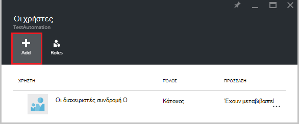  

2.  Επιλέξτε ένα ρόλο από τη λίστα με τους ρόλους διαθέσιμη. Θα σας θα επιλέξετε ρόλο **αναγνώστη** , αλλά μπορείτε να επιλέξετε οποιαδήποτε από τις διαθέσιμες ενσωματωμένες τους ρόλους που υποστηρίζει αυτοματισμό λογαριασμού ή οποιοδήποτε προσαρμοσμένο ρόλο που ενδεχομένως έχετε ορίσει.  

    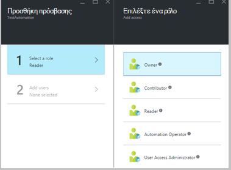  

3.  Κάντε κλικ στην επιλογή **Προσθήκη χρηστών** για να ανοίξετε την **Προσθήκη χρηστών** blade. Εάν έχετε προσθέσει οποιαδήποτε χρηστών, ομάδων ή τις εφαρμογές για να διαχειριστείτε τη συνδρομή σας, στη συνέχεια, παρατίθενται αυτούς τους χρήστες και μπορείτε να επιλέξετε να προσθέσετε την access. Εάν δεν υπάρχουν οποιαδήποτε χρηστών που αναφέρονται ή εάν ο χρήστης που σας ενδιαφέρει η προσθήκη δεν παρατίθεται στη συνέχεια, κάντε κλικ στην επιλογή **πρόσκληση** για να ανοίξετε την **πρόσκληση επισκέπτης** blade, όπου μπορείτε να προσκαλέσετε ένα χρήστη με μια έγκυρη διεύθυνση ηλεκτρονικού ταχυδρομείου λογαριασμός Microsoft όπως Outlook.com, OneDrive ή Xbox Live αναγνωριστικά. Αφού έχετε εισαγάγει τη διεύθυνση ηλεκτρονικού ταχυδρομείου του χρήστη, κάντε κλικ στο κουμπί **επιλογή** για να προσθέσετε το χρήστη και, στη συνέχεια, κάντε κλικ στο κουμπί **OK**. 

    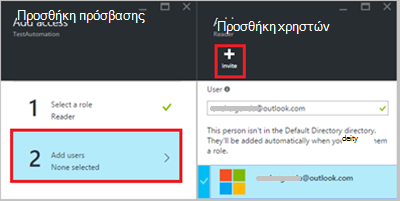  
 
    Τώρα θα πρέπει να βλέπετε το χρήστης προστέθηκε το blade **χρήστες** με το ρόλο **πρόγραμμα ανάγνωσης** , στους οποίους έχουν ανατεθεί.  

      

    Μπορείτε επίσης να αντιστοιχίσετε ένα ρόλο για το χρήστη από το blade **ρόλους** . 

1. Κάντε κλικ στην επιλογή **Ρόλοι** από το blade τους χρήστες για να ανοίξετε το **blade ρόλους**. Από αυτό blade, μπορείτε να προβάλετε το όνομα του ρόλου, τον αριθμό των χρηστών και ομάδων που έχει αντιστοιχιστεί σε αυτόν το ρόλο.

    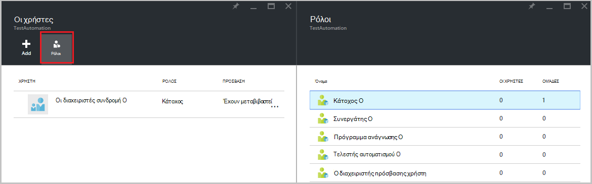  
   
    >[AZURE.NOTE] Έλεγχος πρόσβασης βάσει ρόλων μπορεί να οριστεί μόνο στο επίπεδο αυτοματισμού λογαριασμό και όχι οποιαδήποτε πόρων κάτω από το λογαριασμό αυτοματισμού.

    Μπορείτε να εκχωρήσετε περισσότερους από έναν ρόλους για ένα χρήστη, ομάδας ή εφαρμογή. Για παράδειγμα, εάν προσθέσουμε το ρόλο **Τελεστή αυτοματισμού** μαζί με το **ρόλο αναγνώστη** στο χρήστη, στη συνέχεια, αυτές μπορεί να δείτε όλους τους πόρους αυτοματισμού, καθώς και εκτέλεση των εργασιών runbook. Μπορείτε να επεκτείνετε την αναπτυσσόμενη λίστα για να προβάλετε μια λίστα με τους ρόλους που έχουν εκχωρηθεί στο χρήστη.  

    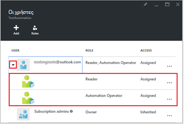  
 
### Κατάργηση χρήστη

Μπορείτε να καταργήσετε τα δικαιώματα πρόσβασης για ένα χρήστη που δεν τη διαχείριση του λογαριασμού αυτοματισμού ή που δεν λειτουργεί πλέον για τον οργανισμό. Ακολουθούν τα βήματα για να καταργήσετε ένα χρήστη: 

1.  Από το blade **χρήστες** , επιλέξτε την εκχώρηση ρόλων που θέλετε να καταργήσετε.

2.  Κάντε κλικ στο κουμπί **Κατάργηση** από το blade λεπτομέρειες ανάθεσης.

3.  Κάντε κλικ στο κουμπί **Ναι** για να επιβεβαιώσετε την κατάργηση. 

    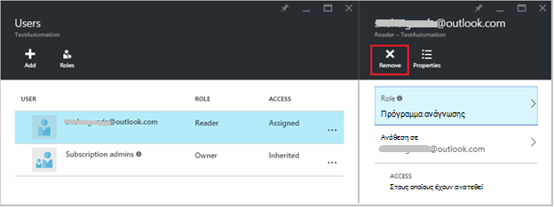  

## Ρόλος χρήστη που έχει αντιστοιχιστεί

Όταν ένας χρήστης που έχουν εκχωρηθεί σε ένα ρόλο συνδέεται με το λογαριασμό της αυτοματισμού, μπορούν τώρα να δουν το λογαριασμό του κατόχου που αναφέρονται στη λίστα των **Προεπιλεγμένων σε καταλόγους**. Για να προβάλετε το λογαριασμό αυτοματισμού που έχουν προστεθεί στο, αυτά πρέπει να μεταβείτε στον προεπιλεγμένο κατάλογο του κατόχου προεπιλεγμένο κατάλογο.  

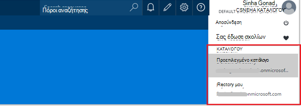  

### Εμπειρία χρήστη για το ρόλο τελεστή αυτοματισμού

Όταν ένας χρήστης, που έχει αντιστοιχιστεί σε προβολές Αυτοματισμός τελεστή ρόλο το λογαριασμό αυτοματισμού που τους έχουν ανατεθεί, μόνο να προβάλετε τη λίστα των runbooks, runbook εργασίες και χρονοδιαγράμματα που έχουν δημιουργηθεί με το λογαριασμό αυτοματισμού αλλά δεν είναι δυνατή η προβολή τους ορισμού. Να ξεκινήσετε, διακοπή, αναστολή, συνέχιση ή προγραμματισμός της εργασίας runbook. Ο χρήστης δεν θα έχουν πρόσβαση σε άλλους πόρους αυτοματισμού όπως διαμορφώσεις, ομάδες εργασίας υβριδική ή κόμβους DSC.  

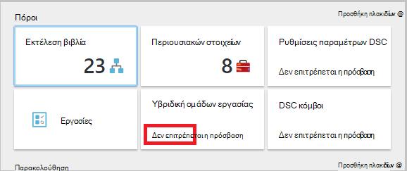  

Όταν ο χρήστης κάνει κλικ σε runbook, οι εντολές για να προβάλετε το αρχείο προέλευσης ή να επεξεργαστείτε runbook δεν παρέχονται με το ρόλο τελεστή αυτοματισμού δεν επιτρέπεται η πρόσβαση σε αυτά.  

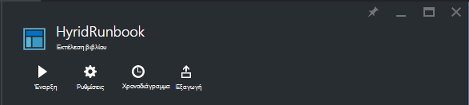  

Ο χρήστης θα έχει πρόσβαση για να προβάλετε και να δημιουργήσετε χρονοδιαγράμματα αλλά δεν θα έχουν πρόσβαση σε οποιονδήποτε άλλο τύπο περιουσιακών στοιχείων.  

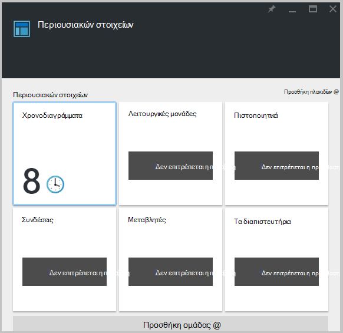  

Αυτός ο χρήστης δεν επίσης να έχετε πρόσβαση για να προβάλετε το webhooks που σχετίζεται με ένα runbook

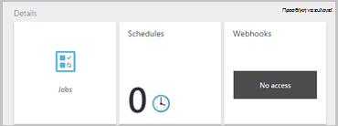  

## Ρύθμιση παραμέτρων RBAC για το λογαριασμό σας αυτοματισμού με χρήση του PowerShell Azure

Πρόσβασης βάσει ρόλων μπορεί επίσης να ρυθμιστεί για ένα λογαριασμό αυτοματισμού χρησιμοποιώντας τα ακόλουθα [cmdlet του Azure PowerShell](../active-directory/role-based-access-control-manage-access-powershell.md).

• [Get-AzureRmRoleDefinition](https://msdn.microsoft.com/library/mt603792.aspx) παραθέτει όλους τους ρόλους RBAC που είναι διαθέσιμες στο Azure Active Directory. Μπορείτε να χρησιμοποιήσετε αυτή την εντολή μαζί με την ιδιότητα " **όνομα** " για να εμφανίσετε όλες τις ενέργειες που μπορούν να εκτελεστούν από ένα συγκεκριμένο ρόλο.  
    **Παράδειγμα:**  
    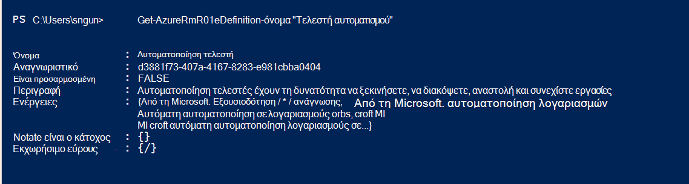  

• [Get-AzureRmRoleAssignment](https://msdn.microsoft.com/library/mt619413.aspx) παραθέτει εκχώρησης ρόλου Azure AD RBAC στο καθορισμένο εύρος. Χωρίς παραμέτρους, αυτή η εντολή επιστρέφει όλες τις αναθέσεις ρόλων έγινε σύμφωνα με τη συνδρομή. Χρησιμοποιήστε την παράμετρο **ExpandPrincipalGroups** εκχωρήσεις λίστα πρόσβασης για το συγκεκριμένο χρήστη, καθώς και τις ομάδες, ο χρήστης είναι μέλος της.  
    **Παράδειγμα:** Χρησιμοποιήστε την ακόλουθη εντολή για μια λίστα όλων των χρηστών και τους ρόλους μέσα σε ένα λογαριασμό αυτοματισμού.

    Get-AzureRMRoleAssignment -scope “/subscriptions/<SubscriptionID>/resourcegroups/<Resource Group Name>/Providers/Microsoft.Automation/automationAccounts/<Automation Account Name>” 

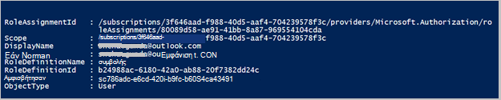

• [Δημιουργία AzureRmRoleAssignment](https://msdn.microsoft.com/library/mt603580.aspx) για να εκχωρήσετε πρόσβαση σε χρήστες, ομάδες και εφαρμογών για μια ειδική εμβέλεια.  
    **Παράδειγμα:** Χρησιμοποιήστε την παρακάτω εντολή για να αναθέσει το ρόλο "Τελεστή αυτοματισμού" για ένα χρήστη στην εμβέλεια αυτοματισμού λογαριασμού.

    New-AzureRmRoleAssignment -SignInName <sign-in Id of a user you wish to grant access> -RoleDefinitionName "Automation operator" -Scope “/subscriptions/<SubscriptionID>/resourcegroups/<Resource Group Name>/Providers/Microsoft.Automation/automationAccounts/<Automation Account Name>”  

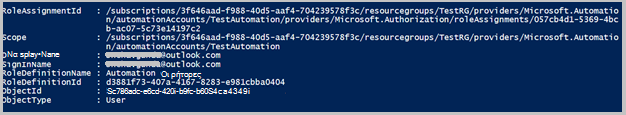

• Χρησιμοποιήστε [AzureRmRoleAssignment κατάργηση](https://msdn.microsoft.com/library/mt603781.aspx) για να καταργήσετε πρόσβασης από έναν συγκεκριμένο χρήστη, ομάδας ή εφαρμογή από μια ειδική εμβέλεια.  
    **Παράδειγμα:** Χρησιμοποιήστε την παρακάτω εντολή για να καταργήσετε το χρήστη από το ρόλο "Τελεστή αυτοματισμού" στην εμβέλεια αυτοματισμού λογαριασμού.

    Remove-AzureRmRoleAssignment -SignInName <sign-in Id of a user you wish to remove> -RoleDefinitionName "Automation Operator" -Scope “/subscriptions/<SubscriptionID>/resourcegroups/<Resource Group Name>/Providers/Microsoft.Automation/automationAccounts/<Automation Account Name>”

Στα παραπάνω παραδείγματα, αντικαταστήστε **Είσοδος αναγνωριστικό**, **αναγνωριστικό εγγραφής**, **όνομα ομάδας πόρων** και **το όνομα του λογαριασμού αυτοματισμού** με τις λεπτομέρειες του λογαριασμού σας. Επιλέξτε **Ναι** όταν σας ζητηθεί να επιβεβαιώσετε πριν να συνεχίσετε την κατάργηση εκχώρησης ρόλου χρήστη.   

## Επόμενα βήματα
-  Για πληροφορίες σχετικά με διαφορετικούς τρόπους για να ρυθμίσετε τις παραμέτρους RBAC για την αυτοματοποίηση Azure, ανατρέξτε για τη [Διαχείριση RBAC με το Azure PowerShell](../active-directory/role-based-access-control-manage-access-powershell.md).
- Για λεπτομέρειες σχετικά με διαφορετικούς τρόπους για να ξεκινήσετε μια runbook, ανατρέξτε στο θέμα [ξεκινώντας μια runbook](automation-starting-a-runbook.md)
- Για πληροφορίες σχετικά με τους τύπους διαφορετικό runbook, που αναφέρονται σε [τύπους runbook αυτοματισμού Azure](automation-runbook-types.md)

