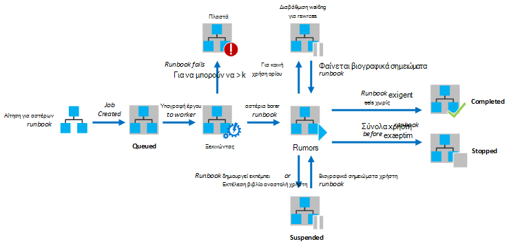
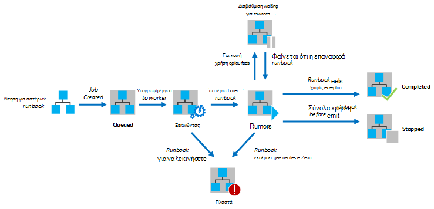

<properties
   pageTitle="Εκτέλεση Runbook στο Azure Automation"
   description="Περιγράφει τις λεπτομέρειες του πώς μια runbook στο Azure Automation υποβάλλεται σε επεξεργασία."
   services="automation"
   documentationCenter=""
   authors="mgoedtel"
   manager="stevenka"
   editor="tysonn" />
<tags
   ms.service="automation"
   ms.devlang="na"
   ms.topic="article"
   ms.tgt_pltfrm="na"
   ms.workload="infrastructure-services"
   ms.date="03/21/2016"
   ms.author="bwren" />

# Εκτέλεση Runbook στο Azure Automation

Όταν ξεκινάτε ένα runbook στο Azure αυτοματισμού, δημιουργείται μια εργασία. Μια εργασία είναι μια παρουσία μία εκτέλεση μιας runbook. Για να εκτελέσετε κάθε εργασία αντιστοιχίζεται μια εργαζόμενου Azure αυτοματισμού. Ενώ εργαζομένων χρησιμοποιούνται από κοινού από πολλούς λογαριασμούς Azure, οι εργασίες από διαφορετικούς λογαριασμούς Αυτοματισμός είναι απομόνωσης από το ένα το άλλο. Δεν έχετε τον έλεγχό ποια εργαζόμενου θα υπηρεσίας την αίτηση για την εργασία σας.  Ένα μεμονωμένο runbook μπορεί να έχει πολλές εργασίες που εκτελείται κάθε φορά. Όταν προβάλλετε τη λίστα των runbooks στην πύλη του Azure, αυτό θα εμφανίσει την κατάσταση του τελευταίου έργου που ξεκίνησε για κάθε runbook. Μπορείτε να προβάλετε τη λίστα εργασιών για κάθε runbook για να παρακολουθείτε την κατάσταση κάθε. Για μια περιγραφή των τις καταστάσεις διαφορετικό έργο, ανατρέξτε στο θέμα [Εργασία καταστάσεις](#job-statuses).

Το παρακάτω διάγραμμα παρουσιάζει τον κύκλο ζωής ενός έργου runbook για [γραφικά runbooks](automation-runbook-types.md#graphical-runbooks) και [runbooks PowerShell ροής εργασίας](automation-runbook-types.md#powershell-workflow-runbooks).

Το παρακάτω διάγραμμα παρουσιάζει τον κύκλο ζωής ενός έργου runbook για [PowerShell runbooks](automation-runbook-types.md#powershell-runbooks).

Τις εργασίες σας θα έχουν πρόσβαση στο Azure τους πόρους σας, κάνοντας μια σύνδεση με τη συνδρομή σας στο Azure. Μόνο θα έχουν πρόσβαση σε πόρους στο κέντρο δεδομένων σας εάν είναι προσβάσιμα από το cloud δημόσια αυτούς τους πόρους.

## Καταστάσεις εργασία

Ο παρακάτω πίνακας περιγράφει τις διαφορετικές καταστάσεις που είναι διαθέσιμες για ένα έργο.

| Κατάσταση| Περιγραφή|
|:---|:---|
|Ολοκληρώθηκε|Η εργασία ολοκληρώθηκε με επιτυχία.|
|Απέτυχε η| Για [runbooks Graphical και τη ροή εργασίας του PowerShell](automation-runbook-types.md), runbook απέτυχε η μεταγλώττιση.  Για [runbooks δέσμη ενεργειών του PowerShell](automation-runbook-types.md), runbook απέτυχε η έναρξη ή η εργασία αντιμετώπισε μια εξαίρεση. |
|Αποτυχία, αναμονή για πόρους|Η εργασία απέτυχε επειδή φτάσει το όριο [δίκαιο τμήμα](#fairshare) τρεις φορές και αποτελέσματα από το ίδιο σημείο ελέγχου ή από την έναρξη του runbook κάθε φορά.|
|Στην ουρά|Η εργασία είναι σε αναμονή για τους πόρους σε μια εργαζόμενου αυτοματισμού αναμένεται διαθέσιμες ώστε να μπορεί να ξεκινήσει.|
|Έναρξη|Η εργασία έχει εκχωρηθεί ο εργαζόμενος και το σύστημα είναι σε διαδικασία ξεκινήσετε.|
|Συνέχιση|Το σύστημα είναι σε διαδικασία συνέχιση της εργασίας μετά την αναβλήθηκε.|
|Εκτέλεση|Εκτέλεση του έργου.|
|Εκτελείται, αναμονή για πόρους|Η εργασία έχει καταργηθεί, επειδή το φτάσει το όριο ["έκθεση" κοινή χρήση](#fairshare) . Αυτό θα συνεχίσει λίγο από το τελευταίο σημείο ελέγχου.|
|Έγινε διακοπή|Η εργασία διακόπηκε από το χρήστη, πριν να ολοκληρωθεί.|
|Διακοπή|Το σύστημα είναι σε διαδικασία διακοπή της εργασίας.|
|Σε αναστολή|Η εργασία έχει ανασταλεί από το χρήστη, από το σύστημα ή από μια εντολή στο runbook. Μια εργασία που έχει ανασταλεί μπορεί να ξεκινήσει ξανά και θα συνεχιστεί από το τελευταίο σημείο ελέγχου ή από την αρχή του runbook εάν έχει χωρίς σημεία ελέγχου. Runbook θα αναστέλλεται μόνο από το σύστημα στην περίπτωση μιας εξαίρεσης. Από προεπιλογή, ErrorActionPreference έχει οριστεί σε **Continue** σημασία που θα εξακολουθούν να εκτελούνται την εργασία σε ένα μήνυμα σφάλματος. Εάν έχει οριστεί αυτή η μεταβλητή προτίμηση για να **διακόψετε** την εργασία αναστολή σε ένα μήνυμα σφάλματος.  Ισχύει μόνο για [runbooks Graphical και τη ροή εργασίας του PowerShell](automation-runbook-types.md) .|
|Αναστολής|Το σύστημα προσπαθεί να αναστείλει την εργασία στο της αίτησης του χρήστη. Runbook πρέπει να φτάσει το επόμενο σημείο ελέγχου πριν να αναστέλλεται. Εάν έχει παρέλθει το τελευταίο σημείο ελέγχου, στη συνέχεια, αυτό θα ολοκληρωθεί πριν να αναστέλλεται.  Ισχύει μόνο για [runbooks Graphical και τη ροή εργασίας του PowerShell](automation-runbook-types.md) .|

## Προβολή κατάστασης εργασίας χρησιμοποιώντας την πύλη διαχείρισης του Azure

### Αυτοματοποίηση πίνακα εργαλείων

Στον πίνακα εργαλείων αυτοματισμού εμφανίζει μια σύνοψη όλων των το runbooks για ένα λογαριασμό του συγκεκριμένου αυτοματισμού. Περιλαμβάνει επίσης μια επισκόπηση χρήσης για το λογαριασμό. Το γράφημα σύνοψης εμφανίζει τον αριθμό των σύνολο εργασιών για όλα τα runbooks που καταχωρήσατε κάθε κατάσταση πάνω από ένα δεδομένο αριθμό ημερών ή ωρών. Μπορείτε να επιλέξετε το χρονικό διάστημα στην επάνω δεξιά γωνία του γραφήματος. Η ώρα άξονα του γραφήματος θα αλλάξει σύμφωνα με τον τύπο του χρονικού διαστήματος που επιλέγετε. Μπορείτε να επιλέξετε εάν θέλετε να εμφανίσετε τη γραμμή για τη συγκεκριμένη κατάσταση, κάνοντας κλικ στο επάνω μέρος της οθόνης.

Μπορείτε να χρησιμοποιήσετε τα παρακάτω βήματα για να εμφανίσετε τον πίνακα εργαλείων αυτοματισμού.

1. Στην πύλη διαχείρισης του Azure, επιλέξτε **Αυτοματοποίηση** και, στη συνέχεια, στη συνέχεια, κάντε κλικ στο όνομα ενός λογαριασμού αυτοματισμού.
1. Επιλέξτε την καρτέλα **πίνακα εργαλείων** .

### Πίνακας εργαλείων Runbook

Πίνακας εργαλείων Runbook εμφανίζει μια σύνοψη για ένα μεμονωμένο runbook. Το γράφημα σύνοψης εμφανίζει τον αριθμό των σύνολο εργασιών για runbook που καταχωρήσατε κάθε κατάσταση πάνω από ένα δεδομένο αριθμό ημερών ή ωρών. Μπορείτε να επιλέξετε το χρονικό διάστημα στην επάνω δεξιά γωνία του γραφήματος. Η ώρα άξονα του γραφήματος θα αλλάξει σύμφωνα με τον τύπο του χρονικού διαστήματος που επιλέγετε. Μπορείτε να επιλέξετε εάν θέλετε να εμφανίσετε τη γραμμή για τη συγκεκριμένη κατάσταση, κάνοντας κλικ στο επάνω μέρος της οθόνης.

Μπορείτε να χρησιμοποιήσετε τα παρακάτω βήματα για να εμφανίσετε τον πίνακα εργαλείων Runbook.

1. Στην πύλη διαχείρισης του Azure, επιλέξτε **Αυτοματοποίηση** και, στη συνέχεια, στη συνέχεια, κάντε κλικ στο όνομα ενός λογαριασμού αυτοματισμού.
1. Κάντε κλικ στο όνομα ενός runbook.
1. Επιλέξτε την καρτέλα **πίνακα εργαλείων** .

### Σύνοψη εργασίας

Μπορείτε να προβάλετε μια λίστα με όλες τις εργασίες που έχουν δημιουργηθεί για μια συγκεκριμένη runbook και την πιο πρόσφατη κατάστασή τους. Μπορείτε να φιλτράρετε αυτήν τη λίστα με κατάσταση εργασίας και το εύρος ημερομηνιών για την τελευταία αλλαγή στο έργο. Κάντε κλικ στο όνομα της εργασίας για να προβάλετε τα λεπτομερή στοιχεία και τα αποτελέσματά. Τα λεπτομερή προβολή της εργασίας περιλαμβάνει τις τιμές για τις παραμέτρους του runbook που παρέχονται για την εργασία.

Μπορείτε να χρησιμοποιήσετε τα παρακάτω βήματα για να προβάλετε τις εργασίες για μια runbook.

1. Στην πύλη διαχείρισης του Azure, επιλέξτε **Αυτοματοποίηση** και, στη συνέχεια, στη συνέχεια, κάντε κλικ στο όνομα ενός λογαριασμού αυτοματισμού.
1. Κάντε κλικ στο όνομα ενός runbook.
1. Επιλέξτε την καρτέλα **εργασίες** .
1. Κάντε κλικ στη στήλη **Δημιουργία της εργασίας** για μια εργασία για να προβάλετε τις λεπτομέρειες και εξόδου.

## Ανάκτηση κατάστασης εργασίας χρησιμοποιώντας το Windows PowerShell

Μπορείτε να χρησιμοποιήσετε το [Get-AzureAutomationJob](http://msdn.microsoft.com/library/azure/dn690263.aspx) για την ανάκτηση των εργασιών που έχει δημιουργηθεί για μια runbook και τις λεπτομέρειες της μια συγκεκριμένη εργασία. Εάν ξεκινήσετε μια runbook με χρήση [AzureAutomationRunbook έναρξης](http://msdn.microsoft.com/library/azure/dn690259.aspx)του Windows PowerShell, στη συνέχεια, θα επιστρέψει η εργασία που προκύπτει. Χρησιμοποιήστε εξόδου [Get-AzureAutomationJob](http://msdn.microsoft.com/library/azure/dn690263.aspx)για να λάβετε μια εργασία εξόδου.

Τα ακόλουθα δείγματα εντολών ανακτά την τελευταία εργασία για ένα δείγμα runbook και εμφανίζει την κατάσταση, παρέχουν τις τιμές για τις παραμέτρους του runbook και την έξοδο από την εργασία.

    $job = (Get-AzureAutomationJob –AutomationAccountName "MyAutomationAccount" –Name "Test-Runbook" | sort LastModifiedDate –desc)[0]
    $job.Status
    $job.JobParameters
    Get-AzureAutomationJobOutput –AutomationAccountName "MyAutomationAccount" -Id $job.Id –Stream Output

## Κοινή χρήση "έκθεση"

Για να κάνετε κοινή χρήση πόρων μεταξύ όλων των runbooks στο cloud, Azure αυτοματισμού θα προσωρινά κατάργηση φόρτωσης οποιαδήποτε εργασία αφού έχει εκτελεστεί για 3 ώρες.    [Graphical](automation-runbook-types.md#graphical-runbooks) και τη [Ροή εργασίας του PowerShell](automation-runbook-types.md#powershell-workflow-runbooks) runbooks θα συνεχιστεί από το τελευταίο [σημείο ελέγχου](http://technet.microsoft.com/library/dn469257.aspx#bk_Checkpoints). Σε αυτό το διάστημα, η εργασία θα εμφανιστεί μια κατάσταση της λειτουργίας, αναμονή για πόρους. Εάν runbook έχει χωρίς σημεία ελέγχου ή η εργασία δεν είχαν φτάσει το πρώτο σημείο ελέγχου πριν από την κατάργηση φόρτωσης, στη συνέχεια, θα γίνει επανεκκίνηση από την αρχή.  [PowerShell](automation-runbook-types.md#powershell-runbooks) runbooks είναι πάντα επανεκκίνηση από την αρχή, επειδή δεν υποστηρίζουν σημεία ελέγχου.

>[AZURE.NOTE] Το όριο δίκαιο τμήμα δεν ισχύει για εργασίες runbook εκτέλεση σε υβριδική Runbook εργαζομένων.

Εάν runbook επανεκκίνηση του από το ίδιο σημείο ελέγχου ή από την αρχή του runbook τρεις φορές διαδοχικές, θα τερματιστεί με κατάσταση απέτυχε, αναμονή για πόρους. Πρόκειται για την προστασία από runbooks απεριόριστο χρονικό διάστημα εκτελείται χωρίς την ολοκλήρωση, δεδομένου ότι δεν μπορείτε να κάνετε το επόμενο σημείο ελέγχου χωρίς την κατάργηση φόρτωσης ξανά. Σε αυτήν την περίπτωση, θα λάβετε την παρακάτω εξαίρεση με την αποτυχία.

*Η εργασία δεν είναι δυνατό να συνεχίσετε την εκτέλεση επειδή επανειλημμένα καταργήθηκε από το ίδιο σημείο ελέγχου. Βεβαιωθείτε ότι το Runbook δεν εκτελεί μακροσκελείς λειτουργίες χωρίς συνεχίζεται στην κατάσταση.*

Όταν δημιουργείτε μια runbook, θα πρέπει να βεβαιωθείτε ότι ο χρόνος για να εκτελέσετε οποιαδήποτε δραστηριότητες μεταξύ δύο σημείων ελέγχου δεν θα υπερβαίνει 3 ώρες. Ίσως χρειαστεί να προσθέσετε σημεία ελέγχου για να σας runbook για να βεβαιωθείτε ότι δεν φτάσετε αυτό το όριο 3 ώρα ή διασπάσετε long εκτελεί λειτουργίες. Για παράδειγμα, το runbook μπορεί να εκτελέσει μια reindex σε μια μεγάλη βάση δεδομένων SQL. Εάν αυτή η λειτουργία μόνο δεν ολοκληρωθεί εντός του ορίου "έκθεση" κοινή χρήση, στη συνέχεια, η εργασία θα είναι φόρτωσης και επανεκκίνηση του από την αρχή. Σε αυτήν την περίπτωση, πρέπει να διακόψετε τη λειτουργία reindex σε πολλά βήματα, όπως ξεκινήσετε έναν πίνακα κάθε φορά, και, στη συνέχεια, εισαγάγετε ένα σημείο ελέγχου μετά από κάθε λειτουργία, έτσι ώστε η εργασία ενδέχεται να βιογραφικό σημείωμα μετά την τελευταία λειτουργία για να ολοκληρωθεί.

## Επόμενα βήματα

- [Έναρξη μιας runbook σε αυτοματισμού Azure](automation-starting-a-runbook.md)
