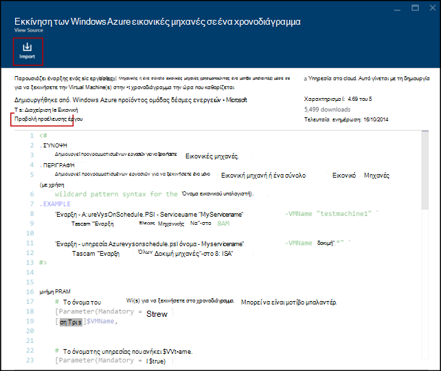

<properties
    pageTitle="Συλλογές Runbook και λειτουργική μονάδα για την αυτοματοποίηση Azure | Microsoft Azure"
    description="Runbooks και οι λειτουργικές μονάδες από τη Microsoft και της Κοινότητας είναι διαθέσιμες για να εγκαταστήσετε και να χρησιμοποιήσετε στο περιβάλλον του Azure αυτοματισμού.  Σε αυτό το άρθρο περιγράφει πώς μπορείτε να αποκτήσετε πρόσβαση σε αυτούς τους πόρους και να συνεισφέρετε σας runbooks στη συλλογή."
    services="automation"
    documentationCenter=""
    authors="mgoedtel"
    manager="jwhit"
    editor="tysonn" />
<tags
    ms.service="automation"
    ms.devlang="na"
    ms.topic="article"
    ms.tgt_pltfrm="na"
    ms.workload="infrastructure-services"
    ms.date="09/18/2016"
    ms.author="magoedte;bwren" />

# Συλλογές Runbook και λειτουργική μονάδα για την αυτοματοποίηση Azure

Αντί να δημιουργήσετε το δικό σας runbooks και οι λειτουργικές μονάδες στο Azure αυτοματισμού, μπορείτε να αποκτήσετε πρόσβαση σε μια ποικιλία σενάρια που έχετε ήδη δημιουργήσει από τη Microsoft και την Κοινότητα.  Μπορείτε είτε να χρησιμοποιήσετε αυτά τα σενάρια χωρίς τροποποίηση ή μπορείτε να τις χρησιμοποιήσετε ως σημείο εκκίνησης και να επεξεργαστείτε τους για τις συγκεκριμένες απαιτήσεις σας.

Μπορείτε να λάβετε runbooks από τη [Συλλογή Runbook](#runbooks-in-runbook-gallery) και οι λειτουργικές μονάδες από τη [Συλλογή του PowerShell](#modules-in-powerShell-gallery).  Μπορείτε επίσης να συμβάλλουν στην Κοινότητα με την κοινή χρήση σενάρια που αναπτύσσετε.

## Runbooks στη συλλογή Runbook

Η [Συλλογή Runbook](http://gallery.technet.microsoft.com/scriptcenter/site/search?f[0].Type=RootCategory&f[0].Value=WindowsAzure&f[1].Type=SubCategory&f[1].Value=WindowsAzure_automation&f[1].Text=Automation) παρέχει μια ποικιλία runbooks από τη Microsoft και την Κοινότητα που μπορείτε να εισαγάγετε στο Azure αυτοματισμού. Μπορείτε να κάνετε είτε λήψη ενός runbook από τη συλλογή το οποίο βρίσκεται στο [Κέντρο δεσμών ενεργειών TechNet](http://gallery.technet.microsoft.com/)ή μπορείτε να εισαγάγετε απευθείας runbooks από τη συλλογή από το Azure κλασική πύλη ή Azure πύλη.

Μπορείτε να εισάγετε μόνο απευθείας από τη συλλογή Runbook χρησιμοποιώντας το Azure κλασική πύλη ή Azure πύλη. Δεν μπορείτε να εκτελέσετε αυτήν τη συνάρτηση χρησιμοποιώντας το Windows PowerShell.

>[AZURE.NOTE] Που θα πρέπει να επικυρώσει τα περιεχόμενα του οποιαδήποτε runbooks ότι μπορείτε να μεταφέρετε από τη συλλογή Runbook και προσεκτικοί κατά την εγκατάσταση και εκτέλεση τους σε ένα περιβάλλον παραγωγής. |

### Για να εισαγάγετε μια runbook από τη συλλογή Runbook με την πύλη κλασική του Azure

1. Στην πύλη του Azure, κάντε κλικ στην επιλογή, **Δημιουργία**, **εφαρμογή υπηρεσιών**, **αυτοματισμού**, **Runbook**, **Από τη συλλογή**.
2. Επιλέξτε μια κατηγορία για να προβάλετε σχετικές runbooks και επιλέξτε μια runbook για να προβάλετε τις λεπτομέρειές του. Όταν επιλέγετε runbook που θέλετε, κάντε κλικ στο κουμπί δεξιού βέλους.

    

3. Εξετάστε τα περιεχόμενα του runbook και σημειώστε τις απαιτήσεις στην περιγραφή. Όταν ολοκληρώσετε τη διαδικασία, κάντε κλικ στο κουμπί δεξιού βέλους.
4. Πληκτρολογήστε τις λεπτομέρειες της runbook και, στη συνέχεια, κάντε κλικ στο κουμπί σημάδι ελέγχου. Το όνομα του runbook θα είναι ήδη συμπληρωμένα.
5. Runbook θα εμφανίζονται στην καρτέλα **Runbooks** για το λογαριασμό αυτοματισμού.

### Για να εισαγάγετε μια runbook από τη συλλογή Runbook με την πύλη του Azure

1. Στην πύλη του Azure, ανοίξτε το λογαριασμό σας αυτοματισμού.
2. Κάντε κλικ στο πλακίδιο **Runbooks** για να ανοίξετε τη λίστα των runbooks.
3. Κάντε κλικ στο κουμπί **Αναζήτηση συλλογή** .

    

4. Εντοπίστε το στοιχείο συλλογής που θέλετε και επιλέξτε το για να προβάλετε τις λεπτομέρειες.

    

4. Κάντε κλικ στην **προβολή έργου προέλευσης** για να προβάλετε το στοιχείο στο [Κέντρο δεσμών ενεργειών στο TechNet](http://gallery.technet.microsoft.com/).
5. Για να εισαγάγετε ένα στοιχείο, κάντε κλικ σε αυτό για να προβάλετε τις λεπτομέρειες και, στη συνέχεια, κάντε κλικ στο κουμπί **Εισαγωγή** .

    

6. Προαιρετικά, αλλάξτε το όνομα του runbook και, στη συνέχεια, κάντε κλικ στο **κουμπί OK** για να εισαγάγετε runbook.
5. Runbook θα εμφανίζονται στην καρτέλα **Runbooks** για το λογαριασμό αυτοματισμού.

### Προσθήκη μιας runbook στη συλλογή runbook

Η Microsoft συνιστά να προσθέσετε runbooks στη συλλογή Runbook που πιστεύετε ότι θα ήταν χρήσιμες στους άλλους πελάτες.  Μπορείτε να προσθέσετε μια runbook με την [Αποστολή του στο Κέντρο δέσμης ενεργειών](http://gallery.technet.microsoft.com/site/upload) λαμβάνοντας υπόψη τις ακόλουθες λεπτομέρειες.

- Πρέπει να καθορίσετε *Windows Azure* για την **κατηγορία** και *αυτοματισμού* για την **υποκατηγορία** για runbook ώστε να εμφανίζεται στον οδηγό.  

- Η αποστολή πρέπει να είναι ένα αρχείο .ps1 ή .graphrunbook.  Εάν runbook απαιτεί οποιαδήποτε λειτουργικές μονάδες, runbooks θυγατρικό ή στοιχεία, στη συνέχεια, που θα πρέπει να λίστα αυτών στην περιγραφή της υποβολής και στην ενότητα σχόλια του runbook.  Εάν έχετε ένα σενάριο που απαιτεί πολλά runbooks, στη συνέχεια, αποστείλετε κάθε ξεχωριστά και περιλαμβάνει τα ονόματα των το σχετικό runbooks σε κάθε μία από τις περιγραφές τους. Βεβαιωθείτε ότι χρησιμοποιείτε τις ίδιες ετικέτες, έτσι ώστε να θα εμφανίζονται στην ίδια κατηγορία. Ο χρήστης θα έχει για να διαβάσετε την περιγραφή για να γνωρίζετε ότι απαιτούνται άλλες runbooks το σενάριο για να εργαστείτε.

- Εάν δημοσιεύετε ένα **γραφικών runbook** (όχι μια γραφικών ροή εργασίας), προσθέστε την ετικέτα "GraphicalPS". 

- Εισαγάγετε μια PowerShell ή ροής εργασίας PowerShell τμήμα κώδικα στην περιγραφή του χρησιμοποιώντας εικονίδιο **Εισαγωγή ενότητα κώδικα** .

- Στη σύνοψη για την αποστολή θα εμφανίζονται στα αποτελέσματα Runbook συλλογή, ώστε να πρέπει να παρέχουν λεπτομερείς πληροφορίες που θα σας βοηθήσει Προσδιορισμός της λειτουργικότητας του runbook χρήστη.

- Θα πρέπει να μπορείτε να εκχωρήσετε ένα έως τρία από τις εξής ετικέτες για την αποστολή.  Runbook θα εμφανίζεται στον Οδηγό κάτω από τις κατηγορίες που ταιριάζουν με τις ετικέτες.  Οποιεσδήποτε ετικέτες δεν σε αυτήν τη λίστα θα αγνοηθεί από τον οδηγό. Εάν δεν καθορίσετε όλες τις ετικέτες που ταιριάζει, runbook θα εμφανίζεται κάτω από τη δεύτερη κατηγορία.

 - Δημιουργία αντιγράφων ασφαλείας
 - Δυναμικότητας διαχείρισης
 - Αλλαγή στοιχείου ελέγχου
 - Συμμόρφωση
 - Αποκλίσεις / δοκιμή περιβάλλοντα
 - Αποκατάσταση
 - Παρακολούθηση
 - Ενημέρωση κώδικα
 - Προμήθεια
 - Αποκατάσταση εύρυθμης λειτουργίας
 - Εικονική κύκλου ζωής διαχείρισης

- Αυτοματοποίηση ενημερώνει τη συλλογή μία φορά κάθε ώρα, έτσι δεν θα βλέπετε συνεισφορά σας αμέσως.

## Λειτουργικές μονάδες στη συλλογή PowerShell

Λειτουργικές μονάδες PowerShell περιέχουν cmdlet που μπορείτε να χρησιμοποιήσετε με το runbooks και υπάρχουσες λειτουργικές μονάδες που μπορείτε να το εγκαταστήσετε σε αυτοματισμού Azure είναι διαθέσιμες στη [Συλλογή PowerShell](http://www.powershellgallery.com).  Μπορείτε να εκκίνηση αυτή η συλλογή από την πύλη του Azure και να τις εγκαταστήσετε απευθείας στο αυτοματισμού Azure ή μπορείτε να κάντε λήψη των αρχείων και να τις εγκαταστήσετε με μη αυτόματο τρόπο.  Δεν μπορείτε να εγκαταστήσετε τις λειτουργικές μονάδες απευθείας από την πύλη του Azure κλασική, αλλά μπορείτε να κάνετε λήψη τους εγκατάσταση τους, όπως θα κάνατε με οποιαδήποτε άλλα λειτουργική μονάδα.

### Για να εισαγάγετε μια λειτουργική μονάδα από τη συλλογή λειτουργικής μονάδας αυτοματισμού με την πύλη του Azure

1. Στην πύλη του Azure, ανοίξτε το λογαριασμό σας αυτοματισμού.
2. Κάντε κλικ στο πλακίδιο **περιουσιακών στοιχείων** για να ανοίξετε τη λίστα των διαθέσιμων στοιχείων.
3. Κάντε κλικ στο πλακίδιο **λειτουργικές μονάδες** για να ανοίξετε τη λίστα των λειτουργικές μονάδες.
4. Κάντε κλικ στο κουμπί **Αναζήτηση συλλογή** και ξεκινά το blade συλλογή αναζήτηση.

      
5. Αφού έχετε αρχίσει την αναζήτηση blade συλλογή, μπορείτε να κάνετε αναζήτηση από τα παρακάτω πεδία:

   - Όνομα λειτουργικής μονάδας
   - Ετικέτες
   - Συντάκτης
   - Όνομα πόρου cmdlet/DSC

6. Εντοπίστε μια λειτουργική μονάδα που σας ενδιαφέρει και επιλέξτε για να προβάλετε τις λεπτομέρειές του.  
Όταν κάνετε γενίκευση σε μια συγκεκριμένη λειτουργική μονάδα, μπορείτε να δείτε περισσότερες πληροφορίες σχετικά με τη λειτουργική μονάδα, όπως μια σύνδεση προς τη συλλογή PowerShell, απαιτούμενες εξαρτήσεις και όλα τα cmdlet του ή/και πόροι DSC που περιέχει τη λειτουργική μονάδα.

      

7. Για να εγκαταστήσετε τη λειτουργική μονάδα απευθείας στο Azure αυτοματισμού, κάντε κλικ στο κουμπί **Εισαγωγή** .

    

8. Όταν κάνετε κλικ στο κουμπί εισαγωγή, θα δείτε το όνομα της λειτουργικής μονάδας που πρόκειται να εισαγάγετε. Εάν έχετε εγκαταστήσει και όλων των εξαρτήσεων, θα είναι ενεργό το κουμπί **OK** . Εάν λείπει εξαρτήσεις, πρέπει να εισαγάγετε αυτές τις μπορέσετε να εισαγάγετε αυτήν τη λειτουργική μονάδα.
9. Κάντε κλικ στο **κουμπί OK** για να εισαγάγετε τη λειτουργική μονάδα, και θα ξεκινήσει το blade λειτουργική μονάδα. Όταν αυτοματισμού Azure εισάγει μια λειτουργική μονάδα στο λογαριασμό σας, εξάγει μετα-δεδομένα σχετικά με τη λειτουργική μονάδα και τα cmdlet.

    

    Αυτό μπορεί να χρειαστούν μερικά λεπτά δεδομένου ότι κάθε δραστηριότητα πρέπει να είναι δυνατή η εξαγωγή.
10. Θα λάβετε μια ειδοποίηση ότι τη λειτουργική μονάδα που αναπτύσσεται και μια ειδοποίηση όταν ολοκληρωθεί.
11. Μετά την εισαγωγή της λειτουργικής μονάδας, θα δείτε τις διαθέσιμες δραστηριότητες και μπορείτε να χρησιμοποιήσετε τους πόρους στο runbooks και ρύθμισης παραμέτρων επιθυμητοί κατάσταση.

## Αίτηση μια runbook ή λειτουργική μονάδα

Μπορείτε να στείλετε προσκλήσεις σε [Φωνητικό χρήστη](https://feedback.azure.com/forums/246290-azure-automation/).  Εάν χρειάζεστε βοήθεια γράφετε μια runbook ή έχετε μια ερώτηση σχετικά με το PowerShell, δημοσιεύστε μια ερώτηση στο [φόρουμ](http://social.msdn.microsoft.com/Forums/windowsazure/en-US/home?forum=azureautomation&filter=alltypes&sort=lastpostdesc)μας του.

## Επόμενα βήματα

- Για να ξεκινήσετε με runbooks, ανατρέξτε στο θέμα [Δημιουργία ή εισαγωγή ενός runbook στο Azure Automation](automation-creating-importing-runbook.md)
- Για να κατανοήσετε τις διαφορές μεταξύ του PowerShell και PowerShell ροής εργασίας με runbooks, ανατρέξτε στο θέμα [ροή εργασίας του PowerShell εκμάθησης](automation-powershell-workflow.md)
