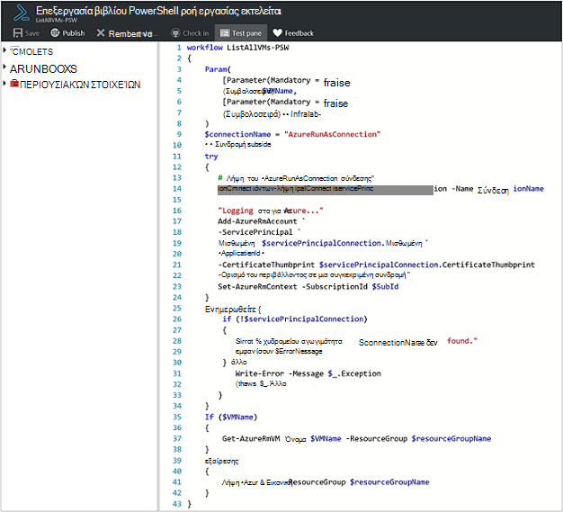
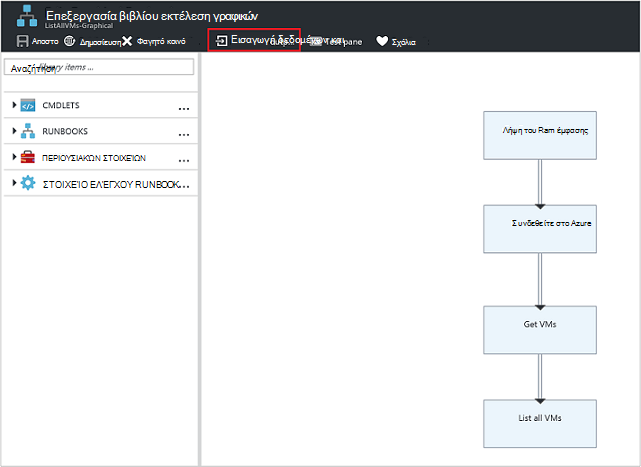
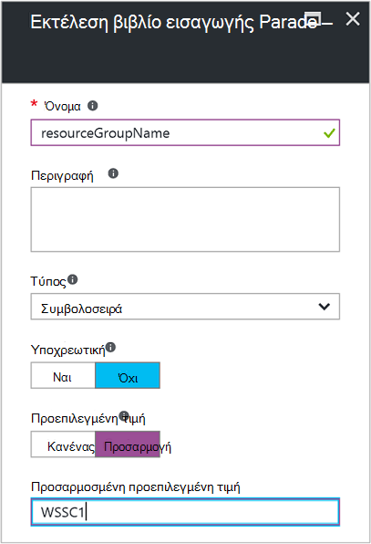
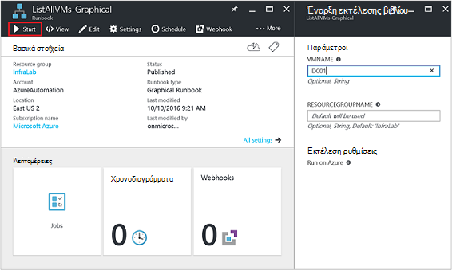
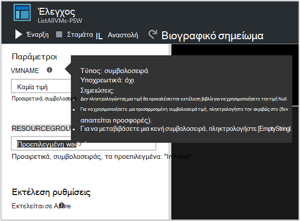
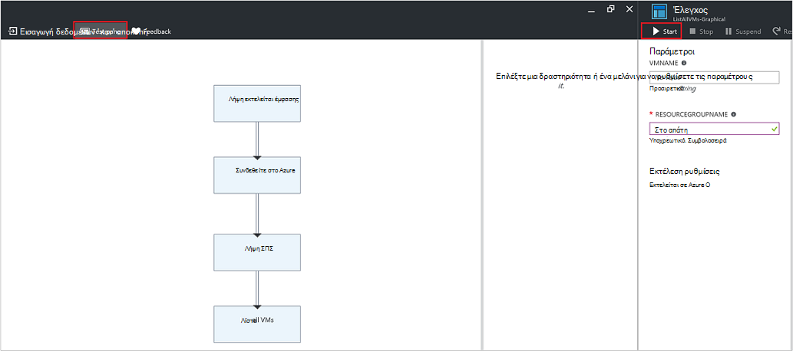
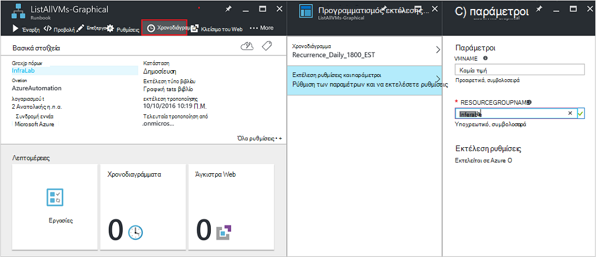
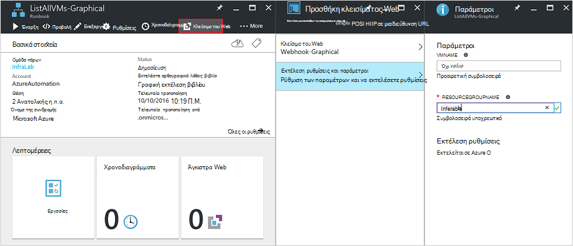
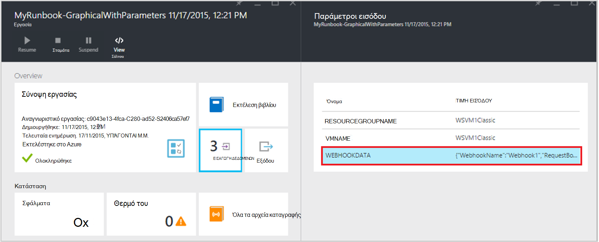

<properties
   pageTitle="Παράμετροι εισόδου Runbook | Microsoft Azure"
   description="Παράμετροι εισόδου Runbook αύξηση την ευελιξία να runbooks, επιτρέποντάς σας να μεταβίβαση δεδομένων σε μια runbook κατά την εκκίνηση. Σε αυτό το άρθρο περιγράφει διαφορετικά σενάρια όπου χρησιμοποιούνται παραμέτρους εισόδου σε runbooks."
   services="automation"
   documentationCenter=""
   authors="MGoedtel"
   manager="jwhit"
   editor="tysonn" />
<tags
   ms.service="automation"
   ms.devlang="na"
   ms.topic="article"
   ms.tgt_pltfrm="na"
   ms.workload="infrastructure-services"
   ms.date="10/11/2016"
   ms.author="sngun"/>

# <a name="runbook-input-parameters"></a>Runbook παραμέτρων εισαγωγής

Παράμετροι εισόδου Runbook αύξηση την ευελιξία να runbooks, επιτρέποντάς σας για τη μεταβίβαση δεδομένων σε αυτό κατά την εκκίνηση. Οι παράμετροι επιτρέπει τις ενέργειες που runbook θα είναι στοχευμένες για περιβάλλοντα και συγκεκριμένα σενάρια. Σε αυτό το άρθρο θα σας θα σας καθοδηγήσει διαφορετικά σενάρια όπου χρησιμοποιούνται παραμέτρους εισόδου σε runbooks.

## <a name="configure-input-parameters"></a>Ρύθμιση παραμέτρων εισόδου

Παράμετροι εισόδου μπορεί να ρυθμιστεί στο PowerShell, PowerShell ροής εργασίας και γραφικών runbooks. Μια runbook μπορεί να έχει πολλές παραμέτρους με διαφορετικούς τύπους δεδομένων ή χωρίς παραμέτρους σε όλα. Παράμετροι εισόδου μπορεί να είναι υποχρεωτικό ή προαιρετικό και μπορείτε να εκχωρήσετε μια προεπιλεγμένη τιμή για προαιρετικές παραμέτρους. Μπορείτε να αντιστοιχίσετε τιμές για τις παραμέτρους εισόδου για μια runbook κατά την εκκίνηση μέσω μία από τις διαθέσιμες μεθόδους. Αυτές οι μέθοδοι περιλαμβάνουν ξεκινώντας μια runbook από την πύλη ή μια υπηρεσία web. Μπορείτε επίσης να ξεκινήσετε μία ως μια runbook παιδί που ονομάζεται ενσωματωμένη σε μια άλλη runbook.

## <a name="configure-input-parameters-in-powershell-and-powershell-workflow-runbooks"></a>Ρύθμιση παραμέτρων εισόδου στο runbooks PowerShell και τη ροή εργασίας του PowerShell

PowerShell και [runbooks PowerShell ροής εργασίας](automation-first-runbook-textual.md) στο Azure Automation υποστηρίζουν παραμέτρους εισόδου που καθορίζονται από τα παρακάτω χαρακτηριστικά.  

| **Ιδιότητα** | **Περιγραφή** |
|:--- |:---|
| Τύπος | Απαιτείται. Ο τύπος δεδομένων που αναμένεται για την τιμή της παραμέτρου. Οποιονδήποτε τύπο .NET είναι έγκυρη. |
| Όνομα | Απαιτείται. Το όνομα της παραμέτρου. Αυτό πρέπει να είναι μοναδικό μέσα σε runbook, και μπορούν να περιέχουν μόνο γράμματα, αριθμοί ή χαρακτήρες υπογράμμισης. Θα πρέπει να ξεκινά με ένα γράμμα. |
| Υποχρεωτική | Προαιρετικό. Καθορίζει εάν πρέπει να δοθεί μια τιμή για την παράμετρο. Εάν αυτό με **$true**, στη συνέχεια, πρέπει να δοθεί μια τιμή κατά την εκκίνηση του runbook. Εάν ορίσετε αυτό **$false**, στη συνέχεια, μια τιμή είναι προαιρετικό. |
| Προεπιλεγμένη τιμή | Προαιρετικό.  Καθορίζει μια τιμή που θα χρησιμοποιηθεί για την παράμετρο, εάν μια τιμή δεν μεταβιβάζεται στο κατά την εκκίνηση του runbook. Μια προεπιλεγμένη τιμή μπορεί να οριστεί για κάθε παράμετρο και θα πραγματοποιήσει αυτόματα την παράμετρο προαιρετικό ανεξάρτητα από τη ρύθμιση υποχρεωτικό. |

Windows PowerShell υποστηρίζει περισσότερα χαρακτηριστικά των παραμέτρων εισαγωγής από αυτές που παρατίθενται εδώ, όπως επικύρωσης, ψευδώνυμα, και η παράμετρος σύνολα. Ωστόσο, αυτοματισμού Azure υποστηρίζει επί του παρόντος μόνο τις παραμέτρους εισόδου που αναφέρονται παραπάνω.

Έναν ορισμό παραμέτρου στο runbooks PowerShell ροής εργασίας έχει την εξής μορφή γενική, όπου πολλαπλές παράμετροι διαχωρίζονται με κόμματα.

   ```
     Param
     (
         [Parameter (Mandatory= $true/$false)]
         [Type] Name1 = <Default value>,

         [Parameter (Mandatory= $true/$false)]
         [Type] Name2 = <Default value>
     )
   ```

>[AZURE.NOTE] Όταν έχετε ορίσει τις παραμέτρους, εάν δεν μπορείτε να καθορίσετε το χαρακτηριστικό **υποχρεωτικό** , στη συνέχεια, από προεπιλογή, η παράμετρος θεωρείται προαιρετική. Επίσης, εάν μπορείτε να ορίσετε μια προεπιλεγμένη τιμή για μια παράμετρο στο runbooks PowerShell ροής εργασίας, θα αντιμετωπιστεί μέσω του PowerShell ως μια προαιρετική παράμετρος, ανεξάρτητα από την τιμή του χαρακτηριστικού **υποχρεωτικό** .

Ως παράδειγμα, ας ρυθμίσετε τις παραμέτρους εισόδου για μια ροή εργασίας του PowerShell runbook που εξάγει λεπτομέρειες σχετικά με εικονικές μηχανές, μια Εικονική μία ή όλες ΣΠΣ μέσα σε μια ομάδα πόρων. Σε αυτό το runbook έχει δύο παραμέτρους όπως φαίνεται στο παρακάτω στιγμιότυπο οθόνης: το όνομα του υπολογιστή εικονικές και το όνομα της ομάδας πόρων.



Σε αυτήν την παράμετρο ορισμού, παράμετροι **$VMName** και **$resourceGroupName** είναι απλή παράμετροι τύπου συμβολοσειράς. Ωστόσο, PowerShell και τη ροή εργασίας του PowerShell runbooks υποστηρίζουν όλους τους τύπους απλές και σύνθετους τύπους, όπως το **αντικείμενο** ή **PSCredential** για παραμέτρους εισόδου.

Εάν το runbook έχει μια παράμετρο εισόδου τύπου αντικειμένου, στη συνέχεια, χρησιμοποιήστε μια hashtable PowerShell (όνομα, τιμή) ζεύγη για τη μεταβίβαση μια τιμή. Για παράδειγμα, εάν έχετε την ακόλουθη παράμετρο σε ένα runbook:

     [Parameter (Mandatory = $true)]
     [object] $FullName

Στη συνέχεια, μπορείτε να περάσετε την ακόλουθη τιμή για την παράμετρο:

    @{"FirstName"="Joe";"MiddleName"="Bob";"LastName"="Smith"}


## <a name="configure-input-parameters-in-graphical-runbooks"></a>Ρύθμιση παραμέτρων εισόδου στο runbooks γραφικών

Για να [ρυθμίσετε τις παραμέτρους ενός γραφικού runbook](automation-first-runbook-graphical.md) με παραμέτρους εισόδου, ας δημιουργήσουμε ένα runbook γραφικά που εξάγει λεπτομέρειες σχετικά με εικονικές μηχανές, μια Εικονική μία ή όλες ΣΠΣ μέσα σε μια ομάδα πόρων. Ρύθμιση των παραμέτρων ενός runbook αποτελείται από δύο κύριες δραστηριότητες, όπως περιγράφεται παρακάτω.

[**Runbooks τον έλεγχο ταυτότητας με Azure εκτέλεση ως λογαριασμού**](automation-sec-configure-azure-runas-account.md) για τον έλεγχο ταυτότητας με Azure.

[**Get-AzureRmVm**](https://msdn.microsoft.com/library/mt603718.aspx) για να λάβετε τις ιδιότητες ενός εικονικές μηχανές.

Μπορείτε να χρησιμοποιήσετε τη δραστηριότητα [**Εξόδου εγγραφής**](https://technet.microsoft.com/library/hh849921.aspx) για να εξαγάγετε τα ονόματα των εικονικές μηχανές. Η δραστηριότητα **Get-AzureRmVm** δέχεται δύο παραμέτρους, το **όνομα εικονική μηχανή** και το **όνομα της ομάδας πόρων**. Επειδή αυτές οι παράμετροι μπορεί να απαιτούν διαφορετικές τιμές κάθε φορά που ξεκινάτε runbook, μπορείτε να προσθέσετε παραμέτρους εισόδου για να σας runbook. Ακολουθούν τα βήματα για να προσθέσετε παραμέτρους εισόδου:

1. Επιλέξτε γραφικών runbook από το blade **Runbooks** και, στη συνέχεια, κάντε κλικ στην επιλογή [**Επεξεργασία**](automation-graphical-authoring-intro.md) του.

2. Από το πρόγραμμα επεξεργασίας runbook, κάντε κλικ στο κουμπί **εισόδου και εξόδου** για να ανοίξετε το blade **εισόδου και εξόδου** .

    

3. Το blade **εισόδου και εξόδου** εμφανίζει μια λίστα των παραμέτρων εισαγωγής που έχουν οριστεί για runbook. Σε αυτό blade, μπορείτε είτε να προσθέσει μια νέα παράμετρο εισόδου ή να επεξεργαστείτε τη ρύθμιση παραμέτρων για μια υπάρχουσα παράμετρο εισόδου. Για να προσθέσετε μια νέα παράμετρος για runbook, κάντε κλικ στην επιλογή **Προσθήκη εισαγωγής** για να ανοίξετε την **παράμετρο εισόδου Runbook** blade. Εκεί, μπορείτε να ρυθμίσετε τις ακόλουθες παραμέτρους:

  	| **Ιδιότητα** | **Περιγραφή** |
  	|:--- |:---|
  	| Όνομα | Απαιτείται.  Το όνομα της παραμέτρου. Αυτό πρέπει να είναι μοναδικό μέσα σε runbook, και μπορούν να περιέχουν μόνο γράμματα, αριθμοί ή χαρακτήρες υπογράμμισης. Θα πρέπει να ξεκινά με ένα γράμμα. |
  	| Περιγραφή | Προαιρετικό. Περιγραφή σχετικά με το σκοπό της παράμετρο εισόδου. |
  	| Τύπος | Προαιρετικό. Ο τύπος δεδομένων που αναμένεται για την τιμή της παραμέτρου. Οι τύποι υποστηρίζονται παραμέτρου είναι **συμβολοσειρά**, **Int32**, **Int64**, **δεκαδικών ψηφίων**, **Boolean**, **ημερομηνίας/ώρας**και **αντικειμένου**. Εάν ένας τύπος δεδομένων δεν είναι επιλεγμένο, από προεπιλογή επιλέγεται η **συμβολοσειρά**. |
  	| Υποχρεωτική | Προαιρετικό. Καθορίζει εάν πρέπει να δοθεί μια τιμή για την παράμετρο. Εάν επιλέξετε **Ναι**, στη συνέχεια, πρέπει να δοθεί μια τιμή κατά την εκκίνηση του runbook. Εάν επιλέξετε **καμία**, στη συνέχεια, μια τιμή δεν απαιτείται όταν γίνει εκκίνηση του runbook και μπορεί να οριστεί μια προεπιλεγμένη τιμή. |
  	| Προεπιλεγμένη τιμή | Προαιρετικό. Καθορίζει μια τιμή που θα χρησιμοποιηθεί για την παράμετρο, εάν μια τιμή δεν μεταβιβάζεται στο κατά την εκκίνηση του runbook. Μια προεπιλεγμένη τιμή μπορεί να οριστεί για μια παράμετρο που δεν είναι υποχρεωτικό. Για να ορίσετε μια προεπιλεγμένη τιμή, επιλέξτε **Προσαρμογή**. Αυτή η τιμή χρησιμοποιείται εκτός εάν παρέχεται μια άλλη τιμή κατά την εκκίνηση του runbook. Επιλέξτε " **Κανένα"** Εάν δεν θέλετε να δώσετε οποιαδήποτε προεπιλεγμένη τιμή. |  

    

4. Δημιουργήστε δύο παραμέτρους με τις ακόλουθες ιδιότητες που θα χρησιμοποιηθεί κατά τη **Λήψη AzureRmVm** δραστηριότητα:

    - **Παράμετρος1:**
      - Όνομα - VMName
      - Τύπος - συμβολοσειρά
      - Υποχρεωτική - όχι

    - **Παράμετρος2:**
      - Όνομα - resourceGroupName
      - Τύπος - συμβολοσειρά
      - Υποχρεωτική - όχι
      - Προεπιλεγμένη τιμή - Προσαρμογή
      - Προσαρμοσμένη προεπιλεγμένη τιμή - \<όνομα της ομάδας πόρων που περιέχει τις εικονικές μηχανές >

5. Αφού προσθέσετε τις παραμέτρους, κάντε κλικ στο **κουμπί OK**.  Τώρα μπορείτε να προβάλετε τους στο το **εισόδου και εξόδου blade**. Κάντε ξανά κλικ στο κουμπί **OK** και, στη συνέχεια, κάντε κλικ στην επιλογή **Αποθήκευση** και **Δημοσίευση** του runbook.

## <a name="assign-values-to-input-parameters-in-runbooks"></a>Αντιστοίχιση τιμών για παράμετροι στο runbooks εισόδου

Μπορείτε να περάσετε τιμές για εισαγωγή παραμέτρων σε runbooks στα εξής σενάρια.

### <a name="start-a-runbook-and-assign-parameters"></a>Ξεκινήστε μια runbook και αντιστοιχίστε τις παραμέτρους

Μπορεί να ξεκινήσει μια runbook πολλούς τρόπους: μέσω της πύλης Azure, με μια webhook, με το cmdlet του PowerShell, με το REST API ή με το SDK. Παρακάτω αναλύονται διαφορετικές μεθόδους για την εκκίνηση ενός runbook και εκχώρηση παραμέτρους.

#### <a name="start-a-published-runbook-by-using-the-azure-portal-and-assign-parameters"></a>Εκκίνηση μιας δημοσιευμένης runbook, χρησιμοποιώντας την πύλη του Azure και αντιστοιχίστε τις παραμέτρους

Όταν [ξεκινήσετε runbook](automation-starting-a-runbook.md#starting-a-runbook-with-the-azure-portal), ανοίγει η **Έναρξη Runbook** blade και μπορείτε να ρυθμίσετε τις τιμές για τις παραμέτρους που μόλις δημιουργήσατε.



Στην ετικέτα κάτω από το πλαίσιο εισαγωγής, μπορείτε να δείτε τα χαρακτηριστικά που έχουν οριστεί για την παράμετρο. Τα χαρακτηριστικά περιλαμβάνουν υποχρεωτικό ή προαιρετικό, πληκτρολογήστε και προεπιλεγμένη τιμή. Στο πλαίσιο δίπλα στο όνομα της παραμέτρου της Βοήθειας, μπορείτε να δείτε όλες τις πληροφορίες του κλειδιού που πρέπει να λάβετε αποφάσεις σχετικά με τις τιμές παραμέτρων εισαγωγής. Αυτές οι πληροφορίες περιλαμβάνουν εάν μια παράμετρος είναι υποχρεωτικό ή προαιρετικό. Περιλαμβάνει επίσης τον τύπο και προεπιλεγμένη τιμή (εάν υπάρχουν) και άλλα χρήσιμα σημειώσεις.



>[AZURE.NOTE] Οι παράμετροι τύπου συμβολοσειράς υποστηρίζει **κενές** τιμές συμβολοσειράς.  Εισαγωγή **[κενή συμβολοσειρά]** στο πλαίσιο παράμετρο εισόδου θα μεταβιβάζουν μια κενή συμβολοσειρά για την παράμετρο. Επίσης, οι παράμετροι τύπου συμβολοσειράς δεν υποστηρίζει τιμές **Null** που διαβιβάζεται. Εάν οποιαδήποτε τιμή δεν περάσετε στην παράμετρο συμβολοσειρά, στη συνέχεια, PowerShell θα ερμηνεύσει ως null.

#### <a name="start-a-published-runbook-by-using-powershell-cmdlets-and-assign-parameters"></a>Έναρξη μιας δημοσιευμένης runbook με τη χρήση των cmdlet του PowerShell και αντιστοιχίστε τις παραμέτρους

  - **Cmdlet του azure διαχείριση πόρων:** Μπορείτε να ξεκινήσετε μια runbook αυτοματισμού που δημιουργήθηκε σε μια ομάδα πόρων με τη χρήση [AzureRmAutomationRunbook Έναρξη](https://msdn.microsoft.com/library/mt603661.aspx).

    **Παράδειγμα:**

   ```
    $params = @{“VMName”=”WSVMClassic”;”resourceGroupeName”=”WSVMClassicSG”}
 
    Start-AzureRmAutomationRunbook -AutomationAccountName “TestAutomation” -Name “Get-AzureVMGraphical” –ResourceGroupName $resourceGroupName -Parameters $params
   ```

  - **Cmdlet διαχείρισης υπηρεσίας azure:** Μπορείτε να ξεκινήσετε μια runbook αυτοματισμού που δημιουργήθηκε σε μια προεπιλεγμένη ομάδα πόρων με τη χρήση [AzureAutomationRunbook Έναρξη](https://msdn.microsoft.com/library/dn690259.aspx).

    **Παράδειγμα:**

   ```
    $params = @{“VMName”=”WSVMClassic”; ”ServiceName”=”WSVMClassicSG”}

    Start-AzureAutomationRunbook -AutomationAccountName “TestAutomation” -Name “Get-AzureVMGraphical” -Parameters $params
   ```

>[AZURE.NOTE] Όταν ξεκινάτε ένα runbook με τη χρήση των cmdlet του PowerShell, μια προεπιλεγμένη παράμετρο, **MicrosoftApplicationManagementStartedBy** δημιουργείται με την τιμή **του PowerShell**. Μπορείτε να προβάλετε αυτή η παράμετρος στο το blade **Λεπτομέρειες εργασίας** .  

#### <a name="start-a-runbook-by-using-an-sdk-and-assign-parameters"></a>Ξεκινήστε μια runbook χρησιμοποιώντας μια SDK και αντιστοιχίστε τις παραμέτρους

  - **Μέθοδο διαχείρισης πόρων azure:** Μπορείτε να ξεκινήσετε μια runbook, χρησιμοποιώντας το SDK από μια γλώσσα προγραμματισμού. Ακολουθεί ένα τμήμα κώδικα C# για την εκκίνηση ενός runbook στο λογαριασμό σας αυτοματισμού. Μπορείτε να προβάλετε όλες τον κώδικα στο μας [GitHub αποθετήριο](https://github.com/Azure/azure-sdk-for-net/blob/master/src/ResourceManagement/Automation/Automation.Tests/TestSupport/AutomationTestBase.cs).  

   ```
     public Job StartRunbook(string runbookName, IDictionary<string, string> parameters = null)
        {
          var response = AutomationClient.Jobs.Create(resourceGroupName, automationAccount, new JobCreateParameters
           {
              Properties = new JobCreateProperties
               {
                  Runbook = new RunbookAssociationProperty
                   {
                     Name = runbookName
                   },
                     Parameters = parameters
               }
           });
        return response.Job;
        }
   ```

  - **Διαχείριση υπηρεσίας azure μέθοδο:** Μπορείτε να ξεκινήσετε μια runbook, χρησιμοποιώντας το SDK από μια γλώσσα προγραμματισμού. Ακολουθεί ένα τμήμα κώδικα C# για την εκκίνηση ενός runbook στο λογαριασμό σας αυτοματισμού. Μπορείτε να προβάλετε όλες τον κώδικα στο μας [GitHub αποθετήριο](https://github.com/Azure/azure-sdk-for-net/blob/master/src/ServiceManagement/Automation/Automation.Tests/TestSupport/AutomationTestBase.cs).

   ```      
    public Job StartRunbook(string runbookName, IDictionary<string, string> parameters = null)
      {
        var response = AutomationClient.Jobs.Create(automationAccount, new JobCreateParameters
      {
        Properties = new JobCreateProperties
           {
             Runbook = new RunbookAssociationProperty
           {
             Name = runbookName
                },
                  Parameters = parameters
                }
         });
        return response.Job;
      }
   ```

  Για να ξεκινήσετε αυτήν τη μέθοδο, δημιουργήστε ένα λεξικό για να αποθηκεύσετε τις παραμέτρους runbook, **VMName** και **resourceGroupName**και τις τιμές τους. Στη συνέχεια, ξεκινήστε runbook. Ακολουθεί το C# τμήμα κώδικα για την κλήση τη μέθοδο που καθορίζεται παραπάνω.

   ```
    IDictionary<string, string> RunbookParameters = new Dictionary<string, string>();

    // Add parameters to the dictionary.
    RunbookParameters.Add("VMName", "WSVMClassic");
    RunbookParameters.Add("resourceGroupName", "WSSC1");

    //Call the StartRunbook method with parameters
    StartRunbook(“Get-AzureVMGraphical”, RunbookParameters);
   ```

#### <a name="start-a-runbook-by-using-the-rest-api-and-assign-parameters"></a>Ξεκινήστε μια runbook χρησιμοποιώντας το REST API και αντιστοιχίστε τις παραμέτρους

Μια εργασία runbook δυνατό να δημιουργηθούν και αποτελέσματα με το Azure αυτοματισμού REST API, χρησιμοποιώντας τη μέθοδο **ΤΟΠΟΘΈΤΗΣΗ** με την ακόλουθη αίτηση URI.

    https://management.core.windows.net/<subscription-id>/cloudServices/<cloud-service-name>/resources/automation/~/automationAccounts/<automation-account-name>/jobs/<job-id>?api-version=2014-12-08`

Στην πρόσκληση σε URI, αντικαταστήστε τις ακόλουθες παραμέτρους:

  - **αναγνωριστικό συνδρομής:** Το αναγνωριστικό Azure συνδρομής.  
  - **όνομα υπηρεσίας cloud:** Το όνομα της υπηρεσίας cloud στην οποία πρέπει να σταλεί στην πρόσκληση.  
  - **όνομα λογαριασμού αυτοματοποίησης:** Το όνομα του λογαριασμού σας αυτοματισμού που φιλοξενείται σε την υπηρεσία cloud καθορισμένο.  
  - **αναγνωριστικό εργασίας:** Το GUID για το έργο. GUID σε PowerShell μπορούν να δημιουργηθούν με τη χρήση του **[GUID]::NewGuid(). ToString()** εντολή.

Για να μεταβιβάσετε παραμέτρους στο έργο runbook, χρησιμοποιήστε το σώμα της αίτησης. Χρειάζονται τις ακόλουθες δύο ιδιότητες που παρέχονται σε μορφή JSON:

  - **Όνομα Runbook:** Απαιτείται. Το όνομα του runbook για το έργο για να ξεκινήσετε.  
  - **Runbook παράμετροι:** Προαιρετικό. Ένα λεξικό από τη λίστα παραμέτρου στο (όνομα, τιμή) μορφοποίηση όπου πρέπει να είναι το όνομα του τύπου συμβολοσειράς και τιμή μπορεί να είναι οποιαδήποτε έγκυρη τιμή JSON.

Εάν θέλετε να ξεκινήσετε runbook **Get-AzureVMTextual** που δημιουργήθηκε προηγουμένως με **VMName** και **resourceGroupName** ως παράμετροι, χρησιμοποιήστε την εξής μορφή JSON για το σώμα της αίτησης.

   ```
    {
      "properties":{
        "runbook":{
        "name":"Get-AzureVMTextual"},
      "parameters":{
         "VMName":"WSVMClassic",
         "resourceGroupName":”WSCS1”}
        }
    }
   ```

Έναν κωδικό κατάστασης HTTP 201 επιστρέφεται εάν η εργασία είναι δημιουργήθηκε με επιτυχία. Για περισσότερες πληροφορίες σε κεφαλίδες απόκρισης και σώμα απάντησης, ανατρέξτε στο άρθρο σχετικά με τον τρόπο [Δημιουργία μιας εργασίας runbook χρησιμοποιώντας το REST API.](https://msdn.microsoft.com/library/azure/mt163849.aspx)

### <a name="test-a-runbook-and-assign-parameters"></a>Δοκιμάστε μια runbook και εκχώρηση παραμέτρους

Όταν ανοίγει το blade **Δοκιμή** [Δοκιμή του πρόχειρη έκδοση της runbook σας](automation-testing-runbook.md) , χρησιμοποιώντας την επιλογή έλεγχος, και μπορείτε να ρυθμίσετε τις τιμές για τις παραμέτρους που μόλις δημιουργήσατε.



### <a name="link-a-schedule-to-a-runbook-and-assign-parameters"></a>Σύνδεση ένα χρονοδιάγραμμα με μια runbook και αντιστοιχίστε τις παραμέτρους

Μπορείτε να [συνδέσετε ένα χρονοδιάγραμμα](automation-schedules.md) για να σας runbook ώστε να runbook ξεκινά μια συγκεκριμένη στιγμή. Μπορείτε να εκχωρήσετε παραμέτρους εισόδου κατά τη δημιουργία του χρονοδιαγράμματος και runbook θα χρησιμοποιήσει αυτές τις τιμές κατά την εκκίνηση από το χρονοδιάγραμμα. Δεν μπορείτε να αποθηκεύσετε το χρονοδιάγραμμα, έως ότου όλες τις τιμές υποχρεωτική παράμετρος παρέχονται.



### <a name="create-a-webhook-for-a-runbook-and-assign-parameters"></a>Δημιουργήστε μια webhook για μια runbook και αντιστοιχίστε τις παραμέτρους

Μπορείτε να δημιουργήσετε ένα [webhook](automation-webhooks.md) για runbook σας και να ρυθμίσετε τις παραμέτρους εισόδου runbook. Δεν μπορείτε να αποθηκεύσετε το webhook μέχρι να παρέχονται όλες τις τιμές παραμέτρων υποχρεωτικό.



Κατά την εκτέλεση μιας runbook χρησιμοποιώντας μια webhook, η προκαθορισμένη παράμετρος εισόδου αποστέλλεται **[Webhookdata](automation-webhooks.md#details-of-a-webhook)** , μαζί με τις παραμέτρους εισόδου που έχετε ορίσει. Μπορείτε να κάνετε κλικ για να αναπτύξετε την παράμετρο **WebhookData** για περισσότερες λεπτομέρειες.




## <a name="next-steps"></a>Επόμενα βήματα

- Για περισσότερες πληροφορίες σχετικά με runbook εισόδου και εξόδου, ανατρέξτε στο θέμα [Azure αυτοματοποίησης: runbook εισαγωγής, εξόδου και ένθετων runbooks](https://azure.microsoft.com/blog/azure-automation-runbook-input-output-and-nested-runbooks/).
- Για λεπτομέρειες σχετικά με διαφορετικούς τρόπους για να ξεκινήσετε μια runbook, ανατρέξτε στο θέμα [ξεκινώντας μια runbook](automation-starting-a-runbook.md).
- Για να επεξεργαστείτε ένα runbook που περιέχουν κείμενο, ανατρέξτε στην [Επεξεργασία runbooks που περιέχουν κείμενο](automation-edit-textual-runbook.md).
- Για να επεξεργαστείτε μια runbook γραφικών, ανατρέξτε [Graphical σύνταξη από κοινού με Azure αυτοματισμού](automation-graphical-authoring-intro.md).
