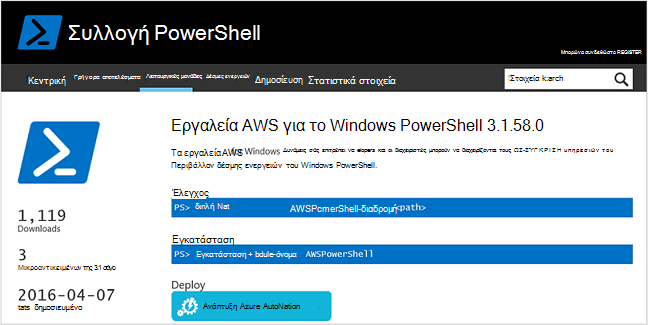
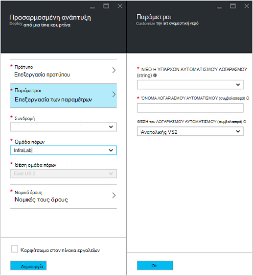
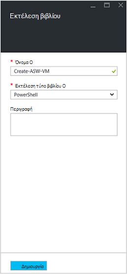
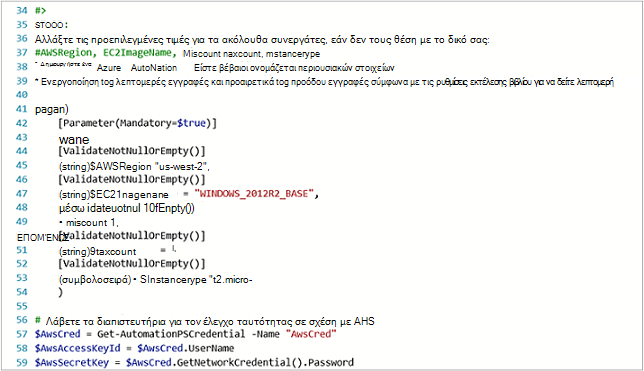
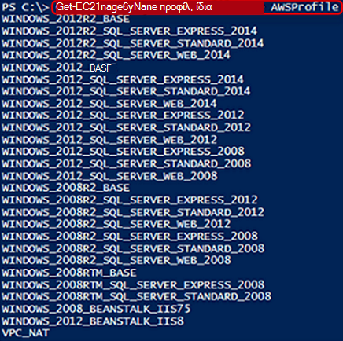
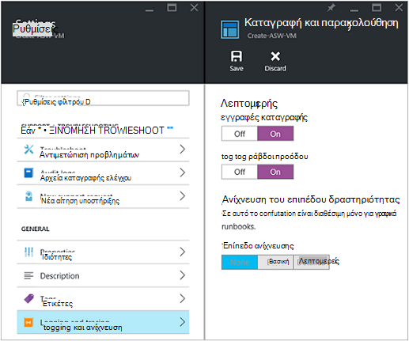
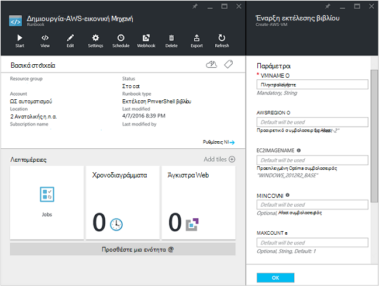
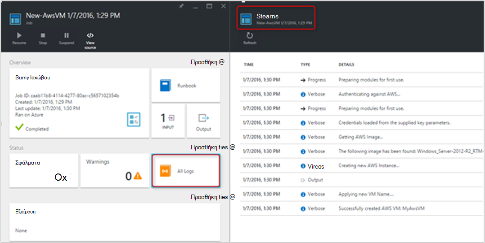
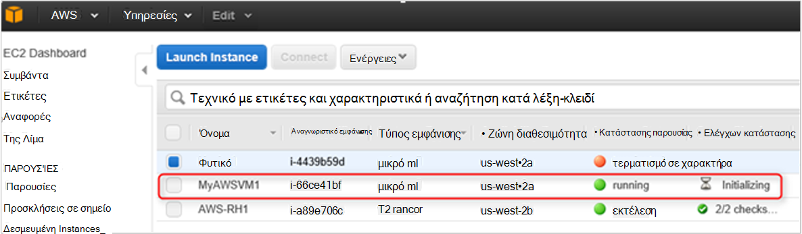

<properties
   pageTitle="Αυτοματοποίηση ανάπτυξη του μια Εικονική στα υπηρεσίες Web του Amazon | Microsoft Azure"
   description="Σε αυτό το άρθρο παρουσιάζει πώς μπορείτε να χρησιμοποιήσετε αυτοματισμού Azure για να αυτοματοποιήσετε τη δημιουργία Εικονική μηχανή υπηρεσίας Web του Amazon"
   services="automation"
   documentationCenter=""
   authors="mgoedtel"
   manager="jwhit"
   editor="" />
<tags
   ms.service="automation"
   ms.devlang="na"
   ms.topic="article"
   ms.tgt_pltfrm="na"
   ms.workload="na"
   ms.date="08/17/2016"
   ms.author="tiandert; bwren" />

# <a name="azure-automation-scenario---provision-an-aws-virtual-machine"></a>Σενάριο αυτοματισμού Azure - παροχή μια εικονική μηχανή AWS 

Σε αυτό το άρθρο θα σας δείχνουν πώς μπορείτε να αξιοποιήσετε αυτοματισμού Azure για την παροχή μια εικονική μηχανή στη συνδρομή σας υπηρεσίας Web Amazon (AWS) και ονομάστε αυτόν Εικονική συγκεκριμένες – που AWS αναφέρεται ως "Εφαρμογή ετικετών" η Εικονική.

## <a name="prerequisites"></a>Προαπαιτούμενα στοιχεία

Για τους σκοπούς αυτού του άρθρου, πρέπει να έχετε ένα λογαριασμό αυτοματισμού Azure και μια συνδρομή AWS. Για περισσότερες πληροφορίες σχετικά με τη ρύθμιση του λογαριασμού αυτοματισμού Azure και τη ρύθμιση παραμέτρων με τα διαπιστευτήριά σας AWS συνδρομή, εξετάστε [Ρύθμιση παραμέτρων ελέγχου ταυτότητας με τις υπηρεσίες Web του Amazon](../automation/automation-sec-configure-aws-account.md).  Αυτόν το λογαριασμό θα πρέπει να δημιουργηθεί ή να ενημερωθεί με τα διαπιστευτήριά σας AWS συνδρομή πριν να συνεχίσετε, όπως θα σας θα αναφέρονται σε αυτόν το λογαριασμό στα παρακάτω βήματα.


## <a name="deploy-amazon-web-services-powershell-module"></a>Ανάπτυξη λειτουργικής μονάδας PowerShell υπηρεσιών Web Amazon

Μας Εικονική προμήθεια του runbook θα αξιοποιήσετε της λειτουργικής μονάδας AWS PowerShell για να εκτελέσετε τις εργασίες της. Ακολουθήστε τα παρακάτω βήματα για να προσθέσετε τη λειτουργική μονάδα στο λογαριασμό σας αυτοματισμού που έχει ρυθμιστεί με τα διαπιστευτήριά σας AWS συνδρομής.  

1. Ανοίξτε το πρόγραμμα περιήγησης web και μεταβείτε στη [Συλλογή PowerShell](http://www.powershellgallery.com/packages/AWSPowerShell/) και επιλέξτε την **Ανάπτυξη κουμπί Azure αυτοματισμού**.<br> 

2. Μεταφέρεστε στη σελίδα Azure login και μετά την πραγματοποίηση ελέγχου ταυτότητας, που θα δρομολογούνται στην πύλη του Azure και που παρουσιάζονται με την εξής blade.<br> 

3. Επιλέξτε την ομάδα πόρων από την αναπτυσσόμενη λίστα " **Ομάδα πόρων** " και από το blade παράμετροι, δώστε τις ακόλουθες πληροφορίες:
   * Από την αναπτυσσόμενη λίστα **νέο ή υπάρχοντα λογαριασμό αυτοματισμού (συμβολοσειρά)** , επιλέξτε **υπάρχον**.  
   * Στο πλαίσιο **Όνομα λογαριασμού αυτοματισμού (συμβολοσειρά)** , πληκτρολογήστε το ακριβές όνομα του λογαριασμού αυτοματισμού που περιλαμβάνει τα διαπιστευτήρια για τη συνδρομή σας AWS.  Για παράδειγμα, εάν έχετε δημιουργήσει ένα αποκλειστικό λογαριασμό με το όνομα **AWSAutomation**, στη συνέχεια, που είναι τι πληκτρολογείτε στο πλαίσιο.
   * Επιλέξτε στην κατάλληλη περιοχή από τη **Θέση του λογαριασμού αυτοματισμού** αναπτυσσόμενη λίστα.

4. Όταν ολοκληρώσετε την εισαγωγή τις απαιτούμενες πληροφορίες, κάντε κλικ στην επιλογή **Δημιουργία**.

    >[AZURE.NOTE]Κατά την εισαγωγή λειτουργικής μονάδας PowerShell σε Azure αυτοματισμού, αυτό επίσης την εξαγωγή τα cmdlet και οι δραστηριότητες δεν θα εμφανιστούν μέχρι τη λειτουργική μονάδα εντελώς έχει ολοκληρωθεί η εισαγωγή και εξαγωγή τα cmdlet. Αυτή η διαδικασία μπορεί να χρειαστούν μερικά λεπτά.  
<br>
5. Στην πύλη του Azure, ανοίξτε το λογαριασμό σας Αυτοματισμός αναφέρεται στο βήμα 3.
6. Κάντε κλικ στο πλακίδιο **στοιχεία** και, από το blade **περιουσιακών στοιχείων** , επιλέξτε το πλακίδιο **λειτουργικές μονάδες** .
7. Στην το blade **λειτουργικές μονάδες** θα δείτε τη λειτουργική μονάδα **AWSPowerShell** στη λίστα.

## <a name="create-aws-deploy-vm-runbook"></a>Δημιουργία AWS ανάπτυξη Εικονική runbook

Όταν έχει αναπτυχθεί της λειτουργικής μονάδας PowerShell AWS, θα σας τώρα μπορεί να σύνταξη μιας runbook για την αυτοματοποίηση προμήθεια μια εικονική μηχανή στο AWS χρησιμοποιώντας μια δέσμη ενεργειών PowerShell. Τα παρακάτω βήματα θα δείχνουν πώς μπορείτε να αξιοποιήσετε εγγενούς δέσμη ενεργειών του PowerShell στο Azure αυτοματισμού.  

>[AZURE.NOTE] Για περισσότερες επιλογές και πληροφορίες σχετικά με αυτήν τη δέσμη ενεργειών, επισκεφθείτε τη [Συλλογή του PowerShell](https://www.powershellgallery.com/packages/New-AwsVM/DisplayScript).


1. Λήψη της δέσμης ενεργειών του PowerShell δημιουργία AwsVM από τη συλλογή PowerShell ανοίγοντας μια περίοδο λειτουργίας PowerShell και πληκτρολογώντας τα εξής:<br>
   ```
   Save-Script -Name New-AwsVM -Path \<path\>
   ```
<br>
2. Από την πύλη Azure, ανοίξτε το λογαριασμό σας αυτοματισμού και κάντε κλικ στο πλακίδιο **Runbooks** .  
3. Από το blade **Runbooks** , επιλέξτε **Προσθήκη ενός runbook**.
4. Στην την **Προσθήκη ενός runbook** blade, επιλέξτε **Γρήγορης δημιουργίας** (δημιουργία μιας νέας runbook).
5. Στην blade ιδιότητες του **Runbook** , πληκτρολογήστε ένα όνομα στο πλαίσιο όνομα για το runbook και από τον **τύπο Runbook** επιλέξτε **PowerShell**αναπτυσσόμενη λίστα και, στη συνέχεια, κάντε κλικ στην επιλογή **Δημιουργία**.<br> 
6. Όταν εμφανιστεί το blade επεξεργασία PowerShell Runbook, αντιγράψτε και επικολλήστε τη δέσμη ενεργειών του PowerShell στο runbook σύνταξης καμβά.<br> <br>

    >[AZURE.NOTE] Λάβετε υπόψη τα εξής όταν εργάζεστε με το παράδειγμα δέσμη ενεργειών του PowerShell:
    >
    > - Runbook περιέχει έναν αριθμό προεπιλεγμένες τιμές παραμέτρων. Ελέγξτε αξιολόγηση όλες τις προεπιλεγμένες τιμές και ενημερώστε το σημείο όπου είναι απαραίτητο.
    > - Εάν έχετε αποθηκεύσει τα διαπιστευτήριά σας AWS ως πάγιο διαπιστευτηρίων έχουν διαφορετικά ονόματα από **AWScred**, θα πρέπει να ενημερώσετε τη δέσμη ενεργειών σε γραμμή 57 ώστε να ταιριάζει με αντίστοιχα.  
    > - Όταν εργάζεστε με τις εντολές AWS CLI στο PowerShell, ιδίως με runbook σε αυτό το παράδειγμα, πρέπει να καθορίσετε την περιοχή AWS. Διαφορετικά, τα cmdlet θα αποτύχει.  Προβολή AWS θέμα [Καθορισμός περιοχής AWS](http://docs.aws.amazon.com/powershell/latest/userguide/pstools-installing-specifying-region.html) στα εργαλεία AWS για έγγραφο του PowerShell για περισσότερες λεπτομέρειες.  
<br>
7. Για να ανακτήσετε μια λίστα με τα ονόματα εικόνων από τη συνδρομή σας AWS, εκκίνηση PowerShell ISE και εισαγωγή της λειτουργικής μονάδας PowerShell AWS.  Ο έλεγχος ταυτότητας σε σχέση με AWS, αντικαθιστώντας **Get-AutomationPSCredential** στο περιβάλλον σας ISE με **AWScred = Get-διαπιστευτηρίων**.  Αυτό θα σας ειδοποιήσει για τα διαπιστευτήριά σας και μπορείτε να παρέχετε το **Αναγνωριστικό κλειδιού της Access** για το όνομα χρήστη και **Μυστικό πλήκτρο πρόσβασης** για τον κωδικό πρόσβασης.  Δείτε το παρακάτω παράδειγμα:

        #Sample to get the AWS VM available images
        #Please provide the path where you have downloaded the AWS PowerShell module
        Import-Module AWSPowerShell
        $AwsRegion = "us-west-2"
        $AwsCred = Get-Credential
        $AwsAccessKeyId = $AwsCred.UserName
        $AwsSecretKey = $AwsCred.GetNetworkCredential().Password

        # Set up the environment to access AWS
        Set-AwsCredentials -AccessKey $AwsAccessKeyId -SecretKey $AwsSecretKey -StoreAs AWSProfile
        Set-DefaultAWSRegion -Region $AwsRegion

        Get-EC2ImageByName -ProfileName AWSProfile
   Επιστρέφει το εξής αποτέλεσμα:<br>
     
8. Αντιγράψτε και επικολλήστε το ένα από τα ονόματα εικόνων σε μια μεταβλητή αυτοματισμού ως αναφοράς στο runbook ως **$InstanceType**. Δεδομένου ότι σε αυτό το παράδειγμα Ζητούμε χρησιμοποιώντας το δωρεάν AWS επιπέδων συνδρομή, θα χρησιμοποιήσουμε **t2.micro** για παράδειγμά μας runbook.
9. Αποθήκευση runbook και, στη συνέχεια, κάντε κλικ στην επιλογή **Δημοσίευση** για να δημοσιεύσετε runbook και, στη συνέχεια, **Ναι** όταν σας ζητηθεί.


### <a name="testing-the-aws-vm-runbook"></a>Δοκιμές runbook Εικονική AWS
Πριν συνεχίσουμε με δοκιμής runbook, πρέπει να επαληθεύσετε μερικά πράγματα. Συγκεκριμένα:

   -  Έχει δημιουργηθεί ενός περιουσιακού στοιχείου για τον έλεγχο ταυτότητας έναντι AWS που ονομάζεται **AWScred** ή η δέσμη ενεργειών έχει ενημερωθεί για αναφορά στο όνομα του περιουσιακού στοιχείου διαπιστευτηρίων.  
   -  Της λειτουργικής μονάδας AWS PowerShell έχει εισαχθεί ως αυτοματισμού Azure
   -  Έχει δημιουργηθεί ένα νέο runbook και έχουν επαληθευτεί και ενημέρωση ενδεχομένως τιμές παραμέτρων
   -  **Λεπτομερής εγγραφές καταγραφής** και προαιρετικά **εγγραφές καταγραφής προόδου** κάτω από τη ρύθμιση **καταγραφή και παρακολούθηση** runbook έχουν οριστεί **σε**.<br> 

1. Θέλουμε να ξεκινήσετε runbook, επομένως, κάντε κλικ στο κουμπί **Έναρξη** και, στη συνέχεια, κάντε κλικ στο κουμπί **OK** όταν ανοίξει το blade Runbook Έναρξη.
2. Στη την έναρξη Runbook blade, δώστε ένα **VMname**.  Αποδεχτείτε τις προεπιλεγμένες τιμές για τις άλλες παραμέτρους που που προ-διαμορφωμένες στη δέσμη ενεργειών νωρίτερα.  Κάντε κλικ στο **κουμπί OK** για να ξεκινήσει η εργασία runbook.<br> 
3. Ανοίγει ένα παράθυρο εργασίας για την εργασία runbook που δημιουργήσαμε μόνο. Κλείστε αυτό το παράθυρο.
4. Μπορούμε να προβάλουμε την πρόοδο της εργασίας και προβολή εξόδου **ροών** , επιλέγοντας το πλακίδιο **Όλα τα αρχεία καταγραφής** από την blade εργασία runbook.<br> 
5. Για να επιβεβαιώσετε την εικονική Μηχανή παρέχεται, συνδεθείτε στην κονσόλα διαχείρισης AWS Εάν δεν έχετε συνδεθεί αυτήν τη στιγμή.<br> 

## <a name="next-steps"></a>Επόμενα βήματα
-   Για να ξεκινήσετε με runbooks γραφικών, ανατρέξτε στο θέμα [μου πρώτη runbook γραφικών](automation-first-runbook-graphical.md)
-   Για να ξεκινήσετε με το PowerShell runbooks ροής εργασίας, ανατρέξτε στο θέμα [μου πρώτη runbook PowerShell ροής εργασίας](automation-first-runbook-textual.md)
-   Για να μάθετε περισσότερα σχετικά με τους τύπους runbook, τους πλεονεκτήματα και τους περιορισμούς, ανατρέξτε στο θέμα [τύποι runbook αυτοματισμού Azure](automation-runbook-types.md)
-   Για περισσότερες πληροφορίες σχετικά με δέσμη ενεργειών του PowerShell υποστηρίζει τη δυνατότητα, ανατρέξτε στο θέμα [δέσμη ενεργειών του PowerShell εγγενή υποστήριξη στα αυτοματισμού Azure](https://azure.microsoft.com/blog/announcing-powershell-script-support-azure-automation-2/)
