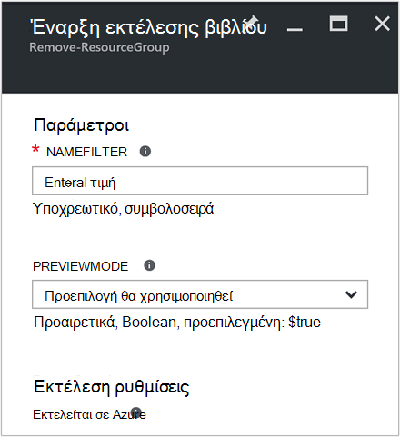
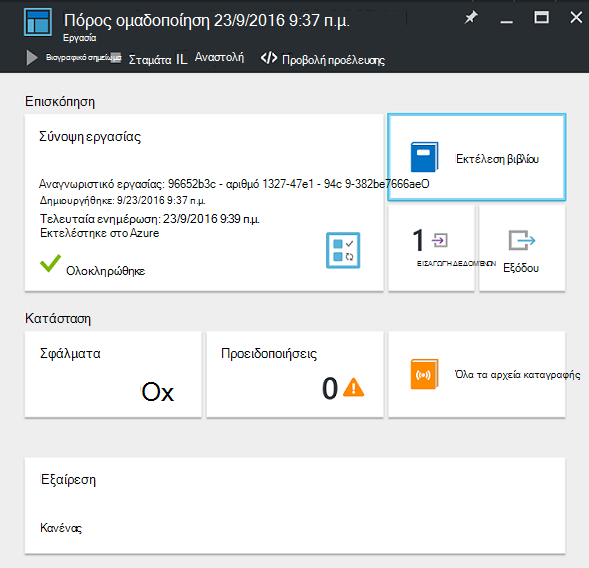
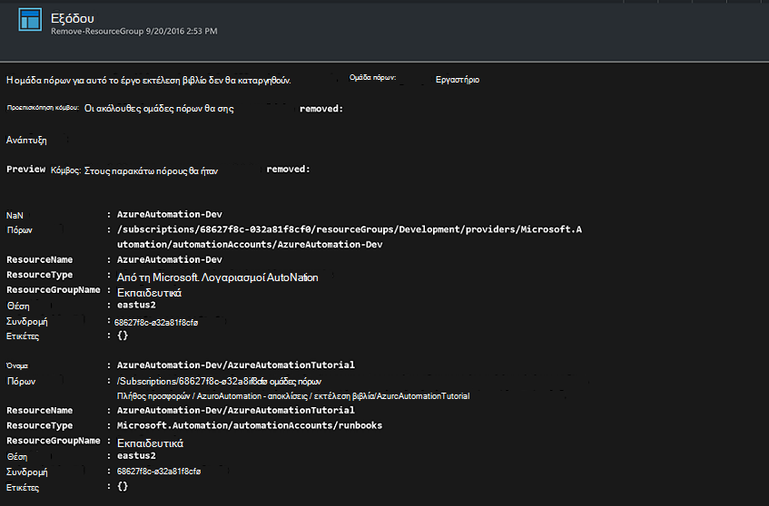

<properties
    pageTitle="Αυτοματοποίηση κατάργησης των ομάδων πόρων | Microsoft Azure"
    description="Έκδοση ροής εργασίας του PowerShell του ένα σενάριο Azure αυτοματισμού, συμπεριλαμβανομένων των runbooks για να καταργήσετε όλες τις ομάδες πόρων σε τη συνδρομή σας."
    services="automation"
    documentationCenter=""
    authors="MGoedtel"
    manager="jwhit"
    editor=""
    />
<tags
    ms.service="automation"
    ms.workload="tbd"
    ms.tgt_pltfrm="na"
    ms.devlang="na"
    ms.topic="get-started-article"
    ms.date="09/26/2016"
    ms.author="magoedte"/>

# Σενάριο αυτοματισμού Azure - αυτοματοποίηση κατάργησης των ομάδων πόρων

Πολλοί πελάτες δημιουργήσετε περισσότερες από μία ομάδα πόρων. Ορισμένες μπορεί να χρησιμοποιηθεί για τη Διαχείριση εφαρμογών παραγωγής και άλλους μπορεί να χρησιμοποιηθεί ως ανάπτυξη, δοκιμή και ενδιάμεσου περιβάλλοντα. Αυτοματοποίηση ανάπτυξης αυτοί οι πόροι είναι κάτι, αλλά αδυναμία Διακοπή χρήσης ομάδα πόρων με ένα κλικ του κουμπιού είναι μια άλλη. Μπορείτε να βελτιστοποιήσετε απλές εργασίες διαχείρισης χρησιμοποιώντας Azure αυτοματισμού. Αυτό είναι χρήσιμο εάν εργάζεστε με μια συνδρομή Azure που έχει όριο εξόδων μέσω μιας προσφοράς μέλος όπως MSDN ή το πρόγραμμα Microsoft Partner Network Cloud Essentials.

Αυτό το σενάριο βασίζεται σε μια runbook PowerShell και έχει σχεδιαστεί για να καταργήσετε μία ή περισσότερες ομάδες πόρων που καθορίζετε από τη συνδρομή σας. Είναι η προεπιλεγμένη ρύθμιση του runbook για να εξετάσετε πριν να συνεχίσετε. Αυτό εξασφαλίζει ότι δεν διαγράψετε κατά λάθος την ομάδα των πόρων πριν είστε έτοιμοι να ολοκληρώσετε αυτήν τη διαδικασία.   

## Γρήγορα το σενάριο

Αυτό το σενάριο αποτελείται από ένα runbook PowerShell που μπορείτε να κάνετε λήψη από τη [Συλλογή του PowerShell](https://www.powershellgallery.com/packages/Remove-ResourceGroup/1.0/DisplayScript). Μπορείτε, επίσης, να την εισαγάγετε απευθείας από τη [Συλλογή Runbook](automation-runbook-gallery.md) στην πύλη του Azure.  

Runbook | Περιγραφή|
----------|------------|
Κατάργηση-ομάδα πόρων | Καταργεί μία ή περισσότερες ομάδες Azure πόρων και τους συναφείς πόρους από τη συνδρομή.  
 
Τις παρακάτω παραμέτρους εισόδου ορίζονται για αυτό runbook:

Παράμετρος | Περιγραφή|
----------|------------|
NameFilter (απαιτείται) | Καθορίζει το όνομα φίλτρου για να περιορίσετε τις ομάδες πόρων που σκοπεύετε σχετικά με τη διαγραφή. Μπορείτε να μεταβιβάσετε πολλών τιμών χρησιμοποιώντας μια λίστα οριοθετημένων με κόμματα. Το φίλτρο δεν είναι διάκριση πεζών-κεφαλαίων και θα ταιριάζουν με οποιαδήποτε ομάδα πόρων που περιέχει τη συμβολοσειρά.|
PreviewMode (προαιρετικά) | Εκτελεί την runbook για να δείτε ποιες ομάδες πόρων θα διαγραφεί, αλλά καμία ενέργεια. Η προεπιλογή είναι **true** για να αποφύγετε την κατά λάθος διαγραφής που του μεταβιβάστηκε runbook μία ή περισσότερες ομάδες πόρων.  

## Εγκατάσταση και ρύθμιση παραμέτρων αυτό το σενάριο

### Προαπαιτούμενα στοιχεία

Σε αυτό το runbook πραγματοποιεί έλεγχο ταυτότητας χρησιμοποιώντας το [Azure εκτελείται ως λογαριασμός](automation-sec-configure-azure-runas-account.md).    

### Εγκατάσταση και να δημοσιεύσετε το runbooks

Μετά τη λήψη runbook, μπορείτε να την εισαγάγετε, χρησιμοποιώντας τη διαδικασία σε [διαδικασία εισαγωγής runbook διαδικασίες](automation-creating-importing-runbook.md#importing-a-runbook-from-a-file-into-Azure-Automation). Δημοσίευση runbook μετά την έχει έχει εισαχθεί με επιτυχία στο λογαριασμό σας αυτοματισμού.

## Χρήση του runbook

Ακολουθήστε τα παρακάτω βήματα θα σας καθοδηγήσει την εκτέλεση της παρούσας runbook και Βοήθεια για να εξοικειωθείτε με τον τρόπο που λειτουργεί. Που θα μόνο δοκιμές runbook σε αυτό το παράδειγμα, στην πραγματικότητα δεν Διαγραφή ομάδας πόρων.  

1. Από την πύλη Azure, ανοίξτε το λογαριασμό σας αυτοματισμού και επιλέξτε **Runbooks**.
2. Επιλέξτε runbook **Κατάργηση-ομάδα πόρων** και κάντε κλικ στο κουμπί **Έναρξη**.
3. Κατά την εκκίνηση του runbook, ανοίγει η **Έναρξη Runbook** blade και μπορείτε να ρυθμίσετε τις παραμέτρους. Πληκτρολογήστε τα ονόματα των ομάδων πόρων στο ότι μπορείτε να χρησιμοποιήσετε για τη δοκιμή και θα προκαλέσει καμία βλάβη αν διαγραφεί κατά λάθος τη συνδρομή σας.  

    >[AZURE.NOTE] Βεβαιωθείτε ότι **Previewmode** έχει οριστεί στην **τιμή true** για να αποφύγετε τη διαγραφή τις επιλεγμένες ομάδες πόρων.  **Σημείωση** ότι αυτό runbook δεν θα καταργήσει την ομάδα πόρων που περιέχει το λογαριασμό αυτοματισμού που εκτελεί αυτό runbook.  

4. Αφού ρυθμίσετε την παράμετρο all τιμές, κάντε κλικ στο **κουμπί OK**και runbook θα τοποθετηθούν σε ουρά για εκτέλεση.  

Για να προβάλετε τις λεπτομέρειες της εργασίας runbook **Κατάργηση-ομάδα πόρων** στην πύλη του Azure, επιλέξτε **εργασίες** στη runbook. Η εργασία σύνοψης εμφανίζει τις παραμέτρους εισόδου και στη ροή εξόδου, εκτός από τις γενικές πληροφορίες σχετικά με την εργασία και τις εξαιρέσεις που προέκυψε.  .

Στη **Σύνοψη εργασίας** περιλαμβάνει μηνύματα από το αποτέλεσμα, προειδοποίηση και ροών σφάλματος. Επιλέξτε για να προβάλετε λεπτομερείς αποτελέσματα από την εκτέλεση runbook **εξόδου** .  

## Επόμενα βήματα

- Για να ξεκινήσετε τη δημιουργία runbook τη δική σας, ανατρέξτε στο θέμα [Δημιουργία ή εισαγωγή ενός runbook στο Azure αυτοματισμού](automation-creating-importing-runbook.md).
- Για να ξεκινήσετε με runbooks ροής εργασίας του PowerShell, ανατρέξτε στο θέμα [μου πρώτη runbook PowerShell ροής εργασίας](automation-first-runbook-textual.md).
