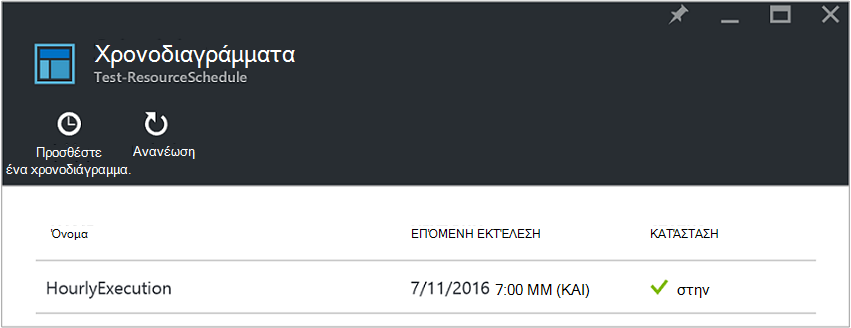
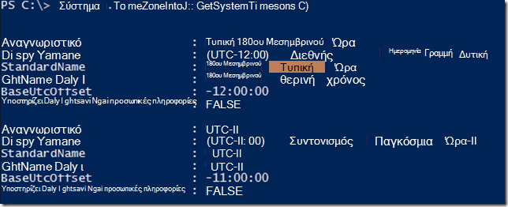
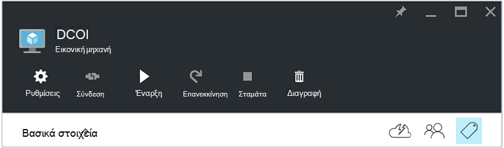
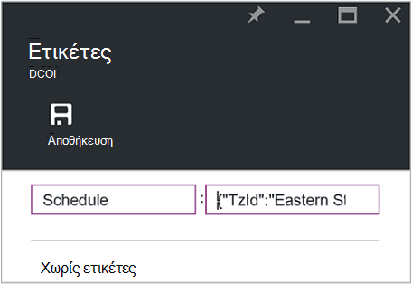
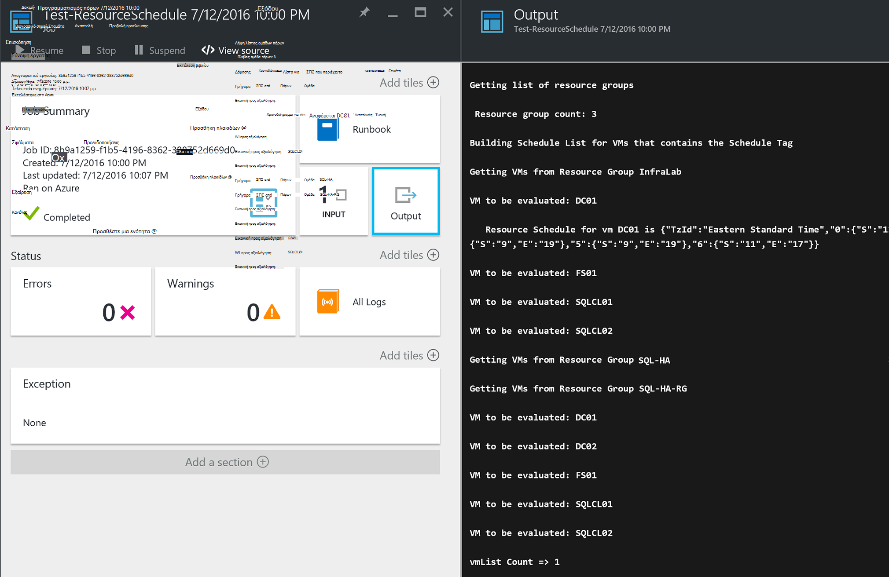

<properties
   pageTitle="Χρήση ετικετών JSON μορφοποίηση για να δημιουργήσετε ένα χρονοδιάγραμμα για Εικονική Azure εκκίνηση και τερματισμός λειτουργίας | Microsoft Azure"
   description="Σε αυτό το άρθρο παρουσιάζει πώς μπορείτε να χρησιμοποιήσετε JSON συμβολοσειρών σε ετικέτες για την αυτοματοποίηση τον προγραμματισμό της Εικονική εκκίνησης και τερματισμού."
   services="automation"
   documentationCenter=""
   authors="MGoedtel"
   manager="jwhit"
   editor="tysonn" />
<tags
   ms.service="automation"
   ms.devlang="na"
   ms.topic="article"
   ms.tgt_pltfrm="na"
   ms.workload="infrastructure-services"
   ms.date="07/18/2016"
   ms.author="magoedte;paulomarquesc" />

# Σενάριο Azure αυτοματοποίησης: χρήση JSON Μορφοποίηση ετικετών για να δημιουργήσετε ένα χρονοδιάγραμμα για Εικονική Azure εκκίνηση και τερματισμός λειτουργίας

Οι πελάτες συχνά θέλετε να προγραμματίσετε το εκκίνησης και τερματισμού της εικονικές μηχανές για να σας βοηθήσει μείωση του κόστους συνδρομή ή υποστήριξη τεχνικές απαιτήσεις και επιχειρήσεις.  

Το ακόλουθο σενάριο σάς επιτρέπει να ρυθμίσετε τις αυτοματοποιημένες εκκίνησης και τερματισμού της σας ΣΠΣ χρησιμοποιώντας μια ετικέτα που ονομάζεται Προγραμματισμός επίπεδο εικονική μηχανή στο Azure ή ένα επίπεδο ομάδας πόρων. Αυτό το χρονοδιάγραμμα μπορούν να ρυθμιστούν από Κυριακή έως Σάββατο με μια χρόνος για την εκκίνηση και τερματισμός ώρα.  

Έχουμε ορισμένες επιλογές εκτός του πλαισίου. Περιλαμβάνουν τα εξής:
-  [Εικονική μηχανή κλίμακα ορίζει](../virtual-machine-scale-sets/virtual-machine-scale-sets-overview.md) με autoscale ρυθμίσεις που σας επιτρέπουν να περιορίσετε το μέγεθος ή σμίκρυνση.
- Υπηρεσία [DevTest Labs](../devtest-lab/devtest-lab-overview.md) , η οποία περιλαμβάνει τις ενσωματωμένες δυνατότητες του προγραμματισμού εκκίνησης και τερματισμού λειτουργίες.

Ωστόσο, αυτές οι επιλογές υποστηρίζει μόνο συγκεκριμένα σενάρια και δεν είναι δυνατό να εφαρμοστούν σε ΣΠΣ υποδομή-ως-a-service (IaaS).   

Όταν η ετικέτα χρονοδιάγραμμα εφαρμόζεται σε μια ομάδα πόρων, εφαρμόζεται επίσης όλες οι εικονικές μηχανές μέσα σε αυτήν την ομάδα πόρων. Εάν ένα χρονοδιάγραμμα εφαρμόζεται επίσης απευθείας σε μια Εικονική, το τελευταίο χρονοδιάγραμμα προηγείται με την εξής σειρά:

1.  Χρονοδιάγραμμα εφαρμόζονται σε μια ομάδα πόρων
2.  Χρονοδιάγραμμα εφαρμόζεται σε μια ομάδα πόρων και εικονική μηχανή στην ομάδα πόρων
3.  Χρονοδιάγραμμα εφαρμόζεται σε μια εικονική μηχανή

Αυτό το σενάριο ουσιαστικά λαμβάνει μια συμβολοσειρά JSON με μια καθορισμένη μορφή και το προσθέτει ως η τιμή για μια ετικέτα που ονομάζεται προγραμματισμός. Στη συνέχεια, μια runbook παραθέτει όλες τις ομάδες πόρων και εικονικές μηχανές και προσδιορίζει τα χρονοδιαγράμματα για κάθε Εικονική με βάση τα σενάρια που αναφέρονται παραπάνω. Στη συνέχεια βρόχοι μέσω του ΣΠΣ που έχουν επισυναφθεί χρονοδιαγράμματα και αξιολογεί την ενέργεια που θα πρέπει να ληφθούν. Για παράδειγμα, καθορίζει ποιες ΣΠΣ πρέπει να διακοπεί, τερματισμός, ή να αγνοηθεί.

Αυτές οι runbooks τον έλεγχο ταυτότητας με χρήση του [Azure εκτελείται ως λογαριασμός](../automation/automation-sec-configure-azure-runas-account.md).

## Κάντε λήψη του runbooks για το σενάριο

Αυτό το σενάριο αποτελείται από τέσσερα runbooks PowerShell ροής εργασίας που μπορείτε να κάνετε λήψη από τη [Συλλογή TechNet](https://gallery.technet.microsoft.com/Azure-Automation-Runbooks-84f0efc7) ή του αποθετηρίου [GitHub](https://github.com/paulomarquesdacosta/azure-automation-scheduled-shutdown-and-startup) για αυτό το έργο.

Runbook | Περιγραφή
----------|----------
Δοκιμή ResourceSchedule | Ελέγχει κάθε εικονική μηχανή χρονοδιάγραμμα και εκτελεί τερματισμού ή κατά την εκκίνηση ανάλογα με το χρονοδιάγραμμα.
Προσθήκη ResourceSchedule | Προσθέτει την ετικέτα χρονοδιάγραμμα μια Εικονική ή την ομάδα πόρων.
Ενημέρωση ResourceSchedule | Τροποποιεί την υπάρχουσα ετικέτα χρονοδιάγραμμα, αντικαθιστώντας το με ένα νέο.
Κατάργηση ResourceSchedule | Καταργεί την ετικέτα χρονοδιάγραμμα από μια Εικονική ή την ομάδα πόρων.

## Εγκατάσταση και ρύθμιση παραμέτρων αυτό το σενάριο

### Εγκατάσταση και να δημοσιεύσετε το runbooks

Μετά τη λήψη του runbooks, μπορείτε να τις εισαγάγετε με χρήση της διαδικασίας [Δημιουργία](automation-creating-importing-runbook.md#importing-a-runbook-from-a-file-into-Azure-Automation)ή εισαγωγή ενός runbook στο Azure αυτοματισμού.  Δημοσίευση κάθε runbook μετά την έχει έχει εισαχθεί με επιτυχία στο λογαριασμό σας αυτοματισμού.

### Προσθήκη ενός χρονοδιαγράμματος runbook ResourceSchedule δοκιμής

Ακολουθήστε τα παρακάτω βήματα για να ενεργοποιήσετε το χρονοδιάγραμμα για runbook ResourceSchedule δοκιμής. Αυτή είναι η runbook που επιβεβαιώνει ποια εικονικές μηχανές θα πρέπει να είναι αποτελέσματα, να τερματίσετε ή να παραμείνουν ως έχουν.

1. Από την πύλη Azure, ανοίξτε το λογαριασμό σας αυτοματισμού και, στη συνέχεια, κάντε κλικ στο πλακίδιο **Runbooks** .
2. Στην το blade **Δοκιμής ResourceSchedule** , κάντε κλικ στο πλακίδιο **χρονοδιαγράμματα** .
3. Στην τα **χρονοδιαγράμματα** blade, κάντε κλικ στην επιλογή **Προσθήκη ένα χρονοδιάγραμμα**.
4. Στη τα **χρονοδιαγράμματα** blade, επιλέξτε **σύνδεση ένα χρονοδιάγραμμα για να σας runbook**. Στη συνέχεια, επιλέξτε **Δημιουργία νέου χρονοδιαγράμματος**.
5.  Στην blade το **νέο χρονοδιάγραμμα** , πληκτρολογήστε το όνομα αυτού του χρονοδιαγράμματος, για παράδειγμα: *HourlyExecution*.
6. Για **Έναρξη**το χρονοδιάγραμμα, ορίστε την ώρα έναρξης σε μια διαβάθμιση ώρα.
7. Επιλέξτε **Περιοδικότητα**και, στη συνέχεια, για να **επαναληφθεί κάθε χρονικό διάστημα**, επιλέξτε **1 hour**.
8. Βεβαιωθείτε ότι η **Ρύθμιση λήξης** έχει οριστεί σε **όχι**και, στη συνέχεια, κάντε κλικ στην επιλογή **Δημιουργία** για να αποθηκεύσετε το νέο χρονοδιάγραμμα.
9. Στην blade επιλογές το **Χρονοδιάγραμμα Runbook** , επιλέξτε **Εκτέλεση ρυθμίσεις και τις παραμέτρους**. Στο το blade δοκιμής ResourceSchedule **παράμετροι** , πληκτρολογήστε το όνομα της συνδρομής σας στο πεδίο **SubscriptionName** .  Αυτή είναι η μόνη παράμετρος που είναι απαραίτητη για το runbook.  Όταν είστε έτοιμοι, κάντε κλικ στο **κουμπί OK**.  

Το χρονοδιάγραμμα runbook θα πρέπει να μοιάζει με την παρακάτω, όταν ολοκληρωθεί:

 

## Μορφοποίηση της συμβολοσειράς JSON

Αυτή η λύση στην ουσία έχει μια JSON συμβολοσειρά με μια καθορισμένη μορφή και το προσθέτει ως η τιμή για μια ετικέτα που ονομάζεται προγραμματισμός. Στη συνέχεια, μια runbook παραθέτει όλες τις ομάδες πόρων και εικονικές μηχανές και προσδιορίζει τα χρονοδιαγράμματα για κάθε εικονική μηχανή.

Runbook βρόχοι επάνω από τις εικονικές μηχανές που έχουν επισυναφθεί χρονοδιαγράμματα και ελέγχει ποιες ενέργειες πρέπει να ληφθούν. Ακολουθεί ένα παράδειγμα του πώς θα πρέπει να μορφοποιηθούν τις λύσεις:

    {
       "TzId": "Eastern Standard Time",
        "0": {  
           "S": "11",
           "E": "17"
        },
        "1": {
           "S": "9",
           "E": "19"
        },
        "2": {
           "S": "9",
           "E": "19"
        },
    }

Ακολουθεί ορισμένες λεπτομερείς πληροφορίες σχετικά με αυτήν τη δομή:

1. Η μορφή αυτής της δομής JSON είναι βελτιστοποιημένη για να επιλύσετε το περιορισμό των 256 χαρακτήρων από μια μεμονωμένη ετικέτα τιμής σε Azure.

2. *TzId* αντιπροσωπεύει τη ζώνη ώρας της η εικονική μηχανή. Μπορείτε να αποκτήσετε αυτό το Αναγνωριστικό, χρησιμοποιώντας την κλάση TimeZoneInfo .NET σε μια περίοδο λειτουργίας PowerShell--**[System.TimeZoneInfo]:: GetSystemTimeZones()**.

    

    - Εργάσιμες ημέρες αναπαρίστανται με μια αριθμητική τιμή μηδέν να έξι. Η τιμή μηδέν ισούται με την Κυριακή.
    - Την ώρα έναρξης αποδίδεται με το χαρακτηριστικό **S** και την τιμή που είναι σε μορφή 24 ωρών.
    - Την ώρα λήξης ή τον τερματισμό αποδίδεται με το χαρακτηριστικό **E** και την τιμή που είναι σε μορφή 24 ωρών.

    Εάν τα **S** και **E** χαρακτηριστικά κάθε έχουν μια τιμή μηδέν (0), η εικονική μηχανή θα παραμείνει στην παρούσα κατάστασή τη στιγμή της αξιολόγησης.   

3. Εάν θέλετε να παραλείψετε την αξιολόγηση για μια συγκεκριμένη ημέρα της εβδομάδας, μην προσθέτετε μια ενότητα για αυτήν την ημέρα της εβδομάδας. Στο παρακάτω παράδειγμα, αξιολογείται μόνο Δευτέρα και τις άλλες ημέρες της εβδομάδας λαμβάνονται υπόψη:

        {
          "TzId": "Eastern Standard Time",
           "1": {
             "S": "11",
             "E": "17"
           }
        }

## Ομάδες πόρων ετικέτας ή ΣΠΣ

Για να τερματίσετε ΣΠΣ, πρέπει να προσθέσετε ετικέτα του ΣΠΣ ή τις ομάδες του πόρου στον οποίο βρίσκονται. Εικονικές μηχανές που δεν διαθέτουν μια ετικέτα χρονοδιάγραμμα δεν υπολογίζονται. Γι ' αυτό, αυτές δεν είναι αποτελέσματα ή να τερματίσετε τη λειτουργία.

Υπάρχουν δύο τρόποι για να ομάδες πόρων ετικέτας ή ΣΠΣ με αυτήν τη λύση. Μπορείτε να το κάνετε απευθείας από την πύλη. Ή μπορείτε να χρησιμοποιήσετε το ResourceSchedule Προσθήκη, ενημέρωση ResourceSchedule και κατάργηση ResourceSchedule runbooks.

### Προσθήκη ετικετών σε μέσω της πύλης

Ακολουθήστε τα παρακάτω βήματα για να προσθέσετε ετικέτα εικονικό μηχάνημα ή ομάδα πόρων στην πύλη:

1. Ισοπέδωση τη συμβολοσειρά JSON και βεβαιωθείτε ότι δεν υπάρχουν κενά διαστήματα.  Η συμβολοσειρά JSON θα πρέπει να μοιάζει κάπως έτσι:

        {"TzId":"Eastern Standard Time","0":{"S":"11","E":"17"},"1":{"S":"9","E":"19"},"2": {"S":"9","E":"19"},"3":{"S":"9","E":"19"},"4":{"S":"9","E":"19"},"5":{"S":"9","E":"19"},"6":{"S":"11","E":"17"}}

2. Επιλέξτε το εικονίδιο της **ετικέτας** για μια Εικονική ή την ομάδα πόρων για να εφαρμόσετε αυτό το χρονοδιάγραμμα.

    
3. Ετικέτες ορίζονται μετά από ένα ζεύγος κλειδιού/τιμής. Πληκτρολογήστε **Χρονοδιάγραμμα** στο πεδίο **αριθμού-κλειδιού** και, στη συνέχεια, επικολλήστε τη συμβολοσειρά JSON στο πεδίο **τιμών** . Κάντε κλικ στην επιλογή **Αποθήκευση**. Η νέα ετικέτα σας πρέπει τώρα να εμφανίζεται στη λίστα των ετικετών για τον πόρο.

### Ετικέτα από το PowerShell

Όλα τα εισαγόμενα runbooks περιέχουν πληροφορίες βοήθειας στην αρχή της δέσμης ενεργειών που περιγράφει τον τρόπο εκτέλεσης του runbooks απευθείας από το PowerShell. Μπορείτε να καλέσετε το runbooks ScheduleResource Προσθήκη και ενημέρωση ScheduleResource από το PowerShell. Μπορείτε να το κάνετε αυτό, μεταφέροντας τις απαιτούμενες παραμέτρους που σας επιτρέπουν να δημιουργήσετε ή να ενημερώσετε το χρονοδιάγραμμα ετικέτα σε μια Εικονική ή την ομάδα πόρων εκτός της πύλης.  

Για να δημιουργήσετε, προσθήκη και διαγραφή ετικετών μέσω του PowerShell, πρέπει πρώτα να [ρυθμίσετε το περιβάλλον του PowerShell για Azure](../powershell-install-configure.md). Αφού ολοκληρώσετε τη ρύθμιση, μπορείτε να συνεχίσετε με τα παρακάτω βήματα.

### Δημιουργία ετικέτας χρονοδιάγραμμα με το PowerShell

1. Ανοίξτε μια περίοδο λειτουργίας PowerShell. Στη συνέχεια, χρησιμοποιήστε το παρακάτω παράδειγμα, για τον έλεγχο ταυτότητας με εκτέλεση ως το λογαριασμό σας και να καθορίσετε μια συνδρομή:   

        Conn = Get-AutomationConnection -Name AzureRunAsConnection
        Add-AzureRMAccount -ServicePrincipal -Tenant $Conn.TenantID `
        -ApplicationId $Conn.ApplicationID -CertificateThumbprint $Conn.CertificateThumbprint
        Select-AzureRmSubscription -SubscriptionName "MySubscription"

2. Ορισμός πίνακα κατακερματισμός χρονοδιάγραμμα. Ακολουθεί ένα παράδειγμα του πώς θα πρέπει να δημιουργηθεί:

        $schedule= @{ "TzId"="Eastern Standard Time"; "0"= @{"S"="11";"E"="17"};"1"= @{"S"="9";"E"="19"};"2"= @{"S"="9";"E"="19"};"3"= @{"S"="9";"E"="19"};"4"= @{"S"="9";"E"="19"};"5"= @{"S"="9";"E"="19"};"6"= @{"S"="11";"E"="17"}}

3. Ορισμός των παραμέτρων που απαιτούνται από runbook. Στο παρακάτω παράδειγμα, θα σας στοχεύετε μια Εικονική:

        $params = @{"SubscriptionName"="MySubscription";"ResourceGroupName"="ResourceGroup01"; `
        "VmName"="VM01";"Schedule"=$schedule}

    Εάν Προσθήκη ετικετών σε μια ομάδα πόρων, καταργήστε την παράμετρο *VMName* ως εξής από τον πίνακα κατακερματισμός $params:

        $params = @{"SubscriptionName"="MySubscription";"ResourceGroupName"="ResourceGroup01"; `
        "Schedule"=$schedule}

4. Εκτελέστε runbook Προσθήκη ResourceSchedule με τις ακόλουθες παραμέτρους για να δημιουργήσετε την ετικέτα χρονοδιαγράμματος:

        Start-AzureRmAutomationRunbook -Name "Add-ResourceSchedule" -Parameters $params `
        -AutomationAccountName "AutomationAccount" -ResourceGroupName "ResourceGroup01"

5. Για να ενημερώσετε μια ομάδα πόρων ή εικονική μηχανή ετικέτα, εκτελέστε runbook **Ενημέρωση ResourceSchedule** με τις ακόλουθες παραμέτρους:

        Start-AzureRmAutomationRunbook -Name "Update-ResourceSchedule" -Parameters $params `
        -AutomationAccountName "AutomationAccount" -ResourceGroupName "ResourceGroup01"

### Κατάργηση ετικέτας χρονοδιάγραμμα με το PowerShell

1. Ανοίξτε μια περίοδο λειτουργίας PowerShell και εκτελέστε την ακόλουθη για τον έλεγχο ταυτότητας με εκτέλεση ως το λογαριασμό σας και να την επιλέξετε και να καθορίσετε μια συνδρομή:

        Conn = Get-AutomationConnection -Name AzureRunAsConnection
        Add-AzureRMAccount -ServicePrincipal -Tenant $Conn.TenantID `
        -ApplicationId $Conn.ApplicationID -CertificateThumbprint $Conn.CertificateThumbprint
        Select-AzureRmSubscription -SubscriptionName "MySubscription"

2. Ορισμός των παραμέτρων που απαιτούνται από runbook. Στο παρακάτω παράδειγμα, θα σας στοχεύετε μια Εικονική:

        $params = @{"SubscriptionName"="MySubscription";"ResourceGroupName"="ResourceGroup01" `
        ;"VmName"="VM01"}

    Εάν να καταργήσετε μια ετικέτα από μια ομάδα πόρων, καταργήστε την παράμετρο *VMName* ως εξής από τον πίνακα κατακερματισμός $params:

        $params = @{"SubscriptionName"="MySubscription";"ResourceGroupName"="ResourceGroup01"}

3. Εκτέλεση κατάργηση ResourceSchedule runbook για να καταργήσετε την ετικέτα χρονοδιαγράμματος:

        Start-AzureRmAutomationRunbook -Name "Remove-ResourceSchedule" -Parameters $params `
        -AutomationAccountName "AutomationAccount" -ResourceGroupName "ResourceGroup01"

4. Για να ενημερώσετε μια ομάδα πόρων ή εικονική μηχανή ετικέτα, εκτελέστε runbook κατάργηση ResourceSchedule με τις ακόλουθες παραμέτρους:

        Start-AzureRmAutomationRunbook -Name "Remove-ResourceSchedule" -Parameters $params `
        -AutomationAccountName "AutomationAccount" -ResourceGroupName "ResourceGroup01"

>[AZURE.NOTE] Σας συνιστούμε να να εκ των προτέρων παρακολουθείτε αυτές τις runbooks (και τα μέλη εικονική μηχανή) για να επιβεβαιώσετε ότι είναι που Τερματισμός σας εικονικές μηχανές προς τα κάτω και αποτελέσματα αντίστοιχα.  

Για να προβάλετε τις λεπτομέρειες της δοκιμής ResourceSchedule runbook εργασίας στην πύλη του Azure, επιλέξτε το πλακίδιο **εργασίες** του runbook. Η εργασία σύνοψης εμφανίζει τις παραμέτρους εισόδου και στη ροή εξόδου, εκτός από τις γενικές πληροφορίες σχετικά με την εργασία και τυχόν εξαιρέσεις, εάν έχουν παρουσιαστεί.  

Στη **Σύνοψη εργασίας** περιλαμβάνει μηνύματα από το αποτέλεσμα, προειδοποίηση και ροών σφάλματος. Επιλέξτε το πλακίδιο **εξόδου** για να προβάλετε λεπτομερείς αποτελέσματα από την εκτέλεση του runbook.

  

## Επόμενα βήματα

-  Για να ξεκινήσετε με το PowerShell runbooks ροής εργασίας, ανατρέξτε στο θέμα [μου πρώτη runbook PowerShell ροής εργασίας](automation-first-runbook-textual.md).
-  Για να μάθετε περισσότερα σχετικά με τους τύπους runbook, τα πλεονεκτήματα και τους περιορισμούς, ανατρέξτε στο θέμα [τύποι runbook Azure αυτοματισμού](automation-runbook-types.md).
-  Για περισσότερες πληροφορίες σχετικά με τη δέσμη ενεργειών του PowerShell υποστηρίζει δυνατότητες, ανατρέξτε στο θέμα [δέσμη ενεργειών του PowerShell εγγενή υποστήριξη στο Azure αυτοματισμού](https://azure.microsoft.com/blog/announcing-powershell-script-support-azure-automation-2/).
-  Για να μάθετε περισσότερα σχετικά με την καταγραφή runbook και εξόδου, ανατρέξτε στο θέμα [Runbook εξόδου και τα μηνύματα στο Azure αυτοματισμού](automation-runbook-output-and-messages.md).
-  Για να μάθετε περισσότερα σχετικά με ένα λογαριασμό Azure εκτέλεση ως και τον έλεγχο ταυτότητας του runbooks με τη χρήση τους, ανατρέξτε στο θέμα [Έλεγχος ταυτότητας runbooks με Azure εκτέλεση ως λογαριασμό](../automation/automation-sec-configure-azure-runas-account.md).
