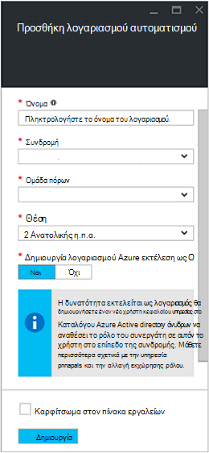
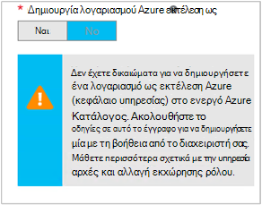

<properties
   pageTitle="Ρύθμιση παραμέτρων λογαριασμού χρήστη Azure AD | Microsoft Azure"
   description="Σε αυτό το άρθρο περιγράφει τον τρόπο ρύθμισης παραμέτρων των διαπιστευτηρίων του λογαριασμού χρήστη AD Azure για runbooks στην αυτοματοποίηση Azure για τον έλεγχο ταυτότητας σε σχέση με ARM και ASM."
   services="automation"
   documentationCenter=""
   authors="MGoedtel"
   manager="jwhit"
   editor="tysonn"
   keywords="καταλόγου Azure active directory χρήστη, azure διαχείρισης, azure ad λογαριασμός χρήστη υπηρεσίας" />
<tags
   ms.service="automation"
   ms.devlang="na"
   ms.topic="get-started-article"
   ms.tgt_pltfrm="na"
   ms.workload="infrastructure-services"
   ms.date="09/12/2016"
   ms.author="magoedte" />

# Ο έλεγχος ταυτότητας Runbooks με Azure υπηρεσίας διαχείρισης και διαχείριση πόρων

Σε αυτό το άρθρο περιγράφει τα βήματα που πρέπει να εκτελέσετε για να ρυθμίσετε ένα λογαριασμό χρήστη Azure AD για runbooks αυτοματισμού Azure εκτέλεση του Azure υπηρεσίας διαχείρισης (ASM) ή διαχείριση πόρων Azure (ARM) πόρους.  Ενώ αυτό εξακολουθεί να είναι μια ταυτότητα υποστηριζόμενες ελέγχου ταυτότητας για το ARM ανάλογα με το runbooks, η προτεινόμενη μέθοδος χρησιμοποιεί ο νέος λογαριασμός Azure εκτέλεση ως.       

## Δημιουργήστε έναν νέο χρήστη Azure Active Directory

1. Συνδεθείτε στην πύλη κλασική Azure ως διαχειριστής υπηρεσιών για τη συνδρομή Azure που θέλετε να διαχειριστείτε.
2. Επιλέξτε την **Υπηρεσία καταλόγου Active Directory**και, στη συνέχεια, επιλέξτε το όνομα του καταλόγου της εταιρείας σας.
3. Επιλέξτε την καρτέλα **χρήστες** και, στη συνέχεια, στην περιοχή γραμμή, επιλέξτε **Προσθήκη χρήστη**.
4. Στη σελίδα **πείτε μας σχετικά με αυτόν το χρήστη** , στην περιοχή **Τύπος χρήστη**, επιλέξτε **νέο χρήστη στην εταιρεία σας**.
5. Πληκτρολογήστε ένα όνομα χρήστη.  
6. Επιλέξτε το όνομα του καταλόγου που σχετίζεται με τη συνδρομή σας Azure στη σελίδα υπηρεσίας καταλόγου Active Directory.
7. Στη σελίδα **προφίλ χρήστη** , δώστε μια πρώτη και επώνυμο, ένα φιλικό όνομα και χρήστη από τη λίστα **ρόλων** .  Κάνετε **Ενεργοποίηση του ελέγχου ταυτότητας πολλαπλών παραγόντων**.
8. Σημείωση ονοματεπώνυμο και προσωρινό κωδικό πρόσβασης του χρήστη.
9. Επιλέξτε **Ρυθμίσεις > διαχειριστές > Προσθήκη**.
10. Πληκτρολογήστε το πλήρες όνομα του χρήστη του χρήστη που έχετε δημιουργήσει.
11. Επιλέξτε τη συνδρομή που θέλετε στο χρήστη για τη διαχείριση.
12. Αποσυνδέεστε από το Azure και κατόπιν συνδεθείτε ξανά με το λογαριασμό που μόλις δημιουργήσατε. Θα σας ζητηθεί να αλλάξετε τον κωδικό πρόσβασης του χρήστη.

## Δημιουργήστε ένα λογαριασμό αυτοματισμού στην πύλη κλασική Azure
Σε αυτήν την ενότητα, θα μπορείτε να εκτελέσετε τα παρακάτω βήματα για να δημιουργήσετε ένα νέο λογαριασμό αυτοματισμού Azure στην πύλη του Azure που θα χρησιμοποιηθεί με το runbooks τη διαχείριση των πόρων σε κατάσταση ASM και ARM.  

>[AZURE.NOTE] Διαχείριση αυτοματισμού λογαριασμοί που έχουν δημιουργηθεί με την πύλη κλασική Azure μπορεί να πραγματοποιηθεί από το Azure κλασική και πύλη Azure και είτε σύνολο των cmdlet του. Αφού δημιουργηθεί το λογαριασμό, δεν έχει σημασία πώς να δημιουργήσετε και να διαχειριστείτε πόρους στο λογαριασμό. Εάν σχεδιάζετε να συνεχίσετε να χρησιμοποιείτε την πύλη κλασική Azure, στη συνέχεια, θα πρέπει να χρησιμοποιείτε αντί για την πύλη του Azure για να δημιουργήσετε λογαριασμούς αυτοματισμού.

1. Συνδεθείτε στην πύλη κλασική Azure ως διαχειριστής υπηρεσιών για τη συνδρομή Azure που θέλετε να διαχειριστείτε.
2. Επιλέξτε **αυτοματισμού**.
3. Στη σελίδα **αυτοματισμού** , επιλέξτε **Δημιουργία λογαριασμού αυτοματισμού**.
4. Στο παράθυρο διαλόγου **Δημιουργία λογαριασμού αυτοματισμού** , πληκτρολογήστε ένα όνομα για τον νέο λογαριασμό αυτοματισμού και επιλέξτε μια **περιοχή** από την αναπτυσσόμενη λίστα.  
5. Κάντε κλικ στο **κουμπί OK** για να αποδεχτείτε τις ρυθμίσεις σας και να δημιουργήσετε το λογαριασμό.
6. Αφού δημιουργηθεί θα εμφανίζεται στη σελίδα **αυτοματισμού** .
7. Κάντε κλικ στο λογαριασμό και σας θα φέρει στη σελίδα πίνακα εργαλείων.  
8. Στη σελίδα πίνακα εργαλείων αυτοματισμού, επιλέξτε **στοιχεία**.
9. Στη σελίδα **περιουσιακών στοιχείων** , επιλέξτε **Προσθήκη ρυθμίσεων** που βρίσκεται στο κάτω μέρος της σελίδας.
10. Στη σελίδα **Προσθήκη ρυθμίσεων** , επιλέξτε **Προσθήκη διαπιστευτηρίων**.
11. Στη σελίδα **Ορισμός διαπιστευτηρίων** , επιλέξτε **Windows PowerShell διαπιστευτήρια** από την αναπτυσσόμενη λίστα **Τύπος διαπιστευτηρίων** και δώστε ένα όνομα για τα διαπιστευτήρια.
12. Στην παρακάτω **Ορισμός διαπιστευτηρίων** σελίδας, πληκτρολογήστε στο πλαίσιο username του λογαριασμού χρήστη AD δημιουργήσατε νωρίτερα στο πεδίο **Όνομα χρήστη** και τον κωδικό πρόσβασης στα πεδία **τον κωδικό πρόσβασης** και **Επιβεβαίωση κωδικού πρόσβασης** . Κάντε κλικ στο **κουμπί OK** για να αποθηκεύσετε τις αλλαγές σας.

## Δημιουργήστε ένα λογαριασμό αυτοματισμού στην πύλη του Azure

Σε αυτήν την ενότητα, θα μπορείτε να εκτελέσετε τα παρακάτω βήματα για να δημιουργήσετε ένα νέο λογαριασμό αυτοματισμού Azure στην πύλη του Azure που θα χρησιμοποιηθεί με τη διαχείριση πόρων σας runbooks σε κατάσταση λειτουργίας ARM.  

1. Συνδεθείτε στην πύλη του Azure ως διαχειριστής υπηρεσιών για τη συνδρομή Azure που θέλετε να διαχειριστείτε.
2. Επιλέξτε **Λογαριασμοί αυτοματισμού**.
3. Στο το blade αυτοματισμού λογαριασμοί, κάντε κλικ στην επιλογή **Προσθήκη**. 
2. Στο blade **Προσθήκη λογαριασμού αυτοματισμού** , στο πλαίσιο **όνομα** , πληκτρολογήστε ένα όνομα για τον νέο λογαριασμό αυτοματισμού.
5. Εάν έχετε περισσότερες από μία συνδρομές, καθορίστε τον τομέα για το νέο λογαριασμό, καθώς και μια νέα ή υπάρχουσα **ομάδα πόρων** και μια **θέση**του Azure κέντρου δεδομένων.
3. Επιλέξτε την τιμή **όχι** για την επιλογή " **Δημιουργία Azure εκτελείται ως λογαριασμός** " και κάντε κλικ στο κουμπί **Δημιουργία** .  

    >[AZURE.NOTE] Εάν επιλέξετε να μην δημιουργήσετε το λογαριασμό εκτέλεση ως, επιλέγοντας το στοιχείο **όχι**, θα εμφανιστεί ένα προειδοποιητικό μήνυμα στο το blade **Προσθήκη λογαριασμού αυτοματισμού** .  Ενώ το λογαριασμό δημιουργείται και στους οποίους έχουν ανατεθεί στο ρόλο **συμβολής** στην συνδρομής, δεν θα έχει μια αντίστοιχη ταυτότητα ελέγχου εντός της υπηρεσίας καταλόγου συνδρομές και γι ' αυτό, δεν υπάρχει πρόσβαση σε πόρους στη συνδρομή σας.  Αυτό θα εμποδίσει οποιαδήποτε runbooks αναφορά σε αυτόν το λογαριασμό από τον έλεγχο ταυτότητας και να εκτελέσετε εργασίες σε σχέση με ARM πόρους.

    

4. Ενώ Azure δημιουργεί το λογαριασμό αυτοματισμού, μπορείτε να παρακολουθήσετε την πρόοδο στην περιοχή **ειδοποιήσεων** από το μενού.

Όταν ολοκληρωθεί η δημιουργία των διαπιστευτηρίων, στη συνέχεια, θα πρέπει για τη δημιουργία ενός περιουσιακού στοιχείου διαπιστευτηρίων για να συσχετίσετε το λογαριασμό αυτοματισμού με το λογαριασμό χρήστη AD που δημιουργήσατε νωρίτερα.  Να θυμάστε, που δημιουργήσαμε μόνο ο λογαριασμός αυτοματισμού και δεν έχει συσχετιστεί με μια ταυτότητα ελέγχου ταυτότητας.  Ακολουθήστε τα βήματα που περιγράφονται σε [στοιχεία διαπιστευτηρίων στο άρθρο αυτοματισμού Azure](../automation/automation-credentials.md#creating-a-new-credential) και πληκτρολογήστε την τιμή για το **όνομα χρήστη** στο τη μορφή **τομέας\χρήστης**.

## Χρήση των διαπιστευτηρίων σε ένα runbook

Μπορείτε να ανακτήσετε τα διαπιστευτήρια σε μια runbook χρησιμοποιώντας τη δραστηριότητα [Get-AutomationPSCredential](http://msdn.microsoft.com/library/dn940015.aspx) και, στη συνέχεια, να το χρησιμοποιήσετε με [Προσθήκη AzureAccount](http://msdn.microsoft.com/library/azure/dn722528.aspx) για να συνδεθείτε με τη συνδρομή σας στο Azure. Εάν τα διαπιστευτήρια που είναι ο διαχειριστής του Azure πολλές συνδρομές, στη συνέχεια, [Επιλέξτε AzureSubscription](http://msdn.microsoft.com/library/dn495203.aspx) πρέπει επίσης να χρησιμοποιήσετε για να καθορίσετε το σωστό αρχείο. Αυτό εμφανίζεται στο δείγμα του Windows PowerShell παρακάτω που συνήθως θα εμφανίζονται στο επάνω μέρος περισσότερες runbooks Azure αυτοματισμού.

    $cred = Get-AutomationPSCredential –Name "myuseraccount.onmicrosoft.com"
    Add-AzureAccount –Credential $cred
    Select-AzureSubscription –SubscriptionName "My Subscription"

Θα πρέπει να επαναλάβετε αυτές τις γραμμές μετά από οποιαδήποτε [σημεία ελέγχου](http://technet.microsoft.com/library/dn469257.aspx#bk_Checkpoints) στο runbook σας. Εάν runbook τίθεται σε αναστολή και, στη συνέχεια, επανέρχεται στην άλλη εργαζόμενου, στη συνέχεια, αυτό θα πρέπει να εκτελέσετε ξανά τον έλεγχο ταυτότητας.

## Επόμενα βήματα
* Εξετάστε τις runbook διαφορετικούς τύπους και τα βήματα για να δημιουργήσετε το δικό σας runbooks από το ακόλουθο άρθρο [τύποι runbook αυτοματισμού Azure](../automation/automation-runbook-types.md)
