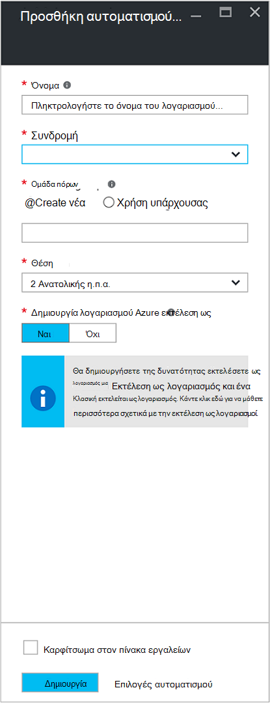
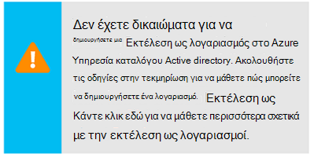
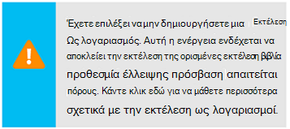
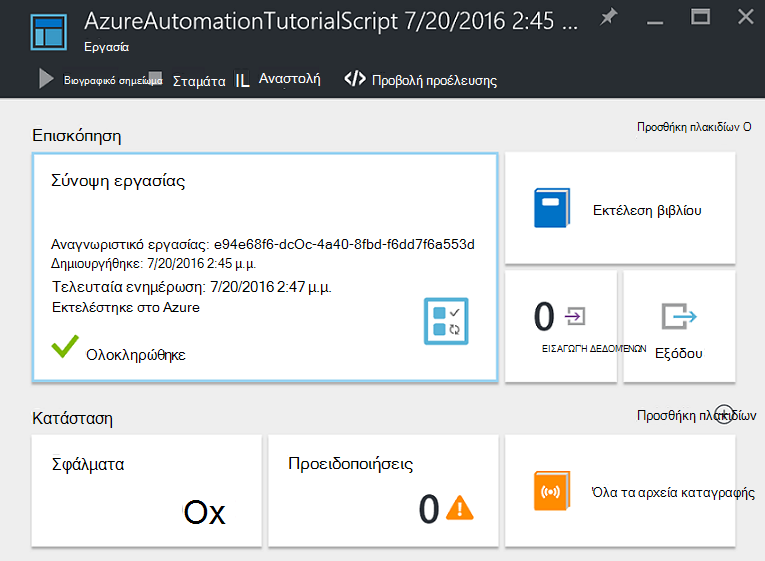
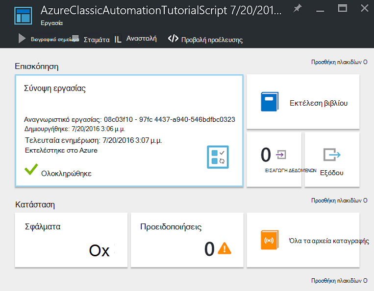
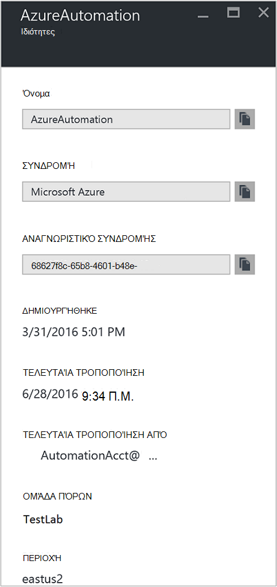

<properties
    pageTitle="Ρύθμιση παραμέτρων Azure εκτέλεση ως λογαριασμός | Microsoft Azure"
    description="Προγραμμάτων εκμάθησης που σας καθοδηγεί σε τη χρήση δημιουργίας, δοκιμή και παράδειγμα κεφαλαίου τον έλεγχο ταυτότητας ασφαλείας στο Azure αυτοματισμού."
    services="automation"
    documentationCenter=""
    authors="mgoedtel"
    manager="jwhit"
    editor=""
    keywords="κύριο όνομα υπηρεσίας, setspn, azure ελέγχου ταυτότητας"/>
<tags
    ms.service="automation"
    ms.workload="tbd"
    ms.tgt_pltfrm="na"
    ms.devlang="na"
    ms.topic="get-started-article"
    ms.date="08/17/2016"
    ms.author="magoedte"/>

# Ο έλεγχος ταυτότητας Runbooks με Azure εκτελείται ως λογαριασμός

Αυτό το θέμα θα σας δείξουμε πώς να ρυθμίσετε ένα λογαριασμό αυτοματισμού από την πύλη Azure με χρήση της δυνατότητας εκτελέσετε ως λογαριασμός για τον έλεγχο ταυτότητας runbooks διαχείριση των πόρων διαχείρισης πόρων Azure είτε στη Διαχείριση υπηρεσίας Azure.

Όταν δημιουργείτε ένα νέο λογαριασμό αυτοματισμού στην πύλη του Azure, δημιουργεί αυτόματα:

- Εκτέλεση ως λογαριασμό ο οποίος δημιουργεί μια νέα υπηρεσία κεφάλαιο στο Azure Active Directory, ένα πιστοποιητικό, και εκχωρεί το συμβολής έλεγχο πρόσβασης βάσει ρόλων (RBAC), που θα χρησιμοποιηθεί για τη διαχείριση πόρων διαχείρισης πόρων χρησιμοποιώντας runbooks.   
- Κλασική εκτέλεση ως λογαριασμό με την αποστολή ενός πιστοποιητικού διαχείρισης, που θα χρησιμοποιηθεί για τη Διαχείριση διαχείριση υπηρεσίας Azure ή κλασική πόρων με runbooks τους.  

Αυτό απλοποιεί τη διαδικασία για εσάς και σας βοηθά να ξεκινήσετε γρήγορα δημιουργία και ανάπτυξη runbooks να υποστηρίζει τις ανάγκες σας αυτοματισμού.      

Χρησιμοποιώντας ένα λογαριασμό εκτέλεση ως και κλασική εκτέλεση ως, μπορείτε να:

- Παρέχει μια τυποποιημένη τρόπο για τον έλεγχο ταυτότητας με Azure κατά τη διαχείριση των πόρων διαχείρισης πόρων Azure ή διαχείριση της υπηρεσίας Azure από runbooks στην πύλη του Azure.  
- Αυτοματοποίηση τη χρήση του καθολικού runbooks έχει ρυθμιστεί στο Azure ειδοποιήσεις.

>[AZURE.NOTE] Η Azure [δυνατότητα ειδοποίησης ενοποίησης](../monitoring-and-diagnostics/insights-receive-alert-notifications.md) με καθολική Runbooks αυτοματισμού απαιτεί ένα λογαριασμό αυτοματισμού που έχει ρυθμιστεί με εκτέλεση ως και κλασική εκτελείται ως λογαριασμός. Μπορείτε να επιλέξετε ένα λογαριασμό αυτοματισμού που έχει ήδη ένα λογαριασμό εκτέλεση ως και κλασική εκτέλεση ως που ορίζονται από το ή να επιλέξετε να δημιουργήσετε ένα νέο.

Θα σας δείξουν πώς μπορείτε να δημιουργήσετε το λογαριασμό αυτοματισμού από την πύλη του Azure, ενημερώστε αυτοματισμού λογαριασμού με χρήση του PowerShell, και θα δείχνουν τον τρόπο για τον έλεγχο ταυτότητας στο runbooks σας.

Πριν το κάνουμε, υπάρχουν μερικά πράγματα που πρέπει να κατανοήσετε και να λάβετε υπόψη σας πριν να συνεχίσετε.

1. Αυτό δεν επηρεάζει υπαρχόντων λογαριασμών αυτοματισμού που έχετε ήδη δημιουργήσει το κλασικό είτε μοντέλο ανάπτυξης διαχείρισης πόρων.  
2. Αυτό θα λειτουργεί μόνο για τους λογαριασμούς αυτοματισμού που δημιουργήθηκε μέσω της πύλης Azure.  Προσπαθείτε να δημιουργήσετε ένα λογαριασμό από την πύλη κλασική δεν θα αναπαραχθούν την εκτέλεση ως ρύθμιση παραμέτρων λογαριασμού.
3. Εάν έχετε τη συγκεκριμένη στιγμή runbooks και περιουσιακών στοιχείων (π.χ., χρονοδιαγράμματα, μεταβλητές, κ.λπ.) που δημιουργήσατε προηγουμένως για τη Διαχείριση κλασική πόρων και θέλετε αυτά τα runbooks για τον έλεγχο ταυτότητας με το νέο λογαριασμό κλασική εκτέλεση ως, θα πρέπει να μετεγκατάστασή τους με το νέο λογαριασμό αυτοματισμού ή να ενημερώσετε τον υπάρχοντα λογαριασμό σας χρησιμοποιώντας την παρακάτω δέσμη ενεργειών PowerShell.  
4. Για τον έλεγχο ταυτότητας χρησιμοποιώντας το νέο λογαριασμό εκτέλεση ως και κλασική εκτέλεση ως αυτοματισμού λογαριασμό, θα πρέπει να τροποποιήσετε το υπάρχον runbooks με το παρακάτω παράδειγμα κώδικα.  **Please Σημειώστε** ότι ο λογαριασμός εκτέλεση ως είναι για τον έλεγχο ταυτότητας με πόρους από διαχειριστή πόρων με χρήση της υπηρεσίας με βάση το πιστοποιητικό κεφαλαίου και το λογαριασμό κλασική εκτέλεση ως είναι για τον έλεγχο ταυτότητας με υπηρεσία διαχείρισης πόρους με το πιστοποιητικό διαχείρισης.     

## Δημιουργία νέου λογαριασμού αυτοματισμού από την πύλη του Azure

Σε αυτήν την ενότητα, θα μπορείτε να εκτελέσετε τα παρακάτω βήματα για να δημιουργήσετε ένα νέο λογαριασμό Azure αυτοματισμού από την πύλη του Azure.  Με τον τρόπο αυτό δημιουργείται και την εκτέλεση ως και κλασική εκτέλεση ως λογαριασμό.  

>[AZURE.NOTE] Ο χρήστης εκτέλεση αυτά τα βήματα που *πρέπει να* είναι μέλος του ρόλου διαχειριστές συνδρομής και από το διαχειριστή της συνδρομής που παρέχει πρόσβαση με τη συνδρομή για το χρήστη.  Ο χρήστης πρέπει επίσης να προστεθεί ως χρήστης που συνδρομές προεπιλεγμένη καταλόγου Active Directory. ο λογαριασμός δεν χρειάζεται να αντιστοιχιστεί σε ένα ρόλο Προνομιούχους.

1. Συνδεθείτε στην πύλη του Azure με ένα λογαριασμό που είναι μέλος του ρόλου διαχειριστές συνδρομής και από το διαχειριστή της συνδρομής.
2. Επιλέξτε **Λογαριασμοί αυτοματισμού**.
3. Στο το blade αυτοματισμού λογαριασμοί, κάντε κλικ στην επιλογή **Προσθήκη**. 

    >[AZURE.NOTE]Εάν δείτε το ακόλουθο μήνυμα στο το blade **Προσθήκη λογαριασμού αυτοματισμού** , αυτό συμβαίνει επειδή ο λογαριασμός σας δεν είναι μέλος του ρόλου συνδρομή διαχειριστές και διαχειριστές από κοινού από τη συνδρομή. 

4. Στο blade **Προσθήκη λογαριασμού αυτοματισμού** , στο πλαίσιο **όνομα** , πληκτρολογήστε ένα όνομα για τον νέο λογαριασμό αυτοματισμού.
5. Εάν έχετε περισσότερες από μία συνδρομές, καθορίστε μία για το νέο λογαριασμό, καθώς και μια νέα ή υπάρχουσα **ομάδα πόρων** και μια **θέση**του Azure κέντρου δεδομένων.
6. Επαληθεύστε την τιμή που είναι επιλεγμένο το στοιχείο **Ναι** για την επιλογή **Δημιουργία Azure εκτελείται ως λογαριασμός** και κάντε κλικ στο κουμπί **Δημιουργία** .  

    >[AZURE.NOTE] Εάν επιλέξετε να μην δημιουργήσετε το λογαριασμό εκτέλεση ως, επιλέγοντας το στοιχείο **όχι**, θα εμφανιστεί ένα προειδοποιητικό μήνυμα στο το blade **Προσθήκη λογαριασμού αυτοματισμού** .  Όταν δημιουργηθεί ο λογαριασμός στην πύλη του Azure, δεν θα έχει μια αντίστοιχη ταυτότητα ελέγχου μέσα σε κλασική σας ή από διαχειριστή πόρων συνδρομητική υπηρεσία καταλόγου και γι ' αυτό, δεν επιτρέπεται η πρόσβαση σε πόρους στη συνδρομή σας.  Αυτό θα εμποδίσει οποιαδήποτε runbooks αναφορά σε αυτόν το λογαριασμό από τον έλεγχο ταυτότητας και να εκτελέσετε εργασίες σε σχέση με τους πόρους σε αυτά τα μοντέλα ανάπτυξης.

    > 
Όταν το κεφάλαιο υπηρεσίας δεν έχει δημιουργηθεί ο ρόλος συμβολής δεν θα εκχωρηθούν.

7. Ενώ Azure δημιουργεί το λογαριασμό αυτοματισμού, μπορείτε να παρακολουθήσετε την πρόοδο στην περιοχή **ειδοποιήσεων** από το μενού.

### Πόροι που περιλαμβάνονται

Όταν δημιουργείται με επιτυχία στο λογαριασμό αυτοματισμού, πολλούς πόρους δημιουργούνται αυτόματα για εσάς.  Ο παρακάτω πίνακας συνοψίζει πόρους για την εκτέλεση ως λογαριασμός. 

Πόρων|Περιγραφή
--------|-----------
AzureAutomationTutorial Runbook|Ένα παράδειγμα runbook PowerShell που δείχνει τον τρόπο για τον έλεγχο ταυτότητας χρησιμοποιώντας το λογαριασμό εκτέλεση ως και λαμβάνει όλους τους πόρους για τη διαχείριση πόρων.
AzureAutomationTutorialScript Runbook|Ένα παράδειγμα runbook PowerShell που δείχνει τον τρόπο για τον έλεγχο ταυτότητας χρησιμοποιώντας το λογαριασμό εκτέλεση ως και λαμβάνει όλους τους πόρους για τη διαχείριση πόρων.
AzureRunAsCertificate|Πιστοποιητικό περιουσιακών στοιχείων αυτόματα δημιουργήσατε κατά τη δημιουργία λογαριασμού αυτοματισμού ή χρησιμοποιώντας τη δέσμη ενεργειών PowerShell κάτω από το στοιχείο για έναν υπάρχοντα λογαριασμό.  Σας επιτρέπει να τον έλεγχο ταυτότητας με Azure, έτσι ώστε να μπορείτε να διαχειριστείτε πόρους από διαχειριστή πόρων Azure από runbooks.  Αυτό το πιστοποιητικό έχει μια διάρκεια ζωής ενός έτους.
AzureRunAsConnection|Σύνδεση περιουσιακών στοιχείων αυτόματα δημιουργήσατε κατά τη δημιουργία λογαριασμού αυτοματισμού ή χρησιμοποιώντας τη δέσμη ενεργειών PowerShell κάτω από το στοιχείο για έναν υπάρχοντα λογαριασμό.

Ο παρακάτω πίνακας συνοψίζει πόροι για το λογαριασμό κλασική εκτέλεση ως. 

Πόρων|Περιγραφή
--------|-----------
AzureClassicAutomationTutorial Runbook|Ένα παράδειγμα runbook το οποίο λαμβάνει όλα τα κλασική ΣΠΣ σε μια συνδρομή χρησιμοποιώντας το κλασική εκτέλεση ως λογαριασμό (πιστοποιητικό) και στη συνέχεια εξάγει την Εικονική όνομα και την κατάσταση.
Runbook AzureClassicAutomationTutorial δέσμης ενεργειών|Ένα παράδειγμα runbook το οποίο λαμβάνει όλα τα κλασική ΣΠΣ σε μια συνδρομή χρησιμοποιώντας το κλασική εκτέλεση ως λογαριασμό (πιστοποιητικό) και στη συνέχεια εξάγει την Εικονική όνομα και την κατάσταση.
AzureClassicRunAsCertificate|Πιστοποιητικό περιουσιακών στοιχείων δημιουργείται αυτόματα που χρησιμοποιείται για τον έλεγχο ταυτότητας με Azure, έτσι ώστε να μπορείτε να διαχειρίζεστε Azure κλασική πόρους από runbooks.  Αυτό το πιστοποιητικό έχει μια διάρκεια ζωής ενός έτους.
AzureClassicRunAsConnection|Σύνδεση περιουσιακών στοιχείων δημιουργείται αυτόματα που χρησιμοποιείται για τον έλεγχο ταυτότητας με Azure, έτσι ώστε να μπορείτε να διαχειρίζεστε Azure κλασική πόρους από runbooks.  

## Επαλήθευση του εκτέλεση ως ελέγχου ταυτότητας

Στη συνέχεια θα σας θα εκτελέσει μια μικρή δοκιμή για να επιβεβαιώσετε είστε σε θέση να με επιτυχία τον έλεγχο ταυτότητας με χρήση του νέου λογαριασμού εκτέλεση ως.     

1. Στην πύλη του Azure, ανοίξτε το λογαριασμό αυτοματισμού που δημιουργήσατε νωρίτερα.  
2. Κάντε κλικ στο πλακίδιο **Runbooks** για να ανοίξετε τη λίστα των runbooks.
3. Επιλέξτε **AzureAutomationTutorialScript** runbook και, στη συνέχεια, κάντε κλικ στην επιλογή **Έναρξη** για να ξεκινήσετε runbook.  Θα λάβετε ένα μήνυμα επαλήθευσης που θέλετε να ξεκινήσετε runbook.
4. Δημιουργείται μια [εργασία runbook](automation-runbook-execution.md) , η εργασία εμφανίζεται blade και την κατάσταση της εργασίας εμφανίζονται στο πλακίδιο **Σύνοψη εργασίας** .  
5. Την κατάσταση της εργασίας θα ξεκινήσει ως *σε ουρά* που υποδεικνύει ότι περιμένει ο εργαζόμενος runbook στο cloud για να γίνουν διαθέσιμες. Έτσι, θα μετακινείται για *Έναρξη* όταν ο εργαζόμενος ισχυρίζεται το έργο και, στη συνέχεια, *εκτελούνται* όταν runbook στην πραγματικότητα αρχίζει να λειτουργεί.  
6. Όταν ολοκληρωθεί η εργασία runbook, θα πρέπει να βλέπουμε **ολοκληρωθεί**.   
7. Για να δείτε τα λεπτομερή αποτελέσματα του runbook, κάντε κλικ στο πλακίδιο **εξόδου** .
8. Στο το blade **εξόδου** , θα πρέπει να βλέπετε έχει ελεγχθεί η ταυτότητά και επιστρέφεται μια λίστα με όλους τους πόρους που είναι διαθέσιμες στην ομάδα πόρων με επιτυχία.
9. Κλείστε το blade **εξόδου** για να επιστρέψετε το blade **Σύνοψη εργασίας** .
13. Κλείστε τη **Σύνοψη εργασίας** και το αντίστοιχο blade runbook **AzureAutomationTutorialScript** .

## Επαλήθευση του κλασική εκτέλεση ως ελέγχου ταυτότητας

Στη συνέχεια θα σας θα εκτελέσει μια μικρή δοκιμή για να επιβεβαιώσετε είστε σε θέση να με επιτυχία τον έλεγχο ταυτότητας με χρήση του νέου λογαριασμού κλασική εκτέλεση ως.     

1. Στην πύλη του Azure, ανοίξτε το λογαριασμό αυτοματισμού που δημιουργήσατε νωρίτερα.  
2. Κάντε κλικ στο πλακίδιο **Runbooks** για να ανοίξετε τη λίστα των runbooks.
3. Επιλέξτε **AzureClassicAutomationTutorialScript** runbook και, στη συνέχεια, κάντε κλικ στην επιλογή **Έναρξη** για να ξεκινήσετε runbook.  Θα λάβετε ένα μήνυμα επαλήθευσης που θέλετε να ξεκινήσετε runbook.
4. Δημιουργείται μια [εργασία runbook](automation-runbook-execution.md) , η εργασία εμφανίζεται blade και την κατάσταση της εργασίας εμφανίζονται στο πλακίδιο **Σύνοψη εργασίας** .  
5. Την κατάσταση της εργασίας θα ξεκινήσει ως *σε ουρά* που υποδεικνύει ότι περιμένει ο εργαζόμενος runbook στο cloud για να γίνουν διαθέσιμες. Έτσι, θα μετακινείται για *Έναρξη* όταν ο εργαζόμενος ισχυρίζεται το έργο και, στη συνέχεια, *εκτελούνται* όταν runbook στην πραγματικότητα αρχίζει να λειτουργεί.  
6. Όταν ολοκληρωθεί η εργασία runbook, θα πρέπει να βλέπουμε **ολοκληρωθεί**.   
7. Για να δείτε τα λεπτομερή αποτελέσματα του runbook, κάντε κλικ στο πλακίδιο **εξόδου** .
8. Στο το blade **εξόδου** , θα πρέπει να βλέπετε έχει ελεγχθεί η ταυτότητά και επιστρέφεται μια λίστα με όλα τα κλασική Εικονική του στην συνδρομής με επιτυχία.
9. Κλείστε το blade **εξόδου** για να επιστρέψετε το blade **Σύνοψη εργασίας** .
13. Κλείστε τη **Σύνοψη εργασίας** και το αντίστοιχο blade runbook **AzureClassicAutomationTutorialScript** .

## Ενημέρωση αυτοματισμού λογαριασμού με χρήση του PowerShell

Εδώ σας παρέχουμε την επιλογή χρήση του PowerShell για να ενημερώσετε υπάρχοντα λογαριασμό αυτοματισμού, εάν:

1. Έχετε δημιουργήσει ένα λογαριασμό αυτοματισμού, αλλά απέρριψε την πρόσκληση για να δημιουργήσετε το λογαριασμό εκτέλεση ως
2. Έχετε ήδη ένα λογαριασμό αυτοματισμού για τη διαχείριση πόρων διαχείρισης πόρων και θέλετε να ενημερώσετε ώστε να περιλαμβάνει το λογαριασμό για τον έλεγχο ταυτότητας runbook εκτέλεση ως
2. Έχετε ήδη ένα λογαριασμό αυτοματισμού για τη Διαχείριση κλασική πόρων και θέλετε να ενημερώσετε, ώστε να χρησιμοποιεί την κλασική εκτέλεση ως αντί για τη δημιουργία ενός νέου λογαριασμού και μετεγκατάσταση runbooks και τα στοιχεία σας σε αυτό   

Πριν να συνεχίσετε, βεβαιωθείτε ότι τα εξής:

1. Έχετε κάνει λήψη και εγκατάσταση [Framework διαχείρισης των Windows (WMF) 4.0](https://www.microsoft.com/download/details.aspx?id=40855) Εάν χρησιμοποιείτε τα Windows 7.   
    Εάν χρησιμοποιείτε Windows Server 2012 R2, Windows Server 2012, Windows 2008 R2, Windows 8.1 και Windows 7 SP1, [Windows Management Framework 5.0](https://www.microsoft.com/download/details.aspx?id=50395) είναι διαθέσιμη για εγκατάσταση.
2. Azure PowerShell 1.0. Για πληροφορίες σχετικά με αυτήν την έκδοση και πώς μπορείτε να το εγκαταστήσετε, ανατρέξτε στο θέμα [Πώς να εγκαταστήσετε και να ρυθμίσετε τις παραμέτρους του PowerShell Azure](../powershell-install-configure.md).
3. Έχετε δημιουργήσει ένα λογαριασμό αυτοματισμού.  Αυτός ο λογαριασμός θα αναφέρεται ως η τιμή για τις παραμέτρους του AutomationAccountName- και - ApplicationDisplayName σε δύο παρακάτω δέσμες ενεργειών.

Για να λάβετε τις τιμές για *SubscriptionID*, *ομάδα πόρων*και *AutomationAccountName*, που είναι απαραίτητες παράμετροι για τις δέσμες ενεργειών, στην πύλη του Azure επιλέξτε το λογαριασμό σας αυτοματισμού από το **λογαριασμό αυτοματισμού** blade και επιλέξτε **όλες τις ρυθμίσεις**.  Από το blade **όλες τις ρυθμίσεις** , στην περιοχή **Ρυθμίσεις λογαριασμού** , επιλέξτε **Ιδιότητες**.  Στο το blade **Ιδιότητες** , μπορείτε να σημειώσετε αυτές τις τιμές.    

### Δημιουργία δέσμης ενεργειών PowerShell εκτελείται ως λογαριασμός

Το παρακάτω δέσμη ενεργειών PowerShell θα ρυθμίσετε τις παραμέτρους τα εξής:

- Μια εφαρμογή Azure AD που θα υποβληθούν σε έλεγχο ταυτότητας με το αυτο-υπογεγραμμένου πιστοποιητικού, δημιουργήστε ένα λογαριασμό υπηρεσίας κεφαλαίου για αυτήν την εφαρμογή στο Azure AD και έχει εκχωρηθεί ο ρόλος συμβολής (θα μπορούσε να μπορείτε να αλλάξετε αυτήν την κάτοχο ή οποιονδήποτε άλλο ρόλο) για αυτόν το λογαριασμό στην τρέχουσα συνδρομή σας.  Για περισσότερες πληροφορίες, διαβάστε το άρθρο [Έλεγχος πρόσβασης βάσει ρόλων στο Azure αυτοματισμού](../automation/automation-role-based-access-control.md) .
- Ενός περιουσιακού στοιχείου πιστοποιητικό αυτοματισμού στο λογαριασμό καθορισμένο αυτοματισμού με το όνομα **AzureRunAsCertificate**, που να περιέχει το πιστοποιητικό που χρησιμοποιείται από την υπηρεσία κεφαλαίου.
- Ενός περιουσιακού στοιχείου σύνδεσης αυτοματισμού στο λογαριασμό καθορισμένο αυτοματισμού με το όνομα **AzureRunAsConnection**, που να περιέχει τα αναγνωριστικά εφαρμογής, tenantId, subscriptionId και αποτύπωση πιστοποιητικού.    

Τα παρακάτω βήματα θα σας καθοδηγήσει κατά τη διαδικασία της εκτέλεσης της δέσμης ενεργειών.

1. Αποθηκεύστε την ακόλουθη δέσμη ενεργειών στον υπολογιστή σας.  Σε αυτό το παράδειγμα, αποθηκεύστε το με το όνομα αρχείου **Δημιουργία AzureServicePrincipal.ps1**.  

        #Requires -RunAsAdministrator
        Param (
        [Parameter(Mandatory=$true)]
        [String] $ResourceGroup,

        [Parameter(Mandatory=$true)]
        [String] $AutomationAccountName,

        [Parameter(Mandatory=$true)]
        [String] $ApplicationDisplayName,

        [Parameter(Mandatory=$true)]
        [String] $SubscriptionId,

        [Parameter(Mandatory=$true)]
        [String] $CertPlainPassword,

        [Parameter(Mandatory=$false)]
        [int] $NoOfMonthsUntilExpired = 12
        )

        Login-AzureRmAccount
        Import-Module AzureRM.Resources
        Select-AzureRmSubscription -SubscriptionId $SubscriptionId

        $CurrentDate = Get-Date
        $EndDate = $CurrentDate.AddMonths($NoOfMonthsUntilExpired)
        $KeyId = (New-Guid).Guid
        $CertPath = Join-Path $env:TEMP ($ApplicationDisplayName + ".pfx")

        $Cert = New-SelfSignedCertificate -DnsName $ApplicationDisplayName -CertStoreLocation cert:\LocalMachine\My -KeyExportPolicy Exportable -Provider "Microsoft Enhanced RSA and AES Cryptographic Provider"

        $CertPassword = ConvertTo-SecureString $CertPlainPassword -AsPlainText -Force
        Export-PfxCertificate -Cert ("Cert:\localmachine\my\" + $Cert.Thumbprint) -FilePath $CertPath -Password $CertPassword -Force | Write-Verbose

        $PFXCert = New-Object -TypeName System.Security.Cryptography.X509Certificates.X509Certificate -ArgumentList @($CertPath, $CertPlainPassword)
        $KeyValue = [System.Convert]::ToBase64String($PFXCert.GetRawCertData())

        $KeyCredential = New-Object  Microsoft.Azure.Commands.Resources.Models.ActiveDirectory.PSADKeyCredential
        $KeyCredential.StartDate = $CurrentDate
        $KeyCredential.EndDate= $EndDate
        $KeyCredential.KeyId = $KeyId
        $KeyCredential.Type = "AsymmetricX509Cert"
        $KeyCredential.Usage = "Verify"
        $KeyCredential.Value = $KeyValue

        # Use Key credentials
        $Application = New-AzureRmADApplication -DisplayName $ApplicationDisplayName -HomePage ("http://" + $ApplicationDisplayName) -IdentifierUris ("http://" + $KeyId) -KeyCredentials $keyCredential

        New-AzureRMADServicePrincipal -ApplicationId $Application.ApplicationId | Write-Verbose
        Get-AzureRmADServicePrincipal | Where {$_.ApplicationId -eq $Application.ApplicationId} | Write-Verbose

        $NewRole = $null
        $Retries = 0;
        While ($NewRole -eq $null -and $Retries -le 6)
        {
           # Sleep here for a few seconds to allow the service principal application to become active (should only take a couple of seconds normally)
           Sleep 5
           New-AzureRMRoleAssignment -RoleDefinitionName Contributor -ServicePrincipalName $Application.ApplicationId | Write-Verbose -ErrorAction SilentlyContinue
           Sleep 10
           $NewRole = Get-AzureRMRoleAssignment -ServicePrincipalName $Application.ApplicationId -ErrorAction SilentlyContinue
           $Retries++;
        }

        # Get the tenant id for this subscription
        $SubscriptionInfo = Get-AzureRmSubscription -SubscriptionId $SubscriptionId
        $TenantID = $SubscriptionInfo | Select TenantId -First 1

        # Create the automation resources
        New-AzureRmAutomationCertificate -ResourceGroupName $ResourceGroup -AutomationAccountName $AutomationAccountName -Path $CertPath -Name AzureRunAsCertificate -Password $CertPassword -Exportable | write-verbose

        # Create a Automation connection asset named AzureRunAsConnection in the Automation account. This connection uses the service principal.
        $ConnectionAssetName = "AzureRunAsConnection"
        Remove-AzureRmAutomationConnection -ResourceGroupName $ResourceGroup -AutomationAccountName $AutomationAccountName -Name $ConnectionAssetName -Force -ErrorAction SilentlyContinue
        $ConnectionFieldValues = @{"ApplicationId" = $Application.ApplicationId; "TenantId" = $TenantID.TenantId; "CertificateThumbprint" = $Cert.Thumbprint; "SubscriptionId" = $SubscriptionId}
        New-AzureRmAutomationConnection -ResourceGroupName $ResourceGroup -AutomationAccountName $AutomationAccountName -Name $ConnectionAssetName -ConnectionTypeName AzureServicePrincipal -ConnectionFieldValues $ConnectionFieldValues

2. Στον υπολογιστή σας, ξεκινήστε το **Windows PowerShell** από την οθόνη **έναρξης** με δικαιώματα αναβαθμισμένα δικαιώματα χρήστη.
3. Από τα αναβαθμισμένα δικαιώματα PowerShell κέλυφος γραμμής εντολών, μεταβείτε στο φάκελο που περιέχει τη δέσμη ενεργειών που δημιουργήσατε στο βήμα 1 και εκτέλεση της δέσμης ενεργειών, αλλάζοντας τις τιμές για τις παραμέτρους του *– Ομάδα πόρων*, *- AutomationAccountName*, *- ApplicationDisplayName*, *- SubscriptionId*και *- CertPlainPassword*. 

    >[AZURE.NOTE] Θα σας ζητηθεί για τον έλεγχο ταυτότητας με Azure μετά την εκτέλεση της δέσμης ενεργειών. Πρέπει να συνδεθείτε με ένα λογαριασμό που είναι μέλος του ρόλου συνδρομή διαχειριστές και διαχειριστές από κοινού από τη συνδρομή.

        .\New-AzureServicePrincipal.ps1 -ResourceGroup <ResourceGroupName>
        -AutomationAccountName <NameofAutomationAccount> `
        -ApplicationDisplayName <DisplayNameofAutomationAccount> `
        -SubscriptionId <SubscriptionId> `
        -CertPlainPassword "<StrongPassword>"  
 

Αφού ολοκληρωθεί με επιτυχία η δέσμη ενεργειών, ανατρέξτε στο του [δείγματος κώδικα](#sample-code-to-authenticate-with-resource-manager-resources) παρακάτω για να τον έλεγχο ταυτότητας με τους πόρους για τη διαχείριση πόρων και επικυρώσετε ρύθμιση παραμέτρων διαπιστευτηρίων.

### Δημιουργία λογαριασμού κλασική εκτέλεση ως δέσμη ενεργειών του PowerShell

Το παρακάτω δέσμη ενεργειών PowerShell θα ρυθμίσετε τις παραμέτρους τα εξής:

- Ενός περιουσιακού στοιχείου πιστοποιητικό αυτοματισμού στο λογαριασμό καθορισμένο αυτοματισμού με το όνομα **AzureClassicRunAsCertificate**, που να περιέχει το πιστοποιητικό που χρησιμοποιείται για τον έλεγχο ταυτότητας του runbooks.
- Ενός περιουσιακού στοιχείου σύνδεσης αυτοματισμού στο λογαριασμό καθορισμένο αυτοματισμού με το όνομα **AzureClassicRunAsConnection**, που να περιέχει το όνομα της συνδρομής, subscriptionId και πιστοποιητικό περιουσιακών στοιχείων.

Η δέσμη ενεργειών θα δημιουργήσετε ένα πιστοποιητικό αυτόματης υπογραφής διαχείρισης και αποθηκεύστε το στο φάκελο προσωρινών αρχείων στον υπολογιστή σας στο προφίλ χρήστη που χρησιμοποιείται για την εκτέλεση της περιόδου λειτουργίας PowerShell - *%USERPROFILE%\AppData\Local\Temp*.  Μετά την εκτέλεση της δέσμης ενεργειών, θα χρειαστεί να αποστείλετε το πιστοποιητικό Azure διαχείρισης στο χώρο αποθήκευσης διαχείρισης για τη συνδρομή του λογαριασμού αυτοματισμού δημιουργήθηκε σε.  Τα παρακάτω βήματα θα σας καθοδηγήσει κατά τη διαδικασία εκτέλεσης της δέσμης ενεργειών και την αποστολή του πιστοποιητικού.  

1. Αποθηκεύστε την ακόλουθη δέσμη ενεργειών στον υπολογιστή σας.  Σε αυτό το παράδειγμα, αποθηκεύστε το με το όνομα αρχείου **Δημιουργία AzureClassicRunAsAccount.ps1**.

        #Requires -RunAsAdministrator
        Param (
        [Parameter(Mandatory=$true)]
        [String] $ResourceGroup,

        [Parameter(Mandatory=$true)]
        [String] $AutomationAccountName,

        [Parameter(Mandatory=$true)]
        [String] $ApplicationDisplayName,

        [Parameter(Mandatory=$true)]
        [String] $SubscriptionId,

        [Parameter(Mandatory=$true)]
        [String] $CertPlainPassword,

        [Parameter(Mandatory=$false)]
        [int] $NoOfMonthsUntilExpired = 12
        )

        Login-AzureRmAccount
        Import-Module AzureRM.Resources
        $Subscription = Select-AzureRmSubscription -SubscriptionId $SubscriptionId
        $SubscriptionName = $subscription.Subscription.SubscriptionName

        $CurrentDate = Get-Date
        $EndDate = $CurrentDate.AddMonths($NoOfMonthsUntilExpired)
        $KeyId = (New-Guid).Guid
        $CertPath = Join-Path $env:TEMP ($ApplicationDisplayName + ".pfx")
        $CertPathCer = Join-Path $env:TEMP ($ApplicationDisplayName + ".cer")

        $Cert = New-SelfSignedCertificate -DnsName $ApplicationDisplayName -CertStoreLocation cert:\LocalMachine\My -KeyExportPolicy Exportable -Provider "Microsoft Enhanced RSA and AES Cryptographic Provider"

        $CertPassword = ConvertTo-SecureString $CertPlainPassword -AsPlainText -Force
        Export-PfxCertificate -Cert ("Cert:\localmachine\my\" + $Cert.Thumbprint) -FilePath $CertPath -Password $CertPassword -Force | Write-Verbose
        Export-Certificate -Cert ("Cert:\localmachine\my\" + $Cert.Thumbprint) -FilePath $CertPathCer -Type CERT | Write-Verbose

        # Create the automation resources
        $ClassicCertificateAssetName = "AzureClassicRunAsCertificate"
        New-AzureRmAutomationCertificate -ResourceGroupName $ResourceGroup -AutomationAccountName $AutomationAccountName -Path $CertPath -Name $ClassicCertificateAssetName  -Password $CertPassword -Exportable | write-verbose

        # Create a Automation connection asset named AzureClassicRunAsConnection in the Automation account. This connection uses the ClassicCertificateAssetName.
        $ConnectionAssetName = "AzureClassicRunAsConnection"
        Remove-AzureRmAutomationConnection -ResourceGroupName $ResourceGroup -AutomationAccountName $AutomationAccountName -Name $ConnectionAssetName -Force -ErrorAction SilentlyContinue
        $ConnectionFieldValues = @{"SubscriptionName" = $SubscriptionName; "SubscriptionId" = $SubscriptionId; "CertificateAssetName" = $ClassicCertificateAssetName}
        New-AzureRmAutomationConnection -ResourceGroupName $ResourceGroup -AutomationAccountName $AutomationAccountName -Name $ConnectionAssetName -ConnectionTypeName AzureClassicCertificate -ConnectionFieldValues $ConnectionFieldValues

        Write-Host -ForegroundColor red "Please upload the cert $CertPathCer to the Management store by following the steps below."
        Write-Host -ForegroundColor red "Log in to the Microsoft Azure Management portal (https://manage.windowsazure.com) and select Settings -> Management Certificates."
        Write-Host -ForegroundColor red "Then click Upload and upload the certificate $CertPathCer"

2. Στον υπολογιστή σας, ξεκινήστε το **Windows PowerShell** από την οθόνη **έναρξης** με δικαιώματα αναβαθμισμένα δικαιώματα χρήστη.  
3. Από τα αναβαθμισμένα δικαιώματα PowerShell κέλυφος γραμμής εντολών, μεταβείτε στο φάκελο που περιέχει τη δέσμη ενεργειών που δημιουργήσατε στο βήμα 1 και εκτέλεση της δέσμης ενεργειών, αλλάζοντας τις τιμές για τις παραμέτρους του *– Ομάδα πόρων*, *- AutomationAccountName*, *- ApplicationDisplayName*, *- SubscriptionId*και *- CertPlainPassword*. 

    >[AZURE.NOTE] Θα σας ζητηθεί για τον έλεγχο ταυτότητας με Azure μετά την εκτέλεση της δέσμης ενεργειών. Πρέπει να συνδεθείτε με ένα λογαριασμό που είναι μέλος του ρόλου συνδρομή διαχειριστές και διαχειριστές από κοινού από τη συνδρομή.

        .\New-AzureClassicRunAsAccount.ps1 -ResourceGroup <ResourceGroupName>
        -AutomationAccountName <NameofAutomationAccount> `
        -ApplicationDisplayName <DisplayNameofAutomationAccount> `
        -SubscriptionId <SubscriptionId> `
        -CertPlainPassword "<StrongPassword>"

Μετά τη δέσμη ενεργειών ολοκληρωθεί με επιτυχία, θα πρέπει να αντιγράψετε το πιστοποιητικό που δημιουργήσατε στο φάκελο **Temp** προφίλ χρήστη.  Ακολουθήστε τα βήματα για την [Αποστολή ενός πιστοποιητικού API διαχείρισης](../azure-api-management-certs.md) στην πύλη του Azure κλασική και, στη συνέχεια, ανατρέξτε το [δείγμα κώδικα](#sample-code-to-authenticate-with-service-management-resources) για την επικύρωση ρύθμισης παραμέτρων διαπιστευτηρίων με υπηρεσία διαχείρισης πόρων.

## Δείγμα κώδικα για τον έλεγχο ταυτότητας με πόρους από διαχειριστή πόρων

Μπορείτε να χρησιμοποιήσετε την παρακάτω, ενημερωμένο δείγμα κώδικα που λαμβάνονται από runbook **AzureAutomationTutorialScript** παράδειγμα, για τον έλεγχο ταυτότητας χρησιμοποιώντας το λογαριασμό εκτέλεση ως για να διαχειριστείτε τους πόρους για τη διαχείριση πόρων με το runbooks.   

    $connectionName = "AzureRunAsConnection"
    $SubId = Get-AutomationVariable -Name 'SubscriptionId'
    try
    {
       # Get the connection "AzureRunAsConnection "
       $servicePrincipalConnection=Get-AutomationConnection -Name $connectionName         

       "Logging in to Azure..."
       Add-AzureRmAccount `
         -ServicePrincipal `
         -TenantId $servicePrincipalConnection.TenantId `
         -ApplicationId $servicePrincipalConnection.ApplicationId `
         -CertificateThumbprint $servicePrincipalConnection.CertificateThumbprint
       "Setting context to a specific subscription"  
       Set-AzureRmContext -SubscriptionId $SubId             
    }
    catch {
        if (!$servicePrincipalConnection)
        {
           $ErrorMessage = "Connection $connectionName not found."
           throw $ErrorMessage
         } else{
            Write-Error -Message $_.Exception
            throw $_.Exception
         }
    }

Η δέσμη ενεργειών περιλαμβάνει δύο επιπλέον γραμμές κώδικα για την υποστήριξη αναφορά σε ένα περιβάλλον συνδρομή, ώστε να μπορείτε εύκολα να εργάζεστε μεταξύ πολλές συνδρομές. Μια μεταβλητή περιουσιακών στοιχείων με την ονομασία SubscriptionId περιέχει το Αναγνωριστικό της συνδρομής και μετά την πρόταση cmdlet Προσθήκη AzureRmAccount, δηλώνεται με το [cmdlet Set-AzureRmContext](https://msdn.microsoft.com/library/mt619263.aspx) η παράμετρος οριστεί *- SubscriptionId*. Εάν το όνομα της μεταβλητής είναι πολύ γενικής χρήσης, μπορείτε να αναθεωρήσετε το όνομα της μεταβλητής για να συμπεριλάβετε ένα πρόθεμα ή άλλους κανόνες ονοματοθεσίας για να σας διευκολύνουν να προσδιορίσετε για τους σκοπούς σας. Εναλλακτικά, μπορείτε να χρησιμοποιήσετε την παράμετρο ρύθμιση - SubscriptionName αντί για-SubscriptionId με μια αντίστοιχη μεταβλητής περιουσιακών στοιχείων.  

Παρατηρήστε το cmdlet που χρησιμοποιούνται για τον έλεγχο ταυτότητας στο runbook - **Προσθήκη AzureRmAccount**, χρησιμοποιεί τη ρύθμιση παραμέτρων *ServicePrincipalCertificate* .  Το πραγματοποιεί έλεγχο ταυτότητας με τη χρήση κεφαλαίου πιστοποιητικό υπηρεσίας, δεν διαπιστευτήρια.  

## Δείγμα κώδικα για τον έλεγχο ταυτότητας με υπηρεσία διαχείρισης πόρων

Μπορείτε να χρησιμοποιήσετε την παρακάτω, ενημερωμένο δείγμα κώδικα που λαμβάνονται από runbook **AzureClassicAutomationTutorialScript** παράδειγμα, για τον έλεγχο ταυτότητας χρησιμοποιώντας το λογαριασμό κλασική εκτέλεση ως για να διαχειριστείτε κλασική πόρους με runbooks σας.

    $ConnectionAssetName = "AzureClassicRunAsConnection"
    # Get the connection
    $connection = Get-AutomationConnection -Name $connectionAssetName        

    # Authenticate to Azure with certificate
    Write-Verbose "Get connection asset: $ConnectionAssetName" -Verbose
    $Conn = Get-AutomationConnection -Name $ConnectionAssetName
    if ($Conn -eq $null)
    {
       throw "Could not retrieve connection asset: $ConnectionAssetName. Assure that this asset exists in the Automation account."
    }

    $CertificateAssetName = $Conn.CertificateAssetName
    Write-Verbose "Getting the certificate: $CertificateAssetName" -Verbose
    $AzureCert = Get-AutomationCertificate -Name $CertificateAssetName
    if ($AzureCert -eq $null)
    {
       throw "Could not retrieve certificate asset: $CertificateAssetName. Assure that this asset exists in the Automation account."
    }

    Write-Verbose "Authenticating to Azure with certificate." -Verbose
    Set-AzureSubscription -SubscriptionName $Conn.SubscriptionName -SubscriptionId $Conn.SubscriptionID -Certificate $AzureCert
    Select-AzureSubscription -SubscriptionId $Conn.SubscriptionID

## Επόμενα βήματα

- Για περισσότερες πληροφορίες σχετικά με τις αρχές υπηρεσίας, ανατρέξτε στο [εφαρμογών και των αντικειμένων κεφάλαιο υπηρεσίας](../active-directory/active-directory-application-objects.md).
- Για περισσότερες πληροφορίες σχετικά με έλεγχο πρόσβασης βάσει ρόλων στο Azure αυτοματισμού, ανατρέξτε στο [Έλεγχος πρόσβασης βάσει ρόλων στο Azure αυτοματισμού](../automation/automation-role-based-access-control.md).
- Για περισσότερες πληροφορίες σχετικά με τα πιστοποιητικά και των υπηρεσιών Azure, ανατρέξτε στην [Επισκόπηση των πιστοποιητικών για τις υπηρεσίες Cloud Azure](../cloud-services/cloud-services-certs-create.md)
