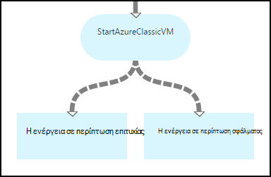
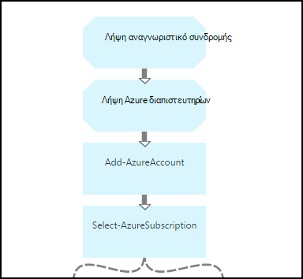
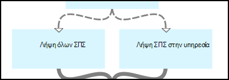
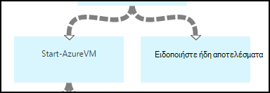
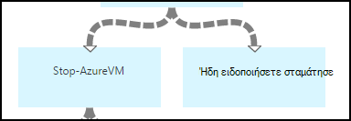
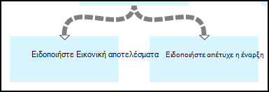
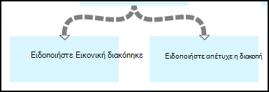

<properties 
    pageTitle="Έναρξη και διακοπή εικονικές μηχανές - Graph | Microsoft Azure"
    description="Ροή εργασίας του PowerShell έκδοση του Azure αυτοματισμού σενάριο, συμπεριλαμβανομένων των runbooks για να ξεκινήσετε και να διακόψετε την κλασική εικονικές μηχανές."
    services="automation"
    documentationCenter=""
    authors="mgoedtel"
    manager="jwhit"
    editor="tysonn" />
<tags 
    ms.service="automation"
    ms.devlang="na"
    ms.topic="article"
    ms.tgt_pltfrm="na"
    ms.workload="infrastructure-services"
    ms.date="07/06/2016"
    ms.author="bwren" />

# Σενάριο αυτοματισμού Azure - Έναρξη και διακοπή εικονικές μηχανές

Αυτό το σενάριο αυτοματισμού Azure περιλαμβάνει runbooks για να ξεκινήσετε και να διακόψετε την κλασική εικονικές μηχανές.  Μπορείτε να χρησιμοποιήσετε αυτό το σενάριο για οποιοδήποτε από τα εξής:  

- Χρησιμοποιήστε το runbooks χωρίς να τροποποιηθεί στο δικό σας περιβάλλον. 
- Τροποποιήστε το runbooks για την εκτέλεση προσαρμοσμένων λειτουργικότητα.  
- Καλέστε το runbooks από μια άλλη runbook ως μέρος μια συνολική λύση. 
- Χρησιμοποιήστε το runbooks ως προγράμματα εκμάθησης για να μάθετε runbook σύνταξης έννοιες. 

> [AZURE.SELECTOR]
- [Γραφικά](automation-solution-startstopvm-graphical.md)
- [Ροή εργασίας του PowerShell](automation-solution-startstopvm-psworkflow.md)

Αυτή είναι η έκδοση γραφικών runbook από αυτό το σενάριο. Είναι επίσης διαθέσιμο με χρήση [runbooks PowerShell ροής εργασίας](automation-solution-startstopvm-psworkflow.md).

## Γρήγορα το σενάριο

Αυτό το σενάριο αποτελείται από δύο δύο runbooks γραφικών που μπορείτε να κάνετε λήψη από τις παρακάτω συνδέσεις.  Δείτε την [έκδοση του PowerShell ροής εργασίας](automation-solution-startstopvm-psworkflow.md) από αυτό το σενάριο για συνδέσεις προς την runbooks PowerShell ροής εργασίας.

| Runbook | Σύνδεση | Τύπος | Περιγραφή |
|:---|:---|:---|:---|
| StartAzureClassicVM | [Έναρξη Azure κλασική Εικονική Runbook γραφικών](https://gallery.technet.microsoft.com/scriptcenter/Start-Azure-Classic-VM-c6067b3d) | Γραφικά | Ξεκινά όλες οι κλασική εικονικές μηχανές σε μια συνδρομή του Azure ή όλες οι εικονικές μηχανές με όνομα συγκεκριμένης υπηρεσίας. |
| StopAzureClassicVM | [Διακοπή Azure κλασική Εικονική Runbook γραφικών](https://gallery.technet.microsoft.com/scriptcenter/Stop-Azure-Classic-VM-397819bd) | Γραφικά | Διακόπτει όλες οι εικονικές μηχανές σε ένα λογαριασμό αυτοματισμού ή όλες οι εικονικές μηχανές με όνομα συγκεκριμένης υπηρεσίας.  |

## Εγκατάσταση και ρύθμιση παραμέτρων του σεναρίου

### 1. Εγκαταστήστε το runbooks

Μετά τη λήψη του runbooks, μπορείτε να εισαγάγετε τους ακολουθώντας τη διαδικασία [γραφικών runbook διαδικασίες](automation-graphical-authoring-intro.md#graphical-runbook-procedures).

### 2. Ελέγξτε τις απαιτήσεις και περιγραφή
Το runbooks περιλαμβάνει μια δραστηριότητα που ονομάζεται **Read Me** που περιλαμβάνει μια περιγραφή και απαιτούμενα στοιχεία.  Μπορείτε να προβάλετε αυτές τις πληροφορίες, επιλέγοντας τη δραστηριότητα **Ανάγνωση προσωπικές πληροφορίες** και, στη συνέχεια, την παράμετρο **Δέσμης ενεργειών ροής εργασίας** .  Μπορείτε επίσης να λάβετε τις ίδιες πληροφορίες από αυτό το άρθρο. 

### 3. ρύθμιση παραμέτρων περιουσιακών στοιχείων
Το runbooks απαιτεί τα εξής στοιχεία που πρέπει να δημιουργήσετε και να συμπληρώσετε με τις κατάλληλες τιμές.  Τα ονόματα είναι προεπιλεγμένη.  Μπορείτε να χρησιμοποιήσετε στοιχεία με διαφορετικά ονόματα Εάν καθορίσετε αυτά τα ονόματα στις [παραμέτρους εισόδου](#using-the-runbooks) κατά την εκκίνηση του runbook.

| Τύπος περιουσιακών στοιχείων | Προεπιλεγμένο όνομα | Περιγραφή |
|:---|:---|:---|:---|
| [Διαπιστευτήρια](automation-credentials.md) | AzureCredential | Περιέχει τα διαπιστευτήρια για ένα λογαριασμό που έχει αρχή για έναρξη και διακοπή εικονικές μηχανές στην Azure συνδρομής.  |
| [Μεταβλητή](automation-variables.md) | AzureSubscriptionId | Περιέχει το Αναγνωριστικό συνδρομής του Azure τη συνδρομή σας. |

## Χρησιμοποιώντας το σενάριο

### Παράμετροι

Το runbooks έχουν τις παρακάτω [παραμέτρους εισόδου](automation-starting-a-runbook.md#runbook-parameters).  Πρέπει να δώσετε τιμές για οποιαδήποτε υποχρεωτικές παράμετροι και προαιρετικά να παράσχετε τιμές για τις άλλες παραμέτρους ανάλογα με τις απαιτήσεις σας.

| Παράμετρος | Τύπος | Υποχρεωτική | Περιγραφή |
|:---|:---|:---|:---|
| Όνομα_υπηρεσίας | συμβολοσειρά | Όχι | Εάν παρέχεται μια τιμή, στη συνέχεια, όλες οι εικονικές μηχανές με αυτό το όνομα υπηρεσίας είναι αποτελέσματα ή να διακοπεί.  Εάν παρέχεται καμία τιμή, στη συνέχεια, όλες οι κλασική εικονικές μηχανές στην Azure συνδρομής είναι αποτελέσματα ή να διακοπεί. |
| AzureSubscriptionIdAssetName | συμβολοσειρά | Όχι | Περιέχει το όνομα της [μεταβλητής περιουσιακών στοιχείων](#installing-and-configuring-the-scenario) που περιέχει το Αναγνωριστικό συνδρομής του Azure τη συνδρομή σας.  Εάν δεν μπορείτε να καθορίσετε μια τιμή, χρησιμοποιείται *AzureSubscriptionId* .  |
| AzureCredentialAssetName | συμβολοσειρά | Όχι | Περιέχει το όνομα του [περιουσιακού στοιχείου διαπιστευτηρίων](#installing-and-configuring-the-scenario) που περιέχει τα διαπιστευτήρια για runbook για να χρησιμοποιήσετε.  Εάν δεν μπορείτε να καθορίσετε μια τιμή, χρησιμοποιείται *AzureCredential* .  |

### Έναρξη του runbooks

Μπορείτε να χρησιμοποιήσετε οποιαδήποτε από τις μεθόδους κατά την [εκκίνηση ενός runbook στο Azure αυτοματισμού](automation-starting-a-runbook.md) για να ξεκινήσετε ένα από τα runbooks σε αυτό το άρθρο.

Τα ακόλουθα δείγματα εντολών χρησιμοποιεί Windows PowerShell για να εκτελέσετε **StartAzureClassicVM** για να ξεκινήσετε όλες οι εικονικές μηχανές με το όνομα της υπηρεσίας *MyVMService*.

    $params = @{"ServiceName"="MyVMService"}
    Start-AzureAutomationRunbook –AutomationAccountName "MyAutomationAccount" –Name "StartAzureClassicVM" –Parameters $params

### Εξόδου

Το runbooks θα [εξόδου ένα μήνυμα](automation-runbook-output-and-messages.md) για κάθε εικονικό μηχάνημα που υποδεικνύει την έναρξη ή διακοπή οδηγία υποβλήθηκε με επιτυχία ή όχι.  Μπορείτε να αναζητήσετε μια συγκεκριμένη συμβολοσειρά στο αποτέλεσμα για να προσδιορίσετε το αποτέλεσμα για κάθε runbook.  Οι πιθανές εξόδου συμβολοσειρές παρατίθενται στον παρακάτω πίνακα.

| Runbook | Η συνθήκη | Μήνυμα |
|:---|:---|:---|
| StartAzureClassicVM | Εικονική μηχανή εκτελείται ήδη  | MyVM εκτελείται ήδη |
| StartAzureClassicVM | Έναρξη της αίτησης για εικονική μηχανή υποβληθεί με επιτυχία | MyVM έχει ξεκινήσει η διαδικασία |
| StartAzureClassicVM | Απέτυχε η αίτηση έναρξης για εικονική μηχανή  | Απέτυχε η MyVM για να ξεκινήσετε |
| StopAzureClassicVM | Εικονική μηχανή εκτελείται ήδη  | MyVM ήδη έχει διακοπεί |
| StopAzureClassicVM | Έναρξη της αίτησης για εικονική μηχανή υποβληθεί με επιτυχία | MyVM έχει ξεκινήσει η διαδικασία |
| StopAzureClassicVM | Απέτυχε η αίτηση έναρξης για εικονική μηχανή  | Απέτυχε η MyVM για να ξεκινήσετε |

Ακολουθεί μια εικόνα χρησιμοποιώντας το **StartAzureClassicVM** ως ένα [θυγατρικό runbook](automation-child-runbooks.md) σε ένα δείγμα γραφικού runbook.  Αυτό χρησιμοποιεί τις υπό όρους συνδέσεις στον παρακάτω πίνακα.

| Σύνδεση | Κριτήρια |
|:---|:---|
| Σύνδεση επιτυχίας | $ActivityOutput ['StartAzureClassicVM']-όπως "\* έχει ξεκινήσει"    |
| Σφάλμα σύνδεσης   | $ActivityOutput ['StartAzureClassicVM']-notlike "\* έχει ξεκινήσει" |

## Λεπτομερή ανάλυση

Ακολουθεί μια λεπτομερή ανάλυση της το runbooks σε αυτό το σενάριο.  Μπορείτε να χρησιμοποιήσετε αυτές τις πληροφορίες για να προσαρμόσετε το runbooks ή μόνο για να μάθετε από αυτά για σύνταξη από κοινού το δικό σας σενάρια αυτοματισμού.
 

### Έλεγχος ταυτότητας

Runbook ξεκινά με δραστηριότητες για να ορίσετε τα [διαπιστευτήρια](automation-configuring.md#configuring-authentication-to-azure-resources) και Azure συνδρομή που θα χρησιμοποιηθεί για τα υπόλοιπα του runbook.

Τα δύο πρώτα δραστηριότητες, **Λάβετε αναγνωριστικό συνδρομής** και **Λάβετε Azure διαπιστευτηρίων**, να ανακτήσετε τα [στοιχεία](#installing-the-runbook) που χρησιμοποιούνται από τις επόμενες δύο δραστηριότητες.  Αυτές οι δραστηριότητες απευθείας μπορούσατε να καθορίσετε τα στοιχεία, αλλά χρειάζεται τα ονόματα των διαθέσιμων στοιχείων.  Εφόσον μας επιτρέπετε στο χρήστη να καθορίσει αυτά τα ονόματα στις [παραμέτρους εισόδου](#using-the-runbooks), χρειαζόμαστε αυτές τις δραστηριότητες για την ανάκτηση των περιουσιακών στοιχείων με όνομα που καθορίζεται από μια παράμετρο εισόδου.

**Προσθήκη AzureAccount** ορίζει τα διαπιστευτήρια που θα χρησιμοποιηθεί για τα υπόλοιπα του runbook.  Παγίου διαπιστευτηρίων που ανακτά από **Λήψη διαπιστευτηρίων Azure** πρέπει να έχουν πρόσβαση σε έναρξη και διακοπή εικονικές μηχανές στην Azure συνδρομής.  Είναι επιλεγμένο τη συνδρομή στην οποία χρησιμοποιείται από **Επιλογή AzureSubscription** που χρησιμοποιεί το αναγνωριστικό από **Λήψη αναγνωριστικό συνδρομής**εγγραφής.

### Λήψη εικονικές μηχανές

Runbook πρέπει να προσδιορίσετε ποια εικονικές μηχανές θα εργάζονται με και αν έχουν ήδη ξεκινήσει ή έγινε διακοπή (ανάλογα με το runbook).   Μία από δύο δραστηριότητες θα ανακτήσει του ΣΠΣ.  **Λήψη ΣΠΣ στην υπηρεσία** θα εκτελεστεί όταν η παράμετρος εισόδου *όνομα_υπηρεσίας* για runbook περιέχει μια τιμή.  **Λήψη όλων των ΣΠΣ** θα εκτελεστεί εάν η παράμετρος εισόδου *όνομα_υπηρεσίας* για runbook δεν περιέχει μια τιμή.  Αυτή η λογική πραγματοποιείται από τις συνδέσεις υπό όρους πριν από κάθε δραστηριότητα.

Δραστηριότητες και οι δύο Χρησιμοποιήστε το cmdlet **Get-AzureVM** .  **Λήψη όλων των ΣΠΣ** χρησιμοποιεί την παράμετρο **ListAllVMs** ρύθμιση για να επιστρέψει όλες οι εικονικές μηχανές.  **Λήψη ΣΠΣ στην υπηρεσία** χρησιμοποιεί τη ρύθμιση παραμέτρων **GetVMByServiceAndVMName** και παρέχει την παράμετρο εισόδου **όνομα_υπηρεσίας** για την παράμετρο **όνομα_υπηρεσίας** .  

### Συγχώνευση ΣΠΣ

Η δραστηριότητα **Συγχώνευση ΣΠΣ** απαιτείται να παρέχετε δεδομένα **Έναρξη-AzureVM** που χρειάζεται το όνομα και το όνομα της υπηρεσίας από το vm(s) για να ξεκινήσετε.  Εισαγωγή αυτών των δεδομένων μπορεί να προέρχονται από **Λήψη όλων των ΣΠΣ** ή **Λήψη ΣΠΣ στην υπηρεσία**, αλλά **Έναρξη AzureVM** να καθορίσετε μόνο μία δραστηριότητα για την εισαγωγή δεδομένων.   

Το σενάριο είναι να δημιουργήσετε **Συγχώνευση ΣΠΣ** , το οποίο εκτελείται το cmdlet **Εγγραφής εξόδου** .  Η παράμετρος **InputObject** για αυτό το cmdlet είναι μια παράσταση PowerShell που συνδυάζει την είσοδο από τις προηγούμενες δύο δραστηριότητες.  Μόνο μία από αυτές τις δραστηριότητες θα εκτελείται, έτσι ώστε μόνο ένα σύνολο εξόδου αναμένεται.  **Έναρξη-AzureVM** να χρησιμοποιήσετε αυτό το προϊόν για τις παραμέτρους εισόδου. 

### Έναρξη/διακοπή εικονικές μηχανές

 

Ανάλογα με το runbook, το επόμενο δραστηριότητες επιχειρήσει να Έναρξη ή διακοπή runbook με τη χρήση **AzureVM Έναρξη** ή **Διακοπή AzureVM**.  Εφόσον τη δραστηριότητα προηγείται μιας σύνδεσης διοχέτευσης, θα εκτελείται μόνο μία φορά για κάθε αντικείμενο που επιστρέφονται από **Συγχώνευση ΣΠΣ**.  Η σύνδεση είναι υπό όρους, έτσι ώστε η δραστηριότητα θα εκτελεστεί μόνο αν η *RunningState* της η εικονική μηχανή είναι *Διακοπή* για **Έναρξη-AzureVM** και *αποτελέσματα* για **Διακοπή AzureVM**. Εάν αυτή η συνθήκη είναι δεν ισχύει, στη συνέχεια, **Ειδοποιήστε ήδη ξεκινήσει** ή **Να σας ειδοποιεί ήδη Stopped** εκτελείται για την αποστολή ενός μηνύματος με το **Αποτέλεσμα του εγγραφής**.

### Αποστολή εξόδου

 

Είναι το τελικό βήμα runbook για να στείλετε εξόδου, αν η έναρξη ή διακοπή αίτηση για κάθε εικονική μηχανή υποβλήθηκε με επιτυχία. Υπάρχει μια ξεχωριστή δραστηριότητας **Εγγραφής-εξόδου** για κάθε, και θα σας προσδιορίσει σε ποιο για να εκτελέσετε με συνδέσεις υπό όρους.  **Ειδοποιήστε Εικονική αποτελέσματα** ή **Να σας ειδοποιεί Stopped Εικονική** εκτελείται εάν *OperationStatus* είναι *ολοκληρώθηκε με*.  Εάν *OperationStatus* είναι οποιαδήποτε άλλη τιμή, στη συνέχεια, **Να σας ειδοποιεί απέτυχε να Έναρξη** ή **Ειδοποιήστε απέτυχε η διακοπή** εκτελείται.

## Επόμενα βήματα

- [Γραφική σύνταξη από κοινού με αυτοματισμού Azure](automation-graphical-authoring-intro.md)
- [Runbooks θυγατρικό στο Azure Automation](automation-child-runbooks.md) 
- [Αποτέλεσμα Runbook και τα μηνύματα στο Azure Automation](automation-runbook-output-and-messages.md)