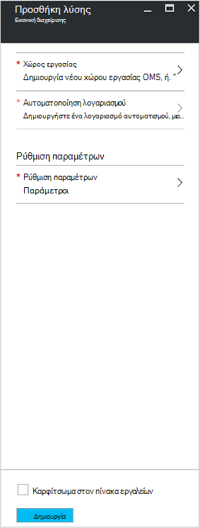
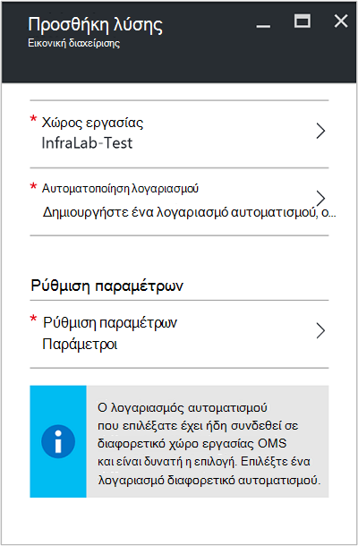
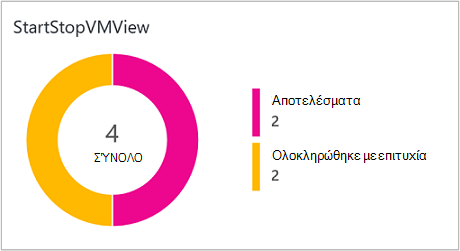
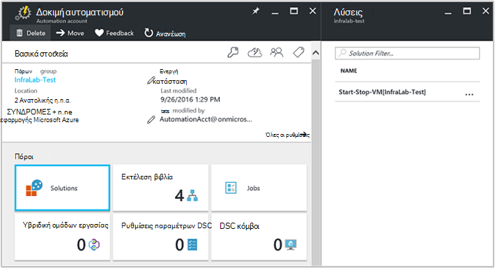
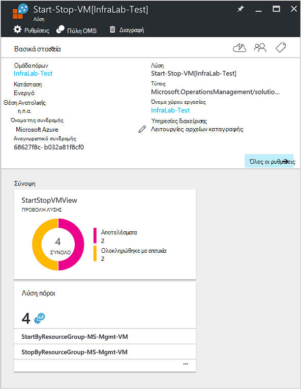

<properties
    pageTitle="Έναρξη/διακοπή ΣΠΣ κατά τη διάρκεια της λύσης μη εργάσιμες ώρες [Preview] | Microsoft Azure"
    description="Οι λύσεις διαχείρισης Εικονική ξεκινά και σταματά εικονικές μηχανές Windows σας Azure διαχείριση πόρων σε ένα χρονοδιάγραμμα και παρακολούθηση εκ των προτέρων από το αρχείο καταγραφής αναλυτικών στοιχείων."
    services="automation"
    documentationCenter=""
    authors="MGoedtel"
    manager="jwhit"
    editor=""
    />
<tags
    ms.service="automation"
    ms.workload="tbd"
    ms.tgt_pltfrm="na"
    ms.devlang="na"
    ms.topic="get-started-article"
    ms.date="10/07/2016"
    ms.author="magoedte"/>

# Έναρξη/διακοπή ΣΠΣ κατά τη διάρκεια της λύσης μη εργάσιμες ώρες [Preview] στο αυτοματισμού

Η έναρξη/διακοπή ΣΠΣ κατά τη διάρκεια της λύσης μη εργάσιμες ώρες [Preview] ξεκινά και σταματά σας εικονικές μηχανές Azure από διαχειριστή πόρων σε ένα χρονοδιάγραμμα που ορίζονται από το χρήστη και παρέχει πληροφορίες για την επιτυχία την αυτοματοποίηση εργασιών που Έναρξη και διακοπή σας εικονικές μηχανές με OMS καταγραφής ανάλυσης.  

## Προαπαιτούμενα στοιχεία

- Η runbooks εργασία με [Azure εκτελείται ως λογαριασμός](automation-sec-configure-azure-runas-account.md).  Ο λογαριασμός εκτέλεση ως είναι της μεθόδου ελέγχου ταυτότητας προτιμώμενη επειδή χρησιμοποιεί έλεγχο ταυτότητας πιστοποιητικού αντί για έναν κωδικό πρόσβασης που μπορεί να λήξει ή αλλάζουν συχνά.  

- Αυτή η λύση για να διαχειριστείτε μόνο ΣΠΣ που είναι στην ίδια συνδρομή και ομάδα πόρων ως όπου βρίσκεται ο λογαριασμός αυτοματισμού.  

- Αυτή η λύση αναπτύσσεται μόνο για τις ακόλουθες περιοχές Azure - νοτιοανατολικής Αυστραλίας, Ανατολικής η.π.α., νοτιοανατολικής Ασίας και Δυτική Ευρώπη.  Το runbooks που διαχειρίζονται το χρονοδιάγραμμα Εικονική, να στοχεύετε ΣΠΣ σε κάθε περιοχή.  

- Για να στείλετε ειδοποιήσεις ηλεκτρονικού ταχυδρομείου όταν ολοκληρωθεί η runbooks Εικονική έναρξης και τερματισμού, απαιτείται μια συνδρομή στο Office 365 επαγγελματικής κατηγορίας.  

## Στοιχεία λύσης

Αυτή η λύση αποτελείται από τους ακόλουθους πόρους που θα εισαχθεί και θα προστεθεί στο λογαριασμό σας αυτοματισμού.

### Runbooks

Runbook | Περιγραφή|
--------|------------|
CleanSolution-MS-διαχείρισης-Εικονική | Σε αυτό το runbook θα καταργήσει όλα τα περιεχόμενα πόρων και τα χρονοδιαγράμματα όταν μεταβείτε για να διαγράψετε τη λύση από τη συνδρομή σας.|  
SendMailO365-MS-διαχείρισης | Σε αυτό το runbook στέλνει ένα μήνυμα ηλεκτρονικού ταχυδρομείου μέσω του Exchange του Office 365.|
StartByResourceGroup-MS-διαχείρισης-Εικονική | Αυτό runbook προορίζεται για να ξεκινήσετε ΣΠΣ (και τα δύο κλασική και ARM βάσει ΣΠΣ) που βρίσκεται σε μια δεδομένη λίστα με τις ομάδες στις οποίες Azure πόρων.
StopByResourceGroup-MS-διαχείρισης-Εικονική | Αυτό runbook προορίζεται για να διακόψετε την ΣΠΣ (και τα δύο κλασική και ARM βάσει ΣΠΣ) που βρίσκεται σε μια δεδομένη λίστα με τις ομάδες στις οποίες Azure πόρων.|
 

### Μεταβλητές

Μεταβλητή | Περιγραφή|
---------|------------|
**SendMailO365-MS-διαχείρισης** Runbook ||
SendMailO365-IsSendEmail-MS-διαχείρισης | Καθορίζει εάν StartByResourceGroup-MS-διαχείρισης-Εικονική και runbooks StopByResourceGroup-MS-διαχείρισης-Εικονική μπορεί να στείλει ειδοποίηση μέσω ηλεκτρονικού ταχυδρομείου μετά την ολοκλήρωση.  Επιλέξτε **True** για να ενεργοποιήσετε και **False** για να απενεργοποιήσετε την ειδοποίησης ηλεκτρονικού ταχυδρομείου. Η προεπιλεγμένη τιμή είναι **False**.| 
**StartByResourceGroup-MS-διαχείρισης-Εικονική** Runbook ||
StartByResourceGroup-ExcludeList-MS-διαχείρισης-Εικονική | Πληκτρολογήστε τα ονόματα των Εικονική να εξαιρούνται από τη λειτουργία διαχείρισης. Διαχωρίστε τα ονόματα με τη χρήση semi-colon(;). Τιμές διάκριση πεζών-κεφαλαίων και υποστηρίζεται μπαλαντέρ (αστερίσκος).|
StartByResourceGroup-SendMailO365-EmailBodyPreFix-MS-διαχείρισης | Το κείμενο που μπορούν να προστεθούν στην αρχή του σώματος του μηνύματος ηλεκτρονικού ταχυδρομείου.|
StartByResourceGroup-SendMailO365-EmailRunBookAccount-MS-διαχείρισης | Καθορίζει το όνομα του λογαριασμού αυτοματισμού που περιέχει runbook ηλεκτρονικού ταχυδρομείου.  **Μην τροποποιείτε αυτήν τη μεταβλητή.**|
StartByResourceGroup-SendMailO365-EmailRunbookName-MS-διαχείρισης | Καθορίζει το όνομα του runbook ηλεκτρονικού ταχυδρομείου.  Χρησιμοποιείται από το StartByResourceGroup-MS-διαχείρισης-Εικονική και runbooks StopByResourceGroup-MS-διαχείρισης-Εικονική για να στείλετε μήνυμα ηλεκτρονικού ταχυδρομείου.  **Μην τροποποιείτε αυτήν τη μεταβλητή.**|
StartByResourceGroup-SendMailO365-EmailRunbookResourceGroup-MS-διαχείρισης | Καθορίζει το όνομα της ομάδας πόρων που περιέχει runbook ηλεκτρονικού ταχυδρομείου.  **Μην τροποποιείτε αυτήν τη μεταβλητή.**|
StartByResourceGroup-SendMailO365-EmailSubject-MS-διαχείρισης | Καθορίζει το κείμενο για τη γραμμή θέματος του μηνύματος ηλεκτρονικού ταχυδρομείου.|  
StartByResourceGroup-SendMailO365-EmailToAddress-MS-διαχείρισης | Καθορίζει τους παραλήπτες του μηνύματος ηλεκτρονικού ταχυδρομείου.  Πληκτρολογήστε ξεχωριστά ονόματα semi-colon(;).|
StartByResourceGroup-TargetResourceGroups-MS-διαχείρισης-Εικονική | Πληκτρολογήστε τα ονόματα των Εικονική να εξαιρούνται από τη λειτουργία διαχείρισης. Διαχωρίστε τα ονόματα με τη χρήση semi-colon(;). Τιμές διάκριση πεζών-κεφαλαίων και υποστηρίζεται μπαλαντέρ (αστερίσκος).  Προεπιλεγμένη τιμή (αστερίσκος) θα περιλαμβάνει όλες τις ομάδες πόρων στην συνδρομής.|
StartByResourceGroup-TargetSubscriptionID-MS-διαχείρισης-Εικονική | Καθορίζει τη συνδρομή που περιέχει ΣΠΣ να γίνεται από αυτήν τη λύση.  Πρέπει να είναι ίδια συνδρομή όπου βρίσκεται ο λογαριασμός αυτοματισμού αυτής της λύσης.|
**StopByResourceGroup-MS-διαχείρισης-Εικονική** Runbook ||
StopByResourceGroup-ExcludeList-MS-διαχείρισης-Εικονική | Πληκτρολογήστε τα ονόματα των Εικονική να εξαιρούνται από τη λειτουργία διαχείρισης. Διαχωρίστε τα ονόματα με τη χρήση semi-colon(;). Τιμές διάκριση πεζών-κεφαλαίων και υποστηρίζεται μπαλαντέρ (αστερίσκος).|
StopByResourceGroup-SendMailO365-EmailBodyPreFix-MS-διαχείρισης | Το κείμενο που μπορούν να προστεθούν στην αρχή του σώματος του μηνύματος ηλεκτρονικού ταχυδρομείου.|
StopByResourceGroup-SendMailO365-EmailRunBookAccount-MS-διαχείρισης | Καθορίζει το όνομα του λογαριασμού αυτοματισμού που περιέχει runbook ηλεκτρονικού ταχυδρομείου.  **Μην τροποποιείτε αυτήν τη μεταβλητή.**|
StopByResourceGroup-SendMailO365-EmailRunbookResourceGroup-MS-διαχείρισης | Καθορίζει το όνομα της ομάδας πόρων που περιέχει runbook ηλεκτρονικού ταχυδρομείου.  **Μην τροποποιείτε αυτήν τη μεταβλητή.**|
StopByResourceGroup-SendMailO365-EmailSubject-MS-διαχείρισης | Καθορίζει το κείμενο για τη γραμμή θέματος του μηνύματος ηλεκτρονικού ταχυδρομείου.|  
StopByResourceGroup-SendMailO365-EmailToAddress-MS-διαχείρισης | Καθορίζει τους παραλήπτες του μηνύματος ηλεκτρονικού ταχυδρομείου.  Πληκτρολογήστε ξεχωριστά ονόματα semi-colon(;).|
StopByResourceGroup-TargetResourceGroups-MS-διαχείρισης-Εικονική | Πληκτρολογήστε τα ονόματα των Εικονική να εξαιρούνται από τη λειτουργία διαχείρισης. Διαχωρίστε τα ονόματα με τη χρήση semi-colon(;). Τιμές διάκριση πεζών-κεφαλαίων και υποστηρίζεται μπαλαντέρ (αστερίσκος).  Προεπιλεγμένη τιμή (αστερίσκος) θα περιλαμβάνει όλες τις ομάδες πόρων στην συνδρομής.|
StopByResourceGroup-TargetSubscriptionID-MS-διαχείρισης-Εικονική | Καθορίζει τη συνδρομή που περιέχει ΣΠΣ να γίνεται από αυτήν τη λύση.  Πρέπει να είναι ίδια συνδρομή όπου βρίσκεται ο λογαριασμός αυτοματισμού αυτής της λύσης.|  
 

### Χρονοδιαγράμματα

Χρονοδιάγραμμα | Περιγραφή|
---------|------------|
StartByResourceGroup-χρονοδιάγραμμα-MS-διαχείρισης | Χρονοδιάγραμμα για runbook StartByResourceGroup, η οποία εκτελεί την εκκίνηση του ΣΠΣ ελέγχονται από αυτήν τη λύση.|
StopByResourceGroup-χρονοδιάγραμμα-MS-διαχείρισης | Χρονοδιάγραμμα για runbook StopByResourceGroup, που εκτελεί τον τερματισμό του ΣΠΣ ελέγχονται από αυτήν τη λύση.|

### Τα διαπιστευτήρια

Διαπιστευτήρια | Περιγραφή|
-----------|------------|
O365Credential | Καθορίζει έναν έγκυρο λογαριασμό χρήστη του Office 365 για να στείλετε μήνυμα ηλεκτρονικού ταχυδρομείου.  Απαιτείται μόνο εάν μεταβλητής SendMailO365-IsSendEmail-MS-διαχείρισης έχει οριστεί στην **τιμή True**.

## Ρύθμιση παραμέτρων

Ακολουθήστε τα παρακάτω βήματα για να προσθέσετε το ΣΠΣ Έναρξη/διακοπή κατά τη διάρκεια της λύσης μη εργάσιμες ώρες [Preview] στο λογαριασμό σας αυτοματισμού και, στη συνέχεια, ρυθμίστε τις παραμέτρους των μεταβλητών για να προσαρμόσετε τη λύση.

1. Από την οθόνη κεντρική στην πύλη του Azure, επιλέξτε το πλακίδιο **Marketplace** .  Εάν το πλακίδιο δεν είναι πλέον καρφιτσωμένα την αρχική οθόνη, από το αριστερό παράθυρο περιήγησης, επιλέξτε **Δημιουργία**.  
2. Στο το blade Marketplace, πληκτρολογήστε **Έναρξη Εικονική** στο πλαίσιο αναζήτησης και, στη συνέχεια, επιλέξτε τη λύση **ΣΠΣ Έναρξη/διακοπή μη εργάσιμες ώρες [Preview]** από τα αποτελέσματα αναζήτησης.  
3. Στο το blade **ΣΠΣ Έναρξη/διακοπή μη εργάσιμες ώρες [Preview]** για την επιλεγμένη λύση, αναθεωρήστε τις συνοπτικές πληροφορίες και, στη συνέχεια, κάντε κλικ στην επιλογή **Δημιουργία**.  
4. Η **Προσθήκη λύση** blade εμφανίζεται όπου που θα σας ζητηθεί να ρυθμίσετε τις παραμέτρους της λύσης πριν μπορείτε να το εισαγάγετε σε συνδρομή σας αυτοματισμού.     
5.  Στην την **Προσθήκη λύση** blade, επιλέξτε **χώρου εργασίας** και εδώ μπορείτε να επιλέξετε ένα χώρο εργασίας OMS που είναι συνδεδεμένο με την ίδια συνδρομή Azure που είναι ο λογαριασμός αυτοματισμού στο ή να δημιουργήσετε ένα νέο χώρο εργασίας OMS.  Εάν δεν έχετε ένα χώρο εργασίας OMS, μπορείτε να επιλέξετε **Δημιουργία νέου χώρου εργασίας** και να στη το **Χώρο εργασίας OMS** blade κάντε τα εξής: 
   - Καθορίστε ένα όνομα για το νέο **Χώρο εργασίας OMS**.
   - Επιλέξτε μια **συνδρομή** για σύνδεση με την επιλογή από την αναπτυσσόμενη λίστα, εάν η προεπιλεγμένη επιλεγμένο δεν είναι κατάλληλη.
   - Για την **Ομάδα πόρων**, μπορείτε να δημιουργήσετε μια νέα ομάδα πόρων ή να επιλέξετε μια υπάρχουσα ομάδα πόρων.  
   - Επιλέξτε μια **θέση**.  Αυτήν τη στιγμή τις μόνο θέσεις που παρέχεται για την επιλογή είναι **Νοτιοανατολικής Αυστραλίας**, **Ανατολικής η.π.α.**, **νοτιοανατολικής Ασίας**και **Δυτική Ευρώπη**.
   - Επιλέξτε ένα **επίπεδο Τιμολόγηση**.  Η λύση είναι διαθέσιμο σε δύο επίπεδα: δωρεάν και OMS εξοφληθεί επίπεδο.  Η σειρά δωρεάν έχει όριο την ποσότητα των δεδομένων που έχουν συλλεχθεί καθημερινά, η περίοδος διατήρησης και runbook εργασία χρόνου εκτέλεσης λεπτά.  Η σειρά OMS που καταβλήθηκε δεν έχει όριο στο ποσό των δεδομένων που έχουν συλλεχθεί καθημερινά.  

        > [AZURE.NOTE]
        > Ενώ το μεμονωμένου που καταβλήθηκε επίπεδο εμφανίζεται ως επιλογή, δεν ισχύει.  Εάν επιλέξετε και συνεχίσετε με τη δημιουργία αυτής της λύσης στη συνδρομή σας, θα αποτύχει.  Αυτό θα αποσταλεί όταν είναι η επίσημη έκδοσή αυτήν τη λύση. Εάν χρησιμοποιείτε αυτήν τη λύση, θα μόνο χρήση αυτοματισμού εργασία λεπτά και θα συνδεθείτε κατάποσης.  Η λύση δεν προσθέτει επιπλέον κόμβους OMS για το περιβάλλον σας.  

6. Μετά την blade **OMS χώρου εργασίας** που παρέχει τις απαιτούμενες πληροφορίες, κάντε κλικ στην επιλογή **Δημιουργία**.  Ενώ έχει επαληθευτεί τις πληροφορίες και δημιουργείται στο χώρο εργασίας, μπορείτε να παρακολουθείτε την πρόοδο του έργου στην περιοχή **ειδοποιήσεων** από το μενού.  Θα επιστρέψετε για να το **Προσθέσετε λύση** blade.  
7. Στην την **Προσθήκη λύση** blade, επιλέξτε **Αυτοματοποίηση λογαριασμού**.  Εάν θέλετε να δημιουργήσετε ένα νέο χώρο εργασίας OMS, θα σας ζητηθεί να επίσης να δημιουργήσετε ένα νέο λογαριασμό αυτοματισμού που θα συσχετιστεί με το νέο OMS χώρο εργασίας που καθορίζονται νωρίτερα, συμπεριλαμβανομένου του Azure συνδρομή, ομάδα πόρων και περιοχή.  Μπορείτε να επιλέξετε **Δημιουργία λογαριασμού αυτοματοποίηση** και στη το blade **αυτοματισμού Προσθήκη λογαριασμού** , δώστε τις ακόλουθες ενέργειες: 
  - Στο πεδίο **όνομα** , πληκτρολογήστε το όνομα του λογαριασμού αυτοματισμού.

    Όλες οι άλλες επιλογές συμπληρώνονται αυτόματα με βάση το χώρο εργασίας OMS επιλεγμένο και δεν μπορεί να τροποποιηθεί αυτές τις επιλογές.  Ένας λογαριασμός Azure εκτέλεση ως είναι η προεπιλεγμένη μέθοδος ελέγχου ταυτότητας για το runbooks που περιλαμβάνονται σε αυτήν τη λύση.  Αφού κάνετε κλικ στο κουμπί **OK**, επικυρώνονται οι επιλογές ρύθμισης παραμέτρων και δημιουργία του λογαριασμού αυτοματισμού.  Μπορείτε να παρακολουθήσετε την πρόοδο του έργου στην περιοχή **ειδοποιήσεων** από το μενού. 

    Διαφορετικά, μπορείτε να επιλέξετε έναν υπάρχοντα λογαριασμό αυτοματισμού εκτέλεση ως.  Σημείωση Οι το λογαριασμό που επιλέγετε δεν είναι ήδη να συνδέονται με μια άλλη OMS χώρο εργασίας, διαφορετικά ένα μήνυμα θα εμφανιστεί στο το blade για να σας ενημερώσει.  Εάν έχει ήδη συνδεθεί, θα πρέπει να επιλέξετε διαφορετικό λογαριασμό αυτοματισμού εκτέλεση ως ή δημιουργήστε ένα νέο.    

8. Τέλος στην την **Προσθήκη λύση** blade, επιλέξτε **Ρύθμιση παραμέτρων** και εμφανίζεται το blade **παραμέτρους** .  Στην το blade **παραμέτρους** , θα σας ζητηθεί να:  
   - Καθορίστε τα **Ονόματα ομάδα πόρων προορισμού**, που είναι ένα όνομα ομάδας πόρων που περιέχει ΣΠΣ να γίνεται από αυτήν τη λύση.  Μπορείτε να εισαγάγετε περισσότερα από ένα όνομα και να διαχωρίσετε το καθένα με ελληνικό ερωτηματικό (τιμές διάκριση πεζών-κεφαλαίων).  Χρήση χαρακτήρα μπαλαντέρ υποστηρίζεται εάν θέλετε να προορισμού ΣΠΣ σε όλες τις ομάδες πόρων στην συνδρομής.
   - Επιλέξτε ένα **Χρονοδιάγραμμα** που είναι μια επαναλαμβανόμενη ημερομηνία και ώρα για την έναρξη και διακοπή η Εικονική του στα τις ομάδες στις οποίες πόρου προορισμού.  

10. Αφού ολοκληρώσετε τη ρύθμιση των παραμέτρων τις αρχικές ρυθμίσεις που απαιτείται για τη λύση, επιλέξτε **Δημιουργία**.  Θα είναι δυνατή η επικύρωση όλες τις ρυθμίσεις και, στη συνέχεια, θα επιχειρήσει για την ανάπτυξη της λύσης στο τη συνδρομή σας.  Αυτή η διαδικασία μπορεί να διαρκέσει αρκετά δευτερόλεπτα για να ολοκληρωθεί και μπορείτε να παρακολουθείτε την πρόοδο του έργου στην περιοχή **ειδοποιήσεων** από το μενού. 

## Συχνότητα συλλογής

Αυτοματοποίηση εργασία καταγραφής εργασία ροής δεδομένων και εισάγεται στο χώρο αποθήκευσης OMS κάθε πέντε λεπτά.  

## Χρήση της λύσης

Κατά την προσθήκη της λύσης διαχείρισης Εικονική, στο χώρο εργασίας σας OMS στην **Προβολή StartStopVM** πλακίδιο θα προστεθεί στον πίνακα εργαλείων σας OMS.  Αυτό το πλακίδιο εμφανίζει ένα σύνολο και γραφική αναπαράσταση των εργασιών runbooks για τη λύση που έχετε ξεκινήσει και έχει ολοκληρωθεί με επιτυχία.     

Στο λογαριασμό σας αυτοματισμού, μπορείτε να αποκτήσετε πρόσβαση και να διαχειριστείτε τη λύση, επιλέγοντας το πλακίδιο **λύσεις** και, στη συνέχεια, από το blade **λύσεις** , επιλέγοντας τη λύση **Έναρξη-διακοπή-Εικονική [χώρου εργασίας]** από τη λίστα.     

Επιλογή της λύσης θα εμφανίσει το blade λύση **Έναρξη-διακοπή-Εικονική [χώρου εργασίας]** , όπου μπορείτε να αναθεωρήσετε σημαντικές λεπτομέρειες, όπως το πλακίδιο **StartStopVM** , όπως στο χώρο εργασίας σας OMS, που εμφανίζει ένα σύνολο και γραφική αναπαράσταση των εργασιών runbooks για τη λύση που έχετε ξεκινήσει και έχει ολοκληρωθεί με επιτυχία.     

Από εδώ μπορείτε επίσης να ανοίξετε του χώρου εργασίας σας OMS και να πραγματοποιήσετε περαιτέρω ανάλυση των τις εγγραφές της εργασίας.  Απλώς κάντε κλικ στην επιλογή **όλες οι ρυθμίσεις**, και στο το blade **Ρυθμίσεις** , επιλέξτε **Γρήγορης εκκίνησης** και, στη συνέχεια, στη το blade **Γρήγορης εκκίνησης** , επιλέξτε **OMS πύλη**.   Θα ανοίξει μια νέα καρτέλα ή νέα περίοδο λειτουργίας περιήγησης και παρουσίαση του χώρου εργασίας σας OMS που σχετίζεται με το λογαριασμό αυτοματισμού και τη συνδρομή.  

### Ρύθμιση παραμέτρων ειδοποιήσεων ηλεκτρονικού ταχυδρομείου

Για να ενεργοποιήσετε ειδοποιήσεις ηλεκτρονικού ταχυδρομείου όταν το έναρξης και τερματισμού Εικονική runbooks ολοκληρωθεί, θα πρέπει να τροποποιήσετε το **O365Credential** διαπιστευτηρίων και τουλάχιστον, οι παρακάτω μεταβλητές:

 - SendMailO365-IsSendEmail-MS-διαχείρισης
 - StartByResourceGroup-SendMailO365-EmailToAddress-MS-διαχείρισης
 - StopByResourceGroup-SendMailO365-EmailToAddress-MS-διαχείρισης

Για να ρυθμίσετε τις παραμέτρους των διαπιστευτηρίων **O365Credential** , εκτελέστε τα ακόλουθα βήματα:

1. Από το λογαριασμό σας αυτοματισμού, κάντε κλικ στην επιλογή **Όλες οι ρυθμίσεις** στο επάνω μέρος του παραθύρου. 
2. Στην το blade **Ρυθμίσεις** κάτω από την ενότητα **Πόρους αυτοματισμού**, επιλέξτε **στοιχεία**. 
3. Στην το blade **περιουσιακών στοιχείων** , επιλέξτε το πλακίδιο **διαπιστευτηρίων** και από το blade **διαπιστευτηρίων** , επιλέξτε το **O365Credential**.  
4. Πληκτρολογήστε ένα έγκυρο όνομα χρήστη του Office 365 και τον κωδικό πρόσβασης και, στη συνέχεια, κάντε κλικ στο κουμπί **Αποθήκευση** για να αποθηκεύσετε τις αλλαγές σας.  

Για να ρυθμίσετε τις μεταβλητές επισημασμένο νωρίτερα, ακολουθήστε τα παρακάτω βήματα:

1. Από το λογαριασμό σας αυτοματισμού, κάντε κλικ στην επιλογή **Όλες οι ρυθμίσεις** στο επάνω μέρος του παραθύρου. 
2. Στην το blade **Ρυθμίσεις** κάτω από την ενότητα **Πόρους αυτοματισμού**, επιλέξτε **στοιχεία**. 
3. Στην το blade **περιουσιακών στοιχείων** , επιλέξτε το πλακίδιο **μεταβλητές** και από το blade **μεταβλητές** , επιλέξτε τη μεταβλητή που αναφέρονται παραπάνω και, στη συνέχεια, τροποποιήστε την παρακάτω τιμή περιγραφής για αυτό που καθορίζεται στην ενότητα [μεταβλητή](##variables) νωρίτερα.  
4. Κάντε κλικ στο κουμπί **Αποθήκευση** για να αποθηκεύσετε τις αλλαγές στη μεταβλητή.   

### Τροποποίηση του χρονοδιαγράμματος εκκίνησης και τερματισμού

Διαχείριση του χρονοδιαγράμματος εκκίνησης και τερματισμού σε αυτήν τη λύση ακολουθεί τα ίδια βήματα όπως περιγράφεται στον [προγραμματισμό μιας runbook στο Azure αυτοματισμού](automation-scheduling-a-runbook.md).  Να θυμάστε ότι δεν μπορείτε να τροποποιήσετε τις ρυθμίσεις παραμέτρων χρονοδιαγράμματος.  Θα πρέπει να απενεργοποιήσετε το υπάρχον χρονοδιάγραμμα και, στη συνέχεια, δημιουργήστε ένα νέο και, στη συνέχεια, συνδεθείτε στο **StartByResourceGroup-MS-διαχείρισης-Εικονική** ή runbook **StopByResourceGroup-MS-διαχείρισης-Εικονική** που θέλετε στο χρονοδιάγραμμα για να εφαρμόσετε.   

## Ανάλυση εγγραφών του αρχείου καταγραφής

Αυτοματοποίηση δημιουργεί δύο τύποι εγγραφών στο αποθετήριο OMS.

### Αρχεία καταγραφής από την εργασία

Ιδιότητα | Περιγραφή|
----------|----------|
Καλούντος |  Ποιος ξεκίνησε τη λειτουργία.  Πιθανές τιμές είναι μια διεύθυνση ηλεκτρονικού ταχυδρομείου ή το σύστημα για προγραμματισμένες εργασίες.|
Κατηγορία | Ταξινόμηση τον τύπο των δεδομένων.  Για την αυτοματοποίηση, η τιμή είναι JobLogs.|
CorrelationId | GUID που είναι το αναγνωριστικό συσχέτισης του runbook έργου.|
JobId | GUID που είναι το αναγνωριστικό του runbook έργου.|
operationName | Καθορίζει τον τύπο της λειτουργίας που εκτελούνται στο Azure.  Για την αυτοματοποίηση, η τιμή θα εργασία.|
resourceId | Καθορίζει τον τύπο πόρου στο Azure.  Για την αυτοματοποίηση, η τιμή είναι ο λογαριασμός αυτοματισμού που σχετίζονται με runbook.|
Ομάδα πόρων | Καθορίζει το όνομα της ομάδας πόρων του runbook έργου.|
ResourceProvider | Καθορίζει την υπηρεσία Azure που παρέχει στους πόρους που μπορείτε να αναπτύξετε και να διαχειριστείτε.  Για την αυτοματοποίηση, η τιμή είναι Azure αυτοματισμού.|
Τύπου πόρου | Καθορίζει τον τύπο πόρου στο Azure.  Για την αυτοματοποίηση, η τιμή είναι ο λογαριασμός αυτοματισμού που σχετίζονται με runbook.|
resultType | Η κατάσταση της εργασίας runbook.  Πιθανές τιμές είναι: -Αποτελέσματα -Stopped -Σε αναστολή -Απέτυχε -Ολοκληρώθηκε με επιτυχία|
resultDescription | Περιγράφει την κατάσταση runbook εργασία αποτέλεσμα.  Πιθανές τιμές είναι: -Έναρξη εργασίας -Απέτυχε η εργασία -Η εργασία ολοκληρώθηκε|
RunbookName | Καθορίζει το όνομα του runbook.|
SourceSystem | Καθορίζει το σύστημα προέλευσης για τα δεδομένα που υποβάλλεται.  Αυτοματοποίηση, θα έχει την τιμή: OpsManager|
StreamType | Καθορίζει τον τύπο του συμβάντος. Πιθανές τιμές είναι: -Λεπτομερής -Αποτέλεσμα -Σφάλμα -Προειδοποίηση|
SubscriptionId | Καθορίζει το Αναγνωριστικό συνδρομής του έργου.
Ώρα | Ημερομηνία και ώρα κατά την εργασία runbook εκτελείται.|

### Ροές εργασίας

Ιδιότητα | Περιγραφή|
----------|----------|
Καλούντος |  Ποιος ξεκίνησε τη λειτουργία.  Πιθανές τιμές είναι μια διεύθυνση ηλεκτρονικού ταχυδρομείου ή το σύστημα για προγραμματισμένες εργασίες.|
Κατηγορία | Ταξινόμηση τον τύπο των δεδομένων.  Για την αυτοματοποίηση, η τιμή είναι JobStreams.|
JobId | GUID που είναι το αναγνωριστικό του runbook έργου.|
operationName | Καθορίζει τον τύπο της λειτουργίας που εκτελούνται στο Azure.  Για την αυτοματοποίηση, η τιμή θα εργασία.|
Ομάδα πόρων | Καθορίζει το όνομα της ομάδας πόρων του runbook έργου.|
resourceId | Καθορίζει το αναγνωριστικό πόρου στο Azure.  Για την αυτοματοποίηση, η τιμή είναι ο λογαριασμός αυτοματισμού που σχετίζονται με runbook.|
ResourceProvider | Καθορίζει την υπηρεσία Azure που παρέχει στους πόρους που μπορείτε να αναπτύξετε και να διαχειριστείτε.  Για την αυτοματοποίηση, η τιμή είναι Azure αυτοματισμού.|
Τύπου πόρου | Καθορίζει τον τύπο πόρου στο Azure.  Για την αυτοματοποίηση, η τιμή είναι ο λογαριασμός αυτοματισμού που σχετίζονται με runbook.|
resultType | Το αποτέλεσμα της εργασίας runbook την ώρα που δημιουργήθηκε το συμβάν.  Πιθανές τιμές είναι: -Σε εξέλιξη|
resultDescription | Περιλαμβάνει στη ροή εξόδου από runbook.|
RunbookName | Το όνομα του runbook.|
SourceSystem | Καθορίζει το σύστημα προέλευσης για τα δεδομένα που υποβάλλεται.  Για την αυτοματοποίηση, η τιμή θα είναι OpsManager|
StreamType | Ο τύπος της ροής εργασίας. Πιθανές τιμές είναι: -Προόδου -Αποτέλεσμα -Προειδοποίηση -Σφάλμα -Ο εντοπισμός σφαλμάτων -Λεπτομερής|
Ώρα | Ημερομηνία και ώρα κατά την εργασία runbook εκτελείται.|

Όταν εκτελείτε οποιαδήποτε αναζήτησης στο αρχείο καταγραφής που επιστρέφει τις εγγραφές της κατηγορίας **JobLogs** ή **JobStreams**, μπορείτε να επιλέξετε την προβολή **JobLogs** ή **JobStreams** , η οποία εμφανίζει ένα σύνολο των πλακιδίων συνοψίζει τις ενημερώσεις που επιστρέφονται από την αναζήτηση.

## Δείγμα αρχείου καταγραφής αναζητήσεις

Ο παρακάτω πίνακας παρέχει δείγμα αρχείου καταγραφής αναζητά εγγραφές έργου που συλλέγονται από αυτήν τη λύση. 

Ερώτημα | Περιγραφή|
----------|----------|
Βρείτε εργασίες για runbook StartVM που έχει ολοκληρωθεί με επιτυχία | Κατηγορία = JobLogs RunbookName_s = "StartByResourceGroup-MS-διαχείρισης-Εικονική" ResultType = ολοκληρώθηκε με επιτυχία & #124- μέτρηση count() με JobId_g|
Βρείτε εργασίες για runbook StopVM που έχει ολοκληρωθεί με επιτυχία | Κατηγορία = JobLogs RunbookName_s = "StartByResourceGroup-MS-διαχείρισης-Εικονική" ResultType = απέτυχε & #124- μέτρηση count() με JobId_g
Εμφάνιση κατάστασης εργασίας μέσα στο χρόνο για StartVM και StopVM runbooks | Κατηγορία = JobLogs RunbookName_s = NOT(ResultType="started") "StartByResourceGroup-MS-διαχείρισης-Εικονική" ή "StopByResourceGroup-MS-διαχείρισης-Εικονική" | Μετρήστε Count() από ResultType διάστημα 1 ημέρα|

## Επόμενα βήματα

- Για να μάθετε περισσότερα σχετικά με το πώς μπορείτε να δημιουργήσετε ερωτήματα αναζήτησης διαφορετικές και εξετάστε τα αρχεία καταγραφής εργασία αυτοματισμού με ανάλυση καταγραφής, ανατρέξτε στο θέμα [αρχείο καταγραφής αναζητήσεις στο αρχείο καταγραφής ανάλυσης](../log-analytics/log-analytics-log-searches.md)
- Για να μάθετε περισσότερα σχετικά με την εκτέλεση runbook, τρόπος για την παρακολούθηση της runbook έργα και άλλες τεχνικές λεπτομέρειες, ανατρέξτε στο θέμα [Παρακολούθηση μιας εργασίας runbook](automation-runbook-execution.md)
- Για να μάθετε περισσότερα σχετικά με την ανάλυση καταγραφής OMS και προελεύσεις συλλογής δεδομένων, ανατρέξτε στο θέμα [τη συλλογή Azure χώρου αποθήκευσης δεδομένων στην Επισκόπηση ανάλυσης αρχείου καταγραφής](../log-analytics/log-analytics-azure-storage.md)

   

