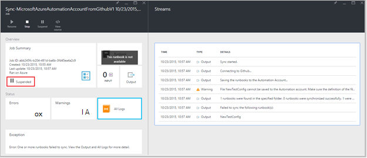

<properties 
    pageTitle=" Προέλευση στοιχείου ελέγχου ενοποίηση του Azure αυτοματισμού | Microsoft Azure"
    description="Σε αυτό το άρθρο περιγράφει Προέλευση στοιχείου ελέγχου ενοποίηση με το GitHub στο Azure αυτοματισμού."
    services="automation"
    documentationCenter=""
    authors="mgoedtel"
    manager="jwhit"
    editor="tysonn" />    
<tags 
    ms.service="automation"
    ms.devlang="na"
    ms.topic="article"
    ms.tgt_pltfrm="na"
    ms.workload="infrastructure-services"
    ms.date="09/12/2016"
    ms.author="magoedte;sngun" />

# Ενσωμάτωση του ελέγχου προέλευσης σε αυτοματισμού Azure

Ενσωμάτωση του ελέγχου προέλευσης σάς επιτρέπει να συσχετίσετε runbooks στο λογαριασμό σας αυτοματισμού σε ένα αποθετήριο δεδομένων GitHub Προέλευση στοιχείου ελέγχου. Στοιχείο ελέγχου προέλευσης σάς επιτρέπει να εύκολη συνεργασία με την ομάδα σας, παρακολούθηση αλλαγών και επαναφέρετε προηγούμενες εκδόσεις του runbooks σας. Για παράδειγμα, Προέλευση στοιχείου ελέγχου σάς επιτρέπει να συγχρονίσετε διαφορετικό διακλαδώσεις στο στοιχείο ελέγχου προέλευσης σε ανάπτυξη, έλεγχος ή παραγωγής αυτοματισμού λογαριασμούς, διευκολύνοντας την προώθηση κώδικα που έχει ελεγχθεί στο περιβάλλον ανάπτυξής σας για να σας παραγωγής αυτοματισμού λογαριασμό.

Στοιχείο ελέγχου προέλευσης σάς επιτρέπει να push κώδικα από το Azure αυτοματισμού στο στοιχείο ελέγχου πηγαίου ή να αποσπάσετε σας runbooks από το στοιχείο ελέγχου πηγαίου Azure αυτοματισμού. Σε αυτό το άρθρο περιγράφει πώς μπορείτε να ρυθμίσετε το στοιχείο ελέγχου προέλευσης στο περιβάλλον του Azure αυτοματισμού. Θα ξεκινήσουμε, ρυθμίζοντας τις παραμέτρους αυτοματισμού Azure πρόσβασης του αποθετηρίου GitHub και θα καθοδηγήσουν διαφορετικές λειτουργίες που μπορούν να γίνουν με ενσωμάτωση του ελέγχου προέλευσης. 

>[AZURE.NOTE]Στοιχείο ελέγχου προέλευσης υποστηρίζει έλξη και Ώθηση [runbooks PowerShell ροής εργασίας](automation-runbook-types.md#powershell-workflow-runbooks) , καθώς και [PowerShell runbooks](automation-runbook-types.md#powershell-runbooks). [Γραφική runbooks](automation-runbook-types.md#graphical-runbooks) δεν υποστηρίζονται ακόμη.  

Υπάρχουν δύο απλά βήματα που απαιτούνται για τη ρύθμιση παραμέτρων ελέγχου προέλευσης για το λογαριασμό σας αυτοματισμού και μία μόνο εάν έχετε ήδη ένα λογαριασμό GitHub. Είναι οι εξής:
## Βήμα 1-Δημιουργήστε ένα αποθετήριο GitHub

Εάν έχετε ήδη ένα λογαριασμό GitHub και ένα αποθετήριο δεδομένων που θέλετε να συνδέσετε με Azure αυτοματισμού, στη συνέχεια, συνδεθείτε σε υπάρχοντα λογαριασμό και ξεκινήστε από το βήμα 2 παρακάτω. Διαφορετικά, μεταβείτε [GitHub](https://github.com/), εισόδου προς τα επάνω για ένα νέο λογαριασμό και να [δημιουργήσετε ένα νέο αρχείο φύλαξης](https://help.github.com/articles/create-a-repo/).

## Βήμα 2: ρύθμιση του στοιχείου ελέγχου προέλευσης σε αυτοματισμού Azure

1. Από το λογαριασμό αυτοματισμού blade στην πύλη του Azure, κάντε κλικ στην επιλογή **Ορισμός ελέγχου προέλευσης.** 
 
    

2. Ανοίγει το **Στοιχείο ελέγχου πηγαίου** blade, όπου μπορείτε να ρυθμίσετε τις λεπτομέρειες του λογαριασμού σας GitHub. Ακολουθεί η λίστα των παραμέτρων για τη ρύθμιση παραμέτρων:  

  	|**Παράμετρος**            |**Περιγραφή** |
  	|:---|:---| 
  	|Επιλέξτε αρχείο προέλευσης   | Επιλέξτε την προέλευση. Προς το παρόν, υποστηρίζεται μόνο **GitHub** . |
  	|Εξουσιοδότηση | Κάντε κλικ στο κουμπί **εξουσιοδότηση** για να εκχωρήσετε πρόσβαση αυτοματισμού Azure για το αποθετήριο GitHub. Εάν είστε ήδη συνδεδεμένοι λογαριασμό GitHub σε ένα διαφορετικό παράθυρο, τότε χρησιμοποιούνται τα διαπιστευτήρια αυτού του λογαριασμού. Μόλις εξουσιοδότησης είναι επιτυχής, το blade θα εμφανιστεί το όνομα χρήστη GitHub στην περιοχή **Ιδιότητα εξουσιοδότησης**. |
  	|Επιλέξτε αποθετήριο δεδομένων | Επιλέξτε ένα αποθετήριο GitHub από τη λίστα διαθέσιμες αποθετήρια. |
  	|Επιλέξτε κλάδο | Επιλέξτε έναν κλάδο από τη λίστα διαθέσιμες διακλαδώσεις. Μόνο τον **κύριο** κλάδο εμφανίζεται αν δεν έχετε δημιουργήσει οποιαδήποτε διακλαδώσεις. |
  	|Η διαδρομή του φακέλου Runbook | Η διαδρομή του φακέλου runbook Καθορίζει τη διαδρομή στο αποθετήριο GitHub από την οποία θέλετε να push ή να αποσπάσετε τον κωδικό. Αυτό πρέπει να εισάγονται στη τη μορφή **/foldername/subfoldername**. Μόνο runbooks στη διαδρομή φακέλου runbook θα συγχρονίζονται στο λογαριασμό σας αυτοματισμού. Runbooks των υποφακέλων της runbook φάκελο διαδρομή θα **δεν** είναι δυνατός ο συγχρονισμός. Χρήση **/** για να συγχρονίσετε όλα τα runbooks κάτω από το χώρο αποθήκευσης. |

3. Για παράδειγμα, εάν έχετε ένα αποθετήριο δεδομένων με το όνομα **PowerShellScripts** που περιέχει ένα φάκελο που ονομάζεται **RootFolder**, που περιέχει ένα φάκελο με το όνομα **υποφάκελο**. Μπορείτε να χρησιμοποιήσετε τις ακόλουθες συμβολοσειρές για να συγχρονίσετε κάθε επίπεδο φακέλου:

    1. Για να συγχρονίσετε runbooks από **χώρο αποθήκευσης**, είναι η διαδρομή του φακέλου runbook*/*
    2. Για να συγχρονίσετε runbooks από **RootFolder**, η διαδρομή του φακέλου runbook είναι */RootFolder*
    3. Για να συγχρονίσετε runbooks από **υποφάκελο**, η διαδρομή του φακέλου runbook είναι */RootFolder/SubFolder*.
  

4. Αφού ρυθμίσετε τις παραμέτρους, εμφανίζονται σε το **Ορισμός ελέγχου προέλευσης blade.**  
 
    

5. Αφού κάνετε κλικ στο κουμπί OK, ενσωμάτωση του ελέγχου προέλευσης είναι τώρα ρυθμισμένο για το λογαριασμό σας αυτοματισμού και πρέπει να ενημερώνονται με τις πληροφορίες σας GitHub. Τώρα, μπορείτε να κάνετε κλικ σε αυτό το τμήμα για να προβάλετε όλες τις ιστορικού εργασίας προέλευσης στοιχείου ελέγχου συγχρονισμού.  

    

6. Μετά τη ρύθμιση του στοιχείου ελέγχου προέλευσης, στους παρακάτω πόρους αυτοματισμού θα δημιουργηθούν στο λογαριασμό σας αυτοματοποίησης:  
 Δημιουργούνται δύο [μεταβλητών περιουσιακών στοιχείων](automation-variables.md) .  
      
    * Η μεταβλητή **Microsoft.Azure.Automation.SourceControl.Connection** περιέχει τις τιμές από τη συμβολοσειρά σύνδεσης, όπως φαίνεται παρακάτω.  

  	|**Παράμετρος**            |**Τιμή** |
  	|:---|:---|
  	| Όνομα  | Microsoft.Azure.Automation.SourceControl.Connection |
  	| Τύπος | Συμβολοσειρά |
  	| Τιμή  | {"Κλάδο":\<*ονόματος κλάδο*>, "RunbookFolderPath":\<*Runbook η διαδρομή του φακέλου*>, "ProviderType":\<*έχει την τιμή 1 για GitHub*>, "Αποθετήριο δεδομένων":\<*όνομα του αποθετηρίου*>, "Όνομα χρήστη":\<*όνομα χρήστη σας GitHub*>} |   

    * Μεταβλητής **Microsoft.Azure.Automation.SourceControl.OAuthToken**, περιέχει την ασφαλή κρυπτογραφημένη τιμή του OAuthToken σας.  

  	|**Παράμετρος**            |**Τιμή** |
  	|:---|:---|
  	| Όνομα  | Microsoft.Azure.Automation.SourceControl.OAuthToken |
  	| Τύπος | Unknown(Encrypted) |
  	| Τιμή | <*Κρυπτογραφημένο OAuthToken*> |  

      

    * **Στοιχείο ελέγχου πηγαίου αυτοματισμού** προστίθεται ως εξουσιοδοτημένοι εφαρμογή στο λογαριασμό σας GitHub. Για να προβάλετε την εφαρμογή: από την αρχική σελίδα GitHub, μεταβείτε στο σας **προφίλ** > **Ρυθμίσεις** > **εφαρμογών**. Αυτή η εφαρμογή επιτρέπει αυτοματοποίησης Azure για να συγχρονίσετε το αποθετήριο GitHub με ένα λογαριασμό αυτοματισμού.  

    

## Χρήση στοιχείων ελέγχου προέλευσης αυτοματισμού

### Μεταβίβαση ελέγχου ενός runbook από το Azure αυτοματισμού σε στοιχείο ελέγχου προέλευσης

Runbook μεταβίβασης ελέγχου σάς επιτρέπει να δημοσιοποιήσετε τις αλλαγές που κάνετε σε μια runbook στο Azure αυτοματισμού στο αρχείο φύλαξης του ελέγχου προέλευσης. Ακολουθούν τα βήματα για τη μεταβίβαση ελέγχου ενός runbook:

1. Από σας λογαριασμό αυτοματισμού, [Δημιουργήστε μια νέα runbook που περιέχουν κείμενο](automation-first-runbook-textual.md)ή να [επεξεργαστείτε μια υπάρχουσα, που περιέχουν κείμενο runbook](automation-edit-textual-runbook.md). Σε αυτό το runbook μπορεί να είναι μια ροή εργασίας του PowerShell ή μια runbook δέσμης ενεργειών του PowerShell.  

2. Αφού επεξεργαστείτε runbook σας, αποθηκεύστε το και κάντε κλικ στην επιλογή **μεταβίβαση ελέγχου** από την **Επεξεργασία** blade.  

    

     >[AZURE.NOTE] Μεταβίβαση ελέγχου από το Azure αυτοματισμού θα αντικαταστήσει τον κώδικα που υπάρχει αυτήν τη στιγμή στο στοιχείο ελέγχου προέλευσης. Την οδηγία Git ισοδύναμη της γραμμής εντολών για να μεταβίβασης ελέγχου είναι **Προσθήκη git + ολοκλήρωση git + git push**  

3. Όταν κάνετε κλικ στην επιλογή **μεταβίβαση ελέγχου**, θα σας ζητηθεί με ένα μήνυμα επιβεβαίωσης, κάντε κλικ στο κουμπί Ναι για να συνεχίσετε.  

    

4. Μεταβίβαση ελέγχου ξεκινά runbook Προέλευση στοιχείου ελέγχου: **MicrosoftAzureAutomationAccountToGitHubV1 συγχρονισμού**. Σε αυτό το runbook συνδέεται με GitHub και προωθεί τις αλλαγές από το Azure αυτοματισμού χώρου αποθήκευσης στο. Για να προβάλετε το ιστορικό μεταβίβασης ελέγχου έργου, επιστρέψτε στην καρτέλα **Ενσωμάτωση του ελέγχου προέλευσης** και κάντε κλικ στην επιλογή για να ανοίξετε το blade αποθετήριο συγχρονισμού. Αυτό blade εμφανίζει όλες τις εργασίες Προέλευση στοιχείου ελέγχου.  Επιλέξτε την εργασία που θέλετε να προβάλετε και κάντε κλικ στην επιλογή για να προβάλετε τις λεπτομέρειες.  

    

    >[AZURE.NOTE] Προέλευση στοιχείου ελέγχου runbooks είναι ειδική runbooks αυτοματισμού που δεν μπορείτε να προβάλετε ή να επεξεργαστείτε. Ενώ θα δεν εμφανίζονται στη λίστα των runbook σας, θα δείτε τις εργασίες συγχρονισμού εμφανίζεται στη λίστα των εργασιών σας.
 
5. Το όνομα του runbook έχουν τροποποιηθεί αποστέλλεται ως παράμετρος εισόδου runbook μεταβίβασης ελέγχου. Μπορείτε να [προβάλετε τις λεπτομέρειες της εργασίας](automation-runbook-execution.md#viewing-job-status-using-the-azure-management-portal) , επεκτείνοντας runbook στο **Αποθετήριο δεδομένων συγχρονισμού** blade.  

    

6. Ανανέωση του αποθετηρίου GitHub μόλις ολοκληρωθεί η εργασία για να δείτε τις αλλαγές.  Πρέπει να είναι μια ολοκλήρωση στο αποθετήριο σας με ένα μήνυμα ολοκλήρωσης: *Όνομα Runbook *ενημερωμένα ** στο Azure Automation.* *  

### Συγχρονισμός runbooks από το στοιχείο ελέγχου πηγαίου αυτοματισμού Azure 

Το κουμπί συγχρονισμού στην το blade συγχρονισμού αποθετήριο δεδομένων σάς επιτρέπει να έλκει όλα τα runbooks τη διαδρομή του φακέλου runbook του αποθετηρίου σας στο λογαριασμό σας αυτοματισμού. Στο ίδιο αποθετήριο μπορεί να συγχρονιστεί με περισσότερους από έναν λογαριασμούς αυτοματισμού. Ακολουθούν τα βήματα για να συγχρονίσετε μια runbook:

1. Από το λογαριασμό αυτοματισμού όπου μπορείτε ρύθμιση του στοιχείου ελέγχου προέλευσης, ανοίξτε την **Προέλευση στοιχείου ελέγχου ενοποίησης/αποθετήριο συγχρονισμού blade** και κάντε κλικ στην επιλογή " **Συγχρονισμός** ", στη συνέχεια, θα σας ζητηθεί με ένα μήνυμα επιβεβαίωσης, κάντε κλικ στο κουμπί **Ναι** για να συνεχίσετε.  

    

2. Ξεκινά ο συγχρονισμός runbook: **MicrosoftAzureAutomationAccountFromGitHubV1 συγχρονισμού**. Σε αυτό το runbook συνδέεται με GitHub και συγκεντρώνει τις αλλαγές από το αρχείο φύλαξης Azure αυτοματισμού. Θα πρέπει να βλέπετε μια νέα εργασία σε το blade **Συγχρονισμού αποθετήριο δεδομένων** για αυτήν την ενέργεια. Για να προβάλετε λεπτομέρειες σχετικά με την εργασία συγχρονισμού, κάντε κλικ στην επιλογή για να ανοίξετε το blade λεπτομέρειες έργου.  
 
    

 
    >[AZURE.NOTE] Μια Συγχρονισμός από προέλευση στοιχείου ελέγχου αντικαθιστά την πρόχειρη έκδοση του runbooks που υπάρχουν αυτήν τη στιγμή στο λογαριασμό σας αυτοματισμού για **όλα** τα runbooks που είναι αυτήν τη στιγμή στο στοιχείο ελέγχου προέλευσης. Η εντολή Git ισοδύναμη της γραμμής εντολών για να συγχρονίσετε είναι **ελκυστική git**

## Αντιμετώπιση προβλημάτων του στοιχείου ελέγχου προέλευσης

Εάν υπάρχουν τυχόν λάθη με μια εργασία μεταβίβασης ελέγχου ή συγχρονισμού, θα πρέπει να ανασταλεί την κατάσταση της εργασίας και μπορείτε να δείτε περισσότερες λεπτομέρειες σχετικά με το σφάλμα στο blade την εργασία.  Το τμήμα **Όλα τα αρχεία καταγραφής** θα σας δείξουν όλων των ροών PowerShell που σχετίζεται με την εργασία. Αυτό θα σας δώσει με τις λεπτομέρειες που χρειάζεται, για να σας βοηθήσει να διορθώσετε προβλήματα με τη μεταβίβαση ελέγχου ή συγχρονισμού. Αυτό θα εμφανιστούν και την ακολουθία των ενεργειών που προέκυψαν κατά το συγχρονισμό ή τον έλεγχο σε μια runbook.  

## Η αποσύνδεση Προέλευση στοιχείου ελέγχου

Για να αποσυνδεθείτε από το λογαριασμό σας GitHub, ανοίξτε το blade αποθετήριο συγχρονισμού και κάντε κλικ στην επιλογή **Αποσύνδεση**. Αφού αποσυνδέσετε ελέγχου προέλευσης, runbooks που έχουν συγχρονιστεί προηγουμένως θα παραμείνει στο λογαριασμό σας αυτοματισμού, αλλά δεν θα είναι ενεργοποιημένη η blade αποθετήριο συγχρονισμού.  

  

## Επόμενα βήματα

Για περισσότερες πληροφορίες σχετικά με την ενσωμάτωση του ελέγχου προέλευσης, ανατρέξτε στους ακόλουθους πόρους:  
- [Azure αυτοματοποίησης: Ενσωμάτωση του ελέγχου προέλευσης στο Azure αυτοματισμού](https://azure.microsoft.com/blog/azure-automation-source-control-13/)  
- [Ψηφοφορία για το σύστημά σας αγαπημένη προέλευση στοιχείου ελέγχου](https://www.surveymonkey.com/r/?sm=2dVjdcrCPFdT0dFFI8nUdQ%3d%3d)  
- [Azure αυτοματοποίησης: Ενοποίηση Runbook προέλευσης στοιχείου ελέγχου με χρήση του Visual Studio Team Services](https://azure.microsoft.com/blog/azure-automation-integrating-runbook-source-control-using-visual-studio-online/)  
