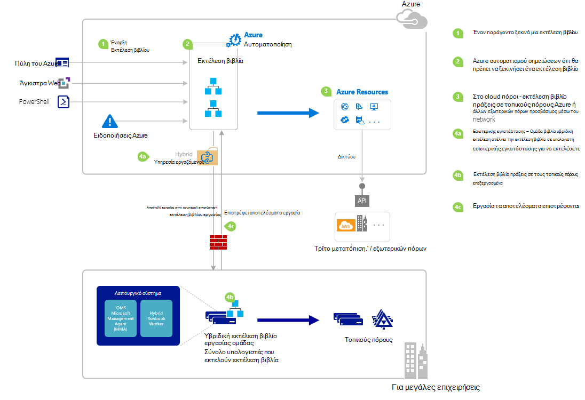

<properties
   pageTitle="Εκκίνηση μιας runbook στο Azure αυτοματισμού | Microsoft Azure"
   description="Συνοψίζει τις διάφορες μεθόδους που μπορεί να χρησιμοποιηθεί για να ξεκινήσετε μια runbook σε αυτοματισμού Azure και παρέχει λεπτομέρειες σχετικά με τη χρήση του Azure πύλη και το Windows PowerShell."
   services="automation"
   documentationCenter=""
   authors="mgoedtel"
   manager="jwhit"
   editor="tysonn" />
<tags
   ms.service="automation"
   ms.devlang="na"
   ms.topic="article"
   ms.tgt_pltfrm="na"
   ms.workload="infrastructure-services"
   ms.date="10/08/2016"
   ms.author="magoedte;bwren"/>

# <a name="starting-a-runbook-in-azure-automation"></a>Έναρξη μιας runbook σε αυτοματισμού Azure

Ο παρακάτω πίνακας θα σας βοηθήσει να καθορίσετε τη μέθοδο για να ξεκινήσετε μια runbook σε αυτοματισμού Azure που είναι πιο κατάλληλη στη δική σας περίπτωση. Σε αυτό το άρθρο περιλαμβάνει λεπτομέρειες σχετικά με την εκκίνηση ενός runbook με την πύλη του Azure και με το Windows PowerShell. Λεπτομέρειες σχετικά με τις άλλες μεθόδους παρέχονται σε άλλη τεκμηρίωση που μπορείτε να έχετε πρόσβαση από τις παρακάτω συνδέσεις.

| **ΜΈΘΟΔΟΣ**                                                                    | **ΧΑΡΑΚΤΗΡΙΣΤΙΚΆ**                                                                                                                                                                                                                                                                                                                                                |
|-------------------------------------------------------------------------------|--------------------------------------------------------------------------------------------------------------------------------------------------------------------------------------------------------------------------------------------------------------------------------------------------------------------------------------------------------------------|
| [Πύλη του Azure](#starting-a-runbook-with-the-azure-portal)                     | <li>Η μέθοδος με το περιβάλλον εργασίας χρήστη αλληλεπιδραστικών απλούστερος.<br> <li>Φόρμα για την παροχή τιμές παραμέτρων απλό.<br> <li>Παρακολουθείτε εύκολα κατάσταση εργασίας.<br> <li>Πρόσβαση με έλεγχο ταυτότητας με Azure σύνδεσης.                                                                                                                                                                               |
| [Windows PowerShell](https://msdn.microsoft.com/library/dn690259.aspx)        | <li>Η κλήση από τη γραμμή εντολών με το cmdlet του Windows PowerShell.<br> <li>Μπορεί να συμπεριληφθεί σε αυτοματοποιημένη λύση με πολλά βήματα.<br> <li>Αίτηση έχει γίνει έλεγχος ταυτότητας με το πιστοποιητικό ή χρήστης OAuth κεφαλαίου / υπηρεσίας κεφαλαίου.<br> <li>Δώστε τιμές παραμέτρων απλά και σύνθετα.<br> <li>Παρακολούθηση κατάσταση εργασίας.<br> <li>Πρόγραμμα-πελάτης που απαιτείται για την υποστήριξη των cmdlet του PowerShell. |
| [API Azure αυτοματισμού](https://msdn.microsoft.com/library/azure/mt662285.aspx) | <li>Πιο ευέλικτη μέθοδος αλλά επίσης οι περισσότερες μιγαδικών.<br> <li>Κλήση από το προσαρμοσμένο κώδικα που μπορούν να κάνουν οι αιτήσεις HTTP.<br> <li>Αίτηση με έλεγχο ταυτότητας με το πιστοποιητικό ή χρήστης Oauth κεφαλαίου / υπηρεσίας κεφαλαίου.<br> <li>Δώστε τιμές παραμέτρων απλά και σύνθετα.<br> <li>Παρακολούθηση κατάσταση εργασίας.                                                                          |
| [Webhooks](automation-webhooks.md)                                            | <li>Έναρξη runbook από μία αίτηση HTTP.<br> <li>Ο έλεγχος ταυτότητας με κωδικό ασφαλείας στο πλαίσιο διεύθυνση URL.<br> <li>Πρόγραμμα-πελάτης δεν είναι δυνατό να παρακάμπτουν τιμές παραμέτρων που καθορίσατε κατά τη δημιουργία webhook. Runbook να ορίσετε μία παράμετρο που συμπληρώνεται με τις λεπτομέρειες αίτηση HTTP.<br> <li>Δεν υπάρχει δυνατότητα για να παρακολουθείτε την κατάσταση εργασίας μέσω webhook διεύθυνσης URL.                                      |
| [Απάντηση σε Azure ειδοποίηση](../log-analytics/log-analytics-alerts.md)               | <li>Ξεκινήστε μια runbook απάντηση Azure ειδοποίησης.<br> <li>Ρύθμιση παραμέτρων webhook για runbook και σύνδεση για να ειδοποιηθείτε.<br> <li>Ο έλεγχος ταυτότητας με κωδικό ασφαλείας στο πλαίσιο διεύθυνση URL.<br> <li>Υποστηρίζει επί του παρόντος ειδοποίηση μετρικά μόνο.                                                                                                                                                       |
| [Χρονοδιάγραμμα](automation-schedules.md)                                | <li>Αυτόματη εκκίνηση του runbook στο χρονοδιάγραμμα ωριαία, ημερήσια ή εβδομαδιαία.<br> <li>Διαχειριστείτε τα χρονοδιάγραμμα μέσω Azure πύλη, το cmdlet του PowerShell ή το Azure API.<br> <li>Δώστε τιμές παραμέτρων για να χρησιμοποιηθεί με το χρονοδιάγραμμα.                                                                                                                                               |
| [Από μια άλλη Runbook](automation-child-runbooks.md)                          | <li>Χρησιμοποιήστε ένα runbook ως δραστηριότητας στο άλλο runbook.<br> <li>Είναι χρήσιμο για λειτουργίες που χρησιμοποιείται από πολλές runbooks.<br> <li>Παρέχετε τιμές παραμέτρων για το παιδί runbook και χρησιμοποιήστε εξόδου γονικής runbook.                                                                                                                                                               |

Η παρακάτω εικόνα παρουσιάζει Λεπτομερής διαδικασία βήμα προς βήμα στο του κύκλου ζωής ενός runbook. Περιλαμβάνει διάφορους τρόπους μια runbook είναι αποτελέσματα με το Azure αυτοματισμού, στοιχεία που απαιτείται για την υβριδική Runbook εργασίας για την εκτέλεση runbooks αυτοματισμού Azure και τις αλληλεπιδράσεις μεταξύ διαφορετικά στοιχεία. Για να μάθετε σχετικά με την εκτέλεση runbooks αυτοματισμού στο κέντρο δεδομένων σας, που αναφέρονται σε [υβριδική runbook εργαζομένων](automation-hybrid-runbook-worker.md)



## <a name="starting-a-runbook-with-the-azure-portal"></a>Ξεκινώντας μια runbook με την πύλη του Azure

1.  Στην πύλη του Azure, επιλέξτε **Αυτοματοποίηση** και, στη συνέχεια, στη συνέχεια, κάντε κλικ στο όνομα ενός λογαριασμού αυτοματισμού.
2.  Επιλέξτε την καρτέλα **Runbooks** .
3.  Επιλέξτε μια runbook και, στη συνέχεια, κάντε κλικ στο κουμπί **Έναρξη**.
4.  Εάν runbook έχει παραμέτρους, θα σας ζητηθεί να παράσχετε τιμές με ένα πλαίσιο κειμένου για κάθε παράμετρο. Για περισσότερες λεπτομέρειες σχετικά με τις παραμέτρους, ανατρέξτε στο θέμα [Παράμετροι Runbook](#Runbook-parameters) κάτω από το στοιχείο.
5.  Επιλέξτε **Προβολή εργασίας** δίπλα στο μήνυμα runbook **Εκκίνηση** ή επιλέξτε την καρτέλα **εργασίες** για runbook για να προβάλετε την κατάσταση του έργου runbook.

## <a name="starting-a-runbook-with-the-azure-portal"></a>Ξεκινώντας μια runbook με την πύλη του Azure

1.  Από το λογαριασμό σας αυτοματισμού, κάντε κλικ στο τμήμα **Runbooks** για να ανοίξετε το blade **Runbooks** .
2.  Κάντε κλικ σε μια runbook για να ανοίξετε το blade **Runbook** .
3.  Κάντε κλικ στο κουμπί **Έναρξη**.
4.  Εάν runbook δεν έχει παραμέτρους, θα σας ζητηθεί να επιβεβαιώσετε εάν θέλετε να ξεκινήσετε. Εάν runbook έχει παραμέτρους, θα ανοίξει η **Έναρξη Runbook** blade, ώστε να μπορείτε να παράσχετε τιμές παραμέτρων. Για περισσότερες λεπτομέρειες σχετικά με τις παραμέτρους, ανατρέξτε στο θέμα [Παράμετροι Runbook](#Runbook-parameters) κάτω από το στοιχείο.
5.  Η **εργασία** blade έχει ανοίξει έτσι ώστε να μπορείτε να παρακολουθείτε την κατάσταση εργασίας.

## <a name="starting-a-runbook-with-windows-powershell"></a>Ξεκινώντας μια runbook με το Windows PowerShell

Μπορείτε να χρησιμοποιήσετε την [Έναρξη-AzureRmAutomationRunbook](https://msdn.microsoft.com/library/mt603661.aspx) για να ξεκινήσετε μια runbook με το Windows PowerShell. Το παρακάτω δείγμα κώδικα ξεκινά μια runbook που ονομάζεται έλεγχος Runbook.

```
Start-AzureRmAutomationRunbook -AutomationAccountName "MyAutomationAccount" -Name "Test-Runbook" -ResourceGroupName "ResourceGroup01"
```

Έναρξη AzureRmAutomationRunbook επιστρέφει ένα αντικείμενο εργασίας που μπορείτε να χρησιμοποιήσετε για να παρακολουθείτε την κατάστασή αφού ξεκινήσει runbook. Στη συνέχεια, μπορείτε να χρησιμοποιήσετε αυτό το αντικείμενο εργασίας με [Get-AzureRmAutomationJob](https://msdn.microsoft.com/library/mt619440.aspx) για να προσδιορίσετε την κατάσταση του έργου και [Get-AzureRmAutomationJobOutput](https://msdn.microsoft.com/library/mt603476.aspx) για να λάβετε τα αποτελέσματά. Το παρακάτω δείγμα κώδικα ξεκινά μια runbook που ονομάζεται έλεγχος-Runbook, αναμονή μέχρι να ολοκληρωθεί, και, στη συνέχεια, εμφανίζει τα αποτελέσματά.

```
$runbookName = "Test-Runbook"
$ResourceGroup = "ResourceGroup01"
$AutomationAcct = "MyAutomationAccount"

$job = Start-AzureRmAutomationRunbook –AutomationAccountName $AutomationAcct -Name $runbookName -ResourceGroupName $ResourceGroup

$doLoop = $true
While ($doLoop) {
   $job = Get-AzureRmAutomationJob –AutomationAccountName $AutomationAcct -Id $job.JobId -ResourceGroupName $ResourceGroup
   $status = $job.Status
   $doLoop = (($status -ne "Completed") -and ($status -ne "Failed") -and ($status -ne "Suspended") -and ($status -ne "Stopped"))
}

Get-AzureRmAutomationJobOutput –AutomationAccountName $AutomationAcct -Id $job.JobId -ResourceGroupName $ResourceGroup –Stream Output
```

Εάν runbook απαιτεί παραμέτρους, στη συνέχεια, πρέπει να παρέχετε τις ως ένα [hashtable](http://technet.microsoft.com/library/hh847780.aspx) όπου το κλειδί του το hashtable συμφωνεί με το όνομα της παραμέτρου και η τιμή είναι η τιμή της παραμέτρου. Το παρακάτω παράδειγμα δείχνει πώς μπορείτε να ξεκινήσετε μια runbook με δύο παραμέτρους συμβολοσειράς που ονομάζεται "όνομα" και "Επώνυμο", ένας ακέραιος που ονομάζεται RepeatCount και μια δυαδική παράμετρο που ονομάζεται εμφάνιση. Για πρόσθετες πληροφορίες σχετικά με τις παραμέτρους, ανατρέξτε στο θέμα [Παράμετροι Runbook](#Runbook-parameters) παρακάτω.

```
$params = @{"FirstName"="Joe";"LastName"="Smith";"RepeatCount"=2;"Show"=$true}
Start-AzureRmAutomationRunbook –AutomationAccountName "MyAutomationAccount" –Name "Test-Runbook" -ResourceGroupName "ResourceGroup01" –Parameters $params
```

## <a name="runbook-parameters"></a>Παράμετροι Runbook

Όταν ξεκινάτε μια runbook από την πύλη Azure ή το Windows PowerShell, την οδηγία αποστέλλεται μέσω της υπηρεσίας web Azure αυτοματισμού. Αυτή η υπηρεσία δεν υποστηρίζει παραμέτρους με σύνθετους τύπους δεδομένων. Εάν πρέπει να πληκτρολογήσετε μια τιμή για μια σύνθετη παράμετρο, στη συνέχεια, πρέπει να καλέσετε το ενσωματωμένη από μια άλλη runbook όπως περιγράφεται στο [θυγατρικό runbooks στο Azure αυτοματισμού](automation-child-runbooks.md).

Η υπηρεσία web Azure αυτοματισμού θα παρέχουν ειδική λειτουργικότητα για παραμέτρους χρησιμοποιώντας συγκεκριμένους τύπους δεδομένων, όπως περιγράφεται στις παρακάτω ενότητες.

### <a name="named-values"></a>Επώνυμες τιμές

Εάν η παράμετρος είναι τύπου δεδομένων [αντικείμενο] και, στη συνέχεια, μπορείτε να χρησιμοποιήσετε την εξής μορφή JSON για να το στείλετε μια λίστα τιμών με όνομα: *{όνομα1: 'Τιμή1', όνομα2: 'Τιμή2', Name3: 'Value3'}*. Αυτές οι τιμές πρέπει να είναι απλή τύπους. Runbook θα λάβουν την παράμετρο ως μια [PSCustomObject](https://msdn.microsoft.com/library/system.management.automation.pscustomobject%28v=vs.85%29.aspx) με τις ιδιότητες που αντιστοιχούν σε κάθε καθορισμένη τιμή.

Λάβετε υπόψη τα παρακάτω runbook δοκιμής που δέχεται μια παράμετρο που ονομάζεται χρήστη.

```
Workflow Test-Parameters
{
   param (
      [Parameter(Mandatory=$true)][object]$user
   )
    $userObject = $user | ConvertFrom-JSON
    if ($userObject.Show) {
        foreach ($i in 1..$userObject.RepeatCount) {
            $userObject.FirstName
            $userObject.LastName
        }
    }
}
```

Το ακόλουθο κείμενο μπορεί να χρησιμοποιηθεί για την παράμετρο του χρήστη.

```
{FirstName:'Joe',LastName:'Smith',RepeatCount:'2',Show:'True'}
```

Το αποτέλεσμα είναι το εξής αποτέλεσμα.

```
Joe
Smith
Joe
Smith
```

### <a name="arrays"></a>Πίνακες

Εάν η παράμετρος είναι ένας πίνακας με όπως [πίνακας] ή [, στη συνέχεια, μπορείτε να χρησιμοποιήσετε την εξής μορφή JSON για να το στείλετε μια λίστα των τιμών της συμβολοσειράς []]: *[τιμή1, τιμή2, Value3]*. Αυτές οι τιμές πρέπει να είναι απλή τύπους.

Λάβετε υπόψη τα παρακάτω runbook δοκιμής που δέχεται μια παράμετρο που ονομάζεται *χρήστη*.

```
Workflow Test-Parameters
{
   param (
      [Parameter(Mandatory=$true)][array]$user
   )
    if ($user[3]) {
        foreach ($i in 1..$user[2]) {
            $ user[0]
            $ user[1]
        }
    }
}
```

Το ακόλουθο κείμενο μπορεί να χρησιμοποιηθεί για την παράμετρο του χρήστη.

```
["Joe","Smith",2,true]
```

Το αποτέλεσμα είναι το εξής αποτέλεσμα.

```
Joe
Smith
Joe
Smith
```

### <a name="credentials"></a>Τα διαπιστευτήρια

Εάν η παράμετρος είναι τύπου δεδομένων **PSCredential**, στη συνέχεια, μπορείτε να παρέχετε το όνομα του Azure αυτοματισμού [διαπιστευτηρίων περιουσιακών στοιχείων](automation-credentials.md). Runbook θα ανακτήσει τα διαπιστευτήρια με το όνομα που καθορίζετε.

Εξετάστε το ενδεχόμενο παρακάτω runbook δοκιμής που δέχεται μια παράμετρο που ονομάζεται διαπιστευτηρίων.

```
Workflow Test-Parameters
{
   param (
      [Parameter(Mandatory=$true)][PSCredential]$credential
   )
   $credential.UserName
}
```

Το ακόλουθο κείμενο μπορεί να χρησιμοποιηθεί για την παράμετρο χρήστη υπό την προϋπόθεση ότι ότι ήταν ενός περιουσιακού στοιχείου διαπιστευτηρίων που ονομάζεται *Μου διαπιστευτηρίων*.

```
My Credential
```

Υποθέτοντας ότι το όνομα χρήστη σε τα διαπιστευτήρια που έχει *jsmith*, το αποτέλεσμα είναι το εξής αποτέλεσμα.

```
jsmith
```

## <a name="next-steps"></a>Επόμενα βήματα

-   Η αρχιτεκτονική runbook στο τρέχον άρθρο παρέχει μια επισκόπηση υψηλού επιπέδου των runbooks τη διαχείριση των πόρων στο Azure και εσωτερική με τον εργαζόμενο Runbook υβριδική.  Για να μάθετε σχετικά με την εκτέλεση runbooks αυτοματισμού στο κέντρο δεδομένων σας, ανατρέξτε [Υβριδική Runbook εργαζομένων](automation-hybrid-runbook-worker.md).
-   Για να μάθετε περισσότερα σχετικά με τη δημιουργία λειτουργική runbooks θα χρησιμοποιηθεί από άλλα runbooks για συγκεκριμένες ή κοινές συναρτήσεις, ανατρέξτε [Runbooks θυγατρικό](automation-child-runbooks.md).
