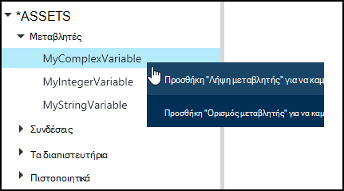
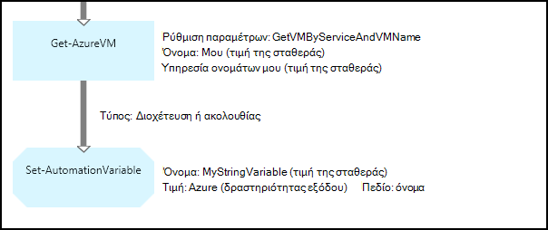
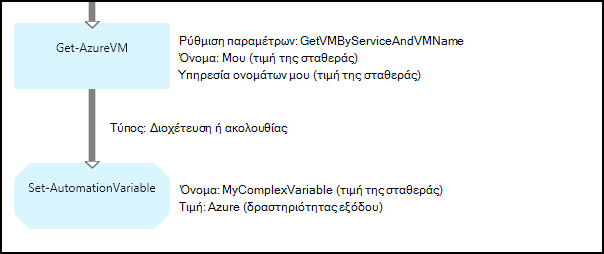
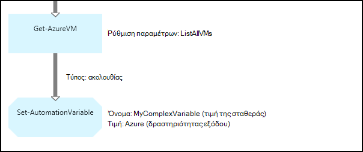
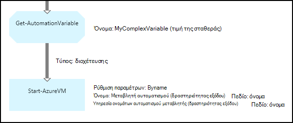
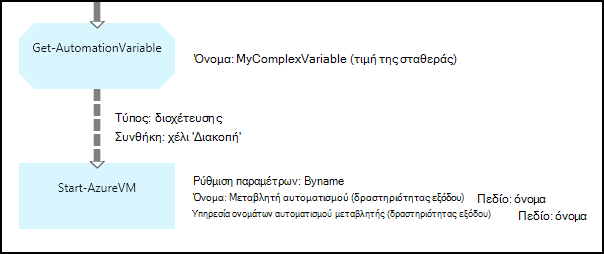

<properties 
   pageTitle="Μεταβλητό περιουσιακών στοιχείων αυτοματισμού Azure | Microsoft Azure"
   description="Μεταβλητό περιουσιακά στοιχεία είναι τιμές που είναι διαθέσιμες σε όλες τις runbooks και ρυθμίσεις παραμέτρων DSC στο Azure αυτοματισμού.  Σε αυτό το άρθρο εξηγεί τις λεπτομέρειες των μεταβλητών και πώς μπορείτε να εργαστείτε με αυτά που περιέχουν κείμενο και γραφικά σύνταξης."
   services="automation"
   documentationCenter=""
   authors="mgoedtel"
   manager="jwhit"
   editor="tysonn" />
<tags 
   ms.service="automation"
   ms.devlang="na"
   ms.topic="article"
   ms.tgt_pltfrm="na"
   ms.workload="infrastructure-services"
   ms.date="05/24/2016"
   ms.author="magoedte;bwren" />

# Μεταβλητό περιουσιακών στοιχείων αυτοματισμού Azure

Μεταβλητό περιουσιακά στοιχεία είναι τιμές που είναι διαθέσιμες σε όλες τις runbooks και ρυθμίσεις παραμέτρων DSC στο λογαριασμό σας αυτοματισμού. Μπορούν να δημιουργήσει, τους τροποποιηθούν και ανακτήθηκαν από την πύλη Azure, του Windows PowerShell, καθώς και μέσα από μια runbook ή ρύθμισης παραμέτρων DSC. Μεταβλητές Αυτοματισμός είναι χρήσιμη για τα ακόλουθα σενάρια:

- Κοινή χρήση μια τιμή μεταξύ πολλών runbooks ή ρυθμίσεις παραμέτρων DSC.

- Κοινή χρήση μια τιμή μεταξύ πολλών εργασιών από το ίδιο runbook ή ρύθμισης παραμέτρων DSC.

- Διαχείριση μια τιμή από την πύλη ή από τη γραμμή εντολών του Windows PowerShell που χρησιμοποιείται από runbooks ή ρυθμίσεις παραμέτρων DSC.

Μεταβλητές αυτοματισμού διατηρούνται έτσι ώστε να εξακολουθούν να είναι διαθέσιμη ακόμα και αν το runbook ή ρύθμισης παραμέτρων DSC αποτυγχάνει.  Αυτό σας επιτρέπει επίσης μια τιμή που καθορίζεται από έναν runbook που χρησιμοποιείται από άλλη ή που χρησιμοποιείται από το ίδιο runbook ή ρύθμισης παραμέτρων DSC την επόμενη φορά που εκτελείται.

Όταν δημιουργείται μια μεταβλητή, μπορείτε να καθορίσετε ότι είναι αποθηκευμένα κρυπτογραφημένο.  Όταν μια μεταβλητή είναι κρυπτογραφημένη, αποθηκεύεται με ασφάλεια στο αυτοματισμού Azure και την τιμή που δεν μπορεί να ανακτηθεί από το cmdlet [Get-AzureAutomationVariable](http://msdn.microsoft.com/library/dn913772.aspx) που διατίθεται ως μέρος της λειτουργικής μονάδας Azure PowerShell.  Ο μόνος τρόπος που μπορεί να ανακτηθεί μια κρυπτογραφημένη τιμή είναι από τη δραστηριότητα **Get-AutomationVariable** σε runbook ή ρύθμισης παραμέτρων DSC.

>[AZURE.NOTE]Ασφαλής περιουσιακών στοιχείων αυτοματισμού Azure περιλαμβάνουν διαπιστευτηρίων, τα πιστοποιητικά, συνδέσεις και κρυπτογραφημένο μεταβλητές. Αυτά τα στοιχεία κρυπτογραφούνται και αποθηκεύονται στο την αυτοματοποίηση Azure χρησιμοποιώντας ένα μοναδικό κλειδί που δημιουργείται για κάθε λογαριασμό αυτοματισμού. Αυτό το κλειδί κρυπτογραφούνται από το πρωτότυπο πιστοποιητικό και αποθηκεύονται στο Azure αυτοματισμού. Πριν από την αποθήκευση ενός ασφαλούς περιουσιακού στοιχείου, το κλειδί για το λογαριασμό αυτοματισμού είναι κρυπτογραφημένα χρησιμοποιώντας το πρωτότυπο πιστοποιητικό και, στη συνέχεια, χρησιμοποιείται για την κρυπτογράφηση του περιουσιακού στοιχείου.

## Τύποι μεταβλητών

Όταν δημιουργείτε μια μεταβλητή με την πύλη του Azure, πρέπει να καθορίσετε έναν τύπο δεδομένων από την αναπτυσσόμενη λίστα, ώστε να την πύλη μπορεί να εμφανίσει το κατάλληλο στοιχείο ελέγχου για την εισαγωγή την τιμή μεταβλητής. Η μεταβλητή δεν περιορίζεται σε αυτόν τον τύπο δεδομένων, αλλά πρέπει να ορίσετε τη μεταβλητή χρησιμοποιώντας το Windows PowerShell εάν θέλετε να καθορίσετε μια τιμή από ένα διαφορετικό τύπο. Εάν καθορίσετε **δεν έχει οριστεί**, στη συνέχεια, θα οριστεί η τιμή της μεταβλητής σε **$null**και πρέπει να ορίσετε την τιμή με το cmdlet [Set-AzureAutomationVariable](http://msdn.microsoft.com/library/dn913767.aspx) ή **Σύνολο AutomationVariable** δραστηριότητα.  Δεν μπορείτε να δημιουργήσετε ή να αλλάξετε την τιμή για έναν τύπο μιγαδικού μεταβλητή στην πύλη, αλλά μπορείτε να παράσχετε μια τιμή από οποιονδήποτε τύπο χρησιμοποιώντας το Windows PowerShell. Σύνθετοι τύποι θα επιστραφούν ως μια [PSCustomObject](http://msdn.microsoft.com/library/system.management.automation.pscustomobject.aspx).

Μπορείτε να αποθηκεύσετε πολλών τιμών σε μια μεμονωμένη μεταβλητή με τη δημιουργία ενός πίνακα ή hashtable και αποθήκευσή του σε τη μεταβλητή.

## Δραστηριότητες cmdlet και ροής εργασίας

Τα cmdlet στον παρακάτω πίνακα χρησιμοποιούνται για τη δημιουργία και διαχείριση μεταβλητές αυτοματισμού με το Windows PowerShell. Στείλει ως μέρος της [λειτουργικής μονάδας Azure PowerShell](../powershell-install-configure.md) , που είναι διαθέσιμη για χρήση σε runbooks αυτοματισμού και τη ρύθμιση παραμέτρων DSC.

|Cmdlet για|Περιγραφή|
|:---|:---|
|[Get-AzureAutomationVariable](http://msdn.microsoft.com/library/dn913772.aspx)|Ανακτά την τιμή από μια υπάρχουσα μεταβλητή.|
|[Νέα AzureAutomationVariable](http://msdn.microsoft.com/library/dn913771.aspx)|Δημιουργεί μια νέα μεταβλητή και ορίζει την τιμή του.|
|[Κατάργηση AzureAutomationVariable](http://msdn.microsoft.com/library/dn913775.aspx)|Καταργεί μια υπάρχουσα μεταβλητή.|
|[Ορισμός AzureAutomationVariable](http://msdn.microsoft.com/library/dn913767.aspx)|Ορίζει την τιμή για μια υπάρχουσα μεταβλητή.|

Για να αποκτήσετε πρόσβαση αυτοματισμού μεταβλητές σε μια runbook χρησιμοποιούνται οι δραστηριότητες ροής εργασίας στον παρακάτω πίνακα. Αυτές είναι διαθέσιμες μόνο για χρήση σε runbook ή ρύθμισης παραμέτρων DSC και δεν αποστέλλονται ως τμήμα της λειτουργικής μονάδας Azure PowerShell.

|Δραστηριότητες ροής εργασίας|Περιγραφή|
|:---|:---|
|Get-AutomationVariable|Ανακτά την τιμή από μια υπάρχουσα μεταβλητή.|
|Ορισμός AutomationVariable|Ορίζει την τιμή για μια υπάρχουσα μεταβλητή.|

>[AZURE.NOTE] Πρέπει να αποφύγετε τη χρήση μεταβλητών στην – όνομα παράμετρο της **Get-AutomationVariable** σε runbook ή ρύθμισης παραμέτρων DSC καθώς αυτό μπορεί να περιπλέξει ανακαλύψετε εξαρτήσεων μεταξύ runbooks ή ρύθμισης παραμέτρων DSC και αυτοματισμού μεταβλητές κατά το χρόνο σχεδίασης.

## Για να δημιουργήσετε μια νέα μεταβλητή αυτοματισμού

### Για να δημιουργήσετε μια νέα μεταβλητή με την πύλη του Azure

1. Από το λογαριασμό σας αυτοματισμού, κάντε κλικ στην επιλογή **στοιχεία** στο επάνω μέρος του παραθύρου.
1. Στο κάτω μέρος του παραθύρου, κάντε κλικ στην επιλογή **Προσθήκη ρύθμιση**.
1. Κάντε κλικ στην επιλογή **Προσθήκη μεταβλητή**.
1. Ολοκλήρωση του οδηγού και κάντε κλικ στο πλαίσιο ελέγχου για να αποθηκεύσετε τη νέα μεταβλητή.

### Για να δημιουργήσετε μια νέα μεταβλητή με την πύλη του Azure

1. Από το λογαριασμό σας αυτοματισμού, κάντε κλικ στο τμήμα **περιουσιακών στοιχείων** για να ανοίξετε το blade **περιουσιακών στοιχείων** .
1. Κάντε κλικ στο τμήμα **μεταβλητές** για να ανοίξετε το blade **μεταβλητές** .
1. Κάντε κλικ στην επιλογή **Προσθήκη μιας μεταβλητής** στο επάνω μέρος του blade.
1. Συμπληρώστε τη φόρμα και κάντε κλικ στην επιλογή **Δημιουργία** για να αποθηκεύσετε τη νέα μεταβλητή.

### Για να δημιουργήσετε μια νέα μεταβλητή με το Windows PowerShell

Το cmdlet [New-AzureAutomationVariable](http://msdn.microsoft.com/library/dn913771.aspx) δημιουργεί μια νέα μεταβλητή και ορίζει την αρχική τιμή. Μπορείτε να ανακτήσετε την τιμή χρησιμοποιώντας [Get-AzureAutomationVariable](http://msdn.microsoft.com/library/dn913772.aspx). Εάν η τιμή είναι έναν απλό τύπο, τότε επιστρέφεται η τιμή αυτού του τύπου. Εάν πρόκειται για ένα σύνθετο τύπο, τότε επιστρέφεται μια **PSCustomObject** .

Τα ακόλουθα δείγματα εντολών δείχνουν πώς μπορείτε να δημιουργήσετε μια μεταβλητή τύπου συμβολοσειράς και, στη συνέχεια, επιστρέφει την τιμή.

    New-AzureAutomationVariable –AutomationAccountName "MyAutomationAccount" –Name 'MyStringVariable' –Encrypted $false –Value 'My String'
    $string = (Get-AzureAutomationVariable –AutomationAccountName "MyAutomationAccount" –Name 'MyStringVariable').Value

Τα ακόλουθα δείγματα εντολών δείχνουν πώς μπορείτε να δημιουργήσετε μια μεταβλητή με έναν σύνθετο τύπο και, στη συνέχεια, επιστρέψετε τις ιδιότητές του. Σε αυτήν την περίπτωση, μια εικονική μηχανή αντικείμενο από **Get-AzureVM** χρησιμοποιείται.

    $vm = Get-AzureVM –ServiceName "MyVM" –Name "MyVM"
    New-AzureAutomationVariable –AutomationAccountName "MyAutomationAccount" –Name "MyComplexVariable" –Encrypted $false –Value $vm
    
    $vmValue = (Get-AzureAutomationVariable –AutomationAccountName "MyAutomationAccount" –Name "MyComplexVariable").Value
    $vmName = $vmValue.Name
    $vmIpAddress = $vmValue.IpAddress

## Χρήση μιας μεταβλητής σε runbook ή DSC ρύθμισης παραμέτρων

Χρησιμοποιήστε τη δραστηριότητα **Set-AutomationVariable** για να ορίσετε την τιμή μιας μεταβλητής αυτοματισμού σε μια runbook ή ρύθμισης παραμέτρων DSC και το **Get-AutomationVariable** για να ανακτήσετε.  Δεν πρέπει να χρησιμοποιείτε το cmdlet **Set-AzureAutomationVariable** ή **Get-AzureAutomationVariable** σε runbook ή ρύθμισης παραμέτρων DSC, εφόσον είναι λιγότερο αποτελεσματική από οι δραστηριότητες ροής εργασίας.  Επίσης δεν μπορείτε να ανακτήσετε την τιμή της ασφαλούς μεταβλητές με **Get-AzureAutomationVariable**.  Ο μόνος τρόπος για να δημιουργήσετε μια νέα μεταβλητή από έναν runbook ή ρύθμισης παραμέτρων DSC είναι να χρησιμοποιήσετε το cmdlet [New-AzureAutomationVariable](http://msdn.microsoft.com/library/dn913771.aspx) .

### Δείγματα runbook που περιέχουν κείμενο

#### Ρύθμιση και την ανάκτηση μιας απλής τιμής από έναν μεταβλητή

Τα ακόλουθα δείγματα εντολών δείχνουν πώς μπορείτε να ορίσετε και να ανακτήσετε μια μεταβλητή σε ένα runbook που περιέχουν κείμενο. Σε αυτό το δείγμα, θεωρείται ότι μεταβλητές μορφή ακέραιου αριθμού με το όνομα *NumberOfIterations* και *NumberOfRunnings* και μια μεταβλητή τύπου συμβολοσειράς έχουν ήδη δημιουργηθεί με όνομα *SampleMessage* .

    $NumberOfIterations = Get-AutomationVariable -Name 'NumberOfIterations'
    $NumberOfRunnings = Get-AutomationVariable -Name 'NumberOfRunnings'
    $SampleMessage = Get-AutomationVariable -Name 'SampleMessage'
    
    Write-Output "Runbook has been run $NumberOfRunnings times."
    
    for ($i = 1; $i -le $NumberOfIterations; $i++) {
       Write-Output "$i`: $SampleMessage"
    }
    Set-AutomationVariable –Name NumberOfRunnings –Value ($NumberOfRunnings += 1)

#### Ρύθμιση και την ανάκτηση ενός αντικειμένου σύνθετες σε μεταβλητή

Το παρακάτω δείγμα κώδικα δείχνει πώς μπορείτε να ενημερώσετε μια μεταβλητή με μια σύνθετη τιμή σε μια runbook που περιέχουν κείμενο. Σε αυτό το δείγμα, μια εικονική μηχανή Azure είναι ανάκτηση με **Get-AzureVM** και να αποθηκευτεί σε μια υπάρχουσα μεταβλητή αυτοματισμού.  Όπως εξηγείται στο [τους τύπους μεταβλητών](#variable-types), αυτό αποθηκεύεται ως ένα PSCustomObject.

    $vm = Get-AzureVM -ServiceName "MyVM" -Name "MyVM"
    Set-AutomationVariable -Name "MyComplexVariable" -Value $vm

Τον παρακάτω κώδικα, η τιμή είναι ανακτηθεί από τη μεταβλητή και να χρησιμοποιηθεί για να ξεκινήσετε την εικονική μηχανή.

    $vmObject = Get-AutomationVariable -Name "MyComplexVariable"
    if ($vmObject.PowerState -eq 'Stopped') {
       Start-AzureVM -ServiceName $vmObject.ServiceName -Name $vmObject.Name
    }

#### Ρύθμιση και την ανάκτηση μιας συλλογής σε μεταβλητή

Το παρακάτω δείγμα κώδικα δείχνει πώς μπορείτε να χρησιμοποιήσετε μια μεταβλητή με μια συλλογή σύνθετες τιμές σε ένα runbook που περιέχουν κείμενο. Σε αυτό το δείγμα, πολλές Azure εικονικές μηχανές ανάκτησης με **Get-AzureVM** και αποθηκεύονται σε μια υπάρχουσα μεταβλητή αυτοματισμού.  Όπως εξηγείται στο [τους τύπους μεταβλητών](#variable-types), αυτό αποθηκεύεται ως μια συλλογή από PSCustomObjects.

    $vms = Get-AzureVM | Where -FilterScript {$_.Name -match "my"}     
    Set-AutomationVariable -Name 'MyComplexVariable' -Value $vms

Τον παρακάτω κώδικα, η συλλογή είναι ανακτηθεί από τη μεταβλητή και να χρησιμοποιηθεί για να ξεκινήσετε κάθε εικονική μηχανή.

    $vmValues = Get-AutomationVariable -Name "MyComplexVariable"
    ForEach ($vmValue in $vmValues)
    {
       if ($vmValue.PowerState -eq 'Stopped') {
          Start-AzureVM -ServiceName $vmValue.ServiceName -Name $vmValue.Name
       }
    }

### Δείγματα runbook γραφικών

Σε ένα γραφικό runbook, μπορείτε να προσθέσετε το **Get-AutomationVariable** ή **Σύνολο AutomationVariable** κάνοντας δεξί κλικ στη μεταβλητή στο παράθυρο "βιβλιοθήκη" του προγράμματος επεξεργασίας γραφικών και επιλέγοντας τη δραστηριότητα που θέλετε.

#### Ρύθμιση τιμών σε μεταβλητή

Η παρακάτω εικόνα εμφανίζει δείγμα δραστηριότητες για να ενημερώσετε μια μεταβλητή με μια απλή τιμής σε ένα γραφικό runbook. Σε αυτό το δείγμα, μια μεμονωμένη Azure εικονική μηχανή ανάκτηση με **Get-AzureVM** και το όνομα του υπολογιστή έχει αποθηκευτεί σε μια υπάρχουσα μεταβλητή αυτοματισμού με έναν τύπο της συμβολοσειράς.  Δεν έχει σημασία αν η [σύνδεση είναι μια διαδικασία ή ακολουθίας](automation-graphical-authoring-intro.md#links-and-workflow) δεδομένου ότι αναμένεται μόνο σε ένα αντικείμενο στο αποτέλεσμα.

Η παρακάτω εικόνα εμφανίζει τις δραστηριότητες που χρησιμοποιείται για να ενημερώσετε έναν μεταβλητή με μια σύνθετη τιμή σε ένα γραφικό runbook. Η αλλαγή μόνο από το προηγούμενο παράδειγμα είναι δεν που καθορίζει μια **διαδρομή πεδίο** για το **αποτέλεσμα δραστηριότητας** σχετικά με τη δραστηριότητα **Σύνολο AutomationVariable** ώστε να είναι αποθηκευμένο το αντικείμενο αντί απλώς μια ιδιότητα του αντικειμένου.  Όπως εξηγείται στο [τους τύπους μεταβλητών](#variable-types), αυτό αποθηκεύεται ως ένα PSCustomObject.

Η παρακάτω εικόνα εμφανίζει παρόμοια λειτουργικότητα με το προηγούμενο παράδειγμα, με πολλές εικονικές μηχανές αποθηκεύονται στη μεταβλητή.  Μια [ακολουθία σύνδεσης](automation-graphical-authoring-intro.md#links-and-workflow) πρέπει να χρησιμοποιείται εδώ, έτσι ώστε να λαμβάνει τη δραστηριότητα **Σύνολο AutomationVariable** ολόκληρο το σύνολο των εικονικές μηχανές ως μια συλλογή.  Εάν μια [σύνδεση δικτύου αγωγών](automation-graphical-authoring-intro.md#links-and-workflow) που χρησιμοποιήθηκε, στη συνέχεια, τη δραστηριότητα **Σύνολο AutomationVariable** θα εκτελεστεί ξεχωριστά για κάθε αντικείμενο με το αποτέλεσμα ότι θα αποθηκευτούν μόνο την τελευταία εικονική μηχανή στη συλλογή.  Όπως εξηγείται στο [τους τύπους μεταβλητών](#variable-types), αυτό αποθηκεύεται ως μια συλλογή από PSCustomObjects.

#### Ανάκτηση τιμών από μια μεταβλητή

Η παρακάτω εικόνα εμφανίζει δείγμα δραστηριότητες που ανακτάτε και να χρησιμοποιήσετε μια μεταβλητή σε ένα γραφικό runbook.  Η πρώτη δραστηριότητα ανακτά τις εικονικές μηχανές που έχουν αποθηκευτεί στη μεταβλητή στο προηγούμενο παράδειγμα.  Η σύνδεση πρέπει να είναι μια [διαδικασία](automation-graphical-authoring-intro.md#links-and-workflow) , έτσι ώστε η δραστηριότητα **Έναρξη AzureVM** εκτελείται μία φορά για κάθε αντικείμενο που αποστέλλεται από τη δραστηριότητα **Get-AutomationVariable** .  Αυτό θα λειτουργούν με τον ίδιο εάν ένα σε ένα αντικείμενο ή πολλά αντικείμενα που είναι αποθηκευμένα στη μεταβλητή.  Η δραστηριότητα **Έναρξη AzureVM** χρησιμοποιεί ιδιοτήτων του PSCustomObject που αντιπροσωπεύει κάθε εικονική μηχανή. 

Η παρακάτω εικόνα δείχνει πώς μπορείτε να φιλτράρετε τα αντικείμενα που είναι αποθηκευμένα σε μια μεταβλητή σε ένα γραφικό runbook.  Προστίθεται μια [συνθήκη](automation-graphical-authoring-intro.md#links-and-workflow) στη σύνδεση στο προηγούμενο παράδειγμα για το φιλτράρισμα μόνο αυτές τις εικονικές μηχανές που έχουν διακοπεί όταν ορίστηκε η μεταβλητή.

## Επόμενα βήματα

- Για να μάθετε περισσότερα σχετικά με τη σύνδεση δραστηριότητες μαζί σε γραφικά σύνταξη από κοινού, ανατρέξτε στο θέμα [συνδέσεις γραφικών σύνταξης](automation-graphical-authoring-intro.md#links-and-workflow)
- Για να ξεκινήσετε με runbooks γραφικών, ανατρέξτε στο θέμα [μου πρώτη runbook γραφικών](automation-first-runbook-graphical.md) 
