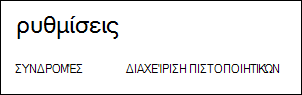

<properties 
    pageTitle="Αποστολή ενός πιστοποιητικού API διαχείρισης Azure | Azure Microsoft" 
    description="Μάθετε πώς μπορείτε να αποστείλετε athe API διαχείρισης πιστοποιητικό για την πύλη κλασική Azure." 
    services="cloud-services" 
    documentationCenter=".net" 
    authors="Thraka" 
    manager="timlt" 
    editor=""/>

<tags 
    ms.service="na" 
    ms.workload="tbd" 
    ms.tgt_pltfrm="na" 
    ms.devlang="na" 
    ms.topic="article" 
    ms.date="04/18/2016"
    ms.author="adegeo"/>

# Στείλτε ένα πιστοποιητικό διαχείρισης Azure API διαχείρισης

Διαχείριση πιστοποιητικών σάς επιτρέπουν να τον έλεγχο ταυτότητας με το API διαχείρισης υπηρεσίας που παρέχεται από Azure. Πολλά προγράμματα και εργαλεία (όπως το Visual Studio ή το Azure SDK) θα χρησιμοποιήσει αυτές τις certficates για την αυτοματοποίηση ρύθμισης παραμέτρων και την ανάπτυξη από διάφορες υπηρεσίες Azure. **Αυτό ισχύει μόνο για την πύλη του Azure κλασική**. 

>[AZURE.WARNING] Πρόσεχε! Αυτούς τους τύπους πιστοποιητικών επιτρέπεται σε οποιονδήποτε χρήστη πραγματοποιεί έλεγχο ταυτότητας με αυτές για να διαχειριστείτε τη συνδρομή στην οποία συσχετίζεται. 

Περισσότερες πληροφορίες σχετικά με το Azure πιστοποιητικών (συμπεριλαμβανομένης της δημιουργίας ένα αυτο-υπογεγραμμένο πιστοποιητικό) είναι [διαθέσιμες](cloud-services/cloud-services-certs-create.md#what-are-management-certificates) σε εσάς εάν τον χρειάζεστε.

Μπορείτε επίσης να χρησιμοποιήσετε [Azure Active Directory](/services/active-directory/) για τον έλεγχο ταυτότητας κωδικός προγράμματος-πελάτη για σκοπούς αυτοματισμού.

## Στείλτε ένα πιστοποιητικό διαχείρισης

Όταν έχετε ένα πιστοποιητικό διαχείρισης που δημιουργήσατε, (αρχείο .cer με μόνο το δημόσιο κλειδί) μπορείτε να το αποστείλετε στην πύλη του. Όταν το πιστοποιητικό που είναι διαθέσιμη στην πύλη, οποιοσδήποτε με μια αντίστοιχη certficiate (ιδιωτικό κλειδί) μπορεί να συνδεθείτε μέσω του API διαχείρισης και πρόσβαση στους πόρους για τη συνδρομή που σχετίζονται.

1. Συνδεθείτε στο [Azure κλασική πύλη](http://manage.windowsazure.com).

2. Βεβαιωθείτε ότι έχετε επιλέξει τη σωστή συνδρομή στην οποία θέλετε να συσχετίσετε ένα πιστοποιητικό με. Πατήστε το κείμενο **συνδρομές** στο επάνω δεξιό τμήμα της πύλης.

    

3. Αφού έχετε το σωστό επιλεγμένη συνδρομή, πατήστε **Ρυθμίσεις** στην αριστερή πλευρά της πύλης (ίσως χρειαστεί να κάνετε κύλιση προς τα κάτω). 
    
    

4. Πατήστε την καρτέλα **Διαχείριση πιστοποιητικών** .

    
    
5. Πατήστε το κουμπί **Αποστολή** .

    
    
6. Συμπληρώστε τις πληροφορίες του παραθύρου διαλόγου και πατήστε το τέλος **σημάδι ελέγχου**.

    

## Επόμενα βήματα

Τώρα που έχετε ένα πιστοποιητικό διαχείρισης που σχετίζονται με μια συνδρομή, μπορείτε να (αφού έχετε εγκαταστήσει το πιστοποιητικό που ταιριάζει τοπικά) ορθογώνιο σύνδεση με την [Υπηρεσία διαχείρισης REST API](https://msdn.microsoft.com/library/azure/mt420159.aspx) και αυτοματοποίηση τους διάφορους Azure πόρους που συσχετίζονται επίσης με αυτήν τη συνδρομή. 