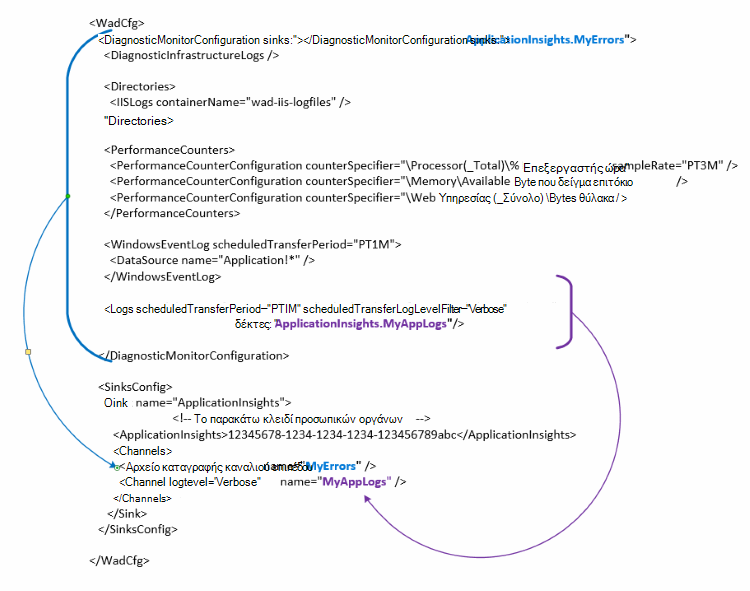

<properties
   pageTitle="Ρύθμιση παραμέτρων Διαγνωστικά Azure για την αποστολή δεδομένων σε εφαρμογή ιδέες | Microsoft Azure"
   description="Ενημερώστε τις παραμέτρους δημόσια Διαγνωστικά του Azure για την αποστολή δεδομένων σε εφαρμογή ιδέες."
   services="multiple"
   documentationCenter=".net"
   authors="sbtron"
   manager="douge"
   editor="" />
<tags
   ms.service="application-insights"
   ms.devlang="na"
   ms.topic="article"
   ms.tgt_pltfrm="na"
   ms.workload="na"
   ms.date="12/15/2015"
   ms.author="saurabh" />

# Ρύθμιση παραμέτρων Διαγνωστικά Azure για την αποστολή δεδομένων σε εφαρμογή ιδέες

Διαγνωστικά του Azure αποθηκεύει δεδομένα σε πίνακες αποθήκευσης Azure.  Ωστόσο, μπορείτε επίσης να διοχέτευση όλα ή ένα υποσύνολο των δεδομένων σε εφαρμογή ιδέες, ρυθμίζοντας τις παραμέτρους "δέκτες" και "Κανάλια" στη ρύθμιση παραμέτρων σας όταν χρησιμοποιείτε την επέκταση Διαγνωστικά Azure 1,5 ή νεότερη έκδοση.

Σε αυτό το άρθρο περιγράφει τον τρόπο για να δημιουργήσετε τη δημόσια ρύθμιση παραμέτρων για την επέκταση Διαγνωστικά Azure, έτσι ώστε τα έχει ρυθμιστεί για την αποστολή δεδομένων σε εφαρμογή ιδέες.

## Ρύθμιση παραμέτρων ιδέες εφαρμογή ως ένα δέκτη

Παρουσιάζει την επέκταση Azure Διαγνωστικά 1,5 το **<SinksConfig>** στοιχείο στη δημόσια ρύθμιση παραμέτρων. Αυτό ορίζει την επιπλέον *δέκτη* όπου μπορούν να αποσταλούν τα δεδομένα του Azure Διαγνωστικά. Μπορείτε να καθορίσετε τις λεπτομέρειες του πόρου ιδέες εφαρμογής όπου θέλετε να στείλετε τα δεδομένα του Azure Διαγνωστικά ως μέρος αυτής της **<SinksConfig>**.
Παράδειγμα **SinksConfig** μοιάζει κάπως έτσι-  

    <SinksConfig>
        <Sink name="ApplicationInsights">
          <ApplicationInsights>{Insert InstrumentationKey}</ApplicationInsights>
          <Channels>
            <Channel logLevel="Error" name="MyTopDiagData"  />
            <Channel logLevel="Verbose" name="MyLogData"  />
          </Channels>
        </Sink>
      </SinksConfig>

Για το στοιχείο **δέκτη** το χαρακτηριστικό *όνομα* καθορίζει μια τιμή συμβολοσειράς που θα χρησιμοποιηθεί για να αναφέρονται με μοναδικό τρόπο το δέκτη.
Το στοιχείο **ApplicationInsights** καθορίζει οργάνων αριθμό-κλειδί του πόρου ιδέες εφαρμογής όπου θα αποστέλλονται τα δεδομένα του Azure Διαγνωστικά. Εάν δεν έχετε έναν υπάρχοντα πόρο ιδέες εφαρμογή, ανατρέξτε στο θέμα [Δημιουργία ενός νέου πόρου εφαρμογή ιδέες](./application-insights/app-insights-create-new-resource.md) για περισσότερες πληροφορίες σχετικά με τη δημιουργία ενός πόρου και γρήγορα τον αριθμό-κλειδί οργάνων.

Εάν προγραμματίζετε ένα έργο υπηρεσία στο Cloud με το Azure SDK 2,8 αυτού του πλήκτρου οργάνων συμπληρώνεται αυτόματα στη ρύθμιση παραμέτρων δημόσια με βάση τη ρύθμιση παραμέτρων της υπηρεσίας **APPINSIGHTS_INSTRUMENTATIONKEY** όταν συσκευασία το έργο υπηρεσία cloud. Ανατρέξτε στο θέμα [Χρήση εφαρμογής ιδέες με βάση Διαγνωστικά Azure για την αντιμετώπιση προβλημάτων υπηρεσία στο Cloud](./cloud-services/cloud-services-dotnet-diagnostics-applicationinsights.md).

Το στοιχείο **κανάλια** σάς επιτρέπει να ορίσετε ένα ή περισσότερα στοιχεία **καναλιού** για τα δεδομένα που θα αποσταλούν του δέκτη. Το κανάλι λειτουργεί όπως το φίλτρο και σας επιτρέπει να επιλέξετε το συγκεκριμένο αρχείο καταγραφής επίπεδα που θα θέλετε να στείλετε το δέκτη. Για παράδειγμα, μπορείτε να συλλέξετε λεπτομερή αρχεία καταγραφής και αποστολή τους στο χώρο αποθήκευσης, αλλά ενδέχεται να μπορείτε να επιλέξετε να ορίσετε ένα κανάλι με ένα επίπεδο καταγραφής σφάλματος και κατά την αποστολή αρχείων καταγραφής μέσω ότι αρχείων καταγραφής σφαλμάτων μόνο καναλιού θα αποσταλούν που δέκτη.
Για ένα **κανάλι** , το χαρακτηριστικό *όνομα* χρησιμοποιείται για με μοναδικό τρόπο αναφέρονται σε αυτό το κανάλι.
Το χαρακτηριστικό *μόνο* σάς επιτρέπει να καθορίσετε το επίπεδο καταγραφής που θα σας επιτρέψει το κανάλι. Είναι τα επίπεδα καταγραφής διαθέσιμο με τη σειρά των πιο τουλάχιστον πληροφοριών
 - Λεπτομερής
 - Πληροφορίες
 - Προειδοποίηση
 - Σφάλμα
 - Κρίσιμη

## Αποστολή δεδομένων για το δέκτη ιδέες εφαρμογής
Όταν έχει οριστεί η εφαρμογή ιδέες δέκτη μπορείτε να στείλετε δεδομένα σε συγκεκριμένο δέκτη προσθέτοντας το χαρακτηριστικό *δέκτη* στα στοιχεία κάτω από τον κόμβο **DiagnosticMonitorConfiguration** . Προσθήκη του στοιχείου *δέκτες* κάθε κόμβο Καθορίζει ότι θέλετε τα δεδομένα που συλλέγονται από αυτόν τον κόμβο και οποιαδήποτε κόμβου κάτω από το να αποστέλλονται το δέκτη που καθορίζεται.

Για παράδειγμα, εάν θέλετε να στείλετε όλα τα δεδομένα που συλλέγονται από Azure Διαγνωστικά, στη συνέχεια, μπορείτε να προσθέσετε το χαρακτηριστικό *δέκτη* απευθείας στον κόμβο **DiagnosticMonitorConfiguration** . Ορίστε την τιμή από την *δέκτες* στο όνομα του δέκτη που έχει καθοριστεί από το **SinkConfig**.

    <DiagnosticMonitorConfiguration overallQuotaInMB="4096" sinks="ApplicationInsights">

Εάν θέλετε να στείλετε μόνο αρχείων καταγραφής σφαλμάτων για την εφαρμογή ιδέες δέκτη, στη συνέχεια, μπορείτε να ορίσετε την τιμή *δέκτες* να είναι το όνομα δέκτη ακολουθούμενο από το όνομα του καναλιού διαχωρισμένα με τελεία ("."). Για παράδειγμα, για αποστολή αρχείων καταγραφής σφαλμάτων μόνο για την εφαρμογή ιδέες δέκτη χρησιμοποιούν το κανάλι MyTopDiagdata που έχει οριστεί σε τα παραπάνω SinksConfig.  

    <DiagnosticMonitorConfiguration overallQuotaInMB="4096" sinks="ApplicationInsights.MyTopDiagdata">

Εάν θέλετε να στείλετε αρχεία καταγραφής εφαρμογών λεπτομερές σε εφαρμογή ιδέες, στη συνέχεια, προσθέστε το χαρακτηριστικό *δέκτες* στον κόμβο **αρχεία καταγραφής** .

    <Logs scheduledTransferPeriod="PT1M" scheduledTransferLogLevelFilter="Verbose" sinks="ApplicationInsights.MyLogData"/>

Μπορείτε επίσης να συμπεριλάβετε πολλές δέκτες στη ρύθμιση παραμέτρων σε διαφορετικά επίπεδα στην ιεραρχία. Σε αυτήν την περίπτωση το δέκτη που καθορίζεται στο ανώτατο επίπεδο της ιεραρχίας λειτουργεί ως καθολική ρύθμιση και του προϊόντος που καθορίζεται στο στοιχείο πράξεων μεμονωμένων στοιχείων όπως παράκαμψη αυτήν τη ρύθμιση καθολικού.    

Ακολουθεί ένα παράδειγμα ολοκλήρωσης του αρχείου δημόσια ρύθμισης παραμέτρων που στέλνει όλα τα σφάλματα σε εφαρμογή ιδέες (που καθορίζεται στο στον κόμβο **DiagnosticMonitorConfiguration** ) και επίσης λεπτομερή αρχεία καταγραφής επιπέδου για τα αρχεία καταγραφής εφαρμογής (που καθορίζεται στο τον κόμβο **αρχεία καταγραφής** ).

    <WadCfg>
      <DiagnosticMonitorConfiguration overallQuotaInMB="4096"
           sinks="ApplicationInsights.MyTopDiagData"> <!-- All info below sent to this channel -->
        <DiagnosticInfrastructureLogs />
        <PerformanceCounters>
          <PerformanceCounterConfiguration counterSpecifier="\Processor(_Total)\% Processor Time" sampleRate="PT3M" sinks="ApplicationInsights.MyLogData/>
          <PerformanceCounterConfiguration counterSpecifier="\Memory\Available MBytes" sampleRate="PT3M" />
          <PerformanceCounterConfiguration counterSpecifier="\Web Service(_Total)\Bytes Total/Sec" sampleRate="PT3M" />
        </PerformanceCounters>
        <WindowsEventLog scheduledTransferPeriod="PT1M">
          <DataSource name="Application!*" />
        </WindowsEventLog>
        <Logs scheduledTransferPeriod="PT1M" scheduledTransferLogLevelFilter="Verbose"
                sinks="ApplicationInsights.MyLogData"/> <!-- This specific info sent to this channel -->
      </DiagnosticMonitorConfiguration>

    <SinksConfig>
        <Sink name="ApplicationInsights">
          <ApplicationInsights>{Insert InstrumentationKey}</ApplicationInsights>
          <Channels>
            <Channel logLevel="Error" name="MyTopDiagData"  />
            <Channel logLevel="Verbose" name="MyLogData"  />
          </Channels>
        </Sink>
      </SinksConfig>
    </WadCfg>

Υπάρχουν ορισμένοι περιορισμοί που πρέπει να γνωρίζετε με αυτήν τη λειτουργικότητα

- Κανάλια προορίζονται μόνο για να εργαστείτε με τύπο αρχείου καταγραφής και δεν μετρητές επιδόσεων. Εάν καθορίσετε καναλιού με ένα στοιχείο μετρητή επιδόσεων θα αγνοηθεί.
- Το επίπεδο καταγραφής για ένα κανάλι δεν πρέπει να υπερβαίνει το επίπεδο καταγραφής για το τι που συλλέγονται από Azure Διαγνωστικά. Για παράδειγμα: δεν μπορείτε να συλλέξετε σφάλματα αρχείο καταγραφής της εφαρμογής στο στοιχείο αρχεία καταγραφής και προσπαθούν να στείλουν λεπτομερές αρχεία καταγραφής για να το δέκτη πληροφορίες για την εφαρμογή. Το χαρακτηριστικό *scheduledTransferLogLevelFilter* πάντα πρέπει να συλλέξετε ίση ή περισσότερα αρχεία καταγραφής από τα αρχεία καταγραφής που προσπαθείτε να στείλετε σε ένα δέκτη.
- Δεν μπορείτε να στείλετε blob δεδομένα που συλλέγονται από την επέκταση Azure Διαγνωστικά σε εφαρμογή ιδέες. Για παράδειγμα όλα τα στοιχεία που καθορίζεται στον κόμβο *σε καταλόγους* . Για το σφάλμα Αποτυπώνει η ένδειξη σφαλμάτων πραγματική θα εξακολουθήσουν να αποστέλλονται στο χώρο αποθήκευσης blob και θα αποσταλούν μόνο μια ειδοποίηση ότι η ένδειξη σφαλμάτων δημιουργήθηκε για ιδέες εφαρμογής.

## Επόμενα βήματα

- Χρήση του [PowerShell](./cloud-services/cloud-services-diagnostics-powershell.md) για να ενεργοποιήσετε την επέκταση Διαγνωστικά του Azure για την εφαρμογή σας. 
- Χρησιμοποιήστε το [Visual Studio](vs-azure-tools-diagnostics-for-cloud-services-and-virtual-machines.md) για να ενεργοποιήσετε την επέκταση Διαγνωστικά του Azure για την εφαρμογή σας
