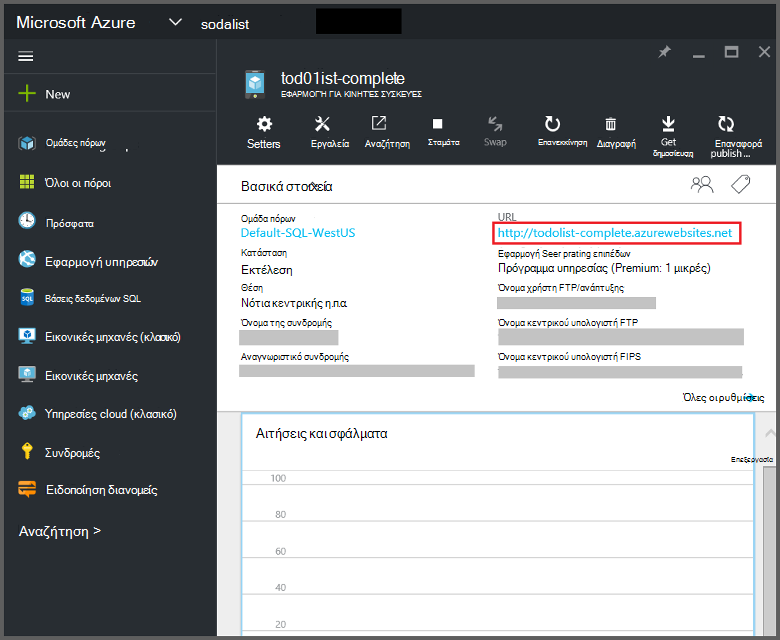
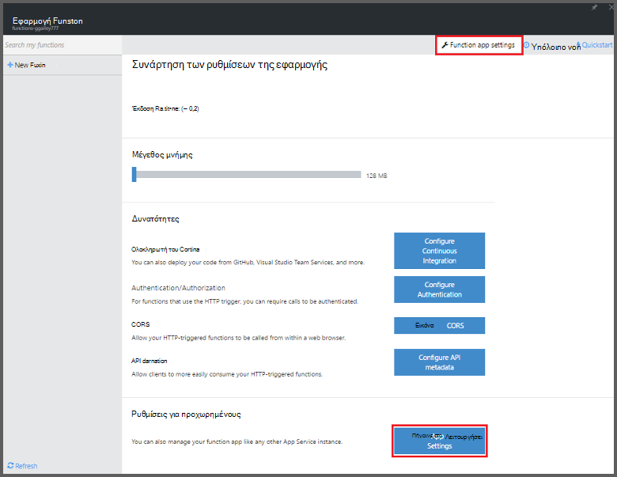
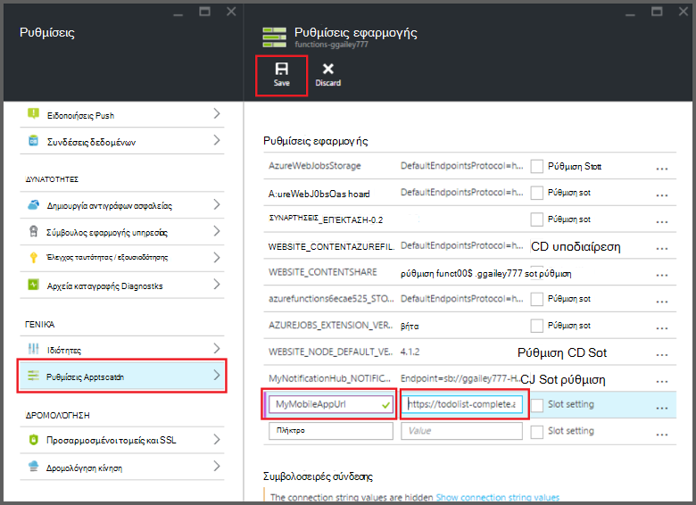

<properties
    pageTitle="Azure συνδέσεις εφαρμογές του Mobile συναρτήσεις | Microsoft Azure"
    description="Κατανόηση πώς μπορείτε να χρησιμοποιήσετε εφαρμογές του Mobile Azure συνδέσεις σε συναρτήσεις Azure."
    services="functions"
    documentationCenter="na"
    authors="ggailey777"
    manager="erikre"
    editor=""
    tags=""
    keywords="Azure συναρτήσεις, συναρτήσεις, συμβάν επεξεργασία, δυναμική υπολογισμού, χωρίς αρχιτεκτονικής"/>

<tags
    ms.service="functions"
    ms.devlang="multiple"
    ms.topic="reference"
    ms.tgt_pltfrm="multiple"
    ms.workload="na"
    ms.date="08/30/2016"
    ms.author="glenga"/>

# Azure συνδέσεις εφαρμογές του Mobile συναρτήσεις

[AZURE.INCLUDE [functions-selector-bindings](../../includes/functions-selector-bindings.md)]

Σε αυτό το άρθρο εξηγεί πώς μπορείτε να ρυθμίσετε τις παραμέτρους και συνδέσεις εφαρμογές του Mobile Azure κώδικα σε συναρτήσεις Azure. 

[AZURE.INCLUDE [intro](../../includes/functions-bindings-intro.md)] 

Azure εφαρμογές του Mobile Service App σάς επιτρέπει να εκθέσετε δεδομένα τελικό σημείο του πίνακα για κινητές συσκευές. Αυτά τα ίδια δεδομένα σε μορφή πίνακα μπορούν να χρησιμοποιηθούν με δύο εισόδου και εξόδου συνδέσεις σε συναρτήσεις Azure. Καθώς υποστηρίζει δυναμικές σχήματος, Node.js παρασκηνίου εφαρμογής για κινητές συσκευές είναι ιδανική για την έκθεση σε μορφή πίνακα δεδομένων για χρήση με τις συναρτήσεις. Σχήμα δυναμικής είναι ενεργοποιημένη από προεπιλογή και πρέπει να απενεργοποιηθεί στην εφαρμογή για κινητές συσκευές παραγωγής. Για περισσότερες πληροφορίες σχετικά με τα τελικά σημεία πίνακα σε έναν υπολογιστή στο παρασκήνιο Node.js, ανατρέξτε στο θέμα [Επισκόπηση: Λειτουργίες πίνακα](../app-service-mobile/app-service-mobile-node-backend-how-to-use-server-sdk.md#TableOperations). Στις εφαρμογές του Mobile, υπόβαθρο Node.js υποστηρίζει στην πύλη περιήγηση και επεξεργασία πινάκων. Για περισσότερες πληροφορίες, ανατρέξτε στο θέμα [Επεξεργασία στην πύλη](../app-service-mobile/app-service-mobile-node-backend-how-to-use-server-sdk.md#in-portal-editing) στο θέμα Node.js SDK. Όταν χρησιμοποιείτε .NET παρασκηνίου εφαρμογής για κινητές συσκευές με συναρτήσεις Azure, πρέπει να ενημερώσετε με μη αυτόματο τρόπο το μοντέλο δεδομένων σας όπως απαιτείται από τη συνάρτηση σας. Για περισσότερες πληροφορίες σχετικά με τα τελικά σημεία πίνακα στο .NET παρασκηνίου εφαρμογής για κινητές συσκευές, ανατρέξτε στο θέμα [τον τρόπο: Ορισμός ενός πίνακα ελεγκτή](../app-service-mobile/app-service-mobile-dotnet-backend-how-to-use-server-sdk.md#define-table-controller) στο θέμα SDK παρασκηνίου .NET. 

## Δημιουργήστε μια μεταβλητή περιβάλλοντος για τη διεύθυνση URL υποστήριξης της εφαρμογής για κινητές συσκευές

Εφαρμογές του Mobile συνδέσεις απαιτούν τη συγκεκριμένη στιγμή για να δημιουργήσετε μια μεταβλητή περιβάλλοντος που επιστρέφει τη διεύθυνση URL της εφαρμογής για κινητές συσκευές υπόβαθρο ίδια. Μπορείτε να βρείτε αυτήν τη διεύθυνση URL στην [πύλη του Azure](https://portal.azure.com) , βρείτε την εφαρμογή για κινητές συσκευές και ανοίγοντας το blade.

Για να ορίσετε αυτήν τη διεύθυνση URL ως μια μεταβλητή περιβάλλοντος στην εφαρμογή συνάρτηση:

1. Στην εφαρμογή της συνάρτησης στην [πύλη του Azure συναρτήσεις](https://functions.azure.com/signin), κάντε κλικ στην επιλογή **Ρυθμίσεις εφαρμογής συνάρτηση** > **ρυθμίσεων εφαρμογής υπηρεσίας**. 

    

2. Στην εφαρμογή της συνάρτησης, κάντε κλικ στην επιλογή **όλες οι ρυθμίσεις**, κάντε κύλιση στο **Ρυθμίσεις εφαρμογής**, στη συνέχεια, στην περιοχή **Ρυθμίσεις εφαρμογής** τύπος ένα νέο **όνομα** για τη μεταβλητή περιβάλλοντος, επικολλήστε τη διεύθυνση URL σε **τιμή**, φροντίζοντας να χρησιμοποιούν το σχήμα HTTPS, στη συνέχεια, κάντε κλικ στην επιλογή **Αποθήκευση** και κλείσιμο του blade εφαρμογή συνάρτηση για να επιστρέψετε στην πύλη του συναρτήσεις.   

    

Τώρα, μπορείτε να ορίσετε αυτήν τη νέα μεταβλητή περιβάλλοντος ως πεδίο *σύνδεσης* σας συνδέσεις.

## Χρησιμοποιήστε ένα πλήκτρο API για ασφαλή πρόσβαση για τα τελικά σημεία τις εφαρμογές του Mobile πίνακα.

Στις συναρτήσεις Azure, συνδέσεις πίνακα κινητές συσκευές σάς επιτρέπουν να καθορίσετε ένα πλήκτρο API, το οποίο είναι ένα κοινό μυστικό που μπορούν να χρησιμοποιηθούν για να αποτρέψετε την ανεπιθύμητη πρόσβαση από τις εφαρμογές εκτός από τις συναρτήσεις. Εφαρμογές του Mobile δεν διαθέτει ενσωματωμένη υποστήριξη για έλεγχο ταυτότητας κλειδιού API. Ωστόσο, μπορείτε να εφαρμόσετε ένα κλειδί API στο σας Node.js εφαρμογής για κινητές συσκευές παρασκηνίου, ακολουθώντας τα παραδείγματα σε [εφαρμογές του Mobile Azure εφαρμογής υπηρεσίας υποστήριξης εφαρμογής ένα κλειδί API](https://github.com/Azure/azure-mobile-apps-node/tree/master/samples/api-key). Ομοίως, μπορείτε να εφαρμόσετε ένα κλειδί API σε μια [εφαρμογή για κινητές συσκευές παρασκηνίου .NET](https://github.com/Azure/azure-mobile-apps-net-server/wiki/Implementing-Application-Key).

>[AZURE.IMPORTANT] Αυτό το κλειδί API δεν πρέπει να διανεμηθούν με τους πελάτες σας εφαρμογής για κινητές συσκευές, αυτό θα πρέπει να μόνο να διανεμηθούν με ασφάλεια για προγράμματα-πελάτες υπηρεσίας πλευρά, όπως συναρτήσεις Azure. 

## Azure εφαρμογές του Mobile εισαγωγής σύνδεσης

Εισαγωγής συνδέσεις να φορτώσετε μια εγγραφή από ένα τελικό σημείο του πίνακα κινητές συσκευές και μεταβιβάζουν απευθείας σύνδεσή σας. Η εγγραφή Αναγνωριστικό προσδιορίζεται με βάση το έναυσμα που κλήση της συνάρτησης. Σε μια συνάρτηση C#, τυχόν αλλαγές που κάνατε στην εγγραφή αποστέλλονται αυτόματα προς τον πίνακα όταν η συνάρτηση έξοδο με επιτυχία.

#### Function.JSON για σύνδεση εισόδου εφαρμογές του Mobile

Το αρχείο *function.json* υποστηρίζει τις ακόλουθες ιδιότητες:

- `name`: Όνομα μεταβλητής χρησιμοποιείται σε συνάρτηση κώδικα για τη νέα εγγραφή.
- `type`: Biding τύπος πρέπει να οριστεί στην *mobileTable*.
- `tableName`: Ο πίνακας όπου θα δημιουργηθεί τη νέα εγγραφή.
- `id`: Το Αναγνωριστικό της εγγραφής για να ανακτήσετε. Αυτή η ιδιότητα υποστηρίζει συνδέσεις παρόμοια με `{queueTrigger}`, που θα χρησιμοποιήσει την τιμή συμβολοσειράς του μηνύματος ουρά ως την εγγραφή ID που διαθέτετε.
- `apiKey`: Συμβολοσειρά η οποία είναι η ρύθμιση εφαρμογής που καθορίζει το προαιρετικό κλειδί API για την εφαρμογή για κινητές συσκευές. Αυτό είναι απαραίτητο, κατά την εφαρμογή για κινητές συσκευές σας χρησιμοποιεί ένα κλειδί API για να περιορίσετε την πρόσβαση προγράμματος-πελάτη.
- `connection`: Συμβολοσειρά η οποία είναι το όνομα της μεταβλητής περιβάλλοντος στις ρυθμίσεις εφαρμογής που καθορίζει τη διεύθυνση URL της σας παρασκηνίου εφαρμογής για κινητές συσκευές.
- `direction`: Κατεύθυνση σύνδεση, η οποία θα πρέπει να οριστεί *σε*.

Παράδειγμα αρχείου *function.json* :

    {
      "bindings": [
        {
          "name": "record",
          "type": "mobileTable",
          "tableName": "MyTable",
          "id" : "{queueTrigger}",
          "connection": "My_MobileApp_Url",
          "apiKey": "My_MobileApp_Key",
          "direction": "in"
        }
      ],
      "disabled": false
    }

#### Azure παράδειγμα κώδικα εφαρμογές του Mobile για ένα έναυσμα ουρά C#

Με βάση το παράδειγμα function.json παραπάνω, η σύνδεση εισόδου ανακτά την εγγραφή από μια εφαρμογές του Mobile πίνακα τελικού σημείου με το Αναγνωριστικό που ταιριάζει με τη συμβολοσειρά μήνυμα ουρά και μεταβιβάζει η παράμετρος της *εγγραφής* . Όταν η εγγραφή δεν βρεθεί, η παράμετρος είναι null. Η εγγραφή, στη συνέχεια, έχει ενημερωθεί με τη νέα τιμή *κειμένου* όταν βγει από τη συνάρτηση.

    #r "Newtonsoft.Json"    
    using Newtonsoft.Json.Linq;
    
    public static void Run(string myQueueItem, JObject record)
    {
        if (record != null)
        {
            record["Text"] = "This has changed.";
        }    
    }

#### Azure παράδειγμα κώδικα εφαρμογές του Mobile για ένα έναυσμα ουρά Node.js

Με βάση το παράδειγμα function.json παραπάνω, η σύνδεση εισόδου ανακτά την εγγραφή από μια εφαρμογές του Mobile πίνακα τελικού σημείου με το Αναγνωριστικό που ταιριάζει με τη συμβολοσειρά μήνυμα ουρά και μεταβιβάζει η παράμετρος της *εγγραφής* . Στις συναρτήσεις Node.js, ενημερωμένες εγγραφές δεν αποστέλλονται πίσω στον πίνακα. Αυτό το παράδειγμα κώδικα εγγράφει τα ανακτημένα εγγραφή στο αρχείο καταγραφής.

    module.exports = function (context, input) {    
        context.log(context.bindings.record);
        context.done();
    };

## Azure εφαρμογές του Mobile εξόδου σύνδεσης

Συνάρτηση σας να συντάξετε μια εγγραφή για ένα τελικό σημείο πίνακα εφαρμογές του Mobile χρησιμοποιώντας μια σύνδεση εξόδου. 

#### Function.JSON για τις εφαρμογές του Mobile εξόδου σύνδεσης

Το αρχείο function.json υποστηρίζει τις ακόλουθες ιδιότητες:

- `name`: Όνομα μεταβλητής χρησιμοποιείται σε συνάρτηση κώδικα για τη νέα εγγραφή.
- `type`: Τύπος σύνδεσης που πρέπει να οριστεί στην *mobileTable*.
- `tableName`: Ο πίνακας όπου έχει δημιουργηθεί τη νέα εγγραφή.
- `apiKey`: Συμβολοσειρά η οποία είναι η ρύθμιση εφαρμογής που καθορίζει το προαιρετικό κλειδί API για την εφαρμογή για κινητές συσκευές. Αυτό είναι απαραίτητο, κατά την εφαρμογή για κινητές συσκευές σας χρησιμοποιεί ένα κλειδί API για να περιορίσετε την πρόσβαση προγράμματος-πελάτη.
- `connection`: Συμβολοσειρά η οποία είναι το όνομα της μεταβλητής περιβάλλοντος στις ρυθμίσεις εφαρμογής που καθορίζει τη διεύθυνση URL της σας παρασκηνίου εφαρμογής για κινητές συσκευές.
- `direction`: Κατεύθυνση, η οποία θα πρέπει να οριστεί *εκτός*σύνδεσης.

Παράδειγμα function.json:

    {
      "bindings": [
        {
          "name": "record",
          "type": "mobileTable",
          "tableName": "MyTable",
          "connection": "My_MobileApp_Url",
          "apiKey": "My_MobileApp_Key",
          "direction": "out"
        }
      ],
      "disabled": false
    }

#### Azure παράδειγμα κώδικα εφαρμογές του Mobile για ένα έναυσμα ουρά C#

Το παράδειγμα αυτό κώδικα C# εισάγει μια νέα εγγραφή σε ένα τελικό σημείο του πίνακα εφαρμογές του Mobile με μια ιδιότητα *κειμένου* στον πίνακα που καθορίζεται στη σύνδεση παραπάνω.

    public static void Run(string myQueueItem, out object record)
    {
        record = new {
            Text = $"I'm running in a C# function! {myQueueItem}"
        };
    }

#### Azure παράδειγμα κώδικα εφαρμογές του Mobile για ένα έναυσμα ουρά Node.js

Αυτό το παράδειγμα κώδικα Node.js εισάγει μια νέα εγγραφή σε ένα τελικό σημείο του πίνακα εφαρμογές του Mobile με μια ιδιότητα *κειμένου* στον πίνακα που καθορίζεται στη σύνδεση παραπάνω.

    module.exports = function (context, input) {
    
        context.bindings.record = {
            text : "I'm running in a Node function! Data: '" + input + "'"
        }   
    
        context.done();
    };

## Επόμενα βήματα

[AZURE.INCLUDE [next steps](../../includes/functions-bindings-next-steps.md)]
