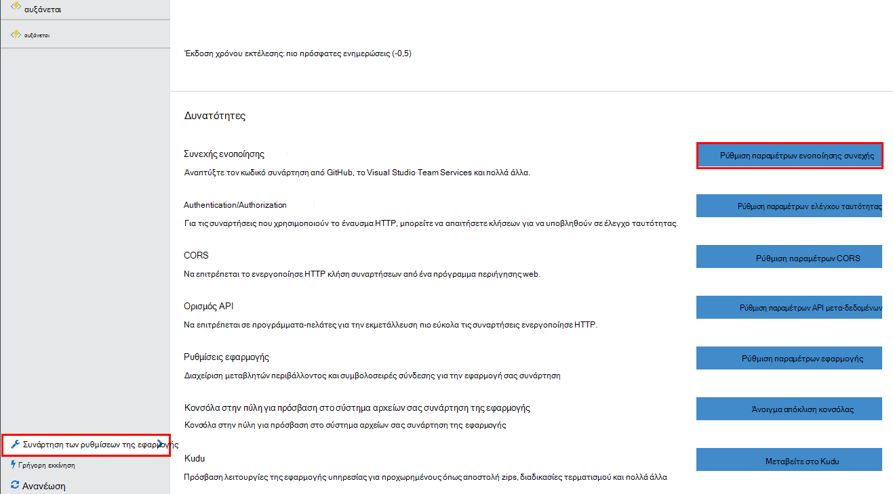
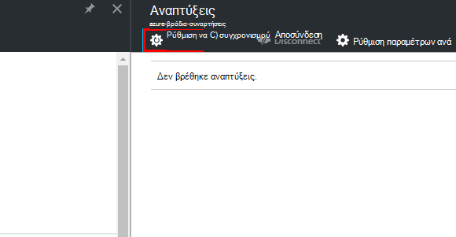
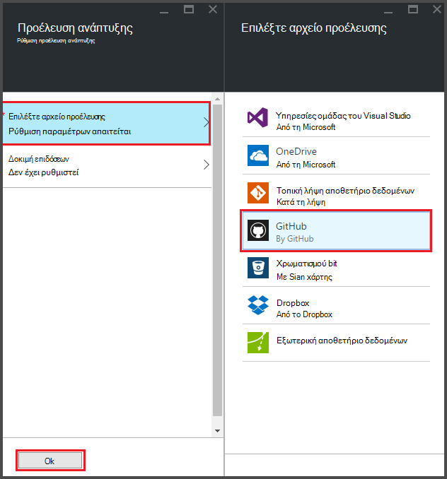
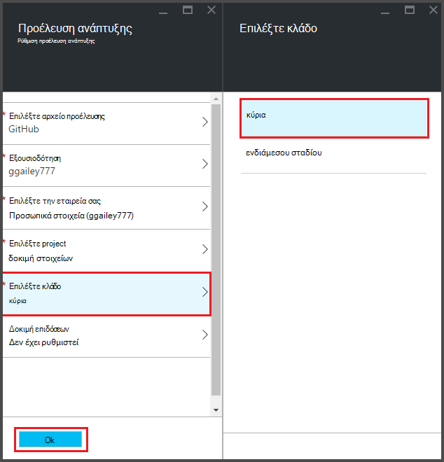
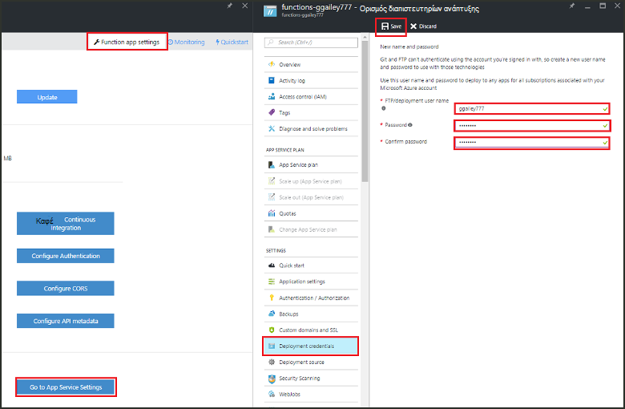
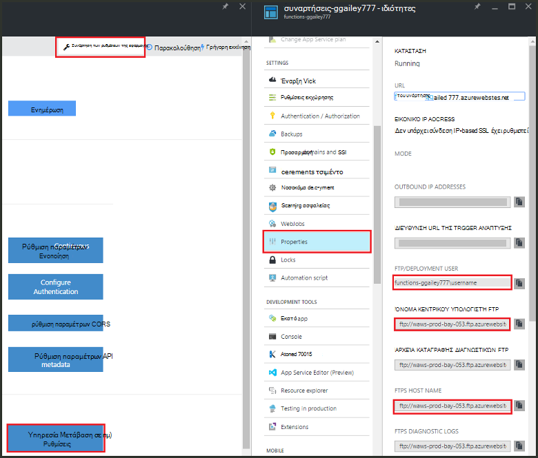
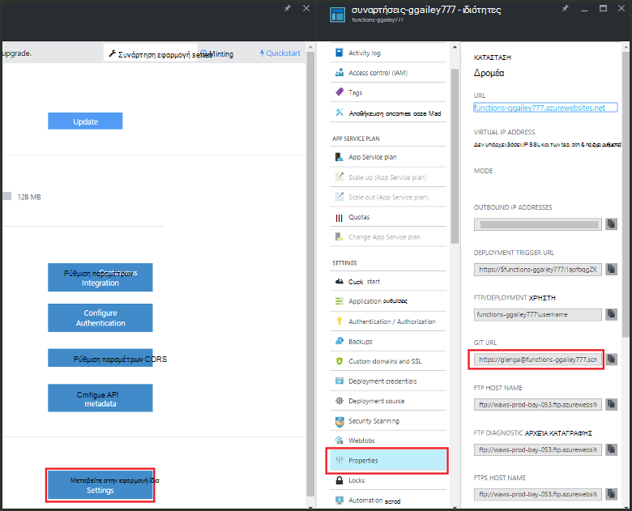

<properties
   pageTitle="Συνεχής ανάπτυξης για τις συναρτήσεις Azure | Microsoft Azure"
   description="Χρησιμοποιείτε δυνατότητες συνεχούς ανάπτυξης του Azure εφαρμογής υπηρεσίας για να δημοσιεύσετε τις συναρτήσεις Azure."
   services="functions"
   documentationCenter="na"
   authors="ggailey777"
   manager="erikre"
   editor=""
   tags=""
   />

<tags
   ms.service="functions"
   ms.devlang="multiple"
   ms.topic="article"
   ms.tgt_pltfrm="multiple"
   ms.workload="na"
   ms.date="09/25/2016"
   ms.author="glenga"/>

# Συνεχής ανάπτυξης για τις συναρτήσεις Azure 

Συναρτήσεις Azure διευκολύνει να ρυθμίσετε τις παραμέτρους για την εφαρμογή σας συνάρτηση συνεχής ανάπτυξη. Συναρτήσεις αξιοποιεί Azure εφαρμογής υπηρεσίας ενοποίηση με το BitBucket, Dropbox, GitHub και υπηρεσίες ομάδας Visual Studio (VSTS) για να ενεργοποιήσετε μια ροή εργασίας συνεχούς ανάπτυξης όπου Azure χρησιμοποιεί τα ενημερώσεις για τον κωδικό συναρτήσεις όταν έχουν δημοσιευθεί σε μία από αυτές τις υπηρεσίες. Εάν είστε νέος χρήστης του Azure συναρτήσεις, ξεκινήστε με [Επισκόπηση συναρτήσεις Azure](functions-overview.md).

Συνεχής ανάπτυξη είναι μια εξαιρετική επιλογή για τα έργα όπου πολλές και συχνές εισφορών ενσωματώνονται. Αυτό σας επιτρέπει επίσης να διατηρήσετε ελέγχου προέλευσης σε τον κωδικό συναρτήσεις. Υποστηρίζονται αυτήν τη στιγμή τις ακόλουθες προελεύσεις ανάπτυξη:

+ [Bitbucket](https://bitbucket.org/)
+ [Dropbox](https://bitbucket.org/)
+ [Τοπική repo Git](../app-service-web/app-service-deploy-local-git.md)
+ Εξωτερική repo Git
+ [GitHub]
+ Mercurial εξωτερικών repo
+ [OneDrive](https://onedrive.live.com/)
+ Υπηρεσίες ομάδας του Visual Studio

Αναπτύξεις έχουν ρυθμιστεί με βάση ανά συνάρτηση-εφαρμογής. Μετά την ενεργοποίηση της συνεχούς ανάπτυξης, πρόσβαση σε συνάρτηση κώδικα στην πύλη έχει οριστεί σε *μόνο για ανάγνωση*.

## Απαιτήσεις συνεχούς ανάπτυξης

Πρέπει να έχετε την προέλευση ανάπτυξης έχει ρυθμιστεί και τον κωδικό συναρτήσεις στην προέλευση ανάπτυξης πριν από την που γίνεται η ρύθμιση συνεχής ανάπτυξη. Σε μια ανάπτυξη εφαρμογής δεδομένη συνάρτηση, κάθε συνάρτηση βρίσκονται σε έναν δευτερεύοντα κατάλογο με όνομα, το όνομα του καταλόγου είναι το όνομα της συνάρτησης. Αυτήν τη δομή φακέλου είναι ουσιαστικά σας κώδικα της τοποθεσίας. 

[AZURE.INCLUDE [functions-folder-structure](../../includes/functions-folder-structure.md)]

## Σύσταση συνεχούς ανάπτυξης

Χρησιμοποιήστε την ακόλουθη διαδικασία για να ρυθμίσετε τις παραμέτρους για μια υπάρχουσα εφαρμογή συνάρτηση συνεχής ανάπτυξη:

1. Στην εφαρμογή της συνάρτησης στην [πύλη του Azure συναρτήσεις](https://functions.azure.com/signin), κάντε κλικ στην επιλογή **Ρυθμίσεις εφαρμογής συνάρτηση** > **συνεχόμενη ρύθμιση παραμέτρων ενοποίησης** > **το πρόγραμμα εγκατάστασης**.

    
    
    
    
    Μπορείτε επίσης να μεταβείτε στην το blade αναπτύξεις από τη γρήγορη έναρξη συναρτήσεις κάνοντας κλικ στην επιλογή **Έναρξη από την προέλευση στοιχείου ελέγχου**.

2. Στο το blade αναπτύξεις, κάντε κλικ στην **Επιλογή προέλευσης**, στη συνέχεια, fill-in τις πληροφορίες για την ανάπτυξη του επιλεγμένου προέλευση και κάντε κλικ στο κουμπί **OK**.

    

Μετά τη ρύθμιση παραμέτρων συνεχούς ανάπτυξης, όλα τα αρχεία αλλαγές στο αρχείο προέλευσης ανάπτυξης αντιγράφονται στην εφαρμογή συνάρτηση και ενεργοποιηθεί μια ανάπτυξη του πλήρους τοποθεσίας. Στην τοποθεσία είναι επαναληφθεί η ανάπτυξη όταν ενημερώνονται τα αρχεία στο αρχείο προέλευσης.

##Επιλογές ανάπτυξης

Ακολουθούν ορισμένα σενάρια τυπικές ανάπτυξη:

+ 

###Δημιουργία μιας ενδιάμεσου σταδίου ανάπτυξης

Συνάρτηση εφαρμογές ακόμη δεν υποστηρίζει υποδοχές ανάπτυξης. Ωστόσο, εξακολουθείτε να μπορείτε να διαχειριστείτε ξεχωριστή αναπτύξεις δημιουργίας σταδίων και παραγωγής χρησιμοποιώντας συνεχής ενοποίησης.

Η διαδικασία για να ρυθμίσετε τις παραμέτρους και να εργαστείτε με μια ανάπτυξη του ενδιάμεσου σταδίου γενικά μοιάζει κάπως έτσι:

1. Δημιουργήστε δύο συνάρτηση εφαρμογών στη συνδρομή σας, μία για τον κωδικό παραγωγής και μία για ενδιάμεσου σταδίου. 

2. Δημιουργήστε μια προέλευση ανάπτυξης, εάν δεν έχετε ήδη ένα. Θα χρησιμοποιήσουμε [GitHub].
 
3. Για εφαρμογή της συνάρτησης παραγωγής, ολοκληρώστε τα παραπάνω βήματα στην **εγκατάσταση συνεχής ανάπτυξη** και ρύθμιση στον κλάδο ανάπτυξης για να τον κύριο κλάδο της σας repo GitHub.

    

4. Επαναλάβετε αυτό το βήμα για την εφαρμογή συνάρτηση ενδιάμεσου σταδίου, αλλά αυτήν τη φορά, επιλέξτε το ενδιάμεσου σταδίου κλάδο στο σας repo GitHub. Εάν το αρχείο προέλευσης ανάπτυξης δεν υποστηρίζει διακλάδωσης, χρησιμοποιήστε ένα διαφορετικό φάκελο.
 
5. Κάνετε ενημερώσεις κώδικα στο ενδιάμεσου σταδίου κλάδο ή το φάκελο και, στη συνέχεια, βεβαιωθείτε ότι αυτές οι αλλαγές αντικατοπτρίζονται στην ανάπτυξη ενδιάμεσου σταδίου.

6. Μετά τη δοκιμή, συγχώνευση αλλαγών από τον ενδιάμεσου σταδίου κλάδο στο το πρωτότυπο διακλάδωση. Αυτό θα ενεργοποιήσει ανάπτυξης στην εφαρμογή συνάρτηση παραγωγής. Εάν το αρχείο προέλευσης ανάπτυξης δεν υποστηρίζει διακλαδώσεις, να αντικαταστήσετε τα αρχεία στο φάκελο παραγωγής με τα αρχεία από το φάκελο ενδιάμεσου σταδίου.

###Μετακίνηση υπάρχουσες συναρτήσεις συνεχούς ανάπτυξης

Όταν έχετε υπάρχοντα συναρτήσεις που έχετε δημιουργήσει και διατηρούνται στην πύλη, πρέπει να κάνετε λήψη τα υπάρχοντα αρχεία κώδικα συνάρτηση χρησιμοποιώντας FTP ή το τοπικό αρχείο φύλαξης Git πριν να μπορούν να ρυθμίζουν συνεχούς ανάπτυξης όπως περιγράφεται παραπάνω. Μπορείτε να το κάνετε στις ρυθμίσεις εφαρμογής υπηρεσίας για την εφαρμογή σας συνάρτηση. Μετά τη λήψη των αρχείων σας, μπορείτε να τα αποστείλετε σε προέλευση επιλεγμένο συνεχούς ανάπτυξης.

>[AZURE.NOTE]Αφού ρυθμίσετε συνεχής ενοποίησης, δεν είναι πλέον θα μπορείτε να επεξεργαστείτε αρχεία προέλευσης στην πύλη του συναρτήσεις.

####Πώς μπορείτε να: ρύθμιση παραμέτρων ανάπτυξης διαπιστευτήρια
Πριν να κάνετε λήψη αρχείων από την εφαρμογή συνάρτησης, πρέπει να ρυθμίσετε τα διαπιστευτήριά σας για να αποκτήσετε πρόσβαση στην τοποθεσία, το οποίο μπορείτε να κάνετε από την πύλη. Διαπιστευτήρια έχουν οριστεί στο επίπεδο εφαρμογής της συνάρτησης.

1. Στην εφαρμογή της συνάρτησης στην [πύλη του Azure συναρτήσεις](https://functions.azure.com/signin), κάντε κλικ στην επιλογή **Ρυθμίσεις εφαρμογής συνάρτηση** > **ρυθμίσεων εφαρμογής υπηρεσίας** > **ανάπτυξης διαπιστευτήρια**.

    

2. Πληκτρολογήστε ένα όνομα χρήστη και τον κωδικό πρόσβασης και, στη συνέχεια, κάντε κλικ στην επιλογή **Αποθήκευση**. Τώρα, μπορείτε να χρησιμοποιήσετε αυτά τα διαπιστευτήρια για πρόσβαση στην εφαρμογή της συνάρτησης από FTP ή την ενσωματωμένη repo Git.

####Πώς μπορείτε να: λήψη αρχείων μέσω FTP

1. Στην εφαρμογή της συνάρτησης στην [πύλη του Azure συναρτήσεις](https://functions.azure.com/signin), κάντε κλικ στην επιλογή **Ρυθμίσεις εφαρμογής συνάρτηση** > **ρυθμίσεων εφαρμογής υπηρεσίας** > **Ιδιότητες** και αντιγράψτε τις τιμές για το **Χρήστη FTP/ανάπτυξης**, **Όνομα κεντρικού υπολογιστή FTP**και **FTPS όνομα κεντρικού υπολογιστή**.  
**Ανάπτυξη/FTP χρήστη** πρέπει να εισάγονται όπως εμφανίζεται στην πύλη, συμπεριλαμβανομένου του ονόματος της εφαρμογής για να παρέχουν ενήμερος για το διακομιστή FTP.

    
    
2. Από το πρόγραμμα-πελάτη FTP, χρησιμοποιήστε τις πληροφορίες σύνδεσης συγκεντρώσατε για να συνδεθείτε με την εφαρμογή και κάντε λήψη των αρχείων προέλευσης για τις συναρτήσεις.

####Πώς μπορείτε να: λήψη αρχείων με χρήση του τοπικού αποθετηρίου Git

1. Στην εφαρμογή της συνάρτησης στην [πύλη του Azure συναρτήσεις](https://functions.azure.com/signin), κάντε κλικ στην επιλογή **Ρυθμίσεις εφαρμογής συνάρτηση** > **συνεχούς ρύθμιση παραμέτρων ενοποίησης** > **εγκατάστασης**.

2. Στο το blade αναπτύξεις, κάντε κλικ στην **επιλογή προέλευση**, **τοπικό Git αποθετήριο**, στη συνέχεια, κάντε κλικ στο κουμπί **OK**.
 
3. Κάντε κλικ στην επιλογή **Μετάβαση στις ρυθμίσεις εφαρμογής υπηρεσίας** > **Ιδιότητες** και σημειώστε την τιμή της διεύθυνσης URL Git. 
    
    

4. Δημιουργία διπλότυπου το repo στον τοπικό υπολογιστή σας χρησιμοποιώντας μια γραμμή εντολών Git υπόψη ή σας αγαπημένες εργαλείο Git. Η εντολή κλωνοποίηση Git μοιάζει με τα εξής:

        git clone https://username@my-function-app.scm.azurewebsites.net:443/my-function-app.git

5. Λήψη αρχείων από την εφαρμογή συνάρτηση για να την κλωνοποίηση στον τοπικό υπολογιστή σας, όπως στο ακόλουθο παράδειγμα:

        git pull origin master

    Εάν σας ζητηθεί, δώστε το όνομα χρήστη και τον κωδικό πρόσβασης για την ανάπτυξη εφαρμογών συνάρτηση.  

[GitHub]: https://github.com/
