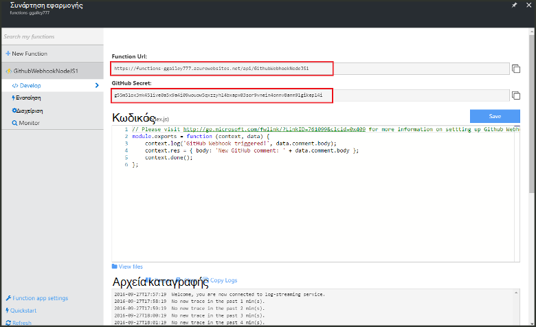

<properties
   pageTitle="Δημιουργία κλεισίματος web ή συνάρτηση Azure API | Microsoft Azure"
   description="Χρησιμοποιήστε συναρτήσεις Azure για να δημιουργήσετε μια συνάρτηση που ενεργοποιείται από WebHook ή API κλήση."
   services="azure-functions"
   documentationCenter="na"
   authors="ggailey777"
   manager="erikre"
   editor=""
   tags=""
   />

<tags
   ms.service="functions"
   ms.devlang="multiple"
   ms.topic="get-started-article"
   ms.tgt_pltfrm="multiple"
   ms.workload="na"
   ms.date="08/30/2016"
   ms.author="glenga"/>
   
# Δημιουργία webhook ή συνάρτηση Azure API

Azure συναρτήσεις είναι μια εμπειρία βάσει συμβάντων, υπολογισμού on demand που παρέχει τη δυνατότητα να δημιουργήσετε έχει προγραμματιστεί ή ενεργοποίησε μονάδες κώδικα υλοποιηθεί σε διάφορες γλώσσες προγραμματισμού. Για να μάθετε περισσότερα σχετικά με τις συναρτήσεις Azure, ανατρέξτε στο θέμα η [Επισκόπηση συναρτήσεις Azure](functions-overview.md).

Αυτό το θέμα δείχνει πώς μπορείτε να δημιουργήσετε μια νέα συνάρτηση Node.js που ενεργοποιείται από ένα webhook GitHub. Τη νέα συνάρτηση δημιουργείται με βάση ένα πρότυπο προκαθορισμένες στην πύλη του Azure συναρτήσεις. Μπορείτε επίσης να δείτε ένα σύντομο βίντεο για να δείτε πώς αυτά τα βήματα πραγματοποιούνται στην πύλη.

## Παρακολουθήστε το βίντεο

Το βίντεο που ακολουθεί δείχνουν πώς μπορείτε να εκτελέσετε τα βασικά βήματα σε αυτό το πρόγραμμα εκμάθησης 

[AZURE.VIDEO create-a-web-hook-or-api-azure-function]

##Δημιουργία μιας συνάρτησης ενεργοποίησε webhook από το πρότυπο

Μια εφαρμογή συνάρτηση φιλοξενεί την εκτέλεση του συναρτήσεων στο Azure. Για να δημιουργήσετε μια συνάρτηση, πρέπει να έχετε ένα λογαριασμό Azure active. Εάν δεν έχετε ήδη λογαριασμό Azure, [δωρεάν λογαριασμοί είναι διαθέσιμες](https://azure.microsoft.com/free/). 

1. Μεταβείτε στην [πύλη του Azure συναρτήσεις](https://functions.azure.com/signin) και πραγματοποιήστε είσοδο με το λογαριασμό σας Azure.

2. Εάν έχετε μια υπάρχουσα εφαρμογή συνάρτηση για να χρησιμοποιήσετε, επιλέξτε την από **τις εφαρμογές σας συνάρτηση** , στη συνέχεια, κάντε κλικ στην επιλογή **Άνοιγμα**. Για να δημιουργήσετε μια νέα εφαρμογή συνάρτηση, πληκτρολογήστε ένα μοναδικό **όνομα** για τη νέα εφαρμογή συνάρτηση ή αποδεχτείτε αυτήν που δημιουργήθηκε, επιλέξτε την προτιμώμενη **περιοχή**και κατόπιν κάντε κλικ στην επιλογή **Δημιουργία + γρήγορα αποτελέσματα**. 

3. Στην εφαρμογή της συνάρτησης, κάντε κλικ στο κουμπί **+ νέα συνάρτηση** > **GitHub Webhook - κόμβου** > **Δημιουργία**. Αυτό δημιουργεί μια συνάρτηση με ένα προεπιλεγμένο όνομα που βασίζεται στο καθορισμένο πρότυπο. 

     

4. Στην **Ανάπτυξη**, σημειώστε τη συνάρτηση express.js δείγμα στο παράθυρο **κώδικα** . Αυτή η συνάρτηση λαμβάνει μια αίτηση GitHub από ένα ζήτημα webhook σχολίου, καταγράφει το κείμενο το ζήτημα και αποστέλλει μια απόκριση το webhook ως `New GitHub comment: <Your issue comment text>`.

     

5. Αντιγράψτε τις τιμές **Συνάρτηση URL** και **Μυστικό GitHub** . Θα χρειαστείτε τα εξής κατά τη δημιουργία του webhook στο GitHub. 

6. Κάντε κύλιση προς τα κάτω για **Εκτέλεση**, σημειώστε σώμα JSON προκαθορισμένο θέμα σχολίου στο σώμα της αίτησης και, στη συνέχεια, κάντε κλικ στην επιλογή **Εκτέλεση**. 
 
    Μπορείτε πάντα να δοκιμάσετε μια νέα συνάρτηση βασίζεται στο πρότυπο δεξιά στην καρτέλα **Ανάπτυξη** , παρέχοντας οποιαδήποτε αναμένεται σώμα δεδομένων JSON και κάνοντας κλικ στο κουμπί **Εκτέλεση** . Σε αυτήν την περίπτωση, το πρότυπο έχει ένα προκαθορισμένο σώμα ενός σχολίου το ζήτημα. 
 
Στη συνέχεια, θα μπορείτε να δημιουργήσετε την πραγματική webhook στο αποθετήριο σας GitHub.

##Ρύθμιση παραμέτρων του webhook

1. Στο GitHub, μεταβείτε σε ένα αποθετήριο δεδομένων που έχετε στην κατοχή; Αυτό περιλαμβάνει οποιονδήποτε αποθετήρια που που έχουν forked.
 
2. Κάντε κλικ στην επιλογή **Ρυθμίσεις** > **Webhooks & υπηρεσίες** > **webhook Προσθήκη**.

       

3. Επικολλήστε διεύθυνση URL και το μυστικό της συνάρτησης σας σε **Διεύθυνση URL φορτίο** και **μυστικό**, στη συνέχεια, κάντε κλικ στην επιλογή **να επιτρέπεται να επιλέξετε μεμονωμένα συμβάντα**, επιλέξτε **το θέμα σχολίου** και κάντε κλικ στην επιλογή **Προσθήκη webhook**.

     

Σε αυτό το σημείο, τα GitHub webhook έχει ρυθμιστεί ώστε να έναυσμα λειτουργία σας όταν προστίθεται ένα νέο σχόλιο το ζήτημα.  
Τώρα είναι ώρα για να ελέγξετε την προβολή.

##Δοκιμή της συνάρτησης

1. Στο σας repo GitHub, ανοίξτε την καρτέλα **θέματα** σε νέο παράθυρο του προγράμματος περιήγησης, κάντε κλικ στην επιλογή **Νέο θέμα**, πληκτρολογήστε έναν τίτλο, στη συνέχεια, κάντε κλικ στην επιλογή **Υποβολή νέο θέμα**. Μπορείτε επίσης να ανοίξετε ένα υπάρχον θέμα.

2. Στο το θέμα, πληκτρολογήστε ένα σχόλιο και κάντε κλικ στο **Σχόλιο**. Σε αυτό το σημείο, μπορείτε να επιστρέψετε το νέο webhook στο GitHub και στην περιοχή **Πρόσφατες παραδόσεις** ανατρέξτε στο θέμα που έχει σταλεί μια αίτηση webhook και που βρίσκεται στο κυρίως σώμα της απόκρισης `New GitHub comment: <Your issue comment text>`.

3. Επιστροφή στην πύλη του συναρτήσεις, κάντε κύλιση προς τα κάτω, τα αρχεία καταγραφής και να δείτε ότι η συνάρτηση ενεργοποιήθηκε και την τιμή `New GitHub comment: <Your issue comment text>` είναι γραμμένο στα αρχεία καταγραφής ροής.

##Επόμενα βήματα

Ανατρέξτε στα παρακάτω θέματα για περισσότερες πληροφορίες σχετικά με τις συναρτήσεις Azure.

+ [Αναφορά προγραμματιστών Azure συναρτήσεις](functions-reference.md)  
Αναφορά προγραμματιστή για κωδικοποίησης συναρτήσεις.
+ [Δοκιμές Azure συναρτήσεις](functions-test-a-function.md)  
Περιγράφει διάφορα εργαλεία και τεχνικές για σκοπούς δοκιμής σας συναρτήσεις.
+ [Τρόπος για να κλιμακωθεί Azure συναρτήσεις](functions-scale.md)  
Ασχολείται με προγράμματα υπηρεσίας διαθέσιμη με το Azure συναρτήσεις, όπως το πρόγραμμα υπηρεσιών δυναμικής και πώς μπορείτε να επιλέξετε το σωστό πρόγραμμα.  

[AZURE.INCLUDE [Getting Started Note](../../includes/functions-get-help.md)]
