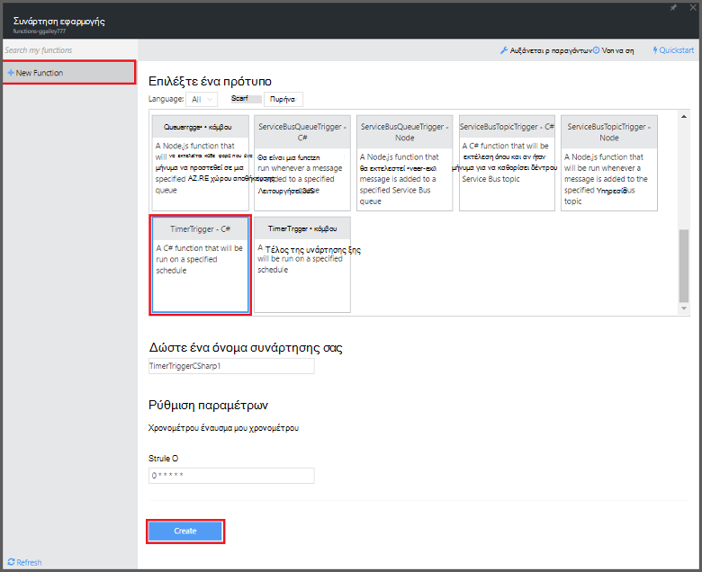

<properties
   pageTitle="Δημιουργία συμβάντος επεξεργασίας συνάρτηση | Microsoft Azure"
   description="Χρησιμοποιήστε συναρτήσεις Azure Δημιουργήστε μια συνάρτηση C# που εκτελείται με βάση χρονοδιακόπτη συμβάν."
   services="functions"
   documentationCenter="na"
   authors="ggailey777"
   manager="erikre"
   editor=""
   tags=""
   />

<tags
   ms.service="functions"
   ms.devlang="multiple"
   ms.topic="get-started-article"
   ms.tgt_pltfrm="multiple"
   ms.workload="na"
   ms.date="09/25/2016"
   ms.author="glenga"/>
   
# Δημιουργία συμβάντος επεξεργασίας συνάρτηση Azure

Azure συναρτήσεις είναι μια εμπειρία βάσει συμβάντων, υπολογισμού on demand που παρέχει τη δυνατότητα να δημιουργήσετε έχει προγραμματιστεί ή ενεργοποίησε μονάδες κώδικα υλοποιηθεί σε διάφορες γλώσσες προγραμματισμού. Για να μάθετε περισσότερα σχετικά με τις συναρτήσεις Azure, ανατρέξτε στο θέμα η [Επισκόπηση συναρτήσεις Azure](functions-overview.md).

Αυτό το θέμα δείχνει πώς μπορείτε να δημιουργήσετε μια νέα συνάρτηση στο C# που εκτελεί βάσει χρονοδιακόπτη συμβάντος για να προσθέσετε τα μηνύματα σε μια ουρά χώρου αποθήκευσης. 

## Προαπαιτούμενα στοιχεία 

Για να δημιουργήσετε μια συνάρτηση, πρέπει να έχετε ένα λογαριασμό Azure active. Εάν δεν έχετε ήδη λογαριασμό Azure, [δωρεάν λογαριασμοί είναι διαθέσιμες](https://azure.microsoft.com/free/).

## Δημιουργία μιας συνάρτησης ενεργοποίησε χρονόμετρο από το πρότυπο

Μια εφαρμογή συνάρτηση φιλοξενεί την εκτέλεση του συναρτήσεων στο Azure. Για να δημιουργήσετε μια συνάρτηση, πρέπει να έχετε ένα λογαριασμό Azure active. Εάν δεν έχετε ήδη λογαριασμό Azure, [δωρεάν λογαριασμοί είναι διαθέσιμες](https://azure.microsoft.com/free/). 

1. Μεταβείτε στην [πύλη του Azure συναρτήσεις](https://functions.azure.com/signin) και πραγματοποιήστε είσοδο με το λογαριασμό σας Azure.

2. Εάν έχετε μια υπάρχουσα εφαρμογή συνάρτηση για να χρησιμοποιήσετε, επιλέξτε την από **τις εφαρμογές σας συνάρτηση** , στη συνέχεια, κάντε κλικ στην επιλογή **Άνοιγμα**. Για να δημιουργήσετε μια νέα εφαρμογή συνάρτηση, πληκτρολογήστε ένα μοναδικό **όνομα** για τη νέα εφαρμογή συνάρτηση ή αποδεχτείτε αυτήν που δημιουργήθηκε, επιλέξτε την προτιμώμενη **περιοχή**και κατόπιν κάντε κλικ στην επιλογή **Δημιουργία + γρήγορα αποτελέσματα**. 

3. Στην εφαρμογή της συνάρτησης, κάντε κλικ στο κουμπί **+ νέα συνάρτηση** > **TimerTrigger - C#** > **Δημιουργία**. Αυτό δημιουργεί μια συνάρτηση με ένα προεπιλεγμένο όνομα που εκτελείται στο προεπιλεγμένο χρονοδιάγραμμα μία φορά κάθε λεπτού. 

    

4. Στο σας νέα συνάρτηση, κάντε κλικ στην καρτέλα **ενσωματώσουν** > **Νέα εξόδου** > **Azure αποθήκευσης ουρά** > **Επιλέξτε**.

    

5. Στην **ουρά αποθήκευσης Azure εξόδου**, επιλέξτε μια υπάρχουσα **Σύνδεση λογαριασμού χώρου αποθήκευσης**, ή δημιουργήστε ένα νέο και, στη συνέχεια, κάντε κλικ στην επιλογή **Αποθήκευση**. 

    

6. Επιστρέψτε στην καρτέλα **Ανάπτυξη** , αντικαταστήστε την υπάρχουσα C# δέσμη ενεργειών στο παράθυρο **κώδικα** με τον ακόλουθο κώδικα:

        using System;
        
        public static void Run(TimerInfo myTimer, out string outputQueueItem, TraceWriter log)
        {
            // Add a new scheduled message to the queue.
            outputQueueItem = $"Ping message added to the queue at: {DateTime.Now}.";
            
            // Also write the message to the logs.
            log.Info(outputQueueItem);
        }

    Αυτός ο κωδικός προσθέτει ένα νέο μήνυμα στην ουρά με την τρέχουσα ημερομηνία και ώρα κατά την εκτέλεση της συνάρτησης.

7. Κάντε κλικ στην επιλογή **Αποθήκευση** και παρακολούθηση των παραθύρων **αρχεία καταγραφής** για την εκτέλεση της επόμενης συνάρτηση.

8. (Προαιρετικό) Μεταβείτε στο λογαριασμό του χώρου αποθήκευσης και βεβαιωθείτε ότι τα μηνύματα που προστίθενται στην ουρά.

9. Επιστρέψτε στην καρτέλα **ενσωματώσουν** και αλλάξτε το πεδίο "Χρονοδιάγραμμα" `0 0 * * * *`. Τώρα, η συνάρτηση εκτελεί μία φορά κάθε ώρα. 

Αυτή είναι μια πολύ απλοποιημένη παράδειγμα ένα έναυσμα χρονόμετρο και μια ουρά αποθήκευσης εξόδου σύνδεσης. Για περισσότερες πληροφορίες, ανατρέξτε στο θέμα [έναυσμα χρονόμετρο Azure συναρτήσεις](functions-bindings-timer.md) και τα θέματα [συναρτήσεις Azure εναύσματα και συνδέσεις για το χώρο αποθήκευσης Azure](functions-bindings-storage.md) .

##Επόμενα βήματα

Ανατρέξτε στα παρακάτω θέματα για περισσότερες πληροφορίες σχετικά με τις συναρτήσεις Azure.

+ [Αναφορά προγραμματιστών Azure συναρτήσεις](functions-reference.md)  
Αναφορά προγραμματιστή για κωδικοποίηση συναρτήσεις και τον ορισμό εναύσματα και συνδέσεις.
+ [Δοκιμές Azure συναρτήσεις](functions-test-a-function.md)  
Περιγράφει διάφορα εργαλεία και τεχνικές για σκοπούς δοκιμής σας συναρτήσεις.
+ [Τρόπος για να κλιμακωθεί Azure συναρτήσεις](functions-scale.md)  
Ασχολείται με προγράμματα υπηρεσίας διαθέσιμη με το Azure συναρτήσεις, όπως το πρόγραμμα υπηρεσιών δυναμικής και πώς μπορείτε να επιλέξετε το σωστό πρόγραμμα.  

[AZURE.INCLUDE [Getting Started Note](../../includes/functions-get-help.md)]
