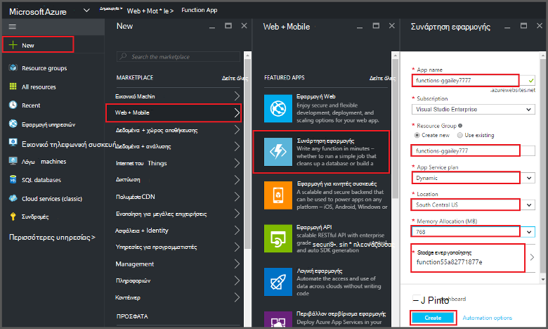
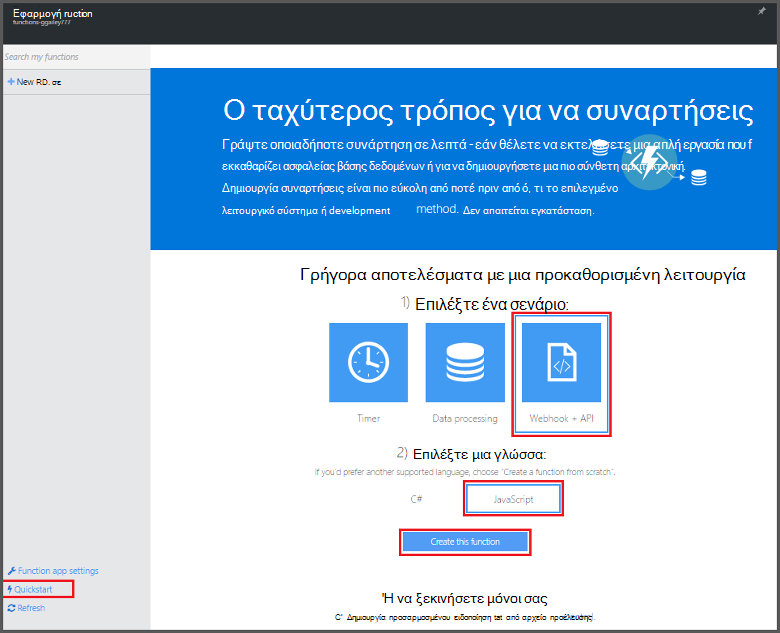
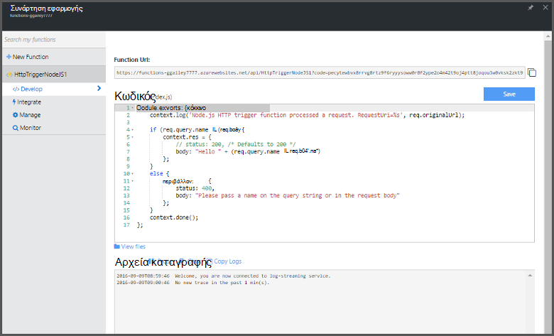

<properties
   pageTitle="Δημιουργία μιας συνάρτησης από την πύλη του Azure | Microsoft Azure"
   description="Δημιουργήστε το πρώτο συνάρτηση Azure, μια εφαρμογή εγγραφή χωρίς διακομιστή, σε λιγότερο από δύο λεπτά."
   services="functions"
   documentationCenter="na"
   authors="ggailey777"
   manager="erikre"
   editor=""
   tags=""
/>

<tags
   ms.service="functions"
   ms.devlang="multiple"
   ms.topic="article"
   ms.tgt_pltfrm="multiple"
   ms.workload="na"
   ms.date="09/08/2016"
   ms.author="glenga"/>

#Δημιουργία μιας συνάρτησης από την πύλη του Azure

##Επισκόπηση
Azure συναρτήσεις είναι μια εμπειρία βάσει συμβάντων, υπολογισμού on demand που επεκτείνει την υπάρχουσα Azure εφαρμογή πλατφόρμα με δυνατότητες για την υλοποίηση κώδικα που ενεργοποιούνται από συμβάντα που συμβαίνουν σε άλλες υπηρεσίες του Azure, ΑΔΑ προϊόντα και συστήματα εσωτερικής εγκατάστασης. Με τις συναρτήσεις Azure, τις εφαρμογές σας κλίμακα βάσει απαιτήσεων και πληρώνετε μόνο για τους πόρους που εκμετάλλευση. Azure συναρτήσεις επιτρέπει να δημιουργήσετε προγραμματισμένες ή ενεργοποίησε μονάδες κώδικα υλοποιηθεί σε διάφορες γλώσσες προγραμματισμού. Για να μάθετε περισσότερα σχετικά με τις συναρτήσεις Azure, ανατρέξτε στο θέμα η [Επισκόπηση συναρτήσεις Azure](functions-overview.md).

Αυτό το θέμα δείχνει πώς μπορείτε να χρησιμοποιήσετε την πύλη του Azure για να δημιουργήσετε μια απλή "Χαίρετε" συνάρτηση Azure Node.js που ενεργοποιείται από ένα έναυσμα HTTP. Μπορείτε να δημιουργήσετε μια συνάρτηση στην πύλη του Azure, πρέπει να δημιουργήσετε ρητά μια εφαρμογή συνάρτηση στο Azure εφαρμογής υπηρεσίας. Για να έχετε την εφαρμογή συνάρτηση δημιουργείται αυτόματα για εσάς, ανατρέξτε στην [άλλη εκμάθηση γρήγορη έναρξη Azure συναρτήσεις](functions-create-first-azure-function.md), το οποίο είναι ένα απλούστερο εμπειρία γρήγορη έναρξη και περιλαμβάνει ένα βίντεο.

##Δημιουργία εφαρμογής συνάρτηση

Μια εφαρμογή συνάρτηση φιλοξενεί την εκτέλεση του συναρτήσεων στο Azure. Ακολουθήστε τα παρακάτω βήματα για να δημιουργήσετε μια εφαρμογή συνάρτηση στην πύλη του Azure.

Για να δημιουργήσετε την πρώτη συνάρτηση, πρέπει να έχετε ένα λογαριασμό Azure active. Εάν δεν έχετε ήδη λογαριασμό Azure, [δωρεάν λογαριασμοί είναι διαθέσιμες](https://azure.microsoft.com/free/).

1. Μεταβείτε στην [πύλη του Azure](https://portal.azure.com) και πραγματοποιήστε είσοδο με το λογαριασμό σας Azure.

2. Κάντε κλικ στο κουμπί **+ νέα** > **Web + Mobile** > **Συνάρτηση εφαρμογής**, επιλέξτε σας **συνδρομή**, πληκτρολογήστε ένα μοναδικό **όνομα εφαρμογής** που προσδιορίζει την εφαρμογή της συνάρτησης, στη συνέχεια, καθορίστε τις ακόλουθες ρυθμίσεις:

    + **[Ομάδα πόρων](../azure-portal/resource-group-portal.md/)**: Επιλέξτε **Δημιουργία νέου** και πληκτρολογήστε ένα όνομα για τη νέα ομάδα πόρων. Μπορείτε επίσης να επιλέξετε μια υπάρχουσα ομάδα πόρων, ωστόσο μπορεί να μην μπορείτε να δημιουργήσετε μια δυναμική πρόγραμμα εφαρμογής υπηρεσίας για την εφαρμογή σας συνάρτηση.
    + **[Πρόγραμμα εφαρμογής υπηρεσίας](../app-service/azure-web-sites-web-hosting-plans-in-depth-overview.md)**: Επιλέξτε *δυναμικής* ή *κλασική*. 
        + **Δυναμική**: Ο προεπιλεγμένος τύπος πρόγραμμα για τις συναρτήσεις Azure. Όταν επιλέγετε ένα δυναμικό σχέδιο, πρέπει να επίσης επιλέξτε τη **θέση** και να ορίσετε την **Εκχώρηση μνήμης** (σε MB). Για πληροφορίες σχετικά με τον τρόπο που επηρεάζει εκχώρηση μνήμης κόστος, ανατρέξτε στο θέμα [συναρτήσεις Azure τις πληροφορίες τιμολόγησης](https://azure.microsoft.com/pricing/details/functions/). 
        + **Κλασική**: σε κλασική πρόγραμμα εφαρμογής υπηρεσίας απαιτεί να δημιουργήσετε μια **εφαρμογή υπηρεσίας πρόγραμμα/θέση** ή επιλέξτε ένα υπάρχον. Αυτές οι ρυθμίσεις καθορίζουν τη [θέση, δυνατότητες, κόστους και τον υπολογισμό τους πόρους](https://azure.microsoft.com/pricing/details/app-service/) που σχετίζονται με την εφαρμογή σας.  
    + **Το λογαριασμό χώρου αποθήκευσης**: κάθε εφαρμογή συνάρτηση απαιτεί ένα λογαριασμό του χώρου αποθήκευσης. Μπορείτε να επιλέξετε έναν υπάρχοντα λογαριασμό του χώρου αποθήκευσης ή να δημιουργήσετε μία. 

    

3. Κάντε κλικ στην επιλογή " **Δημιουργία** " για την παροχή των και αναπτύξτε τη νέα εφαρμογή συνάρτηση.  

Τώρα που η εφαρμογή συνάρτηση παρέχεται, μπορείτε να δημιουργήσετε την πρώτη συνάρτηση.

## Δημιουργία μιας συνάρτησης

Αυτά τα βήματα, δημιουργήστε μια συνάρτηση από τη γρήγορη έναρξη Azure συναρτήσεις.

1. Στην καρτέλα **Γρήγορη εκκίνηση** , κάντε κλικ στην επιλογή **WebHook + API** και **JavaScript**και, στη συνέχεια, κάντε κλικ στην επιλογή **Δημιουργία μια συνάρτηση**. Δημιουργείται μια νέα προκαθορισμένη συνάρτηση Node.js. 

    

2. (Προαιρετικό) Σε αυτό το σημείο στο τη Γρήγορη εκκίνηση, μπορείτε να επιλέξετε για να περιηγηθείτε γρήγορα συναρτήσεις Azure δυνατότητες στην πύλη.   Όταν έχετε ολοκληρώσει ή παραλειφθεί η περιήγηση, μπορείτε να ελέγξετε την νέα συνάρτηση, χρησιμοποιώντας το έναυσμα HTTP.

##Δοκιμή της συνάρτησης

Επειδή το γρήγορες εκκινήσεις συναρτήσεις Azure περιέχουν λειτουργική κώδικα, μπορείτε να ελέγξετε αμέσως σας νέα συνάρτηση.

1. Στην καρτέλα " **Ανάπτυξη** ", ελέγξτε το παράθυρο **κώδικα** και παρατηρήστε ότι αυτός ο κωδικός Node.js αναμένει μια αίτηση HTTP με *όνομα* τιμή που μεταβιβάζεται στο κύριο σώμα του μηνύματος ή σε μια συμβολοσειρά ερωτήματος. Κατά την εκτέλεση της συνάρτησης, αυτή η τιμή επιστρέφεται στο μήνυμα απάντησης.

    

2. Κάντε κύλιση προς τα κάτω, στο πλαίσιο κειμένου **σώμα αίτησης** , αλλάξτε την τιμή της ιδιότητας *όνομα* για το όνομά σας και κάντε κλικ στην επιλογή **Εκτέλεση**. Μπορείτε να δείτε ότι εκτέλεσης ενεργοποιείται από μια αίτηση HTTP δοκιμής, πληροφορίες γράφεται τα αρχεία καταγραφής ροής και την απάντηση "hello" εμφανίζεται στο **αποτέλεσμα**. 

3. Για να ενεργοποιήσετε την εκτέλεση της συνάρτησης ίδια από ένα άλλο παράθυρο του προγράμματος περιήγησης ή tab, αντιγράψτε την τιμή **Συνάρτησης διεύθυνση URL** από την καρτέλα **Ανάπτυξη** και επικολλήστε την σε μια γραμμή διευθύνσεων του προγράμματος περιήγησης, στη συνέχεια, η τιμή συμβολοσειράς ερωτήματος προσάρτησης `&name=yourname` και πατήστε το πλήκτρο enter. Είναι γραμμένο τις ίδιες πληροφορίες για τα αρχεία καταγραφής και το πρόγραμμα περιήγησης εμφανίζει την απάντηση "hello" ως πριν από.

##Επόμενα βήματα

Αυτή η γρήγορη έναρξη παρουσιάζει μιας πολύ απλής εκτέλεσης μιας συνάρτησης βασικές ενεργοποίησε HTTP. Ανατρέξτε στα παρακάτω θέματα για περισσότερες πληροφορίες σχετικά με τη χρήση του power Azure συναρτήσεων στις εφαρμογές σας.

+ [Αναφορά προγραμματιστών Azure συναρτήσεις](functions-reference.md)  
Αναφορά προγραμματιστή για κωδικοποίηση συναρτήσεις και τον ορισμό εναύσματα και συνδέσεις.
+ [Δοκιμές Azure συναρτήσεις](functions-test-a-function.md)  
Περιγράφει διάφορα εργαλεία και τεχνικές για σκοπούς δοκιμής σας συναρτήσεις.
+ [Τρόπος για να κλιμακωθεί Azure συναρτήσεις](functions-scale.md)  
Ασχολείται με προγράμματα υπηρεσίας διαθέσιμη με το Azure συναρτήσεις, όπως το πρόγραμμα υπηρεσιών δυναμικής και πώς μπορείτε να επιλέξετε το σωστό πρόγραμμα. 
+ [Τι είναι το Azure εφαρμογής υπηρεσίας;](../app-service/app-service-value-prop-what-is.md)  
Συναρτήσεις Azure χρησιμοποιεί την πλατφόρμα Azure εφαρμογής υπηρεσίας για βασικές λειτουργίες όπως αναπτύξεις μεταβλητές περιβάλλοντος και διαγνωστικά. 

[AZURE.INCLUDE [Getting Started Note](../../includes/functions-get-help.md)]
