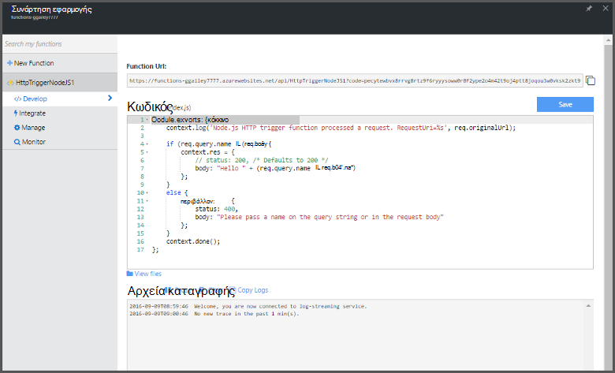

<properties
   pageTitle="Δημιουργία του πρώτου συνάρτησης Azure | Microsoft Azure"
   description="Δημιουργήστε το πρώτο συνάρτηση Azure, μια εφαρμογή εγγραφή χωρίς διακομιστή, σε λιγότερο από δύο λεπτά."
   services="functions"
   documentationCenter="na"
   authors="ggailey777"
   manager="erikre"
   editor=""
   tags=""
/>

<tags
   ms.service="functions"
   ms.devlang="multiple"
   ms.topic="hero-article"
   ms.tgt_pltfrm="multiple"
   ms.workload="na"
   ms.date="09/08/2016"
   ms.author="glenga"/>

#Δημιουργία του πρώτου συνάρτησης Azure

##Επισκόπηση
Azure συναρτήσεις είναι μια εμπειρία βάσει συμβάντων, υπολογισμού on demand που επεκτείνει την υπάρχουσα Azure εφαρμογή πλατφόρμα με δυνατότητες για την υλοποίηση κώδικα που ενεργοποιούνται από συμβάντα που συμβαίνουν σε άλλες υπηρεσίες του Azure, ΑΔΑ προϊόντα και συστήματα εσωτερικής εγκατάστασης. Με τις συναρτήσεις Azure, τις εφαρμογές σας κλίμακα βάσει απαιτήσεων και πληρώνετε μόνο για τους πόρους που εκμετάλλευση. Azure συναρτήσεις επιτρέπει να δημιουργήσετε προγραμματισμένες ή ενεργοποίησε μονάδες κώδικα υλοποιηθεί σε διάφορες γλώσσες προγραμματισμού. Για να μάθετε περισσότερα σχετικά με τις συναρτήσεις Azure, ανατρέξτε στο θέμα η [Επισκόπηση συναρτήσεις Azure](functions-overview.md).

Αυτό το θέμα δείχνει πώς μπορείτε να χρησιμοποιήσετε τη γρήγορη έναρξη Azure συναρτήσεις στην πύλη του για να δημιουργήσετε μια απλή "hello world" Node.js συνάρτηση που ενεργοποιείται από ένα έναυσμα HTTP. Μπορείτε επίσης να δείτε ένα σύντομο βίντεο για να δείτε πώς αυτά τα βήματα πραγματοποιούνται στην πύλη.

## Παρακολουθήστε το βίντεο

Το βίντεο που ακολουθεί δείχνουν πώς μπορείτε να εκτελέσετε τα βασικά βήματα σε αυτό το πρόγραμμα εκμάθησης. 

[AZURE.VIDEO create-your-first-azure-function-simple]

##Δημιουργία μιας συνάρτησης από τη Γρήγορη εκκίνηση

Μια εφαρμογή συνάρτηση φιλοξενεί την εκτέλεση του συναρτήσεων στο Azure. Ακολουθήστε τα παρακάτω βήματα για να δημιουργήσετε μια νέα εφαρμογή συνάρτηση, καθώς και τη νέα συνάρτηση. Η νέα εφαρμογή συνάρτηση δημιουργείται με μια προεπιλεγμένη ρύθμιση παραμέτρων. Για ένα παράδειγμα του τρόπου δημιουργίας ρητά την εφαρμογή συνάρτηση, ανατρέξτε στο θέμα [άλλη εκμάθηση γρήγορη έναρξη Azure συναρτήσεις](functions-create-first-azure-function-azure-portal.md).

Για να δημιουργήσετε την πρώτη συνάρτηση, πρέπει να έχετε ένα λογαριασμό Azure active. Εάν δεν έχετε ήδη λογαριασμό Azure, [δωρεάν λογαριασμοί είναι διαθέσιμες](https://azure.microsoft.com/free/).

1. Μεταβείτε στην [πύλη του Azure συναρτήσεις](https://functions.azure.com/signin) και πραγματοποιήστε είσοδο με το λογαριασμό σας Azure.

2. Πληκτρολογήστε ένα μοναδικό **όνομα** για τη νέα εφαρμογή συνάρτηση ή αποδεχτείτε αυτήν που δημιουργήθηκε, επιλέξτε την προτιμώμενη **περιοχή**και στη συνέχεια κάντε κλικ στην επιλογή **Δημιουργία + γρήγορα αποτελέσματα**. 

3. Στην καρτέλα **Γρήγορη εκκίνηση** , κάντε κλικ στην επιλογή **WebHook + API** και **JavaScript**και, στη συνέχεια, κάντε κλικ στην επιλογή **Δημιουργία μια συνάρτηση**. Δημιουργείται μια νέα προκαθορισμένη συνάρτηση Node.js. 

    

4. (Προαιρετικό) Σε αυτό το σημείο στο τη Γρήγορη εκκίνηση, μπορείτε να επιλέξετε για να περιηγηθείτε γρήγορα συναρτήσεις Azure δυνατότητες στην πύλη.   Όταν έχετε ολοκληρώσει ή παραλειφθεί η περιήγηση, μπορείτε να ελέγξετε την νέα συνάρτηση, χρησιμοποιώντας το έναυσμα HTTP.

##Δοκιμή της συνάρτησης

Επειδή το γρήγορες εκκινήσεις συναρτήσεις Azure περιέχουν λειτουργική κώδικα, μπορείτε να ελέγξετε αμέσως σας νέα συνάρτηση.

1. Στην καρτέλα " **Ανάπτυξη** ", ελέγξτε το παράθυρο **κώδικα** και παρατηρήστε ότι αυτός ο κωδικός Node.js αναμένει μια αίτηση HTTP με *όνομα* τιμή που μεταβιβάζεται στο κύριο σώμα του μηνύματος ή σε μια συμβολοσειρά ερωτήματος. Κατά την εκτέλεση της συνάρτησης, αυτή η τιμή επιστρέφεται στο μήνυμα απάντησης.

    

2. Κάντε κύλιση προς τα κάτω, στο πλαίσιο κειμένου **σώμα αίτησης** , αλλάξτε την τιμή της ιδιότητας *όνομα* για το όνομά σας και κάντε κλικ στην επιλογή **Εκτέλεση**. Θα δείτε ότι εκτέλεσης ενεργοποιείται από μια αίτηση HTTP δοκιμής, πληροφορίες γράφεται τα αρχεία καταγραφής ροής και την απάντηση "hello" εμφανίζεται στο **αποτέλεσμα**. 

3. Για να ενεργοποιήσετε την εκτέλεση της συνάρτησης ίδια από ένα άλλο παράθυρο του προγράμματος περιήγησης ή tab, αντιγράψτε την τιμή **Συνάρτησης διεύθυνση URL** από την καρτέλα **Ανάπτυξη** και επικολλήστε την σε μια γραμμή διευθύνσεων του προγράμματος περιήγησης, στη συνέχεια, η τιμή συμβολοσειράς ερωτήματος προσάρτησης `&name=yourname` και πατήστε το πλήκτρο enter. Είναι γραμμένο τις ίδιες πληροφορίες για τα αρχεία καταγραφής και το πρόγραμμα περιήγησης εμφανίζει την απάντηση "hello" ως πριν από.

##Επόμενα βήματα

Αυτή η γρήγορη έναρξη παρουσιάζει μιας πολύ απλής εκτέλεσης μιας συνάρτησης βασικές ενεργοποίησε HTTP. Ανατρέξτε στα παρακάτω θέματα για περισσότερες πληροφορίες σχετικά με τη χρήση των δυνατοτήτων του Azure συναρτήσεων στις εφαρμογές σας.

+ [Αναφορά προγραμματιστών Azure συναρτήσεις](functions-reference.md)  
Αναφορά προγραμματιστή για κωδικοποίηση συναρτήσεις και τον ορισμό εναύσματα και συνδέσεις.
+ [Δοκιμές Azure συναρτήσεις](functions-test-a-function.md)  
Περιγράφει διάφορα εργαλεία και τεχνικές για σκοπούς δοκιμής σας συναρτήσεις.
+ [Τρόπος για να κλιμακωθεί Azure συναρτήσεις](functions-scale.md)  
Ασχολείται με προγράμματα υπηρεσίας διαθέσιμη με το Azure συναρτήσεις, όπως το πρόγραμμα υπηρεσιών δυναμικής και πώς μπορείτε να επιλέξετε το σωστό πρόγραμμα. 
+ [Τι είναι το Azure εφαρμογής υπηρεσίας;](../app-service/app-service-value-prop-what-is.md)  
Συναρτήσεις Azure αξιοποιεί την πλατφόρμα Azure εφαρμογής υπηρεσίας για βασικές λειτουργίες όπως αναπτύξεις μεταβλητές περιβάλλοντος και διαγνωστικά. 

[AZURE.INCLUDE [Getting Started Note](../../includes/functions-get-help.md)]
