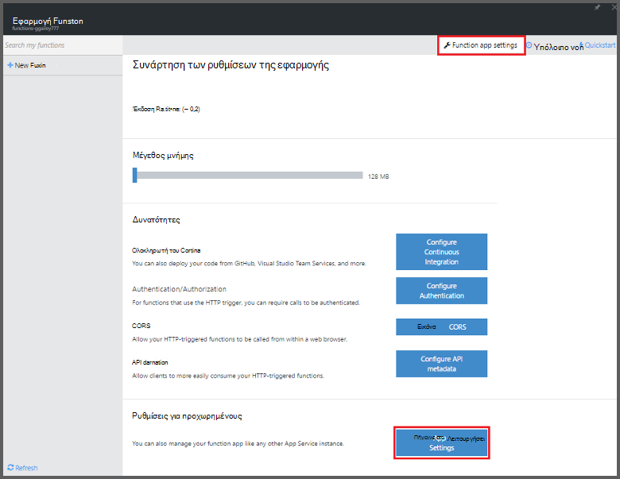
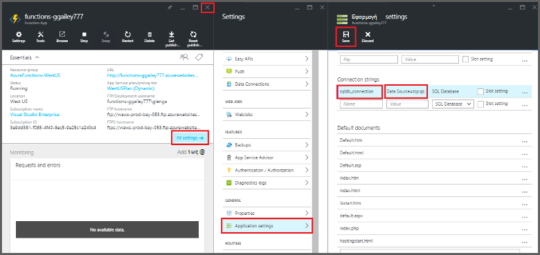
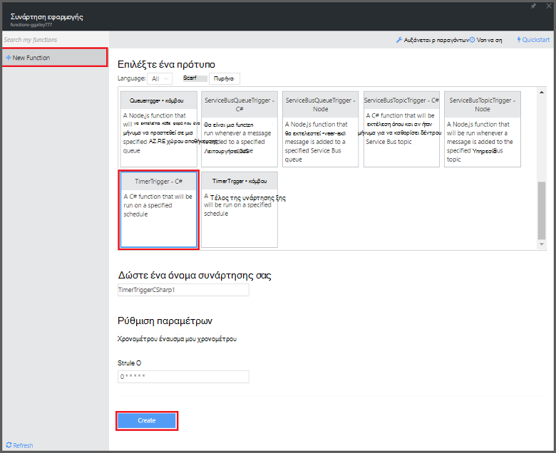

<properties
   pageTitle="Χρησιμοποιήστε συναρτήσεις Azure για να εκτελέσετε μια προγραμματισμένη εργασία εκκαθάρισης | Microsoft Azure"
   description="Χρησιμοποιήστε συναρτήσεις Azure Δημιουργήστε μια συνάρτηση C# που εκτελείται με βάση χρονοδιακόπτη συμβάν."
   services="functions"
   documentationCenter="na"
   authors="ggailey777"
   manager="erikre"
   editor=""
   tags=""
   />

<tags
   ms.service="functions"
   ms.devlang="multiple"
   ms.topic="article"
   ms.tgt_pltfrm="multiple"
   ms.workload="na"
   ms.date="09/26/2016"
   ms.author="glenga"/>
   
# Χρησιμοποιήστε συναρτήσεις Azure για να εκτελέσετε μια προγραμματισμένη εργασία εκκαθάρισης

Αυτό το θέμα δείχνει πώς μπορείτε να χρησιμοποιήσετε συναρτήσεις Azure για να δημιουργήσετε μια νέα συνάρτηση στο C# που εκτελείται με βάση χρονοδιακόπτη συμβάντος για να εκκαθάρισης γραμμών σε έναν πίνακα βάσης δεδομένων. Τη νέα συνάρτηση δημιουργείται με βάση ένα πρότυπο προκαθορισμένες στην πύλη του Azure συναρτήσεις. Για να υποστηρίζει αυτό το σενάριο, πρέπει επίσης να ορίσετε μια συμβολοσειρά σύνδεσης βάσης δεδομένων ως υπηρεσία εφαρμογή ρύθμισης στην εφαρμογή συνάρτηση. 

## Προαπαιτούμενα στοιχεία 

Για να δημιουργήσετε μια συνάρτηση, πρέπει να έχετε ένα λογαριασμό Azure active. Εάν δεν έχετε ήδη λογαριασμό Azure, [δωρεάν λογαριασμοί είναι διαθέσιμες](https://azure.microsoft.com/free/).

Αυτό το θέμα παρουσιάζει μια εντολή Transact-SQL που εκτελεί μια λειτουργία εκκαθάρισης μαζικής στον πίνακα με το όνομα *TodoItems* σε μια βάση δεδομένων SQL. Αυτός ο πίνακας ίδιο TodoItems δημιουργείται όταν ολοκληρωθεί το [πρόγραμμα εκμάθησης γρήγορη έναρξη εφαρμογές του Mobile Azure εφαρμογής υπηρεσίας](../app-service-mobile/app-service-mobile-ios-get-started.md). Μπορείτε επίσης να χρησιμοποιήσετε ένα δείγμα βάσης δεδομένων, εάν επιλέξετε να χρησιμοποιήσετε έναν διαφορετικό πίνακα, θα χρειαστεί να τροποποιήσετε την εντολή.

Μπορείτε να λάβετε τη συμβολοσειρά σύνδεσης που χρησιμοποιείται από έναν υπολογιστή στο παρασκήνιο εφαρμογή Mobile στην πύλη σε **όλες τις ρυθμίσεις** > **Ρυθμίσεις εφαρμογής** > **συμβολοσειρές σύνδεσης** > **Εμφάνιση τιμών της συμβολοσειράς σύνδεσης** > **MS_TableConnectionString**. Μπορείτε επίσης να λάβετε τη συμβολοσειρά σύνδεσης απευθείας από μια βάση δεδομένων SQL στην πύλη σε **όλες τις ρυθμίσεις** > **Ιδιότητες** > **Εμφάνιση συμβολοσειρές σύνδεσης βάσης δεδομένων** > **ADO.NET (έλεγχος ταυτότητας SQL)**.

Αυτό το σενάριο χρησιμοποιεί μια λειτουργία μαζικής σε σχέση με τη βάση δεδομένων. Για να τις λειτουργίες CRUD συνάρτηση διαδικασία μεμονωμένα σε έναν πίνακα εφαρμογές του Mobile, θα πρέπει να μπορείτε να χρησιμοποιήσετε αντί για αυτό σύνδεσης πίνακα Mobile.

## Ορίστε μια συμβολοσειρά σύνδεσης βάσης δεδομένων SQL στην εφαρμογή συνάρτησης

Μια εφαρμογή συνάρτηση φιλοξενεί την εκτέλεση του συναρτήσεων στο Azure. Είναι βέλτιστη πρακτική για την αποθήκευση συμβολοσειρών σύνδεσης και άλλες απόρρητο στις ρυθμίσεις εφαρμογής των συνάρτηση. Αυτό δεν επιτρέπει τυχαίες αποκάλυψης κατά τον κωδικό συνάρτηση τελειώνει προς τα επάνω σε μια repo κάπου. 

1. Μεταβείτε στην [πύλη του Azure συναρτήσεις](https://functions.azure.com/signin) και πραγματοποιήστε είσοδο με το λογαριασμό σας Azure.

2. Εάν έχετε μια υπάρχουσα εφαρμογή συνάρτηση για να χρησιμοποιήσετε, επιλέξτε την από **τις εφαρμογές σας συνάρτηση** , στη συνέχεια, κάντε κλικ στην επιλογή **Άνοιγμα**. Για να δημιουργήσετε μια νέα εφαρμογή συνάρτηση, πληκτρολογήστε ένα μοναδικό **όνομα** για τη νέα εφαρμογή συνάρτηση ή αποδεχτείτε αυτήν που δημιουργήθηκε, επιλέξτε την προτιμώμενη **περιοχή**και κατόπιν κάντε κλικ στην επιλογή **Δημιουργία + γρήγορα αποτελέσματα**. 

3. Στην εφαρμογή της συνάρτησης, κάντε κλικ στην επιλογή **Ρυθμίσεις εφαρμογής συνάρτηση** > **ρυθμίσεων εφαρμογής υπηρεσίας**. 

    

4. Στην εφαρμογή της συνάρτησης, κάντε κλικ στην επιλογή **όλες οι ρυθμίσεις**, κάντε κύλιση προς τα κάτω, **Ρυθμίσεις εφαρμογής**, στη συνέχεια, στην περιοχή Τύπος **συμβολοσειρές σύνδεσης** `sqldb_connection` για το **όνομα**, επικολλήστε τη συμβολοσειρά σύνδεσης σε **τιμή**, κάντε κλικ στην επιλογή **Αποθήκευση**, στη συνέχεια, κλείστε τη συνάρτηση blade εφαρμογής για να επιστρέψετε στην πύλη του συναρτήσεις.

    

Τώρα, μπορείτε να προσθέσετε το C# συνάρτηση κώδικα που συνδέεται με τη βάση δεδομένων SQL.

## Δημιουργία μιας συνάρτησης ενεργοποίησε χρονόμετρο από το πρότυπο

1. Στην εφαρμογή της συνάρτησης, κάντε κλικ στο κουμπί **+ νέα συνάρτηση** > **TimerTrigger - C#** > **Δημιουργία**. Αυτό δημιουργεί μια συνάρτηση με ένα προεπιλεγμένο όνομα που εκτελείται στο προεπιλεγμένο χρονοδιάγραμμα μία φορά κάθε λεπτού. 

    

2. Στο παράθυρο " **κώδικας** " στην καρτέλα " **Ανάπτυξη** ", προσθέστε τις ακόλουθες αναφορές συγκρότησης στο επάνω μέρος του υπάρχοντος κώδικα συνάρτηση:

        #r "System.Configuration"
        #r "System.Data"

3. Προσθέστε τα ακόλουθα `using` προτάσεων για τη συνάρτηση:

        using System.Configuration;
        using System.Data.SqlClient;
        using System.Threading.Tasks; 

4. Αντικατάσταση της υπάρχουσας συνάρτησης **Εκτέλεση** με τον ακόλουθο κώδικα:

        public static async Task Run(TimerInfo myTimer, TraceWriter log)
        {
            var str = ConfigurationManager.ConnectionStrings["sqldb_connection"].ConnectionString;
            using (SqlConnection conn = new SqlConnection(str))
            {
                conn.Open();
                var text = "DELETE from dbo.TodoItems WHERE Complete='True'";
                using (SqlCommand cmd = new SqlCommand(text, conn))
                {
                    // Execute the command and log the # rows deleted.
                    var rows = await cmd.ExecuteNonQueryAsync();
                    log.Info($"{rows} rows were deleted");
                }
            }
        }

5. Κάντε κλικ στην επιλογή **Αποθήκευση**, παρακολούθηση των παραθύρων **αρχεία καταγραφής** για την εκτέλεση της επόμενης συνάρτηση και, στη συνέχεια, σημειώστε τον αριθμό των γραμμών που έχουν διαγραφεί από τον πίνακα TodoItems.

6. (Προαιρετικό) Χρησιμοποιώντας την [εφαρμογή γρήγορη έναρξη εφαρμογές του Mobile](../app-service-mobile/app-service-mobile-ios-get-started.md), η σήμανση πρόσθετα στοιχεία, όπως "ολοκληρώθηκε", στη συνέχεια, επιστρέψτε στο παράθυρο **αρχείων καταγραφής** και παρακολούθησης τον ίδιο αριθμό γραμμών διαγραφή από τη συνάρτηση κατά τη διάρκεια της εκτέλεσης του επόμενου. 

##Επόμενα βήματα

Ανατρέξτε στα παρακάτω θέματα για περισσότερες πληροφορίες σχετικά με τις συναρτήσεις Azure.

+ [Αναφορά προγραμματιστών Azure συναρτήσεις](functions-reference.md)  
Αναφορά προγραμματιστή για κωδικοποίηση συναρτήσεις και τον ορισμό εναύσματα και συνδέσεις.
+ [Δοκιμές Azure συναρτήσεις](functions-test-a-function.md)  
Περιγράφει διάφορα εργαλεία και τεχνικές για σκοπούς δοκιμής σας συναρτήσεις.
+ [Τρόπος για να κλιμακωθεί Azure συναρτήσεις](functions-scale.md)  
Ασχολείται με προγράμματα υπηρεσίας διαθέσιμη με το Azure συναρτήσεις, όπως το πρόγραμμα υπηρεσιών δυναμικής και πώς μπορείτε να επιλέξετε το σωστό πρόγραμμα.  

[AZURE.INCLUDE [Getting Started Note](../../includes/functions-get-help.md)]