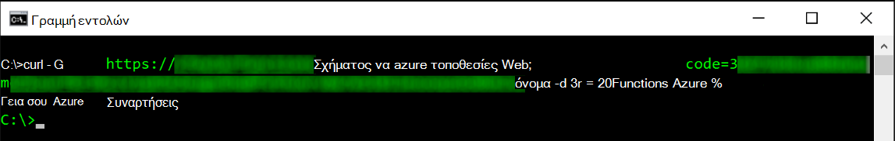
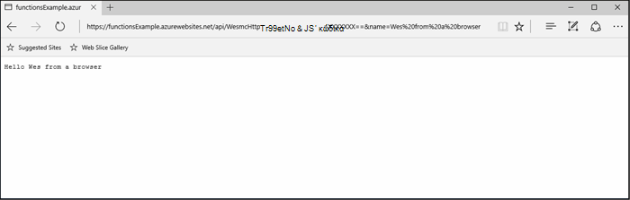
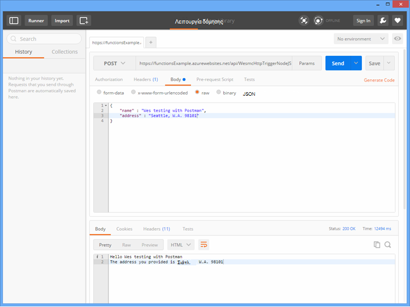
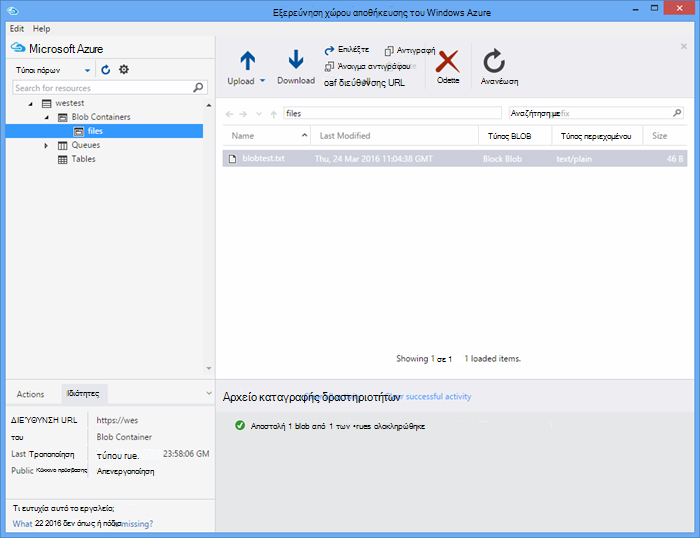

<properties
   pageTitle="Δοκιμές Azure συναρτήσεις | Microsoft Azure"
   description="Ελέγξτε τις λειτουργίες του Azure χρησιμοποιώντας Postman, καμπύλη και Node.js."
   services="functions"
   documentationCenter="na"
   authors="wesmc7777"
   manager="erikre"
   editor=""
   tags=""
   keywords="Azure συναρτήσεις, συναρτήσεις, Επεξεργασία συμβάντος, webhooks, δυναμική υπολογισμού, χωρίς αρχιτεκτονική, δοκιμές"/>

<tags
   ms.service="functions"
   ms.devlang="multiple"
   ms.topic="article"
   ms.tgt_pltfrm="multiple"
   ms.workload="na"
   ms.date="08/19/2016"
   ms.author="wesmc"/>

# Δοκιμές Azure συναρτήσεις

## Επισκόπηση

Σε αυτό το πρόγραμμα εκμάθησης, θα σας θα καθοδηγήσει διαφορετικές μεθόδους για σκοπούς δοκιμής συναρτήσεις. Θα σας θα ορίσετε μια συνάρτηση έναυσμα http που αποδέχεται είσοδο μέσω μιας παραμέτρου συμβολοσειράς ερωτήματος ή το σώμα της αίτησης. Ο προεπιλεγμένος κωδικός πρότυπο **Συνάρτηση Node.js HttpTrigger** υποστηρίζει ένα `name` παραμέτρου συμβολοσειράς ερωτήματος. Θα προσθέσουμε επίσης κώδικα για την υποστήριξη μαζί με αυτήν την παράμετρο `address` πληροφορίες για το χρήστη στο σώμα της αίτησης.

## Δημιουργία μιας συνάρτησης για σκοπούς δοκιμής

Για τις περισσότερες αυτής της εκμάθησης, θα χρησιμοποιήσουμε μια έχουν τροποποιηθεί ελαφρώς έκδοση του προτύπου **Συνάρτηση Nodejs HttpTrigger** που είναι διαθέσιμα κατά τη δημιουργία μιας νέας συνάρτησης.  Μπορείτε να δείτε τη [Δημιουργία του πρώτου πρόγραμμα εκμάθησης συνάρτηση Azure](functions-create-first-azure-function.md) Εάν χρειάζεστε βοήθεια για τη δημιουργία μιας νέας συνάρτησης.  Επιλέξτε το πρότυπο **HttpTrigger Nodejs συνάρτηση** μόνο κατά τη δημιουργία της συνάρτησης δοκιμής στην [Πύλη του Azure].

Το προεπιλεγμένο πρότυπο συνάρτηση στην ουσία είναι μια συνάρτηση κόσμο hello που αντηχήσεων ξανά το όνομα από την αίτηση σώμα ή το ερώτημα συμβολοσειρά παράμετρο, `name=<your name>`.  Θα ενημερώσουμε τον κωδικό σας επιτρέπει επίσης να παρέχετε το όνομα και μια διεύθυνση ως JSON περιεχομένου στο σώμα της αίτησης. Στη συνέχεια, η συνάρτηση θα echo αυτά τα πίσω στον υπολογιστή-πελάτη όταν είναι διαθέσιμες.   

Ενημερώστε τη συνάρτηση με τον ακόλουθο κώδικα που θα χρησιμοποιήσουμε για σκοπούς δοκιμής:

    module.exports = function(context, req) {
        context.log("Node.js HTTP trigger function processed a request. RequestUri=%s", req.originalUrl);
        context.log("Request Headers = " + JSON.stringify(req.headers));    
    
        if (req.query.name || (req.body && req.body.name)) {
            if (typeof req.query.name != "undefined") {
                context.log("Name was provided as a query string param..."); 
                ProcessNewUserInformation(context, req.query.name);
            }
            else {
                context.log("Processing user info from request body..."); 
                ProcessNewUserInformation(context, req.body.name, req.body.address);
            }
        }
        else {
            context.res = {
                status: 400,
                body: "Please pass a name on the query string or in the request body"
            };
        }
        context.done();
    };
    
    function ProcessNewUserInformation(context, name, address)
    {    
        context.log("Processing User Information...");            
        context.log("name = " + name);            
        echoString = "Hello " + name;
        
        if (typeof address != "undefined")
        {
            echoString += "\n" + "The address you provided is " + address;
            context.log("address = " + address);            
        }
        
        context.res = {
                // status: 200, /* Defaults to 200 */
                body: echoString
            };
    }

## Δοκιμάστε μια συνάρτηση με εργαλεία

### Δοκιμή με καμπύλη

Συχνά κατά τη δοκιμή λογισμικού, δεν είναι απαραίτητο για την αναζήτηση οποιαδήποτε περαιτέρω από τη γραμμή εντολών για τον εντοπισμό σφαλμάτων της εφαρμογής σας, αυτό είναι διαφορετικό δεν με συναρτήσεις.

Για να ελέγξετε τη συνάρτηση παραπάνω, αντιγράψτε τη **Διεύθυνση Url συνάρτηση** από την πύλη. Θα έχει την εξής μορφή: 

    https://<Your Function App>.azurewebsites.net/api/<Your Function Name>?code=<your access code>
    
Αυτή είναι η διεύθυνση Url για την ενεργοποίηση του συνάρτηση, θα σας να το ελέγξετε, χρησιμοποιώντας την εντολή καμπύλη στη γραμμή εντολών για να κάνετε λήψη μιας (`-G` ή `--get`) αίτηση σε σχέση με τη συνάρτηση:

    curl -G https://<Your Function App>.azurewebsites.net/api/<Your Function Name>?code=<your access code>
    
Συγκεκριμένο παράδειγμα παραπάνω απαιτεί μιας παραμέτρου συμβολοσειράς ερωτήματος που μπορούν να περάσουν ως δεδομένα (`-d`) στην εντολή καμπύλη:

    curl -G https://<Your Function App>.azurewebsites.net/api/<Your Function Name>?code=<your access code> -d name=<Enter a name here>
    
Εισαγάγετε επίσκεψη και θα δείτε το αποτέλεσμα της συνάρτησης στη γραμμή εντολών.

Στο παράθυρο **αρχεία καταγραφής από την** πύλη, παρόμοιο με το εξής αποτέλεσμα καταγράφεται κατά την εκτέλεση της συνάρτησης:

    2016-04-05T21:55:09  Welcome, you are now connected to log-streaming service.
    2016-04-05T21:55:30.738 Function started (Id=ae6955da-29db-401a-b706-482fcd1b8f7a)
    2016-04-05T21:55:30.738 Node.js HTTP trigger function processed a request. RequestUri=https://functionsExample.azurewebsites.net/api/HttpTriggerNodeJS1?code=XXXXXXX&name=Azure Functions
    2016-04-05T21:55:30.738 Function completed (Success, Id=ae6955da-29db-401a-b706-482fcd1b8f7a)

### Δοκιμάστε με ένα πρόγραμμα περιήγησης

Συναρτήσεις που δεν απαιτούν παραμέτρους ή να το μόνο που χρειάζεται παραμέτρους συμβολοσειράς ερωτήματος, μπορεί να ελεγχθεί χρησιμοποιώντας ένα πρόγραμμα περιήγησης.

Για να ελέγξετε τη συνάρτηση ορίσαμε παραπάνω, αντιγράψτε τη **Διεύθυνση Url συνάρτηση** από την πύλη. Θα έχει την εξής μορφή:

    https://<Your Function App>.azurewebsites.net/api/<Your Function Name>?code=<your access code>

Προσάρτηση το `name` ερωτήματος παραμέτρου συμβολοσειράς ως εξής, χρησιμοποιώντας ένα πραγματικό όνομα για το `<Enter a name here>` σύμβολο κράτησης θέσης.

    https://<Your Function App>.azurewebsites.net/api/<Your Function Name>?code=<your access code>&name=<Enter a name here>

Επικολλήστε τη διεύθυνση URL στο πρόγραμμα περιήγησης και θα πρέπει να λαμβάνετε μια απάντηση παρόμοια με τα εξής.

Στο παράθυρο **αρχεία καταγραφής από την** πύλη, παρόμοιο με το εξής αποτέλεσμα καταγράφεται κατά την εκτέλεση της συνάρτησης:

    2016-03-23T07:34:59  Welcome, you are now connected to log-streaming service.
    2016-03-23T07:35:09.195 Function started (Id=61a8c5a9-5e44-4da0-909d-91d293f20445)
    2016-03-23T07:35:10.338 Node.js HTTP trigger function processed a request. RequestUri=https://functionsExample.azurewebsites.net/api/WesmcHttpTriggerNodeJS1?code=XXXXXXXXXX==&name=Wes from a browser
    2016-03-23T07:35:10.338 Request Headers = {"cache-control":"max-age=0","connection":"Keep-Alive","accept":"text/html","accept-encoding":"gzip","accept-language":"en-US"}
    2016-03-23T07:35:10.338 Name was provided as a query string param.
    2016-03-23T07:35:10.338 Processing User Information...
    2016-03-23T07:35:10.369 Function completed (Success, Id=61a8c5a9-5e44-4da0-909d-91d293f20445)

### Δοκιμάστε με Postman

Το εργαλείο που συνιστάται να δοκιμάσετε οι περισσότερες από τις συναρτήσεις είναι Postman. Για να εγκαταστήσετε Postman, ανατρέξτε στο θέμα [Λήψη Postman](https://www.getpostman.com/). Postman παρέχει έλεγχο πολλά περισσότερα χαρακτηριστικά του μια αίτηση HTTP.

> [AZURE.TIP] Χρησιμοποιήστε το πρόγραμμα-πελάτη ΥΠΌΛΟΙΠΑ στις οποίες είστε εξοικειωμένοι. Ακολουθούν μερικές εναλλακτικές λύσεις για Postman:  
> 
> * [Fiddler](http://www.telerik.com/fiddler)  
> * [Πόδι ζώου](https://luckymarmot.com/paw)  

Για να ελέγξετε τη συνάρτηση σε έναν οργανισμό αίτηση στο Postman: 

1. Εκκίνηση Postman από το κουμπί **εφαρμογών** στο επάνω αριστερό μέρος γωνία του παράθυρο του προγράμματος περιήγησης Chrome.
2. Αντιγραφή διεύθυνσης **Url συνάρτηση** και επικολλήστε την σε Postman. Περιλαμβάνει την παράμετρο συμβολοσειράς ερωτήματος κωδικό πρόσβασης.
3. Αλλάξτε τη μέθοδο HTTP **Δημοσίευση**.
4. Κάντε κλικ στο **σώμα** > **ανεπεξέργαστα** και να προσθέσετε σώμα αίτησης JSON παρόμοια με τα εξής:

        {
            "name" : "Wes testing with Postman",
            "address" : "Seattle, W.A. 98101"
        }

5. Κάντε κλικ στο κουμπί **Αποστολή**.

Η παρακάτω εικόνα εμφανίζει δοκιμής το παράδειγμα συνάρτησης απλό Αντήχηση σε αυτό το πρόγραμμα εκμάθησης. 

Στο παράθυρο **αρχεία καταγραφής από την** πύλη, παρόμοιο με το εξής αποτέλεσμα καταγράφεται κατά την εκτέλεση της συνάρτησης:

    2016-03-23T08:04:51  Welcome, you are now connected to log-streaming service.
    2016-03-23T08:04:57.107 Function started (Id=dc5db8b1-6f1c-4117-b5c4-f6b602d538f7)
    2016-03-23T08:04:57.763 Node.js HTTP trigger function processed a request. RequestUri=https://functions841def78.azurewebsites.net/api/WesmcHttpTriggerNodeJS1?code=XXXXXXXXXX==
    2016-03-23T08:04:57.763 Request Headers = {"cache-control":"no-cache","connection":"Keep-Alive","accept":"*/*","accept-encoding":"gzip","accept-language":"en-US"}
    2016-03-23T08:04:57.763 Processing user info from request body...
    2016-03-23T08:04:57.763 Processing User Information...
    2016-03-23T08:04:57.763 name = Wes testing with Postman
    2016-03-23T08:04:57.763 address = Seattle, W.A. 98101
    2016-03-23T08:04:57.795 Function completed (Success, Id=dc5db8b1-6f1c-4117-b5c4-f6b602d538f7)
    
### Δοκιμάστε ένα έναυσμα blob χρησιμοποιώντας την Εξερεύνηση χώρου αποθήκευσης

Μπορείτε να δοκιμάσετε μια συνάρτηση έναυσμα blob χρησιμοποιώντας την [Εξερεύνηση χώρου αποθήκευσης του Microsoft Azure](http://storageexplorer.com/).

1. Στην [Πύλη του Azure] για την εφαρμογή σας συναρτήσεις, Δημιουργία νέου C#, F # ή κόμβο blob έναυσμα συνάρτησης. Ορίστε τη διαδρομή για την παρακολούθηση της στο όνομα του κοντέινερ αντικειμένων blob. Για παράδειγμα:

        files

2. Κάντε κλικ στην επιλογή το **+** κουμπί για να επιλέξετε ή να δημιουργήσετε το λογαριασμό χώρου αποθήκευσης που θέλετε να χρησιμοποιήσετε. Στη συνέχεια, κάντε κλικ στην επιλογή **Δημιουργία**.

3. Δημιουργήστε ένα αρχείο κειμένου με το ακόλουθο κείμενο και να το αποθηκεύσετε:

        A text file for blob trigger function testing.

4. Εκτελέστε την [Εξερεύνηση χώρου αποθήκευσης του Microsoft Azure](http://storageexplorer.com/) και συνδεθείτε στο κοντέινερ αντικειμένων blob του λογαριασμού χώρου αποθήκευσης που παρακολουθούνται.

5. Κάντε κλικ στο κουμπί **Αποστολή** και αποστείλετε το αρχείο κειμένου.

    

    Ο προεπιλεγμένος blob έναυσμα συνάρτηση κωδικός θα αναφέρει την επεξεργασία του blob στα αρχεία καταγραφής:

        2016-03-24T11:30:10  Welcome, you are now connected to log-streaming service.
        2016-03-24T11:30:34.472 Function started (Id=739ebc07-ff9e-4ec4-a444-e479cec2e460)
        2016-03-24T11:30:34.472 C# Blob trigger function processed: A text file for blob trigger function testing.
        2016-03-24T11:30:34.472 Function completed (Success, Id=739ebc07-ff9e-4ec4-a444-e479cec2e460)

## Δοκιμή μιας συνάρτησης μέσα σε συναρτήσεις

### Δοκιμή με την πύλη συναρτήσεις "Εκτέλεση"

Η πύλη παρέχει ένα κουμπί **Εκτέλεση** που σας επιτρέπουν να κάνετε ορισμένες περιορισμένη δοκιμές. Μπορείτε να παράσχετε μια πρόσκληση σε σώμα χρησιμοποιώντας το κουμπί "Εκτέλεση", αλλά, δεν μπορείτε να δώσετε παραμέτρους συμβολοσειράς ερωτήματος ή να ενημερώσετε κεφαλίδες αίτησης.

Δοκιμή της συνάρτησης έναυσμα HTTP που δημιουργήσαμε νωρίτερα, προσθέτοντας μια συμβολοσειρά JSON παρόμοιο με το ακόλουθο στο πεδίο **σώμα αίτησης** και, στη συνέχεια, κάντε κλικ στο κουμπί **Εκτέλεση** .

    {
        "name" : "Wes testing Run button",
        "address" : "USA"
    } 

Στο παράθυρο **αρχεία καταγραφής από την** πύλη, παρόμοιο με το εξής αποτέλεσμα καταγράφεται κατά την εκτέλεση της συνάρτησης:

    2016-03-23T08:03:12  Welcome, you are now connected to log-streaming service.
    2016-03-23T08:03:17.357 Function started (Id=753a01b0-45a8-4125-a030-3ad543a89409)
    2016-03-23T08:03:18.697 Node.js HTTP trigger function processed a request. RequestUri=https://functions841def78.azurewebsites.net/api/wesmchttptriggernodejs1
    2016-03-23T08:03:18.697 Request Headers = {"connection":"Keep-Alive","accept":"*/*","accept-encoding":"gzip","accept-language":"en-US"}
    2016-03-23T08:03:18.697 Processing user info from request body...
    2016-03-23T08:03:18.697 Processing User Information...
    2016-03-23T08:03:18.697 name = Wes testing Run button
    2016-03-23T08:03:18.697 address = USA
    2016-03-23T08:03:18.744 Function completed (Success, Id=753a01b0-45a8-4125-a030-3ad543a89409)

### Δοκιμή με ένα έναυσμα χρονομέτρησης

Ορισμένες από τις συναρτήσεις, δεν είναι δυνατό να ελεγχθεί πραγματικά με τα εργαλεία που αναφέρονται προηγουμένως. Για παράδειγμα, μια ουρά έναυσμα συνάρτηση που εκτελείται όταν ένα μήνυμα ενσωματώνεται στο [Χώρο αποθήκευσης ουρά Azure](../storage/storage-dotnet-how-to-use-queues.md). Μπορείτε πάντα να συντάξετε κώδικα για να απορρίψετε ένα μήνυμα σε ουρά σας και ένα παράδειγμα σε ένα έργο κονσόλας παρέχεται παρακάτω. Ωστόσο, υπάρχει μια άλλη προσέγγιση, μπορείτε να χρησιμοποιήσετε για να ελέγξετε με συναρτήσεις απευθείας.  

Θα μπορούσατε να χρησιμοποιήσετε ένα έναυσμα χρονόμετρο έχουν ρυθμιστεί με μια ουρά εξόδου σύνδεσης. Αυτός ο κώδικας εναύσματος χρονόμετρο, στη συνέχεια, να συντάξετε δοκιμαστικών μηνυμάτων στην ουρά. Αυτή η ενότητα θα καθοδηγήσει μέσω ένα παράδειγμα. 

Για περισσότερες λεπτομερείς πληροφορίες σχετικά με τη χρήση συνδέσεων με συναρτήσεις Azure, ανατρέξτε στο άρθρο [αναφορά προγραμματιστών Azure συναρτήσεις](functions-reference.md). 

#### Δημιουργία εναύσματος ουρά για σκοπούς δοκιμής

Για μια επίδειξη αυτήν την προσέγγιση, θα πρώτα δημιουργούμε μια συνάρτηση έναυσμα ουρά που θέλουμε να ελέγξετε για μια ουρά με το όνομα `queue-newusers`. Αυτή η συνάρτηση θα επεξεργασία πληροφοριών ονομάτων και διευθύνσεων για έναν νέο χρήστη αποτεθεί στο χώρο αποθήκευσης Azure ουρά. 

> [AZURE.NOTE] Εάν χρησιμοποιείτε ένα όνομα διαφορετικό ουρά, βεβαιωθείτε ότι το όνομα που χρησιμοποιείτε συμμορφώνεται με τους κανόνες [ονοματοθεσίας ουρές και μετα-δεδομένων](https://msdn.microsoft.com/library/dd179349.aspx) .  Διαφορετικά, θα λάβετε έναν κωδικό κατάστασης HTTP 400: ακατάλληλη αίτηση. 

1. Στην [Πύλη του Azure] για την εφαρμογή σας συναρτήσεις, κάντε κλικ στην επιλογή **Νέα συνάρτηση** > **QueueTrigger - C#**.
2. Πληκτρολογήστε το όνομα ουρά να παρακολουθούνται από τη συνάρτηση ουρά 

        queue-newusers 

3. Κάντε κλικ στην επιλογή το **+** (Προσθήκη) κουμπί για να επιλέξετε ή να δημιουργήσετε το λογαριασμό χώρου αποθήκευσης που θέλετε να χρησιμοποιήσετε. Στη συνέχεια, κάντε κλικ στην επιλογή **Δημιουργία**.
4. Αφήστε αυτό το παράθυρο περιήγησης πύλης ανοίξει, ώστε να μπορείτε να παρακολουθείτε τις εγγραφές για τον κωδικό προεπιλεγμένη ουρά συνάρτηση πρότυπο.

#### Δημιουργήστε ένα έναυσμα χρονόμετρο για να απορρίψετε ένα μήνυμα στην ουρά

1. Ανοίξτε την [Πύλη Azure] σε νέο παράθυρο του προγράμματος περιήγησης και μεταβείτε στην εφαρμογή της συνάρτησης.
2. Κάντε κλικ στην επιλογή **νέα συνάρτηση** > **TimerTrigger - C#**. Πληκτρολογήστε μια παράσταση cron για να ορίσετε πόσο συχνά το χρονόμετρο κώδικας θα εκτελείται δοκιμές σας συνάρτηση ουρά. Στη συνέχεια, κάντε κλικ στην επιλογή **Δημιουργία**. Εάν θέλετε η δοκιμή για να εκτελέσετε κάθε 30 δευτερόλεπτα, μπορείτε να χρησιμοποιήσετε την ακόλουθη [παράσταση CRON](https://wikipedia.org/wiki/Cron#CRON_expression):

        */30 * * * * *

2. Κάντε κλικ στην καρτέλα **ενσωματώσουν** για το νέο σας έναυσμα χρονόμετρο.
3. Στην περιοχή **εξόδου**, κάντε κλικ στο κουμπί **+ νέα εξόδου** . Στη συνέχεια, κάντε κλικ στην επιλογή **ουρά** και του κουμπιού **επιλογής** .
4. Σημειώστε το όνομα που χρησιμοποιείτε για το **αντικείμενο ουράς μήνυμα** που θα χρησιμοποιήσετε αυτό τον κώδικα συνάρτηση timer.

        myQueue

4. Πληκτρολογήστε το όνομα ουράς όπου θα σταλεί το μήνυμα: 

        queue-newusers 

3. Κάντε κλικ στην επιλογή το **+** (Προσθήκη) κουμπί για να επιλέξετε το λογαριασμό χώρου αποθήκευσης που έχετε χρησιμοποιήσει ήδη με το έναυσμα ουρά. Στη συνέχεια, κάντε κλικ στην επιλογή **Αποθήκευση**.
4. Κάντε κλικ στην καρτέλα " **Ανάπτυξη** " για το έναυσμα χρονόμετρο.
5. Μπορείτε να χρησιμοποιήσετε τον παρακάτω κώδικα για τη συνάρτηση timer C#, με την προϋπόθεση ότι χρησιμοποιείται το ίδιο μήνυμα αντικειμένου όνομα ουράς φαίνεται παραπάνω. Στη συνέχεια, κάντε κλικ στην επιλογή **Αποθήκευση**

        using System;
        
        public static void Run(TimerInfo myTimer, out String myQueue, TraceWriter log)
        {
            String newUser = 
            "{\"name\":\"User testing from C# timer function\",\"address\":\"XYZ\"}";
        
            log.Verbose($"C# Timer trigger function executed at: {DateTime.Now}");   
            log.Verbose($"{newUser}");   
            
            myQueue = newUser;
        }

Σε αυτό το σημείο συνάρτηση timer C# θα εκτελέσει κάθε 30 δευτερόλεπτα, εάν χρησιμοποιήσατε την παράσταση cron παράδειγμα. Τα αρχεία καταγραφής για τη συνάρτηση timer θα αναφέρει κάθε εκτέλεσης:

    2016-03-24T10:27:02  Welcome, you are now connected to log-streaming service.
    2016-03-24T10:27:30.004 Function started (Id=04061790-974f-4043-b851-48bd4ac424d1)
    2016-03-24T10:27:30.004 C# Timer trigger function executed at: 3/24/2016 10:27:30 AM
    2016-03-24T10:27:30.004 {"name":"User testing from C# timer function","address":"XYZ"}
    2016-03-24T10:27:30.004 Function completed (Success, Id=04061790-974f-4043-b851-48bd4ac424d1)

Στο παράθυρο του προγράμματος περιήγησης για τη συνάρτηση ουρά, θα δείτε το κάθε μήνυμα που υποβάλλεται σε επεξεργασία:

    2016-03-24T10:27:06  Welcome, you are now connected to log-streaming service.
    2016-03-24T10:27:30.607 Function started (Id=e304450c-ff48-44dc-ba2e-1df7209a9d22)
    2016-03-24T10:27:30.607 C# Queue trigger function processed: {"name":"User testing from C# timer function","address":"XYZ"}
    2016-03-24T10:27:30.607 Function completed (Success, Id=e304450c-ff48-44dc-ba2e-1df7209a9d22)
    
## Δοκιμάστε μια συνάρτηση με κώδικα

### Δοκιμάστε μια συνάρτηση έναυσμα HTTP με κωδικό: Node.js

Μπορείτε να χρησιμοποιήσετε κωδικό Node.js να εκτελεί μια αίτηση http για να ελέγξετε την συνάρτηση Azure. 

Βεβαιωθείτε ότι για να ορίσετε:

- Η `host` στις επιλογές αίτηση υπηρεσία παροχής φιλοξενίας εφαρμογή συνάρτησης
- Το όνομα συνάρτησης στην το `path`.
- Τον κωδικό πρόσβασης (`<your code>`) στο το `path`.

Παράδειγμα κώδικα:

    var http = require("http");
    
    var nameQueryString = "name=Wes%20Query%20String%20Test%20From%20Node.js";
    
    var nameBodyJSON = {
        name : "Wes testing with Node.JS code",
        address : "Dallas, T.X. 75201"
    };
    
    var bodyString = JSON.stringify(nameBodyJSON);
    
    var options = {
      host: "functions841def78.azurewebsites.net",
      //path: "/api/HttpTriggerNodeJS2?code=sc1wt62opn7k9buhrm8jpds4ikxvvj42m5ojdt0p91lz5jnhfr2c74ipoujyq26wab3wk5gkfbt9&" + nameQueryString,
      path: "/api/HttpTriggerNodeJS2?code=sc1wt62opn7k9buhrm8jpds4ikxvvj42m5ojdt0p91lz5jnhfr2c74ipoujyq26wab3wk5gkfbt9",
      method: "POST",
      headers : {
          "Content-Type":"application/json",
          "Content-Length": Buffer.byteLength(bodyString)
        }    
    };
    
    callback = function(response) {
      var str = ""
      response.on("data", function (chunk) {
        str += chunk;
      });
    
      response.on("end", function () {
        console.log(str);
      });
    }
    
    var req = http.request(options, callback);
    console.log("*** Sending name and address in body ***");
    console.log(bodyString);
    req.end(bodyString);

Αποτέλεσμα:

    C:\Users\Wesley\testing\Node.js>node testHttpTriggerExample.js
    *** Sending name and address in body ***
    {"name" : "Wes testing with Node.JS code","address" : "Dallas, T.X. 75201"}
    Hello Wes testing with Node.JS code
    The address you provided is Dallas, T.X. 75201
        
Στο παράθυρο **αρχεία καταγραφής από την** πύλη, παρόμοιο με το εξής αποτέλεσμα καταγράφεται κατά την εκτέλεση της συνάρτησης:

    2016-03-23T08:08:55  Welcome, you are now connected to log-streaming service.
    2016-03-23T08:08:59.736 Function started (Id=607b891c-08a1-427f-910c-af64ae4f7f9c)
    2016-03-23T08:09:01.153 Node.js HTTP trigger function processed a request. RequestUri=http://functionsExample.azurewebsites.net/api/WesmcHttpTriggerNodeJS1/?code=XXXXXXXXXX==
    2016-03-23T08:09:01.153 Request Headers = {"connection":"Keep-Alive","host":"functionsExample.azurewebsites.net"}
    2016-03-23T08:09:01.153 Name not provided as query string param. Checking body...
    2016-03-23T08:09:01.153 Request Body Type = object
    2016-03-23T08:09:01.153 Request Body = [object Object]
    2016-03-23T08:09:01.153 Processing User Information...
    2016-03-23T08:09:01.215 Function completed (Success, Id=607b891c-08a1-427f-910c-af64ae4f7f9c)
    

### Δοκιμάστε μια συνάρτηση έναυσμα ουρά με κωδικό: C# #

Αναφέρθηκε προηγουμένως ότι ενδέχεται να μπορείτε να δοκιμάσετε ένα έναυσμα ουρά με χρήση κώδικα για να απορρίψετε ένα μήνυμα στην ουρά σας. Το παρακάτω παράδειγμα κώδικα βασίζεται απενεργοποίηση του κώδικα C# παρουσιάζονται με το πρόγραμμα εκμάθησης [Γρήγορα αποτελέσματα με το χώρο αποθήκευσης ουρά Azure](../storage/storage-dotnet-how-to-use-queues.md) . Κωδικός για άλλες γλώσσες είναι επίσης διαθέσιμη από τη συγκεκριμένη σύνδεση.

Για να ελέγξετε αυτόν τον κωδικό σε μια εφαρμογή κονσόλας πρέπει να:

- [Ρύθμιση παραμέτρων του χώρου αποθήκευσης συμβολοσειρά σύνδεσης στο αρχείο app.config](../storage/storage-dotnet-how-to-use-queues.md#setup-a-storage-connection-string).
- Αυτός ο κωδικός δέχεται το όνομα και τη διεύθυνση για έναν νέο χρήστη ως ορίσματα της γραμμής εντολών κατά τη διάρκεια του χρόνου εκτέλεσης. Μεταβίβαση μιας `name` και `address` ως παράμετροι για την εφαρμογή. Για παράδειγμα,`C:\myQueueConsoleApp\test.exe "Wes testing queues" "in a console app"`

Παράδειγμα C# κώδικα:

    static void Main(string[] args)
    {
        string name = null;
        string address = null;
        string queueName = "queue-newusers";
        string JSON = null;

        if (args.Length > 0)
        {
            name = args[0];
        }
        if (args.Length > 1)
        {
            address = args[1];
        }

        // Retrieve storage account from connection string
        CloudStorageAccount storageAccount = CloudStorageAccount.Parse(ConfigurationManager.AppSettings["StorageConnectionString"]);

        // Create the queue client
        CloudQueueClient queueClient = storageAccount.CreateCloudQueueClient();

        // Retrieve a reference to a queue
        CloudQueue queue = queueClient.GetQueueReference(queueName);

        // Create the queue if it doesn't already exist
        queue.CreateIfNotExists();

        // Create a message and add it to the queue.
        if (name != null)
        {
            if (address != null)
                JSON = String.Format("{{\"name\":\"{0}\",\"address\":\"{1}\"}}", name, address);
            else
                JSON = String.Format("{{\"name\":\"{0}\"}}", name);
        }

        Console.WriteLine("Adding message to " + queueName + "...");
        Console.WriteLine(JSON);

        CloudQueueMessage message = new CloudQueueMessage(JSON);
        queue.AddMessage(message);
    }

Στο παράθυρο του προγράμματος περιήγησης για τη συνάρτηση ουρά, θα δείτε το κάθε μήνυμα που υποβάλλεται σε επεξεργασία:

    2016-03-24T10:27:06  Welcome, you are now connected to log-streaming service.
    2016-03-24T10:27:30.607 Function started (Id=e304450c-ff48-44dc-ba2e-1df7209a9d22)
    2016-03-24T10:27:30.607 C# Queue trigger function processed: {"name":"Wes testing queues","address":"in a console app"}
    2016-03-24T10:27:30.607 Function completed (Success, Id=e304450c-ff48-44dc-ba2e-1df7209a9d22)

<!-- URLs. -->

[Πύλη του Azure]: https://portal.azure.com
