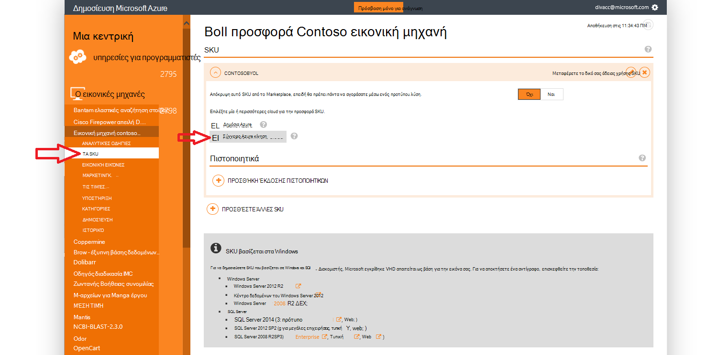
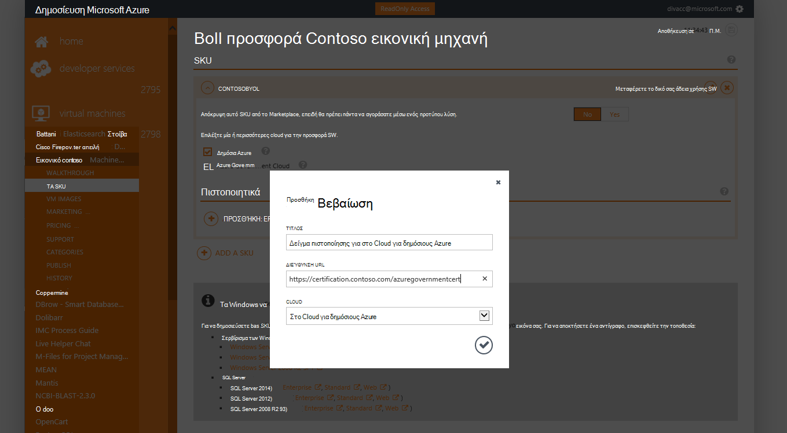
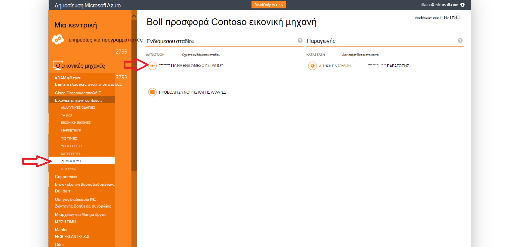
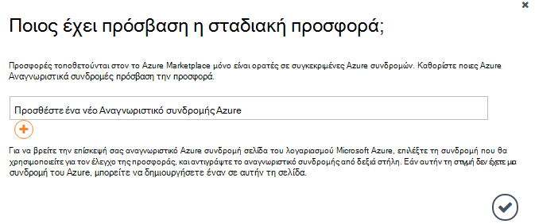
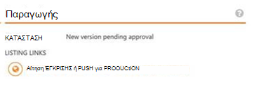

<properties
            pageTitle="Azure τεκμηρίωση για δημόσιους οργανισμούς | Microsoft Azure"
            description="Παρέχει μια σύγκριση των δυνατοτήτων και καθοδήγηση στην ανάπτυξη εφαρμογών για δημόσιους οργανισμούς Azure."
            services="Azure-Government"
            cloud="gov"
            documentationCenter=""
            authors="tsingh"
            manager="asimm"
            editor=""/>
 
<tags    ms.service="multiple"
            ms.devlang="na"
            ms.topic="article"
            ms.tgt_pltfrm="na"
            ms.workload="azure-government"
            ms.date="10/20/2016"
            ms.author="zakramer;tsingh;divacc"/> 

# Κυβέρνηση Azure Marketplace
Για τους συνεργάτες σας ενδιαφέρουν δημοσίευσης προσφορές σας με το Azure Marketplace για δημόσιους οργανισμούς, βρείτε τις παρακάτω λεπτομέρειες.

## Δημοσίευση
>[AZURE.NOTE] Εάν δεν είστε μια υπάρχουσα Azure Marketplace πιστοποιημένο συνεργάτη, ολοκληρώστε τα βήματα [εδώ](../marketplace-publishing/marketplace-publishing-getting-started.md) πριν να συνεχίσετε.

### Βήμα 1  
Συνδεθείτε στο [https://publish.windowsazure.com](https://publish.windowsazure.com)

### Βήμα 2
Κάντε κλικ στην επιλογή την προσφορά που θέλετε να δημοσιεύσετε

### Βήμα 3
Κάντε κλικ στην επιλογή **τις SKU** και κάντε κλικ στο πλαίσιο στο Cloud για δημόσιους Azure

>[AZURE.NOTE] Υποστηρίζονται μόνο SKU μεταφορά των δικών άδειας χρήσης (BYOL).  Αυτή η επιλογή δεν είναι διαθέσιμη για SKU Pay-as-You-Go (PayG).

### Βήμα 4
Κάντε κλικ στην επιλογή το + πιστοποίησης Προσθήκη σύνδεσης για να προσθέσετε συνδέσεις σε οποιαδήποτε πιστοποιητικά για την προσφορά.

### Βήμα 5
Αίτηση για μια δοκιμαστική λογαριασμού στο cloud για δημόσιους οργανισμούς Microsoft Azure για να ελέγξετε την εικόνα σας στην πύλη του δημοσίευσης: [https://azuregov.microsoft.com/trial/azuregovtrial](https://azuregov.microsoft.com/trial/azuregovtrial)

Το δικαίωμά σας ως συνεργάτης που λειτουργεί ΗΠΑ federal, κατάσταση, τοπική ή tribal οντοτήτων επαληθεύονται και θα παρέχονται επιβεβαίωσης μέσω ηλεκτρονικού ταχυδρομείου.  Δοκιμαστική το λογαριασμό σας θα είναι διαθέσιμη μέσα είναι 3-5 εργάσιμες ημέρες.

### Βήμα 6
Κάντε κλικ στην επιλογή δημοσίευση και επιλέξτε Push για ενδιάμεσου σταδίου. 

Θα σας ζητηθεί να εισαγάγετε μια συνδρομή whitelisted που έχει πρόσβαση για τη σταδιακή προσφορά. Πληκτρολογήστε το Αναγνωριστικό συνδρομής από το λογαριασμό δοκιμαστικής έκδοσης που μόλις που αποκτήθηκε Azure για δημόσιους οργανισμούς.

### Βήμα 7
Μετά την προσφορά έχει τοποθετηθεί με επιτυχία, μπορείτε να ελέγξετε την εικόνα σας από την καταγραφή να [https://portal.azure.us](https://portal.azure.us) χρησιμοποιώντας το λογαριασμό σας δοκιμαστική έκδοση του Azure για δημόσιους οργανισμούς.

### Βήμα 8
Αφού έχετε επικύρωση της εικόνας χρησιμοποιώντας τη δοκιμαστική συνδρομή, μπορείτε να κάνετε διαθέσιμη live με κλικ στην επιλογή δημοσίευση και αίτηση έγκρισης για να μεταβείτε σε παραγωγής την προσφορά. 

## Επόμενα βήματα

Για συμπληρωματικές πληροφορίες και ενημερώσεις, εγγραφείτε στο [Ιστολόγιο του Microsoft Azure για δημόσιους οργανισμούς](https://blogs.msdn.microsoft.com/azuregov/).
